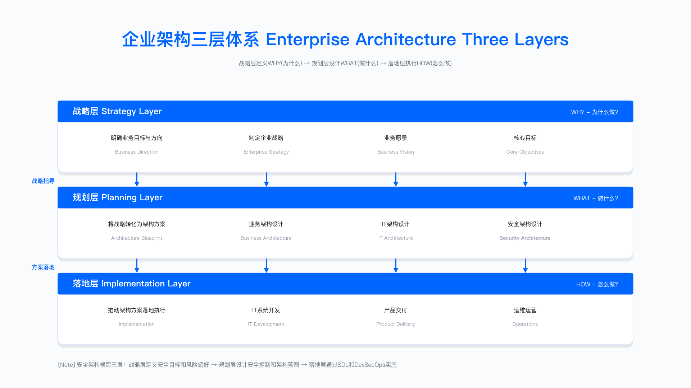
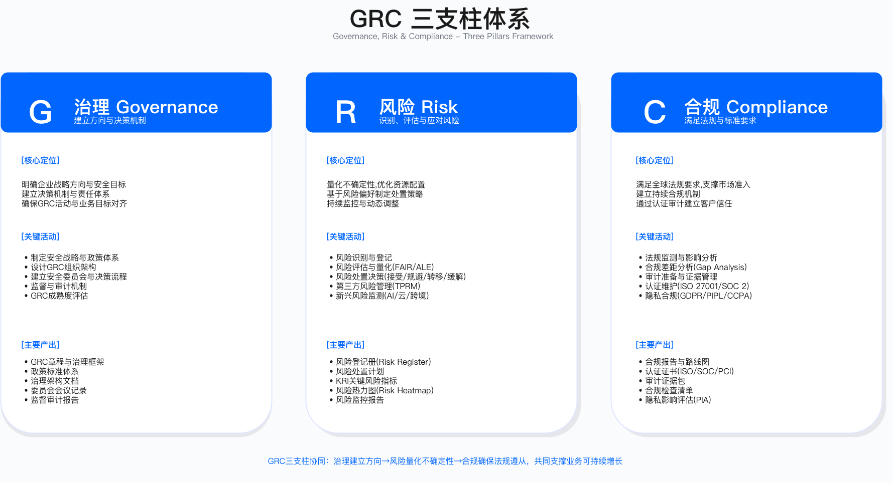

# Part 1: Foundation & Strategic Governance | 基础与战略治理

[← 返回章节导航](../) | [→ 下一部分：Part 2](../part_02_technical_architecture_infrastructure_security/)

---

## 部分定位

Part 1 建立企业安全的战略与治理基础，回答三个核心问题：安全如何服务业务目标（Chapter 1），如何将风险与合规要求转化为可执行的治理机制（Chapter 2），以及如何在业务流程中嵌入安全能力（Chapter 3）。这三章构成企业安全体系从战略到执行的顶层逻辑。

本部分内容约 210 页，聚焦 CSO/CISO、安全架构师、GRC 经理及业务安全伙伴等角色。

---

## 章节构成

| 章节 | 主题 | 核心价值 | 页数 |
|-----|------|---------|------|
| [Chapter 1](./chapter_01_enterprise_architecture_foundation/) | 企业架构基础 | 建立"安全服从业务"的顶层对齐逻辑 | ~70 |
| [Chapter 2](./chapter_02_grc_governance_risk_compliance/) | GRC 治理 | 将风险与合规要求转化为可执行控制 | ~80 |
| [Chapter 3](./chapter_03_business_security_partnership/) | 业务安全伙伴 | 在业务流程中嵌入安全评审与协作 | ~60 |

总计：~210 页

---

## 内容概要

### Chapter 1：企业架构基础

企业架构将战略意图转化为可执行的设计。本章阐述企业架构三层模型（战略-规划-落地），并说明安全架构如何在业务架构、IT 架构中找到嵌入点。主要内容：

- 企业架构三层体系：战略层定义价值主张，规划层设计能力地图，落地层分配资源与控制点。
- 业务架构：通过价值链分析识别关键资产与威胁面，将安全活动映射到业务流程节点。
- IT 架构（TOGAF BDAT）：在业务、数据、应用、技术四层架构中嵌入访问控制、加密、监控等安全控制。
- 安全架构全景：覆盖基础设施、应用、数据三大安全域，零信任基线，以及从需求到运营的全生命周期活动。

关键框架包括 TOGAF、SABSA、Zachman，用于建立架构视图与决策追溯能力。

*图：企业架构三层体系——战略层、规划层、落地层与安全嵌入点*

---

### Chapter 2：GRC - Governance, Risk & Compliance

治理将战略转化为政策与流程，风险管理量化威胁并分配资源，合规确保满足法规与行业标准。本章建立从委员会到三道防线的治理结构，并给出风险识别、评估、处置、监控的完整流程。主要内容：

- GRC 治理框架：安全委员会决策机制，三道防线模型（业务部门自查、安全团队监督、审计验证），以及成熟度评估。
- 风险管理：风险识别（资产盘点、威胁建模）→ 评估（定性/定量）→ 处置（接受/缓解/转移/规避）→ 监控。引入 FAIR 模型进行风险量化，并给出第三方风险管理（TPRM）流程。
- 合规管理：ISO 27001、SOC 2、PCI DSS 等框架的差距分析与路线图规划，审计准备与证据管理。
- 政策标准体系：从企业级政策 → 领域标准 → 操作规程的三层架构，以及政策生命周期（制定 → 审批 → 发布 → 培训 → 审计 → 修订）。
- GRC 平台：工具选型标准，自动化合规检查，以及 AI 辅助审计的可行性与约束。

关键框架包括 NIST CSF、ISO 27001、COSO ERM、FAIR，提供从战略到控制的完整映射。

*图：治理、风险、合规三支柱与协作机制*

---

### Chapter 3：Business Security Partnership

业务安全伙伴（BISO）将安全能力嵌入业务部门的日常决策与项目交付。本章定义 BISO 的角色定位、组织设计，并给出新产品上线、并购尽职调查等关键场景的协作手册。主要内容：

- BISO 角色与使命：BISO 作为业务部门的安全顾问，负责将安全要求转化为可执行方案，并在业务风险与安全成本间找到平衡点。与 CISO/安全团队的汇报与协作关系。
- 组织设计：集中式、嵌入式、混合式三种组织模式的适用场景，团队规模与配置标准，以及汇报关系对齐业务与安全目标的策略。
- 业务合作生命周期：业务需求评审 → 风险评估 → 安全设计 → 开发协同 → 上线审批 → 运营监控的完整流程，以及 security champions 项目的启动与激励机制。
- 关键场景手册：新产品上线安全评审清单，并购安全尽职调查流程，业务连续性规划（BCP），以及危机沟通与管理。
- 能力成长：BISO 能力模型（技术理解、业务洞察、沟通协作），培训体系，职业发展路径。

核心能力要求包括沟通协作、业务理解、风险平衡，这些能力决定 BISO 在业务与安全间的桥接有效性。

*图：BISO 在安全组织与业务部门间的桥梁定位*

---

## 工具与平台

以下工具覆盖 Part 1 各章节的典型需求，选型时需评估与现有系统的集成能力、数据治理要求，以及成本与组织成熟度的匹配度。

**企业架构**
- TOGAF、SABSA、ArchiMate：架构建模与视图管理
- 适用边界：中大型企业（500 人以上 IT 团队），需要跨部门对齐架构决策
- 常见误区：工具不能替代架构思考，避免过度建模导致文档化负担

**GRC 平台**
- ServiceNow GRC、Archer、LogicGate：政策管理、风险评估、合规追踪
- 适用边界：需要多框架合规（ISO 27001 + SOC 2 + PCI DSS）或跨区域治理的企业
- 关键约束：需要专职 GRC 分析师维护，初期部署周期因组织规模与流程复杂度差异较大

**风险管理**
- FAIR（风险量化）、RiskLens、RiskWatch：将威胁转化为财务损失预期
- 验证方法：用历史事件数据校准模型参数，对比定性评估结果验证合理性
- 运行指标：高风险项数量、风险处置及时率、风险评估覆盖率

**合规管理**
- Vanta、Drata、OneTrust：自动化证据收集，持续合规监控
- 适用边界：SaaS 企业快速获取 SOC 2 认证，或需要 GDPR/CCPA 多法规并行管理
- 常见误区：工具不能替代人工审核，敏感数据映射仍需业务团队参与

---

## 实施检查清单

以下清单按阶段组织，时间线为中型企业（500 - 2000 人 IT 团队）的参考值，实际需根据组织成熟度调整。每项需明确责任人、验收标准、依赖条件。建议根据组织成熟度调整优先级，避免跨阶段并行导致资源冲突。

### Phase 1：战略对齐（示例时间线：1-2 个月）
- [ ] 建立企业架构框架：选定 TOGAF 或 SABSA，完成架构视图模板
- [ ] 绘制安全架构全景图：标注现有控制点与覆盖空白
- [ ] 识别关键业务资产：通过业务访谈与数据流图确认
- [ ] 建立架构评审机制：定义评审触发条件、评审清单、决策流程

验收标准：高管层批准架构愿景文档，架构评审流程纳入项目立项必选项

### Phase 2：治理体系（示例时间线：3-4 个月）
- [ ] 成立安全委员会：明确成员、议事规则、决策权限
- [ ] 制定核心安全政策：至少覆盖访问控制、数据分类、事件响应三大领域
- [ ] 建立风险管理流程：完成一轮全公司风险识别与评估
- [ ] 规划合规路线图：根据业务需求确定认证优先级（ISO 27001/SOC 2/其他）

验收标准：委员会完成首次风险审议，核心政策发布并完成全员培训签字

### Phase 3：业务协作（示例时间线：5-6 个月）
- [ ] 设计 BISO 组织模式：根据业务规模选择集中式或嵌入式
- [ ] 建立业务安全评审流程：定义触发条件（新产品/重大变更/并购），评审清单，审批权限
- [ ] 启动 security champions：选拔首批 champions，设计激励机制
- [ ] 制定业务安全 KPI：对齐业务目标（如"新产品上线前完成安全评审率 100%"）

验收标准：完成首个业务项目安全评审，champions 完成首轮培训并产出 1 个安全改进建议

关键约束：
- 资源：Phase 1 需要 1-2 名架构师全职投入，Phase 2-3 需要 GRC 分析师与 BISO 各 1 名
- 组织：需要高管支持委员会决策权威，以及业务部门配合 champions 选拔
- 常见误区：避免跳过 Phase 1 直接推工具，导致治理与业务脱节

---

## 认证推荐

以下认证按职业发展路径组织，建议根据当前角色与目标选择 2-3 个认证组合，避免盲目追求数量。

- CISSP（ISC2）：适用安全架构师、安全经理，覆盖 8 大领域，需 5 年经验
- CISM（ISACA）：适用安全管理岗，侧重治理与风险管理，需 3 年管理经验
- CRISC（ISACA）：适用 GRC 分析师，专注 IT 风险识别与控制设计
- TOGAF 9：适用企业架构师，掌握 ADM 方法论与架构视图
- ISO 27001 LA（Lead Auditor）：适用合规经理，具备审计与差距分析能力

学习建议：先通过 CISSP 建立全局视野，再根据专业方向选择 CISM（管理）或 TOGAF（架构）深化。

---

## 与其他 Part 的关系

Part 1 建立的战略与治理框架，在后续各 Part 中转化为具体技术控制与运营流程：

| 目标 Part | 关系性质 | 连接点 | 示例 |
|---------|---------|--------|------|
| Part 2 | 战略 → 技术实现 | 架构评审 → 技术选型，威胁建模 → 安全设计 | Chapter 1 的零信任架构原则在 Chapter 4 转化为微隔离设计 |
| Part 3 | 治理 → 合规支撑 | GRC 框架 → 数据隐私政策，风险评估 → 数据分类 | Chapter 2 的政策体系在 Chapter 9 具体化为 GDPR 合规清单 |
| Part 4 | 风险 → 运营优先级 | 风险评分 → 监控告警阈值，业务资产 → SOC 重点保护对象 | Chapter 2 的风险热图指导 Chapter 11 的威胁检测优先级 |
| Part 6 | 治理 → 组织落地 | 安全委员会 → 组织架构，BISO 模式 → 团队职能划分 | Chapter 3 的 BISO 设计在 Chapter 16 扩展为全球安全组织模式 |

关键原则：Part 1 输出架构决策记录（ADR）、风险评估报告、合规路线图，这些文档是后续 Part 的输入约束，需保持版本同步。

---

## 参考资源

### 标准与框架
- TOGAF 9.2（The Open Group）：企业架构开发方法，ADM 循环与架构视图
- SABSA white papers：风险驱动的安全架构方法，business attributes profile
- NIST Cybersecurity Framework v1.1：识别、保护、检测、响应、恢复五大职能
- ISO/IEC 27001:2022：信息安全管理体系要求，附录 A 控制目录

### 书籍
- *Enterprise Security Architecture* - Nick Sherwood：SABSA 实践指南，包含架构视图模板
- *The CISO Handbook* - Michael Gentile：CISO 角色定位与高管沟通策略
- *Security Risk Management* - Evan Wheeler：风险量化方法与案例分析

使用建议：标准文档用于制定内部流程时引用条款，书籍用于团队培训与方法论研讨。避免直接复制标准内容到内部政策，需结合业务场景改写。

---

## 导航

[← 返回章节导航](../) | [→ 下一部分：Part 2 - Technical Architecture](../part_02_technical_architecture_infrastructure_security/)

### 本部分章节

- [第 1 章：企业架构基础](./chapter_01_enterprise_architecture_foundation/)
- [第 2 章：GRC - 治理、风险与合规](./chapter_02_grc_governance_risk_compliance/)
- [第 3 章：业务安全伙伴](./chapter_03_business_security_partnership/)

---

**© 2025 AI-ESA Project. Licensed under CC BY-NC-SA 4.0**

