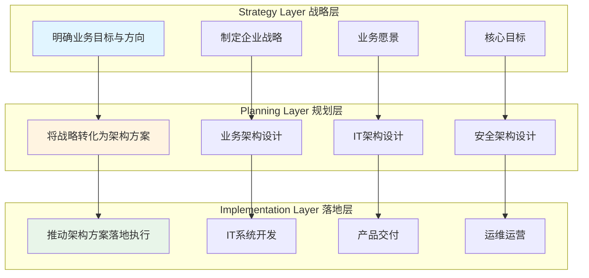
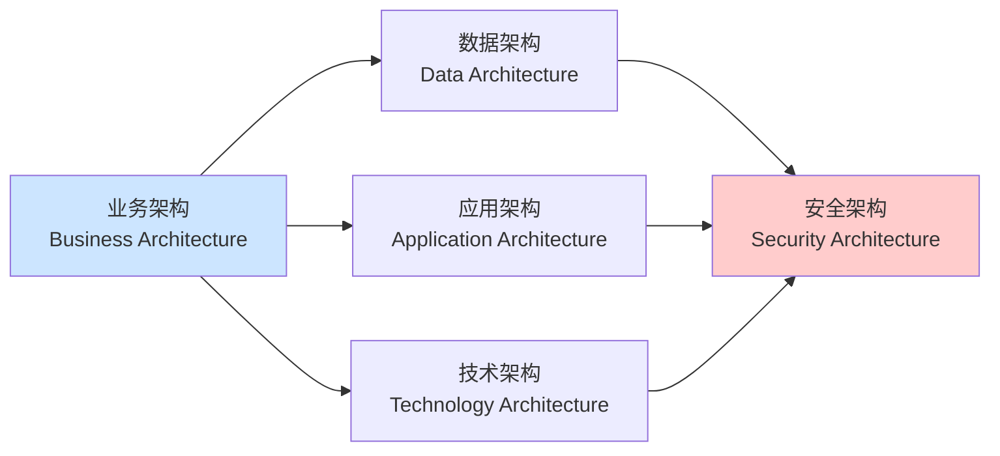
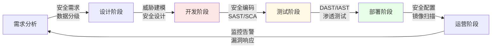
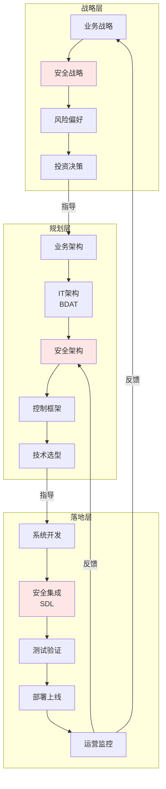

# 1.1 企业架构三层体系

## Three-Layer Enterprise Architecture System

> **核心理念**：战略层定义WHY（为什么），规划层设计WHAT（做什么），落地层执行HOW（怎么做）

---

##  本节概述

企业架构通过**战略层、规划层、落地层**三层体系支撑业务战略落地，而安全架构需要深度嵌入这一体系的每个层次，确保安全与业务目标的协同。

本节将系统阐述：

- 企业架构三层体系的核心定位与关键活动
- 各层之间的协同机制与产出物
- 安全架构在各层的具体嵌入点
- 实践案例与常见常见误区 (Anti-pattern)

---

## 1.1.1 企业架构三层体系框架

### 整体框架



### 三层体系对照表

| 企业架构层级                          | 核心定位             | 关键问题       | 关键活动与产出                                                                                             |
| ------------------------------------- | -------------------- | -------------- | ---------------------------------------------------------------------------------------------------------- |
| **Strategy Layer 战略层**       | 明确业务目标与方向   | WHY 为什么做？ | • 制定企业战略、业务愿景、核心目标 • 定义风险偏好与投资优先级• 产出：战略规划、年度目标（OKR/KPI）      |
| **Planning Layer 规划层**       | 将战略转化为架构方案 | WHAT 做什么？  | • 设计业务架构 • 设计IT架构（应用/数据/基础设施）• 明确架构标准 • 产出：架构蓝图、技术选型、实施路线图 |
| **Implementation Layer 落地层** | 推动架构方案落地执行 | HOW 怎么做？   | • IT系统项目开发 • 产品交付 • 运维运营 • 产出：可运行的系统、运营数据、改进建议                        |

---

## 1.1.2 战略层（Strategy Layer）

### 核心职责

战略层是企业架构的**起点与指挥中心**，回答"我们要去哪里"和"为什么去那里"的问题。

### 关键活动

#### 1. 战略制定

**活动内容**：

- 明确企业使命、愿景、核心价值观
- 制定3-5年战略规划
- 识别关键业务目标与成功指标

**产出物**：

- 企业战略文档
- 战略地图（Strategy Map）
- 平衡计分卡（Balanced Scorecard）

**责任角色**：CEO、董事会、战略规划部

#### 2. 业务目标设定

**活动内容**：

- 将战略分解为可衡量的业务目标
- 设定年度/季度OKR或KPI
- 明确各业务单元的目标与职责

**产出物**：

- 年度业务目标
- OKR体系
- 业务单元目标责任书

**责任角色**：业务负责人、产品负责人

#### 3. 风险偏好界定

**活动内容**：

- 明确企业可接受的风险水平
- 定义风险承受能力（Risk Tolerance）
- 制定风险管理原则

**产出物**：

- 风险偏好声明（Risk Appetite Statement）
- 风险承受阈值
- 风险管理政策

**责任角色**：CISO、CFO、CRO（首席风险官）

#### 4. 投资决策

**活动内容**：

- 确定IT与安全投资优先级
- 平衡业务增长与风险控制的投入
- 制定年度预算与资源分配

**产出物**：

- 年度预算
- 投资组合（Portfolio）
- 资源分配计划

**责任角色**：CFO、CIO、CISO

### 安全架构在战略层的嵌入点

#### 战略层安全活动

1. **参与战略制定**

   - 确保安全战略与业务战略对齐
   - 将安全能力作为业务竞争力的组成部分
   - 识别安全对业务的支持机会
2. **明确安全目标**

   - 将安全目标转化为业务语言
   - 设定可衡量的安全KPI/KRI
   - 与业务目标建立关联关系
3. **定义风险偏好**

   - 协助制定风险承受能力基线
   - 明确"零容忍"风险项（如数据泄露）
   - 建立风险量化模型
4. **争取预算支持**

   - 用业务价值证明安全投资必要性
   - 量化安全投资回报（ROSI）
   - 建立安全经济性模型

#### 实践案例：某跨境电商的战略层安全嵌入

**背景**：

- 某跨境电商计划进入欧洲市场
- 业务目标：3年内欧洲市场GMV达到10亿美元

**战略目标**：

- 财务目标：欧洲市场GMV 10亿美元，利润率≥15%
- 用户目标：获得欧洲用户信任，NPS（净推荐值）≥50
- 合规目标：满足GDPR等欧洲法规要求

**安全战略嵌入**：

| 安全战略           | 与业务目标的对齐                                                             | 量化指标                                                                                    |
| ------------------ | ---------------------------------------------------------------------------- | ------------------------------------------------------------------------------------------- |
| **合规先行** | • GDPR合规作为进入欧洲市场的前置条件• 获得ISO 27001、SOC 2认证提升客户信任 | • GDPR合规评估通过率100%• 认证在业务上线前6个月完成                                       |
| **风险偏好** | • 明确"数据泄露零容忍"原则• 建立数据保护影响评估（DPIA）流程               | • 数据泄露事件数=0• DPIA覆盖率100%                                                        |
| **投资决策** | • 年度安全预算增加30%• 重点投入：数据保护、隐私工程、合规自动化            | • 安全预算占IT预算比例从5%提升至6.5%• 避免GDPR罚款（最高收入的4%）=保护4000万美元潜在损失 |
| **价值量化** | • 加速客户安全评估，缩短销售周期20%• Trust Center提升转化率5%              | • 客户安全评估时间从4周缩短至3周• 网站转化率提升从2.1%到2.2%                              |

**成效**：

-  业务上线前完成GDPR合规
-  获得首批欧洲大客户订单
-  用户信任度调查显示，"数据安全"是选择该平台的第二大因素
-  避免合规罚款，节省潜在损失4000万美元

---

## 1.1.3 规划层（Planning Layer）

### 核心职责

规划层是企业架构的**关键枢纽**，其核心任务是将战略目标转化为可执行的架构蓝图。这一层是**安全架构的核心层**。

### 关键活动

#### 1. 业务架构设计

**活动内容**：

- 定义业务能力地图（Business Capability Map）
- 梳理业务流程与价值流
- 设计组织架构与角色职责

**产出物**：

- 业务架构蓝图
- 业务能力地图
- 业务流程图（BPMN）

**责任角色**：业务架构师、产品负责人

#### 2. IT架构设计

**活动内容**：

- 设计应用架构（Application Architecture）
- 设计数据架构（Data Architecture）
- 设计技术架构/基础设施架构（Technology Architecture）

**产出物**：

- IT架构蓝图（BDAT四层架构）
- 技术栈选型
- 集成架构设计

**责任角色**：企业架构师、CTO

#### 3. 安全架构设计 ⭐

**活动内容**：

- 设计安全控制框架
- 设计安全防护体系
- 威胁建模与风险评估
- 制定安全标准与基线

**产出物**：

- **安全架构蓝图**（本节重点）
- 威胁模型
- 安全控制矩阵
- 安全设计标准

**责任角色**：首席安全架构师、安全架构团队

#### 4. 架构评审

**活动内容**：

- 评估架构方案的可行性与风险
- 识别架构债务与技术债务
- 审查架构与标准的符合性

**产出物**：

- 架构评审报告
- 架构决策记录（ADR）
- 风险与缓解措施清单

**责任角色**：架构评审委员会（ARB）

#### 5. 路线图规划

**活动内容**：

- 制定分阶段实施计划
- 定义里程碑与验收标准
- 规划资源与预算

**产出物**：

- 架构演进路线图
- 实施计划（Roadmap）
- 资源需求与预算

**责任角色**：项目管理办公室（PMO）、架构师

### 规划层的层次结构

在规划层，业务架构是起点，IT架构（BDAT）承载业务需求，而安全架构则横跨所有层次：



### 安全架构在规划层的嵌入点（重点）

#### 规划层安全活动

规划层是**安全架构设计的核心层次**，关键活动包括：

##### 1. 威胁建模（Threat Modeling）

**目的**：识别业务流程与系统架构中的安全威胁

**方法**：

- STRIDE：针对技术威胁

  - Spoofing（伪造）
  - Tampering（篡改）
  - Repudiation（抵赖）
  - Information Disclosure（信息泄露）
  - Denial of Service（拒绝服务）
  - Elevation of Privilege（权限提升）
- LINDDUN：针对隐私威胁

  - Linkability（可关联性）
  - Identifiability（可识别性）
  - Non-repudiation（不可否认性）
  - Detectability（可检测性）
  - Disclosure of Information（信息披露）
  - Unawareness（无意识）
  - Non-compliance（不合规）

**产出物**：

- 威胁模型文档
- 数据流图（DFD）
- 攻击树（Attack Trees）
- 威胁清单与风险评级

##### 2. 安全控制设计

**目的**：为识别的威胁设计对应的安全控制措施

**控制框架**：

- **预防性控制（Preventive）**：阻止威胁发生
- **检测性控制（Detective）**：发现安全事件
- **响应性控制（Responsive）**：处置安全事件
- **补偿性控制（Compensating）**：替代主要控制的备选方案

**产出物**：

- 安全控制矩阵
- 控制到威胁的映射
- 控制有效性评估

##### 3. 安全架构审查

**目的**：评审业务架构与IT架构的安全性，确保安全融入设计

**审查要点**：

- ✓ 身份与访问管理设计
- ✓ 网络隔离与分段
- ✓ 数据分类与保护
- ✓ 日志与可观测性
- ✓ 密钥与凭证管理
- ✓ 合规要求映射

**产出物**：

- 架构安全评审报告
- 安全设计缺陷清单
- 整改建议与优先级

##### 4. 安全标准制定

**目的**：输出安全设计标准与最佳实践，指导落地层实施

**标准类型**：

- 认证与授权标准（OAuth 2.0、OIDC、RBAC/ABAC）
- 数据保护标准（加密、脱敏、分类分级）
- API安全标准（鉴权、速率限制、输入校验）
- 日志与审计标准（日志格式、保留期限、敏感信息处理）
- 云安全基线（CSPM策略、网络策略、密钥管理）

**产出物**：

- 安全设计基线文档
- 安全编码规范
- 技术选型指南
- 安全模式库（Security Patterns）

##### 5. 安全工具与平台规划

**目的**：规划安全工具链与平台能力，支撑落地层实施

**工具规划**：

- 开发阶段：SAST、SCA、Secret Scanning
- 测试阶段：DAST、IAST、API Testing
- 部署阶段：IaC扫描、镜像扫描、签名验证
- 运行阶段：RASP、WAF、SIEM/XDR

**平台规划**：

- 安全开发平台（DevSecOps Platform）
- 漏洞管理平台
- 身份与访问管理平台（IAM）
- 安全监控与响应平台（SOC）

**产出物**：

- 安全工具选型报告
- 平台架构设计
- 工具集成路线图

#### 规划层的核心产出：安全架构蓝图

一个完整的安全架构蓝图应该包含以下要素：

```
📦 安全架构蓝图包（Security Architecture Blueprint Package）
│
├── 1. 业务安全需求
│   ├── 业务流程与价值链
│   ├── 数据分类分级
│   ├── 合规要求清单（GDPR、CCPA、PIPL等）
│   ├── 业务风险地图
│   └── 安全目标与KPI
│
├── 2. 安全架构视图
│   ├── 逻辑架构图（Logical Architecture）
│   ├── 物理部署图（Deployment Diagram）
│   ├── 数据流图（Data Flow Diagram）
│   ├── 威胁模型（Threat Model）
│   └── 集成架构图（Integration Architecture）
│
├── 3. 安全控制矩阵
│   ├── 身份与访问控制
│   ├── 网络隔离与防护
│   ├── 数据保护措施
│   ├── 应用安全控制
│   ├── 监控与响应机制
│   └── 控制到标准的映射（NIST、ISO等）
│
├── 4. 技术选型
│   ├── 安全工具与平台
│   ├── 云安全服务
│   ├── 开源 vs 商业方案对比
│   ├── POC评估报告
│   └── TCO/ROI分析
│
└── 5. 实施路线图
    ├── 分阶段交付计划
    ├── 里程碑与验收标准
    ├── 资源需求（人员、预算）
    ├── 风险与依赖项
    └── 成功度量指标
```

#### 实践案例：某金融科技公司的规划层安全架构

**业务场景**：

- 构建开放银行API平台
- 支持200+金融API
- 接入100+第三方合作伙伴
- 日均API调用量1000万次

**业务架构要素**：

- 核心能力：账户管理、支付、贷款、理财
- 合作伙伴：第三方应用、金融机构、监管机构
- 合规要求：PCI DSS、PSD2、央行API安全规范

**安全架构设计**：

| 安全域             | 威胁分析                               | 架构方案                       | 关键控制                                                                                            |
| ------------------ | -------------------------------------- | ------------------------------ | --------------------------------------------------------------------------------------------------- |
| **身份认证** | • 伪造身份 • 会话劫持                | OAuth 2.0 + JWT + mTLS         | • 强制客户端证书认证• Token有效期≤30分钟 • 设备指纹绑定 • 异地登录告警                         |
| **授权管理** | • 权限提升• 越权访问 • 权限滥用     | 细粒度RBAC/ABAC + 动态授权     | • 最小权限原则• 动态授权策略（基于用户、设备、时间、地点）• 权限审计日志• 定期权限回顾          |
| **API安全**  | • API滥用 • 注入攻击 • 批量数据爬取 | API网关 + WAF + Schema验证     | • 速率限制（100 req/min per user）• OpenAPI Schema验证• 敏感数据响应脱敏• API调用链追踪         |
| **数据保护** | • 数据泄露 • 中间人攻击• 密钥泄露   | 端到端加密 + KMS               | • TLS 1.3强制加密传输 • 敏感字段加密存储• KMS托管密钥，定期轮换 • 证书Pinning（防止中间人攻击） |
| **监控审计** | • 异常行为• 攻击检测•合规审计       | 全链路日志 + SIEM + AI异常检测 | • API调用全量日志（保留1年）• 实时异常检测（UEBA）• 事件响应剧本（Playbook）• 监管报告自动化    |

**架构评审要点**：

 **合规性**

- 符合PCI DSS Level 1要求
- 满足PSD2强客户认证（SCA）
- 符合央行API安全技术规范

 **性能与可用性**

- 支持高并发（10,000 TPS）
- API响应时间P95 ≤ 100ms
- 系统可用性≥99.95%

 **安全性**

- 身份认证强度：多因素认证
- 网络隔离：API网关DMZ部署
- 数据加密：端到端加密
- 监控覆盖：全链路可观测

 **需改进**

- 需加强第三方API的安全评估流程
- 需完善密钥泄露的应急响应预案
- 需增加API滥用的行为分析能力

**产出物**：

-  API平台安全架构蓝图 v1.0
-  威胁模型文档（基于STRIDE）
-  安全控制矩阵（映射到PCI DSS、PSD2）
-  API安全设计标准 v1.0
-  第三方接入安全评估流程
-  12个月实施路线图

---

## 1.1.4 落地层（Implementation Layer）

### 核心职责

落地层是企业架构的**执行层**，其核心任务是将规划层的蓝图转化为可运行的IT系统，并持续运营优化。

### 关键活动

#### 1. 系统开发

**活动内容**：

- 开发应用系统与服务
- 实施微服务/API
- 数据库与数据管道开发

**产出物**：

- 可部署的代码
- API接口文档
- 数据库Schema

**责任角色**：研发团队、后端/前端工程师

#### 2. 安全集成

**活动内容**：

- 将安全控制集成到系统中
- 实施认证授权模块
- 实施数据加密与脱敏
- 集成日志与审计

**产出物**：

- 安全功能模块（认证、授权、加密等）
- 安全配置文件
- 日志与审计记录

**责任角色**：安全工程师、DevSecOps团队

#### 3. 测试验证

**活动内容**：

- 功能测试
- 性能测试
- 安全测试（SAST/DAST/IAST/渗透测试）
- 合规性测试

**产出物**：

- 测试报告（功能、性能、安全）
- 缺陷清单与修复计划
- 测试覆盖率报告

**责任角色**：测试团队、QA、安全测试工程师

#### 4. 部署上线

**活动内容**：

- 将系统部署到生产环境
- 配置监控与告警
- 执行上线前安全检查

**产出物**：

- 生产环境系统
- 部署文档
- 上线检查清单

**责任角色**：运维团队、SRE、DevOps

#### 5. 运营维护

**活动内容**：

- 持续运营、监控系统健康
- 处理安全事件与漏洞
- 执行补丁管理
- 持续优化与改进

**产出物**：

- 运营报告
- 事件响应记录
- 性能优化建议
- 架构演进建议（反馈到规划层）

**责任角色**：运营团队、SOC、SRE

### 安全架构在落地层的嵌入点

#### 落地层安全活动

在落地层，最重要的理念是**安全左移（Shift Left）**，即将安全活动前移到开发早期阶段，通过SDL（安全开发生命周期）和DevSecOps实践，将安全融入研发流程。

##### 1. SDL（安全开发生命周期）嵌入

SDL将安全活动嵌入到软件开发的每个阶段：



**各阶段安全活动**：

| 阶段               | 安全活动                                                                          | 工具/方法                                                                          | 产出物                                                    |
| ------------------ | --------------------------------------------------------------------------------- | ---------------------------------------------------------------------------------- | --------------------------------------------------------- |
| **需求分析** | • 识别安全需求<br /> • 数据分类分级<br />• 合规要求梳理                        | • 安全需求清单<br />• STRIDE威胁建模                                             | • 安全需求规格<br />• 数据分类结果                      |
| **设计阶段** | • 威胁建模<br />• 安全设计评审                                                  | • Microsoft Threat Modeling Tool<br />• STRIDE/PASTA                             | • 威胁模型<br />• 安全设计方案<br />• 架构评审报告     |
| **开发阶段** | • 安全编码<br />• 代码审查<br />• SAST扫描 <br />• SCA扫描<br />• Secret扫描 | • Semgrep/SonarQube<br />• Snyk/Dependabot/Murphysec<br />• GitLeaks/TruffleHog | • 代码扫描报告<br />• 依赖漏洞清单<br />• 密钥泄露检测 |
| **测试阶段** | • DAST扫描 • IAST测试• API安全测试• 渗透测试                                  | • OWASP ZAP/Burp Suite<br />• Contrast Security<br />• Postman/REST Assured     | • 动态扫描报告<br />• API测试报告<br />• 渗透测试报告  |
| **部署阶段** | • 镜像扫描 • IaC安全扫描• 配置基线检查• 签名验证                              | • Trivy/Clair<br />• Checkov/tfsec<br />• InSpec/CIS Benchmark                  | • 镜像扫描报告<br />• 配置合规报告<br />• 签名验证日志 |
| **运营阶段** | • 运行时监控 • 漏洞管理• 事件响应• 补丁管理                                   | • RASP/WAF<br /> • SIEM/XDR<br />• SOAR                                         | • 监控告警<br />• 漏洞处置记录<br />• 事件响应报告     |

##### 2. 安全门禁（Security Gates）

在CI/CD流水线中设置安全检查点，不合格的代码无法进入下一阶段：

| 阶段               | 门禁检查项                                 | 阻断条件                                           | 责任人    | 豁免流程                     |
| ------------------ | ------------------------------------------ | -------------------------------------------------- | --------- | ---------------------------- |
| **代码提交** | • Secret扫描<br />• 依赖项安全检查       | • 发现高危密钥<br />• 严重依赖漏洞               | 开发者    | 无法豁免，必须修复           |
| **代码合并** | • SAST<br />• 代码审查                   | • 高危漏洞未修复<br />• 未通过安全审查           | Tech Lead | 需CISO批准，设定修复期限     |
| **构建阶段** | • SCA<br />• 镜像扫描                    | • 严重漏洞或许可证违规<br />• 镜像基础镜像不安全 | CI/CD系统 | 需安全团队评估，提供缓解措施 |
| **部署前**   | • DAST<br /> • 配置审查<br />• 发布审批 | • 关键安全控制缺失<br />• 配置偏离基线           | 安全团队  | 需架构委员会批准             |
| **生产环境** | • 基线检查<br />• 合规扫描               | • 严重偏离安全基线                                | SRE团队   | 需制定整改计划，定期复审     |

##### 3. DevSecOps文化与实践

**核心理念**：

- **Shift Left**：安全前移到开发早期
- **Automation**：安全检查自动化，减少人工干预
- **Collaboration**：开发、安全、运维协同
- **Continuous**：持续的安全测试与改进

**关键实践**：

- 安全即代码（Security as Code）
- 策略即代码（Policy as Code）
- 自动化漏洞修复（Auto-remediation）
- 安全反馈循环（Security Feedback Loop）

##### 4. 持续监控与响应

**监控覆盖**：

- 应用层：WAF、RASP、API网关日志
- 网络层：流量分析、DDoS检测
- 主机层：EDR、HIDS
- 云层：CSPM、CIEM
- 数据层：DLP、数据访问审计

**事件响应流程**：

1. **检测（Detection）**：通过SIEM/XDR发现安全事件
2. **分析（Analysis）**：确定事件性质、范围、影响
3. **遏制（Containment）**：隔离受影响系统，防止扩散
4. **根除（Eradication）**：清除威胁，修复漏洞
5. **恢复（Recovery）**：恢复正常业务运行
6. **总结（Lessons Learned）**：复盘事件，改进流程

**反馈到规划层**：

- 从事件中识别架构缺陷
- 更新威胁模型与安全控制
- 优化安全架构设计

#### 实践案例：某SaaS公司的安全左移实践

**背景**：

- 某SaaS公司采用微服务架构
- 日均部署100+次
- 团队规模：研发200人，安全团队8人

**挑战**：

- 高频部署带来安全风险
- 手工安全审查无法跟上节奏
- 研发团队对安全认知不足
- 生产环境频繁出现安全问题

**解决方案：构建自动化安全工具链**

```
# .gitlab-ci.yml 示例（简化版）
stages:
  - security-scan
  - build
  - security-test
  - deploy

# 阶段1：代码提交时的安全扫描
secret-scan:
  stage: security-scan
  script:
    - gitleaks detect --source . --verbose --exit-code 1
  allow_failure: false  # 发现密钥必须阻断

sast-scan:
  stage: security-scan
  script:
    - semgrep --config=auto --json -o sast-report.json
  artifacts:
    reports:
      sast: sast-report.json
  allow_failure: false

sca-scan:
  stage: security-scan
  script:
    - snyk test --severity-threshold=high --json-file-output=sca-report.json
  artifacts:
    paths:
      - sca-report.json

# 阶段2：构建阶段的安全检查
container-scan:
  stage: build
  script:
    - docker build -t $CI_REGISTRY_IMAGE:$CI_COMMIT_SHA .
    - trivy image --severity HIGH,CRITICAL --exit-code 1 $CI_REGISTRY_IMAGE:$CI_COMMIT_SHA
  allow_failure: false

# 阶段3：部署前的安全测试
dast-scan:
  stage: security-test
  script:
    - zap-baseline.py -t $STAGING_URL -r dast-report.html
  artifacts:
    paths:
      - dast-report.html
  only:
    - main

# 阶段4：部署到生产环境
deploy-production:
  stage: deploy
  script:
    - kubectl apply -f k8s/deployment.yaml
    - kubectl rollout status deployment/$APP_NAME
  only:
    - main
  when: manual  # 需要人工审批
```

**实施结果**：

| 指标                           | 实施前      | 实施后     | 改进                 |
| ------------------------------ | ----------- | ---------- | -------------------- |
| **流水线阻断率**         | N/A         | 4.2%       | 符合健康范围（3-5%） |
| **生产环境高危漏洞**     | 平均15个/月 | 平均3个/月 | 80%                  |
| **漏洞修复时间（MTTF）** | 平均7天     | 平均2.5天  | 64%                  |
| **安全债务**             | 150+        | 42         | 72%                  |
| **工具误报率**           | N/A         | 8%         | 低于10%目标          |
| **部署速度**             | 日均100次   | 日均100次  | 保持不变             |
| **安全事件响应时间**     | 平均4小时   | 平均30分钟 | ⬇️ 87.5%           |
| **开发者安全培训完成率** | 40%         | 95%        | ⬆️ 137.5%          |

**关键成功因素**：

-  自动化工具链：减少人工干预，提升效率
-  安全门禁策略：在合理阈值内阻断（3-5%），不影响开发效率
-  开发者支持：安全培训、安全编码规范、Security Champions计划
-  反馈循环：从生产环境漏洞反馈到威胁模型与安全基线
-  管理层支持：CISO获得CEO支持，安全成为工程文化的一部分

---

## 1.1.5 三层体系的协同机制

### 闭环协同

企业架构三层体系不是孤立的，而是需要持续协同与反馈：



### 反馈机制

#### 从落地层到规划层的反馈

**触发条件**：

- 生产环境发生重大安全事件
- 安全测试发现架构设计缺陷
- 新威胁或新攻击手法出现
- 技术选型需要调整

**反馈内容**：

- 架构设计缺陷与改进建议
- 安全控制有效性评估
- 技术债务清单
- 威胁模型更新需求

**产出物**：

- 架构优化建议
- 安全控制调整方案
- 技术选型重新评估

#### 从落地层到战略层的反馈

**触发条件**：

- 安全投资ROI不达预期
- 业务目标与安全目标冲突
- 合规要求发生重大变化
- 组织能力与战略目标不匹配

**反馈内容**：

- 安全投资效果评估
- 业务影响分析
- 风险偏好调整建议
- 组织能力差距分析

**产出物**：

- 战略调整建议
- 预算与资源重新分配
- 风险偏好重新界定

### 关键成功因素（CSF）

| 因素                 | 说明                     | 实践建议                                                                        |
| -------------------- | ------------------------ | ------------------------------------------------------------------------------- |
| **高管支持**   | 获得CEO/董事会的明确支持 | • 定期向董事会汇报安全状况 • 用业务语言说明安全价值• 将安全纳入高管KPI       |
| **流程集成**   | 安全流程与业务流程融合   | • 避免平行流程 • 安全检查嵌入业务审批• 建立"安全BP"机制（详见Ch 3）          |
| **工具自动化** | 减少人工干预，提升效率   | • 优先投资安全自动化工具 • 建立DevSecOps文化• 安全即代码（Security as Code） |
| **度量反馈**   | 建立闭环的度量与改进机制 | • 定期复盘安全指标 • 事件驱动的架构优化• 从运营数据反馈到战略层              |
| **人才培养**   | 提升团队的安全意识与能力 | • 全员安全培训 • Security Champions计划• 建立安全职业发展路径                |

---

## 1.1.6 常见常见误区 (Anti-pattern)（Anti-Patterns）

### 常见误区 (Anti-pattern)1：只关注技术，忽视业务

**表现**：

- 安全架构与业务目标脱节
- 安全投资无法获得业务支持
- 安全措施阻碍业务发展
- 业务部门将安全视为"阻碍者"

**后果**：

- 安全预算削减
- 安全项目无法推进
- 业务部门绕过安全流程

**改进建议**：

-  始终从业务价值出发设计安全架构
-  用业务语言说明安全的价值（见1.2节）
-  建立"安全BP"机制，深入业务（见Ch 3）
-  量化安全投资回报（ROSI）

### 常见误区 (Anti-pattern)2：规划与落地脱节

**表现**：

- 精美的架构图无法落地
- 安全标准停留在文档，无人执行
- 研发团队不理解安全架构的意图
- 架构设计与实际系统差距巨大

**后果**：

- 架构沦为"纸上谈兵"
- 安全控制未真正实施
- 架构文档失去价值

**改进建议**：

-  确保架构可执行、可验证、可度量
-  提供参考实现（Reference Implementation）
-  建立架构合规检查机制
-  安全架构师深入研发团队，提供技术支持

### 常见误区 (Anti-pattern)3：缺乏反馈机制

**表现**：

- 落地层的问题无法反馈到规划层
- 重复犯同样的安全错误
- 架构设计与实际威胁不匹配
- 安全工具与流程无法持续优化

**后果**：

- 安全体系无法改进
- 新威胁无法及时应对
- 安全投资效率低下

**改进建议**：

-  建立事件复盘与架构优化机制
-  定期回顾安全架构（每季度）
-  从红队演练、渗透测试中识别架构缺陷
-  建立威胁情报反馈到威胁模型的流程

### 常见误区 (Anti-pattern)4：过度追求完美

**表现**：

- 试图一次性构建完美架构
- 项目周期过长（>12个月）
- 技术选型陷入分析瘫痪（Analysis Paralysis）
- 无法适应业务快速变化

**后果**：

- 项目延期或失败
- 业务机会错失
- 技术方案过时

**改进建议**：

-  采用敏捷方法，快速迭代优化
-  MVP（最小可行产品）优先，逐步完善
-  80/20原则：优先解决80%的问题
-  建立架构演进路线图，分阶段实施

---

## 小结

### 核心要点回顾

#### 1. 企业架构三层体系

- **战略层**：明确WHY（为什么做）—— 业务目标与安全战略对齐
- **规划层**：明确WHAT（做什么）—— 设计安全架构蓝图与控制框架
- **落地层**：明确HOW（怎么做）—— 将安全控制嵌入系统开发与运营

#### 2. 安全架构嵌入点

- **战略层**：参与战略制定、明确安全目标、定义风险偏好、争取预算支持
- **规划层**（核心层）：威胁建模、安全控制设计、架构审查、标准制定、工具规划
- **落地层**：SDL嵌入、安全门禁、DevSecOps、持续监控与响应

#### 3. 协同机制

- 战略层指导规划层
- 规划层指导落地层
- 落地层反馈到规划层和战略层
- 形成完整流程的持续改进机制

#### 4. 关键成功因素

- 高管支持
- 流程集成
- 工具自动化
- 度量反馈
- 人才培养

### 与后续章节的关系

本节建立了企业架构三层体系框架，接下来：

- **1.2节**：将深入业务架构，阐述安全如何为业务创造价值
- **1.3节**：将详细介绍IT架构（TOGAF BDAT）与云时代的映射
- **1.4节**：将展示完整的安全架构全景（三域×四层×三位一体）

后续章节（Ch 2-16）将基于本节的三层体系框架，分别深化各层的实践：

- **Part 1（Ch 2-3）**：战略层的GRC治理与业务对齐
- **Part 2（Ch 4-7）**：规划层的技术架构设计
- **Part 3（Ch 8-10）**：规划层的数据架构设计
- **Part 4（Ch 11-13）**：落地层的运营与防御
- **Part 5（Ch 14-15）**：AI支持各层能力提升
- **Part 6（Ch 16）**：组织与人才支撑

---

## 延伸阅读

### 参考框架

- **TOGAF Standard, Version 9.2** - The Open Group
- **SABSA Business Attributes** - Sherwood Applied Business Security Architecture
- **Enterprise Security Architecture** - Nicholas A. Sherwood
- **Security Architecture: Design, Deployment & Operations** - Christopher King

### 推荐资源

- 企业架构设计方法与实践：https://tonydeng.github.io/EA-practices/
- The Open Group TOGAF：https://www.opengroup.org/togaf
- SABSA Institute：https://sabsa.org
- Microsoft SDL：https://learn.microsoft.com/zh-cn/compliance/assurance/assurance-microsoft-security-development-lifecycle

---

**下一节**：[1.2 业务架构——战略/规划/落地的一致性](./1.2_business_architecture.md)

## 📍 导航 | Navigation

**[← 返回章节目录](./README.md)** | **[返回 Part 1](../)** | **[返回总目录](../../)** | **[→ 下一节](./1.2_business_architecture.md)**

---

**© 2025 AI-ESA Project. Licensed under CC BY-NC-SA 4.0**
