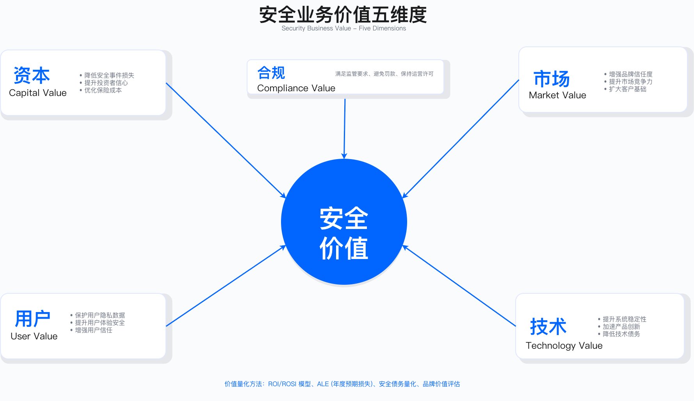

# 1.2 业务架构

## 本节概述

业务架构在企业架构三层体系中承担"翻译"职能：将战略层的业务目标转化为规划层的架构需求，并为落地层的工程实施提供验收标准。对于安全架构而言，业务架构的核心价值在于建立安全投资与业务成果之间的映射关系——安全团队常犯的错误是用技术语言汇报工作（"漏洞减少 50%"），而业务负责人关心的是业务影响（"业务中断时间从年度 40 小时降至 8 小时"）。

本节从业务价值澄清入手，阐述安全能力在五个维度创造的价值，并通过实践案例展示业务价值导向的安全决策路径，最后归纳业务架构层面的核心原则。

---

## 1.2.1 业务价值澄清

### 安全投资的业务价值维度

安全投资的业务价值往往被简化为"防止损失"，但在实践中，安全能力在多个维度创造价值。理解这些维度的权衡逻辑，是安全架构师将技术方案转化为业务语言的关键能力。本节从资本与风险控制、市场与业务增长、用户信任与品牌、技术交付与效率、合规与生态协同五个维度展开分析。



#### 资本与风险控制

安全投资的首要价值是将不可控的风险转化为可量化的成本。在企业融资、并购、IPO 尽调中，投资人与审计机构会要求量化安全风险敞口。若无法提供完整的风险评估报告，可能导致上市推迟或估值折价。

ALE（annual loss expectancy，年度预期损失）模型是风险量化的常用工具，其计算逻辑为：ALE = SLE（single loss expectancy，单次损失期望）× ARO（annual rate of occurrence，年度发生率）。该模型可用于比较不同安全投资方案的相对收益。例如，某企业评估数据泄露风险时，可通过估算单次泄露损失期望（包括罚款、赔偿、业务中断）与行业年度发生率，计算当前 ALE；再评估投资数据保护体系后 ARO 的下降幅度，从而得出投资回报。

关键约束：ALE 模型的局限在于损失期望（SLE）难以精确估算。数据泄露的声誉损失、客户流失、诉讼成本等长尾影响，可能在事件发生数年后才完全显现。因此，ALE 通常用于方案比较而非绝对值决策。

验证方法：建立历史事件损失数据库，按事件类型记录直接损失与间接损失；定期校验 ARO 估算与实际发生率的偏差。

#### 市场与业务增长

安全能力可以直接驱动业务增长，而非仅是"成本中心"。在企业服务（ToB）市场，客户的安全尽调周期直接影响销售转化率。若竞争对手已通过 ISO 27001/SOC 2 认证并建设了 trust center（安全信任中心），而本企业仍需数周人工响应安全问卷，客户可能转向认证完备的供应商。

Trust center 的建设思路是：在官网公开展示认证证书、安全白皮书、合规报告，使客户可自助查询常见问题，从而缩短安全评估周期。该投资的 ROI 计算需要考虑归因问题——销售增长受多种因素影响（产品、价格、市场推广），安全能力提升只是其中之一。在实践中，通常采用保守归因原则，避免过度宣传。

适用边界：Trust center 主要适用于 ToB 业务场景，尤其是面向大客户、合规敏感行业（金融、医疗、政府）的企业服务。ToC 业务的安全价值更多体现在用户信任维度。

常见误区：仅获取认证而不建设持续响应能力——认证是"静态证明"，客户仍会提出具体问题，需要自助化响应机制降低销售团队的重复劳动。

#### 用户信任与品牌

用户信任是企业最脆弱的资产之一，一次安全事件就可能摧毁多年积累的品牌声誉。安全事件发生后，即使漏洞在短时间内修复，舆情扩散仍可能导致应用商店评分下降、NPS（net promoter score，净推荐值）转负、用户流失加速。

从业务价值角度，用户信任可通过以下指标量化：NPS 变化趋势、日活/月活用户留存率、高价值用户流失率、LTV（lifetime value，客户生命周期价值）变化。事件发生后的修复投入（如全面数据脱敏、DLP 防泄露、强制 MFA、风控引擎升级）可视为信任资产的重建成本。

运行指标：建议将 NPS 纳入安全团队的业务对齐指标体系，定期监控安全事件与 NPS 变化的相关性。

常见误区：事后投入远高于事前投入——信任损失的修复成本通常是预防成本的数倍。

#### 技术交付与效率

安全不应拖慢业务速度，而要成为加速器。传统安全审查依赖人工：每次上线前，安全团队需要检查代码、配置扫描器、等待专家评审，审查周期以天计。在高频发布的环境中，这种模式导致大量人力消耗在重复劳动上。

转型路径：安全左移与自动化。将安全检查嵌入 CI/CD 流水线：代码提交自动触发 SAST（static application security testing，静态扫描）、SCA（software composition analysis，组件扫描）、secrets 扫描，结果在分钟级返回。安全审查时间大幅缩短，高危漏洞在开发阶段即被拦截，生产环境漏洞数量显著下降。

关键约束：自动化引入误报处理成本。若扫描工具每周产生大量告警且误报率高，研发团队会花费大量时间分类告警，最终可能选择关闭部分规则。平衡之道是定期优化扫描规则，将误报率控制在可接受水平，并提供自动修复建议。

验证方法：监控误报率（false positive rate）趋势；定期收集研发团队对安全工具的满意度反馈。

#### 合规与生态协同

全球化企业的合规成本可能比安全建设本身还高。业务覆盖多个法域的企业，每年可能面临多次外部审计（ISO 27001 年审、SOC 2 审计、PCI DSS 季度扫描、客户安全审查、监管机构检查）。每次审计准备需要数周时间，人工整理政策文档、控制措施记录、日志证据。

合规自动化平台可以显著降低审计准备成本：将控制措施的实施证据自动归档（日志自动留存、培训记录自动同步、事件工单自动分类），审计时一键导出对应时间段的证据包。更重要的是，将 GDPR、CCPA、PIPL 等法规要求拆解为控制点，映射到技术架构与业务流程，法规更新时系统自动提醒差距（gap analysis）。

合规自动化的隐性价值是避免罚款。GDPR 最高罚款可达全球营收的一定比例，一次合规失误可能导致灾难性损失。

适用边界：合规自动化平台适用于业务覆盖多个法域、需要应对多种合规框架的企业。对于单一法域、单一合规框架的企业，投资回报需要重新评估。

### 安全经济性量化

在进行安全投资决策时，需要建立经济性评估框架。

ROI（return on investment，投资回报率）= (收益 - 投资) / 投资 × 100%，其中收益 = 避免的损失 + 带来的增长。

ROSI（return on security investment，安全投资回报率）= (ALE × 风险降低比例 - 投资) / 投资 × 100%。

关键约束：ROI/ROSI 计算依赖假设（SLE 估算、ARO 评估、归因比例），需要明确假设边界，避免过度乐观。建议在决策文档中显式列出假设条件与敏感性分析。

---

## 1.2.2 业务价值导向的安全决策路径

在推进安全能力建设时，企业面临的核心问题是：如何在有限预算下，选择既能满足合规要求、又能支持业务增长的安全投资组合？以下通过一个典型场景，展示业务价值导向的安全规划思路。

### 决策背景与约束条件

某企业的核心业务涉及在线支付与金融服务，在筹备上市的窗口期内面临多重约束。

监管合规约束：上市尽调要求必须通过 PCI DSS 认证（支付卡行业数据安全标准）与 ISO 27001 认证，这是上市的"硬性门槛"。合规不达标可能导致上市推迟，并引发估值折价。

市场竞争约束：大客户（企业级商户）的安全评估周期通常较长，涉及大量安全问卷与现场审计。在快速增长的市场中，评估周期延长直接影响签约成功率。主要竞争对手已通过 trust center 压缩评估周期。

技术债务约束：遗留系统积累的高危漏洞需要逐步修复，但全量修复需要大量研发资源投入，与新功能开发存在资源冲突。安全团队规模有限，无法同时支撑合规认证、漏洞修复、新项目安全评审。

时间窗口约束：上市时间表不可延期，需要在固定窗口期内完成安全能力建设与认证获取。

### 投资决策的权衡逻辑

在预算约束下，企业必须在三个方向之间做出权衡：快速见效的合规认证 vs 长期能力建设 vs 短期风险修复。

为何优先选择合规认证？因为这是上市的"非过不可"项，延误合规会直接导致上市失败，机会成本远高于投资成本。相比之下，漏洞修复虽然重要，但可以通过风险接受与临时缓解措施（WAF 规则、网络隔离）延后处理。

为何同时建设 trust center 而非仅获取认证？因为认证是"静态证明"，而 trust center 是"动态能力"。获得 ISO 27001 认证后，客户仍会提出具体问题，trust center 可以自助化响应，降低销售团队的重复劳动。

为何扩充安全团队而非完全依赖外包？因为金融科技业务的安全需求是持续性的，外包咨询只能解决认证项目，无法支撑日常的架构评审、SDL 流程、事件响应。内部团队的培养需要较长周期，必须提前投入。

### 分阶段实施策略

**第一阶段：合规认证冲刺**

优先投入资源获取 ISO 27001 与 PCI DSS 认证。关键决策包括：

采用"最小范围认证"策略——仅将核心支付系统纳入 PCI DSS 范围，边缘系统（如 CRM、BI）暂不纳入。这一决策可将认证范围大幅缩减，认证周期相应压缩。代价是边缘系统的安全标准暂时低于 PCI DSS 要求，需要在后续阶段逐步补齐。

ISO 27001 的文档体系（政策、流程、记录）外包给咨询公司搭建，内部团队负责技术控制的实施。这一分工利用外部专家的经验，同时避免过度依赖外包导致知识转移不足。

**第二阶段：DevSecOps 能力建设**

在获得认证后，立即投入 DevSecOps 平台建设，将安全检查自动化，降低人工审查成本。

工具选型需要考虑现实约束：在 SAST 工具选型中，企业面临"功能全面但误报率高的商业工具"与"轻量级但覆盖有限的开源工具"的权衡。若选择商业工具，需要投入时间优化规则库，将误报率降至可接受水平。这一过程需要安全团队与研发团队紧密协作，逐条审查误报，持续调优。

门禁强度采用渐进式提升策略——初期将安全门禁设为"warning only"（仅告警不阻断），避免因过严规则导致研发流程停滞。运行一段时间后，逐步将高危漏洞规则调整为"block"（阻断合并）。这一渐进策略平衡了安全强度与开发体验。

**第三阶段：Trust Center 与客户服务**

建设面向客户的 trust center，展示安全能力，缩短客户安全评估周期。

公开透明度需要把握边界：Trust center 公开展示 ISO 27001 证书、SOC 2 报告摘要、安全白皮书，但不公开具体的渗透测试报告、漏洞列表。这一边界平衡了客户的知情权与企业的安全风险（避免攻击者利用公开信息）。

客户问卷标准化：梳理客户最常问的安全问题，形成标准答案库。销售团队遇到客户安全尽调时，多数问题可以直接引用标准答案，少数定制问题由安全团队支持。

### 经验总结

成功经验：

业务价值导向——每个安全项目都明确回答"对上市/销售/研发效率有什么帮助"，用业务语言汇报进展。分阶段实施——先解决"非过不可"的合规认证，再建设长期能力，避免全面铺开导致资源分散。渐进式推进——安全门禁从"warning"逐步升级至"block"，trust center 从内测到公开，避免激进变革引发抵触。

经验教训：

工具选型不是"买最贵的"——商业 SAST 工具初期误报率可能很高，需要持续调优才达到可用状态。如果没有团队投入优化，昂贵的工具也会被研发团队关闭。认证不是终点——获得 ISO 27001 证书后，仍需要年度监督审计与周期性复审。如果日常控制执行不到位，复审时可能被撤销证书。标准化与定制化的平衡——客户安全问卷标准化可以覆盖多数场景，但定制问题（如行业特定合规、大客户特殊要求）仍需人工支持，不能完全自动化。

---

## 1.2.3 业务架构原则

### 原则一：业务优先与可度量

安全目标必须映射到业务价值与可观测指标。安全团队常犯的错误是用技术指标汇报（如"漏洞减少 50%"），但业务负责人关心的是业务影响。

下表对比技术指标与业务指标的表述差异。选择这三个场景，是因为它们分别代表风险管理、合规驱动、数据保护三类典型安全目标。

| 安全目标 | 技术指标表述 | 业务指标表述 |
|---------|-------------|-------------|
| 降低漏洞风险 | 漏洞数量减少比例 | 业务中断时间变化、事件响应成本变化 |
| 提升合规能力 | 通过认证数量 | 销售周期变化、客户签约成功率变化 |
| 加强数据保护 | 加密覆盖率 | 避免的潜在罚款敞口、客户信任指标变化 |

业务指标表述需要建立因果链——安全控制改进如何影响中间指标，中间指标如何影响最终业务成果。

验证方法：每个安全项目的立项文档必须包含业务影响描述；季度复盘时对比预期业务影响与实际结果。

### 原则二：策略一致与可追溯

战略→规划→落地之间需要建立清晰的控制映射与证据链。审计人员会追溯：企业战略如何转化为安全战略？安全战略如何转化为安全架构？安全架构如何转化为技术实现？每个控制措施的实施证据在哪？这种可追溯性是合规认证的核心要求。

控制映射链条示例：

```
企业战略 → 安全战略 → 安全架构 → 安全控制 → 技术实现 → 证据记录
```

适用边界：策略可追溯性对于需要通过外部审计认证的企业是强制要求；对于初创企业或内部系统，可适度简化记录要求。

常见误区：策略文档与实际执行脱节——战略文档写得完美，但技术实现偏离架构设计，证据记录缺失或不完整。

### 原则三：架构决策记录化

关键安全决策应以 ADR（architecture decision record，架构决策记录）形式沉淀。ADR 记录三个要素：背景（context）——做这个决策的原因与约束；决策（decision）——选择了什么方案、放弃了什么方案；后果（consequences）——该决策带来的正面影响与需要承担的代价。

例如，在选择 SAST 工具时，ADR 可记录：背景是需要在 CI/CD 中集成静态扫描，约束条件包括预算、与现有工具链的兼容性、团队技能；决策是选择某商业工具而非开源方案；后果是功能更全面但需要投入时间调优降低误报。

ADR 帮助团队理解历史决策的背景，避免重复讨论，也为未来的技术选型提供参考。

运行指标：ADR 覆盖率（重大架构决策中有 ADR 记录的比例）；ADR 更新频率（决策条件变化时是否及时更新）。

---

## 1.2.4 业务安全伙伴机制

业务架构的落地需要组织机制支撑。安全业务伙伴（GSBP/BISO）是企业安全组织贴近业务的"前线接口"，其职责是将安全目标翻译成业务语言，驱动关键业务线实现可衡量的风险降低与合规达标。

### 职责定位

GSBP（group security business partner，安全业务伙伴）嵌入业务日常节奏，洞察业务计划，翻译安全控制为业务语言，推动项目落地。其与总部安全团队的关系是承接总部安全策略、能力平台与政策，将其本地化；与业务团队的关系是作为业务方单一安全接口，支持需求受理、风险评估、上线放行。

BISO（business information security officer，业务信息安全官）代表业务单元参与企业安全治理委员会，对业务安全策略、预算、合规负责。其与 CISO/安全委员会双向对齐战略，参与企业级风险决策；在业务内驱动安全文化、审批重大例外、确保 KPI/OKR 实现。

### 价值主张与指标体系

业务安全伙伴的价值主张需要用业务语言表达：风险降低（减少高风险例外、缩短风险暴露窗口）、效率提升（优化需求响应时间、上线审批周期）、合规保障（提升审计一次通过率、避免监管罚款）、文化驱动（业务团队安全自助率提高、培训覆盖度达标）。

建议建立"三类指标"组合：结果类指标（重大风险敞口变化、重大事件数量、监管罚款情况）、过程类指标（需求 SLA 达成率、playbook 执行率、例外关闭周期）、体验类指标（业务满意度、NPS、业务团队自助率）。确保指标中包含至少一个财务或业务 KPI，以获得 CFO/业务领导的关注。

### 服务目录

标准化服务目录有助于业务快速理解可获得的支持，并为 SLA、绩效与预算提供依据。典型服务类型包括：咨询与顾问（业务安全咨询、政策解读、合规答疑）、需求与评审（产品/功能上线评审、架构评审、第三方接入评审）、合规与证据（合规审查、审计支持、跨境数据申报）、共创项目（落地 playbook、自动化项目、文化共建）、事件与例外支持（高风险例外审批、重大事件沟通、危机应对）、培训与赋能（新员工培训、安全日、共驾演示）。

服务目录建议每季度复核，并在门户或知识库提供自助入口、流程说明与模板下载。

---

## 小结

### 核心要点

业务价值五维度：安全投资在资本与风险控制、市场与业务增长、用户信任与品牌、技术交付与效率、合规与生态协同五个维度创造价值。理解这些维度的权衡逻辑，是将技术方案转化为业务语言的关键。

决策权衡逻辑：在有限预算下，需要在快速见效的合规认证、长期能力建设、短期风险修复之间做出优先级排序。核心原则是先解决"非过不可"项，再渐进式建设长期能力。

业务架构原则：业务优先与可度量（安全目标映射业务指标）、策略一致与可追溯（建立控制映射与证据链）、架构决策记录化（关键决策以 ADR 沉淀）。

组织机制支撑：通过 GSBP/BISO 机制，将安全目标翻译成业务语言，建立标准化服务目录与指标体系，实现安全与业务的双向对齐。

### 与后续章节的关系

本节建立了业务架构层面的安全价值框架与决策原则，1.3 节将深入 IT 架构层面，阐述 TOGAF BDAT 四层模型与云时代的映射；1.4 节将展示完整的安全架构全景图。Ch 2 的 GRC 治理框架将进一步深化本节的合规维度；Ch 3 的业务安全伙伴章节将详细展开 GSBP/BISO 的组织设计与能力建设。

---

**下一节**：[1.3 IT 架构](./1.3_it_architecture.md)

## 导航

**[← 返回上一节](./1.1_enterprise_architecture_three_layers.md)** | **[返回章节目录](./README.md)** | **[→ 下一节](./1.3_it_architecture.md)**

---

