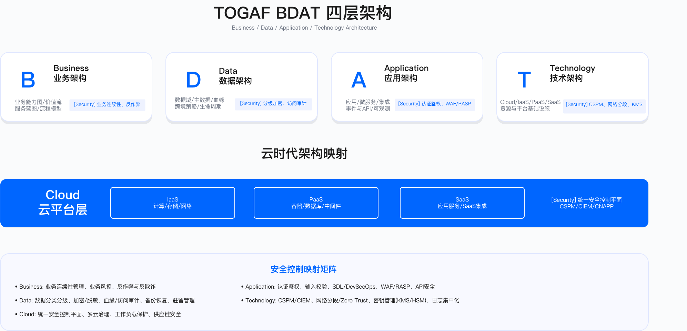

# 1.3 IT 架构——TOGAF BDAT 与云服务映射

## IT Architecture: TOGAF BDAT and Cloud Service Mapping

IT 架构是连接业务战略与技术实施的中间层。TOGAF 框架的 BDAT 四层模型（业务 / 数据 / 应用 / 技术）提供了一套将抽象业务需求转化为可实施技术方案的方法论。在云计算环境下，这一模型需要与 Cloud/IaaS/PaaS/SaaS 服务层级相映射，以确保架构设计能够落地到具体的云服务选型与配置。

---

## 1.3.1 IT 架构原则

### 原则 1：标准化与黄金路径

黄金路径（golden path）的设计目标是为开发团队提供"默认安全"的最佳实践模板与项目脚手架。黄金路径能否被采用，取决于其是否解决了开发者的真实痛点，而非仅仅满足安全团队的合规诉求。

**问题背景**

某互联网公司在安全审计中发现，尽管提供了多套"官方"项目脚手架，开发者实际使用最多的却是一套非官方版本。调查显示：官方脚手架存在依赖版本过旧、内置认证库存在已知漏洞、配置复杂度过高等问题。开发者自建的简化版本去除了 HTTPS、SQL 注入防护、日志审计等安全配置，但"能快速跑起来"，在团队中被广泛复制。后果是：基于该版本开发的多个微服务存在 SQL 注入漏洞，部分已被利用造成数据泄露。

**决策点与控制设计**

改进后的黄金路径遵循以下设计原则：

技术栈更新策略方面，采用当前稳定版本（如 Python 3.10 + FastAPI），每季度更新依赖并发布迁移指南。安全默认启用方面，HTTPS 证书自动配置、ORM 防注入、审计日志开箱即用，开发者无需额外配置即可获得基础安全能力。降低复杂度方面，单体架构起步，不强制微服务，从 git clone 到本地运行控制在少量命令与合理时间内完成。激励机制方面，使用黄金路径的项目可豁免部分安全门禁检查项（因脚手架已内置基础防护），降低开发团队的安全合规负担。

**验证方法**

脚手架有效性验证包括：对脚手架生成的项目运行 SAST/DAST 扫描，确认无高危漏洞；检查脚手架依赖的 CVE 数量，确保为零或已有缓解措施；验证从 git clone 到本地运行的步骤数与耗时是否符合预期。

**运行指标**

黄金路径使用率：统计新项目中采用官方脚手架的比例。脱离黄金路径率：统计项目开发过程中移除安全配置的比例。漏洞密度对比：黄金路径项目与非黄金路径项目的漏洞数对比。

**适用边界**

该方法适用于有一定规模（研发团队超过 50 人）、存在多套技术栈并存问题的组织。对于小型团队或技术栈高度统一的组织，维护黄金路径的成本可能高于收益。

**常见误区**

误区一：将黄金路径等同于"强制标准"而非"好用的工具"，导致开发者绕道使用非官方版本。误区二：脚手架发布后缺乏持续维护，依赖版本落后于主流，安全配置反而成为隐患来源。

**黄金路径项目结构示例**

```
project-template/
├── .gitlab-ci.yml          # 预配置安全扫描
├── Dockerfile              # 安全基础镜像
├── k8s/                    # K8s 安全配置
│   ├── deployment.yaml     # 安全上下文配置
│   └── network-policy.yaml # 网络策略
├── src/
│   ├── auth/              # 认证授权模块
│   └── logging/           # 日志审计模块
└── docs/
    └── security-guide.md  # 安全开发指南
```

### 原则 2：共享责任边界清晰

云环境下，云厂商与企业的责任边界需要明确定义，每个控制点都应有唯一责任方。但"责任边界清晰"与"责任落实到位"是两个不同的问题。

**问题背景**

某金融科技公司发生 S3 数据泄露事件：一个 S3 存储桶被配置为公开访问，导致用户身份证照片曝光于互联网。事后追责时，云厂商指出已提供 Block Public Access 设置，客户未启用属于"客户责任"范畴；运维团队以为云平台会自动保护数据安全；安全团队认为云基础设施属于运维团队责任；开发团队表示临时开启公开访问测试后忘记关闭。

根本问题在于：责任边界虽然在合同中定义清晰，但实际操作中存在三个缺口——团队成员不知道边界在哪、跨边界的控制措施无人管理、云厂商的默认配置偏向易用性而非安全性。

**决策点与控制设计**

责任矩阵可视化：将责任边界做成交互式文档，每个工程师入职时必须学习并通过测验。跨边界控制自动化：将数据分类（应用层责任）与 S3 加密策略（IaaS 层责任）联动——标记为高敏感的数据上传到 S3 时自动触发加密、私有访问、审计日志配置。默认安全配置：用 Terraform 强制所有 S3 桶默认启用 Block Public Access，公开访问需走审批流程。

**验证方法**

配置合规检查：CSPM 工具定期扫描云资源配置，标记不合规项。责任边界测验：抽查工程师对共享责任模型的理解程度。跨边界联动测试：验证数据分类变更是否正确触发存储层策略更新。

**共享责任矩阵**

下表定义了不同云服务层级下云厂商与企业的责任划分。该矩阵需要根据具体云厂商的服务条款进行细化，因为不同厂商在同一层级的责任边界可能存在差异。

| 层级 | 云厂商责任 | 企业责任 |
|------|-----------|---------|
| SaaS | 应用安全、数据加密、访问控制 | 用户权限管理、数据分类、合规配置 |
| PaaS | 平台安全、运行时安全、中间件 | 应用代码安全、配置管理、密钥管理 |
| IaaS | 物理安全、虚拟化、网络基础设施 | OS 安全、网络配置、安全组、镜像 |
| Cloud | 数据中心、硬件、电力 | 账户安全、IAM、日志审计、合规 |

矩阵的核心权衡在于：层级越高（SaaS），云厂商承担的责任越多，企业控制力越弱；层级越低（IaaS），企业拥有更大控制力，但也承担更多安全责任。选择云服务层级时需评估自身团队的安全运营能力。

**常见误区**

误区一：认为云厂商会"自动保护"数据安全。实际上，云厂商提供安全能力，但启用与配置是企业责任。误区二：责任边界文档化即等于责任落实。需要通过培训、自动化策略、审计检查形成闭环。

**运行指标**

云资源配置合规率（CSPM 扫描通过率）；责任边界培训覆盖率；跨边界控制联动成功率。

### 原则 3：可组合与低耦合

组件化、接口化设计便于替换与升级，但从单体应用到微服务的迁移路径往往比预期复杂。

**问题背景**

某电商公司（单体应用代码量约 120 万行）决定迁移到微服务架构。初期按功能模块拆分（商品服务、订单服务、用户服务、支付服务等），结果发现订单创建需要调用多个服务，接口响应时间大幅增加，且任何一个服务故障都会导致整个下单流程崩溃。

问题根源在于"拆得太细"且未解决底层耦合：用户密码加密逻辑散落在多个服务中、SKU ID 生成规则不统一、部分服务绕过 API 直连其他服务的数据库。

**决策点与控制设计**

渐进式迁移：不追求一次性全部微服务化，按业务价值排序渐进迁移。优先迁移需要独立扩容的核心服务（如支付服务），非核心服务（如后台管理工具）可保持单体。按业务领域拆分而非按功能拆分：采用领域驱动设计（DDD）确定服务边界。订单创建是一个完整的业务事务，不应跨多个服务；异步场景（如物流通知、消息发送）采用事件驱动解耦。先解耦再拆分：在单体应用内先做模块化改造（清晰的接口、禁止跨模块数据库访问），等模块边界稳定后再拆成独立服务。

**验证方法**

服务间调用链路追踪：监控关键业务路径的服务调用数量与延迟。故障影响范围测试：模拟单个服务故障，验证是否触发雪崩。代码耦合度分析：定期检查跨服务数据库直连、共享代码库等耦合模式。

**运行指标**

核心接口延迟：P99 延迟是否符合 SLA。服务故障隔离度：单服务故障影响的业务功能范围。独立部署频率：各服务的独立发布次数。

**适用边界**

微服务架构适用于业务复杂度高、需要独立扩缩容、团队规模大到需要自治的场景。对于业务简单、变更频率低的系统，单体架构反而更高效。

**常见误区**

误区一：为了"微服务化"而微服务化，结果只是将进程内调用变成 HTTP 调用而未真正解耦。误区二：期望架构改造一步到位，忽视渐进演进的必要性。

---

## 1.3.2 TOGAF 框架概述

### 为何需要架构方法论

缺乏统一架构方法论的企业在面临重大业务变更时容易陷入混乱。例如，某出海电商公司从东南亚扩张到欧洲时：业务部门要求短期内支持 GDPR 合规，开发团队指出现有系统数据存储在新加坡无法满足数据驻留要求，安全团队尚未完成欧洲站的威胁评估，运维团队表示基础设施扩容和多云适配需要更长时间。由于各团队使用不同的术语和优先级框架，项目协调成本高、延期严重。

TOGAF（The Open Group Architecture Framework）提供了一套结构化的架构开发方法论，其价值体现在以下几个方面：

ADM（架构开发方法）提供标准化的架构开发流程，从业务需求分析到技术方案落地都有明确阶段定义。建立共同语言使不同角色（CEO、CTO、CISO）能用统一术语讨论问题，例如"业务能力图"在各方有一致的理解。决策可追溯方面，每个架构决策（如选择 AWS 而非 Azure、采用微服务而非单体）都能追溯到业务需求。架构演进管理方面，TOGAF 支持持续演进而非一次性设计，适应业务增长和技术升级。

### 与其他框架的关系

TOGAF 回答"建什么样的架构"（从战略到实施的完整设计方法论）；ITIL 回答"怎么运营这个架构"（IT 服务的日常运营管理）；ITSM 提供标准化的服务管理流程框架。三者在实践中协同使用：用 TOGAF 设计架构选型，用 ITIL 管理日常运维（事件管理、变更管理），用 ITSM 工具（如 ServiceNow）支撑流程落地。

### BDAT 四层架构模型

TOGAF 的核心架构模型为 BDAT 四层架构，四层之间存在自上而下的依赖关系：业务架构定义需求，数据架构定义信息资产，应用架构定义系统功能，技术架构提供底层支撑。



```
┌─────────────────────────────────────────┐
│  1. Business Architecture（业务架构）   │
│     衔接商业目标与业务流程，架构设计起点 │
└─────────────────────────────────────────┘
              ↓
┌─────────────────────────────────────────┐
│  2. Data Architecture（数据架构）       │
│     定义数据资产、流转逻辑与管理标准     │
└─────────────────────────────────────────┘
              ↓
┌─────────────────────────────────────────┐
│  3. Application Architecture（应用架构）│
│     规划应用系统的功能、交互关系与集成   │
└─────────────────────────────────────────┘
              ↓
┌─────────────────────────────────────────┐
│  4. Technology Architecture（技术架构） │
│     为上层架构提供技术支撑（基础设施）   │
└─────────────────────────────────────────┘
```

---

## 1.3.3 BDAT 四层架构详解

### 1. Business（业务架构）

业务架构衔接商业目标与业务流程，是架构设计的起点。安全需求的模糊性往往源于对业务能力的分析不足。

业务架构层的关键产出包括：业务能力图（business capability map）用于识别企业核心能力；价值流图（value stream）展示价值创造过程；服务蓝图（service blueprint）定义业务服务与触点。

业务架构层的安全控制包括业务连续性管理（BCM / DR）、业务风控与反欺诈、业务流程审计、合规性要求映射。

**实践示例：业务能力图驱动安全规划**

某电商平台 CISO 在规划年度安全建设时，通过梳理业务能力图发现三个关键安全缺口：

交易管理域方面，支付成功率下降，调查发现是欺诈检测规则过于严格导致误杀正常订单。安全控制需要在准确率与召回率之间取得平衡。用户管理域方面，账户被盗案例频发，但缺乏系统化的账户保护方案（无 MFA、无异常登录检测）。物流管理域方面，配送员能看到用户完整地址和手机号，存在隐私泄露风险，但业务部门未意识到这是安全问题。

基于业务能力图的分析结果，安全建设计划得以针对性设计，而非泛泛地"提升安全能力"。

**业务能力与安全需求映射**

下表说明了典型业务域与安全需求的对应关系，用于指导安全规划与业务能力的对齐。

| 业务域 | 核心能力 | 安全需求 |
|--------|---------|---------|
| 用户管理 | 注册、登录、身份认证 | MFA、账户保护、反爬虫 |
| 商品管理 | 商品发布、库存管理 | 内容审核、数据完整性 |
| 交易管理 | 下单、支付、结算 | 支付安全、欺诈检测 |
| 物流管理 | 订单履约、配送跟踪 | 信息保护、隐私合规 |
| 客户服务 | 咨询、投诉、退换货 | 数据访问控制、审计 |

该映射需要根据企业具体业务特点进行细化，不同行业的业务域划分与安全侧重点存在差异。

### 2. Data（数据架构）

数据架构定义数据资产、流转逻辑与管理标准。企业在数据快速增长后，常陷入"数据有很多，但不知道有什么、在哪、谁在用"的困境。

数据架构层的关键产出包括：数据域划分（按业务划分数据域，如用户域 / 订单域 / 商品域）、主数据管理（MDM，定义核心数据实体与标准）、数据血缘（data lineage，追踪数据流转路径）、跨境策略（数据驻留与跨境传输规则）、生命周期管理（数据创建、存储、归档、销毁）。

数据架构层的安全控制包括：数据分级分类（建立分级体系）、加密与脱敏（静态加密、传输加密、动态脱敏）、血缘与访问审计（数据访问日志、审计追溯）、备份与恢复（定期备份、灾难恢复）、驻留管理（合规的数据存储位置）。

**问题场景：数据跨境传输违规**

某金融科技公司被监管通报用户数据跨境传输违规。调查发现，公司有多个数据仓库（AWS 新加坡、阿里云北京、自建 IDC），但无人能说清用户数据的完整流转路径：用户注册时身份证号存在北京的 MySQL；风控系统调用时数据被同步到新加坡的数据仓库做分析；第三方合作伙伴调用 API 时又从新加坡传输到其他区域。

**整改方案**

数据域划分：梳理核心数据域（用户身份 / 交易 / 风控 / 营销 / 财务 / 运营），每个域明确责任人。数据血缘追踪：建立数据血缘平台，追踪每个敏感字段的流转路径。跨境策略：建立数据地图，明确哪些数据必须留在境内，哪些可以出境（并做脱敏处理）。生命周期管理：定义数据保留期（如身份证照片的保留期限），减少合规风险。

**验证方法**

数据血缘覆盖率：敏感数据字段的血缘追踪覆盖比例。跨境传输审计：记录所有跨境数据流动并验证合规性。数据访问审计覆盖率：敏感数据访问的日志记录比例。

**数据分级与控制矩阵**

下表定义了数据分级标准与对应的安全控制要求。企业应根据自身业务特点和监管要求细化具体字段的分级归属。

| 数据级别 | 定义 | 典型数据 | 安全控制 |
|---------|------|---------|---------|
| L4 严格受限 | 泄露导致严重法律/声誉风险 | 支付卡信息、生物特征 | 加密存储、最小授权、全量审计 |
| L3 高度敏感 | 泄露导致重大业务影响 | 身份证、护照、健康数据 | 加密存储、脱敏展示、审计 |
| L2 敏感 | 泄露影响用户隐私 | 姓名、手机、邮箱、地址 | 访问控制、脱敏、日志 |
| L1 内部 | 内部业务数据 | 订单号、商品 ID | 访问控制、日志 |
| L0 公开 | 可公开数据 | 商品名称、描述 | 无特殊要求 |

分级体系的核心权衡在于：级别过少导致控制粒度不足，无法差异化管理；级别过多导致分类成本高、执行困难。五级分类是多数企业的经验平衡点，但需根据监管要求调整。

### 3. Application（应用架构）

应用架构规划应用系统的功能、交互关系与集成方案。

应用架构层的关键产出包括：应用组件图（核心应用及依赖关系）、微服务架构（服务拆分与边界）、集成架构（服务间通信方式，同步 / 异步）、事件驱动架构（事件流与事件总线）、API 管理（API 网关、速率限制、版本管理）、可观测性（日志、指标、链路追踪）。

应用架构层的安全控制包括：认证与鉴权（OAuth 2.0 / OIDC、RBAC / ABAC）、输入校验（防注入、防 XSS、防 CSRF）、SDL 流程（SAST / DAST / SCA / IAST）、WAF / RASP（应用层防护）、API 安全（认证、授权、速率限制、契约校验）。

**问题场景：微服务架构安全边界设计失误**

某 HR SaaS 公司从单体迁移到微服务时，将所有安全控制集中在 API Gateway，认为"网关安全了，内部服务就不用管安全了"。渗透测试发现攻击者通过 SSRF 漏洞绕过 API Gateway，直接调用内部服务接口。服务间调用不验证 JWT、内部接口没有权限检查、速率限制只在网关层实现，导致测试人员成功导出了用户数据。

根本问题在于将微服务当成"可信的内网"，忽视了服务被攻破后的横向移动风险。

**改进方案：纵深防御**

API Gateway（第 1 层防护）：南北向流量（外部→服务）实施 OAuth2/JWT 认证、速率限制、WAF 防护，但不再是唯一防线。Service Mesh（第 2 层防护）：东西向流量（服务间）实施 mTLS 加密、细粒度授权、流量监控。每个服务有独立的身份证书，服务间调用需要验证证书。应用层防护（第 3 层）：每个服务独立做输入校验（不信任任何调用方，包括内部服务）。关键服务（如支付、数据导出）增加二次授权检查。可观测性（持续监控）：分布式追踪记录每个请求的完整调用链，异常检测识别可疑的服务间调用模式。

**验证方法**

横向移动测试：模拟单个服务被攻破后尝试访问其他服务。服务间认证验证：检查所有服务间调用是否启用 mTLS。异常调用检测：验证异常调用模式（如服务 A 突然大量调用服务 B 敏感接口）是否触发告警。

**微服务安全架构示意**

```
┌────────────────────────────────────────────────────┐
│                   API Gateway                       │
│  • 统一认证（OAuth2/JWT）                          │
│  • 速率限制与熔断                                  │
│  • 请求日志与审计                                  │
└────────────────────────────────────────────────────┘
                      ↓
        ┌─────────────┼─────────────┐
        ↓             ↓             ↓
┌──────────────┐ ┌──────────────┐ ┌──────────────┐
│ User Service │ │ Order Service│ │ Payment Svc  │
│ • 身份验证   │ │ • 授权检查   │ │ • 敏感操作   │
│ • 密码管理   │ │ • 数据校验   │ │ • 加密传输   │
└──────────────┘ └──────────────┘ └──────────────┘
        ↓             ↓             ↓
┌─────────────────────────────────────────────────┐
│              Service Mesh (Istio/Linkerd)        │
│  • mTLS（服务间加密）                           │
│  • 细粒度授权策略                               │
│  • 流量监控与异常检测                           │
└─────────────────────────────────────────────────┘
```

### 4. Technology（技术架构/基础设施）

技术架构为上层架构提供技术支撑，可统一表述为"基础设施（infrastructure）"。

技术架构层的关键产出包括：云基础层（Cloud，多云 / 混合云战略）、IaaS 层（计算、存储、网络资源）、PaaS 层（容器编排 K8s、数据库、中间件）、SaaS 层（企业应用，CRM / ERP / 协作工具）。

技术架构层的安全控制包括：CSPM / CIEM（云安全态势管理、权限管理）、网络分段（VPC、子网、安全组、防火墙）、密钥管理（KMS / HSM、密钥轮换）、日志集中化（SIEM、日志聚合与分析）。

---

## 1.3.4 BDAT 与云服务映射

### 从抽象模型到具体云服务

TOGAF 的 BDAT 模型的实践价值在于将抽象的架构设计映射到具体的云服务选型。在多云迁移场景中，如果缺乏 BDAT 指导，容易陷入"技术驱动"的陷阱。

**问题场景：多云迁移的隐性成本**

某 SaaS 公司从单云（AWS）迁移到多云（AWS + 阿里云）时，工程团队认为"用 K8s 就行了，两朵云都支持"。迁移后发现：数据层方面，两朵云使用不同数据库服务，数据同步存在延迟问题；应用层方面，微服务部署在两朵云，但跨云调用的延迟和流量成本未预估；技术层方面，两朵云的 K8s 服务（EKS vs ACK）配置不一致，运维复杂度增加。

**基于 BDAT 的正确做法**

Business 层：先分析业务能力，哪些业务因合规要求必须在特定地区部署，哪些可以全球化。Data 层：定义数据驻留策略，按用户地理位置选择数据存储位置，避免不必要的跨境传输。Application 层：按地理位置拆分微服务部署，减少跨云调用。Technology 层：统一 IaC（Terraform）、统一监控、统一安全策略（CSPM），降低运维复杂度。

**BDAT 与云服务层级映射**

```
抽象层（TOGAF BDAT）         具象层（Cloud Services）
┌──────────────────┐
│  Business Layer  │         ┌─────────────────────┐
│  （业务架构）     │ ───────→│  Business Services  │
└──────────────────┘         │  （业务能力平台）    │
                             └─────────────────────┘
┌──────────────────┐
│   Data Layer     │         ┌─────────────────────┐
│  （数据架构）     │ ───────→│  SaaS（软件即服务） │
└──────────────────┘         │  • CRM/ERP/BI       │
                             │  • 协作工具         │
┌──────────────────┐         └─────────────────────┘
│ Application Layer│                   ↓
│  （应用架构）     │         ┌─────────────────────┐
└──────────────────┘ ───────→│  PaaS（平台即服务） │
                             │  • 容器编排（K8s）  │
┌──────────────────┐         │  • 数据库/中间件    │
│ Technology Layer │         │  • API 网关/服务网格 │
│  （技术架构）     │         └─────────────────────┘
└──────────────────┘                   ↓
                             ┌─────────────────────┐
                             │  IaaS（基础设施服务）│
                             │  • 计算（VM/容器）  │
                             │  • 存储（对象/块）  │
                             │  • 网络（VPC/LB）   │
                             └─────────────────────┘
                                       ↓
                             ┌─────────────────────┐
                             │  Cloud（云基础层）  │
                             │  • 数据中心         │
                             │  • 物理基础设施     │
                             └─────────────────────┘
```

**映射关系总结**

下表说明了 TOGAF 各层与云服务形态的对应关系，用于指导架构设计到云服务选型的决策。

| TOGAF 层 | 实施层映射 | 云服务形态 |
|---------|----------|----------|
| Business | 业务能力图 / 价值流 / 服务蓝图 | 业务能力平台 |
| Data | 数据域 / 主数据 / 血缘 / 跨境策略 / 生命周期 | SaaS 层数据管理 |
| Application | 应用 / 微服务 / 集成 / 事件与 API / 可观测 | PaaS 层应用平台 |
| Technology | Cloud / IaaS / PaaS / SaaS 资源与平台 | IaaS + Cloud 层基础设施 |

---

## 1.3.5 参考实施模型

本节提供各架构层的技术选型参考。技术选型需根据企业的具体需求、团队能力、成本约束进行评估，此处仅列出常见选项供参考。

### 应用层参考模型

架构模式方面，常见选项包括：微服务架构（按业务能力拆分服务）、事件驱动架构（EDA，异步解耦、最终一致性）、BFF 模式（backend for frontend，前端专用 API 聚合层）、API 管理平台（统一网关、速率限制、版本管理）。

技术选型参考：框架方面包括 Spring Boot / FastAPI / Node.js；容器化方面包括 Docker + K8s；服务网格方面包括 Istio / Linkerd；API 网关方面包括 Kong / Apigee / AWS API Gateway。

### 数据层参考模型

架构模式方面，常见选项包括：数据网格（data mesh，域驱动的数据所有权）、数据仓库（data warehouse，OLAP 分析）、数据湖（data lake，原始数据存储）、实时流处理（事件驱动的数据处理）。

技术选型参考：关系型数据库包括 PostgreSQL / MySQL；NoSQL 包括 MongoDB / Redis / Cassandra；数据仓库包括 Snowflake / BigQuery / Redshift；流处理包括 Kafka / Pulsar / Flink。

### 集成层参考模型

架构模式方面，常见选项包括：API 网关（统一入口、认证鉴权、流量控制）、服务网格（service mesh，服务间通信治理）、消息中间件（异步通信、削峰填谷）。

技术选型参考：API 网关包括 Kong / Apigee / Tyk；服务网格包括 Istio / Linkerd / Consul；消息队列包括 Kafka / RabbitMQ / AWS SQS。

### 基础设施层参考模型

架构模式方面，常见选项包括：多云/混合云（避免厂商锁定）、容器编排（Kubernetes 集群管理）、基础镜像与运行时（标准化镜像、安全加固）。

技术选型参考：云平台包括 AWS / Azure / GCP / 阿里云；容器编排包括 Kubernetes / AWS ECS / Azure AKS；基础镜像方面，安全加固场景可考虑 Distroless 镜像，其移除 shell 与包管理器可减少攻击面。

---

## 1.3.6 安全控制映射

### API 平台安全控制

下表列出 API 平台的关键安全控制域与实现方式。每个控制域在实施时需要考虑与业务需求的平衡，例如速率限制的阈值需要根据正常业务流量确定。

| 控制域 | 控制措施 | 实现方式 |
|--------|---------|---------|
| 认证 | 统一认证中心 | OAuth2 / OIDC、JWT |
| 授权 | 细粒度权限控制 | RBAC / ABAC、API Scope |
| 契约治理 | API 规范强制执行 | OpenAPI Spec、契约测试 |
| 配额与速率限制 | 防滥用与 DDoS | 令牌桶算法、滑动窗口 |
| 密钥管理 | API Key 轮换 | KMS 托管、自动轮换 |
| 审计 | 请求日志与追踪 | 访问日志、链路追踪 |

**问题场景：API 平台爬虫攻击**

某互联网公司 API 平台遭遇大规模爬虫攻击，API 调用量暴增，核心业务接口响应时间大幅上升，移动 App 崩溃率增加。攻击者通过暴力枚举用户 ID 接口窃取了用户资料。事后分析发现三个架构缺陷：部分内部 API 误暴露到公网，未启用 OAuth2 保护；按 IP 限流策略被攻击者用代理池绕过；只记录业务日志，未记录 API 访问审计，攻击持续较长时间才被发现。

**架构改进要点**

统一认证网关：所有 API 强制 OAuth2 认证，按业务敏感度分配 Scope，高敏感接口要求双重验证。多维度速率限制：从单一 IP 限流升级到"IP + User + API"三维配额体系，引入设备指纹和行为分析。全链路审计：API 请求日志全量记录（调用者身份、请求参数哈希、响应码），接入 SIEM，异常流量实时告警。契约强制执行：基于 OpenAPI Spec 自动生成网关配置，禁止手工修改。

**验证方法**

渗透测试：模拟绕过认证、突破速率限制的攻击路径。审计覆盖验证：抽样检查 API 调用是否完整记录。告警响应测试：注入异常流量验证告警触发时效。

*（API 网关具体配置实现请参见 Part 02 Chapter 06.2 应用安全架构设计）*

### 数据平台安全控制

| 控制域 | 控制措施 | 实现方式 |
|--------|---------|---------|
| 数据分级 | 分类体系 | 数据标签、元数据管理 |
| 加密 | 静态与传输加密 | AES-256、TLS 1.3 |
| 脱敏 | 动态脱敏与代币化 | 脱敏规则引擎、Token 化 |
| 血缘追踪 | 数据流转可追溯 | 血缘分析平台 |
| 访问审计 | 数据访问日志 | 审计日志、SIEM 集成 |
| 备份恢复 | 定期备份与 DR | 增量备份、异地容灾 |
| 驻留管理 | 合规的数据位置 | 数据地图、驻留策略 |

**问题场景：离职员工数据泄露**

某 SaaS 公司发生数据泄露：一名离职的客户成功经理因账号权限未及时回收，登录 CRM 系统导出了企业客户联系人信息，并将数据出售给竞争对手。事后分析发现：权限粒度过粗（CRM 系统只有"管理员/普通用户"两级权限）、缺少数据隔离（数据库层面没有租户隔离机制）、审计盲区（只记录登录日志，不记录数据访问操作）。

**架构改进原则**

数据分类：将数据分级，每级数据定义明确的访问条件和审计要求。行级权限隔离：数据库启用行级安全策略（RLS），用户只能看到"自己负责的数据"，根据角色层级自动过滤数据范围。动态脱敏：非授权人员查询敏感字段时自动脱敏显示，只有特定角色能看明文。全量审计：数据访问日志记录"谁/何时/访问了哪些数据/做了什么操作"，离职员工账号即时冻结权限。

**验证方法**

权限穿透测试：验证用户是否只能访问授权范围内的数据。脱敏有效性验证：检查敏感字段在不同角色视图下的显示状态。离职流程测试：验证离职员工账号冻结的时效性。

*（数据访问控制具体实现请参见 Part 03 Chapter 08.5 数据访问控制）*

### 云平台安全控制

| 控制域 | 控制措施 | 实现方式 |
|--------|---------|---------|
| 态势管理 | 云资源配置合规 | CSPM（Prisma / Wiz / Lacework） |
| 权限管理 | 最小权限原则 | CIEM、IAM 策略即代码 |
| 网络分段 | 微分段与隔离 | VPC、安全组、Network Policy |
| 密钥管理 | 集中式密钥管理 | AWS KMS / Azure Key Vault |
| 日志集中化 | 统一日志收集 | CloudTrail / CloudWatch → SIEM |
| 合规性 | 自动化合规检查 | AWS Config / Azure Policy |

**云平台安全基线设计原则**

从企业架构视角，云平台安全基线应覆盖以下关键控制域：

审计可追溯性方面，需要全局审计日志集中收集（跨区域、跨服务），建立日志完整性验证机制，制定审计数据长期归档策略。网络隔离与访问控制方面，需要基于 VPC 的网络分段设计，最小权限原则的安全组配置，仅允许必要的内部通信路径。密钥与加密管理方面，需要集中式密钥管理服务（KMS / HSM），建立自动化密钥轮换机制，考虑加密密钥的高可用容灾设计。合规性自动化方面，需要配置策略即代码（policy as code），建立持续合规监控与告警，实现自动化修复不合规配置。

**验证方法**

CSPM 扫描：定期运行云安全态势评估，标记不合规配置。网络隔离测试：验证不同 VPC / 子网间的访问控制有效性。密钥轮换验证：检查密钥轮换机制的实际执行情况。

*（具体云平台配置实现请参见 Part 02 Chapter 05 云安全架构）*

---

## 1.3.7 实践案例：金融科技公司 IT 架构安全设计

### 背景

某金融科技公司提供在线支付与理财服务，面临以下挑战：高度监管环境（PCI DSS、金融合规）、业务规模快速增长、多云架构（主云 + 备用云）、复杂的数据流转（跨境支付、数据驻留）。

### 架构设计

**1. Business 层（业务架构）** 

| 业务能力 | 核心流程 | 安全要求 |
|---------|---------|---------|
| 用户注册 | KYC 实名认证 | 身份验证、反欺诈 |
| 充值提现 | 银行卡绑定、交易 | PCI DSS 合规、加密传输 |
| 投资理财 | 产品购买、赎回 | 风控评估、交易审计 |
| 风险控制 | 反洗钱（AML）、反欺诈 | 异常检测、规则引擎 |

**2. Data 层（数据架构）** 

```
数据分级策略：
├── L4 严格受限：银行卡号、CVV、密码
│   └── 控制：加密存储（AES-256）、最小授权、全量审计
├── L3 高度敏感：身份证号、人脸照片、交易记录
│   └── 控制：加密存储、脱敏展示、访问审计
├── L2 敏感：姓名、手机号、账户余额
│   └── 控制：访问控制、日志记录
└── L1 内部：产品信息、系统配置
    └── 控制：基础访问控制
```

数据驻留要求：中国用户数据存储于境内云，海外用户数据存储于海外区域，跨境数据传输通过 VPN 专线加密传输。

**3. Application 层（应用架构）** 

微服务架构设计：

```
┌─────────────────────────────────────────┐
│          API Gateway (Kong)              │
│  • OAuth2 认证                          │
│  • 速率限制                             │
│  • WAF 规则（OWASP Top 10）             │
└─────────────────────────────────────────┘
                  ↓
    ┌─────────────┼─────────────┐
    ↓             ↓             ↓
┌─────────┐ ┌──────────┐ ┌────────────┐
│ User Svc│ │Payment Svc│ │Investment │
│ • KYC   │ │• PCI DSS  │ │Svc        │
│ • Auth  │ │• 加密传输 │ │• 风控     │
└─────────┘ └──────────┘ └────────────┘
    ↓             ↓             ↓
┌─────────────────────────────────────────┐
│       Service Mesh (Istio)               │
│  • mTLS（服务间加密）                   │
│  • 授权策略（JWT 验证）                 │
└─────────────────────────────────────────┘
```

SDL 流程集成：需求阶段进行威胁建模（STRIDE 方法）；开发阶段集成 SAST、SCA、Secrets 扫描；测试阶段进行 DAST、API 安全测试；发布阶段实施镜像签名、K8s 策略门禁。

**4. Technology 层（技术架构）** 

云资源布局：

| 云平台 | 用途 | 安全控制 |
|--------|------|---------|
| 主云 | 核心业务系统 | CSPM、审计日志 |
| 备用云 | 灾备 | 态势感知、操作审计 |
| 混合云 | 专线互联 | VPN 加密、流量监控 |

网络架构：

```
Internet
    ↓
[WAF/DDoS 防护]
    ↓
┌─────────────────────────┐
│  Public Subnet (DMZ)    │
│  • ALB（负载均衡）       │
│  • NAT Gateway          │
└─────────────────────────┘
    ↓
┌─────────────────────────┐
│  Private Subnet (App)   │
│  • K8s Worker Nodes     │
│  • Application Services │
└─────────────────────────┘
    ↓
┌─────────────────────────┐
│  Private Subnet (Data)  │
│  • RDS（加密）          │
│  • ElastiCache（加密）  │
│  • 无公网访问           │
└─────────────────────────┘
```

密钥管理：使用云厂商 KMS 管理加密密钥，数据库密码存储于 Secrets Manager，定期自动轮换。

### 验证与运行指标

安全控制验证方法：数据加密验证需检查静态存储与传输链路的加密状态；漏洞修复时效需追踪高危漏洞从发现到修复的周期；渗透测试需定期进行内外部渗透测试，验证控制有效性；合规审计需对照 PCI DSS 要求进行逐项检查。

运行指标：数据加密覆盖率（静态存储与传输加密的覆盖比例）、高危漏洞平均修复时间 MTTR（从发现到修复的平均周期）、安全事件响应时间（从告警到初步响应的平均时间）、系统可用性（业务系统的 SLA 达成情况）。

---

## 导航

**[← 上一节：1.2 业务架构](./1.2_business_architecture.md)** | **[返回章节目录](./README.md)** | **[下一节：1.4 安全架构全景 →](./1.4_security_architecture_landscape.md)**

---

**© 2025 AI-ESA Project. Licensed under CC BY-NC-SA 4.0**

