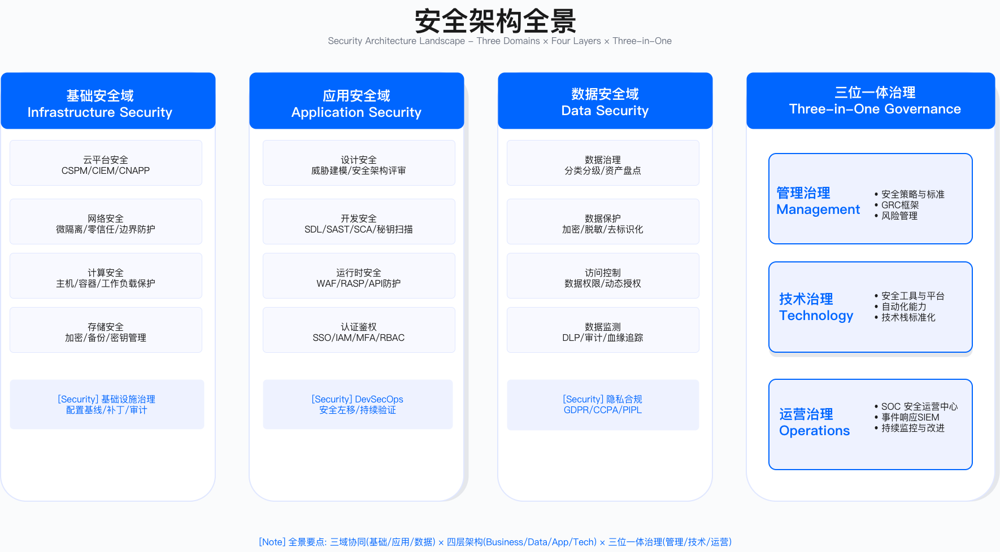
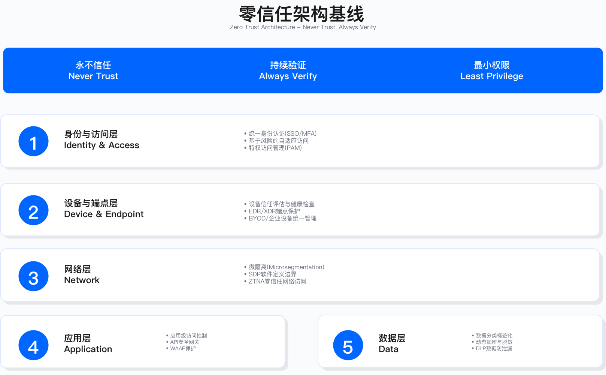
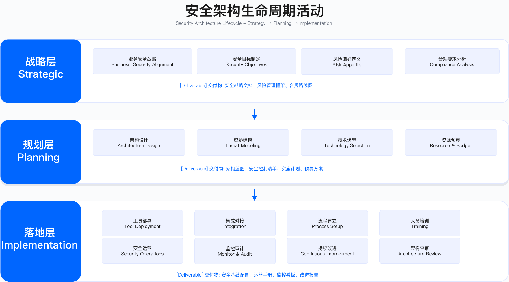

# 1.4 安全架构全景——从战略到落地

## Security Architecture Landscape: From Strategy to Implementation

> **核心理念**：安全架构是企业架构的有机组成部分，通过"三域×四层×三位一体"模型将安全能力系统化地映射到业务与 IT 架构，确保安全与业务发展同步演进。

---

## 1.4.1 安全治理三域

### 为什么需要三域划分

企业安全架构需要覆盖从基础设施到数据的完整技术栈。在快速成长的企业中，常见的困境是"多个团队都在管安全，但职责边界不清"，导致关键控制点出现真空。

**职责边界不清的典型后果**

以 API 数据泄露事件为例，调查常发现问题出在职责交叉地带：基础设施团队负责网络和服务器安全，但认为 API 的认证鉴权不在其范围；应用安全团队负责代码审查，但 API 网关的配置由基础设施团队部署；数据安全团队负责数据加密，但 API 返回什么数据由开发团队决定。结果是一个未授权访问漏洞在多个团队的职责边界间滑落，最终导致用户数据泄露。

**三域划分的工程价值**

三域划分通过明确边界解决这一问题。每个域有明确的责任团队与控制范围：API 安全策略由应用安全域定义，API 网关的基础配置由基础安全域执行，API 返回的数据脱敏规则由数据安全域提供。这种划分的核心不是"人人都懂一点"，而是"每个域都有专业深度"，并通过统一的策略与流程实现横向协同。

```
┌─────────────────────────────────────────────────────┐
│             Enterprise Security Architecture         │
├─────────────────────────────────────────────────────┤
│  基础安全域          应用安全域          数据安全域   │
│  (Infra Security)   (AppSec)          (DataSec)    │
│                                                      │
│  物理→网络→主机      认证→代码→API      分类→加密→审计 │
└─────────────────────────────────────────────────────┘
```

### 基础安全域（Infrastructure Security）

**核心定位**

基础安全域保障底层基础设施的安全，提供安全的计算、网络、存储环境。这是安全体系的地基，地基不牢则上层控制难以生效。

**适用边界**：适用于所有需要管理物理或虚拟基础设施的企业，包括自建数据中心与云环境。不适用于纯 SaaS 消费型组织（此时基础安全由供应商承担）。

**关键约束**：IAM 统一管理需要与 HR 系统对接，实现员工入离职的账号自动同步；特权账号管理（PAM）需要平衡安全性与运维效率，过严的审批流程会导致运维绕过管控；云环境的 CSPM/CIEM 工具部署需要跨多云平台的统一视图能力。

**IAM 混乱的工程教训**

权限滥用事件的调查常揭示以下问题模式：员工离职后账号未自动注销，云平台存在大量"孤儿账号"；权限授予过度，生产环境写权限覆盖面过广；Root 账号或特权账号缺乏 MFA 保护，密码长期未轮换且被多人共享；审计日志收集了但无人分析，异常登录发生时未能及时告警。

**整改方向**

整改方案通常包括：IAM 接入 SSO 并与 HR 系统联动，员工离职当日自动注销所有云平台权限；实施最小权限原则，生产写权限收敛到必要人员；特权账号启用 MFA 与硬件令牌，操作全程录屏审计；CloudTrail 等日志接入 SIEM，配置异常登录告警规则。

**关键能力矩阵**

下表列出基础安全域的核心能力与典型技术实现。选择这些维度是因为它们覆盖了身份、网络、主机、容器、终端、云态势等基础设施安全的关键控制点。

| 能力域 | 核心控制 | 技术实现 |
|--------|---------|---------|
| 身份与访问 | 统一认证、权限管理、特权管理 | SSO/MFA、RBAC/ABAC、PAM |
| 网络分段 | 微分段、零信任网络 | VPC、安全组、Service Mesh |
| 主机安全 | 加固基线、漏洞管理、EDR | CIS Benchmark、补丁管理、EDR |
| 容器与 K8s | 镜像安全、运行时防护 | 镜像扫描、准入控制、RBAC |
| 终端管理 | 设备管理、终端防护 | MDM/MAM、EDR/XDR |
| CSPM/CIEM | 云态势管理、权限治理 | Prisma/Wiz、权限分析 |
| PAM/堡垒机 | 特权账号管理、会话审计 | CyberArk/BeyondTrust、录屏 |

表格总结：基础安全域的能力建设需要在身份生命周期管理、网络隔离粒度、主机加固深度之间权衡，过度复杂的控制会增加运维负担，过度简化则留下安全空白。

**常见误区**

1. **IAM 与 HR 系统未联动**：依赖人工流程注销离职员工账号，导致"孤儿账号"长期存在。验证方法：定期执行 IAM 账号与 HR 系统的比对审计，检查是否存在已离职但账号仍有效的情况。
2. **权限审批流程过于僵化**：导致运维人员绕过 PAM 直接使用 Root 账号。验证方法：审计 Root 账号的登录日志，检查是否存在非审批流程的直接访问。

**验证方法**

- 红队用例：模拟离职员工账号登录尝试，验证账号是否已及时注销
- 日志字段：IAM 登录日志应包含 user_id、source_ip、auth_method、timestamp
- 验收口径：离职员工账号在离职当日 24 小时内完成注销

**运行指标**

- **IAM 账号同步延迟**：HR 系统变更到 IAM 账号同步的时间，阈值建议根据企业风险偏好设定
- **特权账号 MFA 覆盖率**：所有特权账号启用 MFA 的比例，目标为完全覆盖
- **异常登录告警响应时间**：从异常登录发生到告警触发的时间，需根据业务场景设定合理阈值

### 应用安全域（Application Security）

**核心定位**

应用安全域确保应用代码、API、业务逻辑的安全，覆盖应用全生命周期。这是离开发者最近的安全域，也是最容易与业务产生摩擦的地方。

**适用边界**：适用于有自研应用的企业，包括传统单体应用与微服务架构。对于完全依赖第三方 SaaS 的组织，应用安全域的重点转向 API 安全与供应商评估。

**关键约束**：SDL（安全开发生命周期）的落地需要平衡安全扫描的覆盖度与扫描速度——扫描时间过长会阻塞 CI/CD 流水线；误报率过高会消耗开发者信任，导致告警被忽视；门禁策略过严会导致开发团队寻找绕过方式。

**SDL 落地的典型摩擦**

SDL 推行初期常遭遇开发团队抵触。典型场景是：安全团队要求所有代码提交必须通过 SAST 扫描，发现高危漏洞必须修复才能合并。开发团队反馈扫描耗时过长、误报率过高，导致流水线阻塞，开发者开始寻找绕过门禁的方式，SDL 形同虚设。

**分级推进策略**

有效的应对策略是分级推进：核心业务模块（如支付）采用严格门禁，高危漏洞必须修复；一般业务模块采用适度门禁，高危必修复，中危可豁免但需记录；内部工具采用基础门禁，仅阻断最高危漏洞。同时优化 SAST 配置：关闭低价值规则，缩短扫描时间，降低误报率。

**关键能力矩阵**

| 能力域 | 核心控制 | 技术实现 |
|--------|---------|---------|
| 认证鉴权 | 身份验证、权限控制 | OAuth2/OIDC、JWT、RBAC |
| 输入校验 | 参数验证、注入防护 | 白名单校验、参数化查询 |
| 日志与可观测 | 审计日志、链路追踪 | ELK/Splunk、Jaeger/Zipkin |
| WAF/RASP | Web 防火墙、运行时防护 | ModSecurity/云 WAF、RASP |
| API 管理 | API 网关、速率限制 | Kong/Apigee、限流算法 |
| SAST/DAST/IAST | 代码扫描、动态测试 | SonarQube、OWASP ZAP、Contrast |
| 供应链安全 | 组件管理、SBOM | SCA 扫描、依赖锁定、签名验证 |

**SDL 嵌入模型**

SDL 流程嵌入需要覆盖从需求到运行的完整生命周期：

- **需求/设计阶段**：安全需求评审、威胁建模（STRIDE）、数据分级
- **开发阶段**：安全编码规范、SAST 白盒扫描、SCA 组件扫描、Secrets 扫描
- **测试阶段**：DAST 黑盒测试、IAST 灰盒测试、API 安全测试、渗透测试
- **发布阶段**：镜像签名验证、门禁准入检查、漏洞清零验收、回滚预案
- **运行阶段**：RASP 运行时防护、可观测监控、漏洞应急响应、攻防演练

**常见误区**

1. **门禁策略"一刀切"**：对所有模块采用相同的严格标准，导致开发效率下降或门禁被绕过。验证方法：监控门禁阻断率，若显著偏离预期（如过低说明门禁被绕过，过高说明误报过多），需调整策略。
2. **SAST 规则未根据技术栈定制**：使用默认规则导致大量误报。验证方法：定期统计误报率，持续调优规则库。

**验证方法**

- 红队用例：在测试环境提交包含已知漏洞的代码，验证门禁是否正确阻断
- 日志字段：SAST 扫描日志应包含 scan_id、repo、branch、severity、finding_count
- 验收口径：高危漏洞门禁阻断后，漏洞必须修复或获得豁免审批才能合并

**运行指标**

- **门禁阻断率**：被门禁阻断的提交占总提交的比例，需控制在合理区间
- **SAST 误报率**：误报数占总告警数的比例，持续调优目标是降低误报
- **高危漏洞修复时间（MTTF）**：从漏洞发现到修复的平均时间，根据漏洞严重程度设定不同阈值

### 数据安全域（Data Security）

**核心定位**

数据安全域保护数据全生命周期的机密性、完整性、可用性。数据是企业核心资产，也是监管关注的重点。

**适用边界**：适用于所有处理敏感数据的企业，特别是涉及个人数据（PII）、支付数据（PCI）、健康数据（HIPAA）等受监管数据的场景。数据量小且无监管要求的组织可简化实施。

**关键约束**：数据分类分级需要业务团队配合，纯技术手段难以准确判断数据的业务敏感度；加密与脱敏会引入性能开销，需在安全性与查询效率间权衡；跨境数据传输受 GDPR、PIPL 等法规约束，合规要求可能影响业务架构设计。

**数据分级从"纸面"到"落地"**

数据分级标准（如 L0-L4 五级）制定后常面临执行困境：发布了详尽的管理办法，但开发者不知道自己的数据库表属于哪一级，DBA 不知道高敏感数据需要什么控制措施，政策与实际执行脱节。

**自动化分类的工程路径**

有效的落地路径是"自动化工具 + 控制联动"：引入数据分类工具自动扫描数据库，识别敏感字段（身份证、手机号、银行卡等），自动打标签；基于分类结果自动应用安全控制——高敏感数据自动加密存储，访问需审批，完整审计；敏感数据脱敏展示，访问记录审计。开发者不需要记忆复杂的政策，系统自动执行控制。

**关键能力矩阵**

| 能力域 | 核心控制 | 技术实现 |
|--------|---------|---------|
| 分类分级 | 数据标签、元数据管理 | L0-L4 五级分类、标签引擎 |
| 加密与密钥管理 | 静态加密、传输加密 | AES-256、TLS 1.3、KMS/HSM |
| 脱敏/代币化 | 动态脱敏、敏感数据替换 | 脱敏规则引擎、Token 化 |
| 访问审计 | 数据访问日志、异常检测 | 审计日志、UEBA |
| 驻留与跨境 | 数据地图、合规控制 | 数据驻留策略、加密传输 |
| 备份恢复/DLP | 数据备份、泄露防护 | 备份策略、DLP 工具 |
| 隐私工程 | 隐私设计、合规管理 | PbD 原则、GDPR/PIPL |

**数据生命周期安全控制**

```
┌──────────┐
│ 数据创建  │ → 分类分级标签、合规审查
├──────────┤
│ 数据存储  │ → 加密存储、访问控制、备份
├──────────┤
│ 数据使用  │ → 脱敏展示、审计日志、最小权限
├──────────┤
│ 数据传输  │ → TLS 加密、跨境合规、完整性校验
├──────────┤
│ 数据共享  │ → 授权审批、合同约束、监控追踪
├──────────┤
│ 数据归档  │ → 长期保留、冷存储、合规要求
├──────────┤
│ 数据销毁  │ → 安全擦除、销毁证明、审计记录
└──────────┘
```

**常见误区**

1. **分类分级仅停留在政策层面**：没有工具支撑的自动化执行，政策无法落地。验证方法：检查数据库中敏感字段的标签覆盖率，以及标签与控制措施的联动情况。
2. **加密密钥管理不当**：密钥硬编码在代码中或与数据存储在同一位置。验证方法：代码扫描检查密钥硬编码，审计密钥存储位置与访问权限。

**验证方法**

- 红队用例：尝试从非授权渠道访问高敏感数据，验证访问控制是否生效
- 日志字段：数据访问审计日志应包含 user_id、data_object、operation、timestamp、source_ip
- 验收口径：高敏感数据访问必须有审计记录，未授权访问必须触发告警

**运行指标**

- **敏感数据分类覆盖率**：已完成分类的数据资产占总数据资产的比例
- **高敏感数据访问审计完整率**：高敏感数据访问有完整审计记录的比例，目标为完全覆盖
- **数据泄露事件溯源时间**：从发现泄露到定位问题源头的时间，需根据业务影响设定目标

---

## 1.4.2 四层云架构映射

### 云服务分层模型

将三大安全域映射到云服务的四层架构，形成完整的安全覆盖。这种映射帮助明确在不同云服务模式下，企业与云服务商的安全责任边界。

```
┌─────────────────────────────────────────────────────┐
│                    SaaS Layer                        │
│  • SSO/SCIM 统一身份                                 │
│  • 租户隔离与数据隔离                                │
│  • 数据导出/驻留控制                                 │
│  • 审计可见性与合规报告                              │
├─────────────────────────────────────────────────────┤
│                    PaaS Layer                        │
│  • DB/消息/缓存安全配置                              │
│  • 函数计算/无服务器安全                             │
│  • 容器编排（K8s）安全策略                           │
│  • 加密/鉴权/审计机制                               │
├─────────────────────────────────────────────────────┤
│                    IaaS Layer                        │
│  • 网络（VPC/子网/安全组/防火墙）                    │
│  • 主机（VM 加固/补丁/EDR）                          │
│  • 存储（加密/访问控制/备份）                        │
│  • 镜像（签名/扫描/基线）                            │
│  • 密钥与证书（KMS/证书管理）                        │
├─────────────────────────────────────────────────────┤
│                   Cloud Layer                        │
│  • 账户/组织/项目级安全                              │
│  • CSPM（云安全态势管理）                            │
│  • CIEM（云权限管理）                                │
│  • 日志/监控聚合与分析                               │
│  • 合规性自动化检查                                  │
└─────────────────────────────────────────────────────┘
```

### 四层安全控制映射表

下表展示三大安全域在四层云架构中的控制映射。选择这些维度是因为它们覆盖了云环境安全的关键控制点，从账户层到应用层形成完整的防护体系。

| 云服务层 | 基础安全控制 | 应用安全控制 | 数据安全控制 |
|---------|------------|------------|------------|
| Cloud | IAM 策略、CloudTrail 审计 | 统一认证网关 | 数据驻留策略、合规配置 |
| IaaS | 网络分段、主机加固、安全组 | 容器镜像签名、基线检查 | 存储加密、KMS 密钥管理 |
| PaaS | K8s RBAC、Pod 安全策略 | API 网关、服务网格 mTLS | DB 加密、脱敏中间件 |
| SaaS | SSO/SCIM、MFA | 应用防火墙、RASP | 数据导出审批、DLP |

表格总结：不同云服务层的安全责任边界不同。IaaS 层企业承担更多安全责任，SaaS 层则更依赖供应商的安全能力。企业需要根据采用的云服务模式，明确各层的安全控制责任归属。



*图：安全架构全景——三域×四层的完整映射*

---

## 1.4.3 三位一体治理模式

### 管理、技术、运营的协同

**三位一体**是纵向贯穿战略到落地的完整治理体系。在实践中，常见的问题是"管理域"制定政策、"技术域"建平台、"运营域"做监控，三者各自为战，缺乏闭环。

**三者脱节的典型后果**

以"K8s 容器必须设置资源限制"策略为例：管理域发布政策文件要求所有 Pod 必须设置 resources.limits；技术域开发 OPA 策略引擎检测不合规 Pod；运营域每周生成合规报告，发现不合规 Pod 持续增加。问题在于三者没有形成闭环——管理域发布政策后未跟进执行效果，技术域的 OPA 策略只检测不阻断（担心影响业务），运营域只汇报问题不推动解决。结果是政策发布后不合规情况反而恶化。

**闭环治理的工程实践**

有效的三位一体闭环包括：管理域不仅发政策，还要定义执行机制与考核指标——明确技术域负责自动阻断，运营域负责监控豁免，定期向安全委员会汇报合规率；技术域将 OPA 策略从"检测模式"切换到"阻断模式"，不合规 Pod 直接拒绝部署，同时提供豁免流程支持特殊场景；运营域不仅生成报告，还要主动推动——定期通知不合规团队并抄送其主管，连续未整改的升级处理。

```
                安全战略目标
                     ↓
    ┌────────────────┼────────────────┐
    ↓                ↓                ↓
┌────────┐      ┌────────┐      ┌────────┐
│ 管理域  │      │ 技术域  │      │ 运营域  │
│Management│    │Technology│    │Operations│
└────────┘      └────────┘      └────────┘
    ↓                ↓                ↓
制度/标准      平台能力/工具      监测/响应
策略即代码     策略执行引擎       SIEM/SOAR
例外审批       OPA/Kyverno        红蓝紫队
审计合规       自动化门禁         事件响应
```

### 管理域（Management）

**核心职责**：明确规则方向、建立标准体系、确保合规运作。

**关键活动**

| 活动 | 产出 | 工具 |
|------|-----|------|
| 策略制定 | 安全策略、标准规范 | 策略管理平台 |
| 策略即代码 | OPA/Rego 策略文件 | Git 仓库、策略库 |
| 例外管理 | 例外申请、审批流程 | 工单系统、审批流 |
| 审计合规 | 审计报告、合规证据 | GRC 平台、证据库 |
| 架构治理 | ADR 架构决策记录 | ADR 工具、Wiki |

**策略即代码（Policy as Code）设计原则**

从企业架构视角，策略即代码应遵循以下设计原则：

**声明式定义**：以代码形式描述安全策略（非程序性逻辑），实现版本控制与变更追溯，策略规则可测试、可验证。

**自动化执行**：策略引擎（如 OPA/Kyverno/Gatekeeper）自动执行准入控制与持续合规检查，实时阻断或告警不合规行为。

**策略分层管理**：全局策略适用于所有资源（如资源限制、镜像签名验证）；域级策略适用于特定业务域（如生产环境强制 MFA）；应用级策略为特定应用的定制规则。

**可观测与审计**：策略执行日志完整记录，违规事件自动告警，支持合规审计追溯。

（具体策略代码实现请参见 Part 02 Chapter 05 云安全架构与 Chapter 06 应用安全架构）

### 技术域（Technology）

**核心职责**：提供平台能力与工具支撑，自动化执行安全策略。

**关键能力**

| 能力层 | 核心工具 | 作用 |
|-------|---------|------|
| 策略执行 | OPA、Kyverno、Gatekeeper | K8s 准入控制、策略强制执行 |
| 安全平台 | DevSecOps 平台、漏洞管理平台 | 工具链整合、流程自动化 |
| 扫描工具 | SAST/DAST/SCA/IAST | 代码/组件/应用扫描 |
| 防护工具 | WAF/RASP、EDR/XDR | 实时防护、威胁阻断 |
| 密钥管理 | KMS/HSM、Vault | 密钥管理、密钥轮换 |

**DevSecOps 平台架构**

```
┌───────────────────────────────────────────────────┐
│            DevSecOps 安全平台                       │
├───────────────────────────────────────────────────┤
│  统一门户（Single Pane of Glass）                   │
│  • 安全服务目录                                    │
│  • 漏洞管理看板                                    │
│  • 合规证据中心                                    │
├───────────────────────────────────────────────────┤
│  编排引擎（Orchestration）                          │
│  • CI/CD 集成                                      │
│  • 策略执行引擎                                    │
│  • 工作流自动化                                    │
├───────────────────────────────────────────────────┤
│  工具层（Tools）                                    │
│  SAST│SCA│Secrets│DAST│IAST│镜像扫描│IaC 扫描     │
└───────────────────────────────────────────────────┘
```

### 运营域（Operations）

**核心职责**：保障持续落地、监测威胁、快速响应。

**关键活动**

| 活动 | 核心任务 | 工具/平台 |
|------|---------|----------|
| 监测工程 | 日志聚合、威胁检测、异常告警 | SIEM/XDR、UEBA |
| 检测工程 | 规则开发、误报调优、威胁狩猎 | Sigma/YARA、检测平台 |
| 应急响应 | 事件分级、处置流程、复盘改进 | SOAR、Runbook |
| 红队演练 | 攻击模拟、防御验证、问题发现 | Cobalt Strike、内部工具 |
| 蓝队防御 | 监控响应、加固修复、能力建设 | EDR/XDR、防护工具 |
| 紫队协同 | 攻防联动、能力评估、体系优化 | 演练平台、评估框架 |

**安全运营闭环**

```
┌──────────┐
│ 监测发现  │ → SIEM/XDR、威胁情报、异常检测
├──────────┤
│ 分析研判  │ → 告警分级、关联分析、威胁狩猎
├──────────┤
│ 响应处置  │ → 应急预案、自动化编排（SOAR）
├──────────┤
│ 复盘改进  │ → 事件报告、流程优化、能力提升
├──────────┤
│ 主动防御  │ → 红队演练、漏洞挖掘、加固修复
└──────────┘
```

**常见误区**

1. **管理域与执行脱节**：政策发布后无人跟进执行效果。验证方法：建立政策合规率的定期汇报机制，跟踪从发布到落地的完整闭环。
2. **技术域工具"只检测不阻断"**：担心影响业务而仅告警不阻断。验证方法：审计告警的处置率，若大量告警未处置，需评估是否应切换到阻断模式。

**验证方法**

- 红队用例：模拟部署不合规 Pod，验证策略引擎是否阻断
- 日志字段：策略执行日志应包含 policy_name、resource、action（allow/deny）、reason
- 验收口径：不合规资源部署被阻断，或经过豁免审批流程后放行

**运行指标**

- **策略合规率**：合规资源占总资源的比例
- **豁免审批数量与趋势**：豁免申请的数量变化，持续上升需分析原因
- **告警到处置时间**：从告警触发到处置完成的时间

---

## 1.4.4 零信任架构基线

### 零信任核心原则

**零信任（Zero Trust）**是现代安全架构的核心理念，其出发点是传统的"边界防护"模型——内网可信、外网不可信——在云计算与远程办公时代已不再适用。

**传统边界防护的局限**

传统模式存在三个致命假设：假设外网不可信而内网可信——一旦通过 VPN 进入内网就不再验证身份；假设防火墙能防住一切——但防火墙只看 IP 和端口，不看用户身份和行为；假设员工都是可信的——但员工可能被钓鱼、账号被盗、甚至内部作恶。

**零信任的三个核心原则**

**永不信任，持续验证**：不基于网络位置判断信任，每次访问都需验证身份和权限。即使已经登录 VPN，访问每个系统时仍需重新验证。

**最小权限**：仅授予完成任务所需的最小权限，限时限域。销售员工只需访问 CRM 系统，不需要访问生产系统；即使访问 CRM，也只能看自己负责的客户数据。

**假设失陷**：假设网络已被攻破，采用纵深防御策略。即使攻击者进入内网，也要通过微分段、横向移动检测等手段限制其影响范围。



*图：零信任架构——从边界防护到持续验证*

### 零信任架构组件

```
┌─────────────────────────────────────────────────┐
│              零信任架构全景                      │
├─────────────────────────────────────────────────┤
│  1. 身份控制平面                                │
│     • 统一身份源（IDP）                         │
│     • MFA 多因素认证                            │
│     • 持续身份验证                              │
├─────────────────────────────────────────────────┤
│  2. 设备信任平面                                │
│     • 设备合规检查                              │
│     • 设备健康评估                              │
│     • 终端防护（EDR）                           │
├─────────────────────────────────────────────────┤
│  3. 网络访问平面                                │
│     • 微分段（Micro-segmentation）              │
│     • SDP 软件定义边界                          │
│     • Service Mesh 服务网格                     │
├─────────────────────────────────────────────────┤
│  4. 应用访问平面                                │
│     • 应用代理/网关                             │
│     • 细粒度授权（RBAC/ABAC）                   │
│     • 会话监控与控制                            │
├─────────────────────────────────────────────────┤
│  5. 数据保护平面                                │
│     • 数据分级分类                              │
│     • 加密与脱敏                                │
│     • DLP 数据防泄露                            │
├─────────────────────────────────────────────────┤
│  6. 可观测平面                                  │
│     • 日志聚合与分析                            │
│     • 威胁检测与响应                            │
│     • 审计与合规                                │
└─────────────────────────────────────────────────┘
```

### 零信任实施路径

零信任实施通常分为三个阶段：

**阶段 1：可视化（Visibility）**——绘制数据流图与信任边界，识别资产与数据分级，建立访问基线。这一阶段的产出是清晰的资产清单与数据流图，为后续策略设计提供基础。

**阶段 2：微分段（Micro-segmentation）**——实施网络微分段策略，部署最小权限访问控制，建立持续身份验证机制。这一阶段的关键挑战是在不影响业务的前提下收紧权限。

**阶段 3：自动化（Automation）**——实现策略即代码，部署自动化响应（SOAR），建立持续监控与优化机制。这一阶段的目标是将零信任从"人工验证"升级到"系统自动验证"。

**常见误区**

1. **将零信任等同于 VPN 替换**：零信任是架构理念而非单一产品，VPN 替换只是其中一环。验证方法：评估是否在身份、设备、网络、应用、数据五个层面都实施了持续验证。
2. **一步到位实施所有控制**：导致业务中断或项目失败。验证方法：采用分阶段实施策略，每阶段设定明确的验收标准。

**验证方法**

- 红队用例：模拟内网横向移动攻击，验证微分段是否有效阻断
- 日志字段：访问日志应包含 user_id、device_id、resource、action、trust_score
- 验收口径：横向移动尝试被检测并阻断，或触发告警并快速响应

**运行指标**

- **身份验证覆盖率**：实施持续身份验证的资源占总资源的比例
- **微分段覆盖率**：实施网络微分段的网段占总网段的比例
- **横向移动检测率**：横向移动尝试被检测的比例

---

## 1.4.5 安全生命周期活动

### 战略层关键活动

**目标**：确保安全与业务战略对齐，获得高管支持与资源投入。

| 活动 | 产出 | 负责方 |
|------|-----|--------|
| 安全战略规划 | 安全战略文档、路线图 | CISO、高管团队 |
| 风险偏好设定 | 风险偏好声明、风险容忍度 | 董事会、CISO |
| GRC 框架建立 | 治理结构、政策体系 | GRC 团队 |
| 预算与资源 | 年度预算、人员规划 | CISO、CFO |
| 高管汇报 | 安全态势报告、风险仪表板 | CISO |

**运行指标**

- **董事会/高管会议安全议题数量**：反映安全在高层决策中的关注度
- **安全投资占 IT 预算比例**：需根据行业与企业规模设定合理区间
- **高管安全意识培训完成率**：高管层对安全培训的参与程度

### 规划层关键活动

**目标**：将战略转化为可执行的架构方案与技术路线。

| 活动 | 产出 | 负责方 |
|------|-----|--------|
| 安全架构设计 | 安全架构蓝图、参考模型 | 安全架构师 |
| 威胁建模 | 威胁模型、风险评估报告 | 安全架构师、BISO |
| 控制选择 | 控制框架、控制映射矩阵 | 安全架构师 |
| 技术选型 | 技术栈、工具链方案 | 安全架构师、工程团队 |
| 架构评审 | ARB 评审报告、ADR 决策记录 | 架构委员会 |

**运行指标**

- **架构评审覆盖率**：高风险项目经过架构评审的比例
- **威胁建模完成率**：新项目完成威胁建模的比例
- **架构决策记录（ADR）数量**：反映架构决策的追溯能力

### 落地层关键活动

**目标**：通过 SDL、DevSecOps、安全运营确保安全控制有效落地。

| 活动 | 产出 | 负责方 |
|------|-----|--------|
| SDL 流程嵌入 | SDL 流程文档、门禁标准 | AppSec 团队 |
| 安全工具集成 | CI/CD 安全流水线 | DevSecOps 团队 |
| 漏洞管理 | 漏洞台账、修复报告 | AppSec/SOC 团队 |
| 安全监控 | 监控规则、告警响应 | SOC 团队 |
| 事件响应 | 事件报告、Runbook | SOC/IR 团队 |
| 红队演练 | 演练报告、改进计划 | 红队 |

**运行指标**

- **门禁阻断率**：需控制在合理区间，过低说明门禁无效，过高说明误报过多
- **高危漏洞修复时间（MTTF）**：根据漏洞严重程度设定不同目标
- **生产环境高危漏洞数**：需持续跟踪并设定下降目标
- **事件响应时间**：不同严重级别设定不同响应时间目标



*图：安全生命周期活动——战略、规划、落地三层联动*

---

## 1.4.6 核心产出与目标

### 安全架构产出清单

**战略层产出**：安全战略文档、风险偏好声明、GRC 治理框架、路线图、年度预算与 OKR。

**规划层产出**：安全架构蓝图、参考架构（云安全/应用安全/数据安全）、威胁模型库、控制映射矩阵、技术标准与规范、架构决策记录（ADR）。

**落地层产出**：SDL 流程文档与门禁标准、DevSecOps 平台与工具链、安全编码规范与最佳实践、漏洞管理流程与台账、安全监控规则与 Runbook、事件响应流程与预案、红队演练报告与改进计划。

### 成功标准（Success Criteria）

以下标准基于行业实践经验，提供参考区间。企业应根据自身规模、行业特点与风险偏好调整具体目标值。

**业务价值指标**（行业参考口径）

- **业务中断时间**：安全事件导致的业务中断时间，目标较基线降低 50%-80%
- **客户安全评估周期**：从客户发起安全评估到完成的周期，成熟企业通常可控制在 1-2 周内（对比行业平均 4-6 周）
- **合规认证获取**：ISO 27001、SOC 2 Type II、PCI DSS 等认证的首次通过率，目标为一次性通过
- **安全相关客户流失率**：因安全问题导致的客户流失，目标趋近于零

**安全能力指标**（行业参考口径）

- **安全左移效果**：生产环境高危漏洞数量，目标较基线降低 70%-90%；漏洞在开发阶段发现的比例，目标达到 60%-80%
- **响应效率**：P0/P1 级事件平均响应时间（MTTR），行业领先水平为 P0≤30 分钟、P1≤4 小时
- **门禁阻断率**：CI/CD 流水线安全门禁的阻断率，健康区间为 3%-8%（过低说明门禁无效，过高说明误报过多或规则过严）
- **架构评审覆盖率**：高风险项目经过安全架构评审的比例，目标≥90%

**合规治理指标**（行业参考口径）

- **审计通过率**：外部认证审计一次性通过率，目标 100%
- **证据完整性**：合规证据可追溯且完整的比例，目标 100%
- **策略代码化覆盖率**：关键安全控制策略实现 Policy as Code 的比例，成熟企业目标≥80%
- **合规差距关闭率**：识别的合规差距在目标周期内关闭的比例，目标≥95%

**SDL/BSIMM 成熟度指标**（面向监管场景）

对于需要向监管机构或客户证明安全能力的企业，建议采用 BSIMM（Building Security In Maturity Model）作为 SDL 成熟度评估框架。BSIMM 的优势包括：支持第三方独立评估、提供跨行业基准对标数据、评估结果具有公信力。典型目标设定：
- **初创/成长期企业**：BSIMM 评分达到行业第 25 百分位
- **成熟期企业**：BSIMM 评分达到行业第 50 百分位
- **行业领先企业**：BSIMM 评分达到行业第 75 百分位以上

---

## 1.4.7 与后续章节的关系

本节建立的安全架构全景是后续章节的顶层框架，各章节深化特定领域：

```
第 1.4 节：安全架构全景
    │
    ├─→ Part 1：战略治理（Ch2-3）
    │   ├─→ Ch2 GRC：深化治理/风险/合规框架
    │   └─→ Ch3 BISO：深化业务安全协作机制
    │
    ├─→ Part 2：技术架构（Ch4-7）
    │   ├─→ Ch4 安全架构与工程：深化架构方法论
    │   ├─→ Ch5 云安全：深化 Cloud/IaaS/PaaS/SaaS 安全
    │   ├─→ Ch6 应用安全：深化 SDL/DevSecOps 实践
    │   └─→ Ch7 供应链：深化软件供应链安全
    │
    ├─→ Part 3：数据安全（Ch8-10）
    │   ├─→ Ch8 数据安全：深化数据分级/加密/DLP
    │   ├─→ Ch9 隐私合规：深化 GDPR/PIPL/CCPA
    │   └─→ Ch10 信息保护：深化信息保护实践
    │
    ├─→ Part 4：安全运营（Ch11-13）
    │   ├─→ Ch11 SOC：深化监测/检测/响应
    │   ├─→ Ch12 红队：深化攻防演练与能力验证
    │   └─→ Ch13 业务安全：深化反欺诈/风控
    │
    ├─→ Part 5：AI 创新（Ch14-15）
    │   ├─→ Ch14 AI for Cybersecurity：AI 增强安全能力
    │   └─→ Ch15 Security for AI：AI 系统安全治理
    │
    └─→ Part 6：组织卓越（Ch16）
        └─→ Ch16 领导力与组织：深化团队建设与文化
```

---

## 1.4.8 实践案例：全球电商安全架构转型

### 背景

**企业画像**（脱敏）：某跨境电商企业，年 GMV 超百亿人民币，业务覆盖欧美及亚太市场，员工规模数千至万人级别，技术团队占比约 30%-40%。

**面临挑战**：业务快速扩展到多个国家和地区，采用多云架构（主云+备云+私有云），面临复杂合规环境（GDPR、CCPA、PIPL 等），历史系统积累了大量安全债务。

### 架构转型方案

**阶段 1：现状评估与战略规划**

在现状评估环节，团队完成资产盘点（应用、微服务、数据存储），识别高风险系统与高优先级漏洞，基于 BSIMM（Building Security In Maturity Model）框架评估 SDL 成熟度与 SOC 能力基线。BSIMM 提供可量化的成熟度评估维度，且支持第三方独立评估，便于与行业基准对标。在战略规划环节，制定安全战略（零信任架构+安全左移），设定年度目标（BSIMM 成熟度等级提升、生产高危漏洞下降），规划预算分配（人员、工具、咨询服务）。

**阶段 2：架构设计与试点**

安全架构蓝图涵盖基础安全层（零信任网络、统一身份、CSPM/CIEM）、应用安全层（DevSecOps 平台、SDL 流程嵌入、API 安全网关）、数据安全层（数据分级、加密与脱敏平台、跨境数据管理）、运营层（SOC 平台、SOAR 自动化、威胁情报）。

试点选择核心业务系统（如支付系统），完整嵌入 SDL 流程：需求评审→威胁建模→SAST/DAST→渗透测试。试点阶段验证流程可行性，收集反馈并调整。

**阶段 3：全面推广**

SDL 分层推广：核心系统采用严格门禁，重要系统采用适度门禁，一般系统采用基础门禁。工具平台建设整合安全工具链，构建统一漏洞管理平台与证据管理平台。组织能力建设扩充安全团队，配置业务线 BISO，建立开发者安全培训体系。

**阶段 4：持续优化**

引入 AI 能力提升运营效率：UEBA 异常检测降低误报，AI 代码审查发现逻辑漏洞，自动化修复低风险漏洞。建立度量与改进机制：月度安全仪表板，季度成熟度评估，年度红队演练。

### 转型成果

**安全能力提升**：BSIMM 成熟度等级提升（通过第三方评估验证），生产高危漏洞大幅下降，漏洞修复时间显著缩短，门禁阻断率稳定在合理区间。

**业务价值创造**：获得 ISO 27001、SOC 2、PCI DSS 认证，客户安全评估周期缩短，成功进入高合规要求市场。

**组织文化转变**：开发者安全意识提升，培训覆盖率与满意度提高，BISO 与业务部门协作关系改善，从"安全墙"转变为"安全伙伴"。

---

## 导航

**[← 上一节](./1.3_it_architecture.md)** | **[返回 Part 1](../)** | **[返回总目录](../../)** | **[→ 返回章节目录](./README.md)**

---

**© 2025 AI-ESA Project. Licensed under CC BY-NC-SA 4.0**
