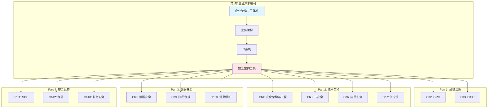

# Chapter 1: Enterprise Architecture Foundation

# 第一章:企业架构基础——安全架构的顶层逻辑

> **Enterprise Architecture Foundation: The Strategic Logic of Security Architecture**

---

## 章节信息

**核心定位**:建立企业架构体系框架,明确"安全服务业务"的顶层逻辑

**目标读者**：Security Leaders（CSO/CISO/VP）、Security Architects、Enterprise Architects、Business Leaders

---

## 安全架构服务业务的顶层逻辑

谈论安全架构时，我们首先需要回答一个核心问题：**安全存在的目的是什么?** 答案并非"保护系统""防止攻击"，而是**使能业务(Enable Business)**。这一定位决定了安全架构不能孤立设计，而必须嵌入企业架构的完整体系中。

在企业架构框架中,安全架构位于规划层,承接战略层的业务目标,指导落地层的具体实施。这种分层架构确保安全投资与业务优先级对齐,安全控制与技术栈相适配,安全运营与业务节奏同步。当安全团队脱离这一体系,独立制定"完美"的安全方案时,往往会陷入"技术很酷但业务不买单"的困境——预算被削减,团队被边缘化,关键的合规认证反而无人推进。

因此,本章遵循"企业架构→业务架构→IT架构→安全架构"的递进逻辑，系统阐述安全如何在三个层级(战略/规划/落地)中找准定位，发挥价值。

### 本书的 AI 视角

本书以 AI 驱动的视角重新审视企业安全架构。在传统安全体系基础上，系统展示 AI 如何在威胁检测、事件响应、漏洞分析、合规自动化等关键环节提升能力（详见 Ch 14-15 AI 专题章节）。各业务领域章节（Ch 2-13）的实战案例中均包含 AI 技术的实际应用场景，展现 AI 如何贯穿治理、开发、运营、业务等全生命周期，从"点状工具"升级为"体系化能力"。

---

## 章节结构

本章共4节,按照从宏观到具体、从理论到实践的递进逻辑展开:

```
第1章 企业架构基础
│
├── 1.1 企业架构三层体系
│   ├── 战略层:明确业务目标与方向
│   ├── 规划层:将战略转化为架构方案
│   ├── 落地层:推动架构方案落地执行
│   └── 安全架构嵌入点
│
├── 1.2 业务架构——战略/规划/落地的一致性
│   ├── 业务价值澄清
│   ├── 业务架构原则
│   ├── 关键活动(规划层、落地层、架构治理)
│   ├── 价值链与安全活动映射
│   └── 产出
│
├── 1.3 IT架构——TOGAF BDAT与Cloud映射
│   ├── IT架构原则
│   ├── TOGAF BDAT四层架构
│   ├── 参考实施模型
│   └── 控制映射示例
│
└── 1.4 安全架构全景——从战略到落地
    ├── 安全治理三域(基础安全、应用安全、数据安全)
    ├── 四层云架构映射(Cloud/IaaS/PaaS/SaaS)
    ├── 三位一体治理模式(管理/技术/运营)
    ├── 零信任基线
    ├── 安全生命周期活动(战略→规划→落地)
    ├── 产出与目标
    └── 与后续章节的关系
```

---

## 企业架构三层体系与安全嵌入点

企业架构的三层体系将企业的战略意图转化为可执行的技术方案。在这一框架中,安全架构并非独立层级,而是嵌入在每个层级的关键节点上,确保安全目标与业务目标同频共振。

**战略层(Strategy Layer)**的核心职责是明确**WHY——为什么做**。

在这一层级,CEO与董事会制定企业战略、业务愿景与核心目标。安全团队在此阶段的嵌入点包括:参与战略制定,明确安全战略与业务战略的对齐点;建立GRC(治理、风险、合规)框架,定义企业的风险偏好;争取安全预算,将安全投资与业务价值挂钩。战略层的缺位会导致安全团队成为"救火队",被动响应问题而非主动规划能力建设。

**规划层(Planning Layer)**的核心职责是明确**WHAT——做什么**。

这一层级将战略目标转化为业务架构、数据架构、应用架构、技术架构(TOGAF BDAT模型)。规划层是**安全架构的核心层级**,安全团队在此承担:设计基础安全架构(身份与访问、网络分段、密钥管理);设计应用安全架构(SDL流程、API安全、供应链安全);设计数据安全架构(分类分级、加密策略、跨境合规)。规划层的产出物包括架构蓝图、安全标准、威胁模型、技术选型指南,这些文档指导落地层的具体实施。

**落地层(Implementation Layer)**的核心职责是明确**HOW——怎么做**。

这一层级推动架构方案的实际部署,包括IT系统项目开发、产品交付、运维运营。安全团队在此阶段的嵌入点包括:在研发流程中嵌入SDL,在CI/CD流水线中集成安全扫描(DevSecOps),在生产环境中部署持续监控与响应能力(SOC)。落地层是安全控制真正发挥效用的环节,也是最容易与业务产生摩擦的环节——安全门禁阻塞上线、误报消耗研发精力、性能开销影响用户体验。因此,落地层的成功依赖规划层的精细设计与战略层的明确支持。

这三个层级并非单向流动,而是通过反馈机制形成闭环:落地层的安全事件与运营数据反馈到规划层,驱动架构优化与威胁模型更新;规划层识别的系统性风险反馈到战略层,触发风险偏好调整与预算重新分配。缺乏反馈机制的架构体系会陷入"设计与现实脱节"的困境,架构文档沦为"纸上谈兵"。

---

## TOGAF BDAT四层架构与安全控制映射

TOGAF(The Open Group Architecture Framework) 提出的BDAT四层架构模型,为企业架构提供了清晰的分层视角。在云计算时代,这一模型依然适用,但需要与现代技术栈(Cloud/IaaS/PaaS/SaaS)相结合。

**Business(业务)层**

关注业务能力图、价值流、服务蓝图。安全控制在此映射为业务连续性管理、业务风控、反作弊系统。例如,在支付业务中,业务风控不仅识别欺诈交易,还需要平衡风控强度与用户体验——过严的风控规则会导致正常用户的支付被拦截,影响GMV(Gross Merchandise Volume)。这种权衡需要在业务层明确定义风险容忍度。

**Data(数据)层**

关注数据域、主数据、血缘关系、跨境策略、生命周期管理。安全控制在此包括数据分类分级(按敏感度分L0-L4)、加密与脱敏(静态加密/传输加密/代币化)、血缘追踪与访问审计、备份与恢复、数据驻留管理(GDPR/PIPL要求)。在跨国企业中,数据跨境传输需要满足欧盟GDPR的"充分性认定"或标准合同条款(SCC),中国PIPL的安全评估,美国的云法案(CLOUD Act)——这些法规要求在数据层架构中必须显式体现。

**Application(应用)层**

关注应用组件、微服务、集成模式、API与事件、可观测性。安全控制在此包括认证鉴权(OAuth 2.0/OIDC/mTLS)、输入校验(防注入攻击)、SDL流程(SAST/DAST/SCA)、WAF/RASP(运行时防护)、API安全(速率限制/签名验证)。在微服务架构中,服务间的调用链可能经过数十个中间节点,任何一个节点的权限配置错误都可能导致特权提升。因此,应用层的安全设计需要考虑"零信任"原则,即使在内部网络中,服务间的调用也需要显式认证与授权。

**Technology(技术/基础设施)层**

关注云资源(Cloud)、IaaS(计算/存储/网络)、PaaS(容器/数据库/消息队列)、SaaS(第三方服务)。安全控制在此包括CSPM(Cloud Security Posture Management,云安全态势管理)、CIEM(Cloud Infrastructure Entitlement Management,云权限管理)、网络分段(VPC/安全组/微隔离)、密钥管理(KMS/HSM)、日志集中化(SIEM)。在多云环境中,不同云服务商(AWS/Azure/GCP)的IAM模型、网络架构、加密服务存在差异,技术层的安全架构需要提供统一的抽象层,避免团队为每个云平台单独设计安全方案。

---

## 安全治理三域

在规划层,安全架构师通常将企业安全能力划分为三个治理域:

**基础安全(Infrastructure Security)**、**应用安全(Application Security)**、**数据安全(Data Security)**。

这一划分并非学术分类,而是基于职责边界与技术栈的工程实践。

**基础安全域**的职责是保护IT基础设施,包括身份与访问管理(IAM)、网络分段(防火墙/微隔离)、主机与容器/Kubernetes安全、终端防护(EDR)、云安全态势管理(CSPM)、特权访问管理(PAM/堡垒机)。这一域的关键挑战是**规模与复杂度的平衡**。在拥有数千台服务器、数百个Kubernetes集群的企业中,手动管理安全组规则或IAM策略是不可能的,必须依赖自动化工具(IaC, Infrastructure as Code)与策略即代码(Policy as Code)。但自动化也引入新的风险:一个错误的Terraform脚本可能在数分钟内将所有生产数据库的3306端口暴露到公网。

**应用安全域**的职责是保护应用程序,包括认证鉴权(OAuth/OIDC/SAML)、输入校验(防SQL注入/XSS)、日志与可观测性(OpenTelemetry)、WAF/RASP(Web应用防火墙/运行时应用自保护)、API管理(网关/速率限制/签名验证)、SAST/DAST/IAST(静态/动态/交互式应用安全测试)、供应链安全(SBOM/SLSA)。这一域的关键挑战是**开发速度与安全质量的权衡**。在敏捷开发与持续交付的环境中,安全扫描如果耗时超过5分钟,就会被开发团队视为"流水线瓶颈"而想方设法绕过。因此,应用安全工具必须满足"快速""低误报""可自动修复"三个要求,否则难以在DevOps文化中生存。

**数据安全域**的职责是保护数据资产,包括分类分级(按敏感度分L0-L4)、加密与密钥管理(KMS/HSM/Envelope Encryption)、脱敏/代币化(Tokenization)、访问审计(Who/What/When/Where)、驻留与跨境(GDPR/PIPL要求)、备份恢复/DLP(Data Loss Prevention)、隐私工程(Privacy by Design)。这一域的关键挑战是**合规要求与业务效率的矛盾**。例如,GDPR要求企业在收到用户请求后30天内删除个人数据,但在分布式系统中,数据可能散落在数十个微服务、消息队列、日志系统、备份存储中,完全删除需要数周的工程工作。如何在满足合规的同时,避免业务流程停滞,是数据安全架构师必须解决的现实问题。

这三个域并非孤立运作,而是协同配合。例如,在处理敏感数据的API(应用安全)中,需要验证调用者的身份(基础安全),并对数据进行加密传输与访问审计(数据安全)。域之间的边界也在演变:容器安全究竟属于基础安全还是应用安全?API网关的速率限制是应用安全还是基础安全?在实践中,这些边界往往由团队的组织结构决定,而非纯粹的技术逻辑。

---

## 与其他章节的关系

本章建立了企业架构→安全架构的顶层逻辑框架,后续15个章节基于此框架展开:

**Part 1: Foundation & Strategic Governance(基础与战略治理)**对应战略层。Chapter 2深化GRC治理框架,建立风险管理与合规体系;Chapter 3引入BISO(Business Information Security Officer)模式,确保安全团队深度嵌入业务线,而非作为独立职能部门游离于业务之外。

**Part 2: Technical Architecture(技术架构与基础设施安全)**对应规划层。Chapter 4深化安全架构方法论(SABSA/威胁建模/架构审查);Chapter 5详细设计云安全架构(多云IAM/VPC/CSPM);Chapter 6详细设计应用安全架构(SDL/DevSecOps/API安全);Chapter 7专注供应链安全(SBOM/SLSA/依赖混淆防御)。

**Part 3: Data Security & Privacy(数据安全与隐私保护)**对应规划层的数据域。Chapter 8详细设计数据安全架构(分级加密/血缘追踪/DLP);Chapter 9聚焦隐私合规(GDPR/PIPL/CCPA);Chapter 10聚焦信息保护(文档安全/IP保护/远程办公安全)。

**Part 4: Security Operations(安全运营与防御能力)**对应落地层。Chapter 11建立SOC能力(威胁检测/SIEM/SOAR);Chapter 12建立红队能力(渗透测试/攻防演练);Chapter 13建立业务安全能力(反欺诈/反作弊/内容安全)。

**Part 5: AI-Driven Security Innovation(AI驱动的安全创新)**展示AI如何在各层级提升能力。Chapter 14阐述AI for Cybersecurity(AI赋能威胁检测/漏洞分析);Chapter 15阐述Security for AI(AI系统本身的安全治理,如大模型的提示注入/数据投毒/模型窃取)。

**Part 6: Security Leadership(安全领导力与组织卓越)**支撑整个架构体系。Chapter 16聚焦人员、流程、文化,阐述如何建立高效的安全组织,培养安全人才,建立安全文化。



---

## 关键决策问题

在学习本章内容的过程中,以下问题可以帮助你验证对企业架构框架的理解,并思考如何将这一框架应用于实际工作:

**战略对齐问题**:你所在企业的安全战略是如何与业务战略对齐的?是否存在安全团队埋头做技术方案,但CEO/CFO不认可其价值的脱节现象?如果存在,问题出在战略层、规划层还是落地层?

**价值量化问题**:如何向CEO/CFO说明安全投资的ROI?尝试使用本章的价值澄清框架,设计一个针对某个具体安全项目(如零信任改造、SOC建设)的投资回报分析,包括避免的损失(ALE,Annual Loss Expectancy)、带来的收益(如通过ISO 27001认证后增加的合同)、投资成本(工具+人力+时间)。

**架构嵌入问题**:在企业架构三层体系中,安全团队应该在哪一层介入最早?为什么?如果安全团队只在落地层(如代码审查、漏洞扫描)参与,会导致什么问题?如果在战略层缺位,会有什么后果?

**云时代挑战**:TOGAF的BDAT四层架构在云原生时代是否仍然适用?需要做哪些调整?例如,在微服务架构中,应用层与技术层的边界在哪里?在Serverless架构中,谁负责容器安全?

**零信任vs传统边界**:零信任架构与传统边界防护相比,在企业架构层面有哪些本质区别?如果你的企业仍然采用传统的VPN+内网信任模式,迁移到零信任架构需要在战略层、规划层、落地层分别做哪些准备?

这些问题没有标准答案,但思考过程会帮助你建立从企业架构视角审视安全问题的思维方式。

---

## 企业架构框架参考文献

### 参考框架

- **SABSA** - Sherwood Applied Business Security Architecture: https://sabsa.org
- **TOGAF** - The Open Group Architecture Framework: https://www.opengroup.org/togaf
- **NIST CSF** - NIST Cybersecurity Framework: https://www.nist.gov/cyberframework
- **ISO/IEC 42010** - Systems and Software Engineering - Architecture Description

### 推荐资源

- 《Enterprise Security Architecture》- Nicholas A. Sherwood
- 《TOGAF 9.2 Specification》- The Open Group
- 《Security Architecture: Design, Deployment & Operations》- Christopher King
- 企业架构设计方法与实践: https://tonydeng.github.io/EA-practices/

---

## 关键术语

| 术语     | 英文                                        | 说明                        |
| -------- | ------------------------------------------- | --------------------------- |
| 企业架构 | Enterprise Architecture (EA)                | 连接业务战略与IT实施的桥梁  |
| TOGAF    | The Open Group Architecture Framework       | 企业架构设计的通用方法论    |
| BDAT     | Business/Data/Application/Technology        | TOGAF核心的四层架构模型     |
| SDL      | Security Development Lifecycle              | 安全开发生命周期            |
| BISO     | Business Information Security Officer       | 业务安全伙伴/业务信息安全官 |
| CSPM     | Cloud Security Posture Management           | 云安全态势管理              |
| CIEM     | Cloud Infrastructure Entitlement Management | 云基础设施权限管理          |
| ADR      | Architecture Decision Record                | 架构决策记录                |
| ROSI     | Return on Security Investment               | 安全投资回报率              |
| ALE      | Annual Loss Expectancy                      | 年度预期损失                |

---

## 章节文件

- **[1.1 企业架构三层体系](./1.1_enterprise_architecture_three_layers.md)**

  - 战略层、规划层、落地层的职责与协同
  - 安全架构在各层的嵌入点
- **[1.2 业务架构](./1.2_business_architecture.md)**

  - 业务价值澄清(资本、市场、用户、技术、合规)
  - 业务架构原则与关键活动
  - 价值链与安全活动映射
- **[1.3 IT架构](./1.3_it_architecture.md)**

  - TOGAF BDAT四层架构详解
  - 云时代的架构映射(Cloud/IaaS/PaaS/SaaS)
  - 参考实施模型与控制映射
- **[1.4 安全架构全景](./1.4_security_architecture_landscape.md)**

  - 安全治理三域(基础/应用/数据)
  - 四层云架构映射
  - 三位一体治理模式
  - 零信任基线
  - 安全生命周期活动

---

## 导航

**[← 返回 Part 1](../)** | **[返回章节导航](../../)** | **[→ 下一章: 第2章](../chapter_02_grc_governance_risk_compliance/)**

### 本章节目录

- **[1.1 企业架构三层体系](./1.1_enterprise_architecture_three_layers.md)**
- **[1.2 业务架构](./1.2_business_architecture.md)**
- **[1.3 IT架构](./1.3_it_architecture.md)**
- **[1.4 安全架构全景](./1.4_security_architecture_landscape.md)**

---

© 2025 AI-ESA Project. Licensed under CC BY-NC-SA 4.0
