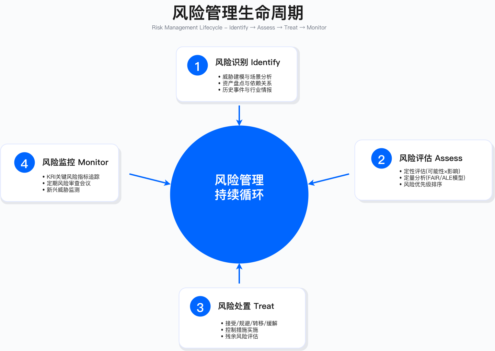

# 执行摘要

> **本节目标**：阐述 GRC（治理、风险与合规）体系的战略定位与业务影响，为后续章节建立治理基础。

---

## GRC 的战略背景

GRC 体系的核心问题不是"是否需要"，而是"如何将其嵌入业务运营"。企业在董事会层面面临的 GRC 失败，通常表现为三类业务冲击，每类冲击的根源往往不是资源不足，而是执行层面的系统性缺陷。

### 三类业务冲击的典型表现

**监管处罚**

企业因合规执行不到位收到监管罚款，典型场景包括：数据泄露通知延迟（GDPR 要求 72 小时内通知监管机构）、未在法定期限内响应数据主体请求（DSR）、跨境传输未完成数据出境安全评估。这类失败的共同特征是：流程存在但未嵌入日常运营，或责任边界模糊导致响应延迟。

**市场准入受阻**

企业因缺乏认证失去关键客户订单。ToB 销售中，安全认证（如 SOC 2 Type II）已从加分项变为准入门槛。跨国扩张时，数据本地化与隐私合规要求可能阻断业务进入特定市场。典型的时间错配问题在于：认证周期通常需要 9-12 个月，而销售窗口可能只有 1-3 个月。

**风险转移成本**

企业在网络保险续保时遭遇拒保或保费上涨。保险公司要求提供漏洞管理、事件响应、灾备测试等控制措施的证据。过往安全事件记录、行业风险评级都会影响承保决策。

这三类冲击的共同点在于：GRC 不再是可选项，而是直接影响企业财务（罚款）、营收（市场准入）和成本结构（风险转移）的运营要素。

### 监管环境的主要特征

当前监管环境呈现以下特征：

**法规复杂度上升**。以跨境数据传输为例，欧盟 GDPR 要求数据留在欧盟，美国 CLOUD Act 要求向执法部门提供数据，跨国企业面临法规冲突的困境。主要法规类别包括：数据保护法规（GDPR、PIPL、CCPA 等）、行业合规标准（PCI-DSS、SOC 2、ISO 27001、HIPAA 等）、新兴监管领域（EU AI Act、NIS2 指令、SEC 网络披露规则等）。

**处罚力度提高**。GDPR 罚款上限为全球年营收的 4% 或 €20M（取较高者），对大型企业而言可能达到数十亿规模。

**多法规冲突**。典型案例如 GDPR 要求数据可删除，而金融监管要求数据留存 7 年——如何在技术与流程层面平衡这类冲突，是 GRC 设计的关键挑战。

---

## 章节核心目标

本章提供系统化的 GRC 治理框架，帮助读者从战略到执行建立完整的治理、风险与合规体系。

### 战略层面

理解 GRC 三支柱（治理、风险、合规）的协同逻辑与业务价值；掌握 GRC 成熟度模型并制定演进路线图；将 GRC 战略与业务目标、风险偏好对齐。

### 技术层面

实施 FAIR、ALE 等量化风险评估方法，将风险转化为财务语言；建立四级政策框架（集团→主题→业务→技术）与控制措施库；设计 ROPA（处理活动记录）、DPIA（数据保护影响评估）等关键流程；评估 GRC 平台选型与部署策略。

### 运营层面

建立风险委员会、合规季度评审等治理例会机制；开发面向董事会和高管的风险报告框架；建立第三方风险管理（TPRM）全生命周期流程。

### 合规层面

满足 GDPR、PIPL、SOC 2、ISO 27001、PCI-DSS 等主流法规要求；建立合规差距分析方法与认证路径规划；应对跨境数据传输与数据本地化挑战。

---

## 核心概念与框架

### GRC 治理框架

**GRC 三支柱协同模型**

GRC 体系由治理、风险、合规三个支柱构成，各支柱解决不同层面的问题：治理（Governance）解决"谁来决策"——建立安全委员会、制定政策标准、定义决策流程；风险（Risk）解决"可能出什么问题"——风险识别、评估、处置、监控；合规（Compliance）解决"必须做什么"——法规跟踪、差距分析、证据收集、审计管理。

多数企业的 GRC 三支柱实际上是"三张皮"——治理归安全部、风险归风控部、合规归法务部，缺乏统一视图与协同机制。这种分割导致的问题包括：重复劳动（多部门分别收集类似证据）、责任真空（跨部门问题无人牵头）、信息孤岛（风险数据无法共享）。

**适用边界**：GRC 三支柱模型适用于已建立基本安全职能的组织；对于尚无专职安全人员的初创企业，建议先建立最小可行的安全流程，再逐步完善 GRC 体系。

**常见误区**：
- 误将 GRC 等同于合规——GRC 的核心是风险驱动的决策，合规只是输出之一
- 组织架构决定协同效果——即使三支柱归属不同部门，仍可通过联席会议和共享平台实现协同

**GRC 成熟度模型**

GRC 成熟度分为四个级别：Level 1（被动响应）表现为临时应对、手工流程、合规驱动，典型存在于初创企业和中小企业；Level 2（初步管理）表现为基本流程、部分自动化、定期评估，典型存在于成长期企业；Level 3（主动治理）表现为标准化流程、风险量化、持续监控，典型存在于成熟企业；Level 4（优化卓越）表现为预测性分析、数据驱动、战略整合，典型存在于行业领导者。

**关键约束**：成熟度演进不可跨级——从 Level 1 直接跳到 Level 3 通常会失败，因为缺乏中间阶段积累的流程基础和组织能力。

**验证方法**：成熟度评估可采用自评问卷结合外部审计的方式。验证要点包括：流程文档是否存在且被执行、工具是否被实际使用并产生数据、风险决策是否有记录可追溯。

**组织架构选择**

集中式 GRC 适合规模较小、业务单一的组织，优点是快速决策，缺点是可能脱离业务实际；分布式 GRC 适合多业务线、跨国企业，优点是贴近业务，缺点是标准可能不一致；混合式 GRC 结合集中专家团队与嵌入式 BISO，在专业性与灵活性之间取得平衡。

### 风险管理体系

**风险管理生命周期**

风险管理遵循"识别→评估→处置→监控→复盘"的循环过程。识别阶段通过威胁建模发现风险源；评估阶段使用 FAIR 等模型量化风险；处置阶段根据风险偏好决定接受、降低、转移或规避；监控阶段通过 KRI 指标持续跟踪；复盘阶段固化经验教训。

**FAIR 模型量化方法**

FAIR（Factor Analysis of Information Risk）将风险量化为财务损失。其核心公式为：风险 = 损失事件频率（LEF）× 损失幅度（LM）。其中，损失事件频率 = 威胁事件频率 × 脆弱性；损失幅度 = 主要损失 + 次要损失。

量化评估的典型步骤如下：

第一步，评估事件发生频率。参考行业基准数据（如行业报告、历史事件统计），评估内部控制成熟度（加密、访问控制、DLP 部署情况），综合判断年度发生概率区间。

第二步，评估单次损失金额。主要损失包括监管罚款、事件响应成本（取证、修复、通知）；次要损失包括客户流失、品牌受损、保险保费上涨、诉讼赔偿。

第三步，计算年度预期损失（ALE）。ALE = LEF × LM，得出年度预期损失金额。

第四步，支撑投资决策。评估控制措施成本，估算实施后的残余风险，计算投资回报。

**关键约束**：
- 数据可得性：行业基准数据可能与企业实际情况存在偏差，需要结合内部历史数据校准
- 损失估算难度：品牌受损、客户流失等无形损失难以精确量化，建议采用区间估算
- 控制有效性：残余风险评估依赖对控制措施有效性的判断，存在主观性

**常见误区**：
- 过度追求精确——风险量化的价值在于提供决策依据，区间估算比虚假精确更有意义
- 忽视主观判断的记录——应记录量化过程中的假设和判断依据，便于后续复盘

**验证方法**：风险量化模型应通过历史事件回测验证。选取过往安全事件，用模型计算当时的预期损失，与实际损失对比，校准模型参数。

**风险偏好与容忍度**

不同风险类型对应不同的处置策略。监管合规类风险通常采取零容忍策略，目标是 100% 合规；数据泄露类风险设定年度预期损失阈值，通过多层防护降低风险；供应链风险通过多源采购和保险转移相结合的方式控制；业务创新风险在 ROI 可接受的前提下适度承担。

**运行指标**：风险偏好的执行效果通过 KRI（关键风险指标）监控。典型 KRI 包括：合规事件数量（阈值：0）、高风险漏洞修复时间（阈值：根据组织能力设定）、关键供应商单点依赖比例（阈值：根据行业特征设定）。

**第三方风险管理（TPRM）流程**

TPRM 覆盖供应商全生命周期：尽调阶段（安全问卷、SOC 2 审查、现场审计）、合同阶段（SLA 定义、数据处理协议、审计权条款）、入网阶段（权限最小化、网络隔离、监控部署）、持续监控阶段（安全评分跟踪、漏洞通知、定期审查）、离网阶段（权限回收、数据销毁、证据留存）。

**适用边界**：完整的五阶段 TPRM 流程适用于关键供应商和处理敏感数据的供应商；对于低风险供应商，可采用简化流程以平衡资源投入。

**常见误区**：
- 资源分配不当——企业常对低风险供应商投入过多评估资源，而忽视高风险供应商的持续监控
- 忽视第四方风险——仅评估直接供应商，忽视供应商的供应商可能带来的风险传导

### 合规管理框架

**全球合规地图**

主要法规的适用范围和核心要求差异较大：GDPR 适用于处理欧盟居民数据的所有组织，核心要求包括数据保护、DSR 响应、DPIA、DPO 设置；PIPL 适用于处理中国居民数据的组织，核心要求包括个人信息保护、跨境评估、安全评估；SOC 2 Type II 主要面向 SaaS 和云服务商，关注安全、可用性、保密性、隐私、完整性五个信任服务原则；ISO 27001 是全球通用的信息安全管理体系认证；PCI-DSS 针对处理支付卡数据的组织。

**合规差距分析方法**

差距分析采用五步法：第一步，范围界定——确定适用法规与业务范围；第二步，现状评估——对照法规要求评估当前控制措施；第三步，差距识别——标注缺失、部分满足、完全满足的控制点；第四步，优先级排序——按风险高低、实施难度、监管重点排序；第五步，行动计划——制定时间表、责任人、预算与里程碑。

**验证方法**：差距分析的准确性可通过内部审计验证。内部审计发现的不符合项数量与差距分析预测的偏差，可用于评估分析方法的有效性。

**ISO 27001 快速认证路径**

认证实施框架通常分为以下阶段：

第 1-2 周完成差距分析与范围界定：完成 ISO 27001 控制措施差距分析，界定 ISMS 范围（建议聚焦核心产品或服务），识别关键系统与数据流。

第 3-6 周完成政策体系建立与风险评估：建立四级政策框架，编写政策文档（参考 ISO 27002 指南），完成信息资产风险评估。

第 7-10 周完成控制措施实施：优先实施高风险控制措施，部署技术控制，建立运营流程。

第 11-12 周完成内部审计与整改：执行内部审计，识别不符合项，制定整改计划并验证修复，准备审计证据包。

第 13 周进行外部认证审计：Stage 1 审计（文档审查），Stage 2 审计（现场验证），审计发现整改。

**关键约束**：
- 快速认证周期（如 90 天）需要全力投入且范围聚焦，是激进目标而非常规预期
- 认证期间团队会处于高负荷状态，需要预留缓冲
- 认证不等于合规结束——获得证书后需要年度监督审计与三年复审

**常见误区**：
- 范围最大化——首次认证试图覆盖所有系统，导致周期拉长、资源分散
- 认证后松懈——证书到手后流程荒废，下次审计时再突击准备

### 政策与标准体系

**四级政策框架**

政策体系分为四个层级：L1 集团政策面向全员，年度更新，需董事会或 CEO 审批；L2 主题标准面向技术团队，半年更新，需 CISO 或 CTO 审批；L3 业务指南面向业务部门，季度更新，需部门负责人审批；L4 技术规范面向工程师，按需更新，需技术负责人审批。

**控制措施库建设**

基于 NIST 800-53、ISO 27001、CIS Controls 等框架，建立企业统一控制库。控制库的核心价值在于：一个控制措施可同时映射多个法规要求（如"数据加密"同时满足 GDPR、PCI-DSS、SOC 2），减少重复实施和证据收集工作。

**验证方法**：控制措施库的有效性可通过审计效率指标验证——审计准备时间的缩短幅度反映控制库的成熟度。

### GRC 平台与工具

**GRC 平台选型维度**

选型评估的主要维度包括：核心能力（风险管理、策略管理、审计管理、事件管理的覆盖程度）、适用规模（不同平台对组织规模有不同的适配性）、集成能力（与 SIEM、CSPM、ITSM、HR 系统的集成难度）、实施周期（从采购到上线的时间）。

**选型建议**：隐私合规优先的场景侧重 DSR 自动化和 Cookie 同意管理能力；风险量化驱动的场景关注 FAIR 模型支持程度；已有 ITSM 生态的组织优先考虑与现有平台的集成性；预算有限时可考虑开源方案结合定制开发。

**关键约束**：
- 显性成本（平台许可、实施费用）之外，数据迁移、流程调整、变更管理等隐性成本常被低估
- 投资回报周期通常需要较长时间（大型企业可能需要两年以上）

### 治理例会与报告

**风险委员会运作机制**

风险委员会通常按季度召开，成员包括 CEO、CFO、CTO、CISO、CRO、法务总监、业务 VP。议程覆盖：Top 风险评审与趋势分析、新增重大风险（新业务、新法规、新技术）、风险处置进展与效果评估、合规审计发现与整改计划、年度风险偏好与容忍度调整。

**高管风险报告框架**

向高管汇报应采用"一页仪表盘"形式，包含：风险热力图（概率×影响矩阵）、趋势分析（评分月度变化）、合规状态（主要法规合规率）、事件摘要（季度内重大事件与处置结果）、投资建议（基于风险评估的预算建议）。

语言原则：避免技术术语（用"客户数据泄露风险"而非"S3 Bucket ACL 配置错误"）；量化风险（用"年度预期损失"而非"高风险"）；关联业务影响。

---

## 关键成功要素

### 高管赞助与董事会参与

有效的 GRC 体系需要董事会级别的风险治理承诺。成立董事会安全与风险委员会，季度审议风险报告；建立 CISO 与董事会的汇报通道，确保风险信息畅通。

**验证方法**：高管参与度可通过以下指标评估——风险委员会会议出席率、重大风险决策响应时间、安全投资预算批准流程效率。

### 跨职能协作

三道防线模型明确责任边界：第一道防线是业务部门（风险所有者）；第二道防线是 GRC、合规、风控（监督与支持）；第三道防线是内审（独立验证）。通过 RACI 矩阵避免"都负责等于都不负责"的责任真空，建立 GRC、法务、IT、业务的定期联席会议。

**常见误区**：GRC 团队孤军奋战，业务部门认为"合规是 GRC 的事"，导致政策悬空、流程形式化。

### 工具与自动化

手工维护风险登记册和合规矩阵在规模化后难以持续。GRC 平台的投资需要平衡短期成本与长期收益，API 集成实现 GRC 平台与 SIEM、CSPM、ITSM、HR 系统的数据自动流转。

### 持续改进与文化建设

PDCA 循环（Plan-Do-Check-Act）驱动持续改进。重大风险事件后的无责复盘（Blameless Postmortem）聚焦系统改进而非个人追责。合规 Champion 计划培养业务部门的合规倡导者。

---

## 常见陷阱

**合规复选框心态**。表现为：为了认证而合规，证书到手后流程荒废。避免方法：将合规融入日常运营，建立持续监控机制。

**风险评估流于形式**。表现为：年度一次的 Excel 风险登记册，数据陈旧无效。避免方法：季度更新、KRI 实时监控、动态风险评分。

**政策与现实脱节**。表现为：政策要求的响应时间与实际能力不匹配。避免方法：基于实际能力制定政策，逐步提升而非一步到位。

**工具孤岛**。表现为：采购多个 GRC 工具但不集成，数据不互通。避免方法：制定工具集成策略，建立统一数据视图。

**忽视第四方风险**。表现为：仅评估直接供应商，忽视供应商的供应商。避免方法：要求关键供应商提供其 TPRM 证据。

**合规等于安全的错觉**。表现为：通过认证但仍被攻破。避免方法：认识到合规是底线，安全需要超越合规要求的额外投资。

**认证范围界定的陷阱**。如果认证范围仅覆盖核心系统，而非核心系统未纳入，可能产生"合规孤岛"风险——攻击者从非核心系统横向移动进入核心系统。范围界定需考虑：网络连通性（非核心系统是否与核心系统网络互通）、数据流动（敏感数据是否在范围内外系统间流动）、访问权限（管理员权限是否同时覆盖范围内外系统）、供应链依赖（范围外的供应商是否可能影响范围内系统）。

---

## 衡量成功

### 领先指标（预防性）

- **风险覆盖率**：已识别并评估的业务流程和系统比例
- **政策覆盖率**：关键控制点有明确政策支撑的比例
- **合规培训率**：全员完成年度合规培训的比例
- **供应商评估率**：关键供应商完成安全评估的比例

### 滞后指标（检测性）

- **审计发现**：外部审计发现的重大不符合项数量
- **合规事件**：因合规失败导致的监管处罚或客户投诉数量
- **认证通过率**：一次性通过认证审计的比例
- **平均修复时间**：审计发现的不符合项平均整改周期

### 业务成果

- **市场准入**：因合规认证赢得的客户订单
- **保险成本**：网络保险保费变化趋势
- **融资尽调**：安全合规评估结果对融资进程的影响

**验证方法**：指标体系的有效性通过关联分析验证——领先指标与滞后指标之间是否存在预期的相关性（如风险覆盖率提高是否导致审计发现减少）。

---

## 实施路径

GRC 不是一次性项目，而是持续演进的能力体系。建议的实施路径：

**建立基线（0-3 个月）**：完成 GRC 成熟度评估，识别主要风险并建立风险登记册，完成主要法规的合规差距分析。

**快速赢得（3-6 个月）**：选择一个认证目标启动，建立四级政策框架，部署 GRC 工具并完成基础配置。

**规模化实施（6-18 个月）**：扩展 GRC 平台集成，建立 TPRM 全生命周期流程，通过目标认证。

**持续优化（18 个月以上）**：实施风险量化模型，建立风险委员会季度例会机制，将合规要求转化为产品特性。

**关键约束**：不要追求"完美合规"，而要聚焦"业务关键合规"——先保护核心业务、关键数据、监管重点，再逐步扩大范围。

---

## 本节小结

GRC 体系的核心价值在于：将治理（决策机制）、风险（量化评估）、合规（法规满足）一体化运作，支撑业务增长而非阻碍业务发展。

关键要点：GRC 三支柱协同运作的前提是统一的数据视图和明确的责任边界；成熟度演进需要循序渐进，不可跨级；风险量化的价值在于支撑决策，而非追求精确；认证是起点而非终点，持续合规需要持续投入。

---

**下一节预告**：[2.1 GRC 治理框架](./2.1_grc_governance_framework.md) - 深入 GRC 三支柱协同模型、成熟度评估方法与组织架构设计。

---

## 导航

**[← 返回章节目录](./README.md)** | **[→ 下一节：2.1 GRC 治理框架](./2.1_grc_governance_framework.md)**

---

© 2025 AI-ESA Project. Licensed under CC BY-NC-SA 4.0

