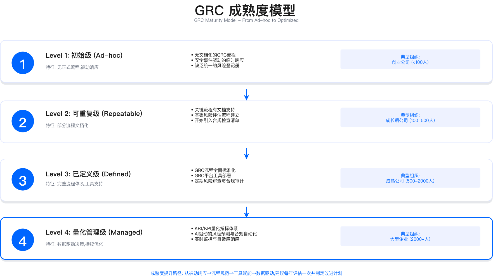

# 2.1 GRC治理框架

## 本节概要

本节阐述GRC（治理、风险、合规）三支柱的核心逻辑、成熟度递进路径、业务战略对齐方法，以及组织架构设计原则。GRC的价值不在于合规本身，而在于将碎片化的风险管理、合规审计、安全控制活动整合为统一体系，为业务扩张与监管应对提供可验证的治理能力。

---

## 2.1.1 GRC三支柱：治理的核心逻辑

### 三支柱失调的代价

GRC（Governance, Risk & Compliance）并非三个独立职能的简单叠加，而是相互支撑的治理体系。实践中常见的问题是"治理归安全部、风险归风控部、合规归法务部"，三者各自运行独立系统、使用不同评估方法、产出无法对齐的报告。这种失调通常在IPO尽调、监管检查、大客户审计等外部压力测试时暴露。

**失调表现一：重复劳动与资源浪费**

三套独立系统管理风险是典型症状：安全部用电子表格管理技术风险，风控部用自研系统管理业务风险，法务部用文档管理合规清单。同一风险事件被重复记录——例如"数据泄露"在安全部记录为技术风险，在风控部记录为操作风险，在法务部记录为GDPR合规风险，三者之间无关联。每次外部审计时，同一控制措施需要为不同框架分别准备证据。

**失调表现二：责任真空与决策混乱**

当被问及"企业整体风险暴露水平"时，三个部门各自给出不同答案。安全部认为某加密项目优先级高（技术风险视角），风控部认为优先级中等（业务影响视角），法务部认为优先级低（合规不强制），导致预算分配缺乏统一依据。同一企业的GRC成熟度，不同部门自评可能相差两个级别。

**失调表现三：信息孤岛与知识断层**

风险评估方法不统一：安全部用CVSS评分（0-10分），风控部用可能性与影响矩阵，法务部用三级分类。控制措施重复建设——安全部部署DLP工具监控数据外传，合规部又部署CASB监控云端数据，两个工具功能重叠但彼此不知情。同一问题被不同部门分别研究，产生多份不同解决方案。

**失调表现四：监管风险与市场损失**

对外宣称已实施数据加密，但三个部门给出的加密算法、密钥管理方案各不相同，监管机构质疑真实性。外部审计发现的问题需要多个部门协调整改，因责任边界不清导致整改周期延长。跨境数据传输风险在安全部、法务部、风控部之间存在认知差异，最终可能因合规缺失被监管处罚。

### 三支柱整合的关键要素

避免上述代价需要建立统一的GRC治理框架。下表列出整合的四个核心要素及其选择依据：选择这些维度是因为它们直接对应失调表现——统一风险语言解决评估方法不一致问题，统一管理平台解决数据孤岛问题，统一治理机制解决责任真空问题，统一度量体系解决决策混乱问题。

| 要素 | 说明 | 实践示例 |
|------|------|---------|
| **统一的风险语言** | 三个部门使用相同的风险分类、评分标准、术语定义 | 统一使用影响与可能性矩阵（如NIST风险评分标准），建立术语表 |
| **统一的管理平台** | 风险、合规、审计数据集中在同一GRC平台 | 部署集成式GRC平台，整合各部门风险至统一登记册 |
| **统一的治理机制** | 建立GRC委员会，定期协调三个部门 | CISO、CRO、DPO、法务、财务组成GRC委员会，定期评审重大风险 |
| **统一的度量体系** | 使用相同的KPI/KRI指标衡量GRC成效 | 统一使用"合规项目按期率""风险量化覆盖率""审计整改周期"等指标 |

整合并不意味着取消各部门的专业分工，而是在保持独立性的基础上建立协同机制，确保"一个风险、一套数据、一个视图、一致行动"。

### 三支柱的核心定位

**Governance（治理）：明确方向与决策机制**

核心问题是"谁决策？方向是什么？"关键活动包括：战略对齐（确保安全、风险、合规活动与业务目标一致）、政策制定（建立企业级政策体系）、组织设计（明确角色、职责、汇报线）、监督机制（董事会/高管监督、治理例会、KPI/KRI跟踪）。主要产出包括GRC章程、风险偏好声明、政策框架与标准体系、治理架构图与RACI矩阵、董事会报告。

**Risk（风险）：量化不确定性，优化资源配置**

核心问题是"什么可能出错？概率多大？影响如何？"关键活动包括：风险识别（全域风险扫描覆盖战略、运营、技术、合规、第三方、新兴风险）、风险评估（定性RCSA与定量FAIR/ALE）、风险处置（缓解、接受、转移、规避四种策略）、风险监控（KRI指标监测、风险热力图、趋势分析）。主要产出包括风险登记册、风险处置计划、风险热力图、KRI看板、风险报告。

**Compliance（合规）：满足法规，支撑市场准入**

核心问题是"必须做什么？做对了吗？"关键活动包括：法规监测（跟踪全球法规变化）、差距分析（对照控制框架识别合规差距）、合规项目（制定整改计划、分配责任、跟踪进度）、审计准备（收集证据、准备审计、获取认证）。主要产出包括法规地图、合规差距报告、合规项目计划、审计证据包、认证证书。

### 三支柱的协同逻辑

GRC不是线性流程，而是闭环循环：治理层制定政策与标准，风险层基于政策识别并评估风险（包括合规风险），合规层将法规要求转化为控制措施嵌入控制库，控制库的有效性监测结果反馈至风险层，风险层与合规层分别向治理层汇报风险态势与合规状态，治理层据此调整策略、批准例外或接受风险。

**协同案例：数据跨境治理**

在治理层，董事会批准《跨境数据传输政策》，明确数据出境必须满足法规要求并经过风险评估。在风险层，风险团队评估跨境数据传输场景，使用FAIR模型量化数据泄露风险，识别高风险国家或地区。在合规层，合规团队对照GDPR、PIPL要求，执行传输影响评估（TIA）、签署标准合同条款（SCC）、提交必要备案。

**适用边界**：三支柱模型适用于具备独立风险管理、合规、安全职能的组织。对于小型企业（如50人以下），这三个职能可能由同一人或同一团队兼任，此时模型简化为单一职能内的多维度关注。

**常见误区**：
- 将GRC理解为三个独立项目而非一体化体系，导致项目完成后仍无法协同
- 过度关注工具平台而忽视组织协同机制，平台上线后各部门仍各自为政

---

## 2.1.2 GRC成熟度模型：四级递进路径

### 成熟度模型总览

成熟度模型的目的是帮助企业评估当前GRC能力水平，识别提升方向。下表定义四个成熟度级别的核心特征。选择这四个级别是因为它们对应组织能力的关键跃迁点：从无流程到有流程、从人工推动到系统强制、从定性描述到定量分析。

| 级别 | 名称 | 特征 | 关键挑战 |
|------|------|------|---------|
| **Level 1** | 初始级（Ad-hoc） | 无正式流程，被动响应监管与事件 | 缺乏文档化流程，依赖个人经验 |
| **Level 2** | 可重复级（Repeatable） | 部分流程文档化，关键流程可重复 | 流程碎片化，工具分散，跨部门协作弱 |
| **Level 3** | 已定义级（Defined） | 完整流程体系，工具支持，全员参与 | 数据孤岛，量化能力不足 |
| **Level 4** | 量化管理级（Managed） | 数据驱动决策，持续优化，预测能力 | 如何保持敏捷性，避免过度流程化 |

### Level 1：初始级

**核心特征**：无正式GRC流程文档；被动响应审计、监管、客户要求；风险评估依赖个人经验；合规证据散落在邮件与文档中。

**典型失败场景：审计证据链断裂**

Level 1组织在面临SOC 2 Type II、ISO 27001等审计时，常遭遇证据链断裂。具体表现包括：日志散落在多个系统且保留期不足审计要求；权限变更无审批记录，配置文件无版本控制；安全培训仅有邮件通知，无签到记录；事件响应计划仅存在于草稿状态，从未正式发布或演练。

**验证方法**：评估当前状态是否属于Level 1，可检查以下项：是否存在正式发布的安全政策文档；日志保留是否满足目标合规框架要求（如SOC 2通常要求一年）；变更管理是否有审批记录；安全培训是否有完成记录。

**提升路径**：启动基础合规项目（如ISO 27001或SOC 2）作为驱动力；建立简单风险登记册（电子表格即可）；制定核心政策（安全政策、隐私政策、事件响应计划）；指定专人负责GRC协调。

### Level 2：可重复级

**核心特征**：关键流程文档化（风险评估、合规审查、事件响应）；部分工具支持（SIEM、漏洞管理、文档管理系统）；但流程执行依赖人工推动，跨部门协作仍需改进。

**典型陷阱：流程在纸面，执行靠自觉**

Level 2组织通常已通过基础认证，建立了基本GRC流程和工具，但面临流程执行依赖人工推动的问题。常见绕过场景包括：安全审查要求所有新项目上线前通过，但相当比例的项目因业务压力跳过——安全团队无法感知所有上线项目；风险评估要求新功能上线前执行，但风险登记册由单人维护，其他部门不知道文件存在；变更审批要求CAB批准，但紧急变更走"快速通道"时缺少自动化卡点。

**关键约束**：从Level 2到Level 3的核心障碍不是技术而是组织习惯。需要投入资源建立流程自动化卡点（如CI/CD集成安全扫描、工单系统集成审批流程），这涉及工具投资和流程再造。

**常见误区**：
- 认为通过认证等同于达到Level 3，实际上认证只是底线而非目标
- 增加流程文档数量而不建立执行监控机制

**提升路径**：建立SDL流程并嵌入安全评审；引入GRC工具实现流程自动化；设立BISO角色对接核心业务线；建立定期GRC例会（风险委员会、合规评审）。

### Level 3：已定义级

**核心特征**：完整GRC流程体系（策略、标准、指南、模板）；GRC平台支持（统一风险、合规、政策管理）；全员参与（业务、技术、运营全覆盖）；跨区域治理能力。

**典型瓶颈：无法量化GRC投资回报**

Level 3组织已建立完整GRC体系，但面临无法用财务语言证明GRC价值的挑战。CFO常问："GRC投资降低了多少风险？"Level 3组织通常回答过程指标（处理了多少风险项、覆盖率提升了多少），而非财务成果（避免了多少损失）。当被问及"如果削减预算，风险会增加多少"时，定性描述无法支撑预算决策。

**关键约束**：风险量化需要专业能力（如FAIR方法论培训）、历史数据（过往安全事件、行业breach报告）、跨部门协作（业务影响评估、法务罚款评估、财务客户流失计算）。缺乏任一要素都会影响量化的可信度。

**验证方法**：检查Level 3是否具备向Level 4跃迁的基础：是否有完整的安全事件历史记录；是否有业务影响评估流程；是否有财务部门参与风险评估；团队是否接受过风险量化方法培训。

**提升路径**：引入风险量化方法（FAIR或ALE）；建立KRI/KPI指标体系并与业务目标对齐；实施连续控制监测；建立风险预测模型。

### Level 4：量化管理级

**核心特征**：数据驱动决策（所有重大风险量化）；预测能力（基于历史数据的风险趋势预测）；持续优化（定期复盘与改进）。

**核心能力一：用财务语言量化风险**

Level 4组织使用FAIR模型将重大风险转化为年度预期损失（ALE）。量化过程包括：估算损失事件频率（基于行业基准与内部控制评估）、评估可能损失频率（威胁能力与当前抵抗强度的对比）、估算损失幅度（综合监管罚款、客户流失、品牌损害）、计算ALE并与控制投资对比得出ROI。

量化能力的价值在于将预算讨论从"需要投资安全"转变为"投资X可降低Y风险敞口，ROI为Z"。CFO可基于此做出数据驱动的预算决策。

**核心能力二：预测性风险管理**

Level 4组织基于历史数据与业务计划，预测未来风险热点。例如，当业务计划进行云迁移时，结合过去权限误配置事件数据和威胁情报趋势，预测新增风险敞口并提前配置缓解资源。

**运行指标**：Level 4组织应监控的关键指标包括：风险量化覆盖率（Top N风险中已量化的比例）、预测准确率（预测风险与实际发生的吻合度）、投资ROI（控制投资与风险降低的比值）、预算偏差率（实际支出与基于风险量化的预算的偏差）。

**适用边界**：Level 4的量化能力对数据质量要求高。如果组织缺乏完整的安全事件历史数据（至少3-5年）、行业基准数据来源、专业的量化分析能力，量化结果的可信度会受影响。此时应先完善数据基础。

### 成熟度能力矩阵

下表从六个维度对比四个成熟度级别的能力特征，用于自评时快速定位当前级别：

| 维度 | Level 1 | Level 2 | Level 3 | Level 4 |
|------|---------|---------|---------|---------|
| **流程成熟度** | 无流程文档 | 关键流程文档化 | 完整流程体系 | 持续优化与预测 |
| **工具支持** | 无或电子表格 | SIEM、漏扫、文档系统 | GRC平台（统一） | GRC平台+自动化 |
| **组织协同** | 个人驱动 | 安全团队主导 | 跨职能协作 | 业务深度融合 |
| **风险量化** | 定性描述 | 简单评分（高/中/低） | 部分量化 | 全面量化 |
| **决策支持** | 经验判断 | 趋势分析 | KPI/KRI看板 | 预测模型+情景分析 |
| **业务价值** | 被动合规 | 避免罚款 | 支撑业务增长 | 形成竞争优势 |

### 成熟度自评方法

自评时为每项能力打分（0-4分），计算总分确定当前级别。评估项包括：政策体系、风险评估、合规管理、工具平台、组织设计、监督机制、培训文化、证据管理。总分0-8分对应Level 1，9-16分对应Level 2，17-24分对应Level 3，25-32分对应Level 4。

**常见误区**：
- 自评时过于乐观，将"已制定计划"等同于"已实现能力"
- 关注单一维度（如工具）而忽视其他维度（如组织协同）

---

## 2.1.3 GRC与业务战略对齐

### 为什么必须对齐

战略脱节的典型表现：企业投资建设GRC平台，但业务部门认为"这是合规团队的事"，导致风险评估数据空洞（业务不参与）、合规项目延期（资源冲突）、高管质疑GRC投资回报。GRC的价值只有在与业务战略深度绑定时才能体现。

### 对齐三步法

**第一步：理解业务战略**

需要回答的关键问题：企业未来的业务目标是什么（收入、市场、产品）；哪些业务是核心增长引擎；业务面临哪些关键挑战（监管、竞争、技术变革）；利益相关方的期望是什么（董事会、客户、监管方）。输出为业务目标清单。

**示例**：某跨境电商企业的业务目标包括进入欧洲市场、准备上市、推出新产品线、降低运营成本。对应的GRC支撑需求分别是GDPR合规与ISO 27001认证、SOX合规与内控体系、相关产品的合规评估、自动化合规检查。

**第二步：定义GRC愿景与原则**

GRC愿景应明确体系要达成的目标，如支撑业务增长、量化风险价值、提升合规效率、构建信任品牌。GRC原则用于指导日常决策，典型原则包括：

- **业务优先**：GRC活动必须服务业务目标，不能成为业务阻碍。实践示例：新业务立项时，GRC团队在约定时间内完成快速风险评估，不阻塞业务决策。
- **风险可视化**：所有重大风险必须量化，向业务语言转化。
- **合规嵌入**：合规要求嵌入SDL、采购、HR等业务流程，而非事后检查。
- **全球本地化**：全球统一框架与本地化适配并行。
- **持续改进**：定期复盘GRC流程，持续优化。

**第三步：建立对齐机制**

OKR对齐机制将GRC目标与业务OKR绑定。例如，业务目标"进入新市场"对应GRC目标"完成目标市场的合规认证"，关键结果包括完成差距分析、通过审计、建立本地化合规文档。

业务架构价值链映射在业务价值链的每个环节嵌入GRC控制点：产品设计阶段嵌入隐私设计、研发阶段嵌入SDL/SAST、测试阶段嵌入DAST、上线阶段嵌入生产审批、运营阶段嵌入监控告警、数据分析阶段嵌入合规审计。

定期对齐会议包括年度GRC战略对齐会（高管层参与，确定年度GRC投资优先级）、月度GRC委员会（评审风险与合规项目进度）、双周业务线GRC例会（对齐业务需求与合规要求）、季度董事会风险汇报。

**验证方法**：检查对齐是否有效：GRC团队是否能说清当前支撑的业务目标；业务部门是否主动参与风险评估；GRC投资优先级是否与业务优先级一致；合规项目是否影响业务交付时间线。

---

## 2.1.4 GRC组织架构设计

### 三线防御模型

GRC组织设计应遵循三线防御原则（源自COSO/IIA框架）：

**第一线（风险所有者）**：业务部门，职责是识别、评估、管理自己业务的风险，执行控制措施。典型部门包括产品团队、研发、运营、客服、HR。

**第二线（风险监督者）**：GRC职能，职责是制定政策、标准、框架，监督第一线执行，提供专业指导。典型部门包括CISO团队、GRC团队、合规、隐私、法务。

**第三线（独立保证）**：内部审计，职责是独立审计第一线与第二线的有效性，向董事会汇报。内部审计必须保持独立性，不参与控制设计与执行。

**关键约束**：三线防御模型的有效性取决于各线职责边界清晰且不重叠。第一线必须承担风险责任（而非将风险"甩"给第二线），第二线必须保持监督独立性（而非替第一线执行），第三线必须保持审计独立性（汇报线直达董事会而非管理层）。

### 中央-区域-业务矩阵

适用于多区域、多业务线的企业，组织结构包括：

**GRC CoE（中央）**：负责策略与框架制定、工具与平台管理、培训与支持、跨区域协调。

**区域GRC工作组**：负责本地法规监测、合规项目执行、监管沟通。采用矩阵汇报——业务上向区域总经理汇报，专业上向GRC CoE汇报。

**BISO（业务信息安全官）**：嵌入核心业务线，负责业务安全需求翻译、风险评估、SDL推动。实线汇报业务VP（确保业务对齐），虚线汇报CISO（专业指导）。

### 典型组织架构方案

**方案A：小型组织（规模较小）**

适用场景：业务集中在单一区域的成长期组织。组织设计：CISO兼任GRC负责人，向CEO或CFO汇报；下设安全工程团队、合规经理、BISO。合规经理负责法规监测、合规项目、审计准备；BISO嵌入核心业务线。

**方案B：中型组织（多业务线、跨区域）**

适用场景：多业务线、跨区域运营的组织。组织设计：设立独立的CISO与CRO角色，CISO向CEO汇报负责信息安全与技术风险，CRO向CFO汇报负责企业风险管理。建立GRC委员会（CISO、CRO、DPO、法务、财务月度例会）。BISO网络覆盖核心业务线。

**方案C：大型组织（跨国、多区域）**

适用场景：跨国运营、多区域多业务线、已上市或准备上市的组织。组织设计：在CISO下设GRC CoE（中央能力中心）；设立区域GRC工作组（每个主要区域配置团队）；建立BISO网络（每个核心业务线配置BISO）；内部审计直接向董事会审计委员会汇报。

### RACI矩阵：明确职责边界

RACI矩阵用于明确GRC活动的责任分配：R（Responsible）为执行者，A（Accountable）为问责者（只能有一个），C（Consulted）为顾问，I（Informed）为知情者。

典型GRC活动的RACI分配示例：制定GRC战略（CISO为A）、批准风险偏好（CRO为A）、年度风险评估（CRO为A，BISO为R）、业务线风险评估（业务VP为A，BISO为R）、制定安全政策（CISO为A）、制定隐私政策（DPO为A）、合规差距分析（DPO为A，BISO为R）、董事会风险汇报（CISO与CRO共同为A）、重大安全事件响应（CISO为A）、数据泄露通知（DPO与法务共同为A）。

**常见误区**：
- 同一活动设置多个A（问责者），导致责任分散
- BISO的汇报关系设计不当，实线汇报CISO导致与业务脱节

### 汇报线设计原则

CISO汇报线通常有两种选择：向CEO汇报（战略对齐优先）或向CFO汇报（预算控制优先）。选择依据是组织对安全的定位——如果安全被视为战略议题，向CEO汇报更合适；如果安全被视为风险管理的一部分，向CFO汇报（与CRO平行）更合适。

DPO汇报线需要考虑GDPR等法规对DPO独立性的要求。DPO不应向可能产生利益冲突的角色汇报，通常向法务总监或直接向CEO汇报。

BISO采用矩阵汇报：实线汇报业务VP确保业务对齐（大部分时间投入业务安全需求），虚线汇报CISO确保专业指导（专业培训、政策更新、GRC项目支持）。

---

## 2.1.5 GRC转型实施路径

### 转型场景定义

以下实施路径适用于具备以下特征的组织：多区域运营、面临多项合规要求（如同时适用GDPR、PIPL、SOX、PCI DSS）、存在GRC职能碎片化问题、需要向董事会证明GRC投资价值。

**转型前的典型痛点**：GRC职能碎片化（多套独立系统管理风险，重复劳动）；跨区域法规遵循困难（缺乏统一合规框架）；无法量化风险（仅能提供定性报告，CFO质疑投资价值）；业务配合度低（业务认为GRC是合规部门的事）。

### 阶段一：建立统一GRC治理框架

**时间范围**：约3个月

**关键活动**：
- 成立转型项目组，完成GRC成熟度评估
- 制定GRC章程与组织架构
- 建立GRC委员会，批准初期预算

**成熟度评估方法**：通过访谈（覆盖CISO、CRO、业务VP、审计经理、开发团队等角色）、文档审阅（政策、流程、审计报告、风险登记册）、工具评估（现有工具的集成度与使用率），确定当前成熟度级别与核心问题。

**GRC章程关键决策点**：CISO汇报线选择、GRC委员会主席人选、初期预算范围。这些决策需要高管层参与并达成共识。

**阶段产出**：GRC章程（愿景、原则、组织架构图、RACI矩阵、路线图）、GRC委员会章程、风险偏好声明（董事会批准）。

### 阶段二：整合流程与工具

**时间范围**：约6个月

**关键活动**：
- GRC平台选型与部署
- 整合风险登记册与控制库
- 部署自动化合规扫描

**GRC平台选型维度**：功能覆盖度（风险、合规、审计、策略管理）、集成能力（与现有ITSM、SIEM、CMDB的集成难度）、用户体验（业务团队能否自助操作）、成本、自动化能力。

**风险登记册整合挑战**：数据清洗（去重、去过期风险）、评分标准统一（将不同评分体系映射到统一标准）、责任人定义统一（建立统一RACI矩阵）。

**统一控制库建设**：建立控制映射表，将不同合规框架的控制项关联起来（如"访问控制-多因素认证"同时满足ISO 27001、PCI DSS、SOX的相关要求），避免重复证据采集。

**阶段产出**：GRC平台上线、统一风险登记册、统一控制库、自动化证据采集能力。

**验证方法**：检查整合效果：风险登记册是否实现去重；审计准备工作量是否下降；不同框架的证据是否可复用。

### 阶段三：引入风险量化

**时间范围**：约6个月

**关键活动**：
- 风险量化方法培训
- 完成重大风险量化
- 向董事会汇报量化风险
- 基于量化结果优化投资

**FAIR量化实施框架**：估算损失事件频率（LEF，基于行业基准与内部控制评估）；评估可能损失频率（PLEF，威胁能力与当前抵抗强度对比）；估算损失幅度（LM，综合监管罚款、客户流失、品牌损害）；计算年度预期损失（ALE = LEF × PLEF × LM）；与控制投资对比计算ROI。

**关键约束**：量化需要专家访谈（业务、法务、财务、外部顾问）、历史数据（过往安全事件、行业breach报告）、统计建模能力。每个风险量化需要投入一定工时，应优先选择潜在损失最大的风险进行量化。

**投资优化决策**：基于量化结果，评估现有与计划项目的ROI。ROI低于阈值的项目可考虑延期或取消，释放预算投入高ROI项目。

**阶段产出**：风险量化模型、董事会量化风险报告、投资优化建议、团队量化能力提升。

### 阶段四：跨区域合规落地

**时间范围**：约9个月

**关键活动**：
- 建立区域GRC工作组
- 执行并行合规项目
- 完成多项认证审计
- 建设BISO网络

**跨区域合规架构设计**：处理个人信息跨境传输挑战（区域数据中心、数据本地化、跨境传输限制）；实现访问权限隔离（各区域数据按主权要求隔离访问）；建立区域监管接口（区域GRC专员负责本地监管沟通）。

**并行认证审计管理**：不同认证的审计范围、常见风险点、证据准备策略各有差异。ISO 27001关注ISMS全流程，常见问题是流程文档与实际操作不一致；SOC 2 Type II关注控制有效性证明，需要覆盖运营期证据；PCI DSS关注支付卡数据安全，常见问题是网络隔离与密钥管理。

**BISO组织模式设计**：汇报关系采用矩阵制（实线业务VP，虚线CISO）；KPI结构侧重业务满意度（占主要权重）与专业能力；职责定位从"事后检查"转向"业务加速器"。

**阶段产出**：认证证书、合规档案、BISO网络、区域GRC团队、相关流程文档。

### 关键成功因素

**组织层面**：
- 高层支持：需要CEO或董事会层面的赞助与预算承诺
- 职能整合：打破CISO、CRO、DPO的职能墙，建立统一GRC委员会
- BISO模式：将安全合规能力嵌入业务一线而非中央团队"事后检查"

**技术层面**：
- 工具平台投资：建设GRC平台实现流程自动化、证据管理、风险可视化
- 风险量化能力：使用FAIR或ALE方法将风险翻译为财务语言

**常见误区**：
- 将转型视为一次性项目而非持续能力建设
- 过度关注工具部署而忽视组织变革与能力培养
- 量化结果过于精确，忽视不确定性区间

---

## 本节要点

**GRC三支柱**：治理（Governance）明确方向与决策机制，风险（Risk）量化不确定性与优化资源配置，合规（Compliance）满足法规与支撑市场准入。三者不是独立职能而是相互支撑的闭环体系。

**GRC成熟度模型**：Level 1（初始级）被动响应、无流程；Level 2（可重复级）关键流程文档化但执行依赖人工；Level 3（已定义级）完整流程体系与工具平台；Level 4（量化管理级）数据驱动决策与预测能力。从一个级别跃迁到下一级别的核心障碍各不相同。

**GRC与业务战略对齐**：理解业务战略、定义GRC愿景与原则、建立对齐机制（OKR、价值链映射、定期会议）。GRC的价值只有在与业务目标绑定时才能体现。

**GRC组织架构**：三线防御模型（业务部门、GRC职能、内部审计）、中央-区域-业务矩阵（GRC CoE、区域工作组、BISO）、RACI矩阵明确职责边界。组织设计需要根据企业规模与业务特征选择合适方案。

---

## 导航

**[← 返回章节目录](./README.md)** | **[返回 Part 1](../)** | **[返回总目录](../../)** | **[→ 下一节：风险管理体系](./2.2_risk_management_system.md)**

---

© 2025 AI-ESA Project. Licensed under CC BY-NC-SA 4.0
