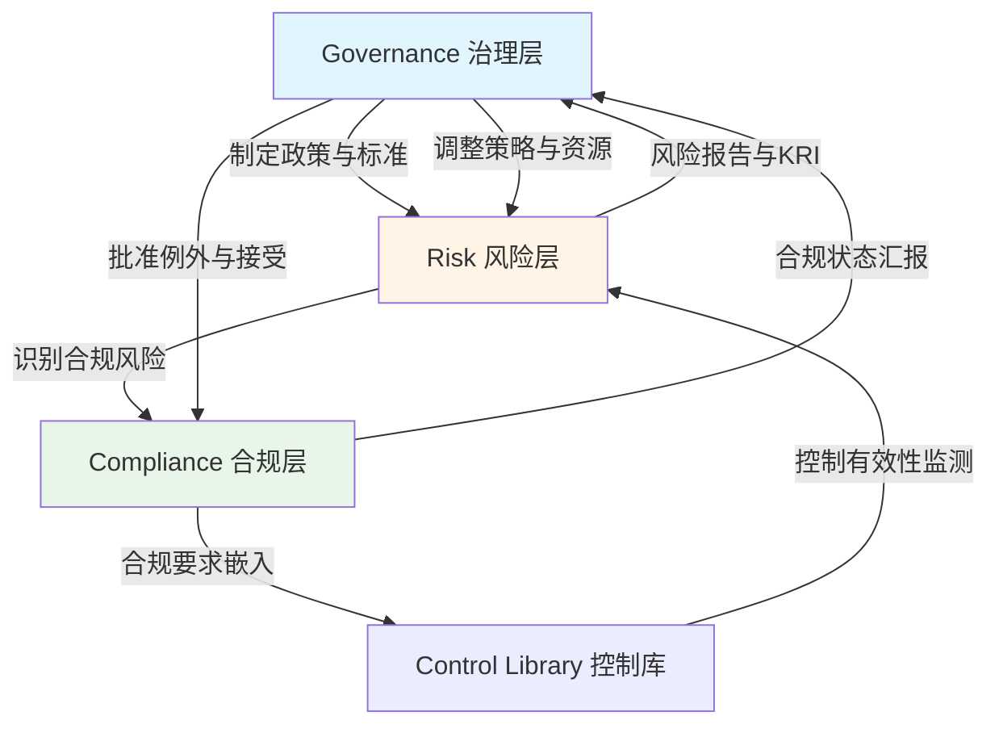

# 2.1 GRC治理框架

> **GRC Governance Framework: Building the Foundation for Trusted Growth**

---

## 本节概览

**学习目标**：

- 理解GRC三支柱（治理、风险、合规）的核心逻辑与相互关系
- 掌握企业GRC成熟度模型（4级递进路径）
- 学会将GRC与业务战略对齐的方法论
- 设计符合企业规模与全球化需求的GRC组织架构

**核心价值**：GRC不是成本中心，而是业务护航器。本节建立统一的治理框架，将碎片化的风险、合规、安全、内控活动整合为一体化体系，支撑业务全球化扩张与监管合规。

**预计阅读时间**：45-60分钟

---

## 2.1.1 GRC三支柱：治理的核心逻辑

### GRC的本质

**GRC (Governance, Risk & Compliance)** 不是三个独立的职能，而是相互支撑的三支柱：

```
┌─────────────────────────────────────────┐
│         Governance (治理)                │
│    "What should we do?"（方向）         │
│   ┌────────────────────────────────┐    │
│   │  战略、政策、监督、问责        │    │
│   └────────────────────────────────┘    │
└──────────┬──────────────┬───────────────┘
           │              │
    ┌──────▼────┐   ┌─────▼──────┐
    │   Risk    │   │ Compliance │
    │  (风险)   │   │  (合规)    │
    │  "What    │   │  "What     │
    │  could go │   │  must we   │
    │  wrong?"  │   │  do?"      │
    └───────────┘   └────────────┘
```

### 三支柱的核心定位

#### 1. Governance（治理）：明确方向与决策机制

**核心问题**：Who decides? What is our direction?

**关键活动**：

- **战略对齐**：确保安全、风险、合规活动与业务目标一致
- **政策制定**：建立企业级政策体系（从愿景到操作指南）
- **组织设计**：明确角色、职责、汇报线（RACI矩阵）
- **监督机制**：董事会/高管监督、治理例会、KPI/KRI跟踪

**主要产出**：

- GRC章程（Charter）
- 风险偏好声明（Risk Appetite Statement）
- 政策框架与标准体系
- 治理架构图与RACI矩阵
- 董事会/高管报告

#### 2. Risk（风险）：量化不确定性，优化资源配置

**核心问题**：What could go wrong? How likely? What's the impact?

**关键活动**：

- **风险识别**：全域风险扫描（战略、运营、技术、合规、第三方、新兴风险）
- **风险评估**：定性（RCSA）+ 定量（FAIR/ALE）量化风险
- **风险处置**：缓解（Mitigate）、接受（Accept）、转移（Transfer）、规避（Avoid）
- **风险监控**：KRI指标监测、风险热力图、趋势分析

**主要产出**：

- 风险登记册（Risk Register）
- 风险处置计划（Risk Treatment Plan）
- 风险热力图（Risk Heatmap）
- 关键风险指标（KRI）看板
- 风险报告（Executive Risk Report）

#### 3. Compliance（合规）：满足法规，支撑市场准入

**核心问题**：What must we do? Are we doing it right?

**关键活动**：

- **法规监测**：跟踪全球法规变化（GDPR/PIPL/SOC 2/PCI DSS等）
- **差距分析**：对照控制框架，识别合规差距
- **合规项目**：制定整改计划、分配责任、跟踪进度
- **审计准备**：收集证据、准备审计、获取认证

**主要产出**：

- 法规地图（Regulation Mapping）
- 合规差距报告（Gap Assessment）
- 合规项目计划
- 审计证据包
- 认证证书（ISO 27001/SOC 2等）

### 三支柱的协同逻辑

**GRC不是线性流程，而是闭环循环**：



**实践案例：数据跨境治理**

| 层级                 | 活动示例                                                                                                            |
| -------------------- | ------------------------------------------------------------------------------------------------------------------- |
| **Governance** | 董事会批准《跨境数据传输政策》，明确数据出境必须满足法规要求并经过风险评估                                          |
| **Risk**       | 风险团队评估跨境数据传输场景，量化数据泄露风险（使用FAIR模型），识别高风险国家/地区                                 |
| **Compliance** | 合规团队对照GDPR/PIPL要求，执行TIA（Transfer Impact Assessment）、签署SCC（Standard Contractual Clauses）、提交备案 |

---

## 2.1.2 GRC成熟度模型：四级递进路径

### 成熟度模型总览

**目标**：帮助企业评估当前GRC能力水平，制定提升路线图。

| 级别              | 名称                   | 特征                             | 典型企业规模            | 关键挑战                           |
| ----------------- | ---------------------- | -------------------------------- | ----------------------- | ---------------------------------- |
| **Level 1** | 初始级（Ad-hoc）       | 无正式流程，被动响应监管与事件   | 创业公司（<100人）      | 缺乏文档化流程，依赖个人经验       |
| **Level 2** | 可重复级（Repeatable） | 部分流程文档化，关键流程可重复   | 成长期公司（100-500人） | 流程碎片化，工具分散，跨部门协作弱 |
| **Level 3** | 已定义级（Defined）    | 完整流程体系，工具支持，全员参与 | 成熟公司（500-2000人）  | 数据孤岛，量化能力不足             |
| **Level 4** | 量化管理级（Managed）  | 数据驱动决策，持续优化，预测能力 | 大型企业（2000+人）     | 如何保持敏捷性，避免过度流程化     |

### Level 1: 初始级（Ad-hoc）

**核心特征**：

- 无正式GRC流程文档
- 被动响应审计/监管/客户要求
- 风险评估依赖个人经验
- 合规证据散落在邮件/文档中

**典型场景**：

> 某创业公司（80人）收到客户的SOC 2审计要求，团队慌乱地翻找过去一年的日志、配置文件、培训记录，花费3周时间拼凑审计材料，最终因缺少关键证据导致审计延期。

**提升路径**：

1. 启动基础合规项目（如ISO 27001/SOC 2）
2. 建立简单风险登记册（Excel）
3. 制定核心政策（安全政策、隐私政策、事件响应计划）
4. 指定专人负责GRC协调（CISO/合规负责人）

**目标成果**：90天内完成从"被动响应"到"主动管理"的转变。

### Level 2: 可重复级（Repeatable）

**核心特征**：

- 关键流程文档化（风险评估、合规审查、事件响应）
- 部分工具支持（SIEM、漏洞管理、文档管理系统）
- 流程执行依赖人工推动
- 跨部门协作仍需改进

**典型场景**：

> 某电商公司（300人）已通过ISO 27001认证，每年执行一次风险评估，使用Excel管理风险登记册。但业务线新项目启动时，安全评审常被绕过，导致生产环境频繁出现高危漏洞。

**提升路径**：

1. 建立SDL流程，嵌入安全评审
2. 引入GRC工具（如ServiceNow IRM/Jira集成）
3. 设立BISO角色，对接核心业务线
4. 建立季度GRC例会（风险委员会、合规评审）

**目标成果**：

- 安全评审覆盖率：30% → 80%
- 风险评估周期：年度 → 季度
- 合规证据自动化率：10% → 40%

### Level 3: 已定义级（Defined）

**核心特征**：

- 完整GRC流程体系（策略、标准、指南、模板）
- GRC平台支持（统一风险、合规、政策管理）
- 全员参与（业务/技术/运营全覆盖）
- 跨区域治理（中国/北美/欧盟协同）

**典型场景**：

> 某金融科技公司（1200人）建立了完整的GRC体系：使用ServiceNow IRM管理风险与合规项目，每月召开GRC委员会会议，季度向董事会汇报。但在向CFO汇报ROI时，仍难以量化风险降低的财务价值。

**提升路径**：

1. 引入风险量化方法（FAIR/ALE）
2. 建立KRI/KPI指标体系，与业务目标对齐
3. 实施连续控制监测（Continuous Controls Monitoring）
4. 建立风险预测模型（基于历史数据）

**目标成果**：

- 风险量化覆盖率：20% → 70%
- 控制自动化率：40% → 75%
- 董事会满意度：7/10 → 9/10

### Level 4: 量化管理级（Managed）

**核心特征**：

- 数据驱动决策（所有重大风险量化）
- 预测能力（基于ML/AI的风险预测）
- 持续优化（每季度复盘与改进）
- 行业标杆（输出最佳实践）

**典型场景**：

> 某跨国互联网公司（5000+人）的GRC团队每月向CFO提交量化风险报告：使用FAIR模型计算潜在年度损失（ALE），与保险成本、控制投资对比，为董事会提供最优资源配置方案。团队使用AI分析海量审计日志，自动识别异常访问模式，将事件响应时间从4小时降至15分钟。

**能力矩阵**：

| 维度                 | Level 1      | Level 2            | Level 3         | Level 4           |
| -------------------- | ------------ | ------------------ | --------------- | ----------------- |
| **流程成熟度** | 无流程文档   | 关键流程文档化     | 完整流程体系    | 持续优化与预测    |
| **工具支持**   | 无/Excel     | SIEM/漏扫/文档系统 | GRC平台（统一） | GRC+AI/ML自动化   |
| **组织协同**   | 个人英雄主义 | 安全团队主导       | 跨职能协作      | 业务深度融合      |
| **风险量化**   | 定性描述     | 简单评分（L/M/H）  | 部分量化（ALE） | 全面量化（FAIR）  |
| **决策支持**   | 经验判断     | 趋势分析           | KPI/KRI看板     | 预测模型+情景分析 |
| **业务价值**   | 被动合规     | 避免罚款           | 支撑业务增长    | 竞争优势+品牌溢价 |

### 成熟度自评清单

**使用方法**：为每项能力打分（0-4分），计算总分，确定当前成熟度级别。

| 能力项                | Level 1 (0分) | Level 2 (1分)   | Level 3 (2分)  | Level 4 (3-4分) |
| --------------------- | ------------- | --------------- | -------------- | --------------- |
| **1. 政策体系** | 无正式政策    | 核心政策存在    | 四级政策框架   | 自动化政策管理  |
| **2. 风险评估** | 无定期评估    | 年度评估        | 季度评估+量化  | 实时监测+预测   |
| **3. 合规管理** | 被动响应      | 项目制管理      | 持续合规监测   | 自动化合规检查  |
| **4. 工具平台** | Excel/邮件    | 分散工具        | 统一GRC平台    | AI驱动平台      |
| **5. 组织设计** | 无专职角色    | CISO/合规负责人 | GRC团队+BISO   | 全球协同+CoE    |
| **6. 监督机制** | 无正式监督    | 年度董事会汇报  | 季度风险委员会 | 月度KRI监测     |
| **7. 培训文化** | 无培训        | 年度培训        | 角色化培训     | 游戏化+模拟演练 |
| **8. 证据管理** | 分散存储      | 文件夹管理      | 证据平台       | 区块链存证      |

**评分标准**：

- **0-8分**：Level 1（初始级）
- **9-16分**：Level 2（可重复级）
- **17-24分**：Level 3（已定义级）
- **25-32分**：Level 4（量化管理级）

---

## 2.1.3 GRC与业务战略对齐

### 为什么GRC必须与业务战略对齐？

**错误案例**：某制造企业花费$500K建设GRC平台，但业务部门认为"这是合规团队的事"，导致：

- 风险评估数据空洞（业务不参与）
- 合规项目延期（资源冲突）
- 董事会质疑GRC投资回报

**正确路径**：GRC是业务护航器，必须与业务战略深度绑定。

### 战略对齐框架（SABSA方法）

**SABSA（Sherwood Applied Business Security Architecture）** 提供从业务到技术的六层架构：

```
┌──────────────────────────────────────┐
│ Contextual 背景层：业务战略与目标    │  ← 董事会/CEO层
├──────────────────────────────────────┤
│ Conceptual 概念层：GRC愿景与原则     │  ← CISO/CRO层
├──────────────────────────────────────┤
│ Logical 逻辑层：流程、架构、控制     │  ← GRC团队层
├──────────────────────────────────────┤
│ Physical 物理层：工具、技术、平台    │  ← 技术团队层
├──────────────────────────────────────┤
│ Component 组件层：具体实施与配置    │  ← 运营团队层
├──────────────────────────────────────┤
│ Operational 运营层：监测、响应、优化│  ← SOC/运营团队层
└──────────────────────────────────────┘
```

### 对齐三步法

#### 第一步：理解业务战略（Contextual Layer）

**关键问题**：

1. 企业未来3-5年的业务目标是什么？（收入、市场、产品）
2. 哪些业务是核心增长引擎？（优先级排序）
3. 业务面临哪些关键挑战？（监管、竞争、技术变革）
4. 利益相关方的期望是什么？（董事会、客户、监管方）

**输出**：业务目标清单

**示例：某跨境电商企业**

| 业务目标                 | 时间线 | GRC支撑需求                               |
| ------------------------ | ------ | ----------------------------------------- |
| 进入欧洲市场，年收入$50M | 18个月 | GDPR合规、ISO 27001认证、跨境数据传输方案 |
| 上市（IPO）              | 24个月 | SOX合规、内控体系、审计准备               |
| 推出AI推荐引擎           | 12个月 | AI治理框架、算法透明度、GDPR Art.22合规   |
| 降低运营成本15%          | 持续   | 自动化合规检查、风险量化驱动资源优化      |

#### 第二步：定义GRC愿景与原则（Conceptual Layer）

**GRC愿景声明模板**：

> "通过建立统一的GRC治理体系，我们致力于：
>
> 1. **支撑业务增长**：为业务全球化扩张提供合规护航，缩短市场准入周期50%
> 2. **量化风险价值**：使用FAIR模型量化风险，为董事会提供数据驱动的投资决策
> 3. **自动化合规**：通过GRC平台与AI技术，将合规检查效率提升70%
> 4. **构建信任品牌**：通过ISO 27001/SOC 2等认证，提升客户信任与品牌溢价"

**GRC核心原则**：

| 原则                    | 说明                                              | 实践示例                                                        |
| ----------------------- | ------------------------------------------------- | --------------------------------------------------------------- |
| **1. 业务优先**   | GRC活动必须服务业务目标，不能成为业务阻碍         | 新业务立项时，GRC团队在72小时内完成快速风险评估，不阻塞业务决策 |
| **2. 风险可视化** | 所有重大风险必须量化，向业务语言转化              | 使用ALE模型，将"数据泄露风险"转化为"年度预期损失$2.4M"          |
| **3. 合规嵌入**   | 合规要求嵌入SDL、采购、HR等业务流程，而非事后检查 | 在代码合并前自动扫描个人信息处理逻辑，触发GDPR合规检查          |
| **4. 全球本地化** | 全球统一框架+本地化适配（中国/欧美法规差异）      | 统一隐私政策框架，但中国版增加"个人信息出境备案"条款            |
| **5. 持续改进**   | 每季度复盘GRC流程，持续优化                       | 季度GRC回顾会：识别流程瓶颈，调整政策，更新工具                 |

#### 第三步：建立对齐机制（Logical Layer）

**1. OKR对齐机制**

将GRC目标与业务OKR绑定：

**示例：2025年Q1 OKR对齐**

| 业务OKR                                        | GRC对齐OKR                                     | 关键结果（KR）                                                                                                                             |
| ---------------------------------------------- | ---------------------------------------------- | ------------------------------------------------------------------------------------------------------------------------------------------ |
| **业务目标**：进入德国市场，新增ARR $10M | **GRC目标**：完成GDPR合规与ISO 27001认证 | KR1: 完成GDPR差距分析（Q1 Week 4）<br />KR2: 通过ISO 27001 Stage 1审计（Q1 Week 8）<br />KR3: 建立德国数据处理协议（DPA）模板（Q1 Week 6） |
| **业务目标**：降低客服成本20%            | **GRC目标**：自动化合规检查，释放人力    | KR1: 部署AI驱动的合规扫描工具（Q1 Week 4）<br />KR2: 合规检查工时减少50%（Q1 Week 12）<br />KR3: 自动化证据采集覆盖率达80%（Q1 Week 10）   |

**2. 业务架构价值链映射**

在业务价值链的每个环节嵌入GRC控制点（详见1.2节价值链映射工作坊）：

```
[产品设计] → [研发] → [测试] → [上线] → [运营] → [客服] → [数据分析]
    ↓           ↓        ↓        ↓        ↓        ↓          ↓
 隐私设计   SDL/SAST  DAST   生产审批  监控告警  数据保护  合规审计
```

**3. 定期对齐会议**

| 会议                     | 频率 | 参与方                     | 目标                                   |
| ------------------------ | ---- | -------------------------- | -------------------------------------- |
| **GRC战略对齐会**  | 年度 | CEO/CFO/CISO/CRO/业务VP    | 确定年度GRC投资优先级，对齐业务战略    |
| **GRC委员会**      | 月度 | CISO/CRO/DPO/法务/业务代表 | 评审风险、合规项目进度，解决跨部门问题 |
| **业务线GRC例会**  | 双周 | BISO/业务负责人/产品经理   | 对齐业务需求与合规要求，推动整改       |
| **董事会风险汇报** | 季度 | 董事会/风险委员会/CISO/CRO | 汇报风险态势、重大事件、KRI趋势        |

---

## 2.1.4 GRC组织架构设计

### 组织设计原则

**1. 三线防御模型（Three Lines of Defense）**

GRC组织设计应遵循"三线防御"原则（源自COSO/IIA框架）：

```
┌──────────────────────────────────────────────────────────┐
│            董事会 / 风险委员会 / 审计委员会                │
│              (Board / Risk Committee / Audit Committee)   │
└────────────────────┬─────────────────────────────────────┘
                     │ 监督与问责
         ┌───────────┼───────────┐
         │           │           │
    ┌────▼────┐ ┌────▼────┐ ┌───▼─────┐
    │ 第一线  │ │ 第二线  │ │ 第三线  │
    │ 防御    │ │ 防御    │ │ 防御    │
    └─────────┘ └─────────┘ └─────────┘
    业务部门     GRC职能      内部审计
    (Own Risk)  (Oversee)   (Assurance)
```

| 防线             | 角色                              | 职责                                               | 示例部门                            |
| ---------------- | --------------------------------- | -------------------------------------------------- | ----------------------------------- |
| **第一线** | 风险所有者（Risk Owner）          | 识别、评估、管理自己业务的风险；执行控制措施       | 产品团队、研发、运营、客服、HR      |
| **第二线** | 风险监督者（Risk Oversight）      | 制定政策、标准、框架；监督第一线执行；提供专业指导 | CISO团队、GRC团队、合规、隐私、法务 |
| **第三线** | 独立保证（Independent Assurance） | 独立审计第一线与第二线的有效性；向董事会汇报       | 内部审计（IA）、外部审计            |

**2. 中央-区域-业务矩阵（Hub-Spoke-BU Model）**

适用于多区域、多业务线的企业：

```
                  ┌─────────────────────┐
                  │   GRC CoE (中央)    │
                  │ (Center of Excellence) │
                  │  - 策略与框架        │
                  │  - 工具与平台        │
                  │  - 培训与支持        │
                  └──────┬──────────────┘
                         │
         ┌───────────────┼───────────────┐
         │               │               │
    ┌────▼────┐     ┌────▼────┐     ┌───▼─────┐
    │ 中国GRC │     │ 欧盟GRC │     │ 美国GRC │
    │ 工作组  │     │ 工作组  │     │ 工作组  │
    │ (Spoke) │     │ (Spoke) │     │ (Spoke) │
    └────┬────┘     └────┬────┘     └───┬─────┘
         │               │               │
    ┌────▼────┐     ┌────▼────┐     ┌───▼─────┐
    │ 业务线A │     │ 业务线B │     │ 业务线C │
    │ BISO    │     │ BISO    │     │ BISO    │
    └─────────┘     └─────────┘     └─────────┘
```

### 典型组织架构方案

#### 方案A：小型企业（<500人）

**适用场景**：创业公司/成长期公司，业务集中在单一区域。

**组织设计**：

```
        CEO
         │
    ┌────┴────┐
    │  CISO   │ (兼任GRC负责人)
    └────┬────┘
         │
    ┌────┼────────┐
    │    │        │
安全工程 合规经理 BISO
(3-5人) (1-2人) (1-2人)
```

**角色说明**：

- **CISO**：兼任GRC职能，向CEO/CFO汇报
- **合规经理**：负责法规监测、合规项目、审计准备
- **BISO**：嵌入核心业务线，桥接业务与安全
- **安全工程**：负责技术控制实施

**成本估算**：$500K-$1M/年（人力+工具）

#### 方案B：中型企业（500-2000人）

**适用场景**：多业务线、跨区域运营（中国+北美/欧洲）。

**组织设计**：

```
                董事会
                  │
            风险委员会
                  │
            ┌─────┴─────┐
           CEO         CFO
            │            │
      ┌─────┴─────┐      │
     CISO        CRO     │
      │            │     │
  ┌───┼────┐   ┌───┼────┤
  │   │    │   │   │    │
安全  合规 隐私 风险 内控 内审
团队  团队 团队 团队 团队 (IA)
(8人) (3人) (2人) (3人) (2人) (2人)
  │
BISO×3
(对接核心业务线)
```

**角色说明**：

- **CISO**：向CEO汇报，负责信息安全与技术风险
- **CRO**：向CFO汇报，负责企业风险管理（包括财务/运营/战略风险）
- **GRC委员会**：CISO+CRO+DPO+法务+财务，月度例会
- **BISO**：1名BISO对接1-3条业务线

**成本估算**：$2M-$4M/年

#### 方案C：大型企业（2000+人）

**适用场景**：跨国企业，多区域（中国/北美/欧洲），多业务线，已上市或准备上市。

**组织设计**：

```
                    董事会
                      │
              ┌───────┴───────┐
          风险委员会      审计委员会
              │               │
        ┌─────┴─────┐         │
       CEO         CFO        │
        │            │         │
   ┌────┴────┐   ┌───┴────┐   │
  CISO      CPO  CRO      │   │
(向CEO汇报) (DPO) (向CFO汇报)│  │
   │        │    │         │   │
   │        │    │         │   │
┌──┴──┐  ┌──┴──┐┌┴──┐  ┌───┴──┐│
│GRC CoE│ │隐私 ││风险│  │内控  ││内审
│(中央) │ │团队 ││团队│  │团队  ││(IA)
│5-8人  │ │3-5人││5-8人│ │3-5人││5-8人
└──┬───┘ └─────┘└───┘  └──────┘└───┘
   │
   ├─────────────┬──────────────┬───────────┐
   │             │              │           │
中国GRC工作组  欧盟GRC工作组  美国GRC工作组  亚太GRC工作组
(3-5人)       (3-5人)       (3-5人)       (2-3人)
   │
   │
BISO网络
(8-12人，对接核心业务线)
```

**关键角色职责**：

| 角色                     | 汇报线                               | 核心职责                              | 人员规模               |
| ------------------------ | ------------------------------------ | ------------------------------------- | ---------------------- |
| **CISO**           | CEO/董事会                           | 信息安全战略、GRC治理、预算与投资决策 | 30-50人团队            |
| **CRO**            | CFO/董事会                           | 企业风险管理、风险偏好、风险报告      | 15-25人团队            |
| **CPO/DPO**        | CEO/法务/董事会                      | 隐私合规、GDPR/PIPL落地、监管沟通     | 5-10人团队             |
| **GRC CoE**        | CISO                                 | 制定GRC框架、管理GRC平台、培训与支持  | 5-8人                  |
| **区域GRC工作组**  | GRC CoE + 区域业务负责人（矩阵汇报） | 本地法规监测、合规项目、监管沟通      | 每个区域3-5人          |
| **BISO**           | 业务VP（实线）+ CISO（虚线）         | 业务安全需求翻译、风险评估、SDL推动   | 1名BISO对接1-3条业务线 |
| **内部审计（IA）** | 董事会审计委员会                     | 独立审计GRC有效性、SOX 404测试        | 5-8人                  |

**成本估算**：$8M-$15M/年

### RACI矩阵：明确职责边界

**RACI说明**：

- **R（Responsible）**：执行者，具体完成任务
- **A（Accountable）**：问责者，最终负责人（只能有1个A）
- **C（Consulted）**：顾问，需要咨询意见
- **I（Informed）**：知情者，需要被通知结果

**示例：GRC关键活动的RACI矩阵**

| 活动                       | CISO | CRO | DPO | 业务VP | BISO | 法务 | 内审(IA) |
| -------------------------- | ---- | --- | --- | ------ | ---- | ---- | -------- |
| **制定GRC战略**      | A    | C   | C   | C      | I    | C    | I        |
| **批准风险偏好**     | C    | A   | I   | C      | I    | C    | I        |
| **年度风险评估**     | C    | A   | C   | C      | R    | C    | I        |
| **业务线风险评估**   | C    | C   | C   | A      | R    | I    | I        |
| **制定安全政策**     | A    | C   | I   | C      | R    | C    | I        |
| **制定隐私政策**     | C    | I   | A   | C      | R    | C    | I        |
| **合规差距分析**     | C    | C   | A   | I      | R    | C    | I        |
| **ISO 27001认证**    | A    | C   | C   | I      | R    | I    | C        |
| **SOX 404测试**      | C    | C   | I   | C      | R    | C    | A        |
| **董事会风险汇报**   | A    | A   | C   | I      | I    | I    | C        |
| **重大安全事件响应** | A    | C   | C   | C      | R    | C    | I        |
| **数据泄露通知**     | C    | C   | A   | I      | R    | A    | I        |

### 汇报线设计：实线 vs 虚线

**关键原则**：

- **CISO汇报线**：向CEO汇报（战略对齐）或CFO汇报（预算控制）
- **CRO汇报线**：向CFO汇报（风险与财务深度绑定）
- **DPO汇报线**：向法务/CEO汇报（GDPR要求DPO独立性）
- **BISO汇报线**：实线汇报业务VP（确保业务对齐），虚线汇报CISO（专业指导）

**案例：BISO的矩阵汇报**

```
业务VP（实线汇报）
    │
    │ 70%时间：业务安全需求、SDL推动、业务风险评估
    │
  BISO
    │
    │ 30%时间：专业培训、政策更新、GRC项目支持
    │
CISO（虚线汇报）
```

---

## 2.1.5 实战案例：某金融科技公司的GRC转型

### 背景

**公司概况**：

- 企业名称：某领先金融科技公司（以下简称"FinTech Corp"）
- 企业规模：1,200人（中国800人，北美200人，欧洲200人）
- 年收入：$250M
- 业务类型：在线支付、消费金融、理财服务
- 监管压力：准备在香港/美国双重上市（需满足SOX合规）

**痛点**：

1. GRC职能碎片化（安全团队、合规团队、风险团队各自为政）
2. 跨区域法规遵循困难（GDPR/PIPL/PCI DSS/SOX同时适用）
3. 董事会要求量化风险，但只能提供定性报告
4. 合规项目延期率高达60%（业务不配合）

### 转型路径

#### 阶段1：建立统一GRC治理框架（Month 1-3）

**关键活动**：

1. 成立GRC转型项目组（CISO+CRO+DPO+CFO+外部顾问）
2. 完成GRC成熟度评估（结果：Level 2.3）
3. 制定GRC章程（Charter），明确愿景、原则、组织架构
4. 建立GRC委员会（月度例会制度）

**产出物**：

- GRC章程（20页）
- 组织架构图与RACI矩阵
- 风险偏好声明
- 三年GRC路线图

#### 阶段2：整合流程与工具（Month 4-9）

**关键活动**：

1. 选型GRC平台（选择ServiceNow IRM）
2. 整合风险登记册（从Excel迁移到平台）
3. 建立统一控制库（整合ISO 27001/PCI DSS/SOX控制项）
4. 部署自动化合规扫描（CSPM/SAST/DAST集成）

**产出物**：

- ServiceNow IRM平台上线
- 统一风险登记册（150+风险项）
- 控制库（300+控制项）
- 自动化证据采集覆盖率：65%

#### 阶段3：引入风险量化（Month 10-15）

**关键活动**：

1. 培训GRC团队学习FAIR方法
2. 量化Top 20风险（覆盖70%潜在损失）
3. 向CFO/董事会汇报量化风险报告
4. 基于FAIR结果调整安全投资优先级

**产出物**：

- FAIR量化模型（Excel+Monte Carlo模拟）
- Top 20风险量化报告
- 投资优化建议（节省$1.2M无效投资）

#### 阶段4：跨区域合规落地（Month 16-24）

**关键活动**：

1. 成立中国/欧盟/美国GRC工作组
2. 完成GDPR/PIPL/SOX并行合规项目
3. 通过ISO 27001/SOC 2 Type II/PCI DSS认证
4. 建立BISO网络（8名BISO对接核心业务线）

**产出物**：

- ISO 27001证书
- SOC 2 Type II报告
- PCI DSS合规证明（QSA签字）
- GDPR/PIPL合规档案

### 成果

**定量成果**（18个月）：

| 指标                             | 转型前    | 转型后    | 改善    |
| -------------------------------- | --------- | --------- | ------- |
| **GRC成熟度**              | Level 2.3 | Level 3.7 | +61%    |
| **合规项目按期率**         | 40%       | 92%       | +130%   |
| **风险量化覆盖率**         | 5%        | 75%       | +1,400% |
| **董事会满意度**           | 6.2/10    | 9.1/10    | +47%    |
| **合规检查工时**           | 2,400h/年 | 720h/年   | -70%    |
| **审计准备周期**           | 8周       | 2周       | -75%    |
| **业务满意度（BISO模式）** | 62分      | 89分      | +44%    |

**定性成果**：

- 成功完成双重上市（香港+纳斯达克）
- 获得3家Fortune 500客户（因为SOC 2认证）
- 董事会将GRC从"成本中心"重新定位为"业务护航器"
- GRC团队从15人扩展到35人，预算从$1.5M增至$4.5M

### 关键成功因素

1. **高层支持**：CEO亲自担任GRC转型项目赞助人（Sponsor）
2. **组织整合**：打破CISO/CRO/DPO的职能墙，建立统一GRC委员会
3. **工具投资**：$1.2M投资GRC平台，实现流程自动化
4. **风险量化**：使用FAIR方法，将风险翻译为CFO/董事会能理解的财务语言
5. **BISO模式**：将安全/合规嵌入业务，而非事后检查

---

## 本节总结

### 核心要点回顾

 **GRC三支柱**：

- Governance（治理）：明确方向与决策机制
- Risk（风险）：量化不确定性，优化资源配置
- Compliance（合规）：满足法规，支撑市场准入

 **GRC成熟度模型**：

- Level 1（初始级）：被动响应，无流程
- Level 2（可重复级）：关键流程文档化
- Level 3（已定义级）：完整流程体系+工具平台
- Level 4（量化管理级）：数据驱动+预测能力

 **GRC与业务战略对齐**：

- 理解业务战略（Contextual Layer）
- 定义GRC愿景与原则（Conceptual Layer）
- 建立对齐机制（OKR、价值链映射、定期会议）

 **GRC组织架构**：

- 三线防御模型（业务部门/GRC职能/内部审计）
- 中央-区域-业务矩阵（GRC CoE / 区域工作组 / BISO）
- RACI矩阵明确职责边界

### 学习检查清单

完成本节学习后，请检查你是否能够：

- [ ] 用自己的话解释GRC三支柱的核心逻辑与协同机制
- [ ] 评估你所在企业的GRC成熟度级别（使用自评清单）
- [ ] 制定从当前级别提升到下一级别的90天行动计划
- [ ] 使用SABSA方法将GRC与业务战略对齐
- [ ] 设计符合你所在企业规模的GRC组织架构（含RACI矩阵）
- [ ] 向CEO/董事会用5分钟阐述GRC的业务价值

### 实践作业

**作业1：GRC成熟度自评**

- 使用2.1.2节的成熟度自评清单，为你所在企业打分
- 识别Top 3短板领域
- 制定90天改进计划

**作业2：设计GRC组织架构**

- 基于你所在企业规模（<500人 / 500-2000人 / 2000+人），设计GRC组织架构
- 绘制汇报线图（实线/虚线）
- 制定关键角色的RACI矩阵（至少10个GRC活动）

**作业3：GRC战略对齐工作坊**

- 组织一次2小时的GRC战略对齐工作坊
- 参与方：业务VP、CISO、CRO、DPO、产品负责人
- 输出：业务目标清单、GRC愿景声明、OKR对齐矩阵

### 延伸阅读

**GRC框架与标准**：

- **COSO ERM Framework**: Enterprise Risk Management - Integrating with Strategy and Performance
- **ISO 31000**: Risk Management Guidelines
- **NIST CSF 2.0**: Cybersecurity Framework
- **SABSA**: Sherwood Applied Business Security Architecture - https://sabsa.org

**行业报告**：

- Gartner: "How to Build a GRC Program" (2024)
- Forrester: "The State of GRC Maturity" (2024)
- OCEG: GRC Capability Model (Red Book)

**工具平台**：

- ServiceNow IRM: https://www.servicenow.com/products/integrated-risk-management.html
- RSA Archer: https://www.archerirm.com
- MetricStream: https://www.metricstream.com
- OneTrust: https://www.onetrust.com

---

**下一节预告**：

 [2.2 风险管理体系](./2.2_risk_management_system.md)

下一节我们将深入探讨：

- 风险管理生命周期（识别→评估→处置→监控）
- 风险量化方法（FAIR/ALE/Monte Carlo模拟）
- 第三方风险管理（TPRM）
- 新兴风险（AI、云、跨境数据）

## 📍 导航 | Navigation

**[← 返回章节目录](./README.md)** | **[返回 Part 1](../)** | **[返回总目录](../../)** | **[→ 下一节](./2.2_risk_management_system.md)**

---

**© 2025 AI-ESA Project. Licensed under CC BY-NC-SA 4.0**
