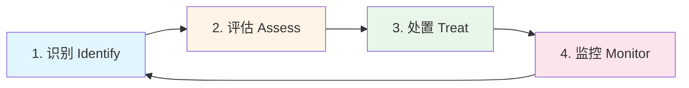
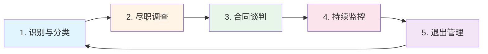

# 2.2 风险管理体系

> **Risk Management System: From Identification to Quantification**

---

## 本节概览

**学习目标**：

- 掌握风险管理生命周期（识别→评估→处置→监控）
- 学会使用FAIR/ALE模型量化风险
- 建立第三方风险管理（TPRM）流程
- 理解新兴风险（AI、云、跨境数据）的治理方法

**核心价值**：风险管理不是填表游戏，而是将不确定性转化为可决策数据的系统工程。本节提供从定性到定量、从主观判断到数据驱动的完整方法论。

**预计阅读时间**：50-70分钟

---

## 2.2.1 风险管理生命周期

### 风险管理四阶段模型

风险管理是一个持续循环的过程，包含四个核心阶段：



### 阶段1：风险识别（Identify）

#### 1.1 风险分类维度

建立统一的风险分类体系，确保全域覆盖：

| 风险类别                | 说明                            | 示例                                         |
| ----------------------- | ------------------------------- | -------------------------------------------- |
| **战略风险**      | 影响业务目标实现的外部/内部因素 | 市场竞争加剧、技术路线选择错误、监管政策变化 |
| **运营风险**      | 日常业务流程中的风险            | 系统宕机、供应链中断、关键人员流失           |
| **财务风险**      | 财务损失或报表风险              | 欺诈、资金链断裂、汇率波动                   |
| **合规/法律风险** | 违反法规或合同的风险            | GDPR罚款、诉讼、合同违约                     |
| **信息安全风险**  | 机密性/完整性/可用性受损        | 数据泄露、勒索软件、DDoS攻击                 |
| **数据隐私风险**  | 个人信息处理不当                | 未经授权的数据收集、跨境传输违规             |
| **第三方风险**    | 供应商/合作伙伴引入的风险       | 供应商数据泄露、服务中断、财务破产           |
| **新兴风险**      | 新技术/新业务模式带来的风险     | AI偏见、云配置错误、加密货币监管             |

#### 1.2 风险识别方法

**方法矩阵**：

| 方法                         | 适用场景             | 优点               | 缺点                    | 工具/模板                      |
| ---------------------------- | -------------------- | ------------------ | ----------------------- | ------------------------------ |
| **SWOT分析**           | 战略规划、新业务评估 | 结构化、易于沟通   | 定性为主                | SWOT矩阵                       |
| **头脑风暴**           | 快速识别、团队共识   | 激发创意、全员参与 | 可能遗漏系统性风险      | Miro/Mural白板                 |
| **问卷调查**           | 大范围风险扫描       | 覆盖面广、数据化   | 回答质量依赖问卷设计    | Google Forms/SurveyMonkey      |
| **历史事件分析**       | 复盘过往事件         | 基于真实数据       | 无法预测新风险          | 事件数据库                     |
| **威胁建模（STRIDE）** | 系统/应用安全        | 系统化、可重复     | 需要技术深度            | Microsoft Threat Modeling Tool |
| **What-If分析**        | 极端场景规划         | 挑战假设、发现盲区 | 耗时                    | 情景分析工作坊                 |
| **Bow-Tie分析**        | 关键风险深度分析     | 可视化因果关系     | 复杂风险需要多个Bow-Tie | Bow-Tie软件（CGE）             |

**实战案例：使用STRIDE识别支付系统风险**

**背景**：某电商平台准备上线新的支付系统。

**STRIDE威胁建模**：

| 威胁类型                                     | 风险场景                   | 影响                  | 可能性 |
| -------------------------------------------- | -------------------------- | --------------------- | ------ |
| **S**poofing（身份欺骗）               | 攻击者伪造用户身份发起支付 | 财务损失、用户投诉    | 中     |
| **T**ampering（数据篡改）              | 支付金额被中间人篡改       | 财务损失、监管处罚    | 低     |
| **R**epudiation（抵赖）                | 用户否认发起交易           | 法律纠纷、客服成本    | 中     |
| **I**nformation Disclosure（信息泄露） | 信用卡号/CVV泄露           | PCI DSS违规、品牌损害 | 高     |
| **D**enial of Service（拒绝服务）      | DDoS攻击导致支付不可用     | 收入损失、用户流失    | 中     |
| **E**levation of Privilege（权限提升） | 内部人员提权盗取支付数据   | 财务损失、监管处罚    | 低     |

**输出**：风险登记册（后续评估）

#### 1.3 风险触发机制

**何时需要启动风险识别？**

| 触发事件               | 说明                                  | 频率 |
| ---------------------- | ------------------------------------- | ---- |
| **年度规划**     | 每年制定业务战略时同步进行风险扫描    | 年度 |
| **重大业务变更** | 新产品上线、进入新市场、收购兼并      | 按需 |
| **监管要求**     | 监管检查、认证审计（ISO 27001/SOC 2） | 按需 |
| **重大事件**     | 数据泄露、系统宕机、安全事件          | 按需 |
| **内部审计发现** | 内审发现高风险问题                    | 按需 |
| **外部情报**     | 行业重大安全事件、新漏洞披露          | 持续 |

### 阶段2：风险评估（Assess）

#### 2.1 定性评估：风险矩阵法

**经典5×5风险矩阵**：

```
影响程度 (Impact)
  │
5 │  M   H   H   VH  VH
  │
4 │  M   M   H   H   VH
  │
3 │  L   M   M   H   H
  │
2 │  L   L   M   M   H
  │
1 │  VL  L   L   M   M
  │
  └─────────────────────→ 可能性 (Likelihood)
     1   2   3   4   5

图例：
VL = Very Low（极低风险，分数1-4）
L  = Low（低风险，分数5-9）
M  = Medium（中等风险，分数10-14）
H  = High（高风险，分数15-19）
VH = Very High（极高风险，分数20-25）
```

**评分标准示例**：

| 级别                                     | 可能性（Likelihood） | 影响程度（Impact）                |
| ---------------------------------------- | -------------------- | --------------------------------- |
| **5 - 几乎确定（Almost Certain）** | >80%概率/年          | >$10M或业务停摆>1周或重大监管处罚 |
| **4 - 很可能（Likely）**           | 50-80%概率/年        | $1M-$10M或业务停摆3-7天           |
| **3 - 可能（Possible）**           | 20-50%概率/年        | $100K-$1M或业务停摆1-3天          |
| **2 - 不太可能（Unlikely）**       | 5-20%概率/年         | $10K-$100K或业务停摆<1天          |
| **1 - 罕见（Rare）**               | <5%概率/年           | <$10K或无业务影响                 |

**固有风险 vs 残余风险**：

```
固有风险（Inherent Risk）= 未实施任何控制措施时的风险水平
                           │
                           ▼
                    实施控制措施（Controls）
                           │
                           ▼
残余风险（Residual Risk）= 实施控制措施后的剩余风险

决策逻辑：
- 如果残余风险 ≤ 风险偏好，则接受（Accept）
- 如果残余风险 > 风险偏好，则需进一步缓解（Mitigate）或升级
```

**实战案例：评估数据泄露风险**

| 风险                       | 固有风险评分      | 控制措施                                                                 | 残余风险评分      | 决策                 |
| -------------------------- | ----------------- | ------------------------------------------------------------------------ | ----------------- | -------------------- |
| 客户数据库被外部攻击者入侵 | L=4, I=5 → H(20) | 1. 多因素认证（MFA）<br />2. 数据库加密<br />3. WAF防护<br />4. SIEM监控 | L=2, I=5 → M(10) | 接受（在风险偏好内） |

#### 2.2 定量评估：FAIR模型

**FAIR（Factor Analysis of Information Risk）**是目前最成熟的风险量化框架。

**FAIR模型公式**：

```
风险（Risk）= 损失事件频率（LEF）× 损失幅度（LM）

损失事件频率（LEF）= 威胁事件频率（TEF）× 脆弱性（Vulnerability, 0-1）

损失幅度（LM）= 主要损失（Primary Loss）+ 次要损失（Secondary Loss）
```

**FAIR分解树**：

```
                      风险（Risk）
                          │
           ┌──────────────┴──────────────┐
    损失事件频率（LEF）              损失幅度（LM）
           │                              │
    ┌──────┴──────┐              ┌────────┴────────┐
威胁事件频率  脆弱性      主要损失              次要损失
  (TEF)     (Vuln)    (Primary Loss)     (Secondary Loss)
    │          │            │                    │
    │          │      ┌─────┴─────┐        ┌─────┴──────┐
    │          │   响应成本  替换成本    罚款  诉讼  品牌损害
```

**FAIR量化步骤**：

**第1步：估算威胁事件频率（TEF）**

| 参数                     | 说明           | 数据来源           | 示例值                    |
| ------------------------ | -------------- | ------------------ | ------------------------- |
| **威胁行为者能力** | 攻击者技术水平 | 威胁情报、历史事件 | 高级持续威胁（APT）：7/10 |
| **威胁行为者动机** | 攻击者攻击意图 | 行业报告、情报分析 | 金融数据高价值：8/10      |
| **外部接触频率**   | 系统暴露程度   | 流量日志、扫描日志 | 公网服务：100次/天        |

**TEF估算**（使用Monte Carlo模拟）：

- 最小值（Min）：10次/年
- 最可能值（Most Likely）：50次/年
- 最大值（Max）：200次/年

**第2步：估算脆弱性（Vulnerability）**

脆弱性 = 控制强度（Control Strength）的反面

| 控制措施          | 有效性评分 | 说明                      |
| ----------------- | ---------- | ------------------------- |
| 多因素认证（MFA） | 90%        | 阻止90%的凭证盗用攻击     |
| WAF               | 70%        | 阻止70%的Web攻击          |
| 数据库加密        | 95%        | 即使数据被盗也无法解密    |
| SIEM监控          | 80%        | 80%的攻击在15分钟内被检测 |

**综合脆弱性**：1 - (0.9 × 0.7 × 0.95 × 0.8) = 1 - 0.48 = 0.52（52%）

**LEF = TEF × Vulnerability = 50次/年 × 0.52 = 26次/年**

**第3步：估算损失幅度（LM）**

| 损失类型           | 最小值       | 最可能值 | 最大值             | 说明 |
| ------------------ | ------------ | -------- | ------------------ | ---- |
| **主要损失** |              |          |                    |      |
| 事件响应成本       | $50K | $150K | $500K    | 取证、修复、加班费 |      |
| 系统恢复成本       | $20K | $80K  | $200K    | 重建、测试、上线   |      |
| **次要损失** |              |          |                    |      |
| 监管罚款           | $0 | $500K   | $5M      | GDPR/PIPL罚款      |      |
| 诉讼赔偿           | $0 | $200K   | $2M      | 集体诉讼           |      |
| 品牌损害           | $100K | $1M  | $10M     | 客户流失、股价下跌 |      |

**使用Monte Carlo模拟10,000次**：

```
# 伪代码示例
import numpy as np

TEF_samples = np.random.triangular(10, 50, 200, 10000)
Vuln_samples = np.random.triangular(0.3, 0.52, 0.8, 10000)
LEF_samples = TEF_samples * Vuln_samples

Primary_Loss = np.random.triangular(70000, 230000, 700000, 10000)
Secondary_Loss = np.random.triangular(100000, 1700000, 17000000, 10000)
LM_samples = Primary_Loss + Secondary_Loss

Risk_samples = LEF_samples * LM_samples

# 结果统计
print(f"ALE 中位数: ${np.median(Risk_samples):,.0f}")
print(f"ALE 90%分位数: ${np.percentile(Risk_samples, 90):,.0f}")
print(f"ALE 99%分位数: ${np.percentile(Risk_samples, 99):,.0f}")
```

**输出示例**：

- **ALE中位数**：$2.4M/年
- **ALE 90%分位数**：$8.5M/年（有10%概率损失超过此值）
- **ALE 99%分位数**：$25M/年（有1%概率损失超过此值）

**第4步：投资决策**

```
当前ALE = $2.4M/年

方案A：增加DLP工具（$300K/年）
- 预期降低脆弱性：52% → 30%
- 新ALE = $1.4M/年
- ROI = ($2.4M - $1.4M - $0.3M) / $0.3M = 233%   值得投资

方案B：购买网络保险（$500K/年，保额$5M）
- ALE仍为$2.4M，但转移$5M尾部风险
- 适合风险转移策略   可考虑
```

#### 2.3 定量评估：ALE模型（简化版）

**ALE（Annual Loss Expectancy）**是更简单的量化方法：

```
ALE = SLE × ARO

SLE（Single Loss Expectancy）= 单次事件的预期损失
ARO（Annual Rate of Occurrence）= 年度发生率
```

**示例：勒索软件风险量化**

| 参数          | 值                                                                | 说明                                                 |
| ------------- | ----------------------------------------------------------------- | ---------------------------------------------------- |
| **SLE** | $1.2M | 赎金$200K + 恢复成本$300K + 业务损失$500K + 品牌损害$200K |                                                      |
| **ARO** | 0.3（30%/年）                                                     | 基于行业数据：金融科技企业30%概率/年遭受勒索软件攻击 |
| **ALE** | $1.2M × 0.3 =**$360K/年**                                  | 年度预期损失                                         |

**决策分析**：

```
控制措施投资：
- 端点检测响应（EDR）：$150K/年
- 离线备份：$50K/年
- 安全意识培训：$30K/年
总计：$230K/年

预期效果：
- ARO降低：0.3 → 0.05（降低83%）
- 新ALE = $1.2M × 0.05 = $60K/年

净收益（NPV，3年）：
= [($360K - $60K) - $230K] × 3
= $210K/年 × 3 = $630K   值得投资
```

### 阶段3：风险处置（Treat）

#### 3.1 风险处置四策略

| 策略                       | 说明                 | 适用场景                   | 示例                         |
| -------------------------- | -------------------- | -------------------------- | ---------------------------- |
| **缓解（Mitigate）** | 实施控制措施降低风险 | 成本可控、技术可行         | 部署WAF、MFA、加密           |
| **接受（Accept）**   | 接受残余风险         | 风险在偏好内、缓解成本过高 | 接受低影响的老旧系统风险     |
| **转移（Transfer）** | 将风险转移给第三方   | 可保险、可外包             | 购买网络保险、使用云服务商   |
| **规避（Avoid）**    | 停止引发风险的活动   | 风险不可接受且无法缓解     | 退出高风险市场、停用漏洞系统 |

#### 3.2 风险处置决策树

```
                  风险评估完成
                      │
        ┌─────────────┼─────────────┐
        │                           │
  残余风险 ≤ 风险偏好？          残余风险 > 风险偏好
        │                           │
       YES                         NO
        │                           │
    ┌───▼───┐                  进一步处置
    │接受风险│                       │
    └───────┘          ┌─────────────┼─────────────┐
                       │             │             │
                   可缓解？       可转移？       可规避？
                       │             │             │
                      YES           YES            YES
                       │             │             │
                   实施控制      购买保险/外包   停止活动
                       │             │             │
                   复评残余风险   复评残余风险   风险消除
```

#### 3.3 风险接受与升级机制

**风险接受标准**：

| 风险级别             | 残余风险评分 | 审批权限         | 复评周期           | 补偿控制要求   |
| -------------------- | ------------ | ---------------- | ------------------ | -------------- |
| **极高（VH）** | 20-25        | 董事会风险委员会 | 禁止接受，必须缓解 | -              |
| **高（H）**    | 15-19        | CRO + CISO       | 30天               | 必须有补偿控制 |
| **中（M）**    | 10-14        | CISO / 业务VP    | 90天               | 推荐有补偿控制 |
| **低（L）**    | 5-9          | 部门负责人       | 180天              | 可选           |
| **极低（VL）** | 1-4          | 无需审批         | 年度               | 无             |

**风险接受流程**：

```
业务部门提交风险接受申请
    │
    ├─ 填写《风险接受申请表》
    ├─ 说明业务理由
    ├─ 提出补偿控制措施（如适用）
    │
    ▼
风险团队评估
    │
    ├─ 验证风险评分
    ├─ 评估补偿控制有效性
    ├─ 提出建议
    │
    ▼
审批流程（根据风险级别）
    │
    ├─ 低/中风险：CISO审批
    ├─ 高风险：CRO + CISO审批
    ├─ 极高风险：拒绝接受
    │
    ▼
记录到风险登记册
    │
    ├─ 记录接受决策
    ├─ 设置复评提醒
    ├─ 监控补偿控制执行
    │
    ▼
定期复评（30/90/180天）
```

**案例：某业务系统风险接受决策**

**背景**：某电商平台的订单管理系统（OMS）使用10年前的。NET Framework 3.5，存在已知漏洞，但替换成本高达$2M，需要6个月开发。

**风险评估**：

- 固有风险：L=4, I=4 → H(16)
- 当前控制：网络隔离、最小权限、WAF
- 残余风险：L=2, I=4 → M(8)

**业务理由**：

- 系统计划在12个月后整体重构
- 当前业务依赖度高，无法停用
- 立即替换影响Q4大促

**决策**：

- 接受残余风险（M=8，在偏好内）
- 补偿控制：

1. 增加WAF规则（针对已知漏洞）
2. 实施24/7 SIEM监控
3. 限制数据库访问（白名单）
4. 每月渗透测试

- 审批人：CISO + 业务VP
- 复评周期：90天
- 最终期限：系统重构完成（12个月内）

### 阶段4：风险监控（Monitor）

#### 4.1 关键风险指标（KRI）

**KRI（Key Risk Indicator）**是领先指标，用于预警风险趋势。

**KRI vs KPI的区别**：

| 维度           | KRI（关键风险指标）              | KPI（关键绩效指标）      |
| -------------- | -------------------------------- | ------------------------ |
| **目的** | 预警风险恶化                     | 衡量目标达成             |
| **方向** | 领先指标（Leading）              | 滞后指标（Lagging）      |
| **示例** | 高危漏洞数量增加、员工流失率上升 | 事件响应时间、漏洞修复率 |

**KRI设计框架**：

| 风险类别           | KRI示例            | 阈值（黄色预警） | 阈值（红色告警） | 监测频率 |
| ------------------ | ------------------ | ---------------- | ---------------- | -------- |
| **数据泄露** | 高危漏洞未修复天数 | >30天            | >60天            | 周       |
| **可用性**   | 关键系统可用性     | <99.5%           | <99%             | 实时     |
| **合规**     | 未完成合规项数量   | >10个            | >20个            | 月       |
| **第三方**   | 高风险供应商占比   | >15%             | >25%             | 季度     |
| **内部威胁** | 异常数据下载次数   | >50次/周         | >100次/周        | 日       |
| **钓鱼攻击** | 钓鱼邮件点击率     | >5%              | >10%             | 演练后   |

#### 4.2 风险仪表盘

**董事会级风险仪表盘**：

```
┌─────────────────────────────────────────────────────┐
│           企业风险仪表盘 - 2025年Q1              │
├─────────────────────────────────────────────────────┤
│                                                     │
│  风险热力图（Top 10风险）        风险趋势          │
│  ┌───────────────────┐           ┌──────────────┐ │
│  │ ▓▓▓ 数据泄露      │           │   ↗风险上升  │ │
│  │ ▓▓▓ 云配置错误    │           │   →风险稳定  │ │
│  │ ▓▓  第三方风险    │           │   ↘风险下降  │ │
│  │ ▓   合规风险      │           └──────────────┘ │
│  └───────────────────┘                             │
│                                                     │
│  关键指标                        风险事件          │
│  • 高风险项：12个（↓ -3 vs Q4） • Q1新增：8个    │
│  • ALE总计：$18.5M（↓ -15%）    • 已关闭：15个   │
│  • 合规项完成：85%（↑ +5%）     • 进行中：12个   │
│                                                     │
│  预算执行                        行动计划          │
│  • 已用：$2.1M / $5M（42%）     • 待董事会批准：  │
│  • Q2预算：$1.3M                  1. DLP采购$500K │
│                                    2. EDR扩容$300K │
└─────────────────────────────────────────────────────┘
```

#### 4.3 风险监控自动化

**🤖 AI驱动的风险监控**：

| 场景                 | 传统方式       | AI增强方式                         | 效果              |
| -------------------- | -------------- | ---------------------------------- | ----------------- |
| **漏洞优先级** | CVSS评分       | AI分析资产重要性+威胁情报+利用概率 | 误报减少70%       |
| **异常检测**   | 基于规则的告警 | ML模型识别异常行为模式             | 检测准确率提升85% |
| **风险预测**   | 历史趋势分析   | 时间序列预测模型（ARIMA/LSTM）     | 提前3-6个月预警   |
| **控制测试**   | 季度手工抽样   | 自动化持续控制监测（CCM）          | 覆盖率100%        |

**示例：AI预测数据泄露风险**

```
# 使用机器学习预测下季度数据泄露风险

输入特征：
- 高危漏洞未修复数量（时间序列）
- 钓鱼演练失败率（时间序列）
- 员工流失率（时间序列）
- 外部威胁情报评分（时间序列）
- 历史事件数据

模型：
- Random Forest分类器（是否发生泄露）
- XGBoost回归模型（ALE预测）

输出：
- Q2数据泄露概率：68%（高风险）
- 预测ALE：$3.2M
- 关键因素：高危漏洞数量（权重45%）、钓鱼点击率（权重32%）

建议行动：
1. 加速漏洞修复（目标15天内清零）
2. 强化钓鱼培训（重点针对点击率>10%的部门）
3. 增加SIEM监控规则
```

---

## 2.2.2 风险偏好与容忍度（Risk Appetite）

### 什么是风险偏好？

**风险偏好（Risk Appetite）**：企业愿意接受的风险总量，用于指导风险决策。

**风险容忍度（Risk Tolerance）**：在风险偏好基础上，针对特定风险类别设定的可接受阈值。

### 风险偏好声明模板

**示例：某金融科技公司风险偏好声明**

```markdown
# 风险偏好声明
**版本**：v2.0
**批准人**：董事会风险委员会
**生效日期**：2025年1月1日

## 总体原则

我们承诺在追求业务增长的同时，将风险控制在董事会批准的范围内：

1. **零容忍原则**：
   - 重大监管违规（罚款>$1M）
   - 数据泄露导致客户PII大规模泄露（>100K用户）
   - 欺诈/腐败/洗钱

2. **低风险偏好**：
   - 关键系统可用性（<99.9%）
   - 高危漏洞未修复（>30天）
   - 第三方重大安全事件

3. **中等风险偏好**：
   - 新技术试点（AI/区块链）
   - 新兴市场拓展
   - 创新业务模式

4. **定量阈值**：
   - 年度风险总暴露（Total Risk Exposure）：≤ $50M
   - 单一风险事件损失：≤ $5M
   - 网络保险覆盖：≥ $20M
```

### 风险偏好矩阵

| 风险类别             | 风险偏好 | 定量阈值                                                              | 监控指标               | 升级触发               |
| -------------------- | -------- | --------------------------------------------------------------------- | ---------------------- | ---------------------- |
| **监管合规**   | 零容忍   | 重大违规=0                                                            | 监管函数量、罚款金额   | 任何罚款>$100K         |
| **数据泄露**   | 极低     | ALE ≤ $2M/年 | 高危漏洞数、数据访问异常 | ALE >$3M或实际泄露>10K用户 |                        |                        |
| **系统可用性** | 低       | 可用性≥99.9%                                                         | 关键系统SLA、MTTR      | 可用性<99.5%连续2周    |
| **第三方风险** | 中       | 高风险供应商<20%                                                      | 供应商安全评分、事件数 | 关键供应商发生重大泄露 |
| **创新风险**   | 中-高    | 试点失败容忍                                                          | 试点成功率、ROI        | 连续3个试点失败        |

### 风险偏好传导机制

```
董事会风险偏好声明
    │
    ├─ 企业级风险偏好：ALE总计 ≤ $50M/年
    │
    ▼
业务线风险配额分配
    │
    ├─ 支付业务：ALE ≤ $20M/年（40%）
    ├─ 消费金融：ALE ≤ $15M/年（30%）
    ├─ 理财服务：ALE ≤ $10M/年（20%）
    └─ 创新业务：ALE ≤ $5M/年（10%）
    │
    ▼
具体风险指标（KRI）
    │
    ├─ 支付业务：高危漏洞≤5个，PCI DSS合规100%
    ├─ 消费金融：欺诈率≤0.5%，AML误报率≤2%
    └─ ...
```

---

## 2.2.3 第三方风险管理（TPRM）

### 为什么第三方风险重要？

**统计数据**：

- 60%的数据泄露来自第三方（Ponemon Institute, 2024）
- 平均企业依赖583个第三方供应商（Gartner, 2024）
- 第三方安全事件平均损失$4.5M（IBM Security, 2024）

**典型案例**：

- **Target数据泄露（2013）**：HVAC供应商凭证被盗，导致4000万信用卡信息泄露，损失$18.5M
- **SolarWinds供应链攻击（2020）**：软件更新被植入后门，影响18,000+企业
- **MOVEit漏洞（2023）**：文件传输软件漏洞，导致全球2,000+企业数据泄露

### TPRM生命周期



### 阶段1：识别与分类

**第三方分类维度**：

| 维度                 | 分类标准                          | 风险等级                                     |
| -------------------- | --------------------------------- | -------------------------------------------- |
| **数据访问**   | 是否处理客户PII/PCI/PHI？         | 是=高风险，否=低风险                         |
| **业务关键性** | 中断后业务停摆时间？              | >24h=高风险，<24h=中/低风险                  |
| **财务规模**   | 年度合同金额？                    | >$1M=高风险，$100K-$1M=中风险，<$100K=低风险 |
| **监管相关性** | 是否涉及监管要求（PCI DSS/SOX）？ | 是=高风险，否=低风险                         |

**第三方风险分级**：

| 级别                     | 标准               | 尽调深度          | 审查频率 | 示例                                |
| ------------------------ | ------------------ | ----------------- | -------- | ----------------------------------- |
| **Tier 1（关键）** | 满足任意高风险条件 | 完整尽调+现场审计 | 年度     | 云服务商（AWS）、支付网关、核心SaaS |
| **Tier 2（重要）** | 中等风险           | 问卷+证书验证     | 2年      | 客服外包、营销工具、HR系统          |
| **Tier 3（一般）** | 低风险             | 简化问卷          | 3年      | 办公用品、活动服务、咨询            |

### 阶段2：尽职调查（Due Diligence）

**尽调清单（Tier 1供应商）**：

| 类别                 | 尽调项                             | 证据要求            | 评分权重 |
| -------------------- | ---------------------------------- | ------------------- | -------- |
| **认证与合规** | ISO 27001/SOC 2/PCI DSS/GDPR       | 证书复印件          | 25%      |
| **安全能力**   | 漏洞管理、事件响应、加密、访问控制 | 安全政策文档        | 30%      |
| **数据保护**   | 数据分类、加密、备份、DLP          | 数据处理协议（DPA） | 20%      |
| **业务连续性** | 灾难恢复计划（DRP）、RTO/RPO       | BCP文档+演练记录    | 15%      |
| **财务稳定性** | 财务报表、信用评级                 | 审计报告            | 10%      |

**标准化问卷（SIG Core）**：

使用行业标准问卷，如：

- **SIG（Standardized Information Gathering）**：由Shared Assessments提供，18个域、350+问题
- **CAIQ（Consensus Assessments Initiative Questionnaire）**：由CSA（Cloud Security Alliance）提供

**🤖 AI加速尽调**：

```
传统方式：
- 手工审阅200页问卷回答
- 人工对比证书有效期
- 逐项评分
⏱️ 耗时：40小时/供应商

AI增强方式：
- NLP自动解析问卷回答
- 自动验证证书真伪（API查询）
- AI评分+异常标记
⏱️ 耗时：2小时/供应商（95%自动化）
```

### 阶段3：合同谈判

**必备安全条款**：

| 条款                          | 说明                         | 示例条文                                                               |
| ----------------------------- | ---------------------------- | ---------------------------------------------------------------------- |
| **数据处理协议（DPA）** | 明确数据处理目的、范围、期限 | "供应商仅可为履行服务目的处理数据，不得用于其他目的"                   |
| **审计权利**            | 保留审计供应商安全控制的权利 | "客户有权每年进行一次现场审计或委托第三方审计，供应商需配合"           |
| **事件通知**            | 明确安全事件通知时限         | "供应商需在发现安全事件后24小时内书面通知客户"                         |
| **数据驻留**            | 明确数据存储地理位置         | "所有客户数据必须存储在欧盟境内数据中心"                               |
| **数据删除**            | 合同终止后数据销毁要求       | "合同终止后30天内删除所有客户数据并提供销毁证明"                       |
| **责任限制**            | 明确赔偿责任上限             | "因供应商原因导致的数据泄露,供应商需赔偿实际损失，上限为合同金额的3倍" |
| **保险要求**            | 要求供应商购买网络保险       | "供应商需购买不低于$5M的网络安全保险，并将客户列为受益人"              |
| **SCC/BCR**             | 跨境数据传输合规（GDPR要求） | "双方签署欧盟标准合同条款（SCC 2021版）"                               |

### 阶段4：持续监控

**监控维度**：

| 维度                 | 监控方法           | 工具                                | 频率                          |
| -------------------- | ------------------ | ----------------------------------- | ----------------------------- |
| **安全评分**   | 外部威胁情报平台   | BitSight, SecurityScorecard         | 周                            |
| **证书有效性** | 自动化证书检查     | 自研脚本/GRC平台                    | 月                            |
| **安全事件**   | 监控供应商公开披露 | Google Alert, Have I Been Pwned API | 实时                          |
| **财务健康**   | 信用评级监测       | Dun & Bradstreet, Moody's           | 季度                          |
| **合规状态**   | 问卷更新+证书复审  | GRC平台                             | 年度（Tier 1）/ 2年（Tier 2） |

**供应商风险仪表盘**：

```
┌─────────────────────────────────────────┐
│      第三方风险仪表盘 - 2025年Q1        │
├─────────────────────────────────────────┤
│                                         │
│  供应商总数：583                        │
│  ├─ Tier 1（关键）：28个（5%）         │
│  ├─ Tier 2（重要）：145个（25%）       │
│  └─ Tier 3（一般）：410个（70%）       │
│                                         │
│  风险分布                               │
│  ├─ 高风险：12个（2%）  需关注       │
│  ├─ 中风险：87个（15%）                 │
│  └─ 低风险：484个（83%）                │
│                                         │
│  待处理事项                             │
│  ├─ 证书即将到期：5个（30天内）        │
│  ├─ 安全评分下降：8个（<700分）        │
│  └─ 年度审查逾期：3个                   │
│                                         │
│  Top 5高风险供应商                      │
│  1. ABC Cloud（评分650, ↓ -50）       │
│  2. XYZ Payment（证书过期）            │
│  3. ...                                 │
└─────────────────────────────────────────┘
```

### 阶段5：退出管理

**供应商退出检查清单**：

- [ ] 数据返还/删除确认（获取删除证明）
- [ ] 访问权限撤销（IAM账号删除、VPN关闭）
- [ ] 合同终止确认（法务签字）
- [ ] 知识产权归还（代码、文档）
- [ ] 最终对账（财务结算）
- [ ] 经验教训总结（更新供应商黑名单/参考清单）

---

## 2.2.4 新兴风险治理

### 云风险（Cloud Risk）

**共享责任模型（Shared Responsibility Model）**：

```
┌──────────────────────────────────────┐
│          客户负责（Customer）        │  ← 应用安全、数据加密、IAM
├──────────────────────────────────────┤
│         云服务商负责（CSP）          │  ← 物理安全、虚拟化、网络
└──────────────────────────────────────┘

IaaS：客户责任最大（操作系统+以上全部由客户负责）
PaaS：共享责任（操作系统由CSP负责，应用由客户负责）
SaaS：客户责任最小（仅数据分类与访问控制由客户负责）
```

**云风险关键控制**：

| 风险               | 控制措施                                                    | 工具                               |
| ------------------ | ----------------------------------------------------------- | ---------------------------------- |
| **配置错误** | CSPM（Cloud Security Posture Management）持续扫描           | Wiz, Orca, Prisma Cloud            |
| **过度权限** | CIEM（Cloud Infrastructure Entitlement Management）最小权限 | Ermetic, CloudKnox (MS)            |
| **数据泄露** | 加密（传输+静态）、DLP、CASB                                | AWS KMS, Azure Key Vault, Netskope |
| **影子IT**   | CASB（Cloud Access Security Broker）发现未授权SaaS          | Zscaler, McAfee MVISION            |
| **可用性**   | 多区域部署、自动备份、灾难恢复演练                          | AWS Backup, Azure Site Recovery    |

### AI风险（AI Risk）

**AI风险分类**（参考EU AI Act）：

| 风险类别             | 说明                       | 示例                                | 控制措施                                               |
| -------------------- | -------------------------- | ----------------------------------- | ------------------------------------------------------ |
| **偏见与歧视** | 训练数据偏见导致不公平决策 | 招聘AI歧视女性、信贷AI歧视少数族裔  | 数据多样性审查、公平性测试、人工复核                   |
| **隐私泄露**   | 模型记忆训练数据           | GPT输出训练数据中的PII              | 数据脱敏、差分隐私、模型审计                           |
| **对抗攻击**   | 恶意输入欺骗模型           | 图像分类器被对抗样本欺骗            | 鲁棒性训练、输入验证、异常检测                         |
| **解释性不足** | 无法解释决策依据（黑盒）   | 信贷拒绝但无法解释原因              | 可解释AI（XAI）、LIME/SHAP、决策日志                   |
| **供应链风险** | 第三方模型/数据集被污染    | 开源模型包含后门                    | 模型溯源、SBoM（Software Bill of Materials）、沙箱测试 |
| **合规风险**   | 违反AI监管法规             | EU AI Act、中国《生成式AI管理办法》 | 合规评估、风险分级、透明度报告                         |

**AI治理框架**：

```
┌─────────────────────────────────────────┐
│         AI治理委员会                    │
│    (CISO/CRO/DPO/法务/AI负责人)         │
└────────────┬────────────────────────────┘
             │
      ┌──────┴──────┐
      │             │
  AI风险评估   AI伦理审查
      │             │
      ▼             ▼
  风险分级      伦理原则
  (0-4级)    (公平/透明/问责)
      │             │
      └──────┬──────┘
             ▼
      控制措施实施
      │
      ├─ 数据治理（Data Governance）
      ├─ 模型监控（Model Monitoring）
      ├─ 可解释性（Explainability）
      └─ 持续审计（Continuous Audit）
```

**🤖 AI风险量化示例**：

| 场景                 | 风险评估                                                                                                     | 量化结果 |
| -------------------- | ------------------------------------------------------------------------------------------------------------ | -------- |
| **招聘AI偏见** | - SLE: $500K（诉讼+品牌损害）- ARO: 0.15（15%/年） |**ALE = $75K/年**控制投资：公平性测试$50K/年  值得 |          |
| **信贷AI误判** | - SLE: $2M（罚款+客户流失）- ARO: 0.08（8%/年） |**ALE = $160K/年**控制投资：XAI工具$80K/年  值得      |          |

### 跨境数据风险（Cross-Border Data Risk）

**全球数据本地化要求对比**：

| 国家/地区        | 法规             | 数据本地化要求                  | 跨境传输机制              |
| ---------------- | ---------------- | ------------------------------- | ------------------------- |
| **中国**   | PIPL、数据安全法 | 关基运营者+重要数据必须境内存储 | 安全评估、标准合同、认证  |
| **俄罗斯** | Law 242-FZ       | 俄公民个人数据必须境内存储      | 仅认证机制                |
| **印度**   | DPDP Act         | 敏感数据必须境内存储            | 标准合同                  |
| **欧盟**   | GDPR             | 无强制本地化要求                | SCC、BCR、充分性认定、TIA |
| **美国**   | 无联邦法规       | 无强制本地化（部分行业除外）    | -                         |

**跨境数据传输风险控制**：

1. **数据地图（Data Mapping）**

   - 识别所有跨境数据流
   - 标注数据类型（PII/敏感/一般）
   - 记录源国家→目的国家
2. **传输影响评估（TIA - Transfer Impact Assessment）**

   - 评估目的国法律环境
   - 评估接收方安全能力
   - 评估补充措施需求
3. **法律机制选择**

   | 机制                 | 适用场景                             | 优点               | 缺点              |
   | -------------------- | ------------------------------------ | ------------------ | ----------------- |
   | **SCC**        | EU → 非充分性国家                   | 标准化、易执行     | 需TIA、接收方承诺 |
   | **BCR**        | 跨国集团内部传输                     | 一次批准、长期有效 | 申请复杂、耗时    |
   | **充分性认定** | EU → 充分性国家（UK/日本/加拿大等） | 无需额外机制       | 仅适用少数国家    |
   | **标准合同**   | 中国 → 境外                         | 官方认可           | 需备案            |
4. **技术控制**

   - 加密传输（TLS 1.3）
   - 数据最小化（仅传输必要字段）
   - 假名化/脱敏（de-identification）
   - 访问审计

---

## 本节总结

### 核心要点回顾

 **风险管理生命周期**：

- 识别（Identify）：SWOT、STRIDE、头脑风暴、问卷
- 评估（Assess）：定性（风险矩阵）+ 定量（FAIR/ALE）
- 处置（Treat）：缓解/接受/转移/规避
- 监控（Monitor）：KRI指标、风险仪表盘、AI预测

 **风险量化方法**：

- **FAIR模型**：风险 = LEF × LM（使用Monte Carlo模拟）
- **ALE模型**：ALE = SLE × ARO（简化但实用）

 **第三方风险管理（TPRM）**：

- 分类（Tier 1/2/3）→ 尽调（问卷+证书）→ 合同（DPA+审计权）→ 监控（安全评分）→ 退出（数据删除）

 **新兴风险**：

- 云风险：CSPM/CIEM、共享责任模型
- AI风险：偏见/隐私/对抗攻击、AI治理框架
- 跨境数据：SCC/BCR、TIA、数据地图

### 学习检查清单

完成本节学习后，请检查你是否能够：

- [ ] 绘制风险管理生命周期的四阶段图
- [ ] 使用5×5风险矩阵评估一个真实风险
- [ ] 使用FAIR或ALE模型量化一个风险（至少一个场景）
- [ ] 设计Top 3风险的KRI指标
- [ ] 制定一个第三方供应商的尽调清单
- [ ] 评估一个AI应用的风险（使用EU AI Act分类）
- [ ] 设计一个跨境数据传输的合规方案（中国→欧盟）

### 实践作业

**作业1：风险量化实战**

- 选择你所在企业的一个高风险场景
- 使用ALE模型量化（SLE × ARO）
- 提出3个控制措施方案
- 计算每个方案的ROI
- 向CFO/CISO汇报（5分钟PPT）

**作业2：第三方风险评估**

- 选择1个关键供应商（Tier 1）
- 设计尽调问卷（50题）
- 列出必备合同条款（至少8条）
- 设计监控仪表盘（5个KRI）

**作业3：AI风险治理框架**

- 识别你所在企业的3个AI应用
- 使用EU AI Act进行风险分级
- 为高风险AI设计控制措施
- 制定AI伦理原则（5条）

### 延伸阅读

**风险量化方法**：

- **FAIR Institute**: https://www.fairinstitute.org
- **ISO 31000**: Risk Management Guidelines
- **NIST SP 800-30**: Guide for Conducting Risk Assessments
- 《Measuring and Managing Information Risk: A FAIR Approach》- Jack A. Jones

**第三方风险管理**：

- **Shared Assessments SIG**: https://sharedassessments.org
- **CSA CAIQ**: https://cloudsecurityalliance.org/artifacts/caiq
- **BitSight**: https://www.bitsight.com
- **SecurityScorecard**: https://securityscorecard.com

**新兴风险**：

- **EU AI Act**: https://artificialintelligenceact.eu
- **ISO/IEC 42001**: AI Management System
- **NIST AI RMF**: AI Risk Management Framework
- **GDPR SCC**: Standard Contractual Clauses (2021)

**工具与平台**：

- **GRC平台**: ServiceNow IRM, RSA Archer, MetricStream
- **CSPM**: Wiz, Orca, Prisma Cloud
- **TPRM**: Prevalent, ProcessUnity, OneTrust

---

**下一节预告**：

 [2.3 合规管理框架](./2.3_compliance_framework.md)

下一节我们将深入探讨：

- 全球合规地图（GDPR/PIPL/SOC 2/PCI DSS）
- 合规差距分析（Gap Assessment）
- 审计与认证流程
- 跨区域合规策略

## 📍 导航 | Navigation

**[← 上一节](./2.1_grc_governance_framework.md)** | **[返回 Part 1](../)** | **[返回总目录](../../)** | **[→ 下一节](./2.3_compliance_framework.md)**

---

**© 2025 AI-ESA Project. Licensed under CC BY-NC-SA 4.0**
