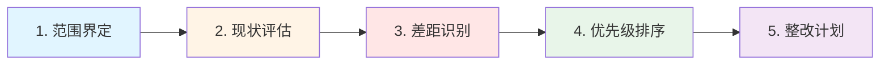

# 2.3 合规管理框架

> **Compliance Management Framework: Navigating Global Regulations**

---

## 本节概览

**学习目标**：

- 掌握全球主流合规框架（GDPR/PIPL/SOC 2/PCI DSS/SOX）
- 学会执行合规差距分析（Gap Assessment）
- 建立合规项目管理流程
- 设计跨区域合规策略

**核心价值**：合规不是一次性项目，而是持续的能力建设。本节提供从法规解读、差距分析、项目实施到持续监测的完整方法论。

**预计阅读时间**：60-80分钟

---

## 2.3.1 全球合规地图

### 合规框架分类

**按监管性质分类**：

| 类别               | 说明                 | 示例                   | 强制性                       |
| ------------------ | -------------------- | ---------------------- | ---------------------------- |
| **法律法规** | 政府颁布，强制执行   | GDPR, PIPL, SOX, HIPAA | 强制                         |
| **行业标准** | 行业协会制定，准强制 | PCI DSS, SWIFT CSP     | 准强制（不合规无法开展业务） |
| **认证框架** | 自愿认证，客户要求   | ISO 27001, SOC 2       | 自愿（但客户/市场要求）      |
| **最佳实践** | 行业指南，参考性     | NIST CSF, CIS Controls | 自愿                         |

### 核心合规框架对比

#### 1. 隐私与数据保护

**GDPR vs PIPL vs CCPA 对比**

| 维度                   | GDPR（欧盟）                                                 | PIPL（中国）                            | CCPA（加州）                               |
| ---------------------- | ------------------------------------------------------------ | --------------------------------------- | ------------------------------------------ |
| **生效时间**     | 2018年5月                                                    | 2021年11月                              | 2020年1月（2023年CPRA增强）                |
| **适用范围**     | 处理EU居民数据的全球企业                                     | 处理中国境内个人信息的企业              | 处理CA居民数据的企业（年收入>$25M）        |
| **处理合法性**   | 6种法律基础（同意/合同/法定义务/生命利益/公共利益/合法利益） | 7种法律基础（类似GDPR，但无"合法利益"） | 无明确合法性要求，侧重披露与选择退出       |
| **同意要求**     | 明确、具体、自由、知情                                       | 同GDPR，但更严格（单独同意敏感数据）    | 16岁以下需父母同意                         |
| **数据主体权利** | 8项（访问/更正/删除/限制/携带/反对/自动化决策）              | 7项（类似GDPR，无"携带权"）             | 4项（知情/删除/选择退出/不歧视）           |
| **跨境传输**     | 充分性认定/SCC/BCR/TIA                                       | 安全评估/标准合同/认证                  | 无明确跨境限制                             |
| **DPO要求**      | 公共机构/大规模处理/敏感数据必须设立                         | 处理敏感数据达到规定数量需设立          | 无强制要求                                 |
| **罚款上限**     | 2000万欧元或全球营业额4%（取高者）                           | 5000万元或营业额5%（取高者）            | $7,500/次违规（故意）或$2,500/次（非故意） |
| **通报时限**     | 72小时向监管机构                                             | 及时（通常24小时）                      | 无明确时限（各州法律不同）                 |

**实战建议：统一隐私合规框架**

```
设计思路：以GDPR为基准（最严格），叠加PIPL/CCPA差异

统一框架：
├─ 隐私政策（Privacy Policy）
│  ├─ 全球版（GDPR标准）
│  ├─ 中国版（增加PIPL特定条款：出境备案、敏感数据单独同意）
│  └─ 加州版（增加CCPA披露：Do Not Sell、数据类别）
│
├─ 数据主体权利（DSR）流程
│  ├─ 统一DSR门户（支持8项权利）
│  ├─ 中国特殊流程（人工审核、国内数据优先）
│  └─ 响应时限：30天（GDPR）vs 15天（PIPL）→ 统一15天
│
├─ 跨境传输
│  ├─ 欧盟→中国：SCC + 中国标准合同
│  ├─ 中国→欧盟：安全评估 + SCC + TIA
│  └─ 美国内部：CCPA无限制，但遵循最小化原则
│
└─ 事件响应
   ├─ 统一响应剧本
   ├─ 通报时限：24小时（满足PIPL最严格要求）
   └─ 多语言模板（中/英/德/法）
```

#### 2. 信息安全认证

**ISO 27001 vs SOC 2 对比**

| 维度               | ISO 27001                       | SOC 2 Type II                |
| ------------------ | ------------------------------- | ---------------------------- |
| **发布机构** | ISO/IEC国际标准组织             | AICPA（美国注册会计师协会）  |
| **适用地区** | 全球                            | 主要北美，全球认可度提升     |
| **认证周期** | 3年（每年监督审计）             | 年度审计（需连续）           |
| **控制框架** | 14域114控制项（ISO 27001:2022） | 5个信任服务原则（TSC）       |
| **审计范围** | 整个ISMS（信息安全管理体系）    | 可选择TSC原则组合            |
| **审计结果** | 通过/不通过（证书）             | 审计报告（含例外）           |
| **公开性**   | 证书可公开展示                  | 报告需签NDA后提供（Type II） |
| **成本**     | $50K-$150K（含咨询）            | $80K-$200K（Type II）        |
| **周期**     | 首次认证6-12个月                | 6-9个月（需先运行3-12个月）  |

**5个信任服务原则（Trust Services Criteria）**：

```
SOC 2五大原则：

1. Security（安全性）- 必选
   ├─ 访问控制
   ├─ 逻辑物理安全
   └─ 系统监控

2. Availability（可用性）- 可选
   ├─ SLA达标
   ├─ 灾难恢复
   └─ 容量管理

3. Processing Integrity（处理完整性）- 可选
   ├─ 系统处理准确完整
   ├─ 错误处理
   └─ 数据验证

4. Confidentiality（机密性）- 可选
   ├─ 数据加密
   ├─ 密钥管理
   └─ 数据生命周期

5. Privacy（隐私）- 可选
   ├─ 隐私通知
   ├─ 数据主体权利
   └─ 披露管理
```

**选择建议**：

| 场景                   | 推荐                    | 理由               |
| ---------------------- | ----------------------- | ------------------ |
| **欧洲市场为主** | ISO 27001               | 欧洲客户更认可ISO  |
| **北美SaaS企业** | SOC 2 Type II           | 北美企业采购必备   |
| **全球化企业**   | ISO 27001 + SOC 2       | 双认证覆盖全球市场 |
| **金融/支付**    | ISO 27001 + PCI DSS     | 监管要求           |
| **上市公司**     | ISO 27001 + SOC 2 + SOX | 投资人信任         |

#### 3. 支付与金融合规

**PCI DSS（Payment Card Industry Data Security Standard）**

**PCI DSS 4.0（2024年生效）核心要求**：

```
12大要求（Grouped into 6 Goals）：

Goal 1: Build and Maintain a Secure Network
├─ Req 1: 安装和维护防火墙配置
└─ Req 2: 不使用供应商默认密码

Goal 2: Protect Cardholder Data
├─ Req 3: 保护存储的持卡人数据（加密/令牌化）
└─ Req 4: 加密传输中的持卡人数据（TLS 1.2+）

Goal 3: Maintain a Vulnerability Management Program
├─ Req 5: 使用并定期更新反病毒软件
└─ Req 6: 开发和维护安全系统和应用程序（SDL）

Goal 4: Implement Strong Access Control Measures
├─ Req 7: 限制对持卡人数据的访问（最小权限）
├─ Req 8: 为系统组件分配唯一ID（MFA）
└─ Req 9: 限制对持卡人数据的物理访问

Goal 5: Regularly Monitor and Test Networks
├─ Req 10: 跟踪和监控所有对网络资源和持卡人数据的访问
└─ Req 11: 定期测试安全系统和流程（渗透测试/漏扫）

Goal 6: Maintain an Information Security Policy
└─ Req 12: 维护解决信息安全的政策
```

**PCI DSS 4.0新增要求（vs 3.2.1）**：

| 新增要求                                    | 说明                                           | 影响                            |
| ------------------------------------------- | ---------------------------------------------- | ------------------------------- |
| **多因素认证（MFA）扩展**             | 所有访问持卡人数据环境（CDE）的用户必须使用MFA | 高影响：需部署MFA到更大范围     |
| **密码学敏捷性**                      | 定期评估加密算法强度，制定升级计划             | 中影响：需建立密码学资产清单    |
| **定制化方法（Customized Approach）** | 允许企业设计等效控制措施（需证明有效性）       | 灵活性：高成熟度企业可定制      |
| **自动化日志审查**                    | 使用自动化工具（SIEM）监测异常                 | 高影响：需投资SIEM              |
| **容器安全**                          | 明确容器化环境的安全要求                       | 中影响：使用K8s的企业需额外控制 |

**PCI DSS合规等级**：

| 等级              | 年交易量（Visa/MC）          | 评估要求                      | 成本           |
| ----------------- | ---------------------------- | ----------------------------- | -------------- |
| **Level 1** | >600万笔/年                  | QSA年度现场审计 + 季度ASV扫描 | $150K-$500K/年 |
| **Level 2** | 100万-600万笔/年             | SAQ + 季度ASV扫描             | $50K-$150K/年  |
| **Level 3** | 2万-100万笔/年（e-commerce） | SAQ + 季度ASV扫描             | $20K-$50K/年   |
| **Level 4** | <2万笔/年                    | SAQ + 年度ASV扫描             | $10K-$20K/年   |

#### 4. 上市公司合规

**SOX（Sarbanes-Oxley Act）核心要求**

**SOX 404条款：内部控制评估**

```
SOX 404要求：

1. 管理层职责（404a）
   ├─ 建立并维护内部控制框架
   ├─ 评估内部控制有效性
   └─ 年度内控报告

2. 审计师鉴证（404b）
   ├─ 外部审计师审计内控有效性
   ├─ 发表独立意见
   └─ 识别重大缺陷（Material Weakness）

内部控制框架（通常使用COSO）：
├─ 控制环境（Control Environment）
├─ 风险评估（Risk Assessment）
├─ 控制活动（Control Activities）
├─ 信息与沟通（Information & Communication）
└─ 监控（Monitoring）
```

**IT一般控制（ITGC）vs 应用控制**：

| 类型               | 说明                       | 示例                                        |
| ------------------ | -------------------------- | ------------------------------------------- |
| **ITGC**     | 支撑IT环境的基础控制       | 访问控制、变更管理、备份恢复、职责分离      |
| **应用控制** | 针对特定应用的业务逻辑控制 | ERP系统的采购审批工作流、财务系统的自动对账 |

**SOX合规时间表（IPO企业）**：

```
IPO前12-18个月：
Month 1-3:  启动SOX项目，选择审计师，范围界定
Month 4-6:  流程梳理，风险评估，控制设计
Month 7-9:  控制实施，员工培训，证据采集
Month 10-12: 管理层测试（Management Testing）
Month 13-15: 审计师测试（External Audit）
Month 16-18: 发现整改，复测，IPO路演

IPO后：
- Year 1: 404a合规（仅管理层评估，豁免404b）
- Year 2+: 404a + 404b（需审计师鉴证）
```

---

## 2.3.2 合规差距分析（Gap Assessment）

### 差距分析流程

**5步法**：



### 步骤1：范围界定（Scoping）

**范围界定工作坊（4小时）**

**参与方**：

- 合规负责人（主持）
- CISO/信息安全团队
- 法务/DPO
- IT负责人
- 业务代表（各核心业务线）
- 财务（如涉及SOX）

**输出物**：

- 合规范围声明（Scope Statement）
- 业务流程清单
- 系统清单
- 数据流图
- 地理位置清单（跨境数据）

**范围界定示例：ISO 27001**

| 维度               | 范围定义                              | 排除项                  |
| ------------------ | ------------------------------------- | ----------------------- |
| **组织范围** | 全球总部 + 研发中心 + 数据中心        | 区域销售办公室（<10人） |
| **业务流程** | 产品开发、运营、客户支持              | 行政/HR流程             |
| **系统**     | 生产环境、办公网络、云基础设施        | 测试/开发环境           |
| **数据**     | 客户数据、支付数据、员工数据          | 营销数据（非敏感）      |
| **物理位置** | 北京总部、上海数据中心、AWS us-east-1 | 共享办公空间（WeWork）  |

### 步骤2：现状评估（Current State Assessment）

**评估方法矩阵**：

| 方法               | 适用场景               | 优点         | 缺点         | 工具                       |
| ------------------ | ---------------------- | ------------ | ------------ | -------------------------- |
| **问卷调查** | 初步评估、大范围扫描   | 快速、标准化 | 依赖填写质量 | Google Forms、Excel        |
| **文档审查** | 评估政策、流程、证据   | 客观、可追溯 | 耗时         | SharePoint、Confluence     |
| **访谈**     | 深度了解流程、控制执行 | 信息丰富     | 主观、耗时   | 访谈记录表                 |
| **现场观察** | 验证物理控制、操作规范 | 直观、真实   | 无法大规模   | 审计检查表                 |
| **技术测试** | 验证技术控制有效性     | 精确         | 需专业技能   | Nessus、Qualys、自动化脚本 |

**ISO 27001现状评估示例**

**评估维度**：14个域，114个控制项

| 域                         | 控制项数 | 评估方法      | 示例控制项                       |
| -------------------------- | -------- | ------------- | -------------------------------- |
| **A.5 信息安全政策** | 2        | 文档审查      | 5.1 信息安全政策文档             |
| **A.6 信息安全组织** | 7        | 文档审查+访谈 | 6.1 内部组织、6.2 移动设备       |
| **A.8 资产管理**     | 10       | 文档+技术测试 | 8.1 资产清单、8.2 信息分类       |
| **A.12 运营安全**    | 14       | 技术测试+现场 | 12.1 操作程序、12.6 漏洞管理     |
| **A.13 通信安全**    | 7        | 技术测试      | 13.1 网络安全、13.2 信息传输     |
| **A.18 合规性**      | 8        | 文档+访谈     | 18.1 法规合规、18.2 信息安全审查 |

**控制评估评分标准**：

| 评分                               | 说明                   | 定义                 | 差距程度   |
| ---------------------------------- | ---------------------- | -------------------- | ---------- |
| **5 - 优化（Optimized）**    | 控制持续优化，数据驱动 | 自动化监控+定期优化  | 0%差距     |
| **4 - 管理（Managed）**      | 控制有效，有监控机制   | 定期监测+有效性评估  | <20%差距   |
| **3 - 已定义（Defined）**    | 控制已实施，流程文档化 | 有政策+有执行+有证据 | 20-40%差距 |
| **2 - 可重复（Repeatable）** | 控制部分实施，不完整   | 有政策但执行不一致   | 40-70%差距 |
| **1 - 初始（Initial）**      | 控制未实施或临时性     | 无政策或无执行       | >70%差距   |
| **0 - 不适用（N/A）**        | 控制不适用于本组织     | -                    | -          |

### 步骤3：差距识别（Gap Identification）

**差距分析矩阵**：

| 控制项                       | 标准要求                           | 当前状态                                     | 差距描述                                          | 差距等级 | 影响                         |
| ---------------------------- | ---------------------------------- | -------------------------------------------- | ------------------------------------------------- | -------- | ---------------------------- |
| **A.8.1 资产清单**     | 维护完整资产清单（硬件/软件/数据） | 有硬件清单，但软件清单不完整，无数据资产清单 | 缺少软件资产清单（覆盖率60%）和数据资产清单（0%） | 高       | 无法评估资产风险，审计不通过 |
| **A.12.6 漏洞管理**    | 定期扫描+30天内修复高危漏洞        | 每月扫描，但高危漏洞平均修复时间45天         | 修复时效不达标（45天 vs 30天）                    | 中       | 增加被攻击风险，审计发现     |
| **A.9.2 用户访问管理** | 用户访问权限定期复审（季度）       | 仅年度复审                                   | 复审频率不足（年度 vs 季度）                      | 低       | 可能存在权限蔓延，风险可控   |

**差距等级定义**：

```
高差距（High Gap）：
- 控制完全缺失
- 或控制有效性<50%
- 或涉及高风险领域（如加密、访问控制）
→ 审计不通过，需优先整改

中差距（Medium Gap）：
- 控制部分实施但不完整
- 有效性50-80%
→ 审计可能有条件通过，需计划整改

低差距（Low Gap）：
- 控制基本有效但有改进空间
- 有效性>80%
→ 审计可通过，持续改进
```

### 步骤4：优先级排序（Prioritization）

**优先级评分模型**：

```
优先级得分 = 风险评分 × 0.4 + 整改难度 × 0.3 + 审计关键性 × 0.3

风险评分（1-5分）：
- 5分：涉及高风险（数据泄露、可用性）
- 3分：涉及中风险
- 1分：涉及低风险

整改难度（1-5分，分数越低越容易）：
- 1分：简单（更新文档、调整配置）
- 3分：中等（采购工具、流程变更）
- 5分：复杂（系统重构、组织变革）

审计关键性（1-5分）：
- 5分：必审项（核心控制）
- 3分：抽样项
- 1分：选审项
```

**优先级排序示例**：

| 控制项                     | 风险 | 难度 | 审计 | 得分 | 优先级 | 整改周期    |
| -------------------------- | ---- | ---- | ---- | ---- | ------ | ----------- |
| 数据加密（传输+静态）      | 5    | 3    | 5    | 4.3  | P0     | 立即（2周） |
| 资产清单（数据资产）       | 4    | 4    | 5    | 4.3  | P0     | 30天        |
| MFA部署（生产环境）        | 5    | 2    | 5    | 4.2  | P0     | 2周         |
| 漏洞修复时效（45→30天）   | 4    | 2    | 4    | 3.4  | P1     | 60天        |
| 访问权限复审频率（年→季） | 3    | 1    | 3    | 2.4  | P2     | 90天        |

### 步骤5：整改计划（Remediation Plan）

**整改计划模板**：

| 项目               | 差距描述      | 目标状态                              | 行动项                                                                     | 责任人      | 截止日期 | 预算                  | 状态   |
| ------------------ | ------------- | ------------------------------------- | -------------------------------------------------------------------------- | ----------- | -------- | --------------------- | ------ |
| **数据加密** | 数据库未加密  | 所有生产数据库启用TDE（透明数据加密） | 1. 评估TDE性能影响<br />2. 制定部署方案 <br />3. 生产部署 <br />4. 验证    | 张三（DBA） | Week 2   | $0（AWS RDS原生支持） | 进行中 |
| **MFA部署**  | 生产环境无MFA | 所有生产访问强制MFA                   | 1. 选型MFA方案（Okta）<br />2. POC测试 <br />3. 全员部署 <br />4. 策略强制 | 李四（IAM） | Week 2   | $50K/年               | 已完成 |

**整改跟踪机制**：

```
日报（针对P0项目）：
- 每日站会（15分钟）
- 更新Jira/GRC平台状态

周报（针对P0/P1项目）：
- 每周五发送邮件给CISO/审计师
- 包含：完成项、进行中、阻塞项、风险

月报（所有项目）：
- 向GRC委员会汇报
- 整体进度、预算执行、风险提示

审计前复查（T-2周）：
- 审计师预审
- 证据准备检查清单
- 模拟审计（Mock Audit）
```

---

## 2.3.3 合规项目管理

### 合规项目生命周期

**6阶段模型**：

```
1. 启动（Initiation）
   ├─ 项目章程
   ├─ 范围界定
   └─ 团队组建
   ⏱️ 2-4周

2. 规划（Planning）
   ├─ 差距分析
   ├─ 整改计划
   └─ 资源分配
   ⏱️ 4-8周

3. 执行（Execution）
   ├─ 控制实施
   ├─ 证据采集
   └─ 培训
   ⏱️ 12-24周

4. 测试（Testing）
   ├─ 管理层测试
   ├─ 预审（Pre-audit）
   └─ 整改
   ⏱️ 4-8周

5. 认证（Certification）
   ├─ 正式审计
   ├─ 发现整改
   └─ 获证
   ⏱️ 2-4周

6. 维护（Maintenance）
   ├─ 持续监控
   ├─ 年度监督审计
   └─ 持续改进
   ⏱️ 持续
```

### ISO 27001项目时间表

**典型18个月时间表**：

| 阶段                  | 月份    | 关键活动                           | 交付物                  | 里程碑        |
| --------------------- | ------- | ---------------------------------- | ----------------------- | ------------- |
| **启动**        | M1      | 项目启动会、范围界定、选择认证机构 | 项目章程、范围声明      | 项目批准      |
| **规划**        | M2-M3   | 差距分析、风险评估、制定整改计划   | 差距报告、项目计划      | 计划批准      |
| **ISMS建设**    | M4-M6   | 制定政策/流程、风险处置、控制实施  | 14个域的政策/流程文档   | ISMS文档完成  |
| **执行**        | M7-M12  | 控制运行、培训、证据采集           | 运行证据（6个月）       | 控制运行6个月 |
| **内审**        | M13     | 内部审计、管理评审                 | 内审报告、管理评审纪要  | 内审完成      |
| **Stage 1审计** | M14     | 认证机构文档审查                   | 文档审查报告、整改清单  | Stage 1通过   |
| **整改**        | M15     | 整改Stage 1发现                    | 整改证据                | 整改关闭      |
| **Stage 2审计** | M16     | 认证机构现场审计（3-5天）          | 审计报告、不符合项清单  | Stage 2完成   |
| **整改&获证**   | M17-M18 | 整改不符合项、颁发证书             | 整改证据、ISO 27001证书 | 获证          |

### SOC 2 Type II项目时间表

**典型12-15个月时间表**：

```
阶段1: 准备期（3-6个月）
├─ Month 1-2: Readiness Assessment（就绪评估）
│  └─ 输出：差距报告、整改计划
├─ Month 3-4: 控制设计与实施
│  └─ 输出：控制矩阵、政策文档
└─ Month 5-6: 试运行
   └─ 输出：初步运行证据

阶段2: 审计期（6-9个月）
├─ Month 7-15: 审计观察期（需连续6-12个月）
│  ├─ 证据采集（自动化+人工）
│  ├─ 季度自评
│  └─ 预审（Pre-audit）
└─ Month 15: 正式审计（2-3周）
   ├─ 审计师现场/远程审计
   ├─ 发现整改
   └─ 输出：SOC 2 Type II报告

阶段3: 维护期（持续）
├─ 年度重审
├─ 控制变更管理
└─ 持续监控
```

**关键注意事项**：

- **审计观察期不能缩短**：SOC 2 Type II必须有6-12个月的控制运行证据
- **证据的连续性**：不能有证据断档（如日志丢失）
- **审计师选择**：选择有行业经验的审计师（如Deloitte、PwC、KPMG、BDO）

### 合规项目成功要素

**Top 10成功要素**：

| 要素                    | 说明                                          | 案例                                             |
| ----------------------- | --------------------------------------------- | ------------------------------------------------ |
| **1. 高层支持**   | CEO/CFO/CISO明确支持，定期参与评审            | 某公司CEO担任ISO 27001项目赞助人，月度例会必参加 |
| **2. 专职团队**   | 配备专职项目经理+合规工程师，而非兼职         | 某公司设立3人合规项目组（PM+2名工程师）          |
| **3. 跨职能协作** | 打破部门墙，建立协作机制（安全/IT/法务/业务） | 成立跨职能工作组，每周例会，Slack专属频道        |
| **4. 外部专家**   | 聘请咨询公司加速（特别是首次认证）            | 聘请咨询公司（$80K），缩短周期6个月→4个月       |
| **5. 工具投资**   | 使用GRC平台管理控制/证据/任务                 | 使用Vanta自动化证据采集，节省人工80%             |
| **6. 培训文化**   | 全员培训，而非仅合规团队                      | 全员ISO 27001培训（2小时），通过率>95%           |
| **7. 敏捷迭代**   | 采用敏捷方法，2周冲刺，快速迭代               | 使用Scrum方法，每2周交付一批控制措施             |
| **8. 风险优先**   | 优先解决高风险差距，而非追求完美              | 聚焦Top 20风险，其余项目后续迭代                 |
| **9. 自动化**     | 尽可能自动化证据采集（日志/配置/监控）        | 使用脚本自动采集AWS配置证据，每日自动化          |
| **10. 持续改进**  | 获证后持续优化，而非"一次性项目"              | 季度内审，持续优化控制有效性                     |

---

## 2.3.4 跨区域合规策略

### 中国 vs 欧美合规差异

**关键差异对比**：

| 维度                 | 中国                               | 欧盟                       | 美国                             |
| -------------------- | ---------------------------------- | -------------------------- | -------------------------------- |
| **监管风格**   | 强监管、事前审批                   | 强监管、事后问责           | 行业自律+联邦/州法律拼图         |
| **数据本地化** | 关基+重要数据必须境内              | 无本地化要求               | 无联邦要求（部分州/行业有要求）  |
| **跨境审批**   | 需安全评估/标准合同/认证           | SCC/BCR/充分性认定         | 一般无限制（CLOUD Act例外）      |
| **监管机构**   | 网信办、工信部、公安部（多头监管） | EDPB、各国DPA              | FTC、SEC、州总检察长（分散）     |
| **罚款威慑**   | 5000万或营业额5%（PIPL）           | 2000万欧或营业额4%（GDPR） | $7,500/次（CCPA），$100M+（FTC） |
| **企业责任**   | 平台责任重（电商法、内容审查）     | 平台责任（DSA/DMA）        | 行业自律为主（Section 230保护）  |

### 跨区域合规架构设计

**架构模式：中心辐射模型（Hub-Spoke）**

```
                ┌──────────────────┐
                │  全球合规中心    │
                │  (Global CoE)    │
                │                  │
                │ - 统一框架       │
                │ - 工具平台       │
                │ - 培训支持       │
                └────────┬─────────┘
                         │
         ┌───────────────┼───────────────┐
         │               │               │
    ┌────▼────┐     ┌────▼────┐     ┌───▼─────┐
    │ 中国团队 │     │ 欧盟团队 │     │ 美国团队 │
    │         │     │         │     │         │
    │ - PIPL  │     │ - GDPR  │     │ - CCPA  │
    │ - 网安法 │     │ - NIS2  │     │ - SOX   │
    │ - 关基  │     │ - DSA   │     │ - HIPAA │
    └─────────┘     └─────────┘     └─────────┘
         │               │               │
    本地监管沟通    本地监管沟通    本地监管沟通
```

### 统一合规框架设计

**设计原则**：

1. **以最严标准为基准（GDPR-first）**

   - 原因：GDPR是当前最严格的隐私法规
   - 方法：全球统一采用GDPR标准，叠加本地化差异
2. **分层设计（3层）**

   ```
   Layer 1: 全球统一框架（Global Baseline）
   ├─ 核心原则、政策、流程
   └─ 适用全球所有地区

   Layer 2: 区域特定要求（Regional Requirements）
   ├─ 中国：PIPL特殊要求（出境备案、敏感数据单独同意）
   ├─ 欧盟：GDPR特殊要求（DPO强制、TIA）
   └─ 美国：CCPA特殊要求（Do Not Sell、CCPA披露）

   Layer 3: 行业特定要求（Industry Requirements）
   ├─ 金融：PCI DSS、AML
   ├─ 医疗：HIPAA
   └─ 上市：SOX
   ```

```

3. **技术架构支持**
```

   数据架构：
   ├─ 中国数据中心（阿里云/腾讯云）
   │  └─ 存储中国用户数据（满足本地化要求）
   ├─ 欧盟数据中心（AWS eu-central-1）
   │  └─ 存储欧盟用户数据（满足GDPR就近原则）
   ├─ 美国数据中心（AWS us-east-1）
   │  └─ 存储美国用户数据
   └─ 全球数据目录（Data Catalog）
      └─ 统一数据地图、数据血缘、跨境流动记录

```

### 跨境数据传输合规方案

**场景：某跨国电商企业**

**背景**：
- 总部：美国（研发+数据分析）
- 运营中心：中国（客户数据）、欧盟（客户数据）
- 数据流动：中国↔美国、欧盟↔美国

**合规方案**：

| 数据流 | 法规要求 | 合规机制 | 技术措施 | 审批流程 |
|--------|---------|---------|---------|---------|
| **中国→美国** | PIPL：需安全评估或标准合同 | 签署标准合同+备案 | 1. 数据脱敏 2. 加密传输 3. 访问审计 | 1. 法务审批 2. 网信办备案（如适用） |
| **欧盟→美国** | GDPR：需SCC+TIA | 签署SCC 2021 Module 2 完成TIA | 1. 最小化传输 2. 假名化 3. 访问日志 | 1. DPO审批 2. 年度TIA复审 |
| **美国→中国** | 中国入境：需合法性评估 | 评估传输必要性 | 1. 仅传输必要数据 2. 加密存储 | 1. 中国法务审批 |
| **美国→欧盟** | GDPR：需SCC+TIA | 签署SCC 2021 Module 2 | 同上 | 1. DPO审批 |

**TIA（Transfer Impact Assessment）模板**：

```markdown
# 数据传输影响评估（TIA）

## 1. 传输基本信息
- 数据输出方：某公司（欧盟）
- 数据接收方：某公司（美国）
- 数据类型：客户订单数据（姓名、地址、订单历史）
- 传输目的：数据分析、个性化推荐
- 传输频率：每日批量传输
- 数据量：100万条/天

## 2. 接收国法律环境评估
### 2.1 美国法律框架
- 无联邦隐私法（仅CCPA等州法律）
- CLOUD Act：允许美国执法机构跨境调取数据
- 外国情报监视法（FISA）：允许政府监控

### 2.2 风险评估
- 高风险：CLOUD Act可能导致数据被美国政府调取
- 中风险：无联邦DPA，监管分散
- 缓解措施：见第3节

## 3. 补充措施（Supplementary Measures）
### 3.1 技术措施
-  数据假名化（Pseudonymization）
-  端到端加密（美国侧无法解密）
-  数据最小化（仅传输必要字段）

### 3.2 合同措施
-  SCC 2021 Module 2
-  政府请求通知条款（Data Access Request Protocol）
-  年度审计权

### 3.3 组织措施
-  数据访问审批流程
-  访问日志监控
-  年度TIA复审

## 4. 结论
在实施上述补充措施后，残余风险可接受。
批准传输。

---
评估人：张三（DPO）
批准人：李四（CISO）
日期：2025年1月15日
复审日期：2026年1月15日
```

---

## 2.3.5 合规自动化

### 自动化合规的价值

**传统合规 vs 自动化合规**：

| 维度               | 传统方式      | 自动化方式            | 改善            |
| ------------------ | ------------- | --------------------- | --------------- |
| **证据采集** | 手工截图+文档 | API自动拉取           | 效率提升90%     |
| **控制测试** | 季度人工抽样  | 持续自动化测试（CCM） | 覆盖率100%      |
| **合规报告** | 月度人工汇总  | 实时仪表盘            | 实时可见        |
| **政策分发** | 邮件+人工签收 | 自动推送+电子签名     | 签收率95%+      |
| **变更审批** | 邮件+会议     | 工作流自动化          | 审批周期缩短70% |

**ROI计算示例**：

```
场景：SOC 2 Type II合规

传统方式成本（年度）：
- 合规工程师 × 2人：$200K
- 审计师费用：$100K
- 人工采证时间：800小时/年
总成本：$300K + 机会成本

自动化方式成本（年度）：
- GRC平台（Vanta）：$50K/年
- 合规工程师 × 1人：$100K
- 自动采证时间：80小时/年（节省90%）
总成本：$150K

ROI = ($300K - $150K) / $150K × 100% = 100%
投资回收期：1年
```

### 合规自动化工具地图

**工具分类**：

| 类别                     | 工具                              | 适用场景              | 价格           |
| ------------------------ | --------------------------------- | --------------------- | -------------- |
| **合规自动化平台** | Vanta, Drata, Secureframe         | SOC 2/ISO 27001自动化 | $30K-$80K/年   |
| **GRC平台**        | ServiceNow IRM, RSA Archer        | 企业级GRC管理         | $150K-$500K/年 |
| **隐私管理**       | OneTrust, TrustArc, BigID         | GDPR/PIPL合规         | $80K-$300K/年  |
| **云安全合规**     | Wiz, Orca, Prisma Cloud           | 云配置合规（CSPM）    | $50K-$200K/年  |
| **数据发现**       | BigID, Varonis, Microsoft Purview | 数据分类+发现         | $100K-$400K/年 |
| **政策管理**       | PolicyTech, MetricStream          | 政策生命周期管理      | $30K-$100K/年  |

### Vanta自动化案例

**Vanta能力矩阵**：

| 功能               | 说明                                                  | 自动化程度 |
| ------------------ | ----------------------------------------------------- | ---------- |
| **证据采集** | 自动连接70+工具（AWS/GitHub/Okta/Jira），自动拉取证据 | 95%        |
| **控制监测** | 实时监测控制状态（如MFA启用率、日志留存）             | 100%       |
| **任务管理** | 自动生成整改任务，分配责任人，跟踪进度                | 90%        |
| **审计协作** | 审计师直接访问Vanta平台，在线查看证据                 | 100%       |
| **合规报告** | 自动生成合规仪表盘，导出审计包                        | 100%       |

**Vanta自动化效果**：

| 指标              | 手工方式            | Vanta自动化 | 改善 |
| ----------------- | ------------------- | ----------- | ---- |
| SOC 2证据采集时间 | 400小时             | 40小时      | -90% |
| 控制监测频率      | 季度                | 实时        | -    |
| 审计准备时间      | 4周                 | 3天         | -85% |
| 合规人员需求      | 3人                 | 1人         | -67% |
| 总成本            | $300K/年 | $150K/年 | -50%        |      |

---

## 本节总结

### 核心要点回顾

 **全球合规地图**：

- GDPR vs PIPL vs CCPA（隐私）
- ISO 27001 vs SOC 2（信息安全）
- PCI DSS（支付）、SOX（上市）

 **合规差距分析5步法**：

1. 范围界定（Scoping）
2. 现状评估（Assessment）
3. 差距识别（Gap Identification）
4. 优先级排序（Prioritization）
5. 整改计划（Remediation Plan）

 **合规项目管理**：

- ISO 27001：18个月时间表
- SOC 2 Type II：12-15个月（含6-12个月观察期）
- 成功要素：高层支持、专职团队、工具投资

 **跨区域合规策略**：

- 中心辐射模型（Hub-Spoke）
- GDPR-first设计原则
- 跨境数据传输：SCC+TIA

 **合规自动化**：

- 工具：Vanta, OneTrust, Wiz
- ROI：效率提升90%，成本降低50%

### 学习检查清单

完成本节学习后，请检查你是否能够：

- [ ] 对比GDPR/PIPL/CCPA的核心差异（至少5个维度）
- [ ] 执行一个合规差距分析（选择ISO 27001或SOC 2）
- [ ] 设计一个ISO 27001项目的18个月时间表
- [ ] 制定一个跨境数据传输的合规方案（选择一个场景）
- [ ] 完成一个TIA（Transfer Impact Assessment）
- [ ] 评估3个合规自动化工具的ROI

### 实践作业

**作业1：合规差距分析**

- 选择一个合规框架（ISO 27001或SOC 2）
- 针对你所在企业，执行差距分析
- 输出：差距报告（包含优先级排序）
- 制定90天整改计划

**作业2：跨境数据传输方案**

- 选择一个跨境数据传输场景（如中国→欧盟）
- 识别适用法规（PIPL + GDPR）
- 完成TIA评估
- 设计技术+合同+组织措施

**作业3：合规自动化ROI分析**

- 评估你所在企业当前合规成本（人力+时间）
- 选择3个自动化工具
- 计算每个工具的ROI
- 向CFO汇报推荐方案（10分钟PPT）

### 延伸阅读

**法规与标准**：

- **GDPR官方文本**: https://GDPR-info.eu
- **PIPL中文全文**: http://www.npc.gov.cn
- **ISO 27001:2022**: https://www.iso.org/standard/82875.html
- **SOC 2**: https://us.aicpa.org/interestareas/frc/assuranceadvisoryservices/aicpasoc2report
- **PCI DSS 4.0**: https://www.pcisecuritystandards.org

**合规自动化工具**：

- **Vanta**: https://www.vanta.com
- **Drata**: https://drata.com
- **OneTrust**: https://www.onetrust.com
- **Wiz**: https://www.wiz.io

**行业指南**：

- IAPP: International Association of Privacy Professionals - https://iapp.org
- CSA: Cloud Security Alliance - https://cloudsecurityalliance.org
- EDPB Guidelines: https://edpb.europa.eu/our-work-tools/general-guidance_en

---

**下一节预告**：

 [2.4 政策与标准体系](./2.4_policy_standards.md)

下一节我们将深入探讨：

- 四级政策框架设计
- 统一控制库建设
- 政策生命周期管理
- 政策自动化分发与签收

## 📍 导航 | Navigation

**[← 上一节](./2.2_risk_management_system.md)** | **[返回 Part 1](../)** | **[返回总目录](../../)** | **[→ 下一节](./2.4_policy_standards.md)**

---

**© 2025 AI-ESA Project. Licensed under CC BY-NC-SA 4.0**
