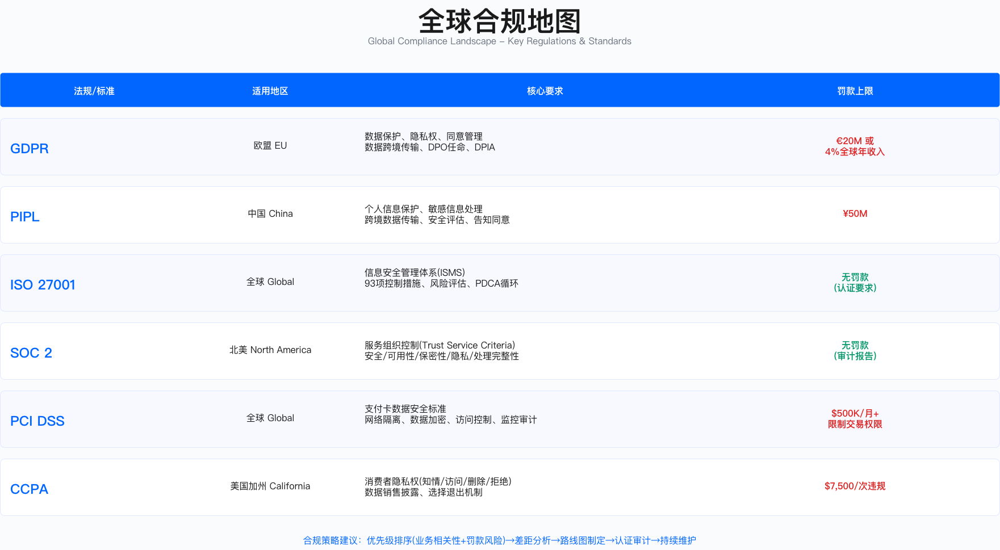

# 2.3 合规管理框架

> **Compliance Management Framework: Navigating Global Regulations**

---

## 2.3.1 全球合规框架体系

合规管理的核心挑战在于：企业面临的监管要求呈多层次、跨地域分布，且不同法规之间存在重叠甚至冲突。本节从分类体系入手，建立合规管理的认知框架。

### 合规框架分类

合规框架按监管性质可分为四类，其强制性程度和违规后果差异显著。

| 类别 | 说明 | 示例 | 强制性 |
|------|------|------|-------|
| **法律法规** | 政府颁布，强制执行 | GDPR、PIPL、SOX、HIPAA | 强制 |
| **行业标准** | 行业协会制定，准强制 | PCI DSS、SWIFT CSP | 准强制（不合规无法开展业务） |
| **认证框架** | 自愿认证，客户要求 | ISO 27001、SOC 2 | 自愿（但客户/市场要求） |
| **最佳实践** | 行业指南，参考性 | NIST CSF、CIS Controls | 自愿 |

这一分类的实际意义在于资源配置优先级：法律法规违规可能导致行政处罚甚至刑事责任，行业标准违规影响业务准入，认证框架影响客户信任，最佳实践则主要用于能力对标。企业应根据业务场景和风险偏好确定优先级排序。



### 隐私与数据保护法规对比

跨国企业面临的典型困境是：同一份用户数据在不同司法管辖区需遵守不同法规，而这些法规的要求可能相互冲突。

**GDPR、PIPL、CCPA 核心差异**

| 维度 | GDPR（欧盟） | PIPL（中国） | CCPA（加州） |
|------|------------|------------|-------------|
| **生效时间** | 2018年5月 | 2021年11月 | 2020年1月（2023年CPRA增强） |
| **适用范围** | 处理EU居民数据的全球企业 | 处理中国境内个人信息的企业 | 处理CA居民数据的企业（年收入门槛适用） |
| **处理合法性** | 6种法律基础（同意/合同/法定义务/生命利益/公共利益/合法利益） | 7种法律基础（类似GDPR，但无"合法利益"） | 无明确合法性要求，侧重披露与选择退出 |
| **同意要求** | 明确、具体、自由、知情 | 同GDPR，但更严格（单独同意敏感数据） | 16岁以下需父母同意 |
| **数据主体权利** | 8项（访问/更正/删除/限制/携带/反对/自动化决策） | 7项（类似GDPR，无"携带权"） | 4项（知情/删除/选择退出/不歧视） |
| **跨境传输** | 充分性认定/SCC/BCR/TIA | 安全评估/标准合同/认证 | 无明确跨境限制 |
| **DPO要求** | 公共机构/大规模处理/敏感数据必须设立 | 处理敏感数据达到规定数量需设立 | 无强制要求 |
| **罚款上限** | 2000万欧元或全球营业额4%（取高者） | 5000万元或营业额5%（取高者） | $7,500/次违规（故意）或$2,500/次（非故意） |
| **通报时限** | 72小时向监管机构 | 及时（通常理解为24小时） | 无明确时限（各州法律不同） |

**适用边界**：上述对比适用于需要同时在多个司法管辖区运营的企业。单一市场运营的企业可简化为单一法规合规，但仍需关注数据跨境流动场景。

**关键约束**：三大法规的核心冲突点在于数据本地化、跨境传输机制、删除权与保留义务的平衡。技术实现上需支持数据分类存储和差异化生命周期管理。

### 法规冲突处理框架

当不同法规要求直接冲突时，企业需要建立系统化的决策框架。以GDPR删除权与中国反洗钱法保留义务的冲突为例：

**冲突场景分析**

| 冲突维度 | GDPR要求 | 中国法律要求 | 冲突根源 |
|---------|---------|-------------|---------|
| **法律依据** | GDPR第17条"被遗忘权"：用户有权要求删除个人数据 | 中国《反洗钱法》第19条：金融机构应保存交易记录5年以上 | 删除义务与保留义务直接冲突 |
| **适用对象** | 欧盟居民（无论国籍），处理EU居民数据的全球企业 | 中国境内金融交易，涉及跨境支付的电商平台 | 同一用户同时受两地法律保护 |
| **违规后果** | 罚款最高€20M或4%年收入 | 罚款最高¥500万，吊销支付牌照，刑事责任 | 任何单边合规都导致另一边违法 |
| **技术约束** | 需要跨系统删除（订单/支付/CRM/营销），数据关联复杂 | 需保留完整交易链（订单→支付→结算），数据不可篡改 | 全局数据库架构无法同时满足删除和保留 |

**决策路径**

单边合规方案均存在重大风险：完全删除满足GDPR但违反反洗钱法，完全保留满足反洗钱法但违反GDPR。可行的折中方案需同时满足两个条件：一是找到法律允许的例外条款，二是实现数据分类处理。

GDPR第17条第3款b项规定："为遵守欧盟或成员国法律规定的法律义务，或为执行公共利益任务所必需的处理，可以拒绝删除请求。"这一例外条款为折中方案提供了法律基础。

**实施框架**

| 实施步骤 | 核心内容 | 法律依据 | 技术实现 |
|---------|---------|---------|---------|
| **数据分类** | 区分营销数据（可删除）与财务数据（必须保留） | GDPR第5条"数据最小化原则" | 数据库标签分类 |
| **立即删除** | 浏览历史、购物车、营销偏好、设备指纹、Cookie | GDPR第17条删除义务 | 自动化脚本，跨系统级联删除 |
| **保留最小必要数据** | 交易记录（订单号/金额/时间/商品类别），支付信息（脱敏），KYC信息 | 中国《反洗钱法》第19条+GDPR第17条第3款b项例外 | 数据脱敏，仅保留监管所需字段 |
| **法律依据告知** | 向用户发送详细回复：已删除内容+保留内容+法律依据+保留期限+投诉渠道 | GDPR第12条"透明沟通义务" | 自动生成多语言邮件模板 |
| **双边监管备案** | 向相关监管机构提交合规报告 | GDPR第30条"处理活动记录"+PIPL第25条"安全评估" | 合规管理平台自动生成监管报告 |

**常见误区**：

1. **忽视例外条款**：直接拒绝删除请求而不援引法律依据，导致GDPR投诉；
2. **过度保留数据**：以合规为由保留非必要数据，违反数据最小化原则；
3. **缺乏透明沟通**：未向用户说明保留原因和期限，增加投诉风险；
4. **单边决策**：未与两地监管机构沟通，事后被动应对。

**验证方法**：

- 法律合规性审查：外部律师出具法律意见书，确认例外条款适用性；
- 数据分类测试：抽样验证数据分类准确性，确保营销数据与财务数据分离；
- DSR流程测试：模拟用户删除请求，验证响应时效和内容完整性；
- 审计追溯：验证删除和保留操作的日志记录完整性。

**运行指标**：

- DSR响应时效：从收到请求到完成处理的天数（目标：≤PIPL要求的时限）；
- 数据分类准确率：营销数据与财务数据分类正确率；
- 删除完整性：级联删除覆盖系统数；
- 投诉率：因删除处理引发的监管投诉数量。

### 统一隐私合规框架设计

基于上述分析，跨国企业应采用"以最严标准为基准，叠加本地化差异"的设计思路。

```
设计思路：以GDPR为基准（最严格），叠加PIPL/CCPA差异

统一框架：
├─ 隐私政策（Privacy Policy）
│   ├─ 全球版（GDPR标准）
│   ├─ 中国版（增加PIPL特定条款：出境备案、敏感数据单独同意）
│   └─ 加州版（增加CCPA披露：Do Not Sell、数据类别）
│
├─ 数据主体权利（DSR）流程
│   ├─ 统一DSR门户（支持8项权利）
│   ├─ 中国特殊流程（人工审核、国内数据优先）
│   └─ 响应时限：统一采用最严格要求
│
├─ 跨境传输
│   ├─ 欧盟→中国：SCC + 中国标准合同
│   ├─ 中国→欧盟：安全评估 + SCC + TIA
│   └─ 美国内部：遵循最小化原则
│
└─ 事件响应
    ├─ 统一响应剧本
    ├─ 通报时限：采用最严格要求
    └─ 多语言模板
```

### 信息安全认证对比

**ISO 27001 与 SOC 2 对比**

| 维度 | ISO 27001 | SOC 2 Type II |
|------|-----------|--------------|
| **发布机构** | ISO/IEC国际标准组织 | AICPA（美国注册会计师协会） |
| **适用地区** | 全球 | 主要北美，全球认可度提升 |
| **认证周期** | 3年（每年监督审计） | 年度审计（需连续） |
| **控制框架** | 14域114控制项（ISO 27001:2022） | 5个信任服务原则（TSC） |
| **审计范围** | 整个ISMS（信息安全管理体系） | 可选择TSC原则组合 |
| **审计结果** | 通过/不通过（证书） | 审计报告（含例外） |
| **公开性** | 证书可公开展示 | 报告需签NDA后提供（Type II） |
| **成本区间** | 含咨询费用，因企业规模和范围差异较大 | 因审计师和范围差异较大 |
| **周期** | 首次认证6-12个月 | 6-9个月（需先运行3-12个月） |

**SOC 2 五大信任服务原则**

```
SOC 2五大原则：

1. Security（安全性）- 必选
   ├─ 访问控制
   ├─ 逻辑物理安全
   └─ 系统监控

2. Availability（可用性）- 可选
   ├─ SLA达标
   ├─ 灾难恢复
   └─ 容量管理

3. Processing Integrity（处理完整性）- 可选
   ├─ 系统处理准确完整
   ├─ 错误处理
   └─ 数据验证

4. Confidentiality（机密性）- 可选
   ├─ 数据加密
   ├─ 密钥管理
   └─ 数据生命周期

5. Privacy（隐私）- 可选
   ├─ 隐私通知
   ├─ 数据主体权利
   └─ 披露管理
```

**选择决策**

认证选择取决于目标市场和客户要求：欧洲市场客户更认可ISO体系，北美SaaS客户通常要求SOC 2 Type II，全球化企业多采用双认证策略。金融支付场景需叠加PCI DSS，上市公司需满足SOX要求。

### 支付与金融合规

**PCI DSS 4.0 核心要求**

PCI DSS（Payment Card Industry Data Security Standard）是支付卡行业的强制性安全标准。4.0版本于2024年生效，引入了若干重要变更。

```
12大要求（Grouped into 6 Goals）：

Goal 1: Build and Maintain a Secure Network
├─ Req 1: 安装和维护防火墙配置
└─ Req 2: 不使用供应商默认密码

Goal 2: Protect Cardholder Data
├─ Req 3: 保护存储的持卡人数据（加密/令牌化）
└─ Req 4: 加密传输中的持卡人数据（TLS 1.2+）

Goal 3: Maintain a Vulnerability Management Program
├─ Req 5: 使用并定期更新反病毒软件
└─ Req 6: 开发和维护安全系统和应用程序（SDL）

Goal 4: Implement Strong Access Control Measures
├─ Req 7: 限制对持卡人数据的访问（最小权限）
├─ Req 8: 为系统组件分配唯一ID（MFA）
└─ Req 9: 限制对持卡人数据的物理访问

Goal 5: Regularly Monitor and Test Networks
├─ Req 10: 跟踪和监控所有对网络资源和持卡人数据的访问
└─ Req 11: 定期测试安全系统和流程（渗透测试/漏扫）

Goal 6: Maintain an Information Security Policy
└─ Req 12: 维护解决信息安全的政策
```

**PCI DSS 4.0 主要变更**

| 新增要求 | 说明 | 影响评估 |
|---------|------|---------|
| **多因素认证（MFA）扩展** | 所有访问持卡人数据环境（CDE）的用户必须使用MFA | 需扩展MFA部署范围 |
| **密码学敏捷性** | 定期评估加密算法强度，制定升级计划 | 需建立密码学资产清单 |
| **定制化方法（Customized Approach）** | 允许企业设计等效控制措施（需证明有效性） | 高成熟度企业可利用灵活性 |
| **自动化日志审查** | 使用自动化工具（SIEM）监测异常 | 需投资SIEM能力 |
| **容器安全** | 明确容器化环境的安全要求 | 使用容器编排平台的企业需额外控制 |

**PCI DSS 合规等级**

合规等级按年交易量划分，决定评估要求和成本投入：

| 等级 | 年交易量（Visa/MC） | 评估要求 |
|------|------------------|---------|
| **Level 1** | >600万笔/年 | QSA年度现场审计 + 季度ASV扫描 |
| **Level 2** | 100万-600万笔/年 | SAQ + 季度ASV扫描 |
| **Level 3** | 2万-100万笔/年（e-commerce） | SAQ + 季度ASV扫描 |
| **Level 4** | <2万笔/年 | SAQ + 年度ASV扫描 |

### 上市公司合规

**SOX（Sarbanes-Oxley Act）核心要求**

SOX法案适用于美国上市公司及其子公司，核心是第404条款关于内部控制的要求。

```
SOX 404要求：

1. 管理层职责（404a）
   ├─ 建立并维护内部控制框架
   ├─ 评估内部控制有效性
   └─ 年度内控报告

2. 审计师鉴证（404b）
   ├─ 外部审计师审计内控有效性
   ├─ 发表独立意见
   └─ 识别重大缺陷（Material Weakness）

内部控制框架（通常使用COSO）：
├─ 控制环境（Control Environment）
├─ 风险评估（Risk Assessment）
├─ 控制活动（Control Activities）
├─ 信息与沟通（Information & Communication）
└─ 监控（Monitoring）
```

**IT一般控制（ITGC）与应用控制**

| 类型 | 说明 | 示例 |
|------|------|------|
| **ITGC** | 支撑IT环境的基础控制 | 访问控制、变更管理、备份恢复、职责分离 |
| **应用控制** | 针对特定应用的业务逻辑控制 | ERP系统的采购审批工作流、财务系统的自动对账 |

**SOX合规时间表（IPO企业）**

IPO前12-18个月应启动SOX准备工作，按阶段推进：启动阶段完成项目章程和范围界定；规划阶段完成流程梳理和控制设计；执行阶段实施控制并采集证据；测试阶段完成管理层测试和外部审计。IPO后第一年可豁免404b（仅需管理层评估），第二年起需完整的审计师鉴证。

---

## 2.3.2 合规差距分析

合规差距分析（Gap Assessment）是合规项目的起点，其目的是识别当前状态与目标要求之间的差距，并为整改提供优先级依据。

### 五步法流程


### 步骤1：范围界定

范围界定决定了后续评估的边界和资源投入。界定过程通常通过工作坊形式完成，参与方包括合规负责人、CISO/信息安全团队、法务/DPO、IT负责人、业务代表、财务（如涉及SOX）。

**输出物**包括：合规范围声明（Scope Statement）、业务流程清单、系统清单、数据流图、地理位置清单（跨境数据）。

**范围界定示例：ISO 27001**

| 维度 | 范围定义 | 排除项 |
|------|---------|-------|
| **组织范围** | 全球总部 + 研发中心 + 数据中心 | 区域销售办公室（人数较少） |
| **业务流程** | 产品开发、运营、客户支持 | 行政/HR流程 |
| **系统** | 生产环境、办公网络、云基础设施 | 测试/开发环境 |
| **数据** | 客户数据、支付数据、员工数据 | 营销数据（非敏感） |
| **物理位置** | 主要办公场所、数据中心、云区域 | 共享办公空间 |

**常见误区**：

1. **范围过宽**：将非核心业务纳入范围，增加认证成本和周期；
2. **范围过窄**：遗漏关键系统或数据流，导致认证价值打折；
3. **边界模糊**：范围声明不清晰，审计时产生歧义。

### 步骤2：现状评估

**评估方法选择**

| 方法 | 适用场景 | 优点 | 缺点 |
|------|---------|------|------|
| **问卷调查** | 初步评估、大范围扫描 | 快速、标准化 | 依赖填写质量 |
| **文档审查** | 评估政策、流程、证据 | 客观、可追溯 | 耗时 |
| **访谈** | 深度了解流程、控制执行 | 信息丰富 | 主观、耗时 |
| **现场观察** | 验证物理控制、操作规范 | 直观、真实 | 无法大规模 |
| **技术测试** | 验证技术控制有效性 | 精确 | 需专业技能 |

评估方法的选择应基于控制项特性：政策类控制适合文档审查，技术类控制需要技术测试，流程类控制需要访谈和观察相结合。

**控制评估评分标准**

| 评分 | 说明 | 定义 | 差距程度 |
|------|------|------|---------|
| **5 - 优化** | 控制持续优化，数据驱动 | 自动化监控+定期优化 | 无差距 |
| **4 - 管理** | 控制有效，有监控机制 | 定期监测+有效性评估 | 轻微差距 |
| **3 - 已定义** | 控制已实施，流程文档化 | 有政策+有执行+有证据 | 中等差距 |
| **2 - 可重复** | 控制部分实施，不完整 | 有政策但执行不一致 | 较大差距 |
| **1 - 初始** | 控制未实施或临时性 | 无政策或无执行 | 重大差距 |
| **0 - 不适用** | 控制不适用于本组织 | - | - |

### 步骤3：差距识别

差距识别需要将标准要求与当前状态逐项对照，明确差距描述、差距等级和业务影响。

**差距分析矩阵示例**

| 控制项 | 标准要求 | 当前状态 | 差距描述 | 差距等级 | 影响 |
|--------|---------|---------|---------|---------|------|
| **资产清单** | 维护完整资产清单（硬件/软件/数据） | 有硬件清单，但软件清单不完整，无数据资产清单 | 缺少软件资产清单和数据资产清单 | 高 | 无法评估资产风险，审计不通过 |
| **漏洞管理** | 定期扫描+高危漏洞及时修复 | 每月扫描，但高危漏洞修复时效不达标 | 修复时效不达标 | 中 | 增加被攻击风险，审计发现 |
| **访问权限复审** | 用户访问权限定期复审（季度） | 仅年度复审 | 复审频率不足 | 低 | 可能存在权限蔓延，风险可控 |

**差距等级定义**

```
高差距（High Gap）：
- 控制完全缺失
- 或涉及高风险领域（如加密、访问控制）
→ 审计不通过，需优先整改

中差距（Medium Gap）：
- 控制部分实施但不完整
→ 审计可能有条件通过，需计划整改

低差距（Low Gap）：
- 控制基本有效但有改进空间
→ 审计可通过，持续改进
```

### 步骤4：优先级排序

优先级排序需要综合考虑风险、整改难度和审计关键性三个维度。

**优先级评分模型**

```
优先级得分 = 风险评分 × 0.4 + 整改难度 × 0.3 + 审计关键性 × 0.3

风险评分（1-5分）：
- 5分：涉及高风险（数据泄露、可用性）
- 3分：涉及中风险
- 1分：涉及低风险

整改难度（1-5分，分数越低越容易）：
- 1分：简单（更新文档、调整配置）
- 3分：中等（采购工具、流程变更）
- 5分：复杂（系统重构、组织变革）

审计关键性（1-5分）：
- 5分：必审项（核心控制）
- 3分：抽样项
- 1分：选审项
```

**优先级排序示例**

| 控制项 | 风险 | 难度 | 审计 | 得分 | 优先级 |
|--------|------|------|------|------|--------|
| 数据加密（传输+静态） | 5 | 3 | 5 | 4.3 | P0 |
| 资产清单（数据资产） | 4 | 4 | 5 | 4.3 | P0 |
| MFA部署（生产环境） | 5 | 2 | 5 | 4.2 | P0 |
| 漏洞修复时效 | 4 | 2 | 4 | 3.4 | P1 |
| 访问权限复审频率 | 3 | 1 | 3 | 2.4 | P2 |

### 步骤5：整改计划

整改计划需要明确目标状态、行动项、责任人、截止日期和资源需求。

**整改计划模板**

| 项目 | 差距描述 | 目标状态 | 行动项 | 责任人 | 截止日期 | 状态 |
|------|---------|---------|--------|--------|---------|------|
| **数据加密** | 数据库未加密 | 所有生产数据库启用TDE | 1. 评估性能影响 2. 制定部署方案 3. 生产部署 4. 验证 | DBA负责人 | 第2周 | 进行中 |
| **MFA部署** | 生产环境无MFA | 所有生产访问强制MFA | 1. 选型MFA方案 2. POC测试 3. 全员部署 4. 策略强制 | IAM负责人 | 第2周 | 已完成 |

**整改跟踪机制**

整改跟踪应建立分级汇报机制：P0项目采用每日站会跟踪，P0/P1项目采用周报汇报，所有项目采用月度GRC委员会汇报。审计前两周应进行预审和证据准备检查。

**验证方法**：

- 证据完整性检查：验证每个控制项的证据文档齐全；
- 控制有效性测试：抽样测试控制执行情况；
- 模拟审计：邀请外部或内部审计进行预审；
- 差距关闭确认：逐项确认差距整改完成。

**运行指标**：

- 整改完成率：已完成整改项/总整改项；
- 按时完成率：按截止日期完成的整改项比例；
- 差距关闭周期：从识别到关闭的平均天数；
- 审计发现数量：正式审计中的不符合项数量。

---

## 2.3.3 合规项目管理

### 项目生命周期

合规项目通常遵循六阶段模型：

```
1. 启动（Initiation）
   ├─ 项目章程
   ├─ 范围界定
   └─ 团队组建

2. 规划（Planning）
   ├─ 差距分析
   ├─ 整改计划
   └─ 资源分配

3. 执行（Execution）
   ├─ 控制实施
   ├─ 证据采集
   └─ 培训

4. 测试（Testing）
   ├─ 管理层测试
   ├─ 预审（Pre-audit）
   └─ 整改

5. 认证（Certification）
   ├─ 正式审计
   ├─ 发现整改
   └─ 获证

6. 维护（Maintenance）
   ├─ 持续监控
   ├─ 年度监督审计
   └─ 持续改进
```

### ISO 27001 项目时间表

ISO 27001认证项目周期因企业规模和现有基础差异较大，以下为参考时间表：

| 阶段 | 关键活动 | 交付物 | 里程碑 |
|------|---------|--------|--------|
| **启动** | 项目启动会、范围界定、选择认证机构 | 项目章程、范围声明 | 项目批准 |
| **规划** | 差距分析、风险评估、制定整改计划 | 差距报告、项目计划 | 计划批准 |
| **ISMS建设** | 制定政策/流程、风险处置、控制实施 | 14个域的政策/流程文档 | ISMS文档完成 |
| **执行** | 控制运行、培训、证据采集 | 运行证据 | 控制运行满足最低要求 |
| **内审** | 内部审计、管理评审 | 内审报告、管理评审纪要 | 内审完成 |
| **Stage 1审计** | 认证机构文档审查 | 文档审查报告、整改清单 | Stage 1通过 |
| **整改** | 整改Stage 1发现 | 整改证据 | 整改关闭 |
| **Stage 2审计** | 认证机构现场审计 | 审计报告、不符合项清单 | Stage 2完成 |
| **整改&获证** | 整改不符合项、颁发证书 | 整改证据、ISO 27001证书 | 获证 |

### SOC 2 Type II 项目时间表

SOC 2 Type II的特殊性在于需要连续的控制运行证据（通常6-12个月），因此整体周期较长。

```
阶段1: 准备期
├─ 就绪评估（Readiness Assessment）
│   └─ 输出：差距报告、整改计划
├─ 控制设计与实施
│   └─ 输出：控制矩阵、政策文档
└─ 试运行
    └─ 输出：初步运行证据

阶段2: 审计期
├─ 审计观察期（需连续6-12个月）
│   ├─ 证据采集（自动化+人工）
│   ├─ 季度自评
│   └─ 预审（Pre-audit）
└─ 正式审计
    ├─ 审计师现场/远程审计
    ├─ 发现整改
    └─ 输出：SOC 2 Type II报告

阶段3: 维护期
├─ 年度重审
├─ 控制变更管理
└─ 持续监控
```

**关键约束**：

1. **审计观察期不能缩短**：SOC 2 Type II必须有足够的控制运行证据；
2. **证据的连续性**：不能有证据断档（如日志丢失）；
3. **审计师选择**：应选择有行业经验的审计师。

### 项目成功要素

合规项目的成功取决于以下要素：

**高层支持**：CEO/CFO/CISO明确支持，定期参与评审。缺乏高层支持的项目容易在资源分配和跨部门协调上遇阻。

**专职团队**：配备专职项目经理和合规工程师。兼职模式容易导致进度延误。

**跨职能协作**：打破部门墙，建立安全/IT/法务/业务的协作机制。

**外部专家**：首次认证建议聘请咨询公司加速，降低返工风险。

**工具投资**：使用GRC平台管理控制/证据/任务，提升效率和可追溯性。

**培训文化**：全员培训而非仅合规团队，确保控制执行的一致性。

**风险优先**：优先解决高风险差距，而非追求完美覆盖。

**自动化**：尽可能自动化证据采集，减少人工采证的工作量和错误率。

**持续改进**：获证后持续优化，而非将认证视为一次性项目。

---

## 2.3.4 跨区域合规策略

### 中国与欧美合规差异

跨国企业需要理解不同地区的监管风格差异：

| 维度 | 中国 | 欧盟 | 美国 |
|------|------|------|------|
| **监管风格** | 强监管、事前审批 | 强监管、事后问责 | 行业自律+联邦/州法律拼图 |
| **数据本地化** | 关基+重要数据必须境内 | 无本地化要求 | 无联邦要求（部分州/行业有要求） |
| **跨境审批** | 需安全评估/标准合同/认证 | SCC/BCR/充分性认定 | 一般无限制（CLOUD Act例外） |
| **监管机构** | 网信办、工信部、公安部（多头监管） | EDPB、各国DPA | FTC、SEC、州总检察长（分散） |
| **企业责任** | 平台责任重（电商法、内容审查） | 平台责任（DSA/DMA） | 行业自律为主 |

### 跨区域合规架构

**中心辐射模型（Hub-Spoke）**

```
            ┌──────────────────┐
            │   全球合规中心    │
            │  (Global CoE)    │
            │                  │
            │  - 统一框架      │
            │  - 工具平台      │
            │  - 培训支持      │
            └────────┬─────────┘
                     │
     ┌───────────────┼───────────────┐
     │               │               │
┌────▼────┐    ┌────▼────┐    ┌───▼─────┐
│ 中国团队 │    │ 欧盟团队 │    │ 美国团队 │
│         │    │         │    │         │
│ - PIPL  │    │ - GDPR  │    │ - CCPA  │
│ - 网安法 │    │ - NIS2  │    │ - SOX   │
│ - 关基  │    │ - DSA   │    │ - HIPAA │
└─────────┘    └─────────┘    └─────────┘
     │               │               │
 本地监管沟通    本地监管沟通    本地监管沟通
```

### 统一合规框架设计原则

**以最严标准为基准**：GDPR是当前最严格的隐私法规之一，以其为基准设计全球统一框架，再叠加本地化差异，可以降低维护多套体系的复杂度。

**分层设计**

```
Layer 1: 全球统一框架（Global Baseline）
├─ 核心原则、政策、流程
└─ 适用全球所有地区

Layer 2: 区域特定要求（Regional Requirements）
├─ 中国：PIPL特殊要求（出境备案、敏感数据单独同意）
├─ 欧盟：GDPR特殊要求（DPO强制、TIA）
└─ 美国：CCPA特殊要求（Do Not Sell、CCPA披露）

Layer 3: 行业特定要求（Industry Requirements）
├─ 金融：PCI DSS、AML
├─ 医疗：HIPAA
└─ 上市：SOX
```

**技术架构支持**

```
数据架构：
├─ 中国数据中心
│   └─ 存储中国用户数据（满足本地化要求）
├─ 欧盟数据中心
│   └─ 存储欧盟用户数据（满足GDPR就近原则）
├─ 美国数据中心
│   └─ 存储美国用户数据
└─ 全球数据目录（Data Catalog）
    └─ 统一数据地图、数据血缘、跨境流动记录
```

### 跨境数据传输合规方案

以跨国电商企业为例，说明跨境数据传输的合规方案设计：

**场景**：总部美国（研发+数据分析），运营中心中国（客户数据）、欧盟（客户数据），数据流动中国↔美国、欧盟↔美国。

| 数据流 | 法规要求 | 合规机制 | 技术措施 |
|--------|---------|---------|---------|
| **中国→美国** | PIPL：需安全评估或标准合同 | 签署标准合同+备案 | 数据脱敏、加密传输、访问审计 |
| **欧盟→美国** | GDPR：需SCC+TIA | 签署SCC 2021 Module 2，完成TIA | 最小化传输、假名化、访问日志 |
| **美国→中国** | 中国入境：需合法性评估 | 评估传输必要性 | 仅传输必要数据、加密存储 |
| **美国→欧盟** | GDPR：需SCC+TIA | 签署SCC 2021 Module 2 | 同上 |

**TIA（Transfer Impact Assessment）要素**

TIA需要评估接收国法律环境对数据保护的影响，并制定补充措施。核心要素包括：

1. **传输基本信息**：数据输出方、接收方、数据类型、传输目的、传输频率、数据量；
2. **接收国法律环境评估**：隐私法律框架、政府监控法律、执法机构数据访问权限；
3. **风险评估**：识别高/中/低风险，明确风险来源；
4. **补充措施**：技术措施（假名化、加密）、合同措施（SCC、政府请求通知条款）、组织措施（访问审批、日志监控）；
5. **结论与批准**：残余风险评估、批准人签字、复审日期。

**常见误区**：

1. **TIA形式化**：将TIA视为文档合规而非实质性风险评估；
2. **补充措施不充分**：仅依赖合同措施而忽视技术措施；
3. **缺乏定期复审**：法律环境变化后未更新TIA。

---

## 2.3.5 合规自动化

### 自动化的价值定位

合规自动化的核心价值在于提升效率、降低人工错误、实现持续监控。

**传统方式与自动化方式对比**

| 维度 | 传统方式 | 自动化方式 | 改善方向 |
|------|---------|-----------|---------|
| **证据采集** | 手工截图+文档 | API自动拉取 | 效率和准确性 |
| **控制测试** | 定期人工抽样 | 持续自动化测试（CCM） | 覆盖率和时效性 |
| **合规报告** | 周期性人工汇总 | 实时仪表盘 | 可见性 |
| **政策分发** | 邮件+人工签收 | 自动推送+电子签名 | 签收率和可追溯性 |
| **变更审批** | 邮件+会议 | 工作流自动化 | 审批周期 |

### 合规自动化工具分类

| 类别 | 代表工具 | 适用场景 |
|------|---------|---------|
| **合规自动化平台** | Vanta、Drata、Secureframe | SOC 2/ISO 27001自动化 |
| **GRC平台** | ServiceNow IRM、RSA Archer | 企业级GRC管理 |
| **隐私管理** | OneTrust、TrustArc、BigID | GDPR/PIPL合规 |
| **云安全合规** | Wiz、Orca、Prisma Cloud | 云配置合规（CSPM） |
| **数据发现** | BigID、Varonis、Microsoft Purview | 数据分类+发现 |
| **政策管理** | PolicyTech、MetricStream | 政策生命周期管理 |

**适用边界**：合规自动化平台适合中小型企业的SOC 2/ISO 27001认证场景，企业级GRC平台适合大型企业的跨领域合规管理，两者定位不同。

**关键约束**：

1. **工具能力边界**：自动化工具可以采集证据、监测控制状态，但无法替代人工判断（如政策解读、风险决策）；
2. **集成复杂度**：与现有系统（IAM、SIEM、CMDB）的集成需要投入；
3. **持续维护**：工具需要随系统变更更新配置。

### 自动化实施要点

**证据采集自动化**：通过API连接云平台、身份管理系统、代码仓库、工单系统等，自动拉取配置快照、访问日志、变更记录。

**控制监测自动化**：实时监测控制状态（如MFA启用率、日志留存、加密配置），异常时自动告警。

**任务管理自动化**：差距识别后自动生成整改任务，分配责任人，跟踪进度。

**报告生成自动化**：自动生成合规仪表盘和审计包，支持审计师直接访问平台查看证据。

**验证方法**：

- 覆盖率验证：验证自动化采集覆盖的系统/控制项比例；
- 准确性验证：抽样对比自动采集与手工采集的结果一致性；
- 时效性验证：验证自动化采集的数据新鲜度。

**运行指标**：

- 自动化覆盖率：自动采集的控制项/总控制项；
- 证据采集时效：从控制执行到证据可用的时间；
- 异常检测响应时间：从异常发生到告警的时间；
- 人工介入率：需要人工处理的证据采集比例。

---

## 本节小结

合规管理的核心挑战在于多法规、跨区域、持续演进。本节围绕四个关键问题展开：

**全球合规框架体系**：理解法律法规、行业标准、认证框架、最佳实践的分类和优先级；掌握GDPR/PIPL/CCPA的核心差异和法规冲突处理方法；了解ISO 27001、SOC 2、PCI DSS、SOX的要求和选择逻辑。

**合规差距分析**：掌握五步法流程（范围界定→现状评估→差距识别→优先级排序→整改计划）；理解差距等级定义和优先级评分模型；建立整改跟踪机制。

**合规项目管理**：理解六阶段生命周期；掌握ISO 27001和SOC 2 Type II的项目时间表；识别项目成功的关键要素。

**跨区域合规策略**：理解中国、欧盟、美国的监管风格差异；掌握中心辐射模型和分层设计原则；了解跨境数据传输的合规机制和TIA评估方法。

**合规自动化**：理解自动化的价值定位和工具分类；掌握自动化实施要点和验证方法。

---

## 导航

**[← 上一节：2.2 风险管理体系](./2.2_risk_management_system.md)** | **[返回章节目录](./README.md)** | **[→ 下一节：2.4 政策与标准体系](./2.4_policy_standards.md)**

---

© 2025 AI-ESA Project. Licensed under CC BY-NC-SA 4.0
