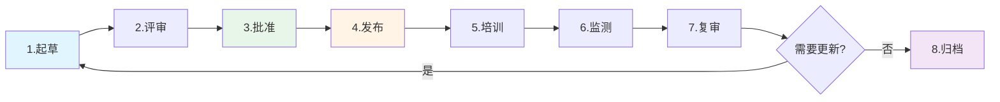

# 2.4 政策与标准体系

> **Policy & Standards Framework: From Vision to Execution**

---

## 本节概览

**学习目标**：
- 掌握四级政策框架设计（策略→政策→标准→指南）
- 建立统一控制库（Control Library）
- 学会政策生命周期管理
- 实现政策自动化分发与签收

**核心价值**：政策是GRC的骨架，控制是血肉。本节提供从顶层原则到可执行指南的完整体系设计方法。

**预计阅读时间**：40-50分钟

---

## 2.4.1 四级政策框架

### 政策金字塔模型

```
        ┌─────────────────┐
        │  Level 1: 策略  │  ← 董事会/CEO批准
        │   (Strategy)    │     3-5年有效期
        └────────┬────────┘     3-5页
                 │
        ┌────────▼────────┐
        │  Level 2: 政策  │  ← CISO/CRO批准
        │   (Policy)      │     2-3年有效期
        └────────┬────────┘     10-20页
                 │
        ┌────────▼────────┐
        │  Level 3: 标准  │  ← 部门负责人批准
        │  (Standard)     │     1-2年有效期
        └────────┬────────┘     20-50页
                 │
        ┌────────▼────────┐
        │  Level 4: 指南  │  ← 技术负责人批准
        │  (Guideline)    │     年度更新
        └─────────────────┘     50-100页
```

### Level 1: 策略（Strategy）

**定义**：组织级别的原则性声明，定义GRC愿景与方向。

**示例：信息安全策略**

```markdown
# 信息安全策略
**版本**：v1.0 | **批准人**：CEO | **生效日期**：2025年1月1日

## 愿景
成为行业领先的安全可信企业，通过卓越的信息安全能力支撑业务全球化增长。

## 核心原则

1. **安全与业务平衡**
   - 安全是业务推动力，而非阻碍
   - 安全投资与业务风险相匹配

2. **全员安全责任**
   - 安全是每个人的责任
   - 业务部门是安全第一责任人

3. **数据驱动决策**
   - 使用量化方法评估风险
   - 基于数据优化资源配置

4. **持续改进**
   - 季度安全回顾
   - 每年外部审计

5. **合规先行**
   - 满足所有适用法规（GDPR/PIPL/SOX）
   - 获取行业认证（ISO 27001/SOC 2）

## 适用范围
全球所有员工、承包商、第三方合作伙伴

## 违规后果
违反本策略将导致纪律处分，包括但不限于警告、降职、解雇、法律追责。

---
批准签字：[CEO姓名] [日期]
```

### Level 2: 政策（Policy）

**定义**：针对特定主题的详细要求，定义"必须做什么"（What）。

**政策类别**：

| 类别 | 政策示例 | 目的 |
|------|---------|------|
| **信息安全** | 访问控制政策、加密政策、网络安全政策 | 保护CIA三性 |
| **隐私** | 隐私政策、数据处理政策、跨境传输政策 | 满足GDPR/PIPL |
| **风险管理** | 风险管理政策、第三方风险政策 | 识别与控制风险 |
| **合规** | 合规管理政策、举报人保护政策 | 满足法规要求 |
| **运营** | 变更管理政策、事件响应政策、备份政策 | 确保业务连续性 |
| **人力资源** | 员工安全责任政策、离职流程政策 | 管理内部威胁 |

**政策模板结构**：

```markdown
# [政策名称]

## 1. 目的（Purpose）
说明为什么需要这个政策

## 2. 适用范围（Scope）
- 适用人员：全体员工/特定角色
- 适用系统：生产环境/所有系统
- 适用地区：全球/特定区域

## 3. 角色与职责（Roles & Responsibilities）
| 角色 | 职责 |
|------|------|
| CISO | 批准政策，监督执行 |
| 业务负责人 | 确保团队遵守 |
| 员工 | 阅读并遵守政策 |

## 4. 政策声明（Policy Statement）
### 4.1 核心要求
- 必须（MUST）：强制要求
- 应当（SHOULD）：推荐要求
- 可以（MAY）：可选要求

### 4.2 具体规定
[详细要求]

## 5. 例外处理（Exceptions）
例外申请流程、审批权限、复评周期

## 6. 合规性（Compliance）
- 监测方式：自动化扫描/审计抽样
- 违规后果：警告/纪律处分
- 申诉流程：联系合规团队

## 7. 相关文档（Related Documents）
- 上级策略：信息安全策略
- 相关政策：访问控制政策、加密标准
- 支撑指南：密码管理指南

## 8. 修订历史（Revision History）
| 版本 | 日期 | 修订人 | 修订内容 |
|------|------|--------|---------|
| v1.0 | 2025-01-01 | 张三 | 初版发布 |

## 9. 批准（Approval）
- 起草人：[姓名] [日期]
- 审核人：法务/DPO [日期]
- 批准人：CISO [日期]
```

### Level 3: 标准（Standard）

**定义**：技术规范，定义"如何做"（How）的强制要求。

**标准示例：密码标准**

```markdown
# 密码与认证标准
**版本**：v2.0 | **批准人**：CISO

## 1. 密码复杂度要求

| 系统类型 | 最小长度 | 复杂度 | 有效期 | 历史限制 |
|---------|---------|--------|--------|---------|
| 生产系统 | 14位 | 大小写+数字+特殊字符 | 90天 | 禁止重复最近24次 |
| 办公系统 | 12位 | 大小写+数字 | 180天 | 禁止重复最近12次 |
| 测试/开发 | 10位 | 大小写+数字 | 365天 | 禁止重复最近6次 |

## 2. 多因素认证（MFA）要求

**强制MFA场景**：
-  所有生产系统访问
-  VPN接入
-  特权账号（root/admin）
-  远程访问
-  客户数据访问

**MFA方法（按优先级）**：
1. 硬件令牌（YubiKey）- 推荐
2. TOTP应用（Google Authenticator/Authy）
3. 推送通知（Okta/Duo）
4. SMS（仅在其他方法不可用时）

## 3. 密码管理工具

**强制使用场景**：
- 所有共享账号
- 所有服务账号
- 个人密码（推荐）

**批准工具**：
- 1Password Business
- LastPass Enterprise
- Bitwarden Enterprise

## 4. 例外情况

**遗留系统例外**：
- 审批人：CISO
- 补偿控制：网络隔离+额外审计
- 复评周期：90天
- 最终期限：2025年12月31日前完成迁移

## 5. 监测与审计

**自动化监测**（每日）：
- 弱密码扫描
- MFA启用率监测
- 密码过期提醒

**审计抽样**（季度）：
- 抽样10%账号验证合规性
- 例外使用情况审查
```

### Level 4: 指南（Guideline）

**定义**：操作手册，提供最佳实践与详细步骤（非强制）。

**指南示例：AWS安全配置指南**

```markdown
# AWS安全配置指南
**版本**：v3.0 | **维护人**：云安全团队

## 1. IAM配置

### 1.1 根账号保护
```
# Step 1: 启用MFA
aws iam enable-mfa-device --user-name root \
  --serial-number arn:aws:iam::123456789012:mfa/root \
  --authentication-code-1 123456 \
  --authentication-code-2 789012

# Step 2: 创建CloudTrail监控根账号登录
aws cloudtrail create-trail --name root-activity \
  --s3-bucket-name my-security-logs
```

### 1.2 用户权限最小化
-  不要使用：AdministratorAccess
-  推荐：基于角色的自定义策略

示例IAM策略（只读S3访问）：
```
{
  "Version": "2012-10-17",
  "Statement": [{
    "Effect": "Allow",
    "Action": ["s3:GetObject", "s3:ListBucket"],
    "Resource": ["arn:aws:s3:::my-bucket/*"]
  }]
}
```

## 2. 数据加密

### 2.1 S3桶加密
```
# 启用默认加密（AES-256）
aws s3api put-bucket-encryption \
  --bucket my-bucket \
  --server-side-encryption-configuration '{
    "Rules": [{
      "ApplyServerSideEncryptionByDefault": {
        "SSEAlgorithm": "AES256"
      }
    }]
  }'
```

### 2.2 RDS加密
- 新实例：创建时勾选"Enable encryption"
- 现有实例：创建加密快照→恢复为新实例→切换
```

---

## 2.4.2 统一控制库（Control Library）

### 控制库的价值

**问题**：
-  不同合规框架有重复控制（ISO 27001、SOC 2、PCI DSS）
-  每次审计重复准备相同证据
-  控制与风险映射关系不清晰

**解决方案**：建立统一控制库，实现"一控多用"。

### 控制库结构

```
控制库（Control Library）
├─ 控制域（Control Domain）14个
│  ├─ 访问控制（Access Control）
│  ├─ 数据保护（Data Protection）
│  ├─ 网络安全（Network Security）
│  └─ ...
│
├─ 控制项（Control）300+个
│  ├─ 控制ID：AC-001
│  ├─ 控制名称：用户访问审批
│  ├─ 控制描述：所有用户访问请求必须经过审批
│  ├─ 控制类型：预防性（Preventive）
│  ├─ 控制频率：每次（Per Event）
│  ├─ 自动化程度：部分自动（Semi-Automated）
│  ├─ 责任人：IAM团队
│  ├─ 证据类型：审批记录、访问日志
│  ├─ 测试方法：抽样20个访问请求
│  └─ 框架映射：
│     ├─ ISO 27001: A.9.2.1
│     ├─ SOC 2: CC6.1
│     ├─ PCI DSS: 7.1
│     └─ NIST CSF: PR.AC-4
│
└─ 控制证据（Evidence）
   ├─ 证据源：Okta审批日志
   ├─ 采集频率：实时
   └─ 保留期限：7年
```

### 控制库示例

| 控制ID | 控制名称 | ISO 27001 | SOC 2 | PCI DSS | GDPR | 自动化 | 责任人 |
|--------|---------|-----------|-------|---------|------|--------|--------|
| **AC-001** | 用户访问审批 | A.9.2.1 | CC6.1 | Req 7.1 | Art.32 | 50% | IAM团队 |
| **AC-002** | 定期访问复审 | A.9.2.5 | CC6.2 | Req 7.2 | Art.32 | 80% | IAM团队 |
| **DP-001** | 数据传输加密 | A.13.1.1 | CC6.7 | Req 4.1 | Art.32 | 100% | 网络团队 |
| **DP-002** | 数据静态加密 | A.10.1.1 | CC6.1 | Req 3.4 | Art.32 | 100% | 存储团队 |
| **BC-001** | 备份与恢复 | A.12.3.1 | A1.2 | Req 9.5 | - | 90% | 运维团队 |
| **IR-001** | 事件响应计划 | A.16.1.1 | CC7.3 | Req 12.10 | Art.33 | 30% | SOC团队 |

### 控制映射矩阵

**三维映射**：

```
      风险（Risk）
         │
         │
    控制（Control） ─────── 法规（Regulation）

示例：
风险：数据泄露
  ↓
控制：DP-001（数据传输加密）
  ↓
法规：GDPR Art.32、ISO 27001 A.13.1.1、PCI DSS Req 4.1
```

---

## 2.4.3 政策生命周期管理

### 政策生命周期（Policy Lifecycle）



### 各阶段详解

#### 1. 起草（Drafting）

**起草清单**：
- [ ] 使用标准模板
- [ ] 明确目的与范围
- [ ] 定义角色与职责
- [ ] 参考行业最佳实践
- [ ] 咨询利益相关方

**协作工具**：
- Google Docs（实时协作）
- Confluence（知识管理）
- GitHub（版本控制，适用技术标准）

#### 2. 评审（Review）

**评审矩阵**：

| 评审类型 | 评审人 | 关注点 | 时限 |
|---------|--------|--------|------|
| **法务评审** | 法务部 | 合规性、法律风险 | 5个工作日 |
| **隐私评审** | DPO | GDPR/PIPL合规 | 3个工作日 |
| **技术评审** | 架构师/技术负责人 | 可行性、成本 | 5个工作日 |
| **业务评审** | 业务VP/BISO | 业务影响、可操作性 | 3个工作日 |

#### 3. 批准（Approval）

**审批权限矩阵**：

| 政策级别 | 审批人 | 审批方式 |
|---------|--------|---------|
| Level 1（策略） | 董事会/CEO | 董事会会议表决 |
| Level 2（政策） | CISO/CRO | 电子签名 |
| Level 3（标准） | 部门负责人 | 工作流审批 |
| Level 4（指南） | 技术负责人 | 邮件确认 |

#### 4. 发布（Publication）

**发布渠道**：
-  政策门户（内网）
-  邮件通知（全员）
-  Slack/Teams通知
-  新员工入职包

**发布模板**：
```
主题：【重要】新版《数据加密政策》发布通知

各位同事，

新版《数据加密政策》（v2.0）已于2025年1月15日正式生效。

主要变更：
1. 强制要求所有生产数据库启用TDE加密
2. 新增云存储加密要求（S3/Blob Storage）
3. 更新密钥管理流程（使用AWS KMS）

请在2周内完成以下操作：
1. 阅读新版政策：[链接]
2. 完成在线培训（30分钟）：[链接]
3. 电子签收确认：[链接]

如有疑问，请联系安全团队：security@company.com

---
信息安全部
2025年1月15日
```

#### 5. 培训（Training）

**培训方式**：

| 方式 | 适用场景 | 优点 | 缺点 |
|------|---------|------|------|
| **在线课程** | 全员政策 | 可追踪、可重复 | 参与度低 |
| **现场培训** | 关键政策、技术标准 | 互动性强 | 成本高 |
| **微课（5分钟）** | 政策更新 | 快速、易消化 | 深度不足 |
| **情景模拟** | 事件响应、隐私政策 | 实战性强 | 准备耗时 |

**培训跟踪**：
```
培训完成率 = 已完成人数 / 应完成人数 × 100%

目标：
- 高风险政策（如隐私、数据保护）：100%
- 一般政策：95%

逾期提醒：
- T+7天：邮件提醒
- T+14天：经理提醒
- T+21天：升级CISO
```

#### 6. 监测（Monitoring）

**监测方法**：

| 政策类型 | 监测方式 | 频率 | 工具 |
|---------|---------|------|------|
| **技术政策** | 自动化扫描 | 实时/每日 | CSPM, SIEM, 自动化脚本 |
| **流程政策** | 证据抽样 | 季度 | GRC平台 |
| **培训政策** | 完成率跟踪 | 月度 | LMS（学习管理系统） |

#### 7. 复审（Review）

**复审触发条件**：
1. 定期复审（政策有效期到期）
2. 法规变更（GDPR更新、新法规生效）
3. 重大事件（数据泄露、审计发现）
4. 业务变更（新产品、新市场）
5. 技术变革（云迁移、AI应用）

**复审检查清单**：
- [ ] 政策内容是否仍然适用？
- [ ] 是否有新的法规要求？
- [ ] 是否有新的技术方案？
- [ ] 控制措施是否有效？
- [ ] 员工是否理解并遵守？

---

## 2.4.4 政策自动化

### 政策门户（Policy Portal）

**核心功能**：

| 功能 | 说明 | 工具 |
|------|------|------|
| **集中存储** | 所有政策统一管理 | SharePoint, Confluence, PolicyTech |
| **版本控制** | 跟踪历史版本 | Git, 内置版本控制 |
| **搜索** | 全文搜索、标签搜索 | Elasticsearch |
| **访问控制** | 基于角色的访问权限 | RBAC |
| **阅读跟踪** | 谁读了哪些政策 | 自研/GRC平台 |
| **签收管理** | 电子签名确认 | DocuSign, Adobe Sign |
| **培训集成** | 链接在线培训课程 | LMS集成 |
| **到期提醒** | 自动提醒政策复审 | 工作流引擎 |

### 自动化政策合规检查

**示例：自动检查密码政策合规性**

```
# 伪代码示例
import okta_api
import slack_api

def check_password_policy_compliance():
    """
    检查所有用户密码是否符合政策要求
    """
    users = okta_api.get_all_users()
    non_compliant = []

    for user in users:
        password_age = user.get_password_age_days()
        mfa_enabled = user.has_mfa()

        # 检查：密码90天内更新
        if password_age > 90:
            non_compliant.append({
                'user': user.email,
                'issue': f'密码{password_age}天未更新（政策要求≤90天）'
            })

        # 检查：生产系统访问必须启用MFA
        if user.has_production_access() and not mfa_enabled:
            non_compliant.append({
                'user': user.email,
                'issue': 'MFA未启用（政策要求强制MFA）'
            })

    # 生成报告
    if non_compliant:
        report = generate_report(non_compliant)
        slack_api.send_message('#security', report)
        send_email_to_users(non_compliant)

    return non_compliant

# 定时任务：每日执行
schedule.every().day.at("09:00").do(check_password_policy_compliance)
```

**自动化价值**：
- ⏱️ 人工检查时间：4小时/周 → 自动化：0小时
-  覆盖率：抽样20% → 全量100%
- 🚨 发现速度：季度 → 实时

---

## 本节总结

### 核心要点回顾

 **四级政策框架**：
- Level 1：策略（Strategy）- 原则性声明
- Level 2：政策（Policy）- "必须做什么"
- Level 3：标准（Standard）- "如何做"的技术规范
- Level 4：指南（Guideline）- 最佳实践

 **统一控制库**：
- 300+控制项
- 映射ISO 27001/SOC 2/PCI DSS/GDPR
- 实现"一控多用"

 **政策生命周期**：
起草 → 评审 → 批准 → 发布 → 培训 → 监测 → 复审 → 归档

 **政策自动化**：
- 政策门户（集中管理）
- 自动化合规检查
- 电子签收与跟踪

### 实践作业

**作业1：设计四级政策框架**
- 为你所在企业设计完整的四级政策框架
- 至少包含：1个策略、3个政策、5个标准、10个指南
- 输出：政策目录树

**作业2：建立控制库**
- 选择3个合规框架（如ISO 27001 + SOC 2 + PCI DSS）
- 识别Top 50控制项
- 建立控制映射矩阵
- 输出：Excel控制库

**作业3：政策自动化方案**
- 选择1个技术政策（如密码政策、加密政策）
- 设计自动化检查脚本（伪代码）
- 计算ROI（人工 vs 自动化）

---

**下一节预告**：

 [2.5 GRC平台与工具](./2.5_grc_platforms_tools.md)

下一节我们将深入探讨：
- GRC平台选型（ServiceNow IRM vs RSA Archer）
- GRC工具全景图
- 平台实施最佳实践
- ROI计算与成本优化

## 📍 导航 | Navigation

**[← 上一节](./2.3_compliance_framework.md)** | **[返回 Part 1](../)** | **[返回总目录](../../)** | **[→ 下一节](./2.5_grc_platforms_tools.md)**

---

**© 2025 AI-ESA Project. Licensed under CC BY-NC-SA 4.0**
