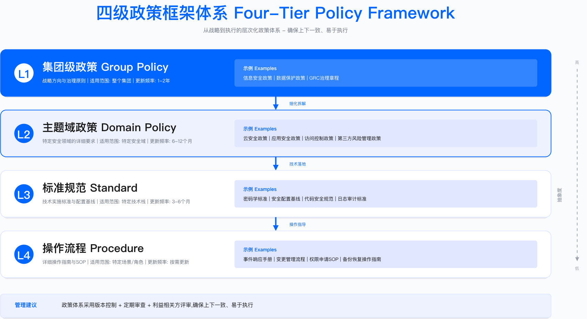
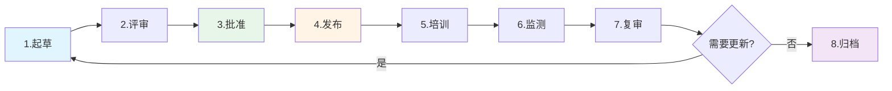

# 2.4 政策与标准体系

政策体系是 GRC 落地的骨架结构。缺乏层次清晰的政策框架，组织将面临多源政策冲突、执行标准不一、审计证据碎片化等问题。本节从四级政策框架设计出发，阐述统一控制库的构建方法、政策生命周期管理机制，以及政策自动化的工程实现路径。

---

## 2.4.1 四级政策框架

### 多源政策冲突的常见表现

政策碎片化是中大型组织的常见问题。以密码管理为例，当安全部、IT 部、人力资源部、业务部门各自发布相关要求时，员工面临的不是"遵守什么"，而是"遵守哪一个"的困境。

| 政策来源 | 密码要求 | 更换周期 | 发布权限 | 冲突点 |
|---------|---------|---------|---------|--------|
| 安全部《密码管理政策》 | 12 位 + 复杂度（大小写 + 数字 + 特殊字符） | 90 天强制更换 | CISO 批准 | 要求最严格 |
| IT 部《系统访问标准》 | 8 位即可 | 180 天更换 | CIO 批准 | 要求最宽松 |
| 人力部《员工手册》 | "定期更换"（无具体要求） | 未明确 | CHRO 批准 | 要求模糊 |
| 业务部《客户数据保护指南》 | "参考行业标准"（无具体要求） | 未明确 | 业务 VP 批准 | 不可执行 |

上表展示的是典型的政策碎片化状态。四个部门对同一事项的要求存在实质性冲突，且均具有各自的发布权限，缺乏统一的优先级规则。

**常见问题分类**：

| 失败类型 | 根本原因 | 员工行为模式 | 安全后果 |
|---------|---------|-------------|---------|
| "向下竞争"行为 | 多个政策冲突，无优先级规则 | 选择最宽松标准执行 | 密码强度不足，易被暴力破解 |
| "选择性遵守" | 不同部门各自发布政策，缺乏协调 | 遵守对自己最方便的政策 | 安全与业务部门要求被绕过 |
| "政策虚无主义" | 政策太多且矛盾，员工放弃遵守 | "反正都做不到，索性都不做" | 全面不合规，审计大量发现 |
| "审批权限混乱" | 多部门都有发布权限，无统一决策机制 | 不知道该听谁的，等待上级明确指示 | 政策落地停滞，风险持续暴露 |

**适用边界**：上述问题主要出现在 200 人以上、具有多个职能部门的组织。小型组织由于决策链条短、政策数量少，通常不会出现严重的多源冲突。

**关键约束**：政策体系重构涉及跨部门权限调整，需要高管层（CEO/COO）明确授权；组织政治阻力往往大于技术难度。

### 四级政策金字塔

解决多源冲突的核心方案是建立层次分明的四级政策框架，明确每一层的批准权限、有效期和优先级规则。

```
        ┌─────────────────┐
        │  Level 1: 策略  │  ← 董事会/CEO 批准
        │   (Strategy)    │     3-5 年有效期
        │  "安全优先"     │     3-5 页（原则性）
        └────────┬────────┘
                 │
        ┌────────▼────────┐
        │  Level 2: 政策  │  ← CISO/CRO 批准
        │   (Policy)      │     2-3 年有效期
        │  "密码必须复杂" │     10-20 页（What）
        └────────┬────────┘
                 │
        ┌────────▼────────┐
        │  Level 3: 标准  │  ← 部门负责人批准
        │  (Standard)     │     1-2 年有效期
        │  "12位+复杂度"  │     20-50 页（How）
        └────────┬────────┘
                 │
        ┌────────▼────────┐
        │  Level 4: 指南  │  ← 技术负责人批准
        │  (Guideline)    │     年度更新
        │  "1Password工具"│     50-100 页（操作手册）
        └─────────────────┘
```



**层级职责划分**：

- **Level 1（策略）**：CEO 定方向，全公司统一原则，回答"为什么要做"
- **Level 2（政策）**：CISO 定要求，明确"必须做什么"，具有强制性
- **Level 3（标准）**：部门定细节，可量化、可审计，回答"做到什么程度"
- **Level 4（指南）**：团队定操作，手把手教怎么做，可选但推荐

**冲突解决原则**：发生冲突时，遵循"上级文件优先"——策略 > 政策 > 标准 > 指南。下级文件不得与上级文件冲突；若存在冲突，以上级文件为准。

**常见误区**：

1. **层级混淆**：将操作指南写成政策文档，导致政策过于具体、更新频繁、难以通过高层审批
2. **跳级发布**：业务部门直接发布"标准"而未对齐上级"政策"，导致标准缺乏法律效力或与公司政策冲突
3. **批准权限下放过度**：所有层级均由 CISO 审批，导致 CISO 成为瓶颈，政策更新周期过长

### Level 1：策略（Strategy）

策略是组织级别的原则性声明，定义 GRC 愿景与方向。策略文档通常由董事会或 CEO 批准，有效期 3-5 年，篇幅控制在 3-5 页。

**策略文档结构示例**：

```markdown
# 信息安全策略
**版本**：v1.0 | **批准人**：CEO | **生效日期**：2025年1月1日

## 愿景
通过信息安全能力支撑业务可持续增长，成为客户信赖的合作伙伴。

## 核心原则

1. **安全与业务平衡**
   - 安全是业务推动力，而非阻碍
   - 安全投资与业务风险相匹配

2. **全员安全责任**
   - 安全是每个人的责任
   - 业务部门是安全第一责任人

3. **数据驱动决策**
   - 使用量化方法评估风险
   - 基于数据优化资源配置

4. **持续改进**
   - 定期安全回顾
   - 定期外部审计

5. **合规先行**
   - 满足所有适用法规（如 GDPR/PIPL/SOX）
   - 获取必要的行业认证（如 ISO 27001/SOC 2）

## 适用范围
全球所有员工、承包商、第三方合作伙伴

## 违规后果
违反本策略将导致纪律处分，包括但不限于警告、降职、解雇、法律追责。

---
批准签字：[CEO 姓名] [日期]
```

**验证方法**：策略有效性可通过以下方式检验——（1）员工访谈抽样，验证是否知晓核心原则；（2）检查下级政策是否与策略原则对齐；（3）审计发现是否存在与策略冲突的操作行为。

### Level 2：政策（Policy）

政策是针对特定主题的详细要求，定义"必须做什么"（What），由 CISO/CRO 批准，有效期 2-3 年。

**政策类别示例**：

| 类别 | 政策示例 | 目的 |
|------|---------|------|
| 信息安全 | 访问控制政策、加密政策、网络安全政策 | 保护机密性、完整性、可用性 |
| 隐私 | 隐私政策、数据处理政策、跨境传输政策 | 满足 GDPR/PIPL |
| 风险管理 | 风险管理政策、第三方风险政策 | 识别与控制风险 |
| 合规 | 合规管理政策、举报人保护政策 | 满足法规要求 |
| 运营 | 变更管理政策、事件响应政策、备份政策 | 确保业务连续性 |
| 人力资源 | 员工安全责任政策、离职流程政策 | 管理内部威胁 |

**政策模板结构**：

```markdown
# [政策名称]

## 1. 目的（Purpose）
说明为什么需要这个政策

## 2. 适用范围（Scope）
- 适用人员：全体员工/特定角色
- 适用系统：生产环境/所有系统
- 适用地区：全球/特定区域

## 3. 角色与职责（Roles & Responsibilities）
| 角色 | 职责 |
|------|------|
| CISO | 批准政策，监督执行 |
| 业务负责人 | 确保团队遵守 |
| 员工 | 阅读并遵守政策 |

## 4. 政策声明（Policy Statement）
### 4.1 核心要求
- 必须（MUST）：强制要求
- 应当（SHOULD）：推荐要求
- 可以（MAY）：可选要求

### 4.2 具体规定
[详细要求]

## 5. 例外处理（Exceptions）
例外申请流程、审批权限、复评周期

## 6. 合规性（Compliance）
- 监测方式：自动化扫描/审计抽样
- 违规后果：警告/纪律处分
- 申诉流程：联系合规团队

## 7. 相关文档（Related Documents）
- 上级策略：信息安全策略
- 相关政策：访问控制政策、加密标准
- 支撑指南：密码管理指南

## 8. 修订历史（Revision History）
| 版本 | 日期 | 修订人 | 修订内容 |
|------|------|--------|---------|
| v1.0 | 2025-01-01 | 张三 | 初版发布 |

## 9. 批准（Approval）
- 起草人：[姓名] [日期]
- 审核人：法务/DPO [日期]
- 批准人：CISO [日期]
```

### Level 3：标准（Standard）

标准是技术规范，定义"如何做"（How）的强制要求，由部门负责人批准，有效期 1-2 年。标准必须可量化、可审计。

**密码标准示例**：

```markdown
# 密码与认证标准
**版本**：v2.0 | **批准人**：CISO

## 1. 密码复杂度要求

| 系统类型 | 最小长度 | 复杂度 | 有效期 | 历史限制 |
|---------|---------|--------|--------|---------|
| 生产系统 | 14 位 | 大小写 + 数字 + 特殊字符 | 90 天 | 禁止重复最近 24 次 |
| 办公系统 | 12 位 | 大小写 + 数字 | 180 天 | 禁止重复最近 12 次 |
| 测试/开发 | 10 位 | 大小写 + 数字 | 365 天 | 禁止重复最近 6 次 |

## 2. 多因素认证（MFA）要求

**强制 MFA 场景**：
- 所有生产系统访问
- VPN 接入
- 特权账号（root/admin）
- 远程访问
- 客户数据访问

**MFA 方法（按优先级）**：
1. 硬件令牌（YubiKey）——推荐
2. TOTP 应用（Google Authenticator/Authy）
3. 推送通知（Okta/Duo）
4. SMS（仅在其他方法不可用时）

## 3. 例外情况

**遗留系统例外**：
- 审批人：CISO
- 补偿控制：网络隔离 + 额外审计
- 复评周期：90 天
- 最终期限：需明确迁移计划

## 4. 监测与审计

**自动化监测**（每日）：
- 弱密码扫描
- MFA 启用率监测
- 密码过期提醒

**审计抽样**（季度）：
- 抽样账号验证合规性
- 例外使用情况审查
```

**运行指标**：密码标准执行后应持续监测以下指标——密码合规率（目标阈值由组织自定）、MFA 覆盖率、密码重置请求量趋势、例外申请数量及处理时效。

### Level 4：指南（Guideline）

指南是操作手册，提供最佳实践与详细步骤，属于推荐性文档而非强制要求。指南的核心价值在于将抽象标准转化为可执行的操作步骤。

**抽象标准导致的执行问题**：

当标准仅写"应遵循最小权限原则"而不提供具体操作步骤时，执行团队面临的是"知道要做什么，但不知道怎么做"的困境。

| 审计发现类别 | 典型缺陷 | 失败根源 |
|------------|---------|---------|
| 身份管理缺陷 | 根账号无 MFA，大量用户拥有过高权限 | 标准只写"应遵循最小权限原则"，无具体操作步骤 |
| 数据保护缺陷 | 生产环境存储未启用加密 | 标准只写"应启用数据加密"，无技术实现指南 |
| 日志监控缺陷 | CloudTrail/VPC Flow Logs 未启用 | 标准只写"应保留审计日志"，无配置模板 |
| 网络隔离缺陷 | Security Group 开放 0.0.0.0/0 | 标准只写"应限制网络访问"，无分级规则 |

**从抽象标准到可执行指南的改进方向**：

| 设计要素 | Level 3 标准（不足） | Level 4 指南（改进） |
|---------|---------------------|---------------------|
| 可执行性 | "应遵循最小权限原则" | 详细操作步骤 + 控制台截图 + CLI 命令 + IaC 模板 |
| 分级管理 | 所有要求一刀切 | 强制基线 + 推荐实践 + 可选增强 |
| 自动化集成 | 人工检查清单 | 安全配置封装为可复用模块 |
| 持续更新 | 年度更新 | 季度复审，及时纳入新攻击手法 |

**指南分级体系**：

| 级别 | 典型要求 | 执行目标 | 技术实现 |
|-----|---------|---------|---------|
| 强制基线（Baseline） | 根账号 MFA、生产环境数据加密、网络隔离 | 全部执行，自动化阻断不合规部署 | Terraform 验证钩子 |
| 推荐最佳实践（Best Practice） | CloudTrail 日志保留、资源标签规范、备份策略 | 高比例执行，纳入合规评分 | Terraform Module 默认配置 |
| 可选增强（Enhancement） | GuardDuty 威胁检测、Config 自动修复 | 按业务风险和预算选择 | 独立 Module，按需启用 |

**关键实施要点**：

- 指南必须是"操作手册"，而非"建议文档"
- 必须包含清晰的步骤、示例代码、验证方法
- 与 IaC 工具深度集成，降低人工成本
- 分级管理（强制/推荐/可选），避免一刀切影响灵活性

云安全配置的具体实现可参见 Part 02 Chapter 05.9 多云治理。

---

## 2.4.2 统一控制库（Control Library）

### 控制库的价值定位

在多框架合规场景下（ISO 27001、SOC 2、PCI DSS 等），组织通常面临以下问题：

- 不同合规框架存在重复控制要求
- 每次审计重复准备相同证据
- 控制与风险的映射关系不清晰

统一控制库的核心价值是实现"一控多用"——将分散在各框架中的控制要求抽象为统一的控制项，建立控制与多框架的映射关系，避免重复建设。

**适用边界**：控制库适用于需要同时满足两个及以上合规框架的组织。单一框架场景下，控制库的投入产出比较低。

**关键约束**：控制库的建设与维护需要专职人员；映射关系需持续更新以跟踪框架版本变化。

### 控制库结构

```
控制库（Control Library）
├─ 控制域（Control Domain）
│  ├─ 访问控制（Access Control）
│  ├─ 数据保护（Data Protection）
│  ├─ 网络安全（Network Security）
│  └─ ...
│
├─ 控制项（Control）
│  ├─ 控制 ID：AC-001
│  ├─ 控制名称：用户访问审批
│  ├─ 控制描述：所有用户访问请求必须经过审批
│  ├─ 控制类型：预防性（Preventive）
│  ├─ 控制频率：每次（Per Event）
│  ├─ 自动化程度：部分自动（Semi-Automated）
│  ├─ 责任人：IAM 团队
│  ├─ 证据类型：审批记录、访问日志
│  ├─ 测试方法：抽样访问请求
│  └─ 框架映射：
│     ├─ ISO 27001: A.9.2.1
│     ├─ SOC 2: CC6.1
│     ├─ PCI DSS: 7.1
│     └─ NIST CSF: PR.AC-4
│
└─ 控制证据（Evidence）
   ├─ 证据源：Okta 审批日志
   ├─ 采集频率：实时
   └─ 保留期限：按法规要求
```

### 控制映射矩阵

下表展示了典型控制项与多框架的映射关系。选择这些控制项的依据是：覆盖访问控制、数据保护、业务连续性、事件响应等核心域，且在主流框架中均有对应要求。

| 控制 ID | 控制名称 | ISO 27001 | SOC 2 | PCI DSS | GDPR | 责任人 |
|--------|---------|-----------|-------|---------|------|--------|
| AC-001 | 用户访问审批 | A.9.2.1 | CC6.1 | Req 7.1 | Art.32 | IAM 团队 |
| AC-002 | 定期访问复审 | A.9.2.5 | CC6.2 | Req 7.2 | Art.32 | IAM 团队 |
| DP-001 | 数据传输加密 | A.13.1.1 | CC6.7 | Req 4.1 | Art.32 | 网络团队 |
| DP-002 | 数据静态加密 | A.10.1.1 | CC6.1 | Req 3.4 | Art.32 | 存储团队 |
| BC-001 | 备份与恢复 | A.12.3.1 | A1.2 | Req 9.5 | - | 运维团队 |
| IR-001 | 事件响应计划 | A.16.1.1 | CC7.3 | Req 12.10 | Art.33 | SOC 团队 |

表格结论：从映射关系可见，核心安全控制在多个框架中存在高度重叠。通过统一控制库，组织可减少重复的控制设计与证据采集工作。权衡点在于控制库的抽象层级——过于抽象则失去操作指导性，过于具体则丧失复用价值。

**三维映射关系**：

```
      风险（Risk）
         │
         │
    控制（Control） ─────── 法规（Regulation）

示例：
风险：数据泄露
  ↓
控制：DP-001（数据传输加密）
  ↓
法规：GDPR Art.32、ISO 27001 A.13.1.1、PCI DSS Req 4.1
```

**验证方法**：控制库有效性可通过以下方式检验——（1）审计准备时间是否缩短；（2）控制缺口是否能被快速识别；（3）新框架引入时映射工作量是否降低。

---

## 2.4.3 政策生命周期管理

### 政策生命周期（Policy Lifecycle）

政策并非一次性产出物，而是需要持续管理的资产。完整的政策生命周期包含八个阶段：



### 各阶段操作要点

#### 1. 起草（Drafting）

**起草检查清单**：
- 使用标准模板
- 明确目的与范围
- 定义角色与职责
- 咨询利益相关方

**协作工具选择**：Google Docs（实时协作）、Confluence（知识管理）、GitHub（版本控制，适用技术标准）。

#### 2. 评审（Review）

评审矩阵应根据政策类型确定必要的评审方：

| 评审类型 | 评审人 | 关注点 | 时限（参考） |
|---------|--------|--------|-------------|
| 法务评审 | 法务部 | 合规性、法律风险 | 5 个工作日 |
| 隐私评审 | DPO | GDPR/PIPL 合规 | 3 个工作日 |
| 技术评审 | 架构师/技术负责人 | 可行性、成本 | 5 个工作日 |
| 业务评审 | 业务 VP/BISO | 业务影响、可操作性 | 3 个工作日 |

#### 3. 批准（Approval）

审批权限应与政策层级对应：

| 政策级别 | 审批人 | 审批方式 |
|---------|--------|---------|
| Level 1（策略） | 董事会/CEO | 董事会会议表决 |
| Level 2（政策） | CISO/CRO | 电子签名 |
| Level 3（标准） | 部门负责人 | 工作流审批 |
| Level 4（指南） | 技术负责人 | 邮件确认 |

#### 4. 发布（Publication）

发布渠道应确保覆盖所有适用人员：政策门户（内网）、邮件通知、即时通讯工具推送、新员工入职材料。

**发布通知模板**：

```
主题：【重要】新版《数据加密政策》发布通知

各位同事，

新版《数据加密政策》（v2.0）已于 2025 年 1 月 15 日正式生效。

主要变更：
1. 强制要求所有生产数据库启用 TDE 加密
2. 新增云存储加密要求（S3/Blob Storage）
3. 更新密钥管理流程

请在指定期限内完成以下操作：
1. 阅读新版政策：[链接]
2. 完成在线培训：[链接]
3. 电子签收确认：[链接]

如有疑问，请联系安全团队：security@company.com

---
信息安全部
2025 年 1 月 15 日
```

#### 5. 培训（Training）

| 方式 | 适用场景 | 优点 | 缺点 |
|------|---------|------|------|
| 在线课程 | 全员政策 | 可追踪、可重复 | 参与度低 |
| 现场培训 | 关键政策、技术标准 | 互动性强 | 成本高 |
| 微课 | 政策更新 | 快速、易消化 | 深度不足 |
| 情景模拟 | 事件响应、隐私政策 | 实战性强 | 准备耗时 |

**培训跟踪指标**：培训完成率 = 已完成人数 / 应完成人数。逾期提醒机制应分级设置（如 T+7 天邮件提醒、T+14 天经理提醒、T+21 天升级处理）。

#### 6. 监测（Monitoring）

| 政策类型 | 监测方式 | 频率 | 工具 |
|---------|---------|------|------|
| 技术政策 | 自动化扫描 | 实时/每日 | CSPM, SIEM, 自动化脚本 |
| 流程政策 | 证据抽样 | 季度 | GRC 平台 |
| 培训政策 | 完成率跟踪 | 月度 | LMS（学习管理系统） |

#### 7. 复审（Review）

**复审触发条件**：

1. 定期复审（政策有效期到期）
2. 法规变更（GDPR 更新、新法规生效）
3. 重大事件（数据泄露、审计发现）
4. 业务变更（新产品、新市场）
5. 技术变革（云迁移、AI 应用）

**复审检查清单**：
- 政策内容是否仍然适用？
- 是否有新的法规要求？
- 是否有新的技术方案？
- 控制措施是否有效？
- 员工是否理解并遵守？

### 政策生命周期常见问题

以技术政策（如数据库加密 TDE）落地为例，缺乏完整生命周期管理的政策往往会经历以下问题：

| 阶段 | 常见问题 | 根本原因 | 改进方向 |
|-----|---------|---------|---------|
| 起草 | 未征求技术团队意见，实施周期脱离实际 | 政策被视为"安全部门拍脑袋" | 跨职能工作坊，从"告知"到"共创" |
| 评审 | 跳过技术/业务评审，直接发布 | 评审流于形式 | 强制评审节点，明确否决权 |
| 批准 | CISO 单方面签署，技术团队不认同 | 缺乏跨部门背书 | CTO+CISO 联合签署 |
| 发布 | 群发邮件，无配套指南 | 从"要求"缺失"指导" | 政策 + 指南 + 培训组合发布 |
| 培训 | 无培训，"发布即完成" | 员工不知道怎么做 | 配套培训，覆盖技能缺口 |
| 监测 | 无监测，"放羊" | 无反馈机制 | 自动化监测 + 进度看板 |

**常见误区**：

1. **"发布即完成"心态**：认为政策发布后执行是业务部门的事，缺乏后续跟踪
2. **培训投资不足**：政策复杂但培训简陋，员工缺乏执行能力
3. **监测缺失**：无法度量执行率，无法识别执行障碍

**验证方法**：政策生命周期管理有效性可通过以下指标检验——政策执行率、培训完成率、审计发现数量趋势、政策更新周期是否符合预期。

---

## 2.4.4 政策自动化

### 政策门户（Policy Portal）

政策门户是政策集中管理的技术平台，核心功能包括：

| 功能 | 说明 | 实现工具 |
|------|------|---------|
| 集中存储 | 所有政策统一管理 | SharePoint, Confluence, PolicyTech |
| 版本控制 | 跟踪历史版本 | Git, 内置版本控制 |
| 搜索 | 全文搜索、标签搜索 | Elasticsearch |
| 访问控制 | 基于角色的访问权限 | RBAC |
| 阅读跟踪 | 记录谁读了哪些政策 | 自研/GRC 平台 |
| 签收管理 | 电子签名确认 | DocuSign, Adobe Sign |
| 培训集成 | 链接在线培训课程 | LMS 集成 |
| 到期提醒 | 自动提醒政策复审 | 工作流引擎 |

### 自动化政策合规检查

**人工检查模式的局限性**：

| 局限维度 | 典型表现 | 根本原因 |
|---------|---------|---------|
| 检查覆盖率低 | 季度人工抽查覆盖率有限 | 人力成本限制，无法全量检查 |
| 发现严重滞后 | 违规行为在季度检查时才被发现 | 检查周期长，中间窗口期无监控 |
| 无强制执行机制 | 发现违规仅发邮件提醒，响应率低 | 缺乏自动化执行能力 |
| 数据分散难聚合 | 密码状态、MFA、权限分布在不同系统 | 系统割裂，人工关联成本高 |

**适用边界**：自动化检查适用于可量化、可代码化的技术政策（如密码策略、MFA 策略、加密策略）。流程性政策（如审批流程）的自动化程度取决于流程是否已在系统中固化。

**关键约束**：自动化检查需要与身份系统、配置管理系统的 API 集成；初期开发投入较高，适合控制项数量多、检查频率高的场景。

### Policy-as-Code 架构

将政策翻译为可执行的代码规则，是实现自动化检查的核心方法。

**四层架构模型**：

#### 第 1 层：数据采集层

| 数据源 | 采集频率 | 关键字段 | 集成方式 |
|-------|---------|---------|---------|
| 身份系统（Okta/AD） | 每日全量 | 用户 ID、密码更新时间、MFA 状态、账号状态 | API 集成 |
| VPN/跳板机 | 实时/每小时 | 用户 ID、访问目标、访问时间、源 IP | 日志采集 |
| SIEM | 实时 | 异常登录事件、多次失败尝试 | API 集成 |

#### 第 2 层：规则引擎层

**政策翻译为代码规则示例**：

```python
# 示例：密码政策规则
def check_password_compliance(user):
    password_age = (today - user.password_last_changed).days
    if password_age > 90:
        return {"compliant": False, "level": "L3", "action": "freeze_account"}
    elif password_age > 60:
        return {"compliant": False, "level": "L2", "action": "warn_manager"}
    elif password_age > 30:
        return {"compliant": False, "level": "L1", "action": "email_reminder"}
    return {"compliant": True}

# 示例：MFA 政策规则
def check_mfa_compliance(user):
    if user.has_production_access and not user.mfa_enabled:
        return {"compliant": False, "level": "L3", "action": "freeze_prod_access"}
    return {"compliant": True}
```

**规则版本控制**：规则存储在 Git 仓库，每次政策更新通过 PR 审批后自动生效；规则变更应触发自动测试，验证逻辑正确性。

#### 第 3 层：自动化执行层

**分级响应机制**：

| 违规级别 | 触发条件 | 自动化动作 | 恢复条件 |
|---------|---------|-----------|---------|
| L1（提醒） | 密码超期 30-60 天 | 发邮件提醒用户 | 用户自行更新密码 |
| L2（警告） | 密码超期 60-90 天 | 邮件 + 抄送经理 + 告警通知 | 用户更新密码或经理审批豁免 |
| L3（强制） | 密码超期 >90 天 | 自动冻结账号 | 重置密码后自动解冻 |
| L3（强制） | 生产环境无 MFA | 立即冻结生产权限 | 启用 MFA 后恢复权限 |

**常见误区**：

1. **直接强制而无缓冲**：跳过 L1/L2 直接冻结账号，影响业务连续性
2. **仅生成报告无执行**：自动化检查发现违规但依赖人工跟进，执行率低
3. **规则硬编码**：政策阈值写死在代码中，更新时需要开发介入

#### 第 4 层：可视化与闭环层

| 报告类型 | 受众 | 频率 | 关键指标 |
|---------|-----|------|---------|
| 日报 | 安全团队 | 每日 | 新增违规数、修复数、当前违规总数 |
| 月度仪表盘 | CISO/CRO | 每月 | 合规率、覆盖率、平均修复时间 |
| 季度高管报告 | CEO/董事会 | 每季度 | 合规趋势、重大违规事件、改进措施 |

**运行指标**：政策自动化上线后应持续监测——检查覆盖率、违规发现到修复的平均时间、自动化执行成功率、误报率（合规用户被误判为违规）。

**验证方法**：自动化检查有效性可通过以下方式检验——（1）对比人工检查与自动化检查的发现差异；（2）验证 L3 动作是否按预期触发；（3）检查审计准备时间是否缩短。

政策自动化工具的具体实现可参见 Part 02 Chapter 04.6 技术选型与决策。

---

## 本节小结

政策与标准体系是 GRC 落地的结构性基础。四级政策框架（策略→政策→标准→指南）解决了多源政策冲突问题；统一控制库实现了"一控多用"，降低多框架合规的重复投入；政策生命周期管理确保政策持续有效而非"发布即遗忘"；政策自动化则将人工检查升级为持续、全量、实时的合规监测。

政策体系建设的核心权衡在于：过于宽松则无法约束行为，过于严格则影响业务效率。CSO 需要在合规要求、业务需求、执行能力之间寻找平衡点，并通过持续的监测与反馈不断优化。

---

## 导航

**[← 上一节：2.3 合规管理框架](./2.3_compliance_framework.md)** | **[返回章节目录](./README.md)** | **[下一节：2.5 GRC 平台与工具 →](./2.5_grc_platforms_tools.md)**

---

**© 2025 AI-ESA Project. Licensed under CC BY-NC-SA 4.0**

