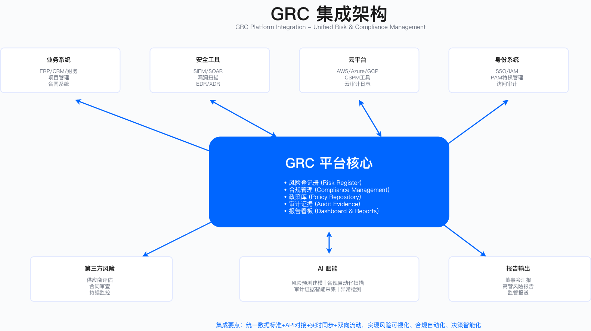

# 2.5 GRC平台与工具

GRC平台的选型与实施是企业规模化治理能力的技术支撑。本节从选型决策、工具分类、实施路径与集成架构四个层面，阐述如何将GRC管理从依赖人工的分散状态，转变为平台化、可追溯、可审计的运营模式。

---

## 2.5.1 GRC平台选型

### 选型失败的常见模式

GRC平台选型失败往往不是因为产品能力不足，而是因为选型决策忽视了企业自身的匹配度。以下是实践中常见的失败路径：

**阶段一：选型决策脱离实际**。企业仅依据行业分析报告的品牌排名做决策，未评估自身规模、成熟度与技术栈的匹配程度。大型GRC平台通常为超大规模企业设计，中型企业（如1500-2500人规模）使用时往往面临功能过剩、配置复杂的困境。

**阶段二：成本估算严重不足**。采购时仅考虑许可费用，未将实施费、定制开发费、年度维护费及内部人力成本纳入总拥有成本（TCO）计算。实际TCO往往远超初始预算。

**阶段三：跳过概念验证（POC）**。仅通过厂商演示环境做决策，未让实际使用团队进行2-4周的试用验证。演示环境与真实工作流之间存在显著差距，用户体验问题在正式上线后才暴露。

**阶段四：定制需求失控**。厂商承诺"开箱即用"，但企业特定的工作流、字段、报表需求需要大量定制开发。每项定制都产生额外费用，总定制成本可能接近甚至超过原始合同金额。

**阶段五：支持服务不足**。中型企业在厂商客户优先级排序中处于劣势，实施顾问支持时间有限，问题响应慢，团队逐渐放弃平台，回归电子表格与工单系统。

**适用边界**：上述失败模式主要发生在中型企业（500-3000人规模）选择为超大型企业设计的重型平台时。小型企业选择轻量级SaaS工具、超大型企业选择与其ERP深度集成的套件时，失败模式有所不同。

**常见误区**：
- 认为"行业领导者"等同于"适合本企业"——品牌领先与企业匹配度是两个独立维度
- 认为POC可以省略以节省时间——POC投入的2-4周可以避免后续12个月以上的返工

### 基于成熟度的选型框架

选型决策应围绕企业规模、GRC成熟度、预算与技术栈四个维度展开，而非单一依赖品牌排名。

| 企业规模 | GRC成熟度 | 推荐工具类别 | 核心考量 |
|---------|---------|------------|---------|
| 500人以下 | Level 1-2 | 合规自动化SaaS | 开箱即用能力、快速上线周期、低定制需求 |
| 500-2000人 | Level 2-3 | 企业级GRC平台（易用性优先） | 与现有IT系统集成、用户体验、可扩展性 |
| 2000-5000人 | Level 3-4 | 专业GRC平台（功能全面） | 高度可定制、需专职GRC工程师团队支持 |
| 5000人以上 | Level 4 | 企业级GRC套件 | 与ERP深度集成、全球多语言支持、复杂审批流 |

**关键约束**：
- **成本约束**：TCO需覆盖许可费、实施费、定制费、年维护费及内部人力成本，三年TCO是比较基准
- **组织能力约束**：重型平台需要专职GRC工程师团队（通常3-5人），轻量级SaaS可由现有合规团队兼顾
- **集成约束**：需评估与现有ITSM、身份管理、云平台的集成难度与API成熟度

**验证方法**：
- POC阶段测试3-5个核心工作流（如风险评估流程、合规证据采集、审计发现跟踪）
- 邀请跨职能用户（安全、合规、审计、IT）参与试用并收集结构化反馈
- 要求厂商提供同规模企业的参考客户并进行实地调研

**运行指标**：
- 平台使用率（日活跃用户/授权用户），触发阈值待企业自定义（如低于某比例需启动调查）
- 证据自动采集覆盖率（自动采集项/总证据项）
- 用户满意度评分（如季度NPS调研）

### 主流GRC平台特征对比

以下对比基于平台公开文档与行业实践经验，具体价格与周期因企业规模、定制需求、实施范围而有较大差异，需以厂商正式报价与项目评估为准。

| 维度 | ServiceNow IRM | RSA Archer | MetricStream | OneTrust |
|------|---------------|------------|--------------|----------|
| 核心定位 | 企业级IT运营+GRC | 专业GRC平台 | 企业级GRC | 隐私+GRC |
| 差异化优势 | 与ITSM/SecOps原生集成 | GRC功能模块最全面 | 高度可定制 | 隐私合规能力领先 |
| 主要局限 | GRC功能相对较新 | 用户界面老旧 | 实施周期长 | 非隐私GRC功能较弱 |
| 适用规模 | 500人以上 | 1000人以上 | 2000人以上 | 200人以上 |

**选型评估维度建议**（权重需根据企业优先级调整）：
- 功能完整性：是否覆盖风险、合规、审计、第三方管理等核心模块
- 易用性：用户界面是否符合团队使用习惯，学习曲线是否可接受
- 集成能力：与现有技术栈（ITSM、IAM、云平台、协作工具）的集成成熟度
- TCO：三年总拥有成本，含所有显性与隐性费用
- 厂商支持：实施顾问质量、SLA承诺、同规模客户支持案例

---

## 2.5.2 GRC工具分类

GRC工具生态按功能定位可分为四个层次，各层工具相互独立但需要数据流通。

**治理层工具**：
- 政策管理：如PolicyTech、MetricStream政策模块——用于政策文档的版本管理、审批工作流、阅读确认追踪
- GRC平台：如ServiceNow IRM、RSA Archer——提供风险、合规、审计的统一管理界面
- 董事会门户：如Diligent、Nasdaq Boardvantage——面向董事会成员的安全信息呈现与文档共享

**风险管理层工具**：
- 风险量化：如RiskLens（基于FAIR方法论）——将风险转化为货币化损失期望值
- 第三方风险：如Prevalent、ProcessUnity——供应商安全评估、问卷发放与响应追踪
- 外部风险评分：如BitSight、SecurityScorecard——基于公开数据的外部安全态势评分

**合规层工具**：
- 合规自动化：如Vanta、Drata、Secureframe——自动采集证据、映射控制框架、简化审计准备
- 隐私管理：如OneTrust、TrustArc、BigID——GDPR/PIPL合规、数据主体权利请求处理、同意管理
- 数据发现：如BigID、Varonis、Microsoft Purview——个人数据与敏感数据的自动发现与分类

**运营层工具**：
- 漏洞管理：如Qualys、Tenable、Rapid7——漏洞扫描、优先级排序、修复跟踪
- SIEM：如Splunk、Elastic、Microsoft Sentinel——安全日志聚合与关联分析
- CSPM：如Wiz、Orca、Prisma Cloud——云配置安全态势持续监控

**工具选择约束**：
- 避免工具孤岛：单点工具需评估与核心GRC平台的数据对接能力
- 避免功能重叠：同一功能不宜由多个工具重复覆盖，造成数据不一致与维护负担
- 考虑数据主权：SaaS工具需确认数据存储位置是否符合合规要求

### 典型工具深度说明

**ServiceNow IRM**

ServiceNow IRM的核心价值在于与ServiceNow ITSM、ITOM、SecOps的原生集成，使GRC数据能够与IT运营数据打通。其主要模块包括：
- Risk Management：风险识别、评估、处置、监控的全生命周期管理
- Policy & Compliance：政策管理、合规项目管理、差距分析
- Vendor Risk：第三方风险管理（TPRM），支持供应商尽调与持续监控
- Audit Management：审计计划、执行、发现管理
- Business Continuity：业务连续性与灾难恢复管理

适用场景：已部署ServiceNow作为IT服务管理平台的企业，希望在统一平台上扩展GRC能力。
局限：对于未使用ServiceNow生态的企业，集成价值有限；GRC模块相对其核心ITSM产品成熟度稍逊。

**Vanta/Drata类合规自动化工具**

此类工具的核心能力是自动化证据采集与合规框架映射，适用于首次进行SOC 2、ISO 27001等认证的中小型企业。典型能力包括：
- 连接云平台（AWS/GCP/Azure）、身份系统（Okta）、代码仓库（GitHub）等，自动拉取配置与日志作为合规证据
- 内置SOC 2、ISO 27001、HIPAA等框架的控制映射，自动生成合规状态仪表盘
- 提供审计师协作界面，简化审计沟通

适用场景：500人以下的SaaS/科技公司，首次认证场景，云原生技术栈。
局限：对复杂组织结构、多法人实体、定制化控制框架的支持有限；不适用于需要深度风险量化与高管报告的成熟GRC场景。

**OneTrust**

OneTrust在隐私合规领域功能最为完整，核心模块包括：
- Privacy Management：GDPR/PIPL/CCPA合规管理
- Data Discovery：自动发现个人信息数据
- Consent Management：用户同意管理与偏好中心
- DSR Automation：数据主体权利请求（访问、删除、更正）的自动化处理
- Cookie Compliance：网站Cookie合规管理

适用场景：隐私合规为首要优先级的企业（电商、营销科技、跨国企业）。
局限：非隐私领域的GRC功能（如IT风险管理、安全运营整合）相对较弱。

---

## 2.5.3 平台实施路径

GRC平台实施通常分为五个阶段，每个阶段有明确的交付物与决策门禁。

**阶段一：规划（4-6周）**
- 需求分析：明确GRC平台需要解决的核心问题与优先级
- 范围界定：确定首期实施的模块与流程（建议从1-2个核心模块起步）
- 选型决策：完成POC与厂商评估
- 项目启动：组建项目团队，明确角色与职责

**阶段二：设计（6-8周）**
- 流程设计：将现有GRC流程映射到平台功能，识别需定制的环节
- 数据模型：定义风险分类、控制分类、资产分类等核心数据结构
- 集成设计：规划与IAM、ITSM、云平台等系统的数据对接方式
- 测试计划：制定用户验收测试（UAT）的场景与验收标准

**阶段三：开发与配置（8-12周）**
- 平台配置：按设计完成平台功能配置
- 集成开发：完成API对接与数据同步
- 数据迁移：将历史数据（如风险登记册、政策文档）迁移至平台
- 测试执行：完成功能测试与UAT

**阶段四：上线（2-4周）**
- 用户培训：全员基础培训与管理员深度培训
- 试点上线：选择1-2个业务单元或流程先行上线
- 全面推广：基于试点反馈调整后推广至全组织
- 支持机制：建立问题反馈与快速响应渠道

**阶段五：持续优化**
- 用户反馈收集与分析
- 功能迭代与自动化扩展
- 定期评估平台价值与ROI

### 实施成功要素

| 要素 | 关键实践 | 失败模式 |
|------|---------|---------|
| 高层支持 | CISO/CRO担任项目Sponsor，定期主持项目评审 | 项目由中层推动，缺乏资源协调权，跨部门配合受阻 |
| 专职团队 | 项目经理全职投入，配备2-3名专职工程师 | 兼职模式，项目优先级低于日常工作 |
| 敏捷交付 | 2周Sprint迭代，快速交付可用功能 | 瀑布式长周期交付，需求冻结，上线时已与业务脱节 |
| 用户参与 | 招募跨职能种子用户，每周收集反馈 | 闭门开发，上线后用户抵触 |
| 数据质量 | 迁移前进行数据清洗，去除重复与过时数据 | 直接迁移脏数据，导致平台数据不可信 |
| 培训体系 | 分层培训（全员基础培训+管理员深度培训） | 培训走形式，用户不会用或用错 |

**验证方法**：
- 每个Sprint结束时进行演示评审（Demo Review），确认交付物符合预期
- UAT阶段由实际业务用户执行测试用例，记录通过率与缺陷
- 上线后2-4周进行用户满意度调研

**运行指标**：
- 项目进度偏差（实际vs计划）
- Sprint交付完成率
- UAT缺陷密度
- 上线后用户满意度评分

---

## 2.5.4 平台集成架构

GRC平台的价值很大程度上取决于其与周边系统的集成深度。孤立运行的GRC平台需要大量人工录入，难以保证数据时效性与准确性。

### 典型集成架构

以ServiceNow IRM为例，典型集成架构包括以下数据流：

**身份管理系统（IAM）集成**：
- 从Okta/Azure AD拉取用户身份数据、MFA启用状态、访问权限
- 自动生成IAM相关合规证据（如"所有特权账号启用MFA"的证明）
- 检测离职用户账号是否及时删除

**云基础设施集成**：
- 从AWS/GCP/Azure拉取云配置数据
- 自动检测不合规配置（如公开的S3存储桶、过度授权的IAM策略）
- 生成云安全态势报告作为审计证据

**开发工具集成**：
- 从GitHub/GitLab拉取代码审查记录、分支保护配置、漏洞扫描结果
- 生成SDL流程合规证据

**协作工具集成**：
- 与Jira对接，追踪风险处置任务、漏洞修复进度
- 与Slack/Teams对接，自动发送合规提醒与告警

### 集成价值分析

以下为集成带来的效率提升示例（具体节省时间因企业规模与流程复杂度而异）：

| 集成系统 | 自动采集的证据类型 | 替代的人工工作 |
|---------|------------------|---------------|
| IAM系统 | MFA启用率、访问日志、离职账号处理记录 | 手工导出报告、截图、整理 |
| 云平台 | 加密配置状态、公开资源检测、IAM权限分析 | 人工检查控制台、记录配置状态 |
| 代码仓库 | 代码审查记录、分支保护状态、依赖漏洞扫描 | 手工收集提交记录与审查证据 |
| 工单系统 | 变更审批记录、漏洞修复跟踪、事件响应记录 | 手工导出工单、整理时间线 |

**关键约束**：
- API成熟度：部分系统的API能力有限，需评估可获取数据的完整性
- 数据同步频率：实时同步vs定期同步需权衡系统负载与数据时效性
- 权限管理：GRC平台需要对源系统的读取权限，需遵循最小权限原则

**常见误区**：
- 追求"全部集成"——应优先集成对合规证据价值最高的系统，避免过度工程化
- 忽视数据质量——源系统数据质量差时，集成只会放大问题

**验证方法**：
- 对比集成前后同一审计周期的证据准备时间
- 检查自动采集的证据是否被审计师认可
- 验证数据同步的准确性（抽样对比源系统与GRC平台数据）

**运行指标**：
- 证据自动采集成功率
- 数据同步延迟（从源系统变更到GRC平台更新的时间差）
- 审计证据完整性（审计所需证据中自动获取的比例）

---

## 本节要点

**GRC平台选型**：选型决策应基于企业规模、GRC成熟度、预算与技术栈的匹配度，而非单一的品牌排名。POC验证是降低选型风险的关键环节，TCO计算需覆盖所有显性与隐性成本。

**工具分类**：GRC工具生态分为治理层、风险层、合规层、运营层四个层次，工具选择需避免孤岛化与功能重叠，确保数据可流通。

**实施路径**：五阶段实施方法（规划→设计→开发→上线→优化）配合敏捷交付模式，高层支持、专职团队与用户参与是成功的关键要素。

**集成架构**：GRC平台与IAM、云平台、开发工具、协作系统的集成是实现自动化证据采集的基础，集成深度直接影响平台的实际使用价值。

---

**[← 上一节](./2.4_policy_standards.md)** | **[返回 Part 1](../)** | **[返回总目录](../../)** | **[→ 下一节](./2.6_governance_meetings.md)**

---

**© 2025 AI-ESA Project. Licensed under CC BY-NC-SA 4.0**
