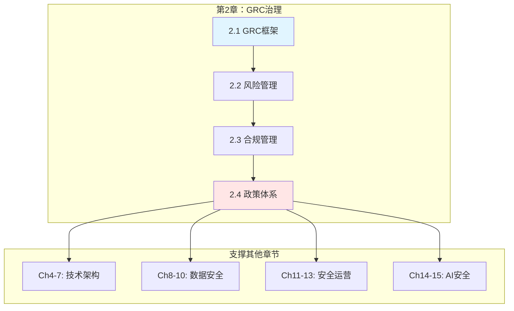

# Chapter 2: GRC Governance, Risk & Compliance

# 第二章：治理、风险与合规——构建可信增长的基石

> **GRC Governance: Building the Foundation for Trusted Growth**

---

## 📚 章节信息

**核心定位**：建立统一的治理、风险与合规（GRC）框架，支撑业务全球化扩张与监管合规

**预计页数**：60-80 页

**目标读者**：
- Security Leaders（CISO/CRO/VP of Security）
- Compliance Officers（合规负责人/DPO/法务）
- Risk Management Team（风险管理团队/内审）
- Business Leaders（业务高管/董事会成员）

---

## 🎯 核心理念

### GRC的战略价值

**GRC不是成本中心，而是业务护航器**：
- **治理（Governance）**：明确方向，确保决策一致性
- **风险（Risk）**：量化不确定性，优化资源配置
- **合规（Compliance）**：满足法规，支撑市场准入

### 本章的AI视角

AI在GRC领域的应用（🤖标注）：
- **自动化合规检查**：AI扫描政策文档、自动映射控制框架
- **风险预测建模**：基于历史数据预测风险发生概率
- **威胁情报分析**：AI处理海量情报，自动生成风险报告
- **审计证据管理**：AI自动采集、分类、归档审计证据

---

## 📖 章节结构

本章共8节，覆盖GRC完整体系：

```
第2章 GRC治理、风险与合规
│
├── 2.1 GRC治理框架
│   ├── GRC三支柱：治理、风险、合规
│   ├── GRC成熟度模型（4级）
│   ├── GRC与业务战略对齐
│   └── GRC组织架构设计
│
├── 2.2 风险管理体系
│   ├── 风险管理生命周期（识别→评估→处置→监控）
│   ├── 风险偏好与容忍度（Risk Appetite）
│   ├── 风险量化方法（FAIR、ALE）
│   ├── 第三方风险管理（TPRM）
│   └── 新兴风险（AI、云、跨境数据）
│
├── 2.3 合规管理框架
│   ├── 全球合规地图（GDPR/SOC 2/ISO 27001/PCI DSS/PIPL）
│   ├── 合规差距分析（Gap Analysis）
│   ├── 合规审计管理
│   └── 认证与审计流程优化
│
├── 2.4 政策与标准体系
│   ├── 政策框架设计（四级结构）
│   ├── 标准与基线（Security Baselines）
│   ├── 控制措施库（Controls Library）
│   └── 政策生命周期管理
│
├── 2.5 GRC平台与工具
│   ├── GRC工具选型（ServiceNow IRM/RSA Archer/MetricStream）
│   ├── 风险量化与建模工具
│   ├── 合规自动化（🤖 AI驱动）
│   └── GRC集成与数据流
│
├── 2.6 治理例会与报告
│   ├── 风险委员会（Risk Committee）
│   ├── 合规季度评审
│   ├── 高管风险报告（Executive Risk Report）
│   └── 董事会安全汇报
│
├── 2.7 实战案例
│   ├── 案例1：跨国企业GRC一体化平台建设
│   ├── 案例2：ISO 27001认证实施路径
│   ├── 案例3：供应链风险治理
│   └── 🤖 案例4：AI治理框架落地
│
└── 2.8 附录与模板
    ├── 风险登记册模板
    ├── 合规检查清单
    ├── 政策模板库
    └── GRC KPI/KRI体系
```

---

## 🔑 核心知识点

### GRC三支柱

| 支柱 | 核心定位 | 关键活动 | 主要产出 |
|------|----------|----------|----------|
| **治理（Governance）** | 建立方向与决策机制 | 政策制定、组织设计、监督机制 | GRC章程、政策体系、治理架构 |
| **风险（Risk）** | 识别、评估与应对风险 | 风险识别、量化评估、处置决策 | 风险登记册、处置计划、KRI指标 |
| **合规（Compliance）** | 满足法规与标准要求 | 法规监测、差距分析、审计准备 | 合规报告、认证证书、审计证据 |

### GRC成熟度模型

| 级别 | 名称 | 特征 | 典型组织 |
|------|------|------|----------|
| **Level 1** | 初始级（Ad-hoc） | 无正式流程，被动响应 | 创业公司（<100人） |
| **Level 2** | 可重复级（Repeatable） | 部分流程文档化 | 成长期公司（100-500人） |
| **Level 3** | 已定义级（Defined） | 完整流程体系，工具支持 | 成熟公司（500-2000人） |
| **Level 4** | 量化管理级（Managed） | 数据驱动决策，持续优化 | 大型企业（2000+人） |

### 全球合规地图

| 法规 | 适用地区 | 核心要求 | 罚款上限 |
|------|----------|----------|----------|
| **GDPR** | 欧盟 | 数据保护、隐私权 | €20M或4%年收入 |
| **PIPL** | 中国 | 个人信息保护 | ¥50M |
| **CCPA** | 美国加州 | 消费者隐私权 | $7,500/violation |
| **ISO 27001** | 全球 | 信息安全管理体系 | - |
| **SOC 2** | 北美 | 服务组织控制 | - |
| **PCI DSS** | 全球 | 支付卡数据安全 | $500K+限制交易 |

### 风险量化方法

**FAIR模型（Factor Analysis of Information Risk）**：
```
风险 = 损失事件频率（LEF）× 损失幅度（LM）

LEF = 威胁事件频率（TEF）× 脆弱性（Vulnerability）
LM = 主要损失 + 次要损失
```

**ALE模型（Annual Loss Expectancy）**：
```
ALE = SLE × ARO
- SLE（Single Loss Expectancy）= 单次损失期望
- ARO（Annual Rate of Occurrence）= 年度发生率
```

---

## 💡 学习目标

完成本章学习后，你将能够：

 **建立GRC治理体系**：掌握GRC三支柱的核心逻辑与组织架构设计

 **实施风险管理**：能够识别、评估、量化风险，制定处置计划

 **应对全球合规**：理解主要法规要求，制定合规路线图

 **设计政策体系**：构建四级政策框架，建立控制措施库

 **选择GRC工具**：评估GRC平台，实现自动化与集成

 **汇报治理成果**：向高管/董事会汇报GRC价值与风险态势

---

## 📂 章节文件

- **[2.1 GRC治理框架](./2.1_grc_governance_framework.md)**
  - GRC三支柱与成熟度模型
  - GRC与业务战略对齐
  - GRC组织架构设计

- **[2.2 风险管理体系](./2.2_risk_management_system.md)**
  - 风险管理生命周期
  - 风险量化方法（FAIR/ALE）
  - 第三方风险管理（TPRM）
  - 新兴风险（AI/云/跨境数据）

- **[2.3 合规管理框架](./2.3_compliance_framework.md)**
  - 全球合规地图
  - 合规差距分析
  - 审计与认证流程

- **[2.4 政策与标准体系](./2.4_policy_standards.md)**
  - 政策框架设计
  - 控制措施库
  - 政策生命周期管理

- **[2.5 GRC平台与工具](./2.5_grc_platforms_tools.md)**
  - GRC工具选型
  - 合规自动化
  - GRC集成与数据流

- **[2.6 治理例会与报告](./2.6_governance_meetings.md)**
  - 风险委员会
  - 高管风险报告
  - 董事会安全汇报

- **[2.7 实战案例](./2.7_case_studies.md)**
  - 跨国企业GRC一体化
  - ISO 27001认证路径
  - 供应链风险治理
  - 🤖 AI治理框架

- **[2.8 附录与模板](./2.8_appendix_templates.md)**
  - 风险登记册模板
  - 合规检查清单
  - 政策模板库
  - GRC KPI/KRI体系

---

## 🔗 与其他章节的关系

### 承接第1章（企业架构基础）

第1章建立了企业架构→安全架构的顶层逻辑：
- 战略层：需要GRC治理框架支撑
- 规划层：风险评估影响架构决策
- 落地层：合规要求嵌入SDL流程

第2章深化战略层的GRC治理机制。

### 支撑后续章节

**Part 2（技术架构，Ch4-7）**：
- 架构设计需要满足合规要求
- 风险评估指导技术选型
- 政策标准约束架构决策

**Part 3（数据安全，Ch8-10）**：
- GDPR/PIPL等隐私法规要求
- 数据分类分级标准
- 跨境数据传输合规

**Part 4（安全运营，Ch11-13）**：
- 事件响应的合规要求
- 风险监控与KRI指标
- 审计证据管理

**Part 5（AI安全，Ch14-15）**：
- AI治理框架
- AI风险评估
- AI伦理合规

**Part 6（组织卓越，Ch16）**：
- GRC团队组织设计
- 角色能力要求
- 培训与文化建设



---

## 🌟 本章亮点

### 1. 全球视野

不仅覆盖中国（PIPL、等保），也覆盖欧美（GDPR、SOC 2、ISO 27001），提供跨区域合规对照。

### 2. 量化驱动

提供FAIR、ALE等风险量化方法，将定性风险转化为可决策的定量数据。

### 3. 实战导向

- 4个完整案例（跨国GRC、ISO认证、供应链、AI治理）
- 可直接使用的模板（风险登记册、合规清单、政策模板）
- GRC工具选型对比

### 4. AI赋能

展示AI如何在合规检查、风险预测、证据管理等环节提升效率。

### 5. 高管语言

提供向CEO/CFO/董事会汇报的框架与案例，用业务语言呈现GRC价值。

---

## 🤔 思考题

1. **战略对齐**：你所在企业的GRC体系与业务战略是否对齐？如何改进？

2. **风险量化**：你如何向CFO证明某项安全投资的ROI？请用FAIR或ALE模型尝试计算。

3. **合规优先级**：面对多个法规要求（GDPR、SOC 2、ISO 27001），如何确定优先级？

4. **工具选型**：如何评估GRC工具（如ServiceNow IRM vs RSA Archer）？哪些因素最重要？

5. **董事会汇报**：如何在15分钟内向董事会清晰汇报企业的风险态势？

---

## 📚 延伸阅读

### 风险管理框架
- **ISO 31000**: Risk Management Guidelines
- **NIST RMF**: Risk Management Framework
- **FAIR Institute**: Factor Analysis of Information Risk
- **COSO ERM**: Enterprise Risk Management Framework

### 合规与隐私
- **GDPR**: General Data Protection Regulation
- **PIPL**: 中国《个人信息保护法》
- **CCPA**: California Consumer Privacy Act
- **ISO/IEC 27701**: Privacy Information Management

### GRC工具与平台
- **ServiceNow IRM**: Integrated Risk Management
- **RSA Archer**: GRC Platform
- **MetricStream**: GRC Software
- **OneTrust**: Privacy & Data Governance

### 行业标准
- **ISO/IEC 27001**: Information Security Management
- **SOC 2**: Service Organization Control
- **PCI DSS**: Payment Card Industry Data Security Standard
- **NIST CSF**: Cybersecurity Framework

---

## 📌 关键术语

| 术语 | 英文 | 说明 |
|------|------|------|
| GRC | Governance, Risk & Compliance | 治理、风险与合规整体管理体系 |
| CISO | Chief Information Security Officer | 首席信息安全官 |
| CRO | Chief Risk Officer | 首席风险官 |
| DPO | Data Protection Officer | 数据保护官/隐私官 |
| ERM | Enterprise Risk Management | 企业风险管理体系 |
| FAIR | Factor Analysis of Information Risk | 风险量化方法 |
| ALE | Annual Loss Expectancy | 年度预期损失 |
| TPRM | Third-Party Risk Management | 第三方风险管理 |
| KRI | Key Risk Indicator | 关键风险指标 |
| KPI | Key Performance Indicator | 关键绩效指标 |
| RCSA | Risk and Control Self-Assessment | 风险控制自评 |
| IRM | Integrated Risk Management | 集成风险管理 |

---

##  学习检查清单

完成本章学习后，请检查你是否能够：

- [ ] 解释GRC三支柱（治理、风险、合规）的核心逻辑与相互关系
- [ ] 评估你所在企业的GRC成熟度级别（Level 1-4）
- [ ] 使用FAIR或ALE模型量化一个安全风险
- [ ] 列举至少3个全球主要法规及其核心要求
- [ ] 设计一个四级政策框架（集团→主题→业务→技术）
- [ ] 评估2-3个GRC工具的优缺点
- [ ] 准备一份15分钟的董事会风险汇报
- [ ] 制定一个90天的ISO 27001认证路线图

---

**开始学习第一节内容。**

 [2.1 GRC治理框架](./2.1_grc_governance_framework.md)

---

## 📍 导航 | Navigation

**[← 上一章： 第1章](../chapter_01_enterprise_architecture_foundation/)** | **[返回 Part 1](../)** | **[返回章节导航](../../)** | **[→ 下一章： 第3章](../chapter_03_business_security_partnership/)**

### 本章节目录

- **[2.1 GRC治理框架](./2.1_grc_governance_framework.md)**
- **[2.2 风险管理](./2.2_risk_management_system.md)**
- **[2.3 合规管理](./2.3_compliance_framework.md)**
- **[2.4 政策标准体系](./2.4_policy_standards.md)**

---

© 2025 AI-ESA Project. Licensed under CC BY-NC-SA 4.0
