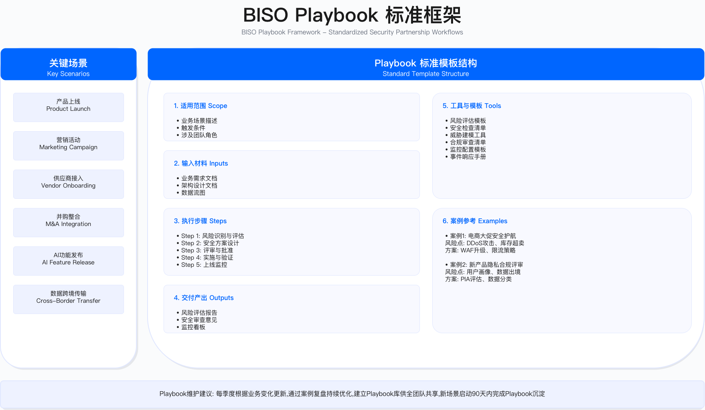

# 执行摘要

本章阐述业务安全伙伴（BISO）模式的战略价值、组织设计与实践框架，目标是将安全职能从"技术执行部门"转型为"业务使能角色"，建立业务与安全协同工作的伙伴关系。

---

## BISO 模式的背景与问题

业务安全伙伴（Business Information Security Officer，BISO）角色的出现，源于企业在数字化进程中面临的一个核心矛盾：安全团队与业务部门之间存在目标、节奏与语言的系统性隔阂。

这种隔阂体现在三个层面。首先是目标差异：业务部门追求快速上线与市场响应，安全团队关注风险控制与合规底线，两者的优先级排序往往冲突。其次是节奏错配：当安全评审流程需要数周时间，而业务要求快速迭代时，安全流程容易被绕过或形式化执行。第三是语言不通：安全团队习惯用技术术语（如 CVE 编号、CVSS 评分）沟通，业务部门则关注收入影响与客户体验，双方难以建立有效对话。

三个结构性变化加剧了这种隔阂的负面影响。业务流程对数字系统的依赖程度持续加深，安全中断与业务中断的边界逐渐模糊。云原生架构、微服务体系与 API 经济使技术栈复杂度上升，安全评估的范围与难度相应增加。合规压力同步增长，金融、医疗、支付、云服务等领域的监管要求不断细化，客户对供应商的安全审查也趋于严格。

BISO 模式的设计初衷，是通过在业务部门与安全中心之间建立专职桥梁角色，解决上述隔阂问题。BISO 既理解业务目标与约束，又具备安全专业判断能力，能够将安全需求翻译为业务可理解的语言，将业务优先级反馈给安全中心。

---

## GSBP 与 BISO 的职责边界

实践中常见的一个困惑是 GSBP（Global Security Business Partner）与 BISO 的职责划分。两者的核心区别在于决策权限与汇报关系。

GSBP 定位为安全团队与业务部门之间的协调员，聚焦日常运营层面的事务处理。GSBP 通常单线汇报给 CISO，决策权限停留在建议层面，最终决策由 CISO 或业务负责人做出。GSBP 对业务的理解侧重于流程层面，能够传达安全要求，但一般不深入业务战略讨论。典型工作场景包括协调产品上线安全评审、跟进漏洞修复进度、组织安全培训等。

BISO 定位为业务单元的安全负责人与战略伙伴，参与业务决策层面的工作。BISO 通常采用双线汇报机制：专业线向 CISO 汇报以确保技术标准一致性，业务线向业务 VP 汇报以确保优先级对齐。BISO 拥有业务安全决策参与权，如风险接受签字、安全投资建议等。BISO 需要深度理解业务战略、财务模型与市场竞争态势，技术上能够独立进行威胁建模与架构评审。典型工作场景包括参与产品战略规划、前置安全需求、支持合规认证、向业务高管汇报风险态势等。

两者的关系不是简单的初级-高级层级，而是战术执行与战略协调的分工配合。在较大规模的组织中，BISO 下可配置若干 GSBP 执行日常工作，BISO 则聚焦于战略对齐与高层沟通。

**适用边界**：GSBP 模式适用于业务相对单一、安全需求标准化程度高的组织；BISO 模式适用于业务复杂度高、安全与业务需要深度协同的场景。两种角色可以共存，但需要明确划分职责边界，避免业务方不清楚应该找谁。

**常见误区**：一是将 BISO 简单定义为"高级 GSBP"，忽视战略参与与决策权限的本质差异；二是设立 BISO 但不赋予实际决策权，导致角色空心化；三是让技术专家直接担任 BISO，忽视业务理解与沟通能力的门槛要求。

---

## 组织架构选择

BISO 组织架构设计需要平衡三个因素：对业务的响应速度、策略标准的一致性、资源利用效率。实践中存在三种基本模型。

**集中式模型**将 BISO/GSBP 集中在安全中心，远程服务各业务线。优势在于资源利用效率高、策略一致性强、知识共享便利。挑战是响应速度受限于沟通成本，难以深入了解各业务线的特性与痛点。此模型适用于业务线较少、业务复杂度相对较低的组织。

**嵌入式模型**将 BISO 直接派驻到业务部门，日常工作与业务团队在一起。优势在于响应速度快、能深度理解业务、决策贴近一线。挑战是资源重复投入、各业务线的安全标准可能不一致、知识共享困难。此模型适用于业务独立性强、安全需求差异大的组织。

**混合式模型**结合集中式与嵌入式的特点：建立中央卓越中心（CoE）负责方法论、工具平台与专家资源池，同时按区域或业务线配置嵌入式 BISO。中央 CoE 保证策略一致性与知识复用，嵌入式 BISO 保证响应速度与业务理解深度。此模型适用于多业务线、跨区域运营的中大型组织。

**关键约束**：组织模型选择受制于企业规模、业务复杂度、地理分布、现有安全团队能力等因素。混合式模型的治理复杂度较高，需要建立清晰的协作机制与决策流程，否则容易出现"中央与地方"的协调问题。

**验证方法**：评估组织模型有效性的核心指标包括需求响应时间（从业务提出需求到 BISO 响应的时长）、业务满意度调研评分、跨业务线安全标准一致性检查结果。建议在模型调整后 3-6 个月进行效果评估。

---

## 业务安全伙伴关系生命周期

BISO 与业务部门的伙伴关系不是一蹴而就的，需要经历建立、深化、交付、优化四个阶段，每个阶段有不同的工作重点与成功标志。

**关系建立期**（通常 1-3 个月）的核心目标是建立信任、理解业务。关键活动包括利益相关方访谈、业务流程分析、参与业务会议（如产品评审、站会、复盘）。成功标志是业务负责人认可 BISO 的价值定位，愿意主动寻求 BISO 支持。信任建立的关键行为包括：优先倾听而非直接提出安全要求，快速响应业务咨询，用业务语言而非技术术语沟通。

**合作深化期**（通常 3-6 个月）的核心目标是标准化流程、建立优先级治理机制。关键活动包括开发标准化 Playbook、建立需求管理流程、发布服务目录与 SLA 承诺。成功标志是安全评审周期明显缩短，需求处理流程可预测。

**价值交付期**（通常 6-12 个月）的核心目标是产生可量化的业务成果。关键活动包括支持产品上线、合规认证（如 SOC 2）、客户安全问卷响应。成功标志是能够用业务语言证明 BISO 贡献，如支持了多少产品上线、加速了认证周期、赢得了哪些客户。

**持续优化期**（12 个月以后）的核心目标是实现流程自动化、建立预测性能力。关键活动包括收集业务反馈、优化服务指标、探索 AI 辅助决策。成功标志是主动发现风险的比例超过被动响应。

**常见误区**：一是跳过关系建立期直接推行安全标准，导致业务抵触；二是在合作深化期过度追求标准化，忽视业务差异性；三是在价值交付期只强调安全指标（如漏洞修复数量），忽视业务成果的表达。

---

## 关键场景 Playbook 框架

Playbook（操作手册）是 BISO 实现服务标准化的核心工具。通过将高频场景的处理流程文档化，Playbook 解决两个问题：一是提高效率，避免每次从零开始；二是保证质量，确保关键检查点不被遗漏。

**产品上线安全评审**是最高频的场景，典型流程包括：需求受理（业务提交产品设计文档，BISO 进行风险分级）、威胁建模（使用 STRIDE 等方法识别威胁，输出威胁清单与缓解方案）、架构评审（评审身份认证、授权、数据加密、日志审计等控制点）、缓解措施跟进（划分优先级：上线前必须修复的 Blocker、上线后限期修复的 Major、作为技术债务排入 Backlog 的 Minor）、上线决策（输出安全评审报告，业务 VP 与 BISO 双签风险接受）。

**供应商接入安全评估**需要根据供应商访问敏感度进行分级管理：访问生产数据或核心系统的关键级供应商需要安全问卷、SOC 2 审查、现场审计的完整流程；非生产访问或低敏感度的供应商可简化评估要求。供应商生命周期管理覆盖尽调、合同、入网、持续监控、离网五个阶段，每个阶段有相应的安全控制要求。

**适用边界**：Playbook 适用于处理流程相对固定、重复频率较高的场景。对于特殊项目（如并购尽调）或新兴技术评估（如 AI 功能安全评审），Playbook 提供框架参考，但需要根据具体情况调整。

**关键约束**：Playbook 的有效性依赖于持续更新机制。如果 Playbook 内容陈旧、与实际流程脱节，反而会成为形式主义负担。建议建立 Playbook 的定期评审机制（如季度评审），并根据事后复盘结果更新内容。

**验证方法**：评估 Playbook 有效性的指标包括 Playbook 执行率（按标准 Playbook 执行的项目占比）、评审周期变化（Playbook 实施前后的对比）、评审质量检查结果（抽查评审是否覆盖关键检查点）。

---

## 需求管理与优先级治理

BISO 面临的常见挑战是需求过载：来自多个业务线的请求同时涌入，如果缺乏优先级机制，BISO 容易陷入"救火"状态，疲于应对紧急事务而无暇做战略性工作。

需求管理的基本原则包括：入口统一化（通过 Jira、ServiceNow 等系统接收需求，避免邮件、即时通讯等分散渠道）、分类分级（根据业务影响与紧急程度划分优先级）、容量管理（预留缓冲应对突发需求，避免排期过满）。

优先级划分的参考框架：P0（紧急）覆盖生产安全事件、合规审计阻塞、客户强制要求等场景；P1（高）覆盖新产品上线、重大架构变更；P2（中）覆盖日常咨询、安全培训、流程优化；P3（低）覆盖探索性研究、工具调研。不同优先级对应不同的响应时间承诺。

**常见误区**：一是缺乏优先级机制导致"谁叫得响谁优先"；二是优先级定义模糊导致争议频发；三是不预留缓冲容量导致计划性工作持续被挤压。

**运行指标**：需求管理的健康度可通过以下指标监控：需求积压量变化趋势、SLA 达成率、优先级分布（如 P0/P1 占比过高可能说明"紧急"定义过宽或预防性工作不足）。

---

## 章节核心目标

本章提供 BISO 建设的系统化框架，覆盖以下内容：

**战略定位**：理解 BISO 与传统安全角色的本质差异，明确从"技术专家"到"业务伙伴"的转型路径；建立 BISO 在企业治理结构中的定位，设计与业务高管的协作机制；将安全价值主张与业务目标对齐，学会用业务语言阐述安全投资回报。

**组织设计**：根据企业规模与业务复杂度选择 BISO 组织架构模型；设计汇报关系与双线汇报机制；规划团队规模配比；设计跨区域协作机制。

**运营卓越**：建立伙伴关系生命周期管理方法；开发关键场景 Playbook；建立需求管理与优先级治理机制；设计季度业务评审（QBR）报告框架。

**能力发展**：建立 BISO 能力矩阵（技术深度与业务广度两个维度）；设计从初级到高级的成长路径；建立培训、认证、导师制等赋能体系；设计绩效评估与激励机制。

---

## 常见陷阱与应对

实践中 BISO 建设的常见失败模式包括：

**角色定位模糊**：BISO 既想做战略又想做执行，结果疲于奔命。应对方法是明确 BISO 聚焦战略与流程，日常执行交给 GSBP 或安全工程团队。

**业务语言缺失**：用技术术语向业务高管汇报，难以获得支持。应对方法是建立业务价值翻译机制，用收入影响、合规准入、客户赢单等业务语言表达安全贡献。

**标准化不足**：每次评审都从零开始，效率低且质量不稳定。应对方法是开发 Playbook 覆盖高频场景。

**孤军奋战**：BISO 缺乏安全中心的专家支持，遇到复杂技术问题无人协助。应对方法是建立混合式架构，确保 BISO 可调用安全中心专家资源。

**能力错配**：安排纯技术专家担任 BISO，缺乏业务理解与沟通能力。应对方法是选拔 BISO 时同等重视业务理解与沟通能力，技术深度可以后续培养。

---

## 衡量成功的指标体系

BISO 效果评估需要结合领先指标与滞后指标。

**领先指标**反映流程健康度与能力建设进展：Playbook 覆盖率（常见场景有标准化 Playbook 的比例）、评审启动速度（需求提交到评审启动的时间）、培训覆盖率（业务团队完成安全培训的比例）。

**滞后指标**反映实际业务成果：评审周期（安全评审平均耗时）、业务满意度（业务部门对 BISO 服务的评价）、漏洞修复率（高危漏洞在承诺时间内修复的比例）、安全事件趋势（因安全问题导致的生产事件数量变化）。

**业务成果**是最终证明 BISO 价值的依据：产品上线速度变化、合规认证周期变化、因安全能力赢得或保留的客户订单。

**验证方法**：建议建立季度评审机制，将指标数据整合到 QBR 报告中，向业务高管与 CISO 汇报。指标阈值应根据企业实际情况设定基线，关注趋势变化而非绝对数值。

---

## 实施路径建议

BISO 体系建设是持续演进的过程，建议分阶段推进。

**建立基线阶段**（通常 0-3 个月）：确定组织模式、选拔首批 BISO、完成 Onboarding、识别业务痛点并实现快速赢得。

**标准化服务阶段**（通常 3-6 个月）：开发核心场景 Playbook、建立需求管理流程、发布服务目录与 SLA 承诺、建立指标仪表盘。

**规模化推广阶段**（通常 6-12 个月）：扩展团队规模、建立 Security Champion 计划、实施自动化工具、启动业务满意度调研。

**持续优化阶段**（12 个月以后）：建立最佳实践共享机制、探索 AI 辅助工具、扩展 BISO 模式至其他职能领域。

**关键约束**：实施进度受制于高管支持力度、人员招聘难度、业务配合意愿等因素。建议从 1-2 个业务线试点开始，验证模式有效后再推广。

---

## 本节小结

BISO 模式的核心价值在于解决安全团队与业务部门之间的系统性隔阂，使安全能够真正服务于业务目标。GSBP 与 BISO 的职责边界需要清晰划分，避免角色混淆。组织架构选择需要平衡响应速度、策略一致性与资源效率，混合式模型适用于多数中大型组织。伙伴关系建立需要经历信任构建、流程标准化、价值交付、持续优化的完整周期。Playbook 是实现服务标准化的核心工具，需要配合定期更新机制。需求管理与优先级治理避免 BISO 陷入"救火"状态。效果评估需要结合领先指标、滞后指标与业务成果，用业务语言证明价值。

---

**下一节预告**：[3.1 BISO 职责定位与使命](./3.1_biso_role_mission.md) 将深入阐述 BISO 与 GSBP 的职责边界、使命陈述框架、利益相关方地图与三方协作机制。

---

**[← 返回章节目录](./README.md)** | **[→ 下一节：3.1 BISO 职责定位与使命](./3.1_biso_role_mission.md)**

---

© 2025 AI-ESA Project. Licensed under CC BY-NC-SA 4.0
