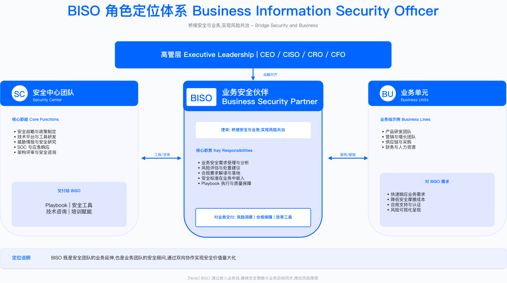

# 3.1 BISO 职责定位与使命

本节明确 GSBP（Global Security Business Partner）与 BISO（Business Information Security Officer）的职责边界、组织定位、治理职责与使命陈述，为 BISO 体系建设奠定基础。

---

## 角色定义与核心职责

### GSBP 与 BISO 的职责边界

GSBP 和 BISO 都属于"安全业务伙伴"体系，但两者定位差异显著。设立 BISO 角色时常见的困惑是：产品上线评审该找 GSBP 还是 BISO？董事会安全态势汇报由谁负责？BISO 自身也面临身份困惑——究竟代表业务还是代表安全？

这种混乱源于职责边界的模糊性。GSBP 是战术执行者（Tactical Executor），深入日常业务节奏；BISO 是战略协调者（Strategic Orchestrator），参与董事会治理与业务单元决策。

**GSBP 的职责边界**定位于日常运营支撑。作为业务方的单一安全接口，承接集团安全策略并将其本地化，支持需求受理、风险评估、上线放行等日常工作。GSBP 向 BISO 或安全中心 GSBP 团队负责人汇报，决策权限停留在日常风险评估、标准场景审批、需求优先级建议层面。

**BISO 的职责边界**提升至战略治理层面。代表业务单元参与企业安全治理委员会，对业务安全策略、预算、合规负责。BISO 与 CSO/CISO/安全委员会双向对齐战略，参与企业级风险决策，在业务内驱动安全文化，审批重大例外，确保 KPI/OKR 实现。BISO 向 CSO/CISO 实线汇报，向业务单元总经理虚线汇报（或反之），拥有重大风险例外审批、安全预算分配、战略对齐决策权限。

边界清晰化的核心转变在于角色定位的重构：GSBP 让业务"找得到人、办得了事"，BISO 让高层"看得清风险、做得了决策"。这种分工不是简单的初级-高级关系，而是战术执行与战略协调的有机配合——GSBP 深入业务一线收集数据和反馈，BISO 基于这些输入参与董事会决策，形成"战术执行→战略调整→策略下发"的闭环。

**适用边界**：职责边界划分适用于中大型企业（业务规模需支撑至少 2 名 BISO 的工作量）；小型企业或单一业务线企业可由 1 人兼任两类职责，但需在汇报时明确区分战术与战略议题。

**关键约束**：职责边界划分的有效性依赖组织规模（需有足够业务复杂度支撑分工）、汇报关系清晰度（双重汇报机制需有明确的决策权归属）、以及高层对角色差异的认知（否则业务仍会混淆服务边界）。

**常见误区**：

- 将 GSBP 与 BISO 视为单纯的"初级-高级"晋升关系，忽视职责本质差异——实际上两者是并行而非递进的角色设计
- 让 BISO 承担过多日常评审工作，导致无暇参与战略决策——BISO 应将日常需求下放给 GSBP 处理

**验证方法**：通过业务团队访谈确认是否清楚"产品上线找 GSBP、战略风险决策找 BISO"；检查 BISO 日历中战略会议与日常评审的时间占比（战略会议应占主导）。

### 组织定位：安全中心的业务前哨

GSBP/BISO 团队在企业安全组织中的位置决定其独立性与影响力。将 BISO 虚线汇报给业务部门是常见的错误做法，容易导致 BISO 被业务"捕获"——在业务压力下批准未经充分评估的第三方组件集成，事后可能引发数据泄露或合规处罚。

正确的组织定位要求 GSBP/BISO 团队为安全中心的直属团队，向 CSO/CISO 实线汇报，确保策略一致性与决策独立性。为保持业务对齐，可建立虚线汇报关系（向业务单元总经理汇报业务进展），但最终决策权必须在安全中心。

企业安全组织架构的标准定位体现在四个层面：

**第一，GSBP/BISO 团队为安全中心直属团队**。与 SOC、AppSec、GRC 等能力域平级，都直接向 CSO/CISO 汇报。这种设计确保策略一致性——所有安全策略、平台能力、政策标准由安全中心统一制定，GSBP/BISO 负责推向业务前台，而非各业务线各自制定安全标准。直属关系也保障资源供给，GSBP/BISO 需要的工具、平台、人力预算由安全中心统一协调。

**第二，业务前哨（Business Frontline）职能**。GSBP/BISO 虽属安全中心，但工作重心在业务线。作为安全中心派驻业务一线的"前哨站"，负责将总部安全策略、能力平台、政策标准翻译成业务语言并推动落地。例如，安全中心发布新的 API 安全标准，GSBP 将其转化为具体的产品上线检查清单，嵌入业务的产品发布流程。

**第三，双向闭环机制**。GSBP/BISO 不仅向下推送策略，还向上反馈业务需求与风险。当 BISO 发现业务频繁遇到特定合规问题（如跨境数据传输），反馈给安全中心 GRC 团队后，GRC 团队可开发自动化评估工具提升业务效率，形成"总部策略→业务落地→问题反馈→策略优化"的正向循环。

**第四，独立性与影响力的平衡**。GSBP/BISO 直属 CSO/CISO 保证决策独立性，避免被业务压力"绑架"。为保持业务对齐，BISO 通常建立虚线汇报关系（如每月向业务单元总经理汇报业务安全进展），确保了解业务战略与优先级。矩阵式结构让 BISO 既有独立的风险判断权，又能深度参与业务决策。

**关键约束**：组织定位的有效性受制于 CSO/CISO 在企业中的话语权（若 CSO 汇报层级低，BISO 独立性难以保障）、业务单元对安全中心的认可度（若业务视安全为"外人"，虚线汇报流于形式）。

**常见误区**：

- BISO 实线汇报给业务部门——这会导致风险评估受业务进度压力影响，丧失独立判断
- 安全中心不给 BISO 配置资源——BISO 沦为"传话筒"而非"前哨站"

**验证方法**：审查 BISO 的正式汇报关系（HR 系统中的实线/虚线设置）；检查 BISO 是否有独立的预算申请权限；访谈业务单元确认 BISO 在风险决策中是否能坚持独立判断。

---

## BISO 在企业治理结构中的定位

### 董事会层面参与机制

BISO 在企业治理结构中的真正价值，不在于日常需求评审或风险评估，而在于参与董事会层面的战略决策与风险治理。这是 BISO 与 GSBP 的最关键区别——GSBP 服务业务操作层（Operational Level），BISO 服务企业治理层（Governance Level）。

典型场景揭示这种定位差异。董事会风险委员会季度会议上，董事们需要回答："当前面临的最大安全风险是什么？这些风险可能导致多少财务损失？安全投资是否足够？"如果没有 BISO 的专业汇报，董事会只能听 CISO 一面之词或依赖外部审计报告，缺少业务视角的风险洞察。BISO 能够提供"自下而上"的业务安全态势——哪些业务线风险敞口最大，哪些合规项目可能延期，哪些安全投资带来业务价值。

BISO 参与董事会治理的框架体现在三个层级：

**董事会层面**：风险委员会接收 BISO 季度汇报业务安全态势（风险敞口、合规状态、重大事件）及安全投资 ROI 分析与预算建议。审计委员会依赖 BISO 协助内控合规检查（ISO 27001、SOC 2、内部审计），提供证据包与整改跟踪报告。战略委员会在数字化转型安全规划（云迁移、AI 应用、出海战略）和并购安全尽调（M&A Security Due Diligence）中需要 BISO 参与。

**高管层面**：CEO 在经营决策中的安全考量（新市场、新产品、新技术）需要 BISO 支持，重大事件影响评估与危机沟通也需 BISO 协助。CFO 依赖 BISO 提供安全投资 ROI 分析与预算优化建议，协助财务审计中的 IT 内控评估（SOX 404 等）。COO 确保运营流程安全合规（供应链、第三方、BCP）需要 BISO 参与业务连续性规划与演练。CSO/CISO 与 BISO 双向汇报、战略协同，BISO 反馈业务需求与风险态势，影响集团安全策略。

**业务层面**：业务单元负责人是 BISO 直接服务对象，BISO 嵌入业务规划、产品上线、运营活动全流程。

BISO 在董事会层面的三个核心价值：风险可视化（将技术风险转化为财务影响）、方案专业性（提供多个可选方案及 ROI）、决策支持（帮助董事会做出平衡业务与风险的决策）。

**适用边界**：董事会参与机制适用于设有正式治理委员会的企业；初创企业或非上市公司可简化为定期向创始人/CEO 汇报，但汇报内容框架相同。

**验证方法**：检查 BISO 是否列入风险委员会/审计委员会的常规参会名单；审阅过去 4 个季度的董事会会议纪要，确认 BISO 汇报是否被记录。

### BISO 董事会治理职责

BISO 的治理职责覆盖五个维度，每个维度有明确的交付频率与产出：

| 职责维度 | 内容说明 | 交付频率 | 典型产出 |
|---------|---------|---------|---------|
| 风险汇报 | 向董事会风险委员会汇报业务线重大安全风险变化 | 季度 QBR | 董事会风险报告（1-2 页执行摘要） |
| 合规保证 | 协助董事会履行安全合规监督责任，提供合规证据 | 年度及按需 | 合规证据包（ISO 27001、SOC 2、GDPR 等） |
| 投资建议 | 为董事会提供业务安全投资的优先级建议和 ROI 分析 | 年度预算周期 | 安全投资 ROI 分析报告、预算提案 |
| 危机沟通 | 重大安全事件的董事会沟通和决策支持 | 按需（重大事件） | 事件简报（24 小时内）、根因分析（7 天内） |
| 战略对齐 | 确保业务安全策略与企业战略、董事会决议保持一致 | 季度复核 | 战略对齐检查清单、OKR 对齐报告 |

表格说明：上述五个维度覆盖了 BISO 对董事会的核心交付责任，交付频率基于治理惯例设定，具体可根据企业治理节奏调整。关键权衡在于季度 QBR 频率——过高会增加准备负担，过低则可能错过风险窗口期。

**常见误区**：

- 风险汇报过于技术化——董事会关心业务影响和财务损失，不关心漏洞数量和 CVE 编号
- 合规证据临时准备——应建立持续合规监控机制，避免审计前"突击整理"

### 风险偏好与授权基准

风险偏好（Risk Appetite）是董事会授予 BISO 的决策权限边界。建立清晰的风险分级与上报机制至关重要。

| 风险类型 | 容忍度/红线 | 触发上报阈值 | 决策主体 | 响应 SLA |
|---------|------------|-------------|---------|---------|
| 财务损失 | 单次直接损失红线（由企业自行设定） | 超过阈值需提交风险偏好例外报告 | 董事会风险委员会 | 24 小时内 |
| 数据泄露 | PII/敏感数据泄露或跨境传输违规 | 发生即刻通知，限期内提交根因与补救计划 | CSO+BISO 联合上报 | 即刻+72 小时 |
| 法规违规 | 可能导致行政处罚或停业整顿 | 初步判定后限期内提交法律风险评估 | CLO+BISO+合规负责人 | 48 小时内 |
| 运营中断 | 核心业务停摆超过阈值或影响 GMV 超过阈值 | 触发危机委员会并启动应急授权链路 | CEO+BISO | 2 小时内 |
| 供应链风险 | 关键供应商（Tier 1）安全评估未通过 | 提交风险接受申请或更换供应商计划 | BISO+采购负责人 | 5 个工作日 |
| AI 伦理风险 | AI 系统存在歧视、偏见或可解释性问题 | 提交 AI 伦理评估报告与缓解方案 | BISO+AI 负责人+法务 | 10 个工作日 |

表格说明：上表列出六类典型风险的分级框架，具体阈值（如财务损失金额、数据记录数、运营中断时长）需由各企业根据自身风险承受能力设定。表中未填写具体数字，因为这些阈值因企业规模、行业、监管环境差异巨大，需由企业风险委员会结合实际情况确定。

授权落地建议包括四个方面：

- **建立《风险偏好登记册》（Risk Appetite Register）**：记录董事会批准的风险偏好，明确可接受、需上报、禁止的风险等级
- **QBR 复盘机制**：在季度业务回顾中复盘风险偏好执行情况，评估阈值是否需要调整
- **例外管理流程**：针对超出风险偏好的情况，BISO 应确保补偿控制（Compensating Controls）和审计轨迹可追溯
- **动态调整**：随业务发展、监管环境变化，年度更新风险偏好文档

**运行指标**：风险偏好例外数量（月度）、例外平均关闭周期、上报 SLA 达成率。这些指标用于监控风险偏好机制的运行健康度，具体目标值由企业根据历史基线设定。

---

## 使命陈述与价值主张

### 使命陈述的战略意义

BISO 团队若无法清晰表达自身存在的价值，业务满意度往往较低，业务抱怨"安全团队就知道说 No，从不帮解决问题"。核心问题在于：团队自己都说不清存在的价值。

使命陈述的价值在于将团队定位从"审批者"转变为"赋能者"。使命陈述发布后，团队行为通常会发生转变：GSBP 开始主动参加业务规划会议，提前识别风险而非事后审批；BISO 开始用 ROI 语言与业务沟通，而非单纯强调合规要求。

优秀的使命陈述同时回答安全团队视角和业务视角的问题：

- **安全团队视角**：GSBP/BISO 让安全成为业务价值的一部分，而不是业务的障碍
- **业务视角**：GSBP/BISO 是值得信赖的安全顾问，在产品、市场和运营全周期提供风险导航，让业务更快、更稳、更合规

综合使命陈述包含六个核心要素：

**我们是谁**：嵌入业务的安全伙伴（Business-Embedded Security Partners），连接企业安全战略与业务增长目标，确保安全成为业务竞争力的一部分。

**我们的使命**：让安全成为业务价值的一部分而非障碍；在产品、市场和运营全周期提供风险导航让业务更快、更稳、更合规；将复杂安全控制翻译为业务语言，推动文化共建与能力提升。

**我们的价值主张**：风险降低（减少高风险例外，缩短风险暴露窗口）、效率提升（优化需求响应时间，加速产品上线节奏）、合规保障（提升审计一次通过率，实现监管零罚款目标）、文化驱动（提高业务团队安全自助率，传递安全文化）。

**我们的服务范围**：咨询与顾问（业务安全咨询、政策解读、合规答疑）、需求与评审（产品上线评审、架构评审、第三方接入评审）、合规与证据（合规审查、审计支持、跨境数据申报）、共创项目（落地 Playbook、自动化项目、文化共建）、事件与例外（高风险例外审批、重大事件沟通、危机应对）、培训与支持（新员工培训、安全意识活动、攻防演练）。

**我们的成功指标**：业务满意度（VOC）、需求 SLA 达成率、业务安全风险敞口下降率（季度）、合规审计一次通过率。具体目标值由各企业根据基线和行业特点设定。

**联系我们**：提供 Confluence、Slack、Email 等多渠道接入方式。

使命陈述落地的四个关键步骤确保有效性：

**第一步，获得 CXO 三方签字认可**。将使命陈述草稿提交给 CSO、COO 和业务单元总经理审阅，每人提出修改意见后达成共识。这个过程耗时较长，但换来高层对 BISO 价值的统一认知——当业务与安全产生冲突时，业务领导会主动引用使命陈述定位双方合作基础。

**第二步，内网全员传播**。将使命陈述发布在公司内网首页、Confluence 安全专区、新员工入职培训材料中。高覆盖传播确保每个员工知道"遇到安全问题找谁、期待什么服务"。

**第三步，季度回顾与对齐**。在季度业务回顾（QBR）会议上，BISO 拿出使命陈述，对照实际工作检查："我们是否真的让安全成为业务价值？有哪些地方偏离了使命？"

**第四步，可视化持续提醒**。将使命陈述制作成海报张贴在办公区、打印成桌牌放在 GSBP 工位、在 Slack 频道置顶。持续可视化提醒让团队成员时刻记得使命，也让业务团队随时能找到联系方式。

**适用边界**：使命陈述适用于所有设立 BISO/GSBP 职能的企业；即使团队规模仅 1-2 人，明确的使命陈述仍有助于与业务建立共识。

**关键约束**：使命陈述的有效性依赖高层认可（需 CXO 签字背书）、持续传播（一次性发布后若不持续强化会被遗忘）、言行一致（若实际行为与使命陈述矛盾，会损害团队公信力）。

**常见误区**：

- 使命陈述过于抽象——"赋能业务"等口号缺乏具体服务承诺，业务团队无感知
- 闭门造车——使命陈述未征求业务方意见，导致价值主张与业务痛点脱节

**验证方法**：随机访谈业务团队成员，询问"BISO 是做什么的"——若多数人能复述使命陈述的核心要点，说明传播有效；检查使命陈述文档的访问日志，评估传播覆盖率。

### 价值主张的四个维度

**风险降低**是 BISO 创造的首要价值，但需要用业务语言表达。不要说"我们修复了 200 个漏洞"，而要说"我们帮助业务避免可能导致业务中断的数据泄露风险"。

具体价值体现在三个方面：减少高风险例外数量（通过 GSBP 前置评估，将产品上线前发现的高危漏洞提前处理，避免"带病上线→紧急下线→业务中断"恶性循环）、缩短风险暴露窗口（建立风险例外跟踪看板，压缩高风险修复周期）、避免重大安全事件（通过供应链安全评估，提前发现第三方组件的安全隐患）。

量化指标参考：高风险敞口季度下降率、风险例外平均关闭周期、重大安全事件数（目标零重大事件）。

**效率提升**关注业务最关心的"安全会不会拖慢业务"问题。BISO 的第二大价值是让安全更快、更便捷、更自动化。

具体价值体现在三个方面：优化需求响应时间（建立标准化 Playbook 库覆盖常见场景，业务可自助查阅，简单需求快速响应）、加速产品上线节奏（通过并行评审方式，将安全评审与 UAT 测试同步进行，压缩产品上线周期）、减少返工成本（将 SDL 嵌入敏捷开发流程，在需求阶段识别安全需求，避免上线前发现高危漏洞导致紧急返工）。

量化指标参考：需求 SLA 达成率、产品上线评审周期（区分标准场景与复杂场景）、业务团队自助率（通过知识库和自助工具解决问题的比例）。

**合规保障**不是负担，而是业务全球化的"通行证"。BISO 的第三大价值是用合规换取市场准入和客户信任。

具体价值体现在三个方面：提升审计一次通过率（通过持续合规监控平台，实时跟踪控制项执行状态，审计前自动生成证据包）、实现监管零罚款（建立合规自动化系统，关键操作自动触发合规评估）、加速全球市场准入（建立 Trust Center 网站公开展示安全认证，缩短客户尽调周期）。

量化指标参考：合规审计一次通过率、监管罚款金额（零容忍目标）、合规证据完备性（自动化采集比例）。

**文化驱动**认识到安全最终是人的问题而非技术问题。BISO 的第四大价值是让安全成为每个员工的本能反应。

具体价值体现在三个方面：提高业务团队安全自助率（建立安全知识库覆盖常见安全问题，业务咨询通过知识库自助解决，GSBP 团队可专注于复杂问题）、传递安全文化（举办安全月活动包括 CTF 竞赛、攻防演练、案例分享会，提高员工参与率和主动上报安全隐患的意愿）、建立安全社区（Security Champions 项目，在每个业务团队培养安全冠军，通过内部认证和激励机制让安全冠军成为 GSBP 的延伸）。

量化指标参考：业务团队自助率、安全意识培训覆盖率（含新员工和年度复训）、VOC 满意度（季度调研）。

---

## 业务细分与利益相关方管理

### 业务细分的战略价值

若只配置 1 名 BISO 覆盖所有业务线，通常会导致问题：不同业务线抱怨 BISO 对其特定合规要求理解不深（如 PIPL、GDPR、PCI DSS 各有专业性），BISO 本人疲于应付各种咨询，无法深入任何业务。

业务细分的三个核心原因揭示其必要性：

- 不同业务线的风险特征差异巨大——电商业务关注反欺诈和用户隐私，支付业务关注 PCI DSS 和反洗钱，跨境业务关注数据本地化和海关监管
- 一刀切的安全策略难以满足多样化需求——用统一的数据加密标准套用所有业务，会导致高性能要求的实时支付业务无法满足延迟 SLA
- GSBP/BISO 需要深入业务才能提供专业支持——只有真正理解业务的商业模式、技术架构、监管环境，才能给出切实可行的安全方案

业务细分可按五个维度进行：

| 细分维度 | 划分依据 | 示例 |
|---------|---------|------|
| 业务单元（BU） | 按业务类型划分 | 电商平台、支付业务、跨境业务、商家服务、物流平台 |
| 市场区域 | 按地理位置划分 | 国内、北美、欧盟、APAC、拉美 |
| 产品类型 | 按客户类型划分 | B2C（消费者）、B2B（企业）、平台体系（第三方开发者） |
| 合规要求 | 按监管强度划分 | 强监管（金融支付）、中监管（跨境电商）、轻监管（内部工具） |
| 技术栈 | 按技术特征划分 | 云原生应用、传统单体应用、移动端、IoT、AI/ML |

表格说明：五个维度可组合使用，企业应根据自身业务复杂度选择主要细分维度（通常以业务单元+市场区域为主），避免过度细分导致 BISO 资源碎片化。

细分匹配原则：1 个 BISO 覆盖 1 个业务单元（小型企业可 1 个 BISO 覆盖多个业务单元）、1 个 Senior GSBP 覆盖 1 个产品线或区域、1 个 GSBP 覆盖 1 个子产品线或专项。具体配比需根据业务规模、复杂度、合规要求综合确定。

**常见误区**：

- 过度细分导致 GSBP 数量膨胀——应先验证业务复杂度是否支撑细分
- 按组织架构而非业务特征细分——组织架构变动频繁，应以业务特征为主要依据

**验证方法**：检查每个 BISO/GSBP 的服务范围是否有明确文档记录；访谈业务团队确认是否清楚"我的安全对接人是谁"；统计各 BISO/GSBP 的工作负载是否均衡（避免部分人过载、部分人闲置）。

### 利益相关方的系统化管理

新任 BISO 常见难题：产品负责人投诉"BISO 从不参加产品规划会"，财务 BP 质疑"安全预算 ROI 不清晰"，隐私官抱怨"跨境数据评估反应太慢"。根源是没有系统化识别和管理利益相关方，导致重要决策节点缺席、关键诉求响应不及时。

绘制利益相关方地图后，识别出关键利益相关方，针对每类制定差异化互动策略：对高权力高利益的业务单元总经理和 CSO，保持月度经营会和季度 QBR 密切沟通；对高权力低利益的产品负责人，确保在产品例会和架构评审等关键节点参与；对低权力高利益的法务/合规，建立月度同步会和专项咨询机制。

九类核心利益相关方的管理策略：

| 利益相关方 | 关注点 | 安全诉求 | 推荐互动节奏 | GSBP/BISO 交付 |
|-----------|--------|---------|-------------|---------------|
| 业务单元总经理 | 业务增长、利润率、客户体验 | 不阻碍创新、重大风险有方案 | 月度经营会、季度 QBR | 业务化的风险概览、ROI 分析 |
| 产品负责人 | 产品路线图、上线节奏 | 上线审批效率、风险提前识别 | 产品例会、迭代评审 | 嵌入需求评审、"安全看板" |
| 研发负责人 | 技术债、稳定性、效率 | 需求可落地、开发成本可控 | 架构评审、技术双周会 | 翻译安全标准、推动自动化 |
| 运营负责人 | 活动执行、成本控制 | 反作弊、账号安全、投诉率 | 周例会、活动前复盘 | 活动安全清单、复盘报告 |
| 法务/合规 | 合同、政策、监管沟通 | 合规评估、证据留存 | 月度法规同步、合规评审会 | 协调合规评估、沉淀证据库 |
| 隐私官 | 隐私合规、数据主体权利 | GDPR/PIPL 合规、TIA 评估 | 双周隐私同步会 | 跨境数据评估、隐私设计评审 |
| 数据负责人 | 数据质量、数据资产 | 数据分级分类、访问控制 | 月度数据治理会 | 数据安全策略、敏感数据保护 |
| 财务 BP | 预算、成本控制、ROI | 投资合理性、成本可控 | 季度预算复核会 | 安全投资 ROI 分析、成本优化建议 |
| HR BP | 人才招聘、绩效、文化 | 培训、背景调查、离职管理 | 月度人才发展会 | 安全培训计划、背景调查流程 |

表格说明：上表列出九类典型利益相关方及其差异化管理策略。互动节奏可根据企业实际情况调整，核心是确保关键决策节点有 BISO 参与。

利益相关方权力-利益矩阵（Power-Interest Matrix）将相关方分为四类：

- **高权力+高利益（Manage Closely）**：业务单元总经理、CSO/CISO——密切管理、频繁沟通、确保满意度，节奏为月度经营会、季度 QBR、重大事件即时通报
- **高权力+低利益（Keep Satisfied）**：产品负责人、研发负责人——保持满意、避免过度打扰、关键节点参与，节奏为产品例会、架构评审、迭代评审
- **低权力+高利益（Keep Informed）**：法务/合规、隐私官、数据负责人——保持知情、定期同步、寻求专业支持，节奏为月度同步会、合规评审会、专项咨询
- **低权力+低利益（Monitor）**：一般员工、外部顾问——监控关注、按需互动，节奏为培训活动、知识库更新

利益相关方地图维护建议：定期更新（每季度更新地图，纳入团队 Wiki）、新成员 Onboarding（新加入 GSBP 第一周内熟悉地图）、变化追踪（组织架构调整时立即更新）、关系健康度评估（每半年评估与关键利益相关方的关系健康度，VOC 调研）。

**验证方法**：检查 BISO 是否被邀请参加产品规划会、架构评审会等关键会议；对比利益相关方地图与实际沟通记录，识别遗漏的利益相关方。

---

## 战略对齐行动路径

### 启动阶段的关键任务

启动阶段（Month 1-2）需要完成四项核心任务：

| 任务 | 产出 | 负责人 | 建议周期 |
|-----|------|--------|---------|
| 完成 GSBP/BISO 角色定位声明 | 1 页角色定义文档，明确 GSBP vs BISO 职责边界 | Lead BISO+CSO/CISO | 2 周 |
| 获得 CXO 三方签字确认 | CSO、COO、各业务单元领导签字的使命陈述 | Lead BISO | 4 周 |
| 绘制业务细分地图 | 业务细分图，明确每个 BISO/GSBP 服务范围 | Lead BISO+BISO 团队 | 2 周 |
| 绘制利益相关方矩阵 | 利益相关方地图（Power-Interest Matrix） | 各 BISO/GSBP | 2 周 |
| 建立沟通节奏表 | 沟通节奏表（含会议类型、频率、参与人、议题模板） | 各 BISO/GSBP | 1 周 |

### 建设阶段的核心产出

建设阶段（Month 3-6）需要完成四项核心任务：

| 任务 | 产出 | 负责人 | 建议周期 |
|-----|------|--------|---------|
| 定义业务价值指标 | 指标定义文档（含计算公式、数据来源、目标值） | Lead BISO+GRC 团队 | 4 周 |
| 发布标准化服务目录 | 服务目录（含服务类型、交付物、SLA、联系方式） | Lead BISO+BISO 团队 | 4 周 |
| 建立三方协作机制流程图 | 协作流程图（BISO←→安全中心←→业务线） | Lead BISO | 2 周 |
| 在内网发布使命陈述与服务目录 | 内网页面、Confluence/Wiki、Slack 频道置顶 | Lead BISO+IT 团队 | 1 周 |

### 优化阶段的持续改进

优化阶段（Month 7-12）需要完成三项核心任务：

| 任务 | 产出 | 负责人 | 建议周期 |
|-----|------|--------|---------|
| 首次 VOC 满意度调研 | VOC 调研报告（满意度评分、改进建议） | Lead BISO | 2 周 |
| 首次 QBR 向董事会汇报 | 董事会风险报告（1-2 页执行摘要） | Lead BISO+CSO/CISO | 按季度节奏 |
| 优化业务细分与利益相关方地图 | 更新后的业务细分图与利益相关方地图 | Lead BISO+BISO 团队 | 季度复核 |

**运行指标**：行动路径执行进度（按月跟踪）、各阶段交付物完成率、VOC 基线建立与趋势变化。

---

## 本节核心要点

清晰的角色边界要求 GSBP 聚焦日常运营与项目交付，BISO 承担战略对齐与治理职责。独立的组织定位要求 GSBP/BISO 团队为安全中心直属团队，确保策略一致性与独立性。明确的治理职责要求 BISO 参与董事会风险委员会，汇报业务安全态势，支持高管决策。

清晰的使命陈述要求用业务语言表达安全价值，获得 CXO 认可。系统化的利益相关方管理要求识别关键利益相关方，建立分级互动策略。

### 常见陷阱与应对策略

| 陷阱 | 表现 | 应对策略 |
|-----|------|---------|
| 被业务"捕获" | BISO 过度迁就业务需求、忽视风险底线 | 明确风险偏好红线，重大例外必须上报 CSO/董事会 |
| "安全警察"形象 | 业务团队视 BISO 为审批障碍、满意度低 | 强化服务意识，提供快速通道（Fast Track）、优化 SLA |
| 使命陈述空洞 | 过于抽象、业务团队无感知 | 用业务语言、量化指标、成功案例具体化价值主张 |
| 利益相关方不清晰 | 不知道该找谁沟通、错过关键决策节点 | 建立并定期更新利益相关方地图，纳入团队 Wiki |
| 指标不可度量 | 定义的指标无法采集数据或验证 | 与 GRC/数据团队协作，确保指标有明确数据来源 |

---

## 延伸阅读

推荐资源包括标准与框架类：

- ISO/IEC 27014:2020 - Information security, cybersecurity and privacy protection—Governance of information security
- SABSA White Paper - Business-Driven Security Architecture
- BRM Institute - Business Relationship Management Framework

相关章节：

- [3.2 BISO 组织架构设计](3.2_biso_organization_design.md) - 深入探讨组织模型、汇报关系、团队规模规划
- [3.3 业务安全伙伴关系生命周期](3.3_business_partnership_lifecycle.md) - 学习如何建立、深化、维护与业务的伙伴关系
- [Chapter 2: GRC Governance](../chapter_02_grc_governance_risk_compliance/README.md) - 理解 BISO 如何参与企业 GRC 治理

---

## 导航

**[← 返回章节目录](./README.md)** | **[返回 Part 1](../)** | **[返回总目录](../../)** | **[→ 下一节](./3.2_biso_organization_design.md)**

---

**© 2025 AI-ESA Project. Licensed under CC BY-NC-SA 4.0**
