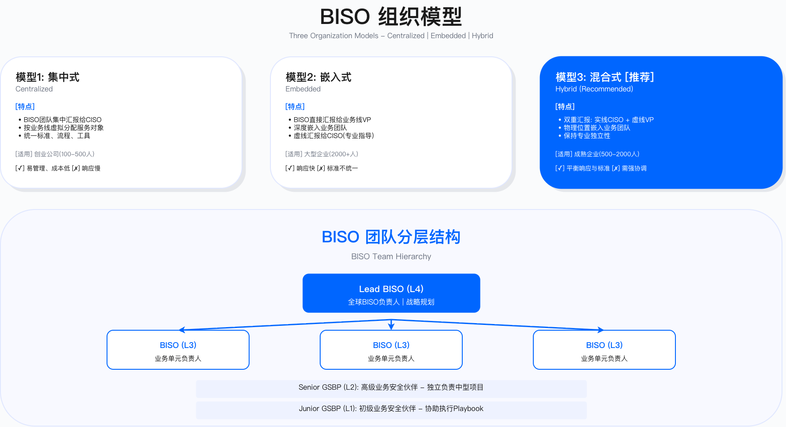

# 3.2 BISO 组织架构设计 (BISO Organization Design)

---

## 3.2.1 组织模型与定位选择 (Organization Models and Positioning)

### 三种核心组织模型

组织模型的选择需要与企业的业务结构、地理分布和合规要求相匹配。模型选择失误会导致两类典型问题：一是响应速度不足——集中式模型在多时区、多业务线场景下的需求响应周期往往超出业务预期；二是标准不一致——完全嵌入式模型容易导致各业务线安全评审口径偏差，审计时暴露控制缺陷。

选择组织模型需要评估三个维度：

业务规模与分布：单一市场、业务线数量有限的企业适合集中式模型，能够最大化资源利用效率；业务跨多个地理区域或监管辖区的企业需要考虑混合式或嵌入式模型，以保证本地响应能力。

业务独立性：各业务线的技术栈、合规要求和运营模式差异越大，越需要靠近业务的嵌入式配置。如果业务线使用统一的技术平台且合规要求相似，集中式模型的效率优势更明显。

合规复杂度：金融支付、医疗健康等强监管行业的合规要求具有专业性和地域性，需要具备相应领域知识的 GSBP 深度嵌入，混合式模型更能平衡专业深度与响应效率。

下表比较三种模型的适用边界与权衡取舍。表中的规模参数为参考口径，企业应根据自身业务复杂度和合规要求调整：

| 组织模型 | 适用场景 | 优势 | 挑战 | 典型适用条件（参考口径） |
|---------|---------|------|------|------------------------|
| 集中式模型（Centralized） | 单一市场、业务线较少、中小规模企业 | 资源利用效率高、策略一致性强、知识共享便利 | 对业务响应速度受限、难以深入了解各业务线特性 | BU 数量 ≤ 3、市场相对集中 |
| 嵌入式模型（Embedded） | 多业务线、业务独立性强、大型企业 | 业务响应快速、深度了解业务、决策贴近一线 | 资源重复投入、策略一致性弱、知识共享困难 | BU 数量 ≥ 5、各 BU 技术栈差异大 |
| 混合式模型（Hybrid） | 全球化运营、多区域多业务线、中大型企业 | 平衡响应速度与策略一致性、灵活调配资源 | 组织复杂度高、需要强有力的治理机制 | 跨多个监管辖区运营 |

常见误区：

1. 规模决定论：认为企业规模直接决定模型选择。实际上，业务复杂度和合规要求的异质性比规模本身更关键——一家业务单一但跨多个强监管市场的中型企业，可能比业务多元但市场集中的大型企业更需要混合式模型。

2. 一步到位：新建 BISO 团队直接采用完整的混合式架构。没有建立 CoE 方法论体系和标准化工具的前提下，分布式团队容易各自为战。建议从集中式起步，随业务扩展逐步演进。

### 混合式模型架构设计

混合式模型的核心设计原则是"中央标准化 + 区域本地化"：中央卓越中心（CoE）负责输出统一的方法论、工具平台和培训体系，保证全球策略一致性；区域嵌入层按地理或业务维度配置 BISO/GSBP，保证响应速度和合规专业性。

这种分层设计解决了两个核心矛盾：

响应速度与标准一致性的矛盾：区域团队提供本地时区覆盖和业务深度理解，CoE 通过标准化 Playbook 和工具确保评审口径一致。

专业深度与资源效率的矛盾：领域专家（合规、隐私、云安全等）集中在专家资源池，按需支援各区域项目，避免每个区域重复配置稀缺专业人才。



混合式模型的三层架构包括：

中央能力组（Central Capability Team）：Lead BISO 作为全球负责人向 CSO/CISO 汇报，职责涵盖战略协同、全球治理框架制定、跨区域资源调度和高管沟通。CoE 团队负责方法论与标准输出（统一的 Playbook、模板、评审标准）、指标定义与数据看板、培训与认证体系、工具平台维护。CoE 的核心价值在于将优秀实践固化为可复用的标准化资产，减少各区域重复造轮子的成本。

业务嵌入层（Business-Embedded Layer）：按地理区域或业务单元配置 Regional BISO 和 Senior GSBP。Regional BISO 负责区域策略适配（如 APAC 区域的 PIPL 合规、EMEA 区域的 GDPR 合规）和区域团队管理。Senior GSBP 深入具体业务线，理解业务流程、技术栈和风险特征，提供贴身服务。这种设计保证了合规要求的本地化理解和业务需求的快速响应。

专家资源池（Expert Resource Pool）：合规专家、隐私专家、云安全专家、AI 安全专家等领域专家不固定嵌入特定业务，而是作为"飞行支援队"支持复杂项目和突发事件。专家资源池的价值在于专业深度的集中供给和灵活调配，避免专业人才在单一项目闲置。

适用边界：混合式模型适用于跨多个监管辖区运营、业务线技术栈和合规要求存在差异、且具备投入建设 CoE 团队资源的企业。对于业务相对单一、市场集中的企业，混合式模型的组织复杂度可能超过其带来的收益。

关键约束：

- CoE 投入：有效的 CoE 团队需要持续投入方法论研发和工具维护，人员配置不足会导致 CoE 沦为空壳，区域团队仍然各自为战。
- 治理机制：混合式模型需要清晰的权责边界和升级机制，避免"双重领导"导致的决策混乱。
- 沟通成本：跨区域协作带来的沟通成本需要通过标准化流程和工具平台来抵消。

### 汇报关系设计原则

汇报关系的设计直接影响 BISO 的独立性和业务影响力。核心权衡在于：过度倾向安全线汇报会导致与业务脱节，被视为"安全警察"；过度倾向业务线汇报容易被业务压力"捕获"，在风险决策时失去独立判断。

三种汇报模式的适用场景：

| 汇报模式 | 实线汇报 | 虚线汇报 | 适用场景 | 风险 |
|---------|---------|---------|---------|------|
| 模式 A：安全主导型 | CSO/CISO | BU 总经理 | 强监管行业、安全成熟度低、需要强力推动合规 | 业务疏离感、可能被视为阻碍 |
| 模式 B：业务主导型 | BU 总经理 | CSO/CISO | 安全成熟度高、业务创新优先 | 易被业务压力影响风险判断 |
| 模式 C：平衡型 | CSO/CISO | BU 总经理 | 中大型企业、需要平衡独立性与业务对齐 | 需要清晰权责界定 |

模式 C（平衡型）的设计要点：

平衡型汇报关系的核心是通过绩效考核权重分配来平衡两条线的诉求。典型配置是 CSO/CISO 占绩效权重的多数（确保安全底线），BU 总经理占少数（激励业务响应）。这种非对称设计让 BISO 在面临安全与业务冲突时有明确的优先级依据。

绩效考核维度应覆盖两条线的关注点：

安全线考核维度（占比较高）：安全战略执行度、风险管理成效、合规审计通过率、团队能力建设。

业务线考核维度（占比较低）：业务满意度（VOC）、需求响应 SLA 达成率、业务安全创新贡献、业务 OKR 支持度。

验证方法：

- 定期（半年度或年度）进行 BISO 角色压力测试：模拟业务压力下的风险例外决策场景，评估 BISO 是否能够坚持安全底线。
- 跟踪"风险例外批准率"和"例外后风险事件发生率"：如果例外批准率持续上升且伴随风险事件增加，说明 BISO 可能被业务压力过度影响。

运行指标：

- BISO 离职率：异常高的离职率可能指示角色压力过大或职业发展路径不清晰。
- 重大风险例外数量：按季度跟踪，异常增长需要调查根因。
- 审计发现中与 BISO 决策相关的控制缺陷数量。

---

## 3.2.2 角色分层与职责矩阵 (Role Hierarchy and Responsibility Matrix)

### 四层角色体系

角色分层的目的是建立清晰的职责边界和决策权限。缺乏分层的扁平结构会导致：业务不清楚该找谁、风险决策无人拍板、会议效率低下。

四层角色体系的设计逻辑：

L4 Lead BISO：全局战略与资源统筹。负责全球 BISO 战略制定、跨区域资源调度、参与董事会风险委员会、管理全球 BISO 预算。决策权限包括重大风险例外最终审批、全球预算分配、组织架构调整。

L3 Regional BISO：区域策略与团队管理。负责制定区域安全策略与合规路线图、管理区域内 GSBP 团队、对接区域业务领导层、协调区域法规合规事务。决策权限包括区域风险例外审批（影响在阈值内）、区域预算建议与分配、区域人员配置调整。

L2 Senior GSBP：业务线深耕与复杂场景。负责特定 BU/产品线安全策略、带领初级 GSBP、主导复杂场景 Playbook 执行、重要项目安全评审主审。决策权限包括业务线风险例外建议、标准场景最终审批、需求优先级排序。

L1 GSBP / Junior GSBP：日常执行与标准场景。负责嵌入业务日常运营节奏、受理与响应业务安全需求、执行标准 Playbook、进行常规风险评估。L1 GSBP 有标准场景安全评审和低风险例外建议的决策权限；L0 Junior GSBP 无独立决策权，需 Senior GSBP 审核确认。

常见误区：

1. 角色混淆：业务分不清 GSBP 和 BISO 的区别，导致简单问题找高层、复杂问题找执行层。需要明确公示各层级的职责范围和升级路径。

2. 决策权限不明：L1 GSBP 不清楚哪些风险例外可以自行建议、哪些必须升级，导致要么事事请示（效率低）、要么越权决策（风险高）。需要建立清晰的决策权限矩阵，并通过案例培训强化理解。

### RACI 责任矩阵

RACI 矩阵解决跨角色协作中的职责归属问题。下表定义了关键活动的责任分工：

| 活动 | Lead BISO | Regional BISO | Senior GSBP | GSBP | 业务负责人 | 安全专家团队 |
|-----|-----------|--------------|-------------|------|-----------|-------------|
| 战略规划：年度 BISO 战略制定 | A | R | C | I | C | C |
| 风险治理：重大风险例外审批 | A | R | C | I | C | C |
| 合规管理：审计响应与证据提供 | A | R | R | C | I | C |
| 需求评审：产品上线安全评审 | I | I | A | R | C | C |
| 事件响应：L2 级安全事件处置 | I | A | R | R | I | R |
| 培训支持：业务安全意识培训 | I | C | A | R | I | C |
| 指标报告：季度 QBR 报告 | A | R | C | C | C | I |
| Playbook 管理：核心场景 Playbook 制定 | A | C | R | C | C | R |

图例：A = Accountable（最终负责，对结果负全责）；R = Responsible（执行负责，实际完成工作）；C = Consulted（咨询，提供输入和建议）；I = Informed（知情，需要被告知结果）

验证方法：

- 每季度抽查一次 RACI 矩阵执行情况：选取典型活动（如审计响应、重大项目评审），验证实际执行是否符合矩阵定义。
- 跟踪"职责不清导致的延迟"事件数量：如果频繁出现"谁负责"的争议导致项目延迟，说明 RACI 矩阵需要澄清或培训不足。

---

## 3.2.3 团队规模与编制规划 (Team Sizing and Staffing Planning)

### 团队规模计算方法

BISO 团队规模需要在业务需求覆盖和成本效率之间取得平衡。规模不足导致需求积压和响应延迟；规模过大导致人员闲置和 ROI 难以证明。

两种互补的规模计算方法：

方法 1：基于业务规模的配置公式

这是自上而下（Top-Down）的估算方法，适合新建 BISO 团队或快速估算。核心公式：

```
GSBP 总数 = Σ(BU 数量 × 复杂度系数 × 风险系数)

复杂度系数：
- 简单 BU（单一产品线，单一市场）= 0.5
- 中等 BU（多产品线或多市场）= 1.0
- 复杂 BU（多产品线 + 多市场 + 强监管）= 1.5

风险系数：
- 低风险（内部工具，非核心业务）= 0.8
- 中风险（一般业务，中等合规要求）= 1.0
- 高风险（金融支付，强监管，跨境数据）= 1.2
```

方法 2：基于服务负载的配置模型

这是自下而上（Bottom-Up）的验证方法，适合已有 BISO 团队优化编制或向管理层证明 ROI。核心思路是根据实际服务指标推导配置：

| 业务指标维度 | 配置参数（参考口径） | 适用场景 |
|------------|-------------------|---------|
| 研发规模 | 每 50-80 名研发配置 1 名 GSBP | 科技/互联网公司 |
| 产品线数量 | 每 2-3 条核心产品线配置 1 名 GSBP | 多元化业务集团 |
| 年度项目数 | 每年 30-50 个安全评审项目配置 1 名 GSBP | 项目密集型业务 |
| 合规要求 | 强监管行业在基础配置上增加一定比例 | 金融、医疗、关键基础设施 |

实践建议：同时使用两种方法，取交叉验证的结果。如果两种方法的结果差异较大，需要分析原因——可能是业务复杂度评估偏差或服务负载数据不准确。

关键约束：

- 工作饱和度：健康的团队工作饱和度应在 70-85% 区间。低于 70% 说明可能存在冗员；高于 85% 说明缺乏弹性应对突发需求。
- 管理幅度：每位管理者（Regional BISO / Senior GSBP）直接管理的下属数量建议控制在 3-7 人，超过 7 人的管理幅度会影响辅导和质量控制。

### 典型企业编制配置

以下配置方案为参考示例，企业应根据自身业务特征调整：

小型企业配置（业务线 ≤ 3，研发规模 ≤ 300 人）

团队规模 5-8 人。Lead BISO 通常兼任部分 Regional BISO 职责，2 名 Senior GSBP 承担主要工作，2-4 名 GSBP 覆盖日常执行。专家资源池依赖外部顾问或共享安全中心专家。

关键成功要素：Lead BISO 需要具备"全栈"能力（既懂战略又能亲自解决问题）；优先招聘 Senior 级别人才（避免 Junior 需要长时间培养）；与外部顾问建立长期合作关系（如合规认证顾问），按需调用专业能力。

中型企业配置（业务线 3-5，研发规模 300-1000 人，跨 1-2 个区域）

团队规模 15-25 人。开始出现专业化分工：按区域或主要业务线配置 Regional BISO 和 Senior GSBP，建立初步的 CoE 团队（方法论、指标、培训、工具各 1-2 人）。

关键成功要素：Regional BISO 需要有区域自主决策权（避免事事请示总部）；CoE 团队要输出标准化工具和模板；建立定期轮岗培养机制。

大型企业配置（业务线 ≥ 5，跨多个区域和监管辖区）

团队规模 40-60+ 人。采用完整的三层架构：CoE 团队 8-10 人，按主要区域（如 APAC/EMEA/Americas）配置区域团队，专家资源池覆盖合规、隐私、云安全、AI 安全等领域。

关键成功要素：CoE 团队需要有全球权威（输出的标准必须被所有区域执行）；Regional BISO 需要有足够自主权（避免总部遥控导致响应迟缓）；投资统一的 GRC 平台实现全球数据一致性。

### 人员配置成熟度路线图

BISO 团队建设应分阶段演进，避免一步到位带来的组织混乱：

| 阶段 | 时间参考 | 团队规模 | 配置重点 | 验收标志 |
|-----|---------|---------|---------|---------|
| 启动期 | 0-6 月 | 2-5 人 | 设立 Lead BISO、配置核心 GSBP、覆盖最关键业务线 | 服务目录发布、需求入口建立、VOC 基线建立 |
| 扩展期 | 6-18 月 | 8-15 人 | 补齐核心 BU 的 GSBP、设立 Senior GSBP、建立初步专家池 | 覆盖主要业务、核心 Playbook ≥ 3 个、需求 SLA 达成率达标 |
| 成熟期 | 18-36 月 | 20-40 人 | 设立 Regional BISO、建立 CoE 卓越中心、全球化团队布局 | 覆盖全部业务、参与董事会汇报、VOC 满意度达标 |
| 领先期 | 36 月+ | 40-60+ 人 | 专家资源池完善、行业对外输出、AI/自动化能力 | 行业标杆、外部案例输出、自动化率达标 |

常见误区：

1. 跳跃式建设：新建团队直接招聘大量 GSBP，但没有 Lead BISO 建立方法论体系，导致团队各自为战、标准不一。
2. 停滞不前：团队长期停留在启动期或扩展期，没有向成熟期演进的路线图和投入计划。

---

## 3.2.4 全球 BISO 网络协作机制 (Global BISO Network Collaboration)

### 跨时区覆盖模型

全球化企业面临的核心挑战是时区覆盖。安全事件和紧急需求不会只在工作时间发生。

24/7 覆盖的设计原则是三大时区（APAC/EMEA/Americas）接力覆盖：每个时区的工作时段覆盖约 8-10 小时，三个时区有一定的重叠时段用于交接。

APAC 时区（UTC+8 为中心）：覆盖东亚、东南亚、澳新的工作时间。

EMEA 时区（UTC+0/UTC+1 为中心）：覆盖欧洲、中东、非洲的工作时间。

Americas 时区（UTC-5/UTC-8 为中心）：覆盖北美、拉美的工作时间。

协作机制的核心是建立多层次的信息同步节奏：

- 每日安全态势同步：由三个时区轮流主持，每次 15-30 分钟，同步前 24 小时重要事件和今日重点项目。
- 周度全球例会：选择对所有时区相对友好的时间段，全球 BISO 团队参与，处理跨区域议题和资源协调。
- 紧急事件升级链路：需要预先定义 L1/L2/L3 级事件的响应 SLA 和升级路径，确保紧急事件在规定时间内得到响应。
- 知识库实时共享：依赖统一的知识管理平台，确保各时区团队能够访问最新的 Playbook、FAQ 和案例。

关键约束：

- 时区重叠时段是交接的黄金窗口，需要保护不被其他会议占用。
- 紧急事件响应需要明确的值班安排和升级联系人，避免"找不到人"的情况。

### 跨地区协作治理框架

| 治理机制 | 频率 | 参与方 | 议题 | 产出 |
|---------|------|--------|------|------|
| 全球 BISO 战略会 | 季度 | Lead BISO + 所有 Regional BISO | 全球战略对齐、预算与资源分配、重大风险同步、能力建设规划 | 季度战略执行报告、资源分配计划 |
| 区域协调会 | 月度 | 单区域所有 BISO/GSBP | 区域项目进展、需求优先级、例外与升级、最佳实践分享 | 月度区域报告、需求看板更新 |
| 全球每日站会 | 每日 | 各时区值班 GSBP | 前 24 小时重要事件、今日重点项目、阻塞点与升级 | 每日安全简报 |
| 跨时区事件响应 | 按需 | 当值 Regional BISO + 专家 | 重大安全事件联合响应、跨区域影响评估 | 事件响应报告、改进行动计划 |

### 跨文化沟通适应策略

全球 BISO 团队需要理解并适应不同文化的沟通方式。文化差异处理不当会导致协作低效甚至冲突。

基于 Hofstede 文化维度模型的适应策略：

| 文化维度 | 高语境文化特征 | 低语境文化特征 | BISO 适应策略 |
|---------|--------------|--------------|--------------|
| 沟通方式 | 间接、含蓄、重视人际关系 | 直接、明确、重视效率 | 针对不同文化调整沟通风格；关键政策提供多语言版本 |
| 权力距离 | 等级分明，尊重权威 | 相对平等，鼓励质疑 | 针对不同文化调整汇报方式和决策流程 |
| 风险偏好 | 谨慎、避免不确定性 | 开放、接受风险 | 风险例外审批阈值可考虑文化差异因素 |
| 时间观念 | 关系优先，时间灵活 | 时间优先，严格遵守 SLA | SLA 设计和跟进机制考虑文化差异 |

适用边界：文化适应策略不是为了迁就低效率，而是为了在文化差异存在的前提下实现有效协作。核心安全标准和合规要求不因文化差异而降低。

### 全球知识共享机制

全球 BISO 团队的核心资产是知识复用。不同区域独立研究相似问题会造成大量重复劳动。

分层知识管理架构：

L1 全球统一标准：所有区域必须遵守的核心 Playbook、安全政策、RACI 矩阵、指标定义。这一层的内容由 CoE 维护，修改需要全球治理流程审批。

L2 区域适配指南：各区域根据本地法规和业务特征适配的指南。例如 APAC 区域的 PIPL/网安法合规速查、EMEA 区域的 GDPR 合规指南、Americas 区域的 CCPA/州法合规等。这一层的内容由 Regional BISO 维护，需要与 L1 标准保持一致。

L3 国家/BU 实践案例：成功案例库、常见问题 FAQ、本地化工具模板。这一层的内容由各 GSBP 贡献，经 Senior GSBP 审核后发布。

知识贡献激励机制：知识共享的障碍往往是"分享了我的经验，我还有什么价值"的心态。需要建立激励机制，将知识贡献纳入绩效评估，让贡献者获得认可和回报。

---

## 3.2.5 BISO 与集团安全中心协作机制 (BISO and Group Security Center Collaboration)

BISO/GSBP 作为业务一线的安全收口窗口，需要与集团安全中心（包括 GRC、AppSec、DataSec、SOC 等职能团队）建立清晰的协作机制。这一协作机制的缺失会导致两类典型问题：一是业务需求在 BISO 与集团安全中心之间"踢皮球"，响应效率低下；二是集团安全中心的安全策略无法有效传导到业务一线，执行落地困难。

### Hub-Spoke 协作模型

企业安全组织的整体架构可以理解为 Hub-Spoke 模型：

**Hub（集团安全中心）**：GRC、AppSec、DataSec、SOC、云安全、AI 安全等职能团队构成安全能力中心（CoE）。集团安全中心负责制定安全策略与标准、提供专业技术能力、运营安全平台与工具、处理复杂安全事件。

**Spoke（业务一线）**：BISO/GSBP 嵌入各业务线，作为业务与集团安全中心之间的桥梁。Spoke 负责理解业务需求与风险特征、将安全策略转化为业务可执行的措施、收集业务反馈并传递给集团安全中心、协调集团安全中心资源支持业务需求。

这一模型的核心价值在于：集团安全中心专注于专业深度和规模效应，BISO/GSBP 专注于业务理解和快速响应，两者协同形成完整的安全服务能力。

### 协作场景矩阵

BISO 与集团安全中心的协作可分为两个方向：BISO 向集团安全中心发起的请求（Spoke → Hub）和集团安全中心向 BISO 推送的信息（Hub → Spoke）。

**Spoke → Hub：BISO 发起的协作场景**

| 协作场景 | 对接团队 | 触发条件 | BISO 职责 | 集团安全中心职责 | 响应 SLA |
|---------|---------|---------|----------|------------|---------|
| 安全评审支持 | AppSec | 复杂架构评审、新技术引入 | 提供业务背景、协调业务资源 | 执行技术评审、输出评审意见 | 标准 5 个工作日 |
| 合规咨询 | GRC | 新法规适用性、审计准备 | 整理业务现状、协调证据收集 | 提供合规解读、审计支持 | 一般 3 个工作日 |
| 数据安全评估 | DataSec | 新数据处理场景、跨境数据 | 梳理数据流、明确业务目的 | 执行 DPIA、输出控制建议 | 标准 5 个工作日 |
| 安全事件响应 | SOC | L2 及以上安全事件 | 业务影响评估、业务侧协调 | 技术调查、遏制与恢复 | 按事件等级 SLA |
| 云安全咨询 | 云安全 | 云架构设计、云原生安全 | 提供业务需求、成本约束 | 云安全方案设计与评审 | 标准 5 个工作日 |
| 安全例外审批 | GRC/相关团队 | 无法满足安全标准的业务需求 | 提交例外申请、补偿控制方案 | 风险评估、审批决策 | 3-5 个工作日 |

**Hub → Spoke：集团安全中心推送的协作场景**

| 协作场景 | 发起团队 | 触发条件 | 集团安全中心职责 | BISO 职责 |
|---------|---------|---------|------------|----------|
| 安全策略发布 | GRC | 新策略/标准发布 | 制定策略、提供培训材料 | 传达解读、推动业务落地 |
| 威胁情报通报 | SOC/TI | 针对性威胁、漏洞预警 | 分析威胁、输出应对指南 | 评估业务影响、协调响应 |
| 安全运营周报 | SOC | 定期周报 | 汇总安全态势、风险趋势 | 识别业务相关风险、跟进 |
| 合规要求更新 | GRC | 法规变化、审计发现 | 解读合规变化、制定整改要求 | 推动业务整改、跟踪闭环 |
| 安全能力上线 | 各团队 | 新工具/平台上线 | 提供工具培训、接入指导 | 推动业务接入、收集反馈 |

### 协作治理机制

有效的协作需要建立明确的治理机制，避免临时性的点对点沟通导致效率低下和信息遗漏。

**定期同步机制**

| 机制 | 频率 | 参与方 | 核心议题 | 产出 |
|-----|------|--------|---------|------|
| BISO-集团安全中心周会 | 每周 | BISO + 各职能团队接口人 | 在途需求进展、阻塞问题、下周重点 | 周报更新、问题升级 |
| 月度协作回顾 | 每月 | Regional BISO + 各职能团队负责人 | SLA 达成情况、协作痛点、改进建议 | 月度协作报告 |
| 季度战略对齐 | 每季度 | Lead BISO + 各职能团队负责人 | 业务优先级变化、资源需求、能力建设 | 季度协作计划 |

**升级与例外机制**

当协作过程中出现阻塞或争议时，需要清晰的升级路径：

L1（工作层面）：GSBP ↔ 职能团队执行人员直接沟通解决。

L2（管理层面）：Senior GSBP / Regional BISO ↔ 职能团队 Team Lead，解决资源冲突、优先级争议。

L3（决策层面）：Lead BISO ↔ 职能团队负责人（如 GRC 负责人、AppSec 负责人），解决策略分歧、重大例外。

升级原则：工作层面问题在 24 小时内无法解决应升级至 L2；L2 问题在 48 小时内无法解决应升级至 L3。

### 协作效能指标

跟踪协作效能的关键指标：

| 指标 | 定义 | 目标参考值 | 数据来源 |
|-----|------|-----------|---------|
| 需求响应 SLA 达成率 | 集团安全中心在承诺时间内响应 BISO 需求的比例 | ≥ 90% | 需求工单系统 |
| 首次响应时间 | 集团安全中心收到需求后首次响应的平均时间 | ≤ 4 小时 | 需求工单系统 |
| 协作满意度 | BISO 对集团安全中心协作的满意度评分 | ≥ 4.0/5.0 | 季度调研 |
| 升级率 | 需要升级至 L2/L3 的需求占比 | ≤ 10% | 升级记录 |
| 策略落地率 | 集团安全中心发布的策略在业务侧落地执行的比例 | ≥ 85% | 合规检查 |

运行验证：每季度回顾协作效能指标，识别协作瓶颈。如果某个职能团队的 SLA 达成率持续低于目标，需要分析根因（资源不足、需求不清晰、流程不畅）并制定改进计划。

---

## 3.2.6 组织成熟度演进路径 (Organization Maturity Evolution Path)

### 组织成熟度四阶段模型

BISO 组织的成熟度决定了其能够为企业创造的价值上限。团队规模不等于成熟度——一个规模较大但缺乏标准化流程和治理机制的团队，成熟度可能仍处于早期阶段。

四阶段演进路径：

阶段 1：萌芽期（Emerging）

核心目标是证明 BISO 模式的可行性，让业务和高层看到初步效果。典型特征是小团队（2-5 人）、简单流程、关系驱动。

验收标志：设立 Lead BISO（可兼任）；配置核心 GSBP 覆盖关键业务线；发布初步服务目录与需求入口；建立与业务团队的基础沟通节奏；完成首次利益相关方地图绘制。

阶段 2：成长期（Developing）

核心目标是标准化流程和扩大覆盖。典型特征是专职团队（5-15 人）、标准流程建立、基础指标运行。

验收标志：扩展至专职团队；设立 Senior GSBP 角色，建立两层架构；发布核心场景 Playbook；建立风险登记册与例外管理流程；需求 SLA 达成率、VOC 满意度达到基线目标；启动月度例会与 QBR 机制。

阶段 3：成熟期（Mature）

核心目标是完善组织架构和参与治理。典型特征是完整架构（20-40 人）、参与董事会汇报、CoE 输出标准化能力。

验收标志：团队覆盖所有核心业务；设立 Regional BISO 或 BU BISO 角色；建立 CoE 卓越中心；BISO 参与董事会风险委员会汇报；完整指标体系运行，数据看板可视化；VOC 满意度、NPS 达到目标；完成首次全球 BISO 峰会或区域交流。

阶段 4：领先期（Leading）

核心目标是建立行业标杆和创新能力。典型特征是全球化团队（40-60+ 人）、高自动化率、行业影响力。

验收标志：全球化团队覆盖所有区域；专家资源池完善；安全自动化率达到目标；VOC 满意度、NPS 达到更高目标；输出行业白皮书或最佳实践案例；参与外部会议分享或行业标准制定；建立外部生态合作。

### 成熟度评估清单

成熟度评估清单帮助 BISO 团队自我诊断当前所处阶段，并明确下一阶段的努力方向。评估时应客观诚实，未达标的项目不应强行标记为完成。

验证方法：

- 半年度进行一次成熟度自评，与上次评估结果对比，识别进展和停滞领域。
- 年度邀请外部（内部审计或外部顾问）进行独立评估，验证自评结果的准确性。

---

## 3.2.7 组织设计常见挑战与应对 (Common Challenges and Solutions)

BISO 组织设计过程中的常见挑战及应对策略：

| 挑战 | 表现 | 根因 | 应对策略 |
|-----|------|------|---------|
| 角色边界模糊 | GSBP 与 BISO 职责重叠，业务不知道找谁 | 缺乏清晰 RACI 矩阵，决策权限不明 | 发布角色定位声明与 RACI 矩阵；设立单一入口（Service Desk）；定期内部澄清会议 |
| 资源争夺 | 多个 BU 同时提需求，GSBP 疲于奔命 | 需求优先级机制缺失，资源池不足 | 建立需求优先级评分模型；设立专家资源池飞行支援；明确 SLA 与快速通道 |
| 业务疏离感 | 业务视 BISO 为"安全警察"，满意度低 | 过度强调合规，忽视业务价值传递 | 强化价值主张与成功案例传播；设立业务创新支持项目；VOC 调研纳入绩效考核 |
| 策略不一致 | 不同区域/BU 安全标准差异大 | 中央能力组缺失，各自为政 | 建立 CoE 卓越中心统一方法论；全球 Playbook 强制执行；定期审计与合规检查 |
| 人才流失 | GSBP 离职率高，团队不稳定 | 职业发展路径不清晰，激励不足 | 建立 GSBP → BISO 成长路径；完善绩效与激励体系；提供培训与外部交流机会 |
| 跨时区协作困难 | 全球团队沟通效率低，信息不同步 | 缺乏标准协作机制，文化差异大 | 建立 24/7 值班与每日站会机制；跨文化沟通培训；统一知识库与实时协作工具 |

运行指标：

- 角色边界相关：升级到错误层级的需求比例、"职责不清"导致的项目延迟次数。
- 资源争夺相关：需求积压量、平均等待时间、资源池调用频率。
- 业务疏离感相关：VOC 满意度、NPS、业务主动咨询 vs 被动通知的比例。
- 策略不一致相关：审计发现的跨区域标准偏差数量、Playbook 执行一致性检查结果。
- 人才流失相关：GSBP 离职率、离职原因分析（Exit Interview 数据）。
- 跨时区协作相关：紧急事件响应 SLA 达成率、知识库更新及时性。

---

## 导航

**[← 上一节：3.1 BISO 职责定位与使命](./3.1_biso_role_mission.md)** | **[返回章节目录](./README.md)** | **[下一节：3.3 业务安全伙伴关系生命周期 →](./3.3_business_partnership_lifecycle.md)**

---

**© 2025 AI-ESA Project. Licensed under CC BY-NC-SA 4.0**

