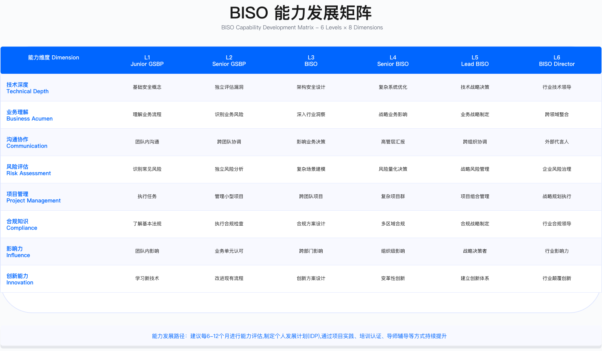

# 3.5 BISO 能力成长路径

---

## 3.5.1 四象限能力矩阵

### 能力模型设计原理

GSBP/BISO 角色的核心挑战在于跨领域能力的整合。与纯技术岗位不同，该角色需要在安全技术、业务理解、风险治理、沟通影响四个维度同时具备足够深度，才能有效履行"安全与业务之间桥梁"的职能。

四象限能力模型的设计遵循以下原则：横轴代表安全技术深度（从业务思维到技术专家的连续光谱），纵轴代表业务理解广度（从合规执行到战略伙伴的演进路径），交汇点则是风险治理能力与沟通影响力，这两项能力将技术判断与业务需求连接起来，决定了 GSBP/BISO 能否在组织中发挥实际作用。

该模型的适用边界需要明确：它针对的是嵌入业务线的安全角色，而非纯技术安全工程师或纯合规专员。对于小型组织（安全团队少于 5 人），角色边界往往模糊，该模型可作为参考但不宜机械套用。

### 象限一：业务洞察能力

业务洞察能力决定了 GSBP/BISO 能否用业务方听得懂的语言沟通安全问题。缺乏这项能力的安全人员容易陷入"技术正确但业务不接受"的困境。

财务读写能力的价值在于：安全投资决策最终需要财务语言支撑。L1 级别需理解基本财务术语（GMV、成本、利润等），能够在沟通中正确使用；L2 级别应能分析财务报表并计算安全投资的 ROI；L3 级别应能独立制定安全投资预算，与 CFO 进行有效对话；L4 级别则需具备支持并购场景下财务尽调、评估安全问题对估值影响的能力。

业务模型理解的关键在于识别安全控制点应放置在业务价值链的哪个环节。不同业务模型（B2C、B2B、平台型）的安全重点差异显著，B2C 侧重用户数据保护与反欺诈，B2B 侧重合规认证与供应链安全，平台型则需同时关注双边用户的安全需求。

产品思维的核心是将安全需求前置到产品设计阶段。具备 L3 以上产品思维的 GSBP/BISO 能够影响产品决策，将安全作为产品卖点（如 Trust Center、隐私认证），而非仅在上线前"卡关"。

常见误区：

- 过度追求业务洞察能力而忽视技术深度，导致无法对具体安全方案做出专业判断
- 将"懂业务"等同于"业务说什么都答应"，失去安全底线
- 在不了解业务全貌的情况下对单点需求做出风险判断，遗漏系统性风险

### 象限二：风险治理能力

风险治理能力是 GSBP/BISO 区别于一般安全工程师的核心能力。技术能力解决"能不能做"的问题，风险治理能力解决"应不应该做、做到什么程度"的问题。

风险评估能力的演进路径：L1 级别能够使用标准模板评估常见风险场景；L2 级别可独立完成中等复杂度的风险评估；L3 级别应能设计风险评估方法论、处理复杂场景建模；L4 级别需具备企业级风险框架设计能力，能够向董事会呈报风险态势。

合规管理能力的关键约束在于法规的动态性与跨境复杂性。GDPR、PIPL、CCPA 等法规的要求存在差异，GSBP/BISO 需要理解这些差异对业务的具体影响，而非仅停留在"了解法规名称"的层面。

例外管理是风险治理中最考验判断力的环节。业务总会提出各种"紧急例外"需求，GSBP/BISO 需要具备评估例外风险、设计补偿控制措施、管理例外生命周期的能力。L3 以上级别应具备审批权限，L4 级别则需建立例外治理框架并向董事会报告例外态势。

验证方法：

- 风险评估能力可通过案例答辩验证——给定复杂场景，要求候选人在限定时间内完成风险识别、评分、缓解措施设计
- 合规管理能力可通过审计结果验证——审计发现数量、整改关闭周期、监管处罚记录
- 例外管理能力可通过例外审计验证——例外存量、平均存续期、补偿控制有效性

### 象限三：安全技术能力

安全技术能力是 GSBP/BISO 的专业底座。缺乏技术深度的"业务伙伴"难以获得安全团队的认可，也无法对技术方案做出有效评判。

技术能力的范围应根据业务类型调整：云原生业务需要重点关注云安全架构与容器安全；传统金融业务则更侧重网络隔离与数据库安全；AI 密集型业务需要理解模型安全与数据隐私的特殊要求。GSBP/BISO 不需要在所有技术领域达到专家级别，但需要在所服务业务的关键技术领域具备足够深度。

云安全能力要求理解云计算责任共担模型的实质含义。常见失误是将责任共担理解为"云厂商负责底层、企业负责应用"的简单二分，而忽视了 IaaS/PaaS/SaaS 不同模型下责任边界的显著差异。

应用安全能力的关键在于理解安全左移的实现路径。OWASP Top 10 是基础知识，但 L3 以上级别需要能够设计 SDL 流程、推动 DevSecOps 落地，将安全嵌入开发流程而非仅在上线前检查。

AI/ML 安全是近年新增的能力维度。随着企业广泛采用 AI 技术，GSBP/BISO 需要理解 AI 应用的特有风险（模型安全、数据偏见、对抗攻击等），并能设计相应的安全控制框架。

关键约束：

- 技术能力需要持续更新，否则会快速过时
- 技术深度与广度存在权衡，需要根据岗位定位选择侧重点
- 避免"技术自信"陷阱——对不熟悉的技术领域，应寻求专家支持而非凭直觉判断

### 象限四：沟通影响能力

沟通影响能力决定了前三项能力能否转化为实际影响。一个技术能力强、业务理解深、风险判断准的 GSBP/BISO，如果无法有效沟通，其价值将大打折扣。

业务沟通的核心是语言转换，将技术风险转译为业务影响。"该系统存在 SQL 注入漏洞"是技术表述，"客户数据可能被窃取，导致 GDPR 罚款和客户流失"是业务表述。L3 以上级别应能影响业务决策、获得高层支持；L4 级别需具备董事会汇报能力。

谈判协商能力在安全工作中高度实用。安全需求与业务进度、预算约束、用户体验之间经常存在冲突，GSBP/BISO 需要具备达成多方共赢方案的能力，而非简单地"坚持安全底线"或"向业务妥协"。

故事讲述能力常被低估。数据和逻辑是必要的，但案例和故事更容易引起共鸣、推动行动。能够用真实案例说明安全风险的 GSBP/BISO，其影响力远超仅依赖合规要求的同行。

运行指标：

- 沟通影响能力可通过 VOC（客户之声）满意度、NPS（净推荐值）等指标量化
- 谈判能力可通过例外关闭率、项目按时交付率间接衡量
- 故事讲述能力可通过培训效果评估、安全意识调研结果反映

---

## 3.5.2 技能等级定义

### 四级能力标准体系

能力等级划分的目的是为人才选拔、培养、晋升提供可操作的标准。四级体系（L1-L4）对应从入门到战略级的完整成长路径，每一级别都有明确的能力要求、典型任务、成长周期。

**L1（初级/Junior GSBP）** 的角色定位是在 Senior GSBP 指导下工作，执行标准流程，积累业务与安全知识。

核心能力要求包括：理解公司业务模式与产品；掌握基础安全概念（OWASP Top 10、加密原理、认证机制）；能够执行标准 playbook 与检查清单；熟悉主要合规法规的基础知识（GDPR、PIPL 等）；具备基本的沟通与文档能力。

典型任务包括：协助安全评审、执行检查清单；收集审计证据与数据；参与培训活动、协助组织；文档整理与知识库维护；需求受理与分类。

L1 级别的典型挑战是业务知识不足（难以理解业务痛点）、安全技术深度不够（无法独立评估风险）、沟通能力弱（难以获得业务信任）。培养重点应放在业务培训、安全基础知识积累、导师"影子学习"（shadowing）上。

**L2（中级/GSBP）** 的角色定位是独立负责特定产品线或项目的安全支持，能够独立完成中等复杂度任务。

核心能力要求包括：深入理解所服务业务线的运营模式与指标；独立完成产品上线安全评审；设计中等复杂度的安全方案；熟悉主要法规并能独立完成合规评估；能够组织小型工作组、协调跨部门资源。

典型任务包括：独立主导产品上线评审；进行风险评估与缓解方案设计；参与 playbook 制定与优化；组织业务安全培训；指导 1-2 名 junior GSBP。

L2 级别的典型挑战是复杂场景（并购、新兴技术）经验不足、影响力有限（难以推动高优先级决策）、缺乏战略思维（只能"救火"）。培养重点应放在参与复杂项目、学习财务与战略管理知识、参加谈判与影响力培训上。

**L3（高级/Senior GSBP 或 BISO）** 的角色定位是负责整个业务单元或区域的安全策略，能够制定政策、影响决策、培养团队。

核心能力要求包括：制定业务线安全战略与 OKR；设计复杂场景的安全架构与控制框架；主导内外部审计、应对监管检查；影响高管决策、获得资源支持；培养与指导 junior/mid GSBP。

典型任务包括：制定业务线年度安全规划；主导复杂项目（并购、新兴技术、全球扩张）；参与董事会风险委员会；建立团队能力体系与培训计划；输出行业最佳实践与方法论文档。

L3 级别的典型挑战是从执行者到战略者的思维转变、管理复杂利益相关方关系、平衡短期需求与长期战略。培养重点应放在高管培训（如 MBA 核心课程）、行业会议演讲（建立外部影响力）、轮岗（拓宽视野）上。

**L4（专家/Lead BISO 或 CSO）** 的角色定位是全球 BISO 网络负责人或企业级安全战略制定者，引领行业实践、具备外部影响力。

核心能力要求包括：制定企业级安全战略、参与董事会决策；设计创新安全解决方案、引领行业趋势；应对复杂监管挑战、影响法规制定；建立全球 BISO 网络、管理跨文化团队；具备行业影响力（外部演讲、白皮书、标准制定）。

典型任务包括：制定全球安全战略与治理框架；向董事会汇报、支持董事会安全决策；主导全球并购安全尽调；应对跨国监管检查（如 GDPR 调查）；代表公司参与行业标准制定；培养下一代 BISO 领导者。

L4 级别的典型挑战是全球化运营的复杂性（文化、法规、时区）、平衡创新与风险控制、保持技术敏感度（避免脱离一线）。培养重点应放在董事会治理培训、全球轮岗、外部网络建设、接班人培养上。

→ *详见 [第 16 章：安全领导力](../../part_06_security_leadership_organizational_excellence/chapter_16_security_leadership/) 中 16.5 人才招聘与发展的完整职业发展框架设计*

### 各级别适用边界与约束

等级划分的适用前提是组织已建立相对成熟的 GSBP/BISO 职能体系。对于刚开始建设该职能的组织，实际情况可能是：一个人同时承担 L1-L3 的部分职责，或者组织尚未定义清晰的等级体系。

晋升周期因人而异，受组织规模、业务复杂度、个人学习能力、项目历练机会、晋升空缺等多种因素影响。关键判断依据是能力是否达到下一级别的标准，而非在当前级别的任职时长。建议组织建立以能力评估为核心的晋升机制，避免单纯依赖时间维度。

常见误区：

- 将等级等同于工作年限，忽视实际能力差异
- 在缺乏复杂项目历练的情况下强行晋升，导致能力与职责不匹配
- 过度依赖认证作为晋升依据，而忽视实际业务成果
- L3 以上级别仍然过度关注执行细节，未能完成向战略角色的转型

---

## 3.5.3 GSBP 到 BISO 成长路径

### 成长阶段模型

从 GSBP 到 BISO 的转型不仅是职级变化，更是角色定位、工作方式、价值创造方式的根本性转变。整个成长过程可分为四个阶段，每个阶段有明确的目标与里程碑。

**阶段一：能力建设期**

目标是掌握核心技能，能够独立完成标准任务。这一阶段的关键里程碑包括：独立完成若干产品上线评审（具体数量根据项目复杂度调整）；启动专业认证学习（如 CISSP、CISM 等）；业务满意度 VOC 达到组织设定的目标水平；能够指导初级 GSBP。此阶段的持续时间取决于个人背景和项目机会。

这一阶段的核心挑战是从"学习者"到"独立执行者"的转变。导师的作用至关重要——通过影子学习、案例复盘、定期辅导帮助新人快速积累经验。

**阶段二：复杂项目历练期**

目标是主导复杂项目，建立战略思维。这一阶段的关键里程碑包括：主导多个复杂项目（并购、新兴技术、全球扩张等）；参与业务 OKR 制定，制定联合 KR；输出 playbook 或最佳实践文档；参与监管审计或重大合规项目。此阶段的进入条件是完成阶段一的能力建设。

这一阶段的核心挑战是从"执行标准流程"到"处理非标准场景"的转变。复杂项目（如并购尽调）无法完全依赖 playbook，需要在不确定性中做出判断。

**阶段三：战略对齐与认证期**

目标是具备战略视野，通过 BISO 认证。这一阶段的关键里程碑包括：制定业务线年度安全规划（与 BU 总经理共创）；完成 QBR 董事会汇报（在 BISO 指导下）；通过 BISO 认证评估（案例答辩+情景模拟）；获得业务领导认可推荐。此阶段的进入条件是积累足够的复杂项目经验。

这一阶段的核心挑战是从"解决安全问题"到"创造业务价值"的思维转变。BISO 需要能够主动告诉业务，安全可以成为竞争优势，而非仅仅响应业务的安全需求。

**阶段四：BISO 代理与转正**

目标是承担 BISO 完整职责，获得正式任命。这一阶段的关键里程碑包括：担任某业务单元 BISO 代理（时长根据组织需要确定）；独立完成 QBR 董事会汇报；管理 GSBP 团队；获得 BU 总经理正式推荐及 CSO/CISO 任命。此阶段的进入条件是通过 BISO 认证评估并获得业务领导认可。

### BISO 认证评估框架

BISO 认证评估旨在验证候选人是否具备承担 BISO 职责的综合能力。评估采用多维度设计，避免单一维度的片面性。

评估维度及权重分配如下：

**业务战略能力（权重 30%）** 通过案例分析方式评估。给定业务场景，要求候选人制定安全战略。评估要点包括：是否理解业务目标与挑战；安全战略是否对齐业务战略；是否用业务语言表达（GMV、成本、效率）；是否有可衡量的成功指标。

**风险治理能力（权重 25%）** 通过风险评估演练方式评估。给定复杂场景（如并购），要求候选人进行风险评估。评估要点包括：风险识别是否全面（技术、合规、运营）；风险评分是否合理；缓解措施是否有效；剩余风险是否可接受。

**技术方案能力（权重 20%）** 通过技术方案设计方式评估。给定安全需求，要求候选人设计技术方案。评估要点包括：方案是否满足安全要求；方案是否技术可行；是否考虑成本与用户体验；是否有备选方案。

**沟通影响能力（权重 15%）** 通过情景模拟方式评估。模拟董事会汇报或高管谈判场景。评估要点包括：沟通是否清晰、简洁、有说服力；是否能够处理质疑与挑战；是否展现领导力与决断力；是否能够达成目标（获得支持/资源）。

**团队领导能力（权重 10%）** 通过 360 度评估方式评估。收集下属、同事、上级的评价。评估要点包括：是否能够指导与培养团队成员；是否能够跨部门协作；是否具备冲突管理能力；是否获得团队信任。

评分标准：90-100 分为优秀，可直接任命 BISO；80-89 分为良好，列入 BISO 候选人，6 个月后复评；70-79 分为合格，继续担任 senior GSBP，12 个月后复评；70 分以下为不合格，需继续培养，18 个月后复评。

### 关键能力提升阶段

从 GSBP 到 BISO 的成长过程中存在三个关键能力跃升节点，每个节点都需要有意识的思维转变与行为调整。

从执行者到决策者的转变体现在多个维度：工作性质从执行 playbook、提供建议转变为制定策略、做出决策；时间分配从 70% 执行、30% 思考转变为 30% 执行、70% 战略规划；决策权限从低/中风险建议扩展到高风险审批、预算分配；问责范围从项目成功与否扩展到业务线整体安全态势；思维方式从任务导向（what & how）转变为目标导向（why & impact）。

实现这一转变的建议包括：参与战略规划会议，理解业务战略制定过程；学习决策框架（如 OODA loop、决策树）；练习"电梯演讲"（30 秒说清核心观点）；从"问题报告者"转变为"解决方案提供者"。

从技术专家到业务伙伴的转变体现在：沟通语言从安全术语（漏洞、加密、认证）转变为业务语言（GMV、成本、效率、风险）；关注焦点从技术控制有效性转变为业务价值与风险平衡；利益相关方从产品、研发、安全团队扩展到 BU 总经理、CFO、董事会；影响范围从单个项目或产品线扩展到整个业务单元战略；价值证明从发现漏洞、修复问题转变为支持业务增长、降低风险、节约成本。

实现这一转变的建议包括：学习财务分析，能够读懂损益表、现金流表；参加业务战略培训；每月与 BU 总经理进行 1-on-1 沟通，理解业务优先级；用"业务影响"框架重新表达安全需求。

从个人贡献者到团队领导者的转变体现在：工作重心从自己做事转变为通过他人做事；成功定义从个人任务完成度转变为团队目标达成度；时间分配从 80% 自己执行、20% 协作转变为 50% 指导培养、30% 战略规划、20% 执行；人际关系从平级协作扩展到上下级管理、跨部门协调；职责范围从完成分配任务扩展到设定目标、资源分配、绩效评估。

实现这一转变的建议包括：学习领导力课程；练习授权与辅导，避免"事必躬亲"；建立团队文化与价值观；定期进行 1-on-1 辅导下属，制定个人发展计划。

---

## 3.5.4 培训与支持体系

### 分层培训体系

培训体系的设计需要与能力等级体系对齐，确保每个级别的人员都能获得针对性的培训支持。

**L1 基础入门层（foundation track）** 的培训重点包括：新人入职培训（30 天计划）；安全基础知识（OWASP、加密、认证）；业务流程与产品培训；playbook 与工具使用培训。

**L2 能力提升层（skill development track）** 的培训重点包括：中级安全认证（Security+、CEH、CCSP）；风险评估与合规管理培训；项目管理认证（PMP、敏捷）；沟通与演示技巧培训。

**L3 专业深化层（professional depth track）** 的培训重点包括：高级安全认证（CISSP、CISM、CISA）；业务战略管理（MBA 核心课程）；谈判与影响力培训；行业会议演讲与案例输出。

**L4 领导力层（leadership track）** 的培训重点包括：董事会治理培训；高管教练（executive coaching）；EMBA 或高管培训课程；跨国企业管理（全球化）。

### 新人 90 天成长计划

90 天成长计划的设计目标是帮助新人快速融入角色、理解业务、掌握核心技能，并在试用期结束时能够独立承担标准任务。

**第一个月（融入与理解）**  的核心任务是组织认知与业务学习。

第 1 周聚焦组织与文化：完成入职手续、认识团队成员、明确导师；了解组织架构与汇报关系；参加安全中心培训，理解 GSBP/BISO 角色定位与使命。

第 2 周聚焦业务深入理解：与关键利益相关方进行 1-on-1 会谈（产品负责人、研发负责人、运营负责人），了解他们的痛点与期望；参加业务例会（产品例会、技术双周会、运营周会），观察业务运作节奏；使用公司产品（用户视角），了解系统架构与技术栈。

第 3 周聚焦安全知识与流程：学习公司安全政策与标准；参加 playbook 培训（产品上线评审、营销活动评估、供应商接入）；跟随 senior GSBP 进行影子学习，参与 2-3 个实际项目。

第 4 周聚焦实践与反馈：独立完成小型任务（协助安全评审、收集审计证据、整理项目文档）；与导师进行 1-on-1 辅导，回顾前 3 周学习，设定下一阶段目标；完成 30 天评估与反馈。

**第二个月（实践与提升）**  的核心任务是从观察者转变为参与者。

第 5-6 周聚焦标准项目参与：在 senior GSBP 指导下主导小型项目（低风险产品上线评审、业务安全培训协助组织）；学习风险评估方法（风险评分模型、威胁建模）；学习合规法规基础知识。

第 7-8 周聚焦技能扩展：参加外部培训（Security+ 或 CEH 预备课程、在线课程）；参与复杂项目观察（供应商安全评估等）；完成 60 天评估，进行四象限能力打分，制定个人发展计划（IDP）。

**第三个月（独立与总结）**  的核心任务是从参与者转变为独立执行者。

第 9-10 周聚焦独立项目：独立完成 1-2 个标准项目（产品上线评审完整流程、营销活动安全评估）；输出项目文档（风险评估报告、上线决策建议）；获得业务方反馈（VOC 满意度调研）。

第 11-12 周聚焦知识积累与规划：贡献知识库（更新 playbook、分享经验教训、整理常见问题 FAQ）；完成 90 天总结汇报（向团队汇报 90 天学习与成果）；制定下一阶段成长计划（明确 6-12 个月目标、确定培训与认证计划）。

### 持续学习机制

**月度 CoP（community of practice，实践社区）** 是 GSBP/BISO 团队知识共享与能力提升的核心机制。

运作方式：每月固定时间召开（建议每月第一个周五下午），所有 GSBP/BISO 及相关安全专家参与，线下/线上混合形式。

典型议程包括四个模块：案例分享模块（本月最佳实践案例分享、经验教训与改进建议）；技术专题模块（新兴技术安全、安全工具新功能介绍、行业趋势分析）；法规更新模块（新法规解读、监管动态与影响分析、合规最佳实践）；互动讨论模块（开放讨论本月遇到的挑战与问题、头脑风暴、团队建设活动）。

CoP 的输出应包括：会议纪要、知识库更新、行动计划。

**季度技能工作坊（skill workshop）** 针对特定能力维度进行深度培训。

示例主题安排：Q1 业务洞察工作坊（财务报表阅读与分析、业务战略框架、案例研讨）；Q2 风险评估工作坊（威胁建模方法、风险量化技术、复杂场景案例研讨）；Q3 沟通影响力工作坊（商务谈判技巧、董事会汇报技巧、说服高管投资安全案例研讨）；Q4 技术深度工作坊（云安全架构设计、零信任落地实践、AI/ML 安全评估）。

**年度外部学习预算**的参考配置（具体金额需根据组织实际情况调整）：

| 学习项目 | 用途                                           |
| -------- | ---------------------------------------------- |
| 在线课程 | Coursera、Udemy、LinkedIn Learning 等平台订阅  |
| 安全认证 | CISSP、CISM、CISA、PMP 等认证考试费用          |
| 行业会议 | RSA、Black Hat、OWASP Global AppSec 等会议参会 |
| 专业书籍 | 安全、业务、管理类书籍                         |
| 外部培训 | SANS、ISC² 等专业培训机构课程                 |
| 教练辅导 | executive coaching（L3+ 级别）                 |

学习投资的关键约束是效果追踪，需要建立学习成果与工作绩效的关联评估机制，避免"为培训而培训"。

---

## 3.5.5 绩效评估与激励

### 平衡计分卡设计

GSBP/BISO 绩效评估采用平衡计分卡模型，从多个维度综合评价，避免单一指标导向的片面性。

**维度一：业务价值（权重 40%）** 关注安全工作对业务的实际贡献。

核心指标包括：风险降低（高风险敞口下降率）、合规达标（审计一次通过率）、效率提升（需求 SLA 达成率）、成本节约（安全投资 ROI）。

该维度权重最高的原因是：GSBP/BISO 的核心价值在于支持业务，而非仅仅"做安全工作"。业务价值可量化、可对比，是最能体现 GSBP/BISO 贡献的维度。

**维度二：服务质量（权重 30%）** 关注业务方对安全服务的满意度与体验。

核心指标包括：业务满意度（VOC 评分）、净推荐值（NPS）、响应及时性（需求响应时间达标率）、项目成功率（项目按时按质交付率）。

该维度的意义在于：即使业务价值达成，如果业务方体验差，GSBP/BISO 的长期影响力也会受损。服务质量指标反映了"怎么做"的问题。

**维度三：能力成长（权重 20%）** 关注个人能力的持续提升。

核心指标包括：认证获取（年度专业认证）、知识贡献（playbook/案例/文档贡献数量）、培训参与（年度培训小时数）、能力提升（四象限能力评估提升幅度）。

该维度的意义在于：GSBP/BISO 角色要求持续学习、不断提升。能力停滞的 GSBP/BISO 将逐渐失去竞争力。

**维度四：团队协作（权重 10%）** 关注对团队与组织的贡献。

核心指标包括：跨部门协作（360 度评估评分）、知识分享（CoP 演讲或案例分享次数）、新人培养（成功培养 junior GSBP 数量）、文化建设（参与团队建设活动情况）。

该维度权重较低但不可或缺的原因是：团队协作是长期可持续发展的基础，但短期难以量化，不宜赋予过高权重。

### 激励机制设计

激励机制的设计需要兼顾物质激励与非物质激励、短期激励与长期激励的平衡。

**物质激励**包括：年度绩效奖金（通常为基本工资的一定比例，与绩效评分挂钩）；晋升调薪（晋升时的薪酬调整）；股权激励（L3 以上级别，根据公司政策）。

**非物质激励**包括：年度评优（如"BISO 之星"评选）；外部会议演讲机会（RSA、行业峰会等）；行业白皮书署名作者；团队建设活动；灵活工作制（远程、弹性工时）。

**职业发展激励**包括：晋升机会（明确晋升标准与路径）；轮岗机会（其他安全域、海外岗位）；导师计划（高级别导师指导）；外部学习预算支持。

激励机制的关键约束是公平性与透明度，评估标准需要事先公开、过程透明、结果可申诉，否则激励机制将失去可信度。

---

## 3.5.6 绩效评估实例

### 评估场景说明

本节通过两组对比实例（senior GSBP 高绩效 vs 普通绩效、BISO 高绩效 vs 普通绩效），展示不同绩效水平在各维度的具体表现差异，帮助理解优秀表现的标准。

实例中的具体数值（如"ROI 180%""VOC 4.6/5.0"）仅为示例口径，用于说明评估维度与评分逻辑，不代表行业标准或基准值。实际评估时应根据组织具体情况设定目标。

### Senior GSBP 绩效对比实例

以下对比展示高绩效 senior GSBP 与普通绩效 senior GSBP 在四个评估维度的表现差异。

**业务价值维度**

高绩效表现者在风险降低方面通常能够超额完成目标，且风险降低的来源不仅是被动处理，更包括主动识别与预防。典型特征包括：主导完成重大安全升级项目、设计前瞻性风险缓解策略、避免潜在重大损失。

普通绩效表现者在风险降低方面通常能够接近或刚好达到目标，但主要依赖流程执行而非主动识别。典型特征包括：按 playbook 执行评审、处理日常需求、缺乏前瞻性风险预警。

**服务质量维度**

高绩效表现者的业务满意度通常显著高于目标，业务方反馈集中在"专业、高效、值得信赖"等正面评价，且业务方会主动推荐给其他部门。

普通绩效表现者的业务满意度通常接近目标但未达标，业务方反馈可能包含"响应较慢、沟通不够主动"等改进建议，可能存在投诉记录。

**能力成长维度**

高绩效表现者通常按计划完成认证获取，知识贡献活跃（playbook、案例、文档），培训参与超过目标，四象限能力提升明显。

普通绩效表现者可能存在认证计划未完成、知识贡献少、培训参与不足、能力提升缓慢等情况。

**团队协作维度**

高绩效表现者的 360 度评估通常显著高于目标，知识分享活跃，成功培养多名下属，积极参与团队建设活动。

普通绩效表现者的 360 度评估通常接近目标但偏低，知识分享少，新人培养记录有限，团队活动参与度一般。

### BISO 绩效对比实例

BISO 级别的绩效评估除了四个基本维度外，还需要关注战略视野、领导力、行业影响力等更高层次的能力表现。

**高绩效 BISO 的典型特征：**

战略层面：深度参与业务战略制定，能够将安全定位为竞争优势而非成本中心；制定的安全战略与业务战略高度对齐；获得 BU 总经理、CFO、董事会的高度认可。

价值创造层面：安全投资 ROI 显著高于目标；能够用业务语言量化安全价值；避免重大损失或获取重要合规认证。

服务质量层面：VOC 和 NPS 达到行业领先水平；被业务方视为"战略伙伴"而非"服务提供者"；建立高效的响应机制（如 24/7 支持）。

领导力层面：成功培养多名 GSBP，团队成员晋升率高；推动安全文化变革，建立安全冠军网络；在行业内具有影响力（外部演讲、白皮书、标准制定）。

**普通绩效 BISO 的典型特征：**

战略层面：陷入日常事务，未能制定清晰的业务线安全战略；安全工作与业务战略对齐不足；与高管沟通频率低，影响力有限。

价值创造层面：安全投资 ROI 未达目标或难以量化；价值主张模糊，难以获得持续资源支持。

服务质量层面：VOC 和 NPS 未达目标；业务方反馈"响应慢、缺乏主动沟通"；存在多次投诉记录。

领导力层面：团队士气低，成员晋升率低；下属反馈"缺乏指导和辅导"；未推动文化变革或建立影响力。

### 对比总结

高绩效 GSBP/BISO 与普通绩效的核心差异可归纳为五点：

主动性差异：高绩效者主动识别业务机会、预防风险，普通绩效者被动响应需求、处理问题。

战略思维差异：高绩效者从业务战略出发思考安全工作定位，普通绩效者陷入日常事务、缺乏全局视角。

价值量化差异：高绩效者能用业务语言量化安全价值、证明 ROI，普通绩效者价值主张模糊、难以说服高管。

持续学习差异：高绩效者自我驱动成长、能力提升明显，普通绩效者学习动力不足、能力停滞。

领导力差异：高绩效者培养他人、推动变革、扩大影响力，普通绩效者个人贡献有限、团队带动不足。

---

## 导航

**[← 上一节：3.4 关键场景 Playbook](./3.4_key_scenario_playbooks.md)** | **[返回章节目录](./README.md)** | **[下一节：3.6 案例研究 →](./3.6_case_studies.md)**

---

**© 2025 AI-ESA Project. Licensed under CC BY-NC-SA 4.0**
