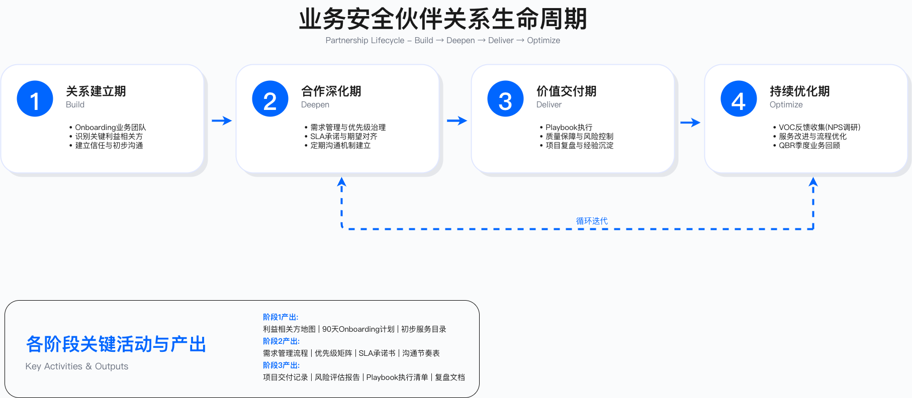

# 第 3 章：业务安全伙伴关系

本章构建系统化的业务安全伙伴关系框架，从战略定位到运营落地，覆盖 BISO 职能建设的完整路径。

---

## 章节定位

BISO（Business Information Security Officer）模式代表安全职能从"技术专家"向"业务伙伴"的根本性转型。这种转型不是简单的角色更名，而是思维方式、工作方法、价值衡量的系统性重构。

本章内容分为三个部分：战略基础、业务共创、治理与运营，形成从基础到实践的完整闭环。

---

## 章节结构

### Part 1：战略基础

[3.0 执行摘要](3.0_executive_summary.md)：本章核心观点与关键结论概述。

[3.1 BISO 职责定位与使命](3.1_biso_role_mission.md)：明确 GSBP 与 BISO 的职责边界，定义使命陈述与价值主张，绘制利益相关方地图，建立安全中心—BISO—业务线的三方协作机制。

[3.2 BISO 组织架构设计](3.2_biso_organization_design.md)：比较集中式、嵌入式、混合式三种组织模型，探讨汇报关系与双重汇报机制，设计从 Junior GSBP 到 Lead BISO 的角色分层，规划团队规模配比，建立全球 BISO 网络协作机制。

### Part 2：业务共创

[3.3 业务安全伙伴关系生命周期](3.3_business_partnership_lifecycle.md)：覆盖关系建立期（Onboarding 与信任构建）、合作深化期（需求管理与优先级治理）、价值交付期（Playbook 执行与质量保障）、持续优化期（VOC 反馈与服务改进）四个阶段。

[3.4 关键场景 Playbook](3.4_key_scenario_playbooks.md)：提供五个典型场景的标准化操作流程——产品上线安全评审（含 AI 功能评估）、营销活动风险评估（反作弊、隐私合规）、供应商接入安全评估（TPRM 全生命周期）、新兴技术安全评估（AI、区块链、物联网）、并购安全尽调。

### Part 3：治理与运营

[3.5 BISO 能力矩阵与成长路径](3.5_biso_capability_growth.md)：建立技术深度与业务广度的能力维度模型，设计技术专家→业务顾问→战略伙伴的技能演化路径，定义能力等级，构建培训、认证、导师制、社区实践（CoP）的赋能体系，设计绩效评估与激励机制。

[3.6 案例研究](3.6_case_studies.md)：分析四个实践案例——跨境电商 BISO 体系建设、金融科技全球 BISO 网络、SaaS 企业 BISO 快速响应模式、零售企业 BISO 转型，总结常见陷阱与成功要素。

[3.7 附录：模板与工具](3.7_appendix_templates_tools.md)：提供六类实用模板（BISO 使命陈述与服务目录、利益相关方地图与沟通节奏表、需求管理与优先级矩阵、Playbook 标准模板、QBR 报告模板、BISO 能力评估矩阵），推荐协作工具、GRC 平台、知识管理工具。

---

## 核心术语

本章涉及的关键术语反映了业务安全伙伴关系的核心要素：

- GSBP（Global Security Business Partner）：嵌入业务线的安全 BP，承担安全团队与业务部门之间的连接职能
- BISO（Business Information Security Officer）：面向业务单元的安全负责人，承担战略共担、治理与合规责任
- BRM（Business Relationship Management）：业务关系管理框架，用于定义伙伴关系生命周期
- Playbook：安全场景操作手册，是标准化服务交付的核心工具
- QBR（Quarterly Business Review）：季度业务回顾会议，用于汇报指标与对齐战略
- VOC（Voice of Customer）：业务反馈收集机制
- RACI：责任矩阵（Responsible, Accountable, Consulted, Informed），明确角色分工

---

## 关键指标体系

BISO 服务质量的衡量需要三类指标的平衡组合：

结果类指标关注安全成果：业务安全风险敞口变化率、重大安全事件数量、合规审计通过率、监管罚款情况。

过程类指标关注服务效率：需求 SLA 达成率、Playbook 执行率、风险例外关闭周期、供应链安全合规率。

体验类指标关注业务满意度：VOC 满意度评分、净推荐值（NPS）、业务团队自助率、培训覆盖率。

具体指标目标需根据组织实际情况和历史基线设定，避免采用无法验证的行业基准数据。

---

## 国际标准对齐

本章内容的设计参考以下国际标准与框架：

- ISO/IEC 27014（信息安全治理）：为治理结构设计提供指导
- NIST CSF 2.0（网络安全框架）：治理、识别、保护功能与实践内容对齐
- SABSA（业务驱动的安全架构）：支撑业务对齐策略
- BRM Institute Framework（业务关系管理）：为伙伴关系生命周期提供理论基础
- ISO 31000（风险管理原则）：指导风险评估与决策机制
- SFIA（技能框架）：为能力矩阵设计提供参考

---

## 章节关联

前导章节：
- [第 1 章：企业架构基础](../chapter_01_enterprise_architecture_foundation/)：建立企业架构三层体系，为 BISO 在业务架构中的定位提供基础
- [第 2 章：GRC 治理](../chapter_02_grc_governance_risk_compliance/)：定义治理框架、风险管理、合规对齐机制，为 BISO 的治理职责提供方法论支撑

后续章节：
- [第 4 章：安全架构与工程](../../part_02_technical_architecture_infrastructure_security/chapter_04_security_architecture_engineering/)：安全架构设计原则、SDL 实践，为 BISO 进行架构评审、威胁建模提供技术基础
- [第 16 章：安全领导力与组织卓越](../../part_06_security_leadership_organizational_excellence/chapter_16_security_leadership/)：安全领导力、组织文化建设，为 BISO 的影响力提升与组织变革提供战略指导

---

## 核心转变

BISO 模式的核心转变体现在五个维度：

定位转变：从"安全警察"转向"业务伙伴"，从合规驱动向价值共创演进。BISO 不再是业务流程的审批者，而是业务创新的使能者。

架构演进：采用混合式 BISO 架构（嵌入业务 + 中央支持），平衡专业性与业务对齐。这种设计避免了集中式的响应缓慢和嵌入式的标准不一。

生命周期管理：遵循关系建立→合作深化→价值交付→持续优化的四阶段模型，每个阶段有明确目标与活动。

服务标准化：通过 Playbook 覆盖常见场景，实现服务交付的一致性与可复制性。标准化不是僵化，而是为创新释放时间。

价值证明：用业务语言（上线速度、合规认证、客户赢单）而非技术术语证明价值，建立数据驱动的价值叙事。

---

## 常见问题

GSBP 和 BISO 的核心区别是什么？

GSBP 是协调员角色，单线汇报给 CISO，决策权限停留在建议层面。BISO 是业务单元的安全负责人，采用双重汇报机制（专业线向 CISO、业务线向业务 VP），拥有业务安全决策参与权。详细分析见 [3.1 节](3.1_biso_role_mission.md)。

如何确定 BISO 团队的规模？

团队规模取决于业务规模、业务复杂度、服务模式三个因素。需根据组织实际情况评估，避免采用无法验证的行业配比数据。详细规划方法见 [3.2 节](3.2_biso_organization_design.md)。

BISO 应该向谁汇报？

取决于组织模式。混合式模型推荐双重汇报：专业线向 CISO，确保技术标准与方法论一致性；业务线向业务 VP，确保优先级与资源对齐。双重汇报需要明确的责任划分，避免冲突。详细治理机制见 [3.2 节](3.2_biso_organization_design.md)。

如何快速建立与业务团队的信任？

信任构建需要系统化方法：利益相关方访谈→业务流程分析→快速赢得（解决 1-2 个业务痛点）→服务目录发布。信任破冰的关键行为：倾听而非说教、快速响应、使用业务语言。详细实践方法见 [3.3 节](3.3_business_partnership_lifecycle.md)。

---

## 贡献与反馈

本章内容基于主编的《安全BP（GSBP）与 BISO 团队建设实践指南》企业实践总结。

---

## 导航

[← 上一章](../chapter_02_grc_governance_risk_compliance/) | [返回 Part 1](../) | [返回章节导航](../../) | [→ 下一章](../../part_02_technical_architecture_infrastructure_security/chapter_04_security_architecture_engineering/)

---

**© 2025 AI-ESA Project. Licensed under CC BY-NC-SA 4.0**

