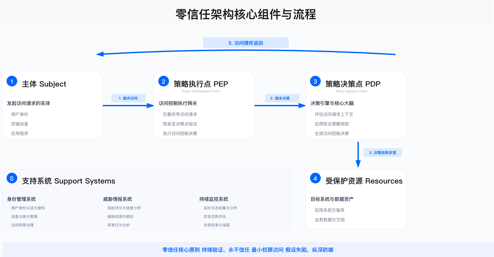
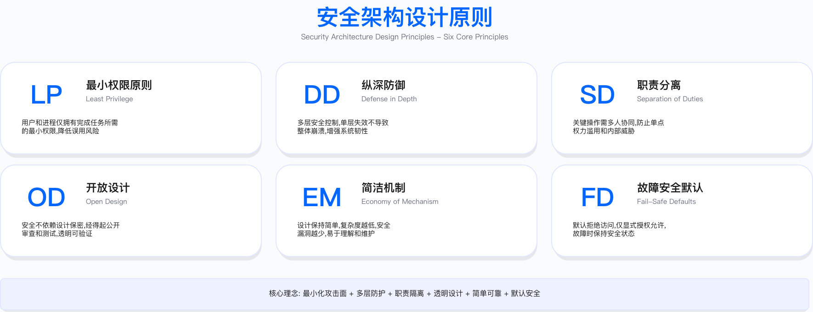
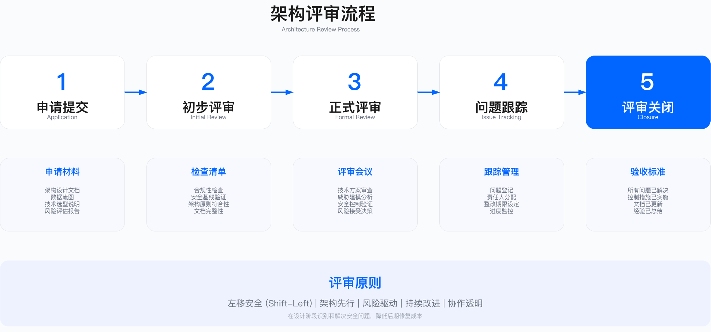

# 执行摘要 (Executive Summary)

> **本节目标**：建立从战略到技术实现的 security architecture engineering 体系，掌握主流架构框架（SABSA、TOGAF、zero trust）、威胁建模方法（STRIDE、PASTA）、安全架构模式与参考架构，为企业级安全架构设计、评审与演进提供系统化方法论。

---

## 安全架构工程的战略定位

安全架构从"技术文档"演变为"战略资产"，这一转变在云原生与零信任架构普及的过程中持续加速。企业面临的核心问题不再是"是否需要安全架构"，而是"如何通过架构设计实现安全左移、风险前置、成本可控"。

### 安全架构成为必需能力的驱动因素

三个关键变化使安全架构从可选能力升级为必需能力：

技术架构复杂度显著增加。云原生架构（Kubernetes、Serverless、微服务）使系统组件数量从数十个增至数百甚至上千个。多云与混合云环境下，每个云平台有独立的安全模型（AWS IAM、Azure AD、GCP IAM），统一治理难度加大。API 经济使系统边界模糊化，企业通常需要管理数百个 API 端点。供应链依赖深度加剧，现代应用中开源组件占比普遍较高。

攻击面持续扩大。传统网络边界防御模型效力下降，zero trust 成为架构转型的核心方向。容器逃逸、Kubernetes RBAC 配置错误、云存储桶公开暴露等新型攻击向量不断涌现。供应链攻击（如 SolarWinds、Log4Shell 事件）表明架构层面的缺陷可能影响大量下游企业。内部威胁风险上升，特权账户滥用与数据泄露成为高频安全事件类型。

架构缺陷的业务影响放大。架构级漏洞的修复成本远高于设计阶段发现并解决的成本。云配置错误已成为数据泄露的主要原因之一。缺乏标准化架构评审流程的企业，安全评审周期往往较长，可能阻碍业务上线速度。

### 安全架构的演变方向

架构模式演变：从"边界防御"向"永不信任、持续验证"的 zero trust 模式转变；architecture-as-code 通过代码管理架构（如 Terraform + OPA），实现架构合规自动化检查；软件物料清单（SBOM）在监管推动下逐步成为强制要求，架构需支持组件透明化。

业务价值体现：通过架构模式标准化，安全评审周期可从数周缩短至数天；通过架构优化（如微隔离替代传统防火墙方案），可降低云安全相关成本；架构级控制映射（如对 ISO 27001、SOC 2 的控制要求）可加速合规认证进程；架构评审可识别技术债务，避免未来高昂的重构成本。

常见实施挑战：架构文档与实际实施脱节，文档仅用于交差而非指导决策；采购多个架构相关工具（CSPM、CWPP、CNAPP）但缺乏集成，数据不互通；具备架构框架认证与实战经验的安全架构师供给不足；架构决策难以翻译为业务价值语言，导致投资优先级偏低。

---

## 章节核心目标

本章提供端到端的安全架构工程体系，帮助读者从战略规划到技术实现建立完整的架构能力。

### 战略清晰度

理解 SABSA、TOGAF、Zachman、zero trust 等主流架构框架的适用场景与选择逻辑。掌握安全架构在企业架构中的定位，建立从业务战略到技术实现的递进关系。将架构投资与业务成果对齐，用业务语言（上线速度、合规准入、风险降低）阐述架构价值。

### 方法论深度

掌握 STRIDE、PASTA、Attack Trees 等威胁建模方法，实现风险前置到设计阶段。应用最小权限、纵深防御、职责分离、安全默认等设计原则指导架构决策。建立架构评审流程（Security Design Review），实现质量门禁与决策记录（Architecture Decision Record）。

### 技术实践

设计 zero trust 架构（身份、设备、网络、应用、数据五层）并制定实施路线图。构建多层防御架构（边界、网络、主机、应用、数据），实现纵深防护。实施微隔离（microsegmentation）与 SSE/SASE 架构，支持云优先战略。建立网络、云、应用、数据等领域的安全参考架构。

### 运营卓越

建立架构评审委员会（architecture review board），制定评审流程与决策机制。实施技术选型框架（自建与购买决策、开源与商业选择），进行总拥有成本与投资回报量化分析。识别并量化技术债务，制定架构重构与现代化路线图。应用 policy-as-code（OPA、Kyverno）实现架构合规自动化检查。

---

## 核心概念与框架

### 1. 安全架构框架（4.1 节）

**SABSA 框架：业务驱动的五层模型**

SABSA (Sherwood Applied Business Security Architecture) 提供从业务到技术的完整映射。该框架的核心价值在于将安全需求与业务目标直接关联，避免安全架构成为孤立的技术决策。


| 层级 | 核心问题 | 关键产出 | 安全架构师角色 |
|-----|---------|---------|--------------|
| 业务层 (Contextual) | 为什么需要安全？ | 业务风险评估、安全战略 | 理解业务目标与风险偏好 |
| 架构师层 (Conceptual) | 需要什么安全能力？ | 安全服务目录、控制目标 | 定义安全服务与控制框架 |
| 设计师层 (Logical) | 如何实现安全？ | 安全架构蓝图、逻辑设计 | 设计 zero trust、多层防御架构 |
| 构建者层 (Physical) | 用什么技术实现？ | 技术选型、产品配置 | 选择 CSPM、CWPP、SIEM 等工具 |
| 设施管理员层 (Component) | 运营细节如何执行？ | 操作手册、配置基线 | 定义运营流程与监控指标 |

适用边界：SABSA 框架适用于需要将安全投资与业务成果直接关联的场景，尤其适合金融、医疗等强监管行业。对于技术驱动型初创企业或架构简单的小型组织，该框架可能过于重量级。

关键约束：完整实施 SABSA 需要组织具备业务架构团队与安全架构团队的协作能力；框架落地周期通常较长（按季度计），需要持续的高管赞助。

常见误区：将 SABSA 仅作为文档框架而非决策框架使用；在缺乏业务层输入的情况下直接从技术层开始设计，导致安全架构与业务脱节。

**TOGAF 安全架构：ADM 集成**

TOGAF (The Open Group Architecture Framework) 通过架构开发方法 (ADM) 将安全集成到企业架构的各个阶段：

- 阶段 A (架构愿景)：定义安全战略与利益相关方
- 阶段 B-D (BDAT 架构)：业务、数据、应用、技术四层架构的安全集成
- 阶段 E (机会与解决方案)：架构实施路线图与快速赢得项目
- 阶段 F-H (实施与治理)：架构实施、变更管理、架构合规


**零信任架构框架 (NIST SP 800-207)**

zero trust 从"网络边界"转向"身份中心"，核心原则包括：永不信任、持续验证——每次访问都需要身份验证与授权；最小权限——默认拒绝，按需授权，及时回收；假定攻陷——设计时假设攻击者已在内网，实施微隔离；动态策略——基于上下文（身份、设备、位置、行为）动态决策；全面监控——所有访问日志化、可审计、支持异常检测。



**零信任五层架构：**

| 层级 | 控制目标 | 关键技术 | 验证方法 |
|-----|---------|---------|----------|
| 身份层 | 强认证、MFA、JIT 访问 | IAM、SSO、PAM | 审计 MFA 覆盖率、特权访问日志 |
| 设备层 | 设备可信、合规检查 | MDM、EDR、设备证书 | 检查托管设备比例、合规状态 |
| 网络层 | 微隔离、加密传输 | SDP、mTLS、ZTNA | 测试东西向流量加密比例 |
| 应用层 | API 安全、最小权限 | API Gateway、RBAC | 验证 API 认证覆盖、权限粒度 |
| 数据层 | 加密、DLP、标签化 | KMS、CASB、DLP | 检查敏感数据加密状态 |

**架构框架选择决策：**

- 业务驱动、需要战略对齐：选择 SABSA (适合金融、医疗等强监管行业)
- 已有企业架构团队、需要集成：选择 TOGAF
- 云优先、远程办公、SaaS 化转型：选择 zero trust
- 需要快速启动、控制清单驱动：选择 CSA CCM 或 NIST CSF

### 2. 架构设计原则（4.2 节）

**六大核心原则**

| 原则 | 定义 | 架构决策示例 | 常见违反场景 |
|-----|------|------------|------------|
| 最小权限 | 默认拒绝，按需授权，及时回收 | IAM 策略最小化、临时凭证、JIT 访问 | 使用通配符权限（`*:*`）、永久密钥 |
| 纵深防御 | 多层防护，单点失败不导致全局攻陷 | WAF + RASP + 代码审查 + 运行时监控 | 仅依赖边界防火墙 |
| 职责分离 | 关键操作需多人协作，避免单点权力 | 生产变更需双人审批、Root 账户分离 | 开发人员拥有生产环境 Root 权限 |
| 公开设计 | 安全不依赖算法保密，而是密钥管理 | 使用 AES-256 而非自研加密算法 | 通过混淆实现"安全" |
| 经济机制 | 设计简洁，复杂度是安全的敌人 | 使用托管服务而非自建复杂系统 | 过度设计导致无法维护 |
| 安全默认 | 默认配置是安全的，失败时安全关闭 | S3 桶默认私有、Fail-Close 策略 | 默认开放、需手动加固 |



**验证方法：** 通过 IAM 策略审计工具检查权限范围；通过渗透测试验证纵深防御有效性；通过审计日志验证职责分离执行情况；通过配置基线扫描验证安全默认落地。

**运行指标：** IAM 策略中通配符使用数量（应趋近于零）；单点权限用户数量（应持续下降）；安全配置偏离基线的资源数量。

**纵深防御：Web 应用七层防护示例**

1. 边界层：CDN + DDoS 防护
2. 网络层：VPC 隔离 + Security Groups + Network ACL
3. 负载均衡层：ALB + SSL/TLS 终结 + WAF 规则
4. 应用层：代码审查 (SAST) + 安全测试 (DAST) + RASP
5. 数据层：数据库加密 (TDE) + 字段级加密 + 备份加密
6. 身份层：MFA + SSO + 会话管理 + RBAC
7. 监控层：日志审计 + 异常检测 + SIEM


### 3. 威胁建模（4.3 节）

**STRIDE 方法：六类威胁分析**

STRIDE 是微软开发的威胁建模方法，系统化识别六类威胁：

| 威胁类别 | 定义 | 示例攻击 | 缓解措施 |
|---------|------|---------|---------|
| Spoofing (欺骗) | 伪装身份 | 钓鱼邮件、会话劫持 | MFA、数字签名、证书验证 |
| Tampering (篡改) | 修改数据或代码 | SQL 注入、中间人攻击 | 输入验证、加密传输、完整性校验 |
| Repudiation (否认) | 否认操作 | 删除日志、无审计跟踪 | 审计日志、数字签名、不可否认性 |
| Information Disclosure (信息泄露) | 未授权访问数据 | 数据泄露、配置错误 | 加密、访问控制、最小权限 |
| Denial of Service (拒绝服务) | 系统不可用 | DDoS、资源耗尽 | 限流、弹性扩展、冗余设计 |
| Elevation of Privilege (特权提升) | 获取高权限 | 漏洞利用、配置错误 | 最小权限、输入验证、沙箱隔离 |


**STRIDE 四步实施流程：**

1. 绘制数据流图 (DFD)：识别系统边界、信任边界、数据流、外部实体
2. 识别威胁：对每个数据流、存储、处理应用 STRIDE 检查表
3. 风险评级：使用 DREAD 或其他风险评估方法进行评分
4. 缓解方案：优先修复高风险威胁，对低风险威胁进行接受、转移或降低处理

**适用边界：** STRIDE 适用于中等复杂度的系统设计阶段威胁分析，对于高度复杂的分布式系统，可结合 PASTA 方法进行更深入的攻击模拟。

**常见误区：** 仅在项目初期进行一次威胁建模而不持续更新；威胁建模停留在文档层面，识别的威胁未纳入缺陷跟踪系统。

**验证方法：** 通过红队测试验证威胁缓解措施有效性；检查识别的威胁是否有对应的控制措施；定期复审威胁模型与实际架构的一致性。

### 4. 安全架构模式（4.4 节）

**零信任架构：端到端设计**

传统边界防御与 zero trust 架构的核心差异：

| 维度 | 传统边界防御 | 零信任架构 |
|-----|------------|-----------|
| 信任模型 | 内网可信，外网不可信 | 永不信任，持续验证 |
| 访问控制 | 基于网络位置（IP/VLAN） | 基于身份 + 上下文（设备、位置、行为） |
| 网络架构 | 城堡 + 护城河（DMZ） | 微隔离 + 加密通信 |
| 横向移动 | 内网自由访问 | 最小权限 + 工作负载隔离 |
| 远程访问 | VPN（网络级访问） | ZTNA（应用级访问） |
| 监控 | 边界流量监控 | 全流量监控 + 行为分析 |

**零信任实施路线图：**

- 阶段 1 (0-6 月)：身份基础——部署 SSO，MFA 全面覆盖；建立 PAM 系统管理特权账户；实施 JIT 访问，临时授权替代永久权限
- 阶段 2 (6-12 月)：网络微隔离——实施 SDP 或 ZTNA；部署东西向流量加密 (mTLS、Service Mesh)；实施网络分段 (Kubernetes NetworkPolicy、AWS Security Groups)
- 阶段 3 (12-18 月)：应用与数据——部署 API Gateway，统一认证授权；实施数据分类分级，敏感数据加密；部署 CASB/DLP，监控 SaaS 应用与数据流
- 阶段 4 (18-24 月)：持续验证——部署用户行为分析，实现异常检测；实施动态策略引擎，基于风险评分调整权限；建立持续合规监控，自动化架构验证

**关键约束：** zero trust 转型需要身份基础设施成熟度达到一定水平（至少完成统一身份平台建设）；组织文化需要接受"持续验证"理念，可能面临用户体验与安全性的权衡。

**微隔离架构：工作负载级隔离**

**微隔离实施层级：**
1. 网络层：Kubernetes NetworkPolicy、AWS Security Groups
2. 主机层：iptables 规则、Windows Firewall
3. 应用层：Service Mesh（Istio、Linkerd）、API Gateway
4. 工作负载层：Illumio、VMware NSX、Guardicore


**SSE/SASE 架构：云安全服务边缘**

SASE (Secure Access Service Edge) = SSE + SD-WAN

**SSE 四大组件：**
1. CASB (Cloud Access Security Broker)：监控与控制 SaaS 应用访问
2. SWG (Secure Web Gateway)：URL 过滤、恶意软件防护、数据防泄漏
3. ZTNA (Zero Trust Network Access)：应用级访问替代 VPN
4. FWaaS (Firewall as a Service)：云原生防火墙


### 5. 架构评审与验证（4.5 节）

**架构评审委员会 (ARB) 运作机制**

**ARB 组成：** 常设成员包括 CISO、首席架构师、安全架构负责人、技术 VP；按需成员包括业务架构师、应用架构师、云架构师、GRC 负责人。建议每周召开例会，同时支持按需紧急评审。

**五步评审流程：**

| 阶段 | 时间 | 活动 | 产出物 |
|-----|------|------|--------|
| 1. 申请 | Day 1-2 | 提交架构文档、DFD、风险评估 | 评审申请单 |
| 2. 初审 | Day 3-4 | 安全架构师预审，识别高风险点 | 初审意见 |
| 3. 正式评审 | Day 5-7 | ARB 会议，威胁建模，决策 | 评审报告、ADR |
| 4. 跟踪 | Day 8-30 | 跟踪缓解措施实施进度 | 状态更新 |
| 5. 关闭 | Day 30+ | 验证缓解措施，关闭评审 | 关闭报告 |



**架构决策记录 (ADR) 模板：**

```markdown
# ADR-001: 采用 OAuth 2.0 + PKCE 进行移动应用认证

## 状态
已批准 (日期)

## 背景
移动应用需要安全认证机制，传统密码方式用户体验差且安全风险高。

## 决策
采用 OAuth 2.0 Authorization Code Flow with PKCE，替代用户名密码认证。

## 理由
- PKCE 防止授权码拦截攻击 (移动应用无法安全存储 Client Secret)
- 行业标准 (IETF RFC 7636)，工具支持完善
- 支持 SSO，提升用户体验

## 后果
- 需部署 OAuth 2.0 服务器
- 开发周期增加 (SDK 集成 + 测试)
- 长期收益：安全性提升 + 用户体验改善

## 合规性
满足 OWASP MASVS L2 要求、PCI-DSS 8.2.1 要求

## 替代方案
- 方案 A：用户名密码——被否决 (安全风险高)
- 方案 B：客户端证书——被否决 (用户体验差)
```

**架构合规自动化检查**

使用 policy-as-code 实现架构验证：

```rego
# OPA 策略：禁止 S3 桶公开访问
package aws.s3

deny[msg] {
  resource := input.resource_changes[_]
  resource.type == "aws_s3_bucket"
  resource.change.after.acl == "public-read"

  msg := sprintf("S3 桶 %v 不得设置为公开访问", [resource.address])
}
```

**架构度量指标：**
- 覆盖率：关键系统有架构文档的比例
- 评审率：重大项目经过 ARB 评审的比例
- 偏离率：实际实施与架构蓝图的一致性
- 修复率：架构评审发现的高危风险修复率

### 6. 技术选型与决策（4.6 节）

**技术选型框架**

**选型评估维度：**

| 维度 | 评估标准 | 评分方法 |
|-----|---------|---------|
| 安全性 | 安全能力、合规认证、漏洞响应 | SOC 2/ISO 27001 认证、CVE 响应速度 |
| 架构兼容性 | 技术栈兼容、扩展性、集成能力 | API 丰富度、云原生支持 |
| 成本 | TCO、ROI、许可模式 | 多年总成本、价值量化 |
| 易用性 | 易用性、文档、社区支持 | POC 验证、行业评价 |

**自建与购买决策矩阵：**

| 因素 | 倾向自建 | 倾向购买 |
|-----|---------|---------|
| 核心竞争力 | 是 (如定制化风控引擎) | 否 (如通用 SIEM) |
| 差异化需求 | 高 (独特需求) | 低 (通用功能) |
| 上线速度 | 可接受较长周期 | 需要快速上线 |
| 技术能力 | 团队充足 | 团队不足 |
| 供应商依赖 | 需要避免 | 可接受 |

### 7. 安全参考架构（4.7 节）

本节提供网络、云、应用、数据等领域的安全参考架构，详细内容见 4.7 节。

### 8. 架构演进与债务管理（4.8 节）

**技术债务分类：**

| 类型 | 定义 | 示例 |
|-----|------|------|
| 架构债务 | 架构设计缺陷 | 单体应用、紧耦合 |
| 安全债务 | 已知漏洞未修复 | Log4Shell、SQL 注入 |
| 合规债务 | 不满足法规要求 | GDPR、SOC 2 缺口 |
| 运营债务 | 手工流程、缺乏监控 | 无自动化、无告警 |

**架构重构策略：**

1. 绞杀者模式 (Strangler Fig)：适用于单体应用微服务化，逐步将功能迁移至新系统，风险可控、可回滚
2. 渐进式重构：适用于代码质量改进、技术栈升级，每次迭代重构一小部分
3. 大爆炸重构：适用于遗留系统完全废弃、平台迁移，风险较高，需充分测试

---

## 关键成功要素

### 高管赞助与架构治理

成立架构评审委员会 (ARB)，由 CISO 或 CTO 担任主席。重大项目必须通过 ARB 评审。安全架构投入应在 IT 预算中有明确占比。

### 架构师能力建设

投资 SABSA、TOGAF、CISSP-ISSAP 等认证培训。保持持续学习，定期参加架构领域会议与交流。通过实战项目积累经验，每年主导多个架构设计项目。

### 工具与自动化

**架构建模工具：** ArchiMate、Draw.io、Lucidchart。**policy-as-code：** OPA、Kyverno 实现架构合规自动化。**CSPM/CWPP：** 持续监控云架构合规性。**威胁建模工具：** Microsoft Threat Modeling Tool、IriusRisk。

### 持续演进与文档化

季度更新架构蓝图，保持与实际一致。所有重大架构决策记录在案 (ADR)，可追溯。建立架构模式库与参考架构知识库。年度架构健康检查，识别漂移与债务。

---

## 常见陷阱

| 陷阱 | 描述 | 避免方法 |
|-----|------|---------|
| 过度设计 | 追求理论完美，导致无法落地 | MVP 架构，渐进式优化 |
| 架构漂移 | 实际实施偏离架构蓝图 | 自动化合规检查（policy-as-code） |
| 文档过时 | 架构文档与实际不符 | architecture-as-code，自动生成 |
| 孤岛决策 | 安全架构与业务 / IT 架构脱节 | 嵌入企业架构治理流程 |
| 工具堆砌 | 采购多个工具但不集成 | 制定工具集成策略，统一平台 |
| 忽视遗留系统 | 仅关注新系统，忽视遗留风险 | 建立遗留系统风险清单，补偿控制 |

---

## 衡量成功

### 架构成熟度指标

- 架构覆盖率：关键系统有完整架构文档的比例
- 评审通过率：首次架构评审通过的比例
- 架构偏离率：实际实施与架构蓝图的一致性
- ADR 完整性：重大架构决策有 ADR 记录的比例

### 业务成果指标

- 上线速度：安全架构评审周期
- 安全事件：架构缺陷导致的高优先级事件数量
- 合规认证：架构支持的认证数量 (SOC 2、ISO 27001、PCI-DSS)
- 成本优化：通过架构优化节省的云成本

### 技术债务指标

- 债务总量：已识别但未修复的架构级缺陷
- 债务修复率：计划债务按时修复的比例
- 债务成本：技术债务的量化成本

---

## 实施路径建议

安全架构不是一次性项目，而是持续演进的能力体系。建议的实施路径：

**建立基线 (0-3 个月)：** 绘制当前架构现状 (as-is architecture)；识别架构债务与风险热点；建立架构评审委员会与评审流程；培训首批架构师。

**定义目标 (3-6 个月)：** 设计目标架构蓝图 (to-be architecture)；选择架构框架 (SABSA、TOGAF 或 zero trust)；制定架构演进路线图；建立架构原则库与安全模式库。

**迭代实施 (6-18 个月)：** 按优先级推进架构改进项目 (zero trust、微隔离、云安全)；实施威胁建模，覆盖关键业务；部署 policy-as-code，自动化架构合规检查；建立参考架构 (网络、云、应用、数据)。

**持续优化 (18 个月以后)：** 架构成熟度定期评估 (年度)；新技术架构集成 (AI 安全、zero trust 深化)；架构最佳实践提炼与分享；建立架构师协作网络。

---

## 本节小结

本章围绕安全架构工程体系展开，核心内容包括：

**架构框架：** SABSA (业务驱动)、TOGAF (企业架构集成)、zero trust (现代化) 三大框架，根据组织成熟度与业务场景选择。

**设计原则：** 最小权限、纵深防御、职责分离、安全默认等六大原则指导所有架构决策。

**威胁建模：** STRIDE、PASTA 方法实现风险前置，设计阶段修复成本远低于生产阶段。

**架构模式：** zero trust、微隔离、SSE/SASE 是云原生时代的核心架构模式。

**评审治理：** ARB 架构评审委员会 + ADR 决策记录 + policy-as-code 自动化验证。

**持续演进：** 技术债务量化管理，架构重构策略 (绞杀者、渐进式、大爆炸)。

安全架构的本质不是"堆砌安全产品"，而是"用精简的架构实现业务风险的有效控制，同时支持业务创新与快速迭代"。

---

**下一节预告**：[4.1 安全架构框架](./4.1_security_architecture_frameworks.md)——深入 SABSA 五层模型、TOGAF ADM、Zachman 框架、零信任架构的详细设计与应用。

---

## 导航

**[← 返回章节目录](./README.md)** | **[→ 下一节：4.1 安全架构框架](./4.1_security_architecture_frameworks.md)**

---

**© 2025 AI-ESA Project. Licensed under CC BY-NC-SA 4.0**

