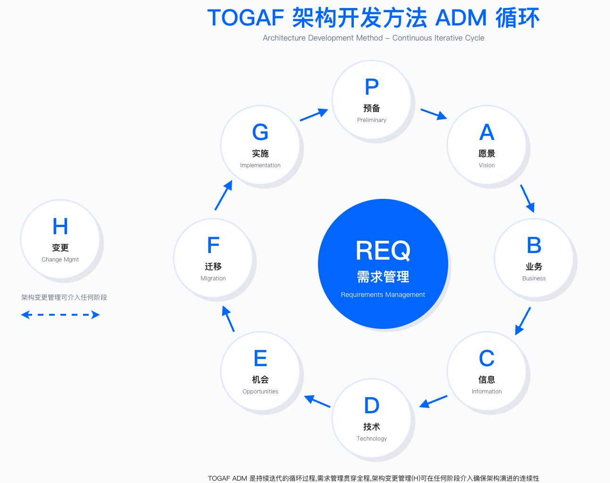
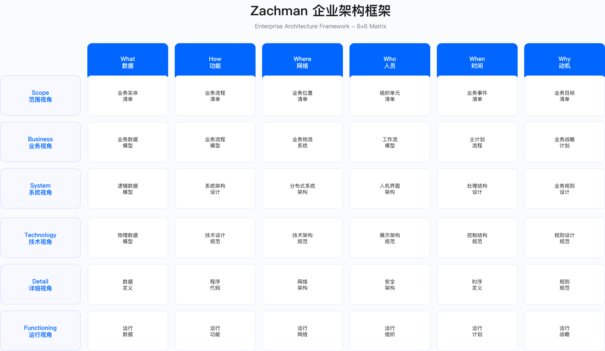

# 4.1 安全架构框架

> **本节目标**：理解主流安全架构框架（SABSA、TOGAF、Zachman、ESA、零信任）的核心理念、适用边界与选择标准，为企业安全架构建设提供方法论基础。

---

## 4.1.1 SABSA 框架

### 框架定位与核心理念

SABSA（Sherwood Applied Business Security Architecture）是一个业务驱动的安全架构框架，其核心主张是"安全架构必须从业务需求出发，而非从技术出发"。SABSA 通过多层视图模型，建立从业务目标到技术控制的可追溯链路，使安全投资决策能够与业务成果直接关联。

SABSA 的核心理念包括三个维度：第一，安全架构设计必须基于对业务驱动因素的理解，而非技术能力的堆砌；第二，采用分层模型确保战略意图到实施细节的一致性；第三，所有架构决策都应基于风险评估结果，而非主观判断。

### SABSA 六层模型

SABSA 采用六层架构视图，每一层回答不同的架构问题：

Contextual Layer（情境层）处理"为什么需要安全"的问题。这一层的输入是业务战略、风险偏好、监管要求，输出是业务安全需求文档与安全目标定义。情境层的工作通常需要与业务高管、法务、审计等利益相关方深度协作。

Conceptual Layer（概念层）处理"需要保护什么"的问题。基于情境层识别的业务需求，概念层定义信息资产清单、安全服务目录、安全策略框架。这一层的关键产出是将抽象的业务需求转化为可操作的安全服务定义。

Logical Layer（逻辑层）处理"如何实现安全"的问题。逻辑层设计安全控制框架、安全机制、逻辑架构。控制框架通常映射到 NIST CSF、ISO 27002 等成熟标准，避免重新发明轮子。

Physical Layer（物理层）处理"谁在哪里何时实施"的问题。物理层选择具体的安全产品、技术栈、网络拓扑、部署方案。这一层需要平衡技术理想与现实约束（预算、时间、人员能力）。

Component Layer（组件层）处理"用什么工具"的问题。组件层定义具体产品的配置标准、集成规范、部署脚本。

Operational Layer（运营层）处理"运营得如何"的问题。运营层建立监控流程、度量指标体系、持续改进机制。

### SABSA 矩阵视图

SABSA 使用 6 × 6 矩阵（六层 × 六个维度）进行架构设计，六个维度分别是：Assets（资产）、Motivation（动机）、Process（流程）、People（人员）、Location（位置）、Time（时间）。

| 层级 | 资产 | 动机 | 流程 | 人员 | 位置 | 时间 |
|------|------|------|------|------|------|------|
| 情境层 | 业务资产 | 业务目标与风险 | 业务流程 | 组织结构 | 业务地点 | 业务时间线 |
| 概念层 | 信息资产 | 安全目标 | 安全服务 | 安全角色 | 信任域 | 安全生命周期 |
| 逻辑层 | 数据实体 | 安全原则 | 安全流程 | 用户与角色 | 逻辑边界 | 状态转换 |
| 物理层 | 应用与数据库 | 控制目标 | 技术架构 | 身份管理 | 网络拓扑 | 事件序列 |
| 组件层 | 产品与工具 | 标准与规范 | 配置与脚本 | 账户与权限 | 地址与协议 | 计划任务 |
| 运营层 | 监控对象 | SLA/OLA | 运营流程 | 运营团队 | 运营站点 | 运营窗口 |

矩阵视图的价值在于确保每一层的设计都覆盖了所有必要维度，避免遗漏。在实际应用中，并非所有 36 个单元格都需要同等深度的设计，应根据组织的成熟度和项目范围进行裁剪。

### 适用边界与关键约束

适用场景：SABSA 适合需要系统性、业务驱动型安全架构转型的大型企业，特别是以下情况：金融机构的全面安全架构重构；跨国企业需要协调多国合规要求与全球统一标准；强监管行业需要向监管机构证明安全架构的可追溯性；大规模云迁移项目需要重新设计安全架构。

不适用场景：中小型企业或安全团队资源有限的组织；需要快速见效的项目（SABSA 的完整实施周期较长）；组织架构成熟度较低、高管参与度不足的企业。

关键约束：
- 组织能力约束：SABSA 要求架构师具备跨业务与技术的复合能力，能够与高管对话业务目标，同时精通技术细节。这类人才稀缺，培养周期长。
- 时间成本约束：完整的 SABSA 架构设计周期通常以月计，中型企业需要预留充足时间，大型企业周期更长。项目初期产出缓慢，需要管理层耐心。
- 高管参与约束：情境层和概念层的设计需要业务高管深度参与，若高管仅将安全视为成本中心或 IT 部门职责，SABSA 落地将面临阻力。

### 常见误区

误区一：将 SABSA 简化为"写安全策略文档"。SABSA 的核心价值在于业务对齐与可追溯性，而非文档本身。若仅产出一份策略文档而无法回答"这个控制为什么存在、它保护什么业务目标"，则失去了框架的核心价值。

误区二：期望 SABSA 提供现成的技术方案。SABSA 是方法论框架，不是技术参考架构。它告诉你"如何思考安全架构设计"，但不提供"用什么产品、如何配置"的具体答案。技术选型仍需结合组织实际情况。

误区三：在组织准备度不足时强推 SABSA。若业务部门不理解安全的业务价值、高管不愿参与架构讨论，强行推行 SABSA 会导致流程空转——产出大量无人阅读的文档，却未能改变安全决策方式。

### 验证方法

验证 SABSA 实施有效性的方法包括：
- **可追溯性测试**：随机选取一个技术控制（如"生产数据库必须加密"），向上追溯能否找到对应的逻辑层安全机制、概念层安全服务、情境层业务需求。若链路断裂，说明设计不完整。
- **业务对齐测试**：向业务负责人展示安全架构文档，询问"这份架构如何支持你的业务目标"。若业务负责人无法理解或认为与业务无关，说明情境层工作不到位。
- **变更影响测试**：当业务需求变更时（如进入新市场、推出新产品），评估安全架构是否能够快速识别受影响的层级并进行调整。

### 运行指标

SABSA 架构运营阶段应关注的指标：
- **架构覆盖率**：已完成 SABSA 设计的项目/系统占比（按业务关键性加权）
- **可追溯性完整度**：能够完整追溯至情境层的控制占总控制数的比例
- **业务对齐评分**：业务利益相关方对安全架构支持业务目标程度的评分（定期调研）
- **架构偏离数量**：实际实施与架构设计存在偏差的项目数量及严重程度

---

## 4.1.2 TOGAF 安全架构

### 框架定位

TOGAF（The Open Group Architecture Framework）是全球应用最广泛的企业架构框架。TOGAF 本身不是安全专用框架，但通过架构开发方法（ADM）提供了将安全集成到企业架构的标准化流程。

### TOGAF ADM 中的安全集成点

TOGAF ADM 是一个迭代循环，包含八个阶段（A-H）加上贯穿始终的需求管理。安全架构可在以下阶段集成：

阶段 A（架构愿景）：识别安全相关的业务驱动因素，定义安全目标与范围，识别安全利益相关者。这一阶段应明确安全架构在整体企业架构中的定位。

阶段 B（业务架构）：分析业务流程中的安全控制点，定义角色与职责的安全考量，规划业务连续性与灾难恢复需求。

阶段 C（信息系统架构）：在数据架构中定义数据分类分级与保护要求；在应用架构中定义应用安全控制与 API 安全。

阶段 D（技术架构）：设计网络安全架构、身份与访问管理、安全基础设施（防火墙、IDS/IPS、SIEM 等）。

阶段 E-H（机会与解决方案、迁移规划、实施治理、架构变更管理）：安全解决方案选型与验证、安全实施路线图、安全控制的持续监控与改进。

### TOGAF + SABSA 组合应用

在实践中，许多企业采用"TOGAF 作为整体企业架构框架 + SABSA 作为安全架构专项补充"的组合模式。这种组合的逻辑在于：TOGAF 提供企业架构设计的流程框架和治理机制，但在安全领域的深度不足；SABSA 专注于安全架构的业务驱动性和层次可追溯性，但缺少全流程方法论支撑。

组合应用的典型模式是在 TOGAF ADM 的每个阶段嵌入 SABSA 的安全视图：阶段 A 同步完成 SABSA 情境层设计；阶段 B 同步完成概念层设计；阶段 C-D 同步完成逻辑层和物理层设计。

治理层面的整合通常采用双层架构：在 TOGAF 的架构委员会（Architecture Board）下设安全架构子委员会，由 CISO 或首席安全架构师担任主席。安全架构的重大决策先经安全架构子委员会评审，通过后再提交架构委员会批准。

| 维度 | TOGAF | SABSA | 组合策略 |
|------|-------|-------|----------|
| 范围 | 企业整体架构 | 安全架构专项 | TOGAF 定义整体框架，SABSA 深化安全层 |
| 方法 | ADM 循环（8 阶段迭代） | 六层模型（自上而下推导） | ADM 各阶段嵌入 SABSA 安全视图 |
| 产出 | 架构工件（愿景、原则、路线图） | 安全工件（威胁模型、控制框架） | 统一文档体系，安全工件作为架构工件附件 |
| 治理 | 架构委员会 | 安全架构委员会 | 双层治理，安全决策先经安全子委员会评审 |

### 适用边界与常见误区

适用场景：已有企业架构团队和 TOGAF 实践基础的组织；需要将安全架构与业务架构、应用架构、技术架构统一治理的场景。

不适用场景：缺乏企业架构基础的组织（直接采用 SABSA 或 ESA 可能更合适）；仅需要设计单一领域安全架构（如云安全）的项目。

常见误区：将 TOGAF 视为安全框架而非企业架构框架；期望 TOGAF ADM 提供安全设计的具体指导（TOGAF 只提供流程框架，安全内容需要另行补充）；在没有企业架构团队支持的情况下单独推行 TOGAF 安全架构。

---

## 4.1.3 Zachman 框架

### 框架定位

Zachman Framework 是最早的企业架构分类框架（1987 年提出），采用 6 × 6 矩阵对企业架构进行系统化分类。Zachman 框架本质上是一个分类体系，而非方法论——它告诉你"企业架构应该包含哪些内容"，但不告诉你"如何设计这些内容"。

### Zachman 矩阵结构

Zachman 矩阵的六行代表不同视角（规划者、所有者、设计者、建造者、实施者、使用者），六列代表不同维度（What/数据、How/功能、Where/网络、Who/人员、When/时间、Why/动机）。

在安全架构中，各维度的应用如下：

What（数据）维度：数据分类分级、敏感数据清单、数据流分析。安全架构师需要回答"哪些数据需要保护、保护到什么程度"。

How（功能）维度：安全功能需求、安全控制设计、安全流程。回答"需要哪些安全能力、如何实现"。

Where（网络）维度：网络安全区域、信任边界、数据中心与云位置。回答"安全边界在哪里、如何划分信任域"。

Who（人员）维度：身份管理、访问控制、角色与权限。回答"谁可以访问什么、如何验证身份"。

When（时间）维度：访问时间控制、安全事件时序、日志保留策略。回答"何时允许访问、记录保留多久"。

Why（动机）维度：安全目标、合规要求、风险管理策略。回答"为什么需要这些控制"。

### 适用边界与约束

优势：提供全面系统的分类框架，确保架构设计不遗漏关键维度；与其他框架兼容性好，可作为 SABSA 或 TOGAF 的补充；适合大型复杂企业进行架构盘点。

局限：偏重分类，缺乏方法指导——知道"应该设计什么"但不知道"如何设计"；学习曲线陡峭，完整填充 36 个单元格需要大量工作；需要结合其他方法论（如 SABSA、TOGAF）使用才能发挥价值。

常见误区：试图完整填充所有 36 个单元格（应根据组织需求裁剪）；将 Zachman 作为独立的设计方法论使用（应结合 SABSA 或 TOGAF）。

---

## 4.1.4 企业安全架构（ESA）

### 框架定位

Enterprise Security Architecture（ESA，企业安全架构）是将安全纳入企业架构治理的系统性方法。ESA 通常不指某一个具体的框架，而是指企业整合多种框架和方法后形成的安全架构实践体系。

### ESA 核心组件

ESA 通常包含五层：

战略层：定义安全愿景与使命、安全目标、风险偏好、投资策略。战略层与企业整体战略对齐，确保安全工作服务于业务目标。

治理层：建立安全政策、架构原则、标准与规范、架构评审机制。治理层确保安全决策的一致性和可追溯性。

能力层：构建安全能力域，包括身份管理、数据保护、网络安全、应用安全、威胁检测、事件响应、合规管理等。能力层是 ESA 的核心，定义"组织需要具备哪些安全能力"。

实施层：选择安全产品、安全服务、安全流程、安全工具。实施层将能力层的抽象定义转化为具体的技术和流程。

运营层：执行监控告警、事件处理、度量报告、持续改进。运营层确保安全架构持续有效运行。

### ESA 设计原则

ESA 的设计应遵循以下原则：业务对齐（安全架构必须支持业务目标）、风险驱动（基于风险评估进行架构决策）、标准化与复用（建立标准模式与参考架构）、纵深防御（多层次、多维度的安全控制）、可演进性（架构能够适应业务与技术变化）、可度量性（架构效果可量化、可报告）。

### 适用边界与约束

适用场景：需要整合多种框架和方法的企业；希望建立实用的安全架构体系但不需要完整 SABSA 或 TOGAF 的组织；中等规模企业的安全架构建设。

关键约束：ESA 没有标准化的方法论，不同组织的 ESA 实践差异较大；缺乏官方认证体系，人才评估标准不统一；需要根据组织实际情况进行大量定制。

---

## 4.1.5 零信任架构框架

### 核心原则

NIST SP 800-207 定义了零信任架构的核心原则：

Never Trust, Always Verify（永不信任，始终验证）：不因用户或设备处于内网而默认信任，每次访问都需要验证身份、设备状态、访问上下文。

Assume Breach（假设违约）：假设攻击者已经在内网中，设计安全控制时考虑如何限制横向移动和数据泄露。

Least Privilege Access（最小权限访问）：用户和服务只获得完成任务所需的最小权限，且权限应动态调整而非静态授予。

Microsegmentation（微隔离）：将网络划分为细粒度的安全区域，每个区域之间的通信都需要经过策略验证。

Continuous Monitoring（持续监控与验证）：不是一次性认证后就放行，而是在整个会话期间持续评估风险并动态调整访问权限。

### 零信任架构逻辑组件

零信任架构的核心组件包括：

Policy Enforcement Point（PEP，策略执行点）：位于主体（用户、设备、工作负载）与资源之间，执行访问控制决策。PEP 可以是网关、代理、防火墙、微服务边车等形式。

Policy Decision Point（PDP，策略决策点）：接收 PEP 的策略查询，基于策略引擎和信任评估结果做出授权决策。PDP 通常实现动态授权逻辑。

策略引擎支撑系统：为 PDP 提供决策所需的信息，包括身份目录、设备清单、威胁情报、SIEM、风险评分引擎等。

### 零信任成熟度模型

NIST 和 CISA 定义了零信任成熟度级别，从传统的基于边界的安全逐步演进到全面的零信任架构：

| 级别 | 名称 | 特征 | 典型控制 |
|------|------|------|----------|
| 1 | 传统 | 基于边界的安全，VPN 访问 | 网络分段、边界防火墙 |
| 2 | 初级 | 部分零信任控制，MFA 部署 | MFA、设备管理、基础 IAM |
| 3 | 中级 | 动态访问控制，微隔离 | 条件访问、微隔离、CASB |
| 4 | 高级 | 全面零信任，自动化响应 | 动态策略、行为分析、自动隔离 |
| 5 | 优化 | 持续适应，智能化 | 自适应认证、持续评估、预测性防御 |

### 零信任实施路径

零信任架构的实施是一个多年转型项目，通常采用渐进式、分阶段的策略。NIST SP 800-207 和 CISA 零信任成熟度模型推荐采用 Crawl-Walk-Run（"爬行→行走→奔跑"）的演进路径。

第一阶段：身份与设备基础

这个阶段的核心目标是建立"身份即新边界"的基础能力。主要任务包括：部署企业级多因素认证（MFA）覆盖所有关键应用；建立设备清单与设备信任评分机制；实施设备合规检查策略（如要求访问敏感资源的设备必须安装 EDR、启用磁盘加密）。

第二阶段：网络与应用

基于第一阶段的身份和设备信任基础，部署应用代理或 ZTNA（零信任网络访问）解决方案，替代传统 VPN 的"全网信任"模式；实施网络微隔离，将传统的大平面网络切分为细粒度微段；加固 API 安全，部署 API 网关统一管理认证、授权、速率限制。

第三阶段：数据与工作负载

将零信任原则扩展到数据层和云原生工作负载。完成数据分类与加密，为不同级别数据定义加密标准和访问控制策略；实施工作负载身份，使用 SPIFFE/SPIRE 等框架为容器、微服务颁发身份；部署服务网格实现工作负载间的 mTLS 加密和细粒度授权。

第四阶段：自动化与优化

通过自动化和行为分析提升零信任系统的效率。部署 SOAR 平台自动编排安全响应流程；引入 UEBA 技术检测异常行为并自动触发风险响应；实现自适应访问控制，根据实时风险评分动态调整访问策略。

### 适用边界与关键约束

适用场景：远程办公和混合办公成为常态的企业；云原生和多云环境；需要与大量第三方、供应商协作的企业；已经发生过因 VPN 或内网横向移动导致的安全事件的组织。

不适用场景：OT（操作技术）环境需要特殊适配，不能直接套用 IT 侧的零信任方案；遗留系统可能无法支持现代认证协议；组织变革管理能力不足的企业。

关键约束：
- 技术栈约束：零信任需要对现有身份管理、网络架构、应用架构进行改造，遗留系统的兼容性是主要障碍。
- 用户体验约束：过于严格的验证策略可能影响员工生产力，需要在安全与体验之间寻找平衡。
- 成本约束：零信任工具链（ZTNA、微隔离、UEBA 等）的采购和运营成本较高。
- 组织文化约束：零信任意味着"默认不信任"，这与一些组织"信任员工"的文化可能冲突。

### 常见误区

误区一：认为零信任是一个产品。零信任是架构理念和设计原则，不是某个产品。任何声称"买了我们的产品就实现了零信任"的厂商都在误导。

误区二：试图一步到位实现全面零信任。零信任转型需要多年持续投入，"大爆炸"式实施风险极高。应从高价值资产和高风险场景开始，渐进式推进。

误区三：忽视用户体验导致绕过行为。如果零信任策略过于繁琐（如每次操作都需要多次认证），用户会寻找绕过方式（如共享账户、搭建跳板机），反而增加风险。

### 验证方法

- 红队演练：模拟攻击者已获取一个普通用户凭据，验证能否横向移动到高价值资产。
- 策略覆盖测试：验证所有关键资源的访问是否都经过 PEP/PDP 的策略评估。
- 设备合规测试：使用非合规设备（如未安装 EDR）尝试访问敏感资源，验证是否被阻断。
- 会话劫持测试：在会话过程中模拟设备风险变化，验证系统是否能够动态调整权限。

### 运行指标

- MFA 覆盖率：启用 MFA 的用户/应用占比
- 设备合规率：满足合规策略的设备占比
- ZTNA 覆盖率：通过 ZTNA 而非 VPN 访问的应用占比
- 微隔离覆盖率：已实施微隔离的工作负载占比
- 策略拒绝率：被零信任策略拒绝的访问请求占比（过高可能说明策略过严或配置错误）
- 横向移动检测率：检测到的横向移动尝试数量及响应时间

---

## 4.1.6 框架对比与选择

### 框架对比矩阵

在选择安全架构框架时，需要理解不同框架的定位差异：

| 维度 | SABSA | TOGAF | Zachman | ESA | 零信任 |
|------|-------|-------|---------|-----|--------|
| 定位 | 安全专用框架 | 企业架构框架 | 分类框架 | 安全架构方法 | 架构模式 |
| 适用场景 | 全面安全架构设计 | 企业整体架构 | 架构分类整理 | 企业安全能力建设 | 现代化安全架构 |
| 学习曲线 | 陡峭 | 中等 | 陡峭 | 中等 | 较缓 |
| 认证体系 | SABSA SCF/SCP | TOGAF 9 | 无官方认证 | 无 | 无 |
| 工具支持 | 有限 | 丰富 | 有限 | 中等 | 丰富 |

需要说明的是，这些框架并非互斥选择。SABSA 和 TOGAF 可以组合使用；零信任是架构模式，可以在任何框架指导下实施；ESA 是整合多种方法后的实践体系。

### 选择决策逻辑

框架选择应基于以下决策逻辑：

如果企业需要全面架构转型：优先考虑 TOGAF 作为整体企业架构方法。若安全是关键关注点，采用 TOGAF + SABSA 组合。

如果主要聚焦安全架构：评估是否从零开始建设。若是，SABSA 提供了最完整的方法论；若已有一定基础，ESA 方法更为实用。

如果由现代化或云迁移驱动：零信任架构是首选，可直接采用现代架构模式。

如果处于强监管行业：SABSA + ISO 27001 组合能够满足监管对安全架构可追溯性的要求。

### 选择建议

大型企业全面数字化转型：推荐 TOGAF + SABSA 组合。TOGAF 提供整体方法，SABSA 深化安全层面。资源需求高，需要专业架构师团队。

中型企业安全架构建设：推荐 ESA 方法 + 零信任架构模式。ESA 提供系统方法，零信任作为目标架构。可借助外部顾问辅助。

互联网企业云原生转型：推荐零信任架构 + 云安全参考架构。直接采用现代架构模式，快速见效。

强监管行业：推荐 SABSA + ISO 27001。满足监管可追溯性要求，需要合规与架构双重能力。

---

## 4.1.7 框架定制策略

### 评估维度

选择合适的安全架构框架需要系统评估企业的实际需求、能力与约束。可以从五个维度进行评估：

Purpose（目的）：解决什么问题（合规驱动、业务转型、安全现代化）？预期成果是什么（架构文档、实施路线图、治理体系）？时间紧迫度如何？

Environment（环境）：企业规模与复杂度？行业监管要求强度？技术债务程度？

Ability（能力）：现有架构成熟度？团队技能水平？组织准备度（高管支持、跨部门协作、变革意愿）？

Constraints（约束）：预算限制？资源可用性？技术约束（现有技术栈、供应商锁定）？

Expectations（期望）：利益相关者期望？成功标准？可接受的风险？

### 定制原则

保留核心，简化外围：保留框架的核心理念与关键流程，简化复杂的文档模板与工件，合并重复的评审环节。

分阶段采纳：不必一次性采纳框架的全部内容。建议第一阶段采纳最关键的部分（如 SABSA 的情境层 + 概念层），第二阶段扩展至核心内容，第三阶段根据需要补充完整。

本地化适配：调整术语符合企业文化；映射到现有流程与工具；对齐企业已有的治理结构。

工具化支持：将框架固化到工具中（如架构评审 Checklist 导入 JIRA）；自动化工件生成；集成到 DevOps 流程。

### 定制示例：简化版 SABSA

对于认为完整六层模型过于复杂的中型企业，可以考虑简化为三层模型：

战略层（合并情境层 + 概念层）：业务需求分析（简化版 SABSA 矩阵，仅填写关键维度）；风险评估（使用 ISO 27005 方法）；安全目标与策略。

设计层（合并逻辑层 + 物理层）：逻辑架构设计（使用标准安全参考架构模板）；技术选型；控制设计（映射到 NIST CSF）。

实施层（合并组件层 + 运营层）：产品部署（使用 Infrastructure as Code）；运营手册（集成到现有 ITSM 系统）；度量报告。

这种简化可以缩短实施周期，减少文档工作量，同时保留 SABSA 的核心价值（业务驱动、可追溯性）。

### 定制风险管理

常见定制陷阱：

过度简化导致失去框架价值——如果将 SABSA 简化为"写一份安全策略"，就失去了业务对齐与可追溯性的核心价值。定制应简化形式而非实质。

定制变成重新发明轮子——基于 TOGAF"定制"一套全新方法，实际上是重新创建了一个劣化版框架。定制应是裁剪与适配，而非重新设计。

为定制而定制——花费大量时间"定制"框架，实际上标准框架已经适用。应先尝试标准框架，确认不适用后再定制。

定制治理：框架定制应经过必要性评估（架构委员会评审）→影响分析→试点验证→正式采纳→定期复审的流程，避免随意变更。

---

## 4.1.8 框架落地实践

### 组织准备度评估

在启动框架落地前，需要评估组织的变革准备度。可以从以下维度评估：

Awareness（意识）：高管是否理解架构框架的价值？业务部门是否认同安全架构的必要性？

Desire（意愿）：团队是否愿意投入时间学习新方法？是否存在抵触情绪？

Knowledge（知识）：团队是否具备必要的架构知识？是否需要外部培训或咨询？

Ability（能力）：是否有足够时间执行？是否有工具与预算支持？

Reinforcement（强化）：是否有激励机制？是否有持续改进机制？

根据评估结果，可以判断组织是否适合启动框架落地，以及需要先解决哪些准备工作。

### 实施路径

阶段 1：启动与规划

成立项目组（包含 PMO、架构、安全、业务代表）；制定项目章程（目标、范围、治理）；执行现状评估（现有架构文档盘点、利益相关者访谈、成熟度评估）；完成框架选择与定制；执行核心团队培训；选择试点项目。

阶段 2：试点实施

在试点项目上完整执行框架流程（如 SABSA 六层设计）；并行建立治理机制（架构评审委员会、评审流程）；部署架构管理工具；定义度量指标并建立仪表板；试点结束后进行评审，决定是否全面推广。

阶段 3：全面推广

波次推广（先高优先级项目，后中低优先级）；试点团队成员担任"架构大使"辅导新项目；将架构评审纳入项目必经环节；与预算审批挂钩（无架构评审不批预算）。

### 落地常见挑战与应对

挑战一：业务部门参与度不足

症状：业务代表频繁缺席工作坊；业务需求描述模糊。

应对：获得高管授权要求业务参与；展示架构如何解决业务痛点；降低参与成本（缩短工作坊时间、提前发送材料、使用业务友好的术语）。

挑战二：架构与实施脱节

症状：架构文档精美，但实际系统不符合设计；开发团队抱怨架构"不接地气"。

应对：架构师"下沉"参与开发团队工作；架构设计必须包含"实施约束分析"；建立架构符合性验证机制（每个 Sprint 末检查、上线前审计、季度巡检）。

挑战三：框架过度工程化

症状：文档模板过长，无人填写完整；架构评审需要准备数周。

应对：分级管理（大型项目完整流程，小型项目简化流程）；提供"最小可行架构文档"模板；定期清理"僵尸文档"。

### 落地验证标准

框架落地的成功应体现在：
- 架构评审覆盖率达到预设目标
- 核心团队掌握框架方法
- 业务部门参与度和满意度达到预期
- 形成标准化模板与工具链
- 架构成熟度较基线有所提升

---

## 4.1.9 本节小结

### 核心要点

本节介绍了五种主流安全架构框架，各有其适用场景和局限性：

SABSA 是业务驱动的安全架构框架，六层模型确保从业务目标到技术实施的可追溯性，适合需要向董事会和监管机构证明安全投资合理性的大型企业。其主要约束是对组织成熟度要求高、实施周期长、需要高管深度参与。

TOGAF 是通用的企业架构框架，通过 ADM 循环提供架构设计的标准化流程，适合已有企业架构团队的组织。TOGAF 本身安全深度不足，通常与 SABSA 组合使用。

Zachman 是企业架构分类框架，6×6 矩阵提供全面的分类体系，但缺乏方法指导，需要结合其他框架使用。

ESA 是整合多种方法后的安全架构实践体系，灵活务实，适合中等规模企业。其主要约束是缺乏标准化方法和认证体系。

零信任是现代安全架构模式，基于"永不信任、始终验证"原则，适合远程办公、云原生、多方协作的场景。零信任是长期转型项目，需要分阶段渐进实施。

框架选择应基于组织的目的、环境、能力、约束、期望进行系统评估，而非盲目追求"最完美"的框架。框架定制应保留核心、简化外围、分阶段采纳、本地化适配。

### 常见陷阱

盲目追求"完美框架"——没有一个框架适合所有场景，应务实选择和定制。

低估实施复杂度——SABSA、TOGAF 等框架学习曲线陡峭，需要长期投入和专业人才。

忽视组织准备度——框架落地需要组织文化、流程、人才的配套支持，在准备度不足时强推框架会导致流程空转。

一次性项目心态——安全架构是持续演进过程，不是一次性项目。

过度定制失去框架价值——简化到失去核心逻辑，或重新发明轮子。

架构与实施"两张皮"——架构文档精美但无人遵循，实际系统偏离设计。

---

## 4.1.10 延伸阅读

### 标准与规范

- NIST SP 800-207: Zero Trust Architecture
- ISO/IEC 42010: Systems and software engineering — Architecture description
- SABSA Institute: https://sabsa.org
- The Open Group TOGAF: https://www.opengroup.org/togaf

### 书籍

- 《Zero Trust Networks》 by Evan Gilman & Doug Barth
- 《Security Architecture: Design, Deployment & Operations》

### 认证

- SABSA Foundation/Practitioner (SABSA Institute)
- TOGAF 9 Foundation/Certified (The Open Group)

---

## 导航

**[← 上一节：4.0 执行摘要](./4.0_executive_summary.md)** | **[返回章节目录](./README.md)** | **[下一节：4.2 架构设计原则 →](./4.2_architecture_design_principles.md)**

---

**© 2025 AI-ESA Project. Licensed under CC BY-NC-SA 4.0**

