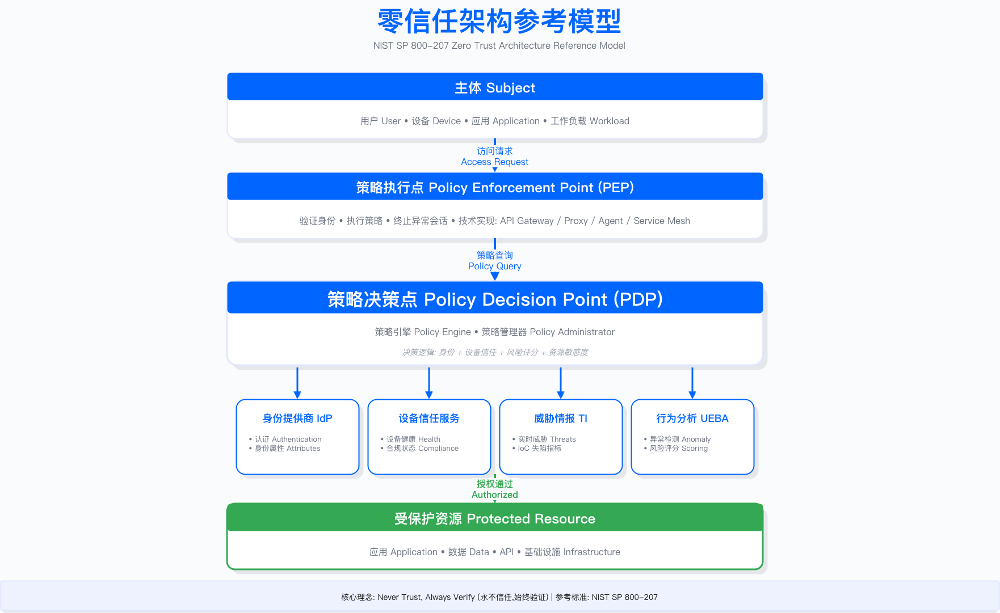
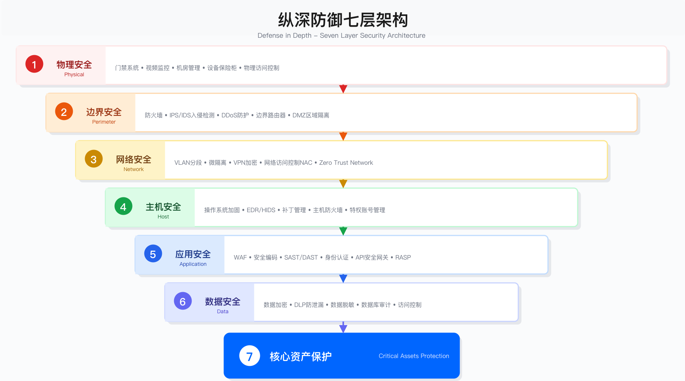
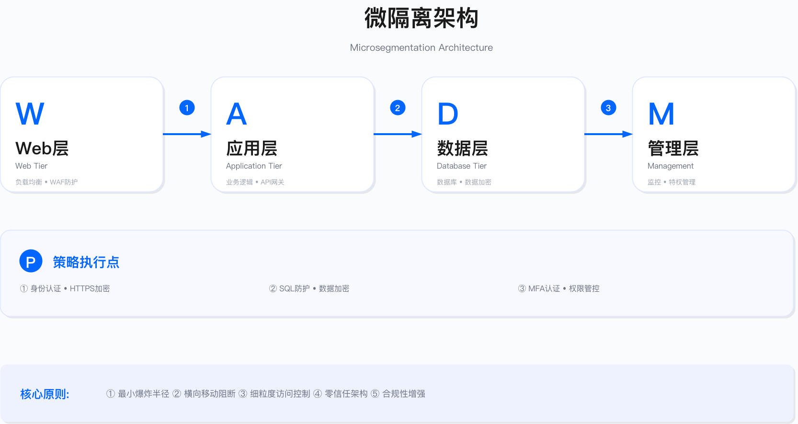
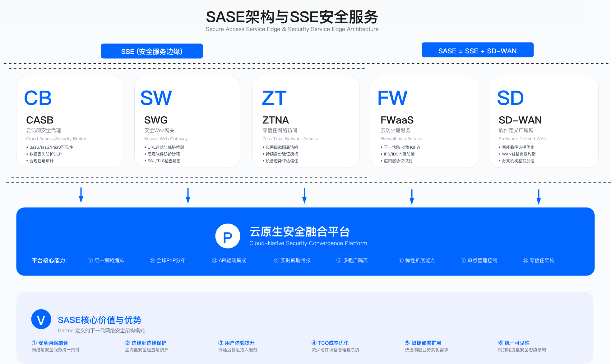

# 4.4 安全架构模式

本节阐述企业安全架构设计中的主流模式，包括零信任架构、纵深防御、微隔离、SASE/SSE 以及身份中心架构。每种模式均有其适用边界与工程约束，企业需根据业务形态、技术栈成熟度和组织能力选择合适的模式组合。

---

## 4.4.1 零信任架构

### 架构理念与核心原则

零信任架构 (Zero Trust Architecture, ZTA) 基于"永不信任，始终验证"的原则，假设网络内外均不可信，对所有访问请求进行动态验证与授权。与传统边界模型 (Castle-and-Moat) 相比，零信任模型不再依赖网络位置作为信任依据，而是将信任建立在身份验证、设备状态、行为分析等多维因素的实时评估之上。

NIST SP 800-207 定义了零信任架构的三项核心原则：

显式验证：基于所有可用数据点进行验证，包括身份、设备、位置、行为等。技术实现通常涉及多因素认证 (MFA)、设备信任评估、风险评分引擎。

最小权限访问：仅授予完成任务所需的最小权限，限制访问范围与时长。实现方式包括即时访问 (JIT)、细粒度授权、会话时间限制。

假设突破：假设威胁已在内部存在，目标是最小化影响范围。技术手段包括微隔离、全流量加密、持续监控与威胁狩猎。



### 架构组件

零信任架构的核心组件包括：

策略执行点 (PEP)：验证身份、执行策略、终止异常会话。技术实现包括 API 网关、反向代理、终端 Agent、Service Mesh。

策略决策点 (PDP)：由策略引擎和策略管理器组成，决策逻辑综合身份属性、设备信任分数、风险评分、资源敏感度等因素。

支撑服务：身份提供商 (IdP) 提供认证与身份属性；设备信任服务验证设备健康与合规状态；威胁情报服务提供实时威胁信息与 IoC；行为分析 (UEBA) 进行异常检测与风险评分。

### 成熟度模型

零信任实施可分为五个成熟度级别：

| 级别 | 特征 | 典型实践 |
|-----|------|---------|
| Level 1：传统 | 基于边界的安全，内网默认信任 | VPN、防火墙、DMZ |
| Level 2：初级 | 强化身份认证，部分微隔离 | MFA、网络分段、基本日志 |
| Level 3：中级 | 细粒度访问控制，持续监控 | ZTNA、策略引擎、UEBA、设备信任 |
| Level 4：高级 | 自动化响应，全栈加密 | 自动阻断、微隔离、端到端加密 |
| Level 5：优化 | 自适应信任，机器学习驱动 | 机器学习风险评分、自适应策略 |

### 实施路径

零信任架构的实施是渐进式演进过程，而非一步到位的项目。Google BeyondCorp 模型提供了分阶段路径参考：

阶段 1：设备清单与信任。建立完整的设备清单数据库 (CMDB)，通过自动化扫描和 Agent 部署实现设备发现，部署设备健康检查机制验证补丁状态、磁盘加密、EDR 运行情况。输出是设备信任分数，基于合规状态、安全软件运行情况、已知漏洞数量等因素综合计算。

阶段 2：访问代理。部署反向代理作为所有内部应用的访问网关，集成身份提供商实现单点登录 (SSO)。这一阶段将"基于网络位置的信任"转变为"基于身份的信任"。

阶段 3：动态访问控制。部署风险评分引擎，基于多个维度实时计算访问风险：用户身份、设备信任分数、访问位置、访问时间、资源敏感度、行为模式。策略引擎根据分数动态调整授权策略——低风险场景直接放行，中风险场景要求额外 MFA 验证，高风险场景拒绝访问或限制为只读权限。

阶段 4：微隔离与加密。在应用层部署微隔离策略，每个工作负载都有独立的安全策略，默认拒绝所有通信，仅显式允许必要的流量。部署端到端加密，全流量监控提供持续可见性。

### 适用边界与约束

适用场景：远程办公占比高的企业；云原生架构或正在进行云迁移的组织；需要支持 BYOD (Bring Your Own Device) 或合作伙伴访问的业务场景；已发生过横向移动攻击事件需要加固的环境。

不适用场景：大量遗留系统无法部署 Agent 的工业环境；低延迟要求极高且无法承受额外认证开销的实时系统；组织基础设施成熟度不足以支撑设备清单管理的阶段。

关键约束：设备清单完整性是基础，缺失资产清单将导致策略覆盖盲区；实施周期通常需要分阶段推进，激进的"大爆炸"式迁移风险高；用户体验与安全需平衡，过于严格的策略会导致用户绕过控制；遗留系统需要妥协方案，混合架构是现实选择。

常见误区：认为零信任可以替代所有传统安全控制，实际上纵深防御仍然必要；忽视设备清单建设，直接部署 ZTNA 导致覆盖不全；策略上线未经充分验证，误伤业务导致回滚；低估组织变革难度，用户抵制和例外请求消耗大量资源。

验证方法：红队测试验证横向移动是否被有效阻断；模拟凭证泄露场景验证动态访问控制是否生效；审计日志检查是否所有访问都经过 PEP / PDP；测试设备信任分数计算的准确性与一致性。

运行指标：设备信任分数覆盖率（已纳入信任评估的设备占总设备的比例）；ZTNA 接入覆盖率（通过 ZTNA 访问的应用占总应用的比例）；策略拒绝率（被策略拒绝的访问请求占总请求的比例，异常升高需排查）；误报率（用户申诉确认为误拦截的比例）。

### 策略实现示例

以下是基于 Open Policy Agent (OPA) 的零信任访问控制策略示例：

```rego
# OPA Policy: 零信任访问控制
package zerotrust.access

import future.keywords.if
import future.keywords.in

# 默认拒绝
default allow := false

# 允许条件: 身份验证 + 设备信任 + 风险可接受
allow if {
    authenticated
    device_trusted
    risk_acceptable
}

# 身份验证检查
authenticated if {
    input.identity.authenticated == true
    input.identity.mfa_verified == true
    not token_expired
}

# 设备信任检查
device_trusted if {
    input.device.managed == true
    input.device.encrypted == true
    input.device.security_score >= 80
    not device_compromised
}

# 风险评估
risk_acceptable if {
    risk_score := calculate_risk_score
    risk_score < 70
}

calculate_risk_score := score if {
    identity_risk := input.identity.risk_level * 30
    device_risk := (100 - input.device.security_score) * 0.3
    location_risk := location_risk_value * 20
    behavior_risk := input.behavior.anomaly_score * 20
    score := identity_risk + device_risk + location_risk + behavior_risk
}

# 位置风险评估
location_risk_value := 1.0 if {
    input.location.country in ["CN", "US", "EU"]
} else := 2.0 if {
    input.location.country in risk_countries
} else := 1.5

# 设备妥协检查
device_compromised if {
    input.device.id in compromised_device_list
}

# Token 过期检查
token_expired if {
    now := time.now_ns()
    exp := input.identity.token_expiry * 1000000000
    now > exp
}
```

---

## 4.4.2 多层防御架构

### 架构概述

多层防御 (Defense in Depth) 是一种综合安全策略，通过在不同层次部署多种安全控制，确保即使某一层被突破，其他层仍能提供保护。该策略源自军事防御理念，通过多道防线延缓攻击进程、增加攻击成本、提供检测窗口。



### 七层防御模型

多层防御可组织为七个层次，每层承担特定的安全职能：

Layer 1：人员、流程与策略。安全意识培训、安全政策制定、应急响应流程、变更管理。这是防御体系的组织基础。

Layer 2：物理安全。数据中心门禁、视频监控、生物识别、物理隔离。保护物理资产免受未授权物理访问。

Layer 3：网络边界。防火墙、IDS / IPS、DDoS 防护、WAF、邮件网关。在网络入口点过滤恶意流量。

Layer 4：内部网络。网络分段、VLAN、ACL、NAC、微隔离。限制横向移动，控制内部流量。

Layer 5：主机 / 端点。系统加固、EDR / XDR、补丁管理、应用白名单、文件完整性监控 (FIM)。保护终端和服务器。

Layer 6：应用层。输入验证、WAF、API 网关、RASP、会话管理。在应用逻辑层防御攻击。

Layer 7：数据层。加密（静态 + 传输）、DLP、权限控制、脱敏、备份。保护数据资产本身。

### 控制类型矩阵

每一层的安全控制可按功能分为三类：预防 (Preventive)、检测 (Detective)、响应 (Responsive)。

| 层次 | 预防控制 | 检测控制 | 响应控制 |
|-----|---------|---------|---------|
| 人员流程 | 安全培训、背景调查 | 安全审计、违规报告 | 事件响应、纪律处分 |
| 物理安全 | 门禁、围栏、锁 | 视频监控、入侵检测 | 安保响应、隔离 |
| 网络边界 | 防火墙、WAF | IDS/IPS、流量分析 | 自动阻断、隔离 |
| 内部网络 | 网络分段、ACL | 异常流量检测、NetFlow | VLAN 隔离、封禁 |
| 主机端点 | 系统加固、白名单 | EDR、文件完整性监控 | 进程终止、隔离 |
| 应用层 | 输入验证、RBAC | 应用日志、异常检测 | 会话终止、降级 |
| 数据层 | 加密、权限控制 | DLP、访问审计 | 撤销权限、数据隔离 |

### 适用边界与约束

适用场景：高合规要求的行业（金融、医疗、政府）；需要满足多项监管审计要求的组织；已有分层安全投资需要整合优化的企业；需要对攻击链各环节均有检测能力的防御体系。

不适用场景：追求快速迭代的初创公司可能无法承担每层的运维成本；资源极度有限需要集中投入的场景；云原生无服务器架构中部分层次不适用。

关键约束：多层控制增加运维复杂度和告警疲劳风险；各层控制需要协调配置，避免冲突或重复；成本随层次增加而上升，需评估投入产出比；依赖各层控制的有效运行，单点失效需其他层补位。

常见误区：堆砌安全产品但缺乏整合，导致告警关联困难；过度依赖边界控制，内部网络防护薄弱；各层控制由不同团队管理缺乏协调，形成安全孤岛；检测能力与响应能力不匹配，发现威胁但无法及时处置。

验证方法：红队演练测试攻击链是否在多层被检测或阻断；模拟单层控制失效验证其他层是否有效补位；审计各层日志关联分析能力；演练响应流程验证跨层协调效率。

运行指标：各层检测率（每层安全控制检测到的威胁数量）；攻击阻断层级分布（攻击在哪一层被阻断的统计）；平均检测时间 (MTTD)；平均响应时间 (MTTR)。

---

## 4.4.3 微隔离架构

### 架构概述

微隔离 (Micro-segmentation) 是一种细粒度网络安全技术，将网络划分为多个小区域，为每个工作负载（虚拟机、容器、应用）定义独立的安全策略。与传统网络分段相比，微隔离将隔离粒度从"区域级"下沉到"工作负载级"，实现零信任网络的内网流量控制。

传统网络分段将服务器按功能划分为 DMZ、应用区、数据库区等区域，区域内流量默认信任，这导致横向移动风险较高。微隔离则为每个工作负载配置独立策略，默认拒绝所有流量，仅显式允许必要通信，策略随工作负载迁移。



### 技术实现方式

微隔离可通过多种技术实现，各有优劣：

| 技术类型 | 代表产品 | 实现方式 | 优势 | 劣势 |
|---------|---------|---------|------|------|
| 网络层 | Cisco ACI、VMware NSX | SDN、虚拟防火墙 | 性能好、可见性强 | 依赖网络基础设施 |
| 主机层 | Illumio、Guardicore | Host-based Agent | 跨平台、灵活 | Agent 开销 |
| 容器层 | Cilium、Calico | eBPF、CNI Plugin | 云原生、高性能 | 仅限容器环境 |
| Service Mesh | Istio、Linkerd | Sidecar Proxy | 应用感知、L7 控制 | 复杂度高、有延迟开销 |

### 策略设计层次

微隔离策略采用分层设计，从全局到工作负载逐级细化：

全局默认策略：默认拒绝所有流量 (Deny-All)，显式允许例外。这是"假设突破"原则的直接体现。

区域策略：定义安全区域 (Production / Staging / Dev)，设置区域间访问控制规则。

应用策略：基于应用标签 (Tier / Role / Env) 定义策略，建立应用依赖关系映射。

工作负载策略：单个 VM / 容器级别策略，实现最细粒度控制。

### 实施步骤

微隔离实施遵循"发现—标签—设计—测试—部署—优化"的六步流程：

步骤 1：资产发现与流量映射。自动发现所有工作负载，监控流量一段时间（通常数周），生成应用依赖图。

步骤 2：标签分类。定义标签模型 (Tier / App / Env / Location)，自动化标签分配，验证标签准确性。标签是策略表达的基础。

步骤 3：策略设计。基于流量分析设计策略，从粗到细 (Zone → App → Workload)，优先高价值资产（数据库、核心应用）。

步骤 4：测试模式。策略以"监控"模式运行，记录违规但不阻断，验证无误报。

步骤 5：分阶段实施。先非生产环境 (Dev → Staging)，再生产环境（灰度发布），建立回滚机制。

步骤 6：持续优化。监控策略违规，调整策略（新应用、架构变更），定期评审策略有效性。

### Kubernetes 微隔离示例

以下是 Kubernetes NetworkPolicy 的微隔离策略示例：

```yaml
# 默认拒绝所有入站流量
apiVersion: networking.k8s.io/v1
kind: NetworkPolicy
metadata:
  name: default-deny-ingress
  namespace: production
spec:
  podSelector: {}
  policyTypes:
  - Ingress

---
# 允许前端访问后端
apiVersion: networking.k8s.io/v1
kind: NetworkPolicy
metadata:
  name: allow-frontend-to-backend
  namespace: production
spec:
  podSelector:
    matchLabels:
      tier: backend
  policyTypes:
  - Ingress
  ingress:
  - from:
    - podSelector:
        matchLabels:
          tier: frontend
    ports:
    - protocol: TCP
      port: 8080

---
# 允许后端访问数据库
apiVersion: networking.k8s.io/v1
kind: NetworkPolicy
metadata:
  name: allow-backend-to-database
  namespace: production
spec:
  podSelector:
    matchLabels:
      tier: database
  policyTypes:
  - Ingress
  ingress:
  - from:
    - podSelector:
        matchLabels:
          tier: backend
    ports:
    - protocol: TCP
      port: 5432

---
# 允许 Prometheus 监控
apiVersion: networking.k8s.io/v1
kind: NetworkPolicy
metadata:
  name: allow-prometheus-scraping
  namespace: production
spec:
  podSelector: {}
  policyTypes:
  - Ingress
  ingress:
  - from:
    - namespaceSelector:
        matchLabels:
          name: monitoring
      podSelector:
        matchLabels:
          app: prometheus
    ports:
    - protocol: TCP
      port: 9090
```

### 适用边界与约束

适用场景：已发生过横向移动攻击需要加固的环境；高敏感度应用需要隔离保护；容器化或虚拟化程度高的基础设施；需要满足合规要求（如 PCI DSS (Payment Card Industry Data Security Standard)）的分段控制。

不适用场景：应用依赖关系极度复杂且无法梳理的遗留系统；网络基础设施不支持所需技术的环境；运维团队不具备策略管理能力的组织。

关键约束：流量可见性是前提，缺乏流量映射将导致策略设计盲目；标签管理的一致性和准确性直接影响策略有效性；Agent 部署可能带来性能开销和兼容性问题；策略变更需要严格的测试和回滚机制。

常见误区：未经流量分析直接编写策略，导致业务中断；策略过于宽松（大范围允许）失去隔离意义；部署后缺乏持续监控，策略随架构演进而失效；忽视策略版本管理，变更追溯困难。

验证方法：红队测试验证横向移动是否被有效阻断；注入异常流量验证策略是否触发告警或阻断；审计策略违规日志分析误报和漏报；验证策略随工作负载迁移的一致性。

运行指标：策略覆盖率（已配置策略的工作负载占总工作负载的比例）；策略违规次数（被策略阻断的流量数量，异常升高需排查）；允许规则数量（单工作负载平均允许规则数，过多可能表示策略过宽）；策略变更频率（衡量策略管理的活跃度和维护成本）。

---

## 4.4.4 安全服务边缘 (SSE / SASE)

### 架构概述

SASE (Secure Access Service Edge, 安全访问服务边缘) 将 SD-WAN、ZTNA、CASB、FWaaS、SWG 等网络与安全功能融合到云边缘，提供统一的网络与安全服务。SSE (Security Service Edge) 是 SASE 的安全组件子集，不包含 SD-WAN 的网络优化功能。

SASE 的核心价值在于：将分散的安全控制点整合到云边缘统一交付；用户和分支机构就近接入全球分布式 PoP 节点，降低延迟；安全策略统一管理，简化运维复杂度。



### 核心组件

SASE 边缘服务包含以下核心组件：

ZTNA (零信任网络访问)：替代传统 VPN，提供应用级访问控制，身份驱动的授权决策。用户不再接入整个内网，而是仅能访问授权的特定应用。

CASB (云访问安全代理)：提供 SaaS 应用的可见性与控制，执行 DLP 策略和合规检查，发现 Shadow IT。

SWG (安全 Web 网关)：URL 过滤、恶意软件防护、TLS 流量检查。保护用户上网安全。

FWaaS (防火墙即服务)：云端防火墙，提供 IDS / IPS 能力，集成威胁情报。

DLP (数据泄露防护)：内容检查与敏感数据识别，跨渠道统一策略执行。

RBI (远程浏览器隔离)：浏览器隔离执行，防护零日威胁，安全沙箱环境。

### 供应商能力对比

选择 SASE 供应商需评估多个维度，以下对比供参考（企业应根据实际需求进行 POC (Proof of Concept) 验证）：

| 供应商 | 能力优势 | 局限性 | 典型适用场景 |
|-------|---------|--------|-------------|
| Zscaler | SASE 平台成熟度高，全球 PoP 覆盖广 | 定价较高 | 大型企业、全球化组织 |
| Cloudflare | 网络性能优异，CDN + 安全一体化 | SASE 产品线相对较新 | 注重性能的互联网公司 |
| Palo Alto (Prisma SASE) | 与 NGFW 集成好，企业级功能全面 | 架构复杂度高 | 已有 Palo Alto 产品的用户 |
| Cato Networks | SD-WAN + SASE 融合好 | 市场份额较小 | 中小企业、分支机构多的组织 |
| Netskope | CASB 能力强，SaaS 安全优秀 | ZTNA 能力相对较弱 | SaaS 密集型企业 |

### 适用边界与约束

适用场景：全球化企业需要统一接入与安全策略；远程办公占比高需要替代传统 VPN；SaaS 使用广泛需要 CASB 和 DLP 控制；分支机构多且硬件维护成本高希望简化。

不适用场景：对数据主权有严格要求不允许流量经过第三方的场景；网络延迟敏感的特定应用（需评估 PoP 位置）；已有大量边界安全投资且短期无法迁移的环境。

关键约束：供应商锁定风险，迁移成本较高；流量绕行云边缘可能增加延迟（取决于 PoP 位置）；TLS 检查涉及隐私合规考量（部分国家法规限制）；定价模式通常按用户数或带宽计费，需评估 TCO (Total Cost of Ownership)。

常见误区：认为 SASE 可以替代所有本地安全控制；忽视遗留应用兼容性问题；低估迁移过程中的用户体验影响；未充分评估 PoP 覆盖与业务位置的匹配度。

验证方法：测量接入延迟与用户体验（对比传统 VPN）；验证策略执行一致性（跨地区、跨接入方式）；测试故障切换与 PoP 冗余；审计日志完整性与合规报告能力。

运行指标：接入延迟（用户到 SASE PoP 的平均延迟）；策略执行成功率（成功执行安全策略的请求比例）；VPN 替代率（通过 ZTNA 接入的用户占总远程用户的比例）；威胁拦截量（各安全组件拦截的威胁数量）。

---

## 4.4.5 身份中心架构

### 架构概述

身份中心架构 (Identity-Centric Architecture) 以身份为核心，所有访问控制、审计、风险评估均基于身份，而非网络位置或设备。其核心原则包括：身份是新的边界；任何访问均需身份验证；细粒度授权 (ABAC / RBAC)；持续身份验证。

身份中心架构与零信任架构高度相关，可视为零信任在身份维度的深化实现。

### 身份技术栈

身份中心架构涉及以下技术组件：

| 组件 | 功能 | 代表产品 |
|-----|------|---------|
| IdP (身份提供商) | 认证、SSO、MFA | Azure AD、Okta、Auth0、Keycloak |
| IGA (身份治理与管理) | 身份生命周期、权限审查 | SailPoint、Saviynt、One Identity |
| PAM (特权访问管理) | 特权账户管理、密码保险库 | CyberArk、BeyondTrust、Delinea |
| CIEM (云身份权限管理) | 云环境身份权限优化 | Wiz、Sonrai、Ermetic |
| FIDO2 / WebAuthn | 无密码认证 | Yubico、Google Titan、Windows Hello |

### 无密码认证

密码存在固有安全问题：弱密码和重复使用、钓鱼攻击易成功、管理成本高。FIDO2 / WebAuthn 提供无密码认证方案：

注册阶段：用户发起注册请求，IdP 生成挑战，FIDO2 设备生成密钥对（私钥保存在设备，公钥发送到 IdP 存储）。

认证阶段：用户发起认证请求，IdP 生成挑战，FIDO2 设备使用私钥签名挑战，IdP 验证签名后授予访问。

无密码认证的安全优势：抗钓鱼（域名绑定）、无密码泄露风险、用户体验好。

### 条件访问策略示例

以下是 Azure AD 条件访问策略的配置示例：

```json
{
  "displayName": "Require MFA for external users accessing sensitive apps",
  "state": "enabled",
  "conditions": {
    "users": {
      "includeUsers": ["All"],
      "excludeUsers": ["emergency-access-account"]
    },
    "applications": {
      "includeApplications": [
        "Salesforce",
        "SAP",
        "Financial-App"
      ]
    },
    "locations": {
      "includeLocations": ["All"],
      "excludeLocations": ["Corporate-Network"]
    },
    "signInRiskLevels": ["medium", "high"],
    "deviceStates": {
      "includeStates": ["All"],
      "excludeStates": ["Compliant", "DomainJoined"]
    }
  },
  "grantControls": {
    "operator": "AND",
    "builtInControls": [
      "mfa",
      "compliantDevice"
    ]
  },
  "sessionControls": {
    "signInFrequency": {
      "value": 8,
      "type": "hours"
    },
    "persistentBrowser": {
      "mode": "never"
    }
  }
}
```

### 适用边界与约束

适用场景：云原生 SaaS 公司无传统数据中心；已具备成熟 IdP 基础设施的组织；需要统一管理多云环境身份的场景；追求无密码体验提升安全与用户体验。

不适用场景：身份基础设施不成熟无法支撑细粒度授权；遗留应用不支持现代身份协议 (SAML / OIDC)；用户群体无法适配 FIDO2 设备的场景。

关键约束：IdP 成为关键单点，需确保高可用和灾备；身份治理缺失将导致权限蔓延；条件访问策略复杂度随场景增加而上升；无密码认证需要设备支持和用户培训。

常见误区：实施身份中心架构但权限审查不到位，导致权限累积；IdP 配置错误导致大范围认证失败；过度依赖 MFA 但未考虑 MFA 疲劳攻击；紧急访问账户管理不当成为安全隐患。

验证方法：测试条件访问策略在各场景下的执行正确性；模拟 IdP 故障验证业务连续性；权限审计验证最小权限原则落地情况；红队测试验证 MFA 绕过和会话劫持防护。

运行指标：MFA 注册率（启用 MFA 的用户占总用户的比例）；无密码认证采用率（使用 FIDO2 / WebAuthn 的认证比例）；权限审查完成率（按期完成权限审查的账户比例）；条件访问触发率（触发条件访问策略的登录比例）。

---

## 4.4.6 模式选择与组合策略

### 模式选择矩阵

不同业务场景适用不同的架构模式组合：

| 业务场景 | 推荐模式 | 选择理由 |
|---------|---------|---------|
| 全球化企业，远程办公为主 | 零信任 + SASE | 支持灵活接入，统一策略 |
| 金融 / 医疗等高合规行业 | 纵深防御 + 微隔离 | 多层防护，满足审计要求 |
| 云原生 SaaS 公司 | 零信任 + 身份中心 | 无传统数据中心，身份驱动 |
| 制造业，OT / IT 融合 | 纵深防御 + 微隔离 | 物理隔离 + 网络分段 |
| 初创公司，快速增长 | 身份中心 + SASE | 轻量级，易扩展 |

### 组合策略：纵深防御 + 零信任

纵深防御与零信任并非互斥，而是互补。典型的融合架构如下：

Layer 1：策略与流程（纵深防御）。制定零信任政策、安全培训、应急响应流程。

Layer 2：边界防护（纵深防御）。DDoS 防护、WAF，在网络入口提供基础保护。

Layer 3：零信任接入层。ZTNA Gateway 执行身份验证 + 设备信任 + 风险评估，无 VPN，应用级访问。

Layer 4：微隔离（零信任内网）。服务间 mTLS，NetworkPolicy 强制隔离。

Layer 5：工作负载安全（纵深防御）。运行时防护、RASP、EDR。

Layer 6：数据保护（纵深防御 + 零信任）。加密、DLP、细粒度授权 (ABAC)。

这种组合策略既保留了纵深防御的多层冗余优势，又通过零信任模式强化了身份驱动的访问控制和微隔离。

---

## 4.4.7 本节小结

### 核心要点

零信任是现代架构基石。"永不信任，始终验证"原则适用于云和远程办公环境，但实施需分阶段渐进。

纵深防御仍然重要。多层控制提供冗余保护，适合高合规场景，各层需协调配合。

微隔离降低横向移动风险。工作负载级别隔离是零信任的重要技术实现，流量可见性是前提。

SASE 融合网络与安全。云边缘交付安全服务，适合全球化与分支机构场景，需评估供应商锁定风险。

身份是新的边界。身份中心架构将访问控制从网络转移到身份，IdP 成为关键基础设施。

模式需要组合。没有单一模式能解决所有问题，根据业务场景组合多种模式。

### 常见陷阱

盲目追求零信任而不考虑现有架构与投资，激进变革导致业务中断。

过度依赖单一模式，认为零信任可以替代所有传统安全控制。

忽视用户体验，安全控制过于严格导致用户绕过或抱怨。

缺少可见性，部署微隔离但不监控流量，无法发现异常。

供应商锁定，选择单一供应商 SASE 解决方案缺乏灵活性。

身份治理缺失，实施身份中心架构但权限审查不到位，导致权限蔓延。

---

## 4.4.8 延伸阅读

### 标准与规范

- NIST SP 800-207: Zero Trust Architecture
- CISA Zero Trust Maturity Model
- Forrester Zero Trust eXtended (ZTX) Ecosystem

### 技术资料

- Google BeyondCorp 系列论文
- Microsoft Zero Trust Deployment Guide
- Open Policy Agent 文档

### 相关章节

- 前置：4.2 架构设计原则（理解最小权限、纵深防御原则）
- 前置：4.3 威胁建模（识别威胁指导模式选择）
- 后续：4.7 安全参考架构（模式在具体领域的应用）
- 相关：5.2 云身份与访问管理（身份中心架构的详细实现）

---

[← 上一节：4.3 威胁建模](4.3_threat_modeling.md) | [返回目录](README.md) | [下一节：4.5 架构评审与验证 →](4.5_architecture_review_validation.md)

---

© 2025 AI-ESA Project. Licensed under CC BY-NC-SA 4.0

