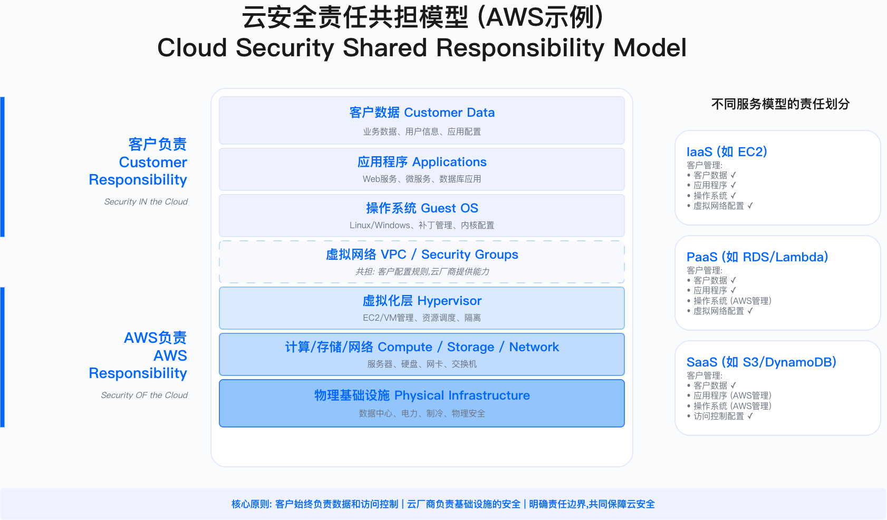
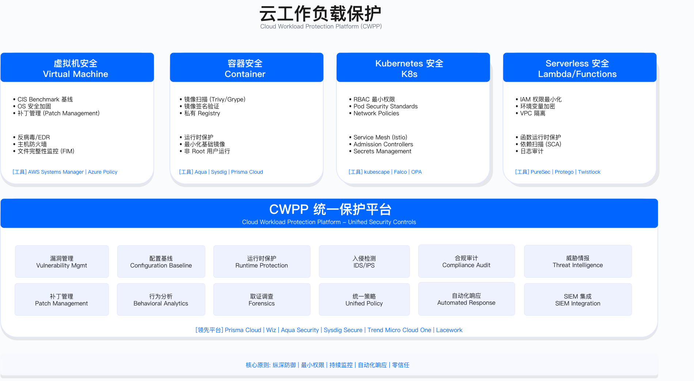

# 5.0 执行摘要 (Executive Summary)

## 云安全的战略定位

云计算从"可选技术"演变为"业务底座"后,云安全责任边界的模糊、配置复杂度的指数级增长、以及多云环境的治理难题,使得企业面临前所未有的安全挑战。本章建立从战略规划到工程实施的完整云安全架构体系,覆盖身份管理、网络隔离、工作负载保护、数据加密、安全工具链与多云治理,支撑业务在云上的安全创新与合规运营。

## 核心问题与约束

企业在云安全实践中面临三类典型困境：

**责任边界模糊**：云服务商负责底层基础设施安全(物理机房、虚拟化层、网络基础),客户负责配置安全(IAM 策略、安全组规则、数据加密),但共享责任模型在 IaaS/PaaS/SaaS 不同层级的具体分工常被误解。开发团队误认为"使用云服务即自动安全",安全团队则低估客户侧配置风险,导致 S3 存储桶公开、IAM 权限过度授予等配置错误频发。

**多云治理碎片化**：企业平均使用多个云平台(AWS、Azure、GCP、阿里云等),每个云有独立的 IAM 模型(AWS 基于策略、Azure 基于角色、GCP 基于绑定)、不同的日志格式(CloudTrail、Activity Log、Audit Logs)、各自的安全工具(Security Hub、Defender、Security Command Center)。统一治理需要平衡标准化(降低管理复杂度)与灵活性(避免云厂商锁定),技术债务与组织能力往往成为制约因素。

**安全成本失衡**：安全团队要求全数据加密、多可用区高可用、日志长期留存、CSPM/CWPP 等工具全覆盖,可能导致云成本增加 50% 以上。业务团队质疑"过度投入",财务部门要求证明安全投资回报。如何在安全、合规、成本三者间找到平衡点,需要 FinOps 与 SecOps 协同机制。

## 本章架构与实施路径

本章分为九个技术主题,覆盖战略、架构、工程、运营四个层次：

**战略与治理(5.1 节)**：建立云安全治理框架(映射 CSA CCM、NIST 800-53、ISO 27017/27018 等标准),选择多云架构模式(统一治理、联邦治理、混合治理),定义云原生安全理念(Shift Left、DevSecOps、零信任),评估组织成熟度(L1 被动响应至 L5 行业标杆)。适用边界为已有云部署或计划上云的企业;不适用于纯本地数据中心且无上云计划的组织。关键约束包括高管支持度(云优先战略需董事会级别认可)、预算投入(云安全占云支出 5-8% 为行业基准)、组织能力(需要云安全架构师、DevSecOps 工程师等新角色)。

**身份与访问管理(5.2 节)**：设计统一身份管理体系(SSO、SAML、OIDC 集成),实施多云 IAM 策略(AWS IAM Policy、Azure RBAC、GCP IAM Binding 对比与映射),部署特权访问管理(PAM 工具如 CyberArk、BeyondTrust),实现零信任架构(BeyondCorp 模型)与 JIT 即时访问。验证方法包括：多因素认证覆盖率检查(目标 100%)、过度权限检测(通过 CIEM 工具识别通配符权限)、临时凭证使用率审计(STS AssumeRole 替代长期 Access Key)。运行指标关注 MFA 启用率、权限过度配置率、特权访问审批率、根账户使用次数(应为零除应急场景)。

**网络安全(5.3 节)**：构建 VPC 安全架构(公有子网、私有子网、数据库子网三层设计),实施微隔离与安全组策略(Stateful 安全组 + Stateless NACL 组合),部署 DDoS 防护(AWS Shield、Cloudflare)与 Web 应用防火墙(WAF 规则集),配置 CDN 边缘安全(Bot 管理、速率限制)。常见误区包括：使用 0.0.0.0/0 开放所有入站(应限定源 IP 白名单)、未区分南北向与东西向流量控制(容器间通信应使用 NetworkPolicy)、忽视安全组规则审计(僵尸规则累积导致管理混乱)。验证通过红队渗透测试(尝试横向移动)、流量日志分析(VPC Flow Logs 检查异常通信)。

**工作负载保护(5.4 节)**：加固虚拟机安全(CIS Benchmark 基线检查),扫描容器镜像(Trivy/Aqua 检测漏洞与恶意软件),配置 Kubernetes 安全(RBAC 最小权限、Pod Security Standards、NetworkPolicy 隔离),保护 Serverless 函数(Lambda 权限最小化、环境变量加密)。部署云工作负载保护平台(CWPP 如 Prisma Cloud、Wiz、Lacework)进行运行时威胁检测。适用边界为使用容器/K8s/Serverless 的云原生应用;传统虚拟机场景可降级为基线合规检查。关键约束为扫描性能开销(镜像扫描可能延长 CI/CD 流程 5-10 分钟)、误报处理成本(需要安全工程师筛选真实漏洞)。

**数据保护(5.5 节)**：设计云存储安全架构(S3/Blob/GCS 访问控制),实施数据加密策略(传输加密 TLS 1.2+、静态加密 SSE-KMS、使用中加密字段级加密),配置密钥管理服务(AWS KMS、Azure Key Vault、GCP KMS 密钥轮换),部署数据分类与 DLP(自动分类引擎 + 策略阻断),满足数据驻留要求(GDPR 第 44/45 条、PIPL 第 38/40 条跨境限制)。验证方法包括：加密覆盖率检查(CSPM 扫描未加密存储桶)、密钥轮换合规性审计(KMS 审计日志验证年度轮换)、数据泄露演练(模拟公开访问场景检测 DLP 策略有效性)。

**安全工具链(5.6 节)**：选型与集成 CSPM(云安全态势管理,如 Prisma Cloud、Wiz、Orca)、CWPP(云工作负载保护平台)、CNAPP(云原生应用保护平台,整合 CSPM+CWPP+CIEM+KSPM)、CIEM(云基础设施权限管理,如 CloudKnox、Ermetic)。工具选型决策依据为：单一云环境(AWS>90%)优先原生工具(Security Hub+GuardDuty),多云环境选择第三方 CNAPP,预算受限使用开源组合(Trivy+Falco+kubescape+KICS)。集成架构从 IDE 前置检查(Pre-commit Hook)到 CI/CD 扫描(SAST/SCA/IaC/容器扫描)到运行时防护(Falco)到 SIEM 告警。

**DevSecOps 实践(5.7 节)**：集成 IaC 安全扫描(Checkov/Terrascan 检测 Terraform 配置错误),实施容器镜像安全(镜像扫描 + 签名验证 Cosign+SBOM 生成 Syft),配置安全左移(设计阶段威胁建模、开发阶段 IDE 插件、构建阶段门禁 Policy-as-Code)。适用边界为使用 IaC(Terraform/CloudFormation)和容器化部署的团队;传统手工部署场景需先推进 IaC 改造。关键约束为开发体验影响(扫描门禁可能阻断部署,需要合理的例外流程)、工具学习成本(开发者需理解安全扫描结果与修复方法)。验证通过 IaC 扫描覆盖率(目标 100%)、高危配置阻断率、开发者修复平均时间。

**安全运营(5.8 节)**：建立云日志审计体系(CloudTrail/Activity Log/Audit Logs 集中收集),集成云安全监控(SIEM 如 Splunk/Sentinel/Chronicle),实施云事件响应流程(检测 15 分钟、遏制 1 小时、根除 4 小时、恢复 24 小时 SLA),部署云攻击面管理(CAASM 资产发现与风险评估),执行云取证(日志留存、证据保全、调查分析)。常见误区包括：未启用 CloudTrail 或日志留存期过短(合规要求通常 7 年)、SIEM 告警未分级(导致安全团队被淹没)、缺乏自动化响应(手工处理导致响应延迟)。运行指标关注云威胁检测覆盖率、平均检测时间 MTTD、平均响应时间 MTTR、自动化修复率。

**多云治理(5.9 节)**：选型多云统一管理平台(CloudHealth/Flexera/Prisma Cloud),实施云成本优化与安全协同(FinOps+SecOps：风险分级、成本可见、Right-sizing 建议、预留实例),设计混合云安全架构(本地数据中心与云环境网络互联、身份联邦),规划云迁移安全(迁移前风险评估、迁移中数据保护、迁移后基线验证),明确云 SLA 与责任共担模型(服务等级协议、客户与云厂商责任界定)。

## 关键成功要素

**Landing Zone 标准化**：多账户/项目架构设计(安全账户、日志账户、网络账户、生产账户、开发账户隔离)、网络拓扑规划(Hub-Spoke 模型、Transit Gateway)、IAM 策略基线(Service Control Policies 边界控制)、强制启用审计日志。投资回报体现为：避免野蛮生长(无 Landing Zone 企业平均每季度发现 50+ 配置错误)、加速新业务上云(标准化模板使上云周期从 3 个月缩短至 2 周)、降低后续修复成本(前期投入与后续修复成本比约 1:5)。工具选择包括 AWS Control Tower、Azure Landing Zone、Terraform Enterprise 或自研 IaC 模块。

**自动化与工具整合**：避免工具孤岛(企业平均使用 7 个云安全工具但仅 30% 有效集成),优先选择 CNAPP 整合平台(单一平台覆盖 CSPM+CWPP+CIEM+KSPM)而非分散采购,实现 API 全流程自动化(CSPM 检测→SIEM 告警→SOAR 编排→ITSM 工单→自动修复或人工审批)。技术约束包括 API 限流(云厂商 API 有速率限制)、数据格式转换(不同工具告警格式需要标准化)、工具学习曲线(安全团队需要掌握多个平台操作)。

**云安全技能建设**：认证投资(AWS Certified Security Specialty、Microsoft Azure Security Engineer、CKS Certified Kubernetes Security Specialist)、实战训练(每季度云攻防演练/Purple Team 测试 Landing Zone 防护有效性)、外部对标(参加 re:Inforce、RSA 等云安全会议)。组织能力约束包括招聘难度(云安全架构师市场薪资溢价 30-50%)、培训周期(传统安全人员转型云安全至少 6 个月)、知识更新速度(云服务每年新增数百项功能)。

**FinOps 与 SecOps 协同**：建立成本可见机制(安全成本标签化如 `Project:Security, Type:Encryption` 向业务透明)、风险分级策略(高价值数据加密 + 多可用区,低价值数据单可用区 + 归档存储)、Right-sizing 建议(CSPM 识别未使用 EBS 卷、孤儿快照、过度配置实例)、预留实例优化(稳定工作负载如 SIEM/CSPM 使用 3 年 RI 节省 40-60%)。平衡点通常为：核心业务数据高保障(成本溢价可接受)、非核心场景成本优先(满足基线即可)、通过自动化降低运营成本(人力成本往往高于工具成本)。

## 验证与运行指标

云安全态势通过五类指标持续监控：

**覆盖率指标**：云账户基线合规率(合规账户数÷总账户数,目标≥95%)、资产可见性覆盖率(已纳管资产数÷实际资产数,目标≥98%)、MFA 覆盖率(启用 MFA 账户数÷总账户数,目标 100%)、容器镜像扫描覆盖率(已扫描镜像数÷使用中镜像数,目标 100%)、云存储加密覆盖率(已加密存储桶数÷总存储桶数,目标 100%)。

**风险指标**：高风险配置数量(CSPM 检测到的严重 + 高危配置错误总数,目标≤5 个/月)、严重漏洞超期率(超期严重漏洞数÷严重漏洞总数,目标 0%)、权限过度配置率(过度权限账户数÷总账户数,目标≤5%)、高危镜像使用率(含高危漏洞镜像数÷使用中镜像数,目标≤2%)。

**合规指标**：云策略违规次数(月度策略违规告警数,趋势应持续下降)、例外申请关闭率(按时关闭例外数÷例外总数,目标≥90%)、特权访问审批率(经审批特权访问÷特权访问总数,目标 100%)、密钥轮换合规率(按期轮换密钥数÷应轮换密钥数,目标 100%)。

**运营指标**：云威胁检测覆盖率(已纳管云账户数÷总云账户数,目标 100%)、云事件平均检测时间 MTTD(总检测时间÷事件数,目标≤15 分钟)、云事件平均响应时间 MTTR(总响应时间÷事件数,目标≤60 分钟)、IaC 安全扫描覆盖率(已扫描 IaC 项目数÷IaC 项目总数,目标 100%)、自动化修复率(自动修复问题数÷可自动修复问题数,目标≥70%)。

**成本效率指标**：安全工具成本占云支出比例(目标 5-8%)、Right-sizing 节省金额、闲置资源清理率、预留实例使用率。

## 常见失败模式

**配置漂移**：开发团队通过云控制台手工修改资源配置(临时调试、紧急变更),导致实际配置与 IaC 代码不一致,后续 IaC 部署可能覆盖手工变更或检测到漂移失败。缓解措施包括：强制通过 IaC 部署(禁用控制台写权限或仅允许只读角色)、部署漂移检测工具(Terraform Cloud/Spacelift 持续检测漂移并告警)、建立紧急变更流程(手工变更后 24 小时内必须同步到 IaC 代码)。

**过度权限累积**：初期为快速上线授予宽泛权限(如 IAM 策略 `Action: "*", Resource: "*"`),后续未定期审计导致权限累积,攻击者获取单个凭证即可访问所有资源。缓解措施包括：部署 CIEM 工具自动识别过度权限(CloudKnox/Ermetic 分析实际使用记录推荐最小权限策略)、建立权限审计流程(季度清理 90 天未使用权限)、强制 JIT 临时授权(高权限操作需要临时申请,自动过期)。

**日志留存不足**：未启用 CloudTrail 或日志留存期设置过短(如仅保留 30 天),安全事件调查时发现关键日志已被清理,无法溯源攻击路径。缓解措施包括：Landing Zone 强制启用审计日志(通过 Service Control Policy 禁止关闭 CloudTrail)、日志归档至冷存储(S3 Glacier 满足 7 年合规要求同时降低成本)、日志完整性保护(CloudTrail Log File Validation 防止篡改)。

**成本失控**：安全工具采购缺乏整体规划,多个云各自部署 CSPM/CWPP/CIEM 导致重复付费,或未评估实际需求采购全功能套件但使用率不足 20%。缓解措施包括：工具采购前进行 POC 评估(验证实际检测覆盖率与误报率)、选择 CNAPP 整合平台降低重复成本、按需启用功能模块(先部署 CSPM 基础版,成熟后再扩展 CWPP/CIEM)、季度成本审查(删除未使用工具授权)。

**技能断层**：传统安全团队缺乏云原生知识(不理解容器、Kubernetes、Serverless 架构),云架构师缺乏安全视角(未考虑零信任、最小权限原则),导致安全策略与业务需求脱节。缓解措施包括：建立内部培训体系(云安全基础、K8s 安全、IaC 安全课程)、组建跨职能团队(安全工程师嵌入 DevOps 团队)、外部认证激励(报销 AWS/Azure/CKS 认证费用)、引入外部专家(关键项目聘请云安全顾问)。

## 实施路径建议

**0-3 个月(建立基线)**：执行云安全成熟度评估(L1-L5 自评,识别差距)、部署 CSPM 工具(选择 Wiz/Prisma Cloud/开源 Prowler,扫描当前环境识别 Top 100 配置错误)、强制启用 MFA(100% 账户启用多因素认证)、禁用长期密钥(STS 临时凭证替代 Access Key)、启用 CloudTrail 审计日志(所有区域启用,归档至中心日志账户)。验收标准为 CSPM 覆盖所有云账户、MFA 启用率 100%、长期密钥清零、审计日志留存验证。

**3-6 个月(Landing Zone 建设)**：设计多账户架构(参考 AWS Control Tower 或自研 Terraform 模块)、实施 IAM 最小权限(CIEM 工具辅助识别过度权限,重构 IAM 策略)、建立 IaC 标准(选择 Terraform+Checkov,定义安全基线模板)、配置网络拓扑(Hub-Spoke VPC 架构、Transit Gateway、安全组基线)、部署 CWPP 运行时防护(Aqua/Sysdig/Falco 保护容器工作负载)。验收标准为新业务通过 Landing Zone 自助上云、IaC 扫描覆盖率 100%、网络隔离通过红队测试。

**6-12 个月(DevSecOps 集成)**：CI/CD 集成安全扫描(IaC 扫描 Checkov、容器扫描 Trivy、SAST SonarQube、SCA Snyk、SBOM Syft)、实施 Policy-as-Code 门禁(OPA/Kyverno 拒绝不合规部署)、建立容器镜像签名验证(Cosign + 准入控制器验证签名)、部署运行时威胁检测(Falco 检测容器异常行为)、建立安全指标仪表盘(Grafana 可视化 CSPM/CWPP/CI/CD 指标)。验收标准为高危配置阻断率≥90%、容器镜像 100% 签名验证、安全扫描不显著延长 CI/CD 流程(增加<10 分钟)。

**12 个月+(持续优化)**：实施零信任网络(ZTNA 替代 VPN、Service Mesh 实现 mTLS)、部署 AI 驱动 CSPM(异常检测、配置漂移预测、自动修复推荐)、建立 FinOps+SecOps 协同(成本分摊、Right-sizing、预留实例优化)、实施高级威胁检测(UEBA 用户行为分析、威胁情报集成)、开展云安全成熟度提升(L3→L4→L5 演进)。验收标准为零信任架构覆盖核心业务、云成本优化节省≥20%、安全事件自动化处理率≥70%。

## 本节小结

云安全的核心挑战不在于技术复杂度,而在于责任边界的清晰界定、跨团队协作机制的建立、以及安全与业务速度的平衡。优秀的云安全实践具备三个特征：通过 Landing Zone 实现标准化(避免配置碎片化)、通过自动化工具链实现规模化(CSPM/CWPP/CIEM/DevSecOps 集成)、通过 FinOps 协同实现可持续性(安全不应导致成本失控)。

关键洞察：云安全不是"部署最多安全工具",而是"建立从战略到运营的完整能力体系"——包括高管对云优先战略的支持、Landing Zone 的标准化架构、DevSecOps 的自动化流程、SOC 的持续监控响应、以及 FinOps 的成本优化机制。这一能力体系的构建需要 12-24 个月渐进式演进,快速追求"一步到位"往往导致工具堆砌而缺乏有效整合。

下一节将深入云安全战略制定,包括治理框架选择、多云架构模式设计、云原生安全理念落地与成熟度模型评估。

---

## 📍 导航 | Navigation

**[← 返回章节目录](./README.md)** | **[→ 下一节: 5.1 云安全战略](./5.1_cloud_security_strategy.md)**

---

© 2025 AI-ESA Project. Licensed under CC BY-NC-SA 4.0

