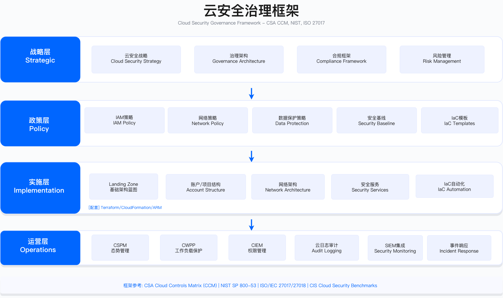

# 5.10 实战案例

本节通过四个典型场景案例，展示云安全架构在多云治理、零信任实施、容器加固与安全运营智能化方面的落地实践，重点呈现实施过程中的关键决策点、约束条件与验证方法。

> **案例说明**：本节案例为基于行业实践经验构建的综合参考场景，非特定企业实录。案例中的企业背景、实施周期、技术选型均为典型化处理，旨在呈现方法论与决策逻辑。实际实施效果取决于组织规模、技术成熟度、团队能力与投入力度，读者应根据自身情况调整。

---

## 本节概览

| 案例 | 场景 | 核心挑战 | 关键技术 |
|------|------|---------|---------|
| 案例 1 | 全球电商多云安全架构 | 多云统一治理、跨境合规 | CSPM、多云 IAM 联邦、IaC 标准化 |
| 案例 2 | 金融混合云零信任实施 | 监管合规、本地与云集成 | ZTNA、微隔离、PAM |
| 案例 3 | Kubernetes 安全加固 | 容器安全、生产环境加固 | CIS 基线、NetworkPolicy、RBAC |
| 案例 4 | 云 SOC 建设 | 海量日志分析、威胁检测 | UEBA、SOAR、ML 检测 |

每个案例围绕以下维度展开：业务背景与安全挑战、技术架构设计、分阶段实施过程、关键约束与决策权衡、验证方法与运行指标、经验教训与常见误区。

---

## 案例 1：全球电商多云安全架构

### 1.1 业务背景

**企业特征**：某跨境电商平台，业务覆盖多个国家和地区，技术栈横跨 AWS（美国/欧洲）、Azure（澳洲）与阿里云（中国）三个主要云平台。安全团队规模有限，需同时应对多云环境的安全治理需求。

**业务驱动因素**：

- 快速国际化扩张带来的多云部署需求
- 不同地区因数据主权要求使用不同云服务商
- 支付、订单、物流等核心系统分布在多云环境
- 需同时满足 GDPR、PCI DSS、PIPL 等多地区合规要求

**安全挑战**：

1. **可见性碎片化**：三个云平台的资产、配置、日志分散，缺乏统一视图
2. **策略不一致**：各云平台独立管理，安全基线标准不统一
3. **身份管理混乱**：员工需维护多套云账号，权限管理复杂度高
4. **合规约束**：GDPR 要求欧盟数据不出境，PIPL 要求中国数据本地化
5. **成本失控**：缺乏统一 FinOps 机制，云成本增长快于业务增长

### 1.2 技术架构

#### 目标架构设计

```
全球电商多云安全架构

┌─────────────────────────────────────────────────────────────────┐
│                    统一管理与控制平面                             │
│  ┌──────────────┬──────────────┬──────────────┬──────────────┐  │
│  │ IdP          │ CSPM         │ SIEM         │ IaC 平台     │  │
│  │ 统一身份 SSO │ 多云态势管理 │ 统一日志     │ 多云基础设施 │  │
│  └──────────────┴──────────────┴──────────────┴──────────────┘  │
└─────────────────────────────────────────────────────────────────┘
                    ↓           ↓           ↓
      ┌─────────────┴───────┬───┴───────┬───┴─────────────┐
      │                     │           │                 │
┌─────▼─────────┐  ┌────────▼────────┐  ┌────────▼────────────┐
│ AWS (美国/欧洲) │  │ Azure (澳洲)    │  │ 阿里云 (中国)        │
│                │  │                 │  │                     │
│ · 生产账户     │  │ · 生产订阅      │  │ · 生产账号          │
│ · 欧盟合规账户 │  │ · 测试订阅      │  │ · PIPL 合规         │
│ · 测试账户     │  │                 │  │                     │
│ · 日志账户     │  │                 │  │                     │
└────────────────┘  └─────────────────┘  └─────────────────────┘

安全基线 (全云统一):
· 身份: SSO + MFA + JIT 访问
· 日志: 集中收集 (热数据 + 冷归档)
· 态势: CSPM 持续监控 (CIS + PCI DSS + GDPR 检查)
· 加密: KMS 密钥本地化管理
· 网络: 微隔离 + WAF + DDoS 防护
```


#### 核心设计原则

下表列出了多云安全架构的核心设计原则。选择这些维度是因为它们直接对应前述五项安全挑战：统一身份解决身份混乱，本地合规解决数据主权约束，统一基线解决策略不一致，集中可见解决可见性碎片化，自动化优先解决人力资源约束。

| 原则 | 实施方式 | 理由 |
|------|---------|------|
| 统一身份 | IdP 作为统一认证源，联邦到各云平台 | 单一账号体系，避免权限混乱 |
| 本地合规 | 数据不跨境，按区域部署 | 满足 GDPR/PIPL 数据驻留要求 |
| 统一基线 | Terraform 定义安全基线，多云复用 | 确保安全策略一致性 |
| 集中可见 | 统一 CSPM + 统一 SIEM | 消除可见性盲点 |
| 自动化优先 | IaC + CSPM 自动修复 | 减少人工配置错误 |

这些原则之间存在权衡：统一基线可能与本地合规产生冲突（如阿里云 API 能力差异），需要在保持一致性的同时允许必要的本地化适配。

### 1.3 实施过程

#### 阶段 1：评估与规划

**关键活动**：

1. **资产盘点**
   - 使用 CSPM 工具扫描各云平台，建立资产清单
   - 绘制资产地图，识别关键业务系统与数据流向
   - 输出：多云资产清单与依赖关系图

2. **风险评估**
   - 识别配置错误（如公开可访问的存储桶、未启用 MFA 的账户、未加密的数据库）
   - 按风险等级分类，建立修复优先级
   - 输出：风险评估报告与修复优先级矩阵

3. **工具选型**
   - CSPM 工具需支持三个云平台（含阿里云）
   - SIEM 工具需具备成熟的多云日志集成能力
   - IdP 工具需保持云厂商中立性
   - 输出：工具选型决策矩阵与评估报告

**关键约束**：

- 工具选型受阿里云支持能力限制，部分主流工具不支持阿里云
- 评估期间需平衡扫描覆盖度与 API 调用成本
- 风险评估需获得业务团队配合，可能影响评估进度

#### 阶段 2：Landing Zone 标准化

**关键活动**：

1. **定义 Landing Zone 基线**
   - 使用 Terraform 定义标准模块：账户/订阅结构、网络架构、安全服务、IAM 基线、日志配置
   - 建立生产/测试/日志分离的多账户架构

2. **试点部署**
   - 选择单一区域作为试点，验证基线模块
   - 迁移非关键业务系统验证，收集反馈
   - 修复 IaC 代码中的兼容性问题

3. **全面推广**
   - 新建账户直接使用标准模板
   - 存量账户逐步改造，优先处理高风险账户
   - 使用 CSPM 持续监控配置漂移

**常见误区**：

- **误区 1：照搬模板**。直接使用公开的 Landing Zone 模板而不根据实际需求裁剪，导致过度复杂或不满足合规要求。应基于自身合规需求和组织能力定制模板。
- **误区 2：存量改造一刀切**。试图一次性改造所有存量账户，导致业务抵触和项目延期。应采用"新增标准 + 存量逐步改造"策略。

**验证方法**：

- 使用 CSPM 扫描验证基线合规率变化
- 红队测试验证关键控制点（如 S3 公开访问是否被有效阻断）
- 定期审计 IaC 模块与实际配置的漂移情况

#### 阶段 3：统一身份联邦

**关键活动**：

1. **部署统一 IdP**
   - 配置 IdP 作为认证源，集成企业目录服务
   - 配置 MFA 策略（管理员使用硬件令牌）

2. **云平台联邦**
   - 各云平台配置 SAML Provider 与角色映射
   - 建立组到角色的映射规则
   - 处理阿里云 SAML 支持的兼容性问题

3. **权限清理**
   - 删除本地 IAM 用户，迁移到 SSO + 临时凭证
   - 部署 CIEM 模块分析权限过度配置

**关键约束**：

- 阿里云 SAML 支持能力与 AWS/Azure 存在差异，需单独适配
- 中国网络环境可能影响 IdP 连接稳定性，需考虑加速方案
- 权限清理需与业务团队协调，避免影响日常操作

**运行指标**：

- MFA 覆盖率：按用户类型（管理员/普通用户）分别统计
- 本地 IAM 用户数量：目标趋近于零（仅保留必要的服务账号）
- 权限过度配置率：由 CIEM 工具输出，定期审计

#### 阶段 4：数据保护与合规

**关键活动**：

1. **数据分类**
   - 部署 DSPM 工具自动扫描云存储
   - 识别并标记敏感数据（PII、PCI 数据）

2. **加密加固**
   - 强制启用静态加密（存储、数据库、卷）
   - 密钥本地化：欧盟数据使用欧盟区域 KMS，中国数据使用中国区域 KMS

3. **跨境合规**
   - 实施数据驻留策略，配置策略引擎阻断跨境数据流
   - 部署 API Gateway 控制数据访问
   - 配置 CSPM 检查数据跨境违规

**验证方法**：

- 数据分类覆盖率：已分类资产数 / 总资产数
- 加密覆盖率：通过 CSPM 自动扫描验证
- 跨境合规测试：模拟跨境数据访问请求，验证阻断有效性
- 合规审计：提交外部审计验证控制有效性

#### 阶段 5：持续运营与优化

**关键活动**：

1. **CSPM 自动化修复**
   - 配置自动修复规则（关闭公开存储桶、启用加密、修复安全组）
   - 建立自动修复的豁免流程与审批机制

2. **SOC 集成**
   - CSPM 告警集成到 SIEM
   - 云原生威胁检测服务告警集成到 SOC
   - 建立云安全事件响应 playbook

3. **FinOps 协同**
   - 集成云成本管理工具
   - 识别闲置资源与右尺寸调整机会
   - 将安全与成本优化协同考虑

**运行指标**：

- 云安全风险评分：由 CSPM 综合计算
- 平均检测时间（MTTD）：从事件发生到检测的时间
- 安全事件数量：按严重等级分层统计
- 自动修复率：自动修复问题数 / 可自动修复问题数

### 1.4 成果与指标

#### 关键指标对比

以下为该案例实施前后的关键指标对比。指标数值为企业内部口径，实际效果取决于基础设施规模、团队成熟度与投入力度。

| 维度 | 实施前状态 | 实施后状态 | 变化说明 |
|------|-----------|-----------|---------|
| 资产可见性 | 多平台独立，无统一视图 | 全部资产纳入统一 CSPM | 从分散到集中 |
| 配置合规 | 符合 CIS 基线比例较低 | 符合 CIS 基线比例显著提升 | 基线标准化效果 |
| MFA 覆盖 | 部分账户启用 | 全员启用 | 身份安全增强 |
| 数据加密 | 部分敏感数据加密 | 敏感数据全加密 | 数据保护增强 |
| MTTD | 天级（依赖人工巡检） | 分钟级（自动检测） | 检测能力提升 |
| 本地 IAM 用户 | 大量本地用户 | 仅保留服务账号 | 身份治理改善 |

### 1.5 经验教训

#### 成功要素

1. **高层支持**：项目需要跨团队协调与预算支持，高层直接参与能有效推动
2. **工具选型匹配**：选择支持所有目标云平台（尤其是阿里云）的工具是关键决策
3. **分阶段实施**：先试点后推广，先新增后改造，降低实施风险
4. **自动化投入**：大规模多云环境的手工管理不可持续，自动化是必选项

#### 常见误区

1. **低估文化阻力**：开发团队可能抵制安全基线（"太严格"），运维团队担心自动化修复（"会不会误操作"）。应建立豁免流程与灰度发布机制。
2. **忽视本地化差异**：阿里云 API、功能与 AWS/Azure 差异较大，需要单独开发适配代码。
3. **工具整合复杂度**：多工具集成工作量大，应预留充足时间并寻求厂商技术支持。
4. **数据主权理解不足**：全球集中日志可能违反 GDPR，需提前咨询法务理解合规要求。

#### 适用边界

- **适用场景**：多云部署、有跨境合规要求、安全团队资源有限需要自动化的企业
- **不适用场景**：单一云平台、无跨境业务、安全成熟度很高已有完善体系的环境

---

## 案例 2：金融行业混合云零信任实施

### 2.1 业务背景

**企业特征**：某区域性金融机构，核心银行系统运行在本地数据中心，创新业务部署在公有云，同时建立云端灾备。员工分布在总部与多个分支机构，远程办公需求显著。

**业务驱动因素**：

- 数字化转型推动创新业务上云
- 监管要求满足金融行业网络安全法规
- 业务连续性要求建立云端灾备
- 远程办公需求增加对安全接入的要求

**安全挑战**：

1. **传统边界失效**：VPN 架构无法支撑大规模远程访问，存在性能瓶颈
2. **内部威胁**：特权用户（DBA/管理员）权限过大，缺乏细粒度控制
3. **混合云复杂**：本地与云互通，网络安全边界模糊
4. **合规压力**：监管要求"持续监控"、"最小权限"、"审计留痕"
5. **遗留系统**：核心银行系统历史悠久，无法大规模改造

### 2.2 技术架构

#### 零信任架构设计

```
金融混合云零信任架构

┌─────────────────────────────────────────────────────────────────┐
│                      零信任控制平面                               │
│  ┌──────────────┬──────────────┬──────────────┬──────────────┐  │
│  │ 身份验证     │ 特权管理     │ 应用访问     │ 微隔离       │  │
│  │ (IdP+MFA)    │ (PAM)        │ (ZTNA)       │ (策略引擎)   │  │
│  └──────────────┴──────────────┴──────────────┴──────────────┘  │
│         ↓              ↓              ↓              ↓            │
│  持续信任评估引擎 (continuous trust evaluation)                  │
│  · 用户身份 + 设备姿态 + 位置 + 时间 + 行为                      │
│  → 动态计算信任分数                                               │
└─────────────────────────────────────────────────────────────────┘
                           ↓
        ┌──────────────────┴──────────────────┐
        │                                      │
┌───────▼──────────┐              ┌───────────▼─────────┐
│ 本地数据中心      │              │ 混合云环境          │
│ · 核心银行系统    │  ←专线互联→  │ · 云端创新业务      │
│ · 内部应用       │              │ · 云端灾备          │
└───────────────────┘              └─────────────────────┘

零信任策略执行:
┌──────────┐     ┌──────────┐     ┌──────────┐     ┌──────────┐
│ 员工     │────►│ 认证     │────►│ 授权     │────►│ 访问     │
│ (终端)   │     │ (IdP)    │     │ (PAM/ZT) │     │ (资源)   │
└──────────┘     └──────────┘     └──────────┘     └──────────┘
   ↓                  ↓                  ↓                ↓
设备姿态          MFA+风控          最小权限          微隔离
```



#### 核心设计原则

下表列出了零信任架构的核心原则与实施方式。这些原则直接映射到 NIST SP 800-207 零信任架构参考模型。

| 零信任原则 | 实施方式 | 技术方案 |
|-----------|---------|---------|
| 永不信任，持续验证 | 每次访问重新验证身份+设备+权限 | 条件访问 + 信任分数 |
| 最小权限 | JIT 访问，默认无权限 | PAM + 会话超时 |
| 微隔离 | 应用级网络隔离，禁止横向移动 | 微隔离策略引擎 |
| 持续监控 | 所有访问行为实时审计 | SIEM + UEBA |
| 设备可信 | 仅受管设备可访问 | MDM + 设备证书 |

### 2.3 实施过程

#### 阶段 1：ZTNA 替换 VPN

**业务目标**：替换传统 VPN，支持全员远程访问内部应用

**关键活动**：

1. **部署 ZTNA 解决方案**
   - 在本地数据中心部署 connector
   - 配置应用发现，识别内部应用
   - 定义访问策略（用户组、条件、限制）

2. **集成身份验证**
   - ZTNA 作为 IdP 的 SAML 应用
   - 配置条件访问策略（基于风险等级）
   - 集成 UEBA 进行行为分析

3. **设备姿态检查**
   - 部署 MDM 管理员工设备
   - 设备合规要求：杀毒软件、系统补丁、磁盘加密、设备证书
   - 不合规设备无法通过 ZTNA 访问

4. **分批推广**
   - 先小范围试点收集反馈
   - 分批次迁移各部门
   - 保留 VPN 作为应急通道，后期下线

**关键约束**：

- 应用访问延迟需控制在可接受范围内
- 部分遗留应用可能不支持标准协议，需特殊处理
- 员工习惯变化需要培训与沟通支持

**验证方法**：

- 性能测试：验证应用访问延迟满足业务要求
- 安全测试：模拟未授权访问尝试，验证策略有效性
- 用户体验测试：收集试点用户反馈，优化策略配置

#### 阶段 2：特权访问管理

**业务目标**：管控 DBA、系统管理员等特权用户访问核心系统

**关键活动**：

1. **部署 PAM 平台**
   - 安装特权凭证保险库（高可用集群）
   - 部署密码管理与会话管理组件
   - 纳管特权账户（数据库、服务器、云管理员）

2. **JIT 访问流程**
   - 定义审批流程：请求 → 审批 → 临时凭证 → 访问 → 自动回收
   - 访问有效期限制（如 30 分钟）
   - 全程会话录制

3. **会话监控与录制**
   - 所有特权会话通过代理
   - 实时录制屏幕与命令
   - 敏感操作实时告警（DROP TABLE、DELETE 大量数据、访问 PII 字段）

4. **密钥轮换自动化**
   - 自动轮换特权密码
   - 应用程序通过 API 获取密码

**常见误区**：

- **误区 1：JIT 流程过于复杂**。审批环节过多导致效率低下，特权用户抵触。应简化流程，低风险操作可自动审批。
- **误区 2：忽视遗留系统**。老旧系统（如 AS/400）可能无法直接集成 PAM，需通过堡垒机中转方案处理。

**运行指标**：

- 特权账户纳管率：已纳管账户数 / 总特权账户数
- 共享密码使用率：目标趋近于零
- 异常特权访问检测率：由 PAM 平台输出

#### 阶段 3：微隔离

**业务目标**：实施应用级微隔离，防止横向移动

**关键活动**：

1. **资产发现与依赖分析**
   - 部署 agent 到服务器/容器
   - 自动发现应用依赖关系
   - 绘制应用拓扑图

2. **策略设计**
   - 基于应用拓扑定义微隔离策略
   - 允许必要通信，拒绝非必要连接
   - 策略覆盖核心应用

3. **策略验证**
   - 观察模式运行（记录但不阻断）
   - 识别遗漏的依赖关系并调整策略
   - 业务验证确保功能不受影响

4. **策略执行**
   - 分阶段启用执行模式
   - 先非生产后生产，先非核心后核心
   - 建立 on-call 支持机制

5. **攻击演练验证**
   - 红队模拟横向移动攻击
   - 验证微隔离策略阻断效果
   - 蓝队验证检测响应时效

**关键约束**：

- 观察模式需运行足够长时间以发现遗漏依赖
- 策略执行可能影响未识别的合法通信
- agent 部署可能带来性能开销

**验证方法**：

- 连通性测试：使用工具验证允许/拒绝的流量
- 红队测试：模拟攻破 Web 服务器后的横向移动尝试
- 回归测试：验证业务功能不受影响

### 2.4 成果与指标

#### 关键指标对比

以下为该案例实施前后的关键指标对比。指标描述为定性参考，实际效果取决于基础设施规模、团队成熟度与投入力度。

| 维度 | 实施前状态 | 实施后状态 | 变化说明 |
|------|-----------|-----------|---------|
| 远程访问 | VPN 存在并发瓶颈 | ZTNA 支持全员访问 | 容量与性能提升 |
| MFA 覆盖 | 仅 VPN 启用 | 所有访问启用 | 认证强度增强 |
| 特权管理 | 共享密码，无审批 | JIT 访问，全程录制 | 特权风险降低 |
| 横向移动防护 | 无专项防护 | 微隔离策略覆盖 | 攻击面收缩 |
| 检测时效 | 天级（人工审计） | 分钟级（自动检测） | 检测能力提升 |
| 合规审计 | 存在整改项 | 无整改项 | 合规状态改善 |

### 2.5 经验教训

#### 成功要素

1. **分阶段实施**：先非生产后生产，观察模式验证充分后再执行
2. **高管支持与文化变革**：零信任涉及流程变化，需要高层推动
3. **与业务深度协同**：安全团队嵌入业务团队，每个策略变更与业务确认
4. **自动化减少摩擦**：JIT 审批与密码轮换自动化，降低对业务影响

#### 常见误区

1. **策略设计不充分**：初期策略遗漏依赖关系，导致执行时业务中断。观察模式需运行足够时间。
2. **忽视用户体验**：JIT 流程过于复杂导致特权用户抵触。需简化流程，低风险操作自动审批。
3. **监控告警过载**：初期告警量过大，SOC 无法处理。需调优策略，控制告警数量。
4. **遗留系统兼容**：老旧系统无法直接集成，需通过堡垒机等中转方案。

#### 适用边界

- **适用场景**：有远程办公需求、特权用户管理需求、监管合规要求的金融/医疗/政务行业
- **不适用场景**：网络架构简单、无远程访问需求、特权用户很少的小型组织

---

## 案例 3：Kubernetes 安全加固案例

### 3.1 业务背景

**企业特征**：某 SaaS 软件服务商，从单体应用重构为微服务架构，全面容器化运行在托管 Kubernetes 服务上。

**业务驱动因素**：

- 微服务架构转型带来容器化需求
- 客户数据多租户隔离要求严格
- SaaS 业务要求高可用
- 需通过 SOC 2 等合规认证

**安全挑战**：

1. **Kubernetes 安全复杂**：研发团队不熟悉 K8s 安全最佳实践
2. **容器镜像漏洞**：大量微服务使用各种基础镜像，漏洞管理困难
3. **权限过度配置**：大量 Pod 使用 default ServiceAccount，权限过大
4. **网络扁平**：Pod 间无隔离，横向移动风险高
5. **合规压力**：审计要求证明容器安全控制有效性

### 3.2 技术架构

#### Kubernetes 安全加固架构

```
Kubernetes 安全加固架构

┌─────────────────────────────────────────────────────────────────┐
│                    CI/CD 安全流水线                               │
│  ┌──────────────┬──────────────┬──────────────┬──────────────┐  │
│  │ 代码构建     │ 镜像扫描     │ IaC 扫描     │ 运行时检测   │  │
│  └──────────────┴──────────────┴──────────────┴──────────────┘  │
└─────────────────────────────────────────────────────────────────┘
                           ↓
┌─────────────────────────────────────────────────────────────────┐
│                    K8s 集群 (生产)                                │
│                                                                   │
│  control plane                                                    │
│  · API Server (启用审计日志)                                     │
│  · RBAC (最小权限策略)                                           │
│  · Pod Security Standards (Restricted 模式)                      │
│                                                                   │
│  worker nodes                                                     │
│  ┌─────────────────────────────────────────────────────────┐    │
│  │ namespace: production                                    │    │
│  │ · Pod Security Standards: Restricted                     │    │
│  │ · NetworkPolicy: 默认拒绝                               │    │
│  │ · ServiceAccount: 专用账户                               │    │
│  └─────────────────────────────────────────────────────────┘    │
│                                                                   │
│  安全工具层                                                       │
│  · 运行时威胁检测                                                 │
│  · 持续漏洞扫描                                                   │
│  · 策略执行引擎                                                   │
└─────────────────────────────────────────────────────────────────┘

安全控制矩阵:
┌──────────────┬─────────────┬─────────────┐
│ 防护层       │ 控制措施    │ 目标覆盖率  │
├──────────────┼─────────────┼─────────────┤
│ 构建时       │ 镜像扫描    │ 100%        │
│              │ IaC 扫描    │ 100%        │
│              │ SBOM 生成   │ 100%        │
├──────────────┼─────────────┼─────────────┤
│ 部署时       │ PSS 策略    │ 100%        │
│              │ 准入控制    │ 100%        │
│              │ RBAC        │ 100%        │
├──────────────┼─────────────┼─────────────┤
│ 运行时       │ 行为监控    │ 100%        │
│              │ 网络隔离    │ 100%        │
│              │ 漏洞检测    │ 100%        │
└──────────────┴─────────────┴─────────────┘
```


#### CIS Kubernetes Benchmark 合规

| CIS 控制 | 要求 | 实施方式 |
|---------|------|---------|
| 5.1.1 | 确保不使用 default ServiceAccount | 为每个应用创建专用 SA |
| 5.2.2 | 最小化容器特权 | runAsNonRoot, allowPrivilegeEscalation: false |
| 5.2.3 | 最小化 root 容器 | 所有镜像使用非 root 用户 |
| 5.2.4 | 限制容器能力 | drop ALL，仅添加必要能力 |
| 5.2.5 | 只读根文件系统 | readOnlyRootFilesystem: true |
| 5.2.6 | 限制 Pod HostPath | PSS 拒绝 hostPath |
| 5.3.1 | NetworkPolicy 实施 | 所有 namespace 启用 |
| 5.7.3 | 启用审计日志 | 控制平面日志集中收集 |

### 3.3 实施过程

#### 阶段 1：基线评估与快速修复

**关键活动**：

1. **安全扫描**
   - 使用 CIS Benchmark 扫描工具评估集群
   - 识别高危问题（default SA 使用率、root 容器比例、NetworkPolicy 覆盖率、镜像漏洞率）
   - 建立基线评分作为改进参考

2. **快速修复**
   - 禁用 default ServiceAccount 自动挂载
   - 为应用创建专用 ServiceAccount
   - 配置最小权限 RBAC

3. **镜像安全基线**
   - 构建安全基础镜像（使用 Distroless 等最小镜像）
   - 集成镜像扫描到 CI/CD
   - 高危漏洞阻断发布

**关键约束**：

- 基础镜像切换可能影响应用兼容性
- CI/CD 集成扫描会增加构建时间
- 快速修复需平衡速度与影响范围

#### 阶段 2：Pod Security Standards

**关键活动**：

1. **启用 Pod Security Standards**
   - 使用 K8s 原生 PSS 替代废弃的 PodSecurityPolicy
   - 为 namespace 配置安全级别标签
   - 生产环境使用 Restricted 模式

2. **应用适配**
   - 修改 Deployment 适配 PSS 要求
   - 配置 securityContext（非 root、只读文件系统、drop capabilities）
   - 使用 emptyDir 提供必要的可写目录

3. **准入控制加固**
   - 部署策略引擎实施自定义策略
   - 禁止使用 latest 标签
   - 禁止特权容器
   - 强制资源限制

**常见误区**：

- **误区 1：readOnlyRootFilesystem 导致应用失败**。部分应用依赖可写文件系统，需提前识别并提供 emptyDir。
- **误区 2：策略过严导致部署失败**。应先使用 Audit 模式观察，再启用 Enforce 模式。

**验证方法**：

- 部署测试：验证符合 PSS 的 Pod 能正常部署
- 违规测试：验证不符合 PSS 的 Pod 被拒绝
- 功能回归：验证应用功能不受影响

#### 阶段 3：网络隔离

**关键活动**：

1. **部署 NetworkPolicy 支持**
   - 确保 CNI 支持 NetworkPolicy
   - 验证 NetworkPolicy 生效

2. **定义 NetworkPolicy**
   - 默认拒绝所有流量
   - 白名单允许必要通信（前端→后端→数据库）
   - 禁止访问云元数据 API（防止 SSRF）

3. **策略验证**
   - 使用工具验证策略效果
   - 测试允许与拒绝的流量

**关键约束**：

- NetworkPolicy 仅控制 Pod 级别流量，不控制外部流量
- 策略过严可能中断微服务间通信
- 需要 CNI 支持才能生效

**运行指标**：

- NetworkPolicy 覆盖率：启用 NetworkPolicy 的 namespace 占比
- 横向移动攻击面：通过网络扫描评估

#### 阶段 4：运行时检测

**关键活动**：

1. **部署运行时检测工具**
   - 安装 eBPF 或内核模块方式的检测 agent
   - 配置检测规则（shell 启动、可疑文件写入、异常网络连接）

2. **集成 SIEM**
   - 告警发送到集中日志平台
   - 配置告警路由与优先级

3. **响应 playbook**
   - 定义告警响应流程
   - 区分真实威胁与误报
   - 建立规则调优机制

**常见误区**：

- **误区 1：告警过多无法处理**。初期规则过于敏感导致告警泛滥。需调优规则，过滤已知正常行为。
- **误区 2：忽视开发者体验**。安全检查拖慢 CI/CD。需优化扫描并发度与缓存策略。

#### 阶段 5：合规与持续改进

**关键活动**：

1. **自动化合规检查**
   - 部署持续扫描 operator
   - 每日自动扫描镜像漏洞、配置问题、权限审计
   - 生成合规报告

2. **合规审计准备**
   - 收集审计证据（CIS 报告、扫描记录、检测日志、审计日志）
   - 编写控制文档

3. **持续改进**
   - 建立每周安全扫描节奏
   - 自动化修复低风险问题
   - 定期红队演练验证防御有效性

### 3.4 成果与指标

#### 关键指标对比

以下为该案例实施前后的关键指标对比。指标描述为定性参考，实际效果取决于集群规模、应用复杂度与团队投入。

| 维度 | 实施前状态 | 实施后状态 | 变化说明 |
|------|-----------|-----------|---------|
| CIS 评分 | 较低 | 显著提升 | 基线合规改善 |
| 高危漏洞镜像 | 占比较高 | 占比极低 | 漏洞管理改善 |
| 特权容器 | 存在 | 消除 | 权限最小化 |
| NetworkPolicy | 无覆盖 | 全覆盖 | 网络隔离实现 |
| 运行时检测 | 无监控 | 全覆盖 | 检测能力建立 |
| MTTD | 小时级 | 分钟级 | 检测时效提升 |

### 3.5 经验教训

#### 成功要素

1. **分层防御**：构建时（镜像扫描）+ 部署时（PSS/准入控制）+ 运行时（行为监控），任何一层失效其他层可兜底
2. **自动化集成到开发流程**：扫描集成到 CI/CD，开发者立即看到结果
3. **提供安全基础镜像**：预构建符合安全要求的基础镜像，降低开发者学习成本
4. **渐进式实施**：先 Audit 模式后 Enforce 模式，避免一刀切影响业务

#### 常见误区

1. **低估应用适配工作量**：readOnlyRootFilesystem 导致部分应用需要重构
2. **NetworkPolicy 过于严格**：策略过严导致微服务间通信中断
3. **告警过载**：初期告警过多，SOC 无法处理
4. **忽视开发者体验**：安全检查拖慢 CI/CD

#### 适用边界

- **适用场景**：容器化微服务架构、有合规认证需求、希望建立容器安全基线的组织
- **不适用场景**：传统虚拟机为主的架构、Kubernetes 使用规模很小的环境

---

## 案例 4：云 SOC 建设案例 (AI 驱动威胁检测与自动化响应)

### 4.1 业务背景

**企业特征**：某大型科技公司，云原生架构为主，微服务数量众多，每天部署频繁。安全团队包括 SOC、云安全、应用安全与红队 / IR 等职能。

**业务驱动因素**：

- 全球化业务，7×24 不间断运营
- 高价值目标（用户数据、支付信息）
- 云原生架构，部署频率高
- 多项合规要求

**安全挑战**：

1. **数据量爆炸**：每天产生大量安全日志，传统 SIEM 处理能力不足
2. **误报泛滥**：CSPM / CWPP 产生大量告警，分析师疲于应对
3. **威胁复杂化**：APT 攻击跨越多个云账户/服务，传统规则难以检测
4. **响应延迟**：人工分析耗时长，攻击者可能已完成横向移动
5. **人才短缺**：无法 7×24 覆盖，夜间 / 周末检测存在空白

### 4.2 技术架构

#### AI 驱动云 SOC 架构

```
AI 驱动云 SOC 架构

┌─────────────────────────────────────────────────────────────────┐
│                      数据收集层                                   │
│  ┌────────┬────────┬────────┬────────┬────────┬────────┐       │
│  │云审计  │身份    │CSPM    │CWPP    │代码    │网络    │       │
│  │日志    │日志    │告警    │告警    │审计    │流日志  │       │
│  └────────┴────────┴────────┴────────┴────────┴────────┘       │
│                    数据管道（流处理平台）                         │
└─────────────────────────────────────────────────────────────────┘
                           ↓
┌─────────────────────────────────────────────────────────────────┐
│                    AI 分析引擎层                                  │
│                                                                   │
│  ┌──────────────────────────────────────────────────────────┐   │
│  │ 1. 异常检测 (UEBA)                                       │   │
│  │    · 用户行为基线                                         │   │
│  │    · 实体行为基线                                         │   │
│  │    → 输出: 异常评分                                      │   │
│  └──────────────────────────────────────────────────────────┘   │
│  ┌──────────────────────────────────────────────────────────┐   │
│  │ 2. 威胁情报关联                                          │   │
│  │    · 恶意 IP/域名/哈希库                                  │   │
│  │    → 输出: 威胁置信度                                    │   │
│  └──────────────────────────────────────────────────────────┘   │
│  ┌──────────────────────────────────────────────────────────┐   │
│  │ 3. ML 威胁分类                                           │   │
│  │    · 训练数据: 历史安全事件                              │   │
│  │    → 输出: 威胁类型 + 置信度                             │   │
│  └──────────────────────────────────────────────────────────┘   │
│  ┌──────────────────────────────────────────────────────────┐   │
│  │ 4. 攻击链重建                                            │   │
│  │    · 图数据库存储实体关系                                │   │
│  │    → 输出: 攻击拓扑图                                    │   │
│  └──────────────────────────────────────────────────────────┘   │
│  ┌──────────────────────────────────────────────────────────┐   │
│  │ 5. 智能优先级排序                                        │   │
│  │    综合评分 = 异常评分 × w1 + 威胁情报评分 × w2          │   │
│  │              + ML 分类置信度 × w3                         │   │
│  │    → 仅高综合评分告警进入工单队列                        │   │
│  └──────────────────────────────────────────────────────────┘   │
└─────────────────────────────────────────────────────────────────┘
                           ↓
┌─────────────────────────────────────────────────────────────────┐
│                  自动化响应层 (SOAR)                              │
│                                                                   │
│  playbook 1: 凭证泄露响应                                        │
│   触发: 异地登录 + 异常访问 + 凭证查询                          │
│   动作: 禁用用户 → 撤销会话 → 强制 MFA → 通知 → 创建工单        │
│                                                                   │
│  playbook 2: 挖矿检测响应                                        │
│   触发: CPU 异常 + 可疑进程 + 矿池连接                          │
│   动作: 隔离实例 → 创建快照 → 终止进程 → 标记 → 通知           │
│                                                                   │
│  playbook 3: 数据外泄响应                                        │
│   触发: 大量下载 + 异常目标 + 敏感数据访问                      │
│   动作: 阻断 IP → 撤销权限 → 通知 DPO → 冻结账户               │
└─────────────────────────────────────────────────────────────────┘
                           ↓
┌─────────────────────────────────────────────────────────────────┐
│                    可视化与协作层                                 │
│  ┌──────────────┬──────────────┬──────────────┬──────────────┐  │
│  │ 监控仪表盘   │ 工单系统     │ 协作平台     │ 调查分析     │  │
│  └──────────────┴──────────────┴──────────────┴──────────────┘  │
└─────────────────────────────────────────────────────────────────┘

关键运行指标:
· 误报率变化
· MTTD（平均检测时间）
· MTTR（平均响应时间）
· 自动化响应率
```

#### AI 模型设计

下表列出了 AI 驱动 SOC 中使用的主要模型能力。选择这些维度是因为它们对应不同的检测目标：UEBA 检测行为异常，威胁分类识别攻击类型，攻击链重建理解攻击路径，误报过滤提升分析师效率。

| AI 能力 | 技术方案 | 输入特征 | 输出 |
|-------|---------|---------|------|
| UEBA | 异常检测算法 | 用户/实体行为序列 | 异常评分 |
| 威胁分类 | 监督学习模型 | 多维度特征 | 威胁类型 + 置信度 |
| 攻击链重建 | 图分析算法 | 实体关系图 | 攻击路径 |
| 误报过滤 | 分类模型 | 历史告警 + 人工反馈 | 真实威胁概率 |

模型准确率取决于训练数据质量、特征工程深度与持续调优投入，实际效果需在具体环境中验证。

### 4.3 实施过程

#### 阶段 1：数据基础建设

**关键活动**：

1. **统一日志收集**
   - 部署流处理平台（如 Kafka 集群）
   - 集成各数据源（云审计日志、VPC Flow Logs、身份日志、CSPM 告警等）
   - 数据格式标准化（统一字段映射）

2. **构建数据湖**
   - 云存储作为数据湖（热数据短期保留，冷数据长期归档）
   - 支持历史查询与分析

3. **部署 SIEM**
   - 配置索引器与搜索头集群
   - 配置数据模型（通用信息模型）

**关键约束**：

- 日志量大带来存储与计算成本压力
- 数据格式标准化工作量大
- 日志延迟影响检测时效

#### 阶段 2：UEBA 部署

**关键活动**：

1. **部署 UEBA 平台**
   - 配置用户 / 实体数据源
   - 基线学习期（建议至少 30 天）

2. **训练行为基线**
   - 自动学习正常行为模式
   - 异常检测（偏离基线的行为）

3. **调优与反馈**
   - 分析师反馈异常是否为真实威胁
   - 模型根据反馈自适应学习
   - 降低误报率

**验证方法**：

- 红队测试：模拟异常行为（异地登录、异常时间访问）验证检测能力
- 误报率统计：统计分析师确认为误报的比例
- 检测覆盖度：验证关注场景的检测覆盖

#### 阶段 3：ML 威胁检测模型

**关键活动**：

1. **特征工程**
   - 从日志提取多维度特征（用户、资源、行为、网络、上下文）
   - 特征存储（实时 + 历史）

2. **模型训练**
   - 训练数据：历史安全事件（正样本为确认攻击，负样本为误报 / 正常）
   - 模型类型：分类模型（如 XGBoost、深度学习）
   - 评估指标：Precision、Recall、F1-Score、AUC

3. **模型部署**
   - 部署为 SIEM 自定义搜索命令或独立服务
   - 实时预测延迟控制

**关键约束**：

- 训练数据质量直接影响模型效果（垃圾进垃圾出）
- 正负样本不平衡问题需要处理
- 模型漂移需要持续监控与重训练

#### 阶段 4：SOAR 自动化响应

**关键活动**：

1. **部署 SOAR 平台**
   - 集成各系统 API（云平台、身份系统、通知系统、工单系统、威胁情报）

2. **开发 playbook**
   - 针对 TOP N 痛点场景开发自动化响应
   - 区分自动执行与需人工确认的操作
   - 建立灰度发布机制

3. **灰度发布**
   - 先 Dry-run 模式（仅记录不执行）
   - 低风险场景先自动执行
   - 高风险场景需人工确认
   - 逐步提升自动化比例

**常见误区**：

- **误区 1：自动化误操作导致业务中断**。playbook 误判正常行为为攻击，自动隔离导致服务中断。应增加置信度阈值、高风险操作人工确认、建立回滚机制。
- **误区 2：SOAR API 速率限制**。批量响应触发 API 限流。应实施批量操作、引入队列机制、申请速率提升。

**运行指标**：

- 自动化响应率：自动响应事件数 / 总响应事件数
- MTTR：从检测到响应完成的时间
- 误操作率：自动化导致误操作的事件占比

#### 阶段 5：持续优化

**关键活动**：

1. **模型持续训练**
   - 收集新样本（真实攻击 + 误报）
   - 定期重新训练模型
   - A/B 测试新旧模型

2. **playbook 优化**
   - 分析响应效果
   - 优化响应逻辑
   - 新增 playbook 覆盖新威胁

3. **红队验证**
   - 红队模拟攻击验证检测能力
   - 发现检测盲点
   - 测试 SOAR 响应速度

### 4.4 成果与指标

#### 关键指标对比

以下为该案例实施前后的关键指标对比。指标描述为定性参考，AI/ML 模型效果高度依赖数据质量、模型选择与持续调优，实际效果因环境而异。

| 维度 | 实施前状态 | 实施后状态 | 变化说明 |
|------|-----------|-----------|---------|
| 告警数量 | 大量（需人工处理） | 显著减少（AI 过滤） | 分析师负载降低 |
| 误报率 | 较高 | 显著降低 | AI 过滤效果 |
| MTTD | 小时级 | 分钟级 | 检测时效提升 |
| MTTR | 小时级 | 分钟级 | 响应时效提升 |
| 夜间覆盖 | 无人值守 | AI 7×24 监控 | 检测覆盖扩展 |
| 自动化率 | 很低 | 显著提升 | 运营效率提升 |

#### 典型检测案例

**案例 A：APT 攻击检测**

攻击链：钓鱼邮件 → 凭证泄露 → 攻击者登录 → 侦察 → 横向移动 → 数据外泄

传统检测：攻击完成多日后人工审计发现
AI 检测：早期阶段（异地登录 + 异常侦察行为）即检测到，阻断后续攻击链

**案例 B：内部威胁检测**

场景：离职员工在最后工作日大量下载代码 / 文档

检测：UEBA 检测到下载量异常飙升，访问了从未访问过的敏感仓库，异常评分极高
响应：SOAR 自动禁用访问权限，通知 HR 与法务，及时阻断

**案例 C：挖矿攻击检测**

场景：攻击者利用 SSRF 漏洞在 serverless 函数植入挖矿脚本

检测：监控检测到 CPU 异常，网络流日志检测到连接矿池 IP，ML 模型分类为挖矿攻击
响应：SOAR 自动禁用函数，创建快照取证，通知开发团队修复漏洞

### 4.5 经验教训

#### 成功要素

1. **数据质量是 AI 的基础**：投入充分时间建设数据基础，确保日志完整、及时、准确
2. **业务场景驱动**：先识别 TOP N 痛点场景，针对场景开发 playbook
3. **人机协作**：高风险操作需人工确认，AI 负责检测与建议，人类负责决策
4. **持续训练与迭代**：模型需持续学习，定期重新训练，A/B 测试验证效果

#### 常见误区

1. **过度依赖 AI，忽视规则**：AI 无法百分百准确，需要传统规则兜底
2. **忽视数据隐私**：UEBA 分析用户行为可能涉及隐私，需脱敏处理并获得法务批准
3. **模型漂移**：攻击者技术演进，旧模型检测率下降，需监控准确率并定期重训练
4. **SOAR 自动化风险**：误操作可能导致业务中断，需灰度发布、人工确认、回滚机制

#### 适用边界

- **适用场景**：日志量大、告警多、需要 7×24 监控、有 AI / ML 能力的大型组织
- **不适用场景**：日志量小、安全事件少、缺乏 AI / ML 人才与基础设施的小型组织

---

## 本节小结

### 核心要点

本节通过四个典型场景案例，展示了云安全架构的落地实践：

1. **案例 1（全球电商多云）**：展示如何通过统一管理平台解决多云可见性碎片化、策略不一致、身份混乱等问题
2. **案例 2（金融零信任）**：展示如何在混合云环境实施零信任架构，通过 ZTNA 替换 VPN、PAM 管控特权访问、微隔离防止横向移动
3. **案例 3（K8s 加固）**：展示如何通过分层防御（构建时 / 部署时 / 运行时）、Pod Security Standards、NetworkPolicy、运行时检测实现容器环境加固
4. **案例 4（AI 驱动 SOC）**：展示如何通过 UEBA、ML 威胁检测、SOAR 自动化响应实现 SOC 智能化转型

### 共同成功要素

| 要素 | 案例 1 | 案例 2 | 案例 3 | 案例 4 |
|-----|-------|-------|-------|-------|
| 高层支持 | 高管担任 Sponsor | 高管推动 | 预算批准 | 直接汇报 |
| 分阶段实施 | 多阶段推进 | 多阶段推进 | 多阶段推进 | 多阶段推进 |
| 自动化优先 | IaC + CSPM | JIT + 密码轮换 | CI/CD 集成 | SOAR |
| 持续优化 | 定期评审 | 定期评审 | 每周扫描 | 模型训练 |

### 共同挑战与解决方案

| 挑战 | 表现 | 通用解决方案 |
|-----|------|------------|
| 文化阻力 | 开发/运维抵制安全控制 | 豁免流程 + 安全基础设施 + 培训 |
| 工具整合 | 多工具 API 对接复杂 | 选择开放 API 工具 + 厂商支持 + 预留时间 |
| 误报过载 | 初期告警泛滥 | AI 过滤 + 规则调优 + 反馈闭环 |
| 业务影响 | 安全控制影响交付 | 自动化 + 灰度发布 + 回滚机制 |

### 实施路线图建议

基于四个案例的经验，建议企业按以下优先级实施云安全架构：

**P0（基础安全）**：
- 建立 Landing Zone 标准
- 统一身份管理 SSO + MFA
- 部署 CSPM 持续监控
- 启用云原生安全服务
- 集中日志审计

**P1（深度防御）**：
- 实施容器安全基线
- 部署 CWPP 工作负载保护
- 实施网络微隔离
- DevSecOps 集成
- 建立云安全运营体系

**P2（高级能力）**：
- 实施零信任架构
- 部署 AI 威胁检测
- SOAR 自动化响应
- 特权访问管理 PAM
- 多云统一治理

### 需要避免的陷阱

1. **工具堆砌，缺乏整合**：购买大量安全工具但彼此孤立，告警泛滥，实际能力未提升
2. **忽视业务影响，一刀切**：强制推行严格策略不考虑业务差异，导致抵触与妥协
3. **过度依赖自动化**：认为 AI / SOAR 可完全替代人工，忽视误操作风险
4. **忽视数据质量**：日志不完整就急于部署 AI，导致模型无法准确
5. **缺乏持续优化**：实施完成后不再维护，检测率逐渐下降

---

## 导航

**[← 上一节：5.9 多云治理](./5.9_multi_cloud_governance.md)** | **[返回章节目录](./README.md)** | **[下一章：Chapter 6 应用安全 →](../chapter_06_application_security_architecture/README.md)**

---

**© 2025 AI-ESA Project. Licensed under CC BY-NC-SA 4.0**

