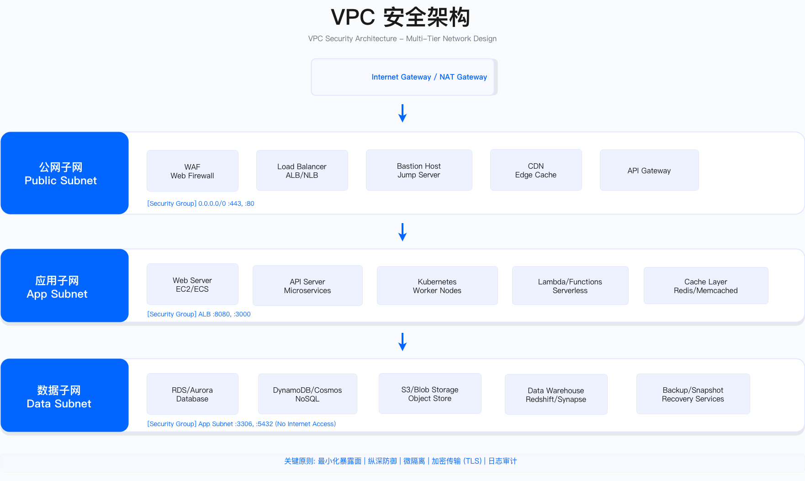

# 5.3 云网络安全

云环境网络威胁模型已从传统"边界防御"转变为"东西向零信任",但多数组织仍在使用基于静态IP与VLAN的控制手段。本节从VPC架构设计、微隔离实现、DDoS防护、WAF规则调优、CDN安全配置、SASE架构演进六个维度,提供决策框架与工程验收标准。

---

## 5.3.1 VPC安全架构

### 问题背景:从"扁平网络"到"纵深防御"

云迁移早期常见做法是将所有资源放入单一子网,为开发便利性允许公网访问数据库。这种扁平架构在Capital One 2019年数据泄露事件中被证明存在致命缺陷:攻击者通过Web层SSRF漏洞访问EC2元数据服务获取IAM凭证,进而横向移动至700+个S3 Bucket,整个攻击链未遇到任何网络层阻断。

某金融机构在2018-2022年积累了205个VPC,其中35个RDS实例配置公网访问(占比29%),CIDR重叠导致30个VPC无法互联,Security Group规则达到8,500条。网络故障排查平均耗时4小时,需登录多个VPC逐一查看Flow Logs。

### 3层VPC设计

分层原则基于数据敏感度与暴露面控制:

| 层级 | 子网类型 | 路由特征 | 典型资源 | 约束条件 |
|------|---------|---------|---------|---------|
| Public Layer | Public Subnet | Internet Gateway出站 | ALB、NAT Gateway、Bastion | - 仅放置无状态组件<br>- Security Group严格限制源IP<br>- 强制DDoS防护 |
| Private Layer | Private Subnet | NAT Gateway出站 | App Servers、ECS、Lambda | - 禁止公网IP<br>- 通过Security Group微隔离<br>- 必须启用Flow Logs |
| Data Layer | Data Subnet | 无Internet路由 | RDS、ElastiCache、EFS | - 永不配置公网访问<br>- 传输/静态双重加密<br>- NACL额外保护 |



*图:3层VPC架构将暴露面限制在Public Subnet,数据库层完全隔离*

#### CIDR规划约束

VPC CIDR创建后无法修改,需在规划阶段考虑:

1. **全局视角分配**:按Region/环境分配不重叠网段(例如us-east-1为10.0.0.0/16,eu-west-1为10.2.0.0/16)
2. **预留扩展空间**:每个VPC预留至少1个/24用于未来新增子网或VPN互联
3. **避免RFC1918冲突**:检查本地数据中心CIDR,避免专线互联时冲突

常见错误:所有VPC使用10.0.0.0/16,后期需要VPC Peering时发现无法互联,必须迁移工作负载(成本高、风险大)。

#### 跨Region互联决策

AWS Transit Gateway与Azure Virtual WAN的选择依据:

| 场景 | 推荐方案 | 依据 |
|------|---------|------|
| 单Region <50个VPC | VPC Peering | 成本最低,无中心化故障点 |
| 单Region >50个VPC | Transit Gateway | 简化路由表管理,支持5,000 VPCs |
| 全球多Region部署 | Azure Virtual WAN 或 TGW Peering | Virtual WAN原生全球Hub-Spoke,TGW需跨区域Peering |
| 需SD-WAN集成 | Azure Virtual WAN | 原生支持主流SD-WAN厂商 |

成本示例:100个VPC场景下,Transit Gateway约$3,650/月(50美元/连接×73对+数据传输费),VPC Peering无连接费用但管理复杂度高(需维护4,950个连接)。

### 验证方法

- **CIDR冲突检测**:使用AWS VPC IPAM或自研脚本扫描全账户CIDR,标记重叠
- **公网暴露审计**:AWS Config规则`rds-instance-public-access-check`检测公网可达数据库
- **路径可达性测试**:VPC Reachability Analyzer验证Private Subnet无法直达Internet

### 运行关注指标

- **CIDR利用率**:已分配子网数/可用子网数,触发阈值>80%需规划新VPC
- **公网暴露资产数**:目标=0(除ALB/NAT Gateway/Bastion外)
- **故障排查时长**:baseline 4小时 → 目标<30分钟(通过Flow Logs Insights加速)

---

## 5.3.2 微隔离实现

### 问题背景:从VLAN到Security Group的范式转变

传统数据中心使用VLAN隔离(例如VLAN 10=Web层、VLAN 20=App层),通过防火墙控制跨VLAN流量。云环境中将VLAN 1:1映射为Subnet,继续使用过度宽松规则(如"允许10.0.0.0/8访问3306端口"),导致某跨境电商企业PCI DSS审计失败:支付处理服务器与营销网站在同一Subnet,Security Group规则技术上允许营销网站访问支付数据库(虽无实际流量),违反PCI DSS 1.2.1(限制CDE与不可信网络流量)。

该企业18个月转型路径:
1. **现状摸底(第1-3月)**:启用VPC Flow Logs,分析发现40%的Security Group规则从未被使用,120个应用实际只有280个依赖关系,但规则允许1,200+个技术可达路径
2. **渐进收紧(第4-9月)**:将0.0.0.0/0或10.0.0.0/8替换为Security Group引用(如"sg-web访问sg-app的8080端口"),使用AWS Network Firewall Count模式测试2周,发现12%新规则过严(阻断夜间批处理)
3. **K8s NetworkPolicy(第10-18月)**:微服务应用迁移到EKS,实施"默认拒绝+显式允许",支付服务NetworkPolicy仅允许3个Egress目标

转型成果:Security Group规则从1,200条降至320条(减少73%),某次Web服务器被Log4Shell攻陷后,攻击者横向移动被Security Group阻断(0次成功横向移动),PCI DSS审计成本从$120K/年降至$60K/年。

### AWS Security Groups核心特性

- **有状态防火墙**:允许入站自动允许响应出站,简化规则管理
- **实例级别**:附加到ENI,实现实例级微隔离(比子网级NACL更细粒度)
- **白名单模型**:默认拒绝所有,需显式允许(最小权限原则)
- **动态引用**:可引用其他Security Group作为源/目标,解耦IP地址依赖

3层应用隔离示例:

```terraform
resource "aws_security_group" "alb" {
  name        = "sg-alb-prod"
  description = "ALB security group"
  vpc_id      = aws_vpc.main.id

  ingress {
    description = "HTTPS from Internet"
    from_port   = 443
    to_port     = 443
    protocol    = "tcp"
    cidr_blocks = ["0.0.0.0/0"]
  }

  egress {
    from_port   = 0
    to_port     = 0
    protocol    = "-1"
    cidr_blocks = ["0.0.0.0/0"]
  }
}

resource "aws_security_group" "app" {
  name        = "sg-app-prod"
  description = "Application server security group"
  vpc_id      = aws_vpc.main.id

  # 只允许来自ALB的流量
  ingress {
    description     = "HTTP from ALB"
    from_port       = 8080
    to_port         = 8080
    protocol        = "tcp"
    security_groups = [aws_security_group.alb.id]
  }

  # 允许App间通信(微服务)
  ingress {
    description = "App to App"
    from_port   = 8080
    to_port     = 8080
    protocol    = "tcp"
    self        = true # 引用自身SG
  }

  # 允许出站到数据库
  egress {
    description     = "PostgreSQL to RDS"
    from_port       = 5432
    to_port         = 5432
    protocol        = "tcp"
    security_groups = [aws_security_group.database.id]
  }
}

resource "aws_security_group" "database" {
  name        = "sg-database-prod"
  description = "Database security group"
  vpc_id      = aws_vpc.main.id

  # 只允许来自App层的数据库连接
  ingress {
    description     = "PostgreSQL from App"
    from_port       = 5432
    to_port         = 5432
    protocol        = "tcp"
    security_groups = [aws_security_group.app.id]
  }

  # 数据库无需出站访问
}
```

### Kubernetes NetworkPolicy实现

K8s默认所有Pod间通信无限制,需显式定义NetworkPolicy实现微隔离:

```yaml
apiVersion: networking.k8s.io/v1
kind: NetworkPolicy
metadata:
  name: frontend-network-policy
  namespace: production
spec:
  podSelector:
    matchLabels:
      app: frontend
      tier: web
  policyTypes:
  - Ingress
  - Egress
  ingress:
  # 允许来自Ingress Controller
  - from:
    - namespaceSelector:
        matchLabels:
          name: ingress-nginx
    ports:
    - protocol: TCP
      port: 8080
  egress:
  # 允许访问backend服务
  - to:
    - podSelector:
        matchLabels:
          app: backend
          tier: api
    ports:
    - protocol: TCP
      port: 8080
  # 允许DNS解析
  - to:
    - namespaceSelector:
        matchLabels:
          name: kube-system
    - podSelector:
        matchLabels:
          k8s-app: kube-dns
    ports:
    - protocol: UDP
      port: 53
```

约束条件:
- 需CNI插件支持(Calico/Cilium/Weave Net),AWS VPC CNI不原生支持NetworkPolicy
- 默认拒绝策略会阻断未定义的合法流量,需先绘制应用依赖关系图
- NetworkPolicy不支持跨Namespace引用(需通过namespaceSelector间接实现)

### 验证方法

- **规则覆盖率**:VPC Flow Logs分析所有Security Group规则是否有实际流量,标记未使用规则
- **横向移动测试**:红队从Web层Pod尝试访问数据库Pod,验证NetworkPolicy阻断
- **合规证据**:导出Security Group/NetworkPolicy配置文件,映射到PCI DSS/NIST控制点

### 运行关注指标

- **Security Group规则数**:baseline 1,200条 → 目标<500条(行业经验值:平均每应用<5条规则)
- **未使用规则占比**:目标<10%(通过Flow Logs Insights查询)
- **横向移动阻断率**:红队演练中阻断成功率目标>95%

---

## 5.3.3 DDoS防护

### 问题背景:从"被动挨打"到"自动清洗"

某月活800万手游公司在2023年黑色星期五遭受500Gbps DDoS攻击持续48小时。攻击开始时ALB响应时间从200ms飙升至15秒,Auto Scaling扩容至200实例上限,EC2成本从$800/天飙升至$12,000/天,但仍无法响应正常请求。企业使用AWS Shield Standard(免费基础防护),但该服务仅防护常见SYN Flood/UDP Reflection(L3/L4),对HTTP Flood(L7)无效。紧急购买Shield Advanced($3,000/月)后,因WAF规则配置错误,误报率达80%(正常玩家流量被阻断)。AWS DDoS Response Team介入24小时后,基于请求频率+TLS指纹+行为分析定制WAF规则,逐步清洗攻击流量。

总损失:$280K直接成本(EC2超配$180K + Shield Advanced $3K + WAF $12K + CloudFront $85K)+ $1.2M间接损失(玩家流失、活动收入、品牌声誉)。

教训:
1. 免费防护仅覆盖L3/L4,现代攻击90%为L7应用层攻击
2. 事后响应成本是提前部署的15倍(攻击期间紧急扩容vs平时Shield Advanced订阅)
3. WAF规则需2-4周调优期,无法开箱即用

### DDoS攻击分层防护

| 层级 | 攻击类型 | 原理 | 防护方式 | 触发阈值示例 |
|------|---------|------|---------|-------------|
| L3/L4 | SYN Flood | TCP三次握手耗尽连接 | SYN Cookie、Rate Limiting | >10,000 SYN/sec |
| L3/L4 | UDP Flood | 大量UDP包耗尽带宽 | 流量清洗、黑洞路由 | >50 Gbps |
| L7 | HTTP Flood | 大量HTTP请求 | WAF、JS挑战、验证码 | >10,000 req/sec |
| L7 | Slowloris | 慢速连接占用资源 | 连接超时、限制慢速 | 连接保持>30秒 |

### 防护方案对比

| 维度 | AWS Shield Advanced | Cloudflare Magic Transit | Azure DDoS Protection |
|------|-------------------|--------------------------|----------------------|
| 防护层级 | L3/L4/L7 | L3/L4/L7 | L3/L4/L7 |
| 清洗容量 | 未公开(推测>1 Tbps) | 121 Tbps(实测) | 3.47 Tbps(峰值) |
| 响应时间 | 秒级 | 3秒内 | 秒级 |
| 全球节点 | AWS边缘节点(450+) | 310+城市 | Azure边缘节点 |
| 成本保护 | 攻击期间费用豁免 | Flat rate | 需额外购买 |
| DDoS响应团队 | 24x7 DRT | Magic Transit Team | DDoS RRT |
| 价格 | $3,000/月 + $0.5-2/GB | $5,000-20,000/月 | $2,944/月(标准) |
| 适用场景 | AWS为主 | 多云/混合云 | Azure为主 |

选择依据:
- **AWS生态**:选Shield Advanced,与CloudTrail/WAF/CloudFront原生集成
- **全球最强防护**:选Cloudflare,121 Tbps实测容量,2023年抵挡过71M RPS HTTP DDoS
- **Azure生态**:选Azure DDoS Protection Standard,与Azure Monitor/Sentinel原生集成

### 多层防护架构

分层部署提供纵深防御:

1. **L3网络层**:BGP Anycast路由分散流量,Flowspec黑洞路由丢弃攻击包
2. **L4传输层**:SYN Cookie防护,Connection限速(每IP最大100并发连接)
3. **L7应用层**:WAF Rate Limiting(每IP 100 req/min),JS挑战验证真实浏览器,验证码(攻击期间自动触发)
4. **基础设施层**:Auto Scaling预留2-10倍基线容量,CDN缓存减少Origin负载

Cloudflare DDoS规则配置示例:

```bash
curl -X POST "https://api.cloudflare.com/client/v4/zones/{zone_id}/rulesets/phases/ddos_l7/entrypoint" \
  -H "Authorization: Bearer YOUR_API_TOKEN" \
  -H "Content-Type: application/json" \
  -d '{
  "rules": [
    {
      "action": "managed_challenge",
      "expression": "(http.request.uri.path contains \"/api/\" and cf.threat_score > 10)",
      "description": "Challenge suspicious API requests",
      "enabled": true
    },
    {
      "action": "block",
      "expression": "(http.request.uri.path eq \"/admin\" and not ip.src in {1.2.3.4 5.6.7.8})",
      "description": "Block admin access from untrusted IPs",
      "enabled": true
    },
    {
      "action": "challenge",
      "expression": "(cf.bot_management.score < 30)",
      "description": "Challenge likely bots",
      "enabled": true
    }
  ]
}'
```

### 验证方法

- **DDoS模拟演练**:使用AWS DDoS Test模拟攻击(需提前申请白名单),验证Shield+WAF组合防护能力
- **流量基线建立**:记录正常业务峰值流量(如促销期间10,000 req/sec),设定阈值为baseline 2倍

### 运行关注指标

- **DDoS事件检测时间(MTTD)**:目标<5分钟(通过CloudWatch Alarm或Cloudflare自动检测)
- **攻击流量清洗率**:目标>95%(合法流量通过率>98%)
- **成本保护生效**:Shield Advanced攻击期间EC2/ELB费用豁免金额(需与AWS Support确认)

---

## 5.3.4 WAF规则设计

### 问题背景:从"一键启用"到"精准调优"

某年ARR $45M的B2B SaaS平台(日均API请求2亿次)在遭受SQL注入攻击后,直接启用AWS WAF + OWASP Core Rule Set 3.3所有规则,模式设置为Block。上线2小时后,客户支持接到120+张工单:"API返回403 Forbidden,无法使用"。紧急回滚后发现误报率高达60%。

误报根因:
1. **SQL注入规则过敏**:API允许SQL-like查询语法(如`SELECT revenue FROM table WHERE date > '2023-01-01'`),被WAF误判
2. **XSS规则误判**:某客户产品名称包含`<script>`标签(HTML编码后),仍被阻断
3. **User-Agent检测**:企业客户自定义User-Agent(`CompanyName-DataFetcher/1.0`),被识别为异常客户端

90天调优过程:
1. **建立baseline(第1-2周)**:所有规则改为Count模式,收集2周真实流量
2. **逐个启用(第3-12周)**:每次启用1个规则,观察3天,监控误报率与客户工单数
3. **白名单例外(持续)**:对高误报规则(SQL注入检测),添加URI路径白名单(允许`/api/query/*`路径的SQL语法)
4. **自定义正则**:针对业务API语法定制规则,误报率从60%降至5%
5. **自动化调优**:使用Athena查询WAF日志,自动生成白名单候选,通过Terraform更新规则

最终成果:误报率从60%降至8%(行业best practice <10%),真实攻击阻断率98.5%,客户工单从120张/天降至2张/周。

### OWASP Top 10防护规则

AWS WAF规则集示例(需根据业务调整):

```json
{
  "Name": "OWASP-Top-10-Protection",
  "Rules": [
    {
      "Name": "SQLInjection-Protection",
      "Priority": 1,
      "Statement": {
        "SqliMatchStatement": {
          "FieldToMatch": {
            "QueryString": {}
          },
          "TextTransformations": [
            {"Priority": 0, "Type": "URL_DECODE"},
            {"Priority": 1, "Type": "HTML_ENTITY_DECODE"}
          ]
        }
      },
      "Action": {
        "Block": {
          "CustomResponse": {
            "ResponseCode": 403
          }
        }
      },
      "VisibilityConfig": {
        "SampledRequestsEnabled": true,
        "CloudWatchMetricsEnabled": true,
        "MetricName": "SQLInjectionRule"
      }
    },
    {
      "Name": "Rate-Limiting",
      "Priority": 5,
      "Statement": {
        "RateBasedStatement": {
          "Limit": 2000,
          "AggregateKeyType": "IP"
        }
      },
      "Action": {
        "Block": {
          "CustomResponse": {
            "ResponseCode": 429
          }
        }
      }
    }
  ]
}
```

### 渐进式部署策略

| 阶段 | 模式 | 观察期 | 操作 | 目标 |
|------|------|--------|------|------|
| 1. Baseline | Count | 2周 | 记录所有匹配,不阻断 | 建立流量基线 |
| 2. Pilot | Count | 1周 | 选择低风险规则(如已知恶意IP) | 验证规则准确性 |
| 3. Gradual Rollout | Block | 每个规则3天 | 逐个规则从Count切换Block | 误报率<10% |
| 4. Fine-tuning | Block + Exception | 持续 | 根据误报日志添加白名单 | 阻断率>95% |

约束条件:
- 永远不要在生产环境直接Block,必须先Count模式观察
- 白名单例外需代码审查(防止过度放宽,引入安全风险)
- 每周Review CloudWatch Metrics(WAFBlockedRequests、WAFAllowedRequests)

### 验证方法

- **攻击模拟**:使用OWASP ZAP或Burp Suite发送SQL注入/XSS Payload,验证WAF阻断
- **误报检测**:在Count模式下运行自动化测试套件(包含所有合法API请求),检查是否匹配规则

### 运行关注指标

- **误报率**:误报请求数/总阻断请求数,目标<10%
- **真实攻击阻断率**:通过红队演练或HackerOne漏洞赏金验证,目标>95%
- **规则调优频率**:每周新增白名单数量,成熟后目标<5条/周

---

## 5.3.5 CDN安全配置

### CDN方案对比

| 维度 | Cloudflare | Akamai | AWS CloudFront |
|------|----------|--------|----------------|
| 全球节点 | 310+ | 4,100+ | 450+ |
| DDoS防护 | 121 Tbps实测,L7防护最强 | 多Tbps,企业级 | 与Shield Advanced集成 |
| WAF | Cloudflare WAF,规则丰富 | Kona Site Defender | AWS WAF集成 |
| Bot管理 | Bot Fight Mode/Bot Management | Bot Manager Premier | 基础能力(需第三方) |
| TLS | 免费Universal SSL | 需购买证书 | ACM免费证书 |
| 价格(1TB/月) | $200-500 | $1,000-2,000 | $85(仅数据传输) |
| 适用场景 | 中小型/DDoS高危行业 | 大型企业/视频流媒体 | AWS生态深度集成 |

选择依据:
- **预算有限+DDoS高危**:选Cloudflare,免费TLS+强DDoS防护
- **视频/大文件分发**:选Akamai,缓存优化最佳,全球节点最多
- **AWS深度集成**:选CloudFront,与S3/Lambda@Edge/WAF原生集成,成本最低

### Cloudflare安全配置

```terraform
resource "cloudflare_zone_settings_override" "security" {
  zone_id = var.zone_id

  settings {
    security_level           = "high" # off, low, medium, high, under_attack
    ssl                      = "strict" # off, flexible, full, strict
    min_tls_version          = "1.2"
    tls_1_3                  = "on"
    automatic_https_rewrites = "on"
    always_use_https         = "on"

    security_header {
      enabled            = true
      include_subdomains = true
      max_age            = 31536000
      nosniff            = true
      preload            = true
    }

    bot_fight_mode          = "on"
    challenge_ttl           = 1800
    browser_check           = "on"
    hotlink_protection      = "on"
    waf                     = "on"
  }
}

resource "cloudflare_page_rule" "api_security" {
  zone_id  = var.zone_id
  target   = "api.example.com/*"
  priority = 1

  actions {
    security_level       = "high"
    cache_level          = "bypass" # API不缓存
    browser_cache_ttl    = 0
    email_obfuscation    = "on"
    server_side_exclude  = "on"
  }
}
```

### AWS CloudFront安全配置

```terraform
resource "aws_cloudfront_distribution" "main" {
  enabled         = true
  is_ipv6_enabled = true
  http_version    = "http2and3"
  web_acl_id      = aws_wafv2_web_acl.main.arn

  origin {
    domain_name = aws_s3_bucket.origin.bucket_regional_domain_name
    origin_id   = "S3-origin"

    s3_origin_config {
      origin_access_identity = aws_cloudfront_origin_access_identity.main.cloudfront_access_identity_path
    }

    # 自定义Header验证请求来自CloudFront
    custom_header {
      name  = "X-Origin-Verify"
      value = random_password.origin_secret.result
    }
  }

  default_cache_behavior {
    allowed_methods        = ["GET", "HEAD", "OPTIONS"]
    cached_methods         = ["GET", "HEAD"]
    target_origin_id       = "S3-origin"
    viewer_protocol_policy = "redirect-to-https"
    compress               = true

    # Lambda@Edge添加安全Headers
    lambda_function_association {
      event_type   = "viewer-response"
      lambda_arn   = aws_lambda_function.security_headers.qualified_arn
      include_body = false
    }
  }

  # 地理限制
  restrictions {
    geo_restriction {
      restriction_type = "whitelist"
      locations        = ["US", "CA", "GB", "DE", "JP"]
    }
  }

  viewer_certificate {
    acm_certificate_arn      = aws_acm_certificate.main.arn
    ssl_support_method       = "sni-only"
    minimum_protocol_version = "TLSv1.2_2021"
  }

  logging_config {
    include_cookies = false
    bucket          = aws_s3_bucket.logs.bucket_domain_name
    prefix          = "cloudfront/"
  }
}
```

Lambda@Edge函数示例(添加安全Headers):

```python
import json

def handler(event, context):
    response = event['Records'][0]['cf']['response']
    headers = response['headers']

    headers['strict-transport-security'] = [{
        'key': 'Strict-Transport-Security',
        'value': 'max-age=31536000; includeSubDomains; preload'
    }]

    headers['x-content-type-options'] = [{
        'key': 'X-Content-Type-Options',
        'value': 'nosniff'
    }]

    headers['x-frame-options'] = [{
        'key': 'X-Frame-Options',
        'value': 'DENY'
    }]

    headers['content-security-policy'] = [{
        'key': 'Content-Security-Policy',
        'value': "default-src 'self'; script-src 'self' 'unsafe-inline'"
    }]

    return response
```

约束条件:
- Lambda@Edge必须部署在us-east-1 Region(CloudFront要求)
- Origin Server需验证X-Origin-Verify Header,拒绝非CloudFront请求(防止源站IP泄露后被直接攻击)
- 地理限制仅基于IP地理位置(可被VPN绕过,仅作为辅助防护)

### 验证方法

- **HSTS预加载验证**:访问hstspreload.org提交域名,验证HSTS配置正确
- **Security Headers扫描**:使用securityheaders.com扫描,目标评级A+
- **源站隔离测试**:直接访问Origin Server IP,验证返回403(需配置Security Group或X-Origin-Verify验证)

### 运行关注指标

- **CDN缓存命中率**:目标>85%(减少Origin负载)
- **TLS 1.0/1.1流量占比**:目标<1%(逐步淘汰弱协议)
- **Bot流量占比**:通过Cloudflare Bot Management或AWS WAF Bot Control识别,目标<20%

---

## 5.3.6 SASE/SSE架构

### 问题背景:从VPN到零信任网络接入

某年营收$850M制造业企业疫情前使用Cisco AnyConnect VPN(500 Mbps带宽,支持500并发用户,成本$200K/年)。疫情后3,500名员工远程办公,VPN带宽占满,实测速度从办公室1 Gbps降至2 Mbps/人。紧急扩容至5 Gbps(成本$15K/月),但问题依然严重:

1. **横向移动风险**:VPN授予整个内网访问权限,某销售员工笔记本被木马感染,通过VPN横向移动到财务系统
2. **合规困境**:审计要求证明"谁访问了什么系统",但VPN日志只记录"用户A连接VPN",无法细粒度追踪到应用级别(需汇总VPN+防火墙+应用日志,耗时2天)
3. **运维复杂**:3台VPN网关需手动同步配置,某次ACL配置错误导致500人无法访问CRM

2021年启动Zscaler ZTNA迁移(预算$350K/年,覆盖3,500用户+150应用),分4阶段12个月实施。迁移成果:
- **安全性**:应用级微隔离,0次横向移动事件(VPN时代每季度2-3次)
- **合规**:审计证据收集从2天缩短至10分钟(Zscaler控制台一键导出详细日志)
- **用户体验**:访问速度提升300%(不再绕行VPN网关),员工满意度从58%提升至89%
- **成本**:综合TCO降低15%(虽订阅费增加,但节省20%运维工时)

### SASE架构组件

SASE(Secure Access Service Edge)融合网络功能(SD-WAN/路由/QoS)与安全功能(ZTNA/SWG/CASB/FWaaS),解决云优先时代企业边界消失的挑战。

核心组件:
- **ZTNA(Zero Trust Network Access)**:替代VPN,应用级访问控制
- **SWG(Secure Web Gateway)**:Web流量过滤与威胁防护
- **CASB(Cloud Access Security Broker)**:SaaS应用安全可见性与控制
- **FWaaS(Firewall as a Service)**:云防火墙,替代传统硬件防火墙
- **DLP(Data Loss Prevention)**:数据防泄漏
- **SD-WAN**:智能路由与多路径优化

### Zscaler vs Netskope对比

| 维度 | Zscaler | Netskope |
|------|---------|----------|
| 定位 | SASE全栈领导者 | SSE+CASB专长 |
| 全球节点 | 150+ | 70+ |
| ZTNA | Zscaler Private Access(ZPA) | Netskope Private Access(NPA) |
| SWG | Zscaler Internet Access(ZIA) | Netskope SWG |
| CASB | 基础能力 | CASB最强(Gartner领导者) |
| DLP | 集成DLP | 高级DLP(精准识别) |
| 部署模式 | 代理/PAC/IPSec隧道 | 代理/PAC/API集成 |
| 价格(100用户) | $15,000-25,000/年 | $18,000-30,000/年 |
| 适用场景 | 全面SASE需求 | SaaS安全为主(O365/Salesforce) |

选择依据:
- **全面替代VPN+防火墙**:选Zscaler,ZTNA+FWaaS组合完整
- **SaaS安全为主**:选Netskope,CASB能力最强,可见性最深
- **预算有限**:优先部署ZTNA(ZPA/NPA),后续扩展SWG/CASB

### Zscaler ZTNA策略配置

```yaml
access_policy:
  name: "AWS-Production-Access"
  description: "Engineering team access to AWS prod resources"

  conditions:
    user_groups:
      - "Engineering-FullTime"
      - "DevOps-Team"

    device_posture:
      - os_version: "Windows 10 >= 19041"
      - antivirus_running: true
      - disk_encryption: true
      - firewall_enabled: true

    network_context:
      - trusted_networks:
          - "corporate-office-wifi"
      - untrusted_network_requires_mfa: true

    time_based:
      - business_hours_only: false
      - allowed_countries: ["US", "CA", "GB"]

  application_segments:
    - name: "AWS-Prod-EC2"
      domain: "*.prod.aws.example.com"
      tcp_ports: [22, 443, 8080]

    - name: "AWS-Prod-RDS"
      domain: "prod-db.*.rds.amazonaws.com"
      tcp_ports: [5432, 3306]

  action: "allow"

  inspection:
    enable_inspection: true
    bypass_inspection_for:
      - "*.amazonaws.com/healthcheck"

  logging:
    log_level: "info"
    send_to_siem: true
```

约束条件:
- **设备健康检查**:需在终端部署Zscaler Client Connector,检查杀毒软件/磁盘加密/补丁状态
- **MFA要求**:不可信网络(家庭WiFi/公共WiFi)强制MFA,可信网络(办公室)可豁免(需在IdP配置)
- **应用分段粒度**:需枚举所有内部应用的域名与端口,无法像VPN一样"全网开放"

### 验证方法

- **零信任验证**:从不可信网络(公共WiFi)访问,验证强制MFA触发
- **设备健康阻断**:关闭杀毒软件或禁用防火墙,验证访问被拒绝
- **应用级审计**:从SIEM查询"用户A访问应用B的操作C",验证日志详细度

### 运行关注指标

- **VPN并发数**:迁移过程中监控VPN连接数下降趋势,目标最终=0
- **ZTNA连接成功率**:目标>99%(排除用户设备不合规导致的拒绝)
- **审计日志完整性**:抽样检查SIEM中ZTNA日志,验证包含用户/应用/操作/时间/源IP

---

## 本节小结

### 核心要点

本节从Capital One $300M数据泄露事件出发,通过6个企业案例讲解云网络安全的范式转变:

1. **VPC架构**:3层设计(Public/Private/Data)替代扁平网络,CIDR全局规划避免后期冲突,Transit Gateway简化大规模VPC互联
2. **微隔离**:Security Group引用替代CIDR硬编码,K8s NetworkPolicy实现Pod级隔离,VPC Flow Logs建立可见性
3. **DDoS防护**:L3/L4/L7分层防护,Shield Advanced提供成本保护,WAF需2-4周调优期(Count→Block渐进式)
4. **WAF规则**:OWASP规则需业务定制,误报率目标<10%,自动化白名单生成(Athena+Glue+Terraform)
5. **CDN安全**:Cloudflare DDoS最强($200-500/TB),Akamai缓存最佳($1,000-2,000/TB),CloudFront AWS集成($85/TB)
6. **SASE**:ZTNA替代VPN实现应用级微隔离,设备健康检查+持续验证,审计日志详细度提升(用户→应用→操作)

### 常见陷阱

| 陷阱 | 代价示例 | 避免方法 | 检测工具 |
|------|---------|---------|---------|
| 过度开放公网 | Capital One $300M罚款 | 数据库层永不公网暴露+Bastion跳板机 | AWS Config规则`rds-instance-public-access-check` |
| CIDR规划混乱 | 30个VPC无法互联(需迁移) | 全局CIDR分配表+预留扩展空间 | AWS VPC IPAM |
| WAF盲目阻断 | 某SaaS 120张工单/天(误报率60%) | Count模式观察2-4周→逐个启用 | CloudWatch Metrics `WAFBlockedRequests` |
| 事后DDoS防护 | 某游戏$280K直接损失+$1.2M间接损失 | 提前部署Shield Advanced+WAF | AWS Shield Advanced Metrics |
| CDN配置错误 | 源站IP泄露,DDoS绕过CDN | Origin访问控制(Custom Header验证)+Private Origin | Security Group审计 |
| 日志缺失 | Capital One攻击链无法追溯 | VPC Flow Logs+WAF Logs+CDN Logs统一汇聚SIEM | AWS Config `vpc-flow-logs-enabled` |

### 实施检查清单

**基础级(0-6个月)**:
- [ ] VPC 3层架构设计(Public/Private/Data Subnet)
- [ ] Security Groups微隔离(禁止0.0.0.0/0除ALB外)
- [ ] 基础DDoS防护(AWS Shield Standard或等效)
- [ ] WAF OWASP Top 10规则(Count模式2周baseline)
- [ ] HTTPS强制+HSTS(max-age 31536000)

**进阶级(6-12个月)**:
- [ ] Transit Gateway/Virtual WAN部署(>50 VPCs场景)
- [ ] Kubernetes NetworkPolicy(微服务应用)
- [ ] DDoS Advanced(Shield Advanced或Cloudflare)
- [ ] CDN全球加速(选择Cloudflare/Akamai/CloudFront)
- [ ] WAF自定义规则调优(误报率<10%)

**高级级(12-18个月)**:
- [ ] SASE/ZTNA架构迁移(替代VPN)
- [ ] 零信任网络全面部署(设备健康+持续验证)
- [ ] 多云网络统一治理(跨AWS/Azure/GCP)
- [ ] 自动化流量分析(VPC Flow Logs Insights+异常检测)
- [ ] 全球边缘安全(CDN+WAF+Bot Management)

### 延伸阅读

**标准与框架**:
- NIST SP 800-125 虚拟化安全指南
- CSA 网络虚拟化安全指南
- MITRE ATT&CK Cloud Matrix(网络访问技术)

**技术文档**:
- AWS VPC Security Best Practices: https://docs.aws.amazon.com/vpc/latest/userguide/security-best-practices.html
- Azure Network Security: https://learn.microsoft.com/azure/security/fundamentals/network-overview
- Kubernetes Network Policies: https://kubernetes.io/docs/concepts/services-networking/network-policies/
- Cloudflare DDoS Protection: https://www.cloudflare.com/ddos/

**开源工具**:
- Calico(K8s NetworkPolicy): https://www.tigera.io/project-calico/
- Cilium(eBPF网络): https://cilium.io/
- VPC Reachability Analyzer(AWS Console)
- Azure Network Watcher(Azure Portal)

---

**下一节**: [5.4 云工作负载保护](5.4_cloud_workload_protection.md)

---

## 📍 导航

**[← 上一节](./5.2_cloud_iam.md)** | **[返回Chapter 5](./README.md)** | **[返回总目录](../../)** | **[→ 下一节](./5.4_cloud_workload_protection.md)**

---

**© 2025 AI-ESA Project. Licensed under CC BY-NC-SA 4.0**
