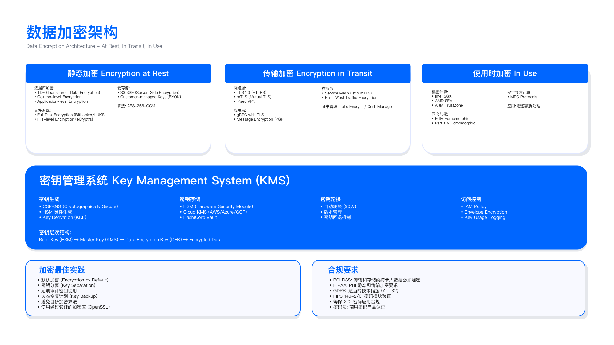
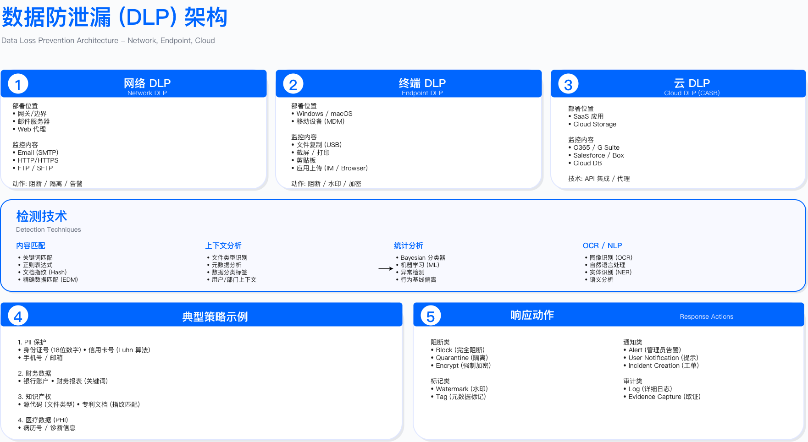

# 5.5 云数据保护 (Cloud Data Protection)

本节聚焦云环境数据保护的工程实现：从对象存储访问控制、多层加密策略设计，到密钥管理服务选型、BYOK/HYOK 实施，再到数据分类、DLP 部署与跨境驻留合规。内容覆盖 AWS/Azure/GCP 三大云平台的技术对比与配置实战，通过具体控制点设计、验证方法与运行指标，支撑企业构建可审计、可验收的云数据保护体系。

---

## 5.5.1 云对象存储安全配置

### 三大云存储服务对比

AWS S3、Azure Blob Storage 与 GCP Cloud Storage 均采用对象存储架构，但在访问控制、加密选项、合规特性上存在差异。选型时需综合考虑现有云平台生态、数据分类需求与合规约束。

| 维度 | AWS S3 | Azure Blob Storage | GCP Cloud Storage |
|------|--------|-------------------|-------------------|
| 访问控制 | IAM + Bucket Policy + ACL | RBAC + SAS Token | IAM + ACL |
| 默认加密 | SSE-S3 (AES-256) | SSE (AES-256) | 默认加密(Google 管理) |
| 客户密钥选项 | SSE-KMS/SSE-C | Customer Managed Key | Customer Managed Encryption Key |
| 版本控制 | 支持 | 支持 | 支持 |
| 对象不可变性 | Object Lock (WORM) | Immutable Blob Storage | Retention Policy |
| 访问日志 | Server Access Logging | Storage Analytics | Cloud Audit Logs |
| 公开访问阻止 | Block Public Access | Public Access Level 控制 | Uniform bucket-level access |



选型约束：

- 与云平台集成深度：若已大量使用 AWS Lambda/ECS，S3 与服务间的 IAM 策略集成成本最低；若核心业务在 Azure App Service，Blob Storage 的 RBAC 与 Azure AD 天然对接。
- 合规审计粒度：金融行业需证明"客户独占密钥控制权"时，AWS SSE-C（客户提供密钥）或 Azure BYOK 可满足审计要求，但运维复杂度高于云管理密钥。
- 跨区域复制需求：GCP Multi-Region Buckets 天然支持跨地域强一致性，适合全球同步场景；AWS CRR(Cross-Region Replication)需手动配置复制规则。

### S3 安全配置基线

AWS S3 因市场份额高，配置错误导致的泄露事件频发。以下配置为企业级 S3 安全基线（基于 CIS AWS Foundations Benchmark v1.5），每项控制均可通过 CSPM 工具（如 AWS Security Hub/Prowler）自动检测。

#### Block Public Access (BPA) - 阻止意外公开

控制目标：技术上消除 Bucket 被配置为公开访问的可能性，即使 Bucket Policy 或 ACL 配置错误也无法生效。

```bash
# 在AWS账户级别启用BPA(影响账户内所有Bucket)
aws s3control put-public-access-block \
  --account-id 123456789012 \
  --public-access-block-configuration \
    BlockPublicAcls=true,IgnorePublicAcls=true,\
    BlockPublicPolicy=true,RestrictPublicBuckets=true
```

验证方法：

- 自动化验证：通过 AWS Config 规则 `s3-account-level-public-access-blocks` 持续监控，任何 BPA 被禁用立即告警。
- 手动验证：尝试将测试 Bucket 的 Policy 设为 `"Principal": "*"`，验证操作被拒绝。

常见误区：

- 误以为"仅在生产 Bucket 启用 BPA 即可"：开发/测试环境的配置错误同样可能泄露敏感数据（如包含真实客户数据的测试集）。
- 误以为"有 Bucket Policy 就不需要 BPA"：Policy 可被人为修改或误配，BPA 提供技术强制层。

#### 强制加密与 HTTPS 传输

控制目标：拒绝未加密的对象上传，拒绝 HTTP 明文传输。

```json
{
  "Version": "2012-10-17",
  "Statement": [
    {
      "Sid": "DenyInsecureTransport",
      "Effect": "Deny",
      "Principal": "*",
      "Action": "s3:*",
      "Resource": [
        "arn:aws:s3:::my-secure-bucket",
        "arn:aws:s3:::my-secure-bucket/*"
      ],
      "Condition": {
        "Bool": {"aws:SecureTransport": "false"}
      }
    },
    {
      "Sid": "DenyUnencryptedObjectUploads",
      "Effect": "Deny",
      "Principal": "*",
      "Action": "s3:PutObject",
      "Resource": "arn:aws:s3:::my-secure-bucket/*",
      "Condition": {
        "StringNotEquals": {
          "s3:x-amz-server-side-encryption": "aws:kms"
        }
      }
    }
  ]
}
```

验证方法：

```bash
# 测试1:尝试HTTP上传(应失败)
curl -X PUT http://my-secure-bucket.s3.amazonaws.com/test.txt \
  -d "test data" --aws-sigv4 "aws:amz:us-east-1:s3"
# 预期:403 Forbidden

# 测试2:尝试不加密上传(应失败)
aws s3 cp test.txt s3://my-secure-bucket/test.txt \
  --no-server-side-encryption
# 预期:Access Denied

# 测试3:正确上传(应成功)
aws s3 cp test.txt s3://my-secure-bucket/test.txt \
  --server-side-encryption aws:kms
```

运行指标：

- 未加密对象数量：目标值 = 0（通过 S3 Inventory 日志的 `EncryptionStatus` 字段监控）
- HTTP 访问尝试次数：目标值 = 0（CloudTrail 中 `eventName=GetObject` 且 `tlsDetails.tlsVersion=null` 的记录数）

#### 版本控制与对象锁定

适用场景：需防止勒索软件删除备份、需满足 SEC 17a-4 合规（金融行业 7 年数据保留）。

```python
import boto3
s3 = boto3.client('s3')

# 启用版本控制+MFA Delete(删除对象需MFA设备验证)
s3.put_bucket_versioning(
    Bucket='compliance-bucket',
    VersioningConfiguration={
        'Status': 'Enabled',
        'MFADelete': 'Enabled'
    },
    MFA='arn:aws:iam::123456789012:mfa/root-account-mfa-device 123456'
)

# 启用对象锁定(COMPLIANCE模式:AWS员工也无法删除)
s3.put_object_lock_configuration(
    Bucket='compliance-bucket',
    ObjectLockConfiguration={
        'ObjectLockEnabled': 'Enabled',
        'Rule': {
            'DefaultRetention': {
                'Mode': 'COMPLIANCE',  # 或GOVERNANCE(允许特权用户覆盖)
                'Days': 2555  # 7年
            }
        }
    }
)
```

约束条件：

- 对象锁定启用后无法禁用，仅能延长保留期。
- COMPLIANCE 模式下，对象在保留期内任何账户（包括 root）均无法删除，需谨慎评估业务需求。

验证方法：

- 上传测试对象后尝试删除，验证返回 `AccessDenied` 错误。
- 模拟勒索软件攻击：使用高权限账户批量删除对象，验证版本历史完整。

---

## 5.5.2 多层加密策略设计

云数据加密需覆盖三个阶段：静态存储(at rest)、网络传输(in transit)、内存处理(in use)。每层加密解决不同威胁：静态加密防物理介质失窃，传输加密防中间人攻击，使用中加密防内存 dump 泄露。

### 静态加密 (Encryption at Rest)

AWS SSE 加密方式对比：

| 方式 | 密钥管理方 | CloudTrail 审计 | KMS API 费用 | 推荐场景 |
|------|-----------|---------------|-------------|---------|
| SSE-S3 | AWS | 无法审计密钥使用 | $0 | L3/L4 非敏感数据 |
| SSE-KMS | AWS KMS | 完整审计 | $0.03/万次 | L1/L2 敏感数据（推荐） |
| SSE-C | 客户自行管理 | 无 KMS 记录 | $0 | 客户需完全控制密钥 |
| Client-Side | 客户端加密库 | 客户负责 | $0 | 极端敏感场景 + 自有 HSM |

决策框架：

```
数据分类L1/L2? ──是──> 需审计密钥访问? ──是──> SSE-KMS
        │                      └──否──> SSE-C (BYOK 场景)
        └──否(L3/L4)──> SSE-S3 (成本优化)
```

SSE-KMS 实施示例：

```python
import boto3
kms = boto3.client('kms')
s3 = boto3.client('s3')

# 创建客户管理的KMS密钥(CMK)
key_response = kms.create_key(
    Description='S3 L2 data encryption key',
    KeyUsage='ENCRYPT_DECRYPT',
    Origin='AWS_KMS',  # 或AWS_CLOUDHSM(FIPS 140-2 Level 3)
    MultiRegion=False,
    Tags=[
        {'TagKey': 'DataClassification', 'TagValue': 'L2'},
        {'TagKey': 'CostCenter', 'TagValue': 'SEC-001'}
    ]
)
key_id = key_response['KeyMetadata']['KeyId']

# 配置Bucket默认加密
s3.put_bucket_encryption(
    Bucket='sensitive-data-bucket',
    ServerSideEncryptionConfiguration={
        'Rules': [{
            'ApplyServerSideEncryptionByDefault': {
                'SSEAlgorithm': 'aws:kms',
                'KMSMasterKeyID': key_id
            },
            'BucketKeyEnabled': True  # 减少KMS API调用(降低成本+延迟)
        }]
    }
)
```

性能优化 - Bucket Key：

- 未启用 Bucket Key：每次对象加密/解密调用 1 次 KMS API（成本：100 万对象/月 × $0.03/万次 = $3000）。
- 启用 Bucket Key：S3 生成 Bucket 级数据密钥，本地加密对象，仅定期轮换时调用 KMS（成本降低 99%）。

验证方法：

```bash
# 检查对象加密状态
aws s3api head-object --bucket sensitive-data-bucket --key test.csv \
  --query 'ServerSideEncryption'
# 预期输出:aws:kms

# 查询KMS密钥使用日志(CloudTrail)
aws cloudtrail lookup-events \
  --lookup-attributes AttributeKey=ResourceName,AttributeValue=<key-arn> \
  --max-results 10
```

### 传输加密 (Encryption in Transit)

控制目标：强制 TLS 1.2+（禁用 TLS 1.0/1.1），防止降级攻击。

```json
{
  "Sid": "EnforceTLS12Plus",
  "Effect": "Deny",
  "Principal": "*",
  "Action": "s3:*",
  "Resource": [
    "arn:aws:s3:::secure-bucket",
    "arn:aws:s3:::secure-bucket/*"
  ],
  "Condition": {
    "NumericLessThan": {
      "s3:TlsVersion": "1.2"
    }
  }
}
```

验证方法：

```bash
# 测试TLS 1.1连接(应被拒绝)
openssl s_client -connect secure-bucket.s3.amazonaws.com:443 -tls1_1
# 预期:handshake failure或connection refused
```

常见误区：

- 误以为"启用 HTTPS 即安全"：若未强制 TLS 1.2+，攻击者可诱导客户端降级至 TLS 1.0（存在 POODLE/BEAST 漏洞）。
- 忽视内部 VPC 流量加密：VPC 内 S3 Gateway Endpoint 流量默认未加密，需配置 PrivateLink + TLS。

### 使用中加密 (Encryption in Use)

适用场景：需在内存中处理 L1 数据（如信用卡 CVV 解密），且需防御特权用户(root/云厂商员工)访问内存。

技术实现 - AWS Nitro Enclaves：

```python
# 在Enclave内执行KMS解密(母实例无法访问明文)
import socket
import json

def decrypt_in_enclave(ciphertext_blob):
    """通过Enclave解密数据"""
    # 连接Enclave的vsock(CID=3表示父EC2实例)
    sock = socket.socket(socket.AF_VSOCK, socket.SOCK_STREAM)
    sock.connect((3, 5000))

    request = {'action': 'decrypt', 'ciphertext': ciphertext_blob}
    sock.send(json.dumps(request).encode())
    response = json.loads(sock.recv(4096))

    return response['plaintext']  # 明文仅在Enclave内存中存在
```

约束条件：

- Nitro Enclaves 需运行在特定 EC2 实例类型（如 m5.xlarge），成本高于普通实例约 20%。
- 开发复杂度：需将应用拆分为 Enclave 内（解密逻辑）与 Enclave 外（业务逻辑）两部分。

运行指标：

- Enclave 健康检查失败率：目标 < 0.1%（vsock 连接超时/Enclave 崩溃）
- 解密操作延迟：目标 < 50ms（vs 普通 KMS 解密 < 20ms，增加约 30ms 网络往返）

---

## 5.5.3 密钥管理服务 (KMS) 选型与实施

### 三大云 KMS 对比

| 维度 | AWS KMS | Azure Key Vault | GCP Cloud KMS |
|------|---------|-----------------|---------------|
| 密钥类型 | 对称/非对称 | Keys/Secrets/Certificates | 对称/非对称 |
| HSM 支持 | CloudHSM(FIPS 140-2 L3) | Managed HSM(FIPS 140-2 L3) | Cloud HSM(FIPS 140-2 L3) |
| 自动轮换 | 365 天(对称密钥) | 手动或自动(Premium SKU) | 90 天(可配置) |
| 多区域密钥 | Multi-Region Keys | Geo-Replication | Global Keys |
| API 速率限制 | 共享池 5500 req/s | 独占 10000 req/s | 60000 req/min |
| 价格(CMK) | $1/月 + $0.03/万次 API | $0.03/万次操作 | $0.06/密钥版本/月 |

选型决策点：

- 多云策略：若已有 AWS 为主、Azure 为辅的架构，建议 L1 数据用 AWS KMS（低延迟），L2 数据用 Azure Key Vault（成本优化）。
- 密钥轮换频率：金融行业需 90 天轮换，GCP Cloud KMS 默认配置匹配；AWS 需手动启用自动轮换或通过 Lambda 定时触发。
- 审计要求：AWS CloudTrail 记录所有 KMS API 调用（包括 Decrypt 调用方 IP/IAM 角色），Azure Monitor 需手动启用诊断设置。

### AWS KMS 实战配置

```python
import boto3
import json

kms = boto3.client('kms')

# 定义密钥策略(限制使用范围)
key_policy = {
    "Version": "2012-10-17",
    "Statement": [
        {
            "Sid": "Enable IAM User Permissions",
            "Effect": "Allow",
            "Principal": {"AWS": "arn:aws:iam::123456789012:root"},
            "Action": "kms:*",
            "Resource": "*"
        },
        {
            "Sid": "Allow S3 to use the key",
            "Effect": "Allow",
            "Principal": {"Service": "s3.amazonaws.com"},
            "Action": ["kms:Decrypt", "kms:GenerateDataKey"],
            "Resource": "*",
            "Condition": {
                "StringEquals": {
                    "kms:ViaService": "s3.us-east-1.amazonaws.com"
                }
            }
        }
    ]
}

# 创建CMK
response = kms.create_key(
    Description='Master key for S3 L2 data',
    KeyUsage='ENCRYPT_DECRYPT',
    Origin='AWS_KMS',
    MultiRegion=False,
    Policy=json.dumps(key_policy),
    Tags=[
        {'TagKey': 'Environment', 'TagValue': 'Production'},
        {'TagKey': 'DataClassification', 'TagValue': 'L2'}
    ]
)

key_id = response['KeyMetadata']['KeyId']

# 启用自动轮换(365天)
kms.enable_key_rotation(KeyId=key_id)

# 创建别名(方便引用)
kms.create_alias(
    AliasName='alias/s3-l2-encryption-key',
    TargetKeyId=key_id
)
```

验证方法:

```python
# 测试加密/解密
plaintext = b"Sensitive customer data"
encrypt_resp = kms.encrypt(
    KeyId='alias/s3-l2-encryption-key',
    Plaintext=plaintext,
    EncryptionContext={'Application': 'CRM', 'Environment': 'Prod'}
)
ciphertext = encrypt_resp['CiphertextBlob']

decrypt_resp = kms.decrypt(
    CiphertextBlob=ciphertext,
    EncryptionContext={'Application': 'CRM', 'Environment': 'Prod'}
)
assert decrypt_resp['Plaintext'] == plaintext

# 检查密钥轮换状态
rotation_status = kms.get_key_rotation_status(KeyId=key_id)
assert rotation_status['KeyRotationEnabled'] == True
```

运行指标：

- KMS API 调用延迟 P99：目标 < 100ms（通过 CloudWatch 指标 `KMS.Latency` 监控）
- 密钥轮换合规率：目标 = 100%（所有 CMK 启用自动轮换或手动轮换周期 ≤ 365 天）

---

## 5.5.4 BYOK/HYOK 实施与决策

### BYOK vs HYOK 对比

| 特性 | BYOK (Bring Your Own Key) | HYOK (Hold Your Own Key) |
|------|---------------------------|---------------------------|
| 密钥存储位置 | 云厂商 KMS(客户导入) | 客户本地 HSM |
| 密钥生成方 | 客户 | 客户 |
| 加密操作位置 | 云厂商 | 客户本地 |
| 性能 | 高(云原生) | 低(网络延迟 20-50ms) |
| 可用性 | 云厂商 SLA(99.99%) | 客户负责 HA |
| 审计证明 | 密钥来源客户可控 | 密钥+操作均客户可控 |
| 适用场景 | 满足大部分合规要求 | 金融/政府/极端监管 |
| 成本 | $1-5/密钥/月 | $10K+ HSM 设备 + 运维 |

决策框架：

```
是否金融/政府行业? ──是──> 审计要求"客户独占密钥硬件"? ──是──> HYOK
        │                                └──否──> BYOK
        └──否──> 数据分类L1/L2? ──是──> BYOK
                      └──否(L3/L4)──> 云管理密钥
```

### BYOK 实施案例：金融支付平台

某支付平台（年处理交易 $20 亿）在 PCI DSS 4.0 审计中被要求"证明加密密钥的绝对控制权"。评估后采用混合策略：

- L1 数据（支付卡 CVV/PIN，占比 0.5%）：HYOK，本地 CloudHSM 集群（3 节点 HA），密钥永不导出。
- L2 数据（交易记录，占比 20%）：BYOK，本地 HSM 生成密钥，导入 AWS KMS，设置 12 个月过期。
- L3/L4 数据（占比 79.5%）：AWS 管理 CMK，成本优化。

BYOK 密钥导入流程：

```python
import boto3
from cryptography.hazmat.primitives.asymmetric import rsa
from cryptography.hazmat.backends import default_backend

kms = boto3.client('kms')

# 步骤1:从KMS获取导入令牌(包含公钥)
import_token_resp = kms.get_parameters_for_import(
    KeyId='arn:aws:kms:us-east-1:123456789012:key/imported-key-id',
    WrappingAlgorithm='RSAES_OAEP_SHA_256',
    WrappingKeySpec='RSA_2048'
)
public_key = import_token_resp['PublicKey']
import_token = import_token_resp['ImportToken']

# 步骤2:在本地HSM生成256-bit AES密钥(此处用软件模拟)
from cryptography.hazmat.primitives.ciphers import Cipher, algorithms, modes
import os
key_material = os.urandom(32)  # 256-bit

# 步骤3:用KMS公钥包装密钥材料
from cryptography.hazmat.primitives import serialization, hashes
from cryptography.hazmat.primitives.asymmetric import padding

kms_public_key = serialization.load_der_public_key(
    public_key, backend=default_backend()
)
wrapped_key = kms_public_key.encrypt(
    key_material,
    padding.OAEP(
        mgf=padding.MGF1(algorithm=hashes.SHA256()),
        algorithm=hashes.SHA256(),
        label=None
    )
)

# 步骤4:导入密钥到KMS(设置12个月过期)
from datetime import datetime, timedelta
kms.import_key_material(
    KeyId='arn:aws:kms:us-east-1:123456789012:key/imported-key-id',
    ImportToken=import_token,
    EncryptedKeyMaterial=wrapped_key,
    ExpirationModel='KEY_MATERIAL_EXPIRES',
    ValidTo=datetime.now() + timedelta(days=365)
)
```

验证方法：

```python
# 检查密钥来源与过期时间
key_metadata = kms.describe_key(
    KeyId='arn:aws:kms:us-east-1:123456789012:key/imported-key-id'
)
assert key_metadata['KeyMetadata']['Origin'] == 'EXTERNAL'
assert key_metadata['KeyMetadata']['ExpirationModel'] == 'KEY_MATERIAL_EXPIRES'
```

审计证明材料：

- 本地 HSM 密钥生成日志（时间戳 + 操作员身份）
- KMS ImportKeyMaterial CloudTrail 事件（证明密钥由客户导入）
- 密钥过期自动删除验证（证明客户控制密钥生命周期）

成本分析：

- BYOK 成本：KMS CMK $1/月 × 50 个区域密钥 + 本地 HSM $1K/月 = $1,050/月
- 避免的审计失败损失：若未通过 PCI DSS 审计，丧失支付卡处理资质，估计年收入损失 > $50M

---

## 5.5.5 数据分类与 DLP 实施

### 数据分类框架

| 级别 | 分类 | 定义 | 加密要求 | 访问控制 |
|------|------|------|----------|----------|
| L1 | 严格保护 | 泄露导致法律/财务严重损失 | AES-256 + BYOK/HYOK | MFA + 审批工作流 |
| L2 | 重点保护 | 泄露导致合规问题/声誉损失 | AES-256 + KMS | 最小权限+定期审计 |
| L3 | 一般保护 | 泄露导致有限影响 | 传输加密(TLS 1.2+) | 基于角色访问 |
| L4 | 公开信息 | 可公开访问 | 可选 | 公开或登录后访问 |

分类依据：

- L1 示例：支付卡号(PCI DSS)、身份证号(GDPR Article 9 特殊类别)、密码哈希。
- L2 示例：姓名 + 地址(GDPR 个人数据)、订单详情、财务报表。
- L3 示例：用户浏览历史、产品评价、系统日志。
- L4 示例：产品目录、公开博客文章。



### 自动化数据发现 - AWS Macie

```python
import boto3
macie = boto3.client('macie2')

# 启用Macie
macie.enable_macie(
    status='ENABLED',
    findingPublishingFrequency='FIFTEEN_MINUTES'
)

# 创建敏感数据发现任务
job_response = macie.create_classification_job(
    jobType='ONE_TIME',
    s3JobDefinition={
        'bucketDefinitions': [{
            'accountId': '123456789012',
            'buckets': ['customer-data-bucket']
        }]
    },
    managedDataIdentifierIds=[
        'AWS_CREDENTIALS',
        'CREDIT_CARD',
        'EMAIL_ADDRESS',
        'US_SOCIAL_SECURITY_NUMBER'
    ],
    customDataIdentifiers=[{
        'name': 'InternalEmployeeID',
        'regex': r'EMP-\d{6}'
    }],
    name='Sensitive-Data-Discovery-Q1'
)

# 查询高风险发现
findings = macie.list_findings(
    findingCriteria={
        'criterion': {
            'severity.description': {'eq': ['High']},
            'classificationDetails.result.sensitiveData': {'exists': True}
        }
    }
)
```

验证方法：

- 在测试 Bucket 中放入包含信用卡号的 CSV 文件，验证 Macie 在 15 分钟内检测并标记为 High severity。
- 检查误报率：抽样 100 个 High severity 告警，确认真实敏感数据占比 > 95%。

运行指标：

- 数据分类覆盖率：目标 ≥ 90%（已分类数据量 / 总数据量）
- 敏感数据发现延迟：目标 < 24 小时（数据上传至 S3 后，Macie 检测并分类的时间）

### DLP 策略实施

Google Cloud DLP 示例：

```python
from google.cloud import dlp_v2

dlp = dlp_v2.DlpServiceClient()
project = 'my-project'

# 定义检测配置
inspect_config = {
    'info_types': [
        {'name': 'EMAIL_ADDRESS'},
        {'name': 'CREDIT_CARD_NUMBER'},
        {'name': 'US_SOCIAL_SECURITY_NUMBER'}
    ],
    'min_likelihood': dlp_v2.Likelihood.LIKELY,
    'limits': {'max_findings_per_request': 100}
}

# 定义脱敏配置(信用卡号保留后4位)
deidentify_config = {
    'info_type_transformations': {
        'transformations': [{
            'primitive_transformation': {
                'character_mask_config': {
                    'masking_character': '*',
                    'number_to_mask': 12,
                    'reverse_order': True
                }
            },
            'info_types': [{'name': 'CREDIT_CARD_NUMBER'}]
        }]
    }
}

# 扫描并脱敏
content = "Customer card: 4532-1234-5678-9010"
response = dlp.deidentify_content(
    request={
        'parent': f'projects/{project}',
        'deidentify_config': deidentify_config,
        'inspect_config': inspect_config,
        'item': {'value': content}
    }
)

print(response.item.value)  # 输出:Customer card: ************9010
```

验证方法：

- 准备包含 100 个真实信用卡号的测试数据集，验证 DLP 检测率 ≥ 99%。
- 准备包含 100 个类似格式但非信用卡号的数据（如订单号），验证误报率 < 5%。

常见误区：

- 过度依赖 DLP 工具自动阻断：DLP 应作为检测 + 告警层，阻断决策需人工审批（避免误伤正常业务）。
- 未配置排除规则：测试环境的模拟数据触发大量 DLP 告警，需配置 `exclusion_rule` 排除特定路径。

---

## 5.5.6 数据驻留与跨境合规

### 主要法规数据驻留要求

| 法规/地区 | 数据驻留强制性 | 跨境传输条件 | 技术实施 |
|----------|--------------|-------------|---------|
| GDPR (EU) | 非强制(但需合法依据) | SCC/BCR/充分性认定 | EU 区域部署 |
| PIPL (中国) | 关基+重要数据强制本地化 | 安全评估+主管部门审批 | 本地云+逻辑隔离 |
| 俄罗斯联邦法律 | 公民个人数据强制本地 | 严格限制 | 本地数据中心 |
| LGPD (巴西) | 非强制 | 充分保护措施 | 可选本地部署 |

决策框架：

```
存储 EU 公民数据? ──是──> 需跨境传输至美国? ──是──> 签署 SCC + DPIA 评估
        │                      └──否──> 部署于 eu-central-1/eu-west-1
        └──否──> 存储中国公民数据? ──是──> 关键信息基础设施?
                                  ├──是──> 强制本地化(阿里云/腾讯云)
                                  └──否──> 评估是否"重要数据"
```

### 跨境传输审批工作流

```python
import boto3
from datetime import datetime

def request_cross_border_transfer(
    data_classification, source_region, dest_region,
    business_justification, data_volume_gb, requester_email
):
    """提交跨境数据传输审批请求"""

    # 根据数据分类判断是否需要审批
    approval_required = data_classification in ['L1', 'L2']
    approvers = ['dpo@company.com', 'ciso@company.com'] if approval_required else []

    request = {
        'request_id': f"CBT-{datetime.now().strftime('%Y%m%d-%H%M%S')}",
        'requester': requester_email,
        'timestamp': datetime.now().isoformat(),
        'data_classification': data_classification,
        'source_region': source_region,
        'destination_region': dest_region,
        'justification': business_justification,
        'data_volume_gb': data_volume_gb,
        'approval_required': approval_required,
        'approvers': approvers,
        'status': 'PENDING' if approval_required else 'AUTO_APPROVED'
    }

    # 存储审批记录到DynamoDB
    dynamodb = boto3.resource('dynamodb')
    table = dynamodb.Table('CrossBorderTransferRequests')
    table.put_item(Item=request)

    return request['request_id']
```

验证方法：

- 模拟 L1 数据跨境传输请求，验证工作流自动发送审批邮件至 DPO+CISO。
- 验证 L3 数据自动批准，无需人工审批。

运行指标：

- 审批 SLA 达成率：目标 ≥ 95%（L1/L2 跨境请求在 48 小时内完成审批）
- 未授权跨境传输次数：目标 = 0（通过 VPC Flow Logs 监控跨区域流量，对比审批记录）

常见误区：

- 误以为"数据未出境就不需要 SCC"：跨境传输包括远程访问（如美国员工访问 EU 区域数据库），需同样签署 SCC。
- 未区分"数据驻留"与"数据处理驻留"：PIPL 要求关键信息基础设施的个人信息本地存储，但允许境外系统读取（需安全评估），混淆两者导致过度投资本地化。
- 审批流程形式化：审批工作流存在但 DPO 未实际评估数据敏感度，仅走签字流程，审计时无法证明"尽职调查"。

---

## 5.5.7 云数据库安全配置

### RDS 加密与 IAM 认证

```python
import boto3
rds = boto3.client('rds')

# 创建加密RDS实例
response = rds.create_db_instance(
    DBInstanceIdentifier='secure-mysql-db',
    DBInstanceClass='db.t3.medium',
    Engine='mysql',
    EngineVersion='8.0.35',
    MasterUsername='admin',
    MasterUserPassword='SecureP@ssw0rd123!',
    AllocatedStorage=100,
    StorageEncrypted=True,
    KmsKeyId='arn:aws:kms:us-east-1:123456789012:key/<key-id>',

    # 网络隔离
    DBSubnetGroupName='private-db-subnet-group',
    PubliclyAccessible=False,

    # 启用IAM数据库认证
    EnableIAMDatabaseAuthentication=True,

    # 备份与监控
    BackupRetentionPeriod=30,
    EnableCloudwatchLogsExports=['error', 'slowquery'],
    DeletionProtection=True,
    MultiAZ=True
)
```

IAM 认证连接示例：

```python
import pymysql
import boto3

def connect_with_iam():
    rds_client = boto3.client('rds', region_name='us-east-1')

    # 生成15分钟有效的认证令牌
    auth_token = rds_client.generate_db_auth_token(
        DBHostname='secure-mysql-db.c123.us-east-1.rds.amazonaws.com',
        Port=3306,
        DBUsername='iam_db_user',
        Region='us-east-1'
    )

    # 使用令牌连接(强制SSL)
    conn = pymysql.connect(
        host='secure-mysql-db.c123.us-east-1.rds.amazonaws.com',
        port=3306,
        user='iam_db_user',
        password=auth_token,
        database='production_db',
        ssl={'ssl': True}
    )
    return conn
```

验证方法：

- 检查 RDS 实例加密状态：`aws rds describe-db-instances --query 'DBInstances[*].[DBInstanceIdentifier,StorageEncrypted]'`
- 验证 IAM 认证：尝试用错误 IAM 角色连接，确认返回 Access Denied。

运行指标：

- 数据库连接未加密比例：目标 = 0%（通过 RDS 性能洞察监控 SSL 连接占比）
- 根账户使用次数：目标 = 0 次/月（CloudTrail 事件 `eventName=ModifyDBInstance` 且 `userIdentity=root`）

常见误区：

- 误以为"RDS 在 Private Subnet 就不需要加密"：内部威胁（如恶意员工）仍可访问私有子网，静态加密防止物理介质窃取，IAM 认证防止凭证泄露。
- 未配置删除保护即上生产：手动误操作 `aws rds delete-db-instance` 导致生产数据库被删除，恢复依赖备份且存在数据丢失窗口。
- IAM 认证令牌未设置合理 TTL：默认 15 分钟令牌对短连接足够，但长连接应用需实现令牌刷新机制，否则连接断开后无法自动重连。

---

## 本节小结

### 核心控制点

本节建立的云数据保护控制点包括：

1. 对象存储访问控制：Block Public Access + 强制 HTTPS + Bucket Policy 最小权限原则。
2. 多层加密策略：静态加密(SSE-KMS) + 传输加密(TLS 1.2+) + 使用中加密(Nitro Enclaves)。
3. 密钥管理：AWS KMS/Azure Key Vault/GCP Cloud KMS 选型，BYOK/HYOK 实施决策框架。
4. 数据分类与 DLP：L1-L4 分级体系，AWS Macie/Google DLP 自动化发现。
5. 跨境驻留合规：基于 GDPR/PIPL 的审批工作流，VPC 区域限制策略。
6. 数据库安全：RDS 加密 + IAM 认证 + 审计日志。

### 验证与运行

关键验证方法：

- S3 安全基线：CSPM 工具（AWS Security Hub/Prowler）持续扫描 BPA/加密/公开访问配置。
- 加密有效性：S3 Inventory 报告 `EncryptionStatus` 字段，目标值：所有对象=KMS 加密。
- DLP 检测能力：红队测试上传包含敏感数据的文件，验证 15 分钟内告警。
- 跨境合规：VPC Flow Logs 跨区域流量与审批记录交叉验证，发现未授权传输。

运行指标：

- 未加密对象数量：目标 = 0（每日 S3 Inventory 扫描）
- KMS 密钥轮换合规率：目标 = 100%（所有 CMK 启用自动轮换或手动轮换 ≤ 365 天）
- 敏感数据发现覆盖率：目标 ≥ 90%（Macie 扫描存储桶数 / 总存储桶数）
- 跨境审批 SLA 达成率：目标 ≥ 95%（48 小时内完成 L1/L2 数据审批）

### 实施约束

成本约束：

- KMS API 调用成本可能超出预期：每月 100M 次 Decrypt 操作 = $30K，需评估启用 Bucket Key（降低 99% 成本）。
- Macie 扫描成本：首次全量扫描 500TB = $500K，增量扫描降至 $5K/月，需分阶段实施。

技术约束：

- HYOK 性能瓶颈：CloudHSM 集群网络延迟 20-50ms，需通过信封加密(Envelope Encryption)优化。
- 多云密钥管理复杂度：AWS KMS 与 Azure Key Vault 无原生互操作，需构建统一密钥治理平台。

组织约束：

- 数据分类需业务方配合：DLP 工具仅能自动识别结构化敏感数据（如信用卡号），非结构化数据（如合同 PDF）需人工标注。
- 跨境审批流程时效：L1 数据跨境需 DPO+CISO 双重审批，平均耗时 48-72 小时，需提前规划。

### 常见误区

1. 配置漂移：开发人员手动修改 Bucket Policy 绕过 BPA → 解决：通过 AWS Config 规则自动修复 + 告警通知安全团队。
2. 密钥轮换失效：自动轮换启用但未验证旧数据重新加密 → 解决：定期审计 S3 对象的 KMS 密钥版本，标记使用旧密钥的对象。
3. DLP 规则过时：新增数据类型（如生物特征）未被 DLP 识别 → 解决：季度评审 DLP 规则库，结合红队测试验证覆盖率。

### 延伸阅读

- AWS: [S3 Security Best Practices](https://docs.aws.amazon.com/AmazonS3/latest/userguide/security-best-practices.html)
- NIST SP 800-175B: Guidelines for Using Cryptographic Standards - Key Management
- CSA: Cloud Data Security Guidance
- GDPR: Data Protection Impact Assessment (DPIA) Template

---

## 导航

**[← 上一节：5.4 云工作负载保护](./5.4_cloud_workload_protection.md)** | **[返回章节目录](./README.md)** | **[下一节：5.6 云原生安全工具链 →](./5.6_cloud_native_security_toolchain.md)**

---

**© 2025 AI-ESA Project. Licensed under CC BY-NC-SA 4.0**

