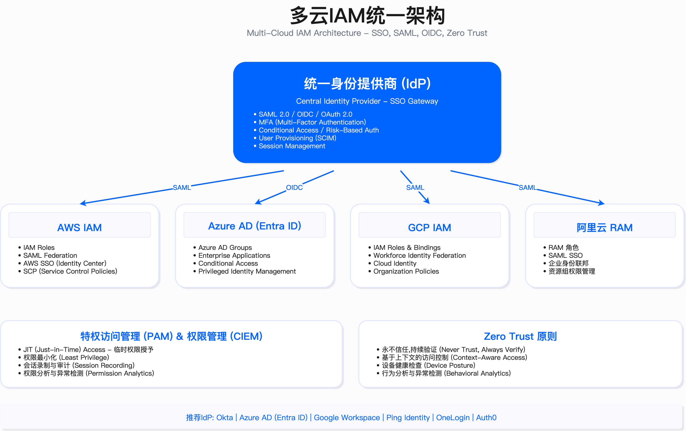

# 5.9 多云治理

多云环境带来的复杂性超出大部分企业最初预期。单一云平台的安全已足够复杂,涉及多个云服务商时,可见性碎片化、策略一致性、成本失控等问题会呈指数级增长。本节建立多云治理框架,覆盖统一管理平台选型、云成本优化与安全平衡、混合云架构设计、迁移安全与责任边界界定。

---

## 5.9.1 多云统一管理平台

### 多云管理核心挑战

企业采用多云策略后,面临的核心问题不是技术能力不足,而是管理碎片化。典型场景中,AWS Console、Azure Portal、GCP Console各自独立,无法统一视图查看资源分布与配置状态。配置漂移在跨云环境更难发现,单一云平台的扫描工具无法覆盖全局。

策略执行层面,每个云平台有独立的IAM体系、网络规则、安全策略,合规要求难以统一实施。审计日志分散在不同系统,事件关联分析需要手工整合。成本管理更为棘手,多个账单系统的成本分摊、资源浪费识别都需要额外工具支持。

人员能力方面,要求团队同时掌握三个以上云平台专业知识,认证成本高,人才市场稀缺。这些问题的根源不在于缺少工具,而在于缺少统一的治理框架与执行平台。

**适用边界**:多云管理平台适合运行两个及以上云环境的企业。单一云环境使用原生工具(如AWS Security Hub、Azure Policy)成本更低且集成更好。混合云场景(本地数据中心+云)需要额外考虑跨环境网络互联与身份联邦。

**关键约束**:
- 平台部署与集成周期通常在3-6个月,需要跨团队协作(安全、云运维、FinOps、合规)
- 数据采集依赖云API权限,权限过小导致可见性不足,权限过大增加泄露风险
- 多数平台按云支出百分比或资源数量收费,年成本可能占云支出的3%-5%
- 工具切换成本高,选型失误导致的替换成本包括策略重新配置、人员培训、历史数据迁移

### 平台选型决策

多云管理平台(Cloud Management Platform, CMP)主要有四类:以成本优化为核心的FinOps平台、全面管理平台、自动化编排平台与开源IaC管理平台。选型取决于组织优先级、技术成熟度与预算约束。

**FinOps驱动场景**:CloudHealth(VMware)适合将成本优化作为首要目标的组织。平台强项在成本可见性、预算告警、优化建议,弱项在自动化编排能力。典型用户为FinOps团队主导的企业,每月需要向业务部门分摊云成本。

**全面管理场景**:Flexera One覆盖多云(AWS、Azure、GCP、阿里云)加私有云,提供资产管理、成本优化、安全合规、自动化编排全栈能力。适合大型企业需要统一治理平台,但学习曲线陡峭,实施周期长(通常6-9个月)。

**DevOps自动化场景**:Morpheus强调自动化编排,支持30+云平台,适合DevOps团队需要自助服务门户与工作流自动化的场景。成本管理与安全合规能力相对弱于前两者。

**技术团队自建场景**:Terraform Cloud(或开源Terraform)适合技术能力强、预算有限、倾向开源的团队。核心能力在基础设施即代码(IaC)管理,成本优化与安全扫描需要集成第三方工具(如Infracost、Checkov)。

**常见误区**:
- 认为部署CMP可以自动解决所有多云问题:实际上平台只提供数据与建议,需要人工制定策略与执行流程
- 低估集成复杂度:云API权限配置、自定义策略编写、现有工具集成都需要专业技能
- 忽略供应商锁定风险:平台迁移成本高,选型时需评估供应商稳定性与开放性

**验证方法**:
- 概念验证(PoC)阶段连接至少一个生产云账户,验证数据采集完整性、策略匹配度、报告准确性
- 评估误报率与可操作性:安全合规告警中,误报率超过30%会导致团队忽略告警
- 测试API调用频率与云账单影响:部分平台高频调用云API会增加云成本(如AWS CloudTrail数据事件费用)

**运行指标**:
- 平台纳管资产覆盖率 = 已纳管云资源数 / 实际云资源总数,目标≥95%
- 策略违规响应率 = 7天内处置的违规项 / 违规项总数,目标≥80%
- 成本优化采纳率 = 已执行的优化建议金额 / 优化建议总金额,目标≥40%(部分建议不适用)

### 平台选型评分模型

选型时需要量化评估。以下模型基于四个维度:优先级匹配度、综合能力得分、成本可接受性与易用性。

**优先级匹配**:如果组织优先级是成本优化,则该维度权重加倍;如果是自动化,则自动化能力加倍。不存在所有维度都满分的平台,需要根据实际需求权衡。

**成本评估**:平台成本通常与云支出挂钩。假设年云支出500万美元,CloudHealth按3.5%收费,年成本约17.5万美元;Flexera可能达到4%,年成本20万美元;Terraform Cloud企业版固定费用约3.5-7万美元/年(按用户数或workspace数),但不包含成本管理功能,需额外集成Infracost等工具。

**成本与安全平衡示例**:某金融企业年云支出1000万美元,初期选择免费开源方案(Terraform + Checkov + CloudCustodian),发现人工维护成本高(需2名全职工程师,年人工成本约40万美元),后期切换至Prisma Cloud(年费用约35万美元),减少1名工程师投入,实际总成本持平,但合规自动化程度显著提升。

**边界说明**:评分模型适用于年云支出超过100万美元的企业。低于此阈值,使用云原生工具(如AWS Security Hub + AWS Cost Explorer)更经济。评分假设各平台功能正常运行,实际使用中需考虑供应商支持质量、产品更新频率、社区活跃度。

---

## 5.9.2 云成本优化与安全

### FinOps与SecOps协同框架

FinOps(Financial Operations)与SecOps(Security Operations)存在天然张力:成本优化倾向减少资源使用,安全倾向增加防护层。协同需要建立共同语言与决策框架。

**Inform(告知)阶段**:建立成本可见性是前提。云支出仪表板需要按业务、项目、团队、环境(生产/测试)维度分解,实时展示成本趋势。成本分摊模型需与安全策略关联,例如标记哪些成本来自安全工具(WAF、GuardDuty、CloudTrail),避免被错误归类为可削减成本。预算与预测需要包含安全投入,安全事件响应预留预算通常为云总支出的5%-10%。

**Optimize(优化)阶段**:降低单位成本需要在不牺牲安全的前提下执行。Right-Sizing(调整实例规格)可以应用于非关键环境的安全工具,例如测试环境的SIEM可以使用较小规格。Reserved Instances或Savings Plans适用于长期运行的安全基础设施(如SIEM、CSPM)。Spot Instances不适用于安全关键组件(如防火墙、入侵检测),但可用于批量日志处理、威胁情报更新等可中断工作负载。

**Operate(运营)阶段**:建立FinOps与SecOps跨职能团队,定期评审成本与安全权衡。成本KPI需要与安全指标关联,例如"每日志GB成本""每检测到的威胁成本"。自动化策略包括非生产环境定时启停(节省40%-60%成本),但需保留核心测试环境以避免测试不充分导致的安全漏洞流入生产环境。

**适用边界**:FinOps框架适合云支出超过50万美元/年的企业。低于此阈值,成本优化收益可能低于FinOps团队建设成本。框架假设企业已有基本的云成本可见性(如AWS Cost Explorer、Azure Cost Management),若无,需先部署成本管理工具。

**关键约束**:
- 成本分摊模型准确性依赖资源标签覆盖率,标签缺失率超过20%会导致分摊不准确
- 优化建议执行需要跨团队审批,流程过长导致机会窗口丢失(如Reserved Instance折扣变化)
- 自动化策略可能与业务需求冲突,例如定时关闭测试环境时恰好有紧急测试需求

### 成本异常检测

成本突增可能是攻击信号(如资源被挖矿、DDoS攻击导致流量费用激增)或配置错误(如误删资源标签导致自动扩展失控)。检测需要建立基线与阈值。

**统计方法**:使用移动平均(MA)与标准差(σ)建立动态基线。30天移动平均适合识别长期趋势,7天移动平均适合识别短期异常。阈值设定为基线+2.5σ,覆盖99%正常波动,超出视为异常。严重异常定义为超出4σ,需立即响应。

**分组策略**:按服务(EC2、S3、Lambda)、按项目、按环境分组检测。全局检测容易被大项目掩盖小项目异常。某个服务成本突增200%可能在全局只占5%,全局检测无法触发告警。

**告警分级**:异常评分(Anomaly Score)=|(实际成本-基线成本)/标准差|。评分2-4为WARNING级别,邮件通知FinOps团队;评分>4为CRITICAL级别,触发PagerDuty通知安全与FinOps团队,并执行自动响应(如暂停可疑资源)。

**常见误区**:
- 阈值设置过敏感:标准差倍数<2导致误报率超过50%,团队疲劳后忽略告警
- 忽略周期性波动:周末流量下降、月底批处理任务导致成本波动,需要基于星期几、月份的季节性调整
- 异常检测后未关联安全事件:成本异常与安全日志(CloudTrail、GuardDuty)未联动,错失攻击信号

**验证方法**:
- 注入测试:在测试环境故意创建大量资源(如启动100个EC2实例),验证检测器能否在15分钟内触发告警
- 历史回测:使用过去3个月数据,验证检测器能否识别已知的成本异常事件(如历史上的配置错误、攻击事件)
- 误报率评估:运行1个月,统计误报率=误报数/(误报数+真实异常数),目标≤20%

**运行指标**:
- 异常检测覆盖率 = 已纳入检测的服务数 / 使用中服务总数,目标100%
- 平均检测时间(MTTD) = 从异常发生到告警触发的时间,目标≤15分钟
- 平均响应时间(MTTR) = 从告警触发到人工确认并执行响应的时间,目标≤60分钟

### 预算告警配置

预算告警是成本治理的第一道防线。配置需要覆盖实际成本与预测成本两个维度。

**实际成本告警**:当月实际支出达到预算80%时触发通知,通知对象为FinOps团队与项目负责人。达到100%时升级为高优先级告警,通知高管与财务部门。告警需要包含成本分解(按服务、按项目),方便快速定位超支原因。

**预测成本告警**:基于当前消费速率预测月底成本。AWS Budget、Azure Budget支持预测告警,当预测成本超过预算100%时提前触发告警。预测告警的价值在于提前干预,避免月底超支后无法挽回。

**告警接收方式**:邮件适合日常通知,SNS/Webhook适合集成至Slack、Teams、PagerDuty。关键告警(如预算超支100%)需要多渠道通知,确保不会因单一渠道故障导致告警丢失。

**成本分摊标签**:预算告警准确性依赖资源标签。标签需要包含Environment(生产/测试)、Project、CostCenter、Owner。标签缺失的资源归入"Untagged"分组,单独设置预算,避免影响正常项目预算。

**适用边界**:预算告警适合有明确预算控制要求的企业。初创企业或快速增长阶段,预算波动大,预算告警可能频繁触发导致告警疲劳。此时更适合使用异常检测替代固定预算告警。

**常见误区**:
- 预算设置过于保守:实际业务增长导致频繁超预算,团队习惯忽略告警
- 预算未按环境分离:生产与测试共用预算,测试环境成本波动干扰生产成本管理
- 告警未包含行动指引:仅通知超支,未提供成本分解与优化建议,接收人不知如何响应

**验证方法**:
- 告警触发测试:手工调整预算至低于当前支出,验证告警能否在1小时内触发
- 通知渠道测试:验证邮件、Slack、PagerDuty等所有配置渠道能否收到告警
- 告警可操作性评估:邮件内容需包含当前成本、预算、超支金额、主要消费服务,接收人无需登录控制台即可了解基本情况

### 成本优化与安全平衡

成本优化措施可能削弱安全控制,需要建立决策框架明确哪些措施可接受、哪些不可接受。

**可接受的优化措施**:
- Spot Instances用于无状态/可中断工作负载(如日志处理、威胁情报更新、批量扫描),成本节省50%-90%,中断风险可通过重试机制吸收
- 非生产环境定时启停(如晚上20:00关闭测试环境,早上8:00启动),节省40%-60%成本,但需保留核心测试环境(如集成测试环境)24小时运行以支持持续集成
- CloudTrail日志存储分层(如90天内存储在S3 Standard,90天后迁移至S3 Glacier),降低存储成本70%-80%,合规留存要求(如GDPR要求最多保留必要时长,PCI DSS要求至少1年)仍然满足

**不可接受的优化措施**:
- 关闭CloudTrail审计日志:即使节省成本,也会失去安全事件可追溯性,违反合规要求(如ISO 27001、SOC 2)
- 关闭WAF或GuardDuty:节省成本边际(WAF约$5-50/月,GuardDuty按流量收费约$2-5/月/账户),但失去Layer 7防护与威胁检测能力,攻击导致的损失远超节省金额
- 共享IAM凭证以减少PAM许可证成本:违反最小权限原则与审计要求,不可审计,无法满足合规审计(如PCI DSS要求唯一ID)
- 设置S3 Bucket为Public以节省VPC Endpoint费用:数据泄露风险远超成本节省,绝对不可接受

**决策原则**:成本优化不能以牺牲安全为代价。优先优化架构效率(如Right-Sizing、Reserved Instances、存储分层),而非削减安全工具。如果预算压力大,应优先砍测试环境资源,而非生产环境安全控制。

**适用边界**:成本与安全权衡决策适用于有明确预算限制的场景。无预算压力的企业(如融资充足的初创企业)应优先确保安全覆盖,成本优化次之。决策需要安全团队与FinOps团队联合评估,单方面决策容易偏向某一维度。

**验证方法**:
- 优化措施影响评估:每个优化措施需要产出影响分析文档,包含节省金额、安全影响、合规影响、回滚成本
- 安全基线回归测试:优化措施执行后,运行CIS Benchmark、CSPM扫描,验证安全基线未降级
- 红队测试:优化措施执行后,执行模拟攻击(如横向移动、数据窃取),验证检测能力未下降

**运行指标**:
- 成本优化采纳率 = 已执行优化建议金额 / 总优化建议金额,目标≥40%(部分建议因安全原因不采纳)
- 安全工具成本占比 = 安全工具总成本 / 云总支出,参考范围5%-15%(过低可能防护不足,过高需评估工具冗余)
- 优化措施回滚次数 = 因安全/业务影响回滚的优化措施次数,目标≤5%

---

## 5.9.3 混合云安全架构

混合云是本地数据中心与公有云共存的架构模式,适用于遗留系统无法迁移、数据主权要求、特定合规约束的场景。架构复杂度显著高于单一云或多云。

### 混合云架构设计

典型混合云架构包含本地数据中心、专线连接层、公有云三部分。

**本地数据中心层**:保留遗留系统(如AS/400大型机、核心银行系统)、敏感数据(如PII、PCI数据)、强合规要求的工作负载(如金融交易系统需符合当地监管)。本地系统与云环境通过专线或VPN互联,需要建立统一安全策略。

**混合连接层**:使用AWS Direct Connect、Azure ExpressRoute、GCP Cloud Interconnect建立高速专线(通常1Gbps-10Gbps)。专线绕过公网,降低延迟(从100ms降至10ms以内)与数据泄露风险。备份VPN(IPSec)提供冗余,专线故障时自动切换至VPN。连接层需要部署防火墙(如Palo Alto、Fortinet)统一管控本地与云之间的流量。

**公有云层**:部署Web应用、API网关、数据湖等适合云弹性的工作负载。云环境需要回调本地数据中心的核心系统,例如电商前端在AWS,订单处理调用本地ERP系统。跨环境调用需要经过API Gateway,实施速率限制、认证授权、日志审计。

**网络拓扑**:采用Hub-Spoke模式,本地数据中心作为Hub,多个云VPC作为Spoke。所有跨环境流量经过Hub防火墙,集中实施安全策略。Spoke之间不直连,避免东西向流量失控。

**适用边界**:混合云适合有遗留系统且短期内无法迁移的企业,或有明确数据驻留要求(如GDPR要求欧盟用户数据不得出境,但全球业务需要在其他地区部署)。初创企业或云原生企业无遗留系统,应优先考虑纯云架构,避免混合云复杂度。

**关键约束**:
- 专线部署周期3-6个月(需运营商施工),成本高(如AWS Direct Connect 10Gbps专线月费约$2000-5000,加运营商线路费)
- 跨环境延迟影响应用性能,需要应用架构适配(如本地缓存、异步调用)
- 网络故障定位复杂,涉及本地网络、专线、云网络多方,需要建立联合运维机制

### 统一身份联邦

混合云环境下,用户需要访问本地系统(如本地AD域账户访问内部应用)与云资源(如AWS IAM访问S3)。统一身份联邦通过中心化IdP(Identity Provider)实现单点登录(SSO)。

**架构模式**:选择Okta或Azure AD作为中心IdP,本地AD通过AD Connect或Okta AD Agent同步至IdP,云平台(AWS、Azure、GCP)通过SAML/OIDC信任IdP。用户登录IdP后,IdP颁发SAML断言或OIDC Token,用于访问云资源与本地应用。

**实施步骤**:
1. 部署Identity Hub(Okta或Azure AD),配置SAML/OIDC连接,测试与应用集成
2. 本地AD联邦:部署AD Connect(Azure AD)或Okta AD Agent,配置用户同步(密码哈希同步或Pass-through认证),测试SSO
3. AWS联邦:配置AWS SSO或IAM SAML Provider,映射IdP Groups至AWS IAM Roles,测试跨账户访问
4. Azure联邦:如使用Azure AD作为IdP,原生集成;如使用Okta,配置Azure AD B2B,测试Conditional Access策略
5. 自动化用户生命周期管理:配置SCIM(System for Cross-domain Identity Management)自动provisioning/deprovisioning,离职员工账户自动禁用

**权限映射**:IdP Groups映射至云IAM Roles,例如IdP的"Cloud-Admins"组映射至AWS的"AdministratorAccess"角色,Azure的"Contributor"角色。映射需要遵循最小权限原则,定期审计权限使用情况(如使用AWS IAM Access Analyzer检测未使用权限)。

**适用边界**:统一身份联邦适合有100+用户需要访问多云资源的企业。小团队(如<50人)使用云原生IAM(如AWS IAM Users)成本更低。联邦假设IdP高可用,IdP故障会导致所有云资源无法访问,需要建立应急访问机制(如Break-Glass账户)。

**常见误区**:
- 同步所有本地AD用户至IdP:导致大量不活跃账户,增加攻击面,应仅同步需要云访问的用户
- 权限映射过于宽泛:例如将整个部门映射至管理员角色,违反最小权限原则
- 未测试IdP故障场景:IdP单点故障导致业务中断,需要配置Break-Glass账户(直接存储在云IAM,绕过IdP)

**验证方法**:
- SSO功能测试:用户使用IdP账户登录云控制台、CLI、API,验证权限正确
- 用户生命周期测试:新员工入职后,验证账户自动创建;离职后,验证账户自动禁用(目标<1小时)
- 故障切换测试:模拟IdP故障,使用Break-Glass账户登录,验证应急访问可用

**运行指标**:
- SSO覆盖率 = 使用SSO登录的会话数 / 总登录会话数,目标≥95%
- 账户自动禁用及时性 = 离职当天禁用账户数 / 离职总人数,目标100%
- Break-Glass账户使用次数,目标=0(仅应急使用)

*图:多云IAM架构示意,展示中心IdP(Okta/Azure AD)与本地AD、AWS、Azure、GCP的联邦集成关系。图中Hub为IdP,Spoke为各云平台,通过SAML/OIDC建立信任关系,实现单点登录与权限统一管理。*

---

## 5.9.4 云迁移安全

云迁移是高风险操作,涉及数据传输、应用停机、配置变更。缺少安全评估的迁移可能导致数据泄露、服务中断、合规违规。

### 6R迁移策略

Gartner提出的6R迁移策略为Rehost、Replatform、Refactor、Repurchase、Retire、Retain。每种策略有不同的安全考量与适用场景。

**Rehost(Lift-and-Shift,直接迁移)**:不修改应用,直接将虚拟机从本地迁移至云(如使用AWS Application Migration Service、Azure Migrate)。优点是迁移快(通常3-6个月),缺点是保留原有安全缺陷(如未打补丁的操作系统、弱密码、开放端口),需要迁移后立即补充云安全控制(如Security Group、CSPM扫描)。适用于需要快速退出数据中心、遗留应用无法修改的场景。

**Replatform(Lift-Tinker-Shift,小幅优化)**:迁移时做小幅调整,例如数据库从自建MySQL迁移至AWS RDS(托管数据库),引入云原生安全能力(如RDS自动备份、加密、补丁管理)。中间件升级至云托管服务(如从自建Redis迁移至AWS ElastiCache),减少运维负担。迁移周期6-9个月,安全改进显著,但需要测试兼容性。

**Refactor(Re-architect,重新架构)**:重新设计为云原生架构,例如单体应用拆分为微服务,部署至Kubernetes。这是植入安全最佳实践的最佳机会(如微服务间mTLS、服务网格、零信任架构)。迁移周期12-24个月,成本高,但长期安全收益大。适用于核心应用现代化场景。

**Repurchase(Drop-and-Shop,迁移至SaaS)**:替换为SaaS服务,例如自建ERP迁移至SAP S/4HANA Cloud,自建CRM迁移至Salesforce。安全责任转移至SaaS供应商,但需要评估供应商安全(如SOC 2报告、ISO 27001认证、数据驻留位置)。迁移周期6-12个月,数据迁移是主要风险点(数据格式转换、历史数据完整性)。

**Retire(淘汰)**:淘汰不再需要的系统,减少攻击面。需要安全销毁数据(如使用AWS S3 Object Lock删除后无法恢复,或使用加密密钥销毁使数据不可读)。迁移周期1-3个月,风险在于确认系统确实无依赖(需要依赖分析工具)。

**Retain(暂不迁移)**:因强合规要求(如金融监管要求系统部署在特定区域)或技术约束(如大型机无法迁移)暂不迁移。需要加强边界防护(如VPN、防火墙),定期重新评估迁移可行性。

**适用边界**:6R策略适用于有明确迁移目标的企业。初创企业或云原生企业无遗留系统,直接在云上构建,不涉及迁移。选择策略需要应用评估(业务重要性、技术债务、修改难度),不存在一刀切的方案。

**关键约束**:
- Rehost保留安全债务,需要预算迁移后的安全加固(如补丁管理、CSPM扫描修复)
- Refactor周期长,需要业务容忍12-24个月无新功能交付
- Repurchase依赖SaaS供应商,供应商安全事件影响业务(如2023年MOVEit漏洞影响数百家企业)

### 迁移安全检查清单

迁移安全需要分三个阶段:迁移前(Pre-Migration)、迁移中(During Migration)、迁移后(Post-Migration)。每个阶段有不同的检查项。

**迁移前(2-4周)**:
- 资产清点:应用清单(名称、版本、依赖关系)、数据清单(数据库、文件、对象存储、数据量)、网络拓扑(IP段、VLAN、防火墙规则)、集成关系(API调用、消息队列、文件传输)
- 安全评估:应用漏洞扫描(SAST/DAST,发现代码漏洞与配置错误)、基础设施漏洞扫描(如使用Nessus扫描服务器)、数据分类(识别PII、PCI、PHI等敏感数据,决定加密策略)、合规差距分析(评估目标云环境能否满足GDPR、HIPAA、PCI DSS要求)
- 云环境准备:创建Landing Zone(如AWS Control Tower、Azure Landing Zone,预配置账户结构、网络、IAM策略)、设计VPC/Subnet/Security Group(遵循最小权限原则)、配置IAM角色(迁移人员临时权限,迁移后回收)、启用日志与监控(CloudTrail、GuardDuty、Azure Sentinel)
- 迁移计划:规划迁移波次(先非生产环境验证,再生产环境迁移)、制定回滚计划(迁移失败时如何恢复原环境)、准备安全验证测试用例(如渗透测试脚本、合规扫描配置)、制定应急响应预案(迁移中发现安全事件如何处置)

**迁移中(按波次执行)**:
- 数据传输安全:使用加密通道(VPN、Direct Connect、ExpressRoute,禁止公网明文传输)、数据加密(AES-256,传输前加密)、完整性校验(MD5/SHA256哈希,验证数据未篡改)、传输日志记录(审计谁在何时传输了什么数据)
- 访问控制:使用临时凭证(AWS STS、Azure Managed Identity,避免长期密钥泄露)、迁移人员权限最小化(仅授予迁移所需权限,禁止管理员权限)、强制MFA、会话录制(如使用SSH Bastion记录迁移操作)
- 实时监控:监控迁移进度(数据传输量、剩余时间)、异常流量检测(如突然出现大量外向流量可能是数据窃取)、错误日志聚合(集中查看迁移错误)、安全事件监控(GuardDuty、Sentinel告警)

**迁移后(2-4周)**:
- 安全验证:漏洞扫描(在云环境重新扫描,验证无新漏洞引入)、渗透测试(模拟攻击,验证云防护有效)、配置审计(使用CIS Benchmark、CSPM工具扫描,确保符合安全基线)、合规验证(生成审计报告,证明符合GDPR、HIPAA等要求)
- 访问清理:删除迁移临时账号、回收迁移人员权限、轮换密钥(迁移中使用的临时密钥全部轮换)、断开遗留连接(如果已完全迁移,断开本地数据中心与云的专线,避免回退)
- 文档更新:更新架构图(反映云环境网络拓扑)、更新网络拓扑图、更新应急响应手册(云环境事件响应流程与本地不同)、更新知识库(记录迁移过程遇到的问题与解决方案)
- 持续优化:成本优化(Right-sizing,调整实例规格)、安全加固(应用WAF规则、配置安全组、启用GuardDuty建议)、性能调优(如调整数据库连接池、启用CDN)、备份验证(执行备份恢复测试,确保RTO/RPO满足要求)

**适用边界**:检查清单适用于中大型应用迁移(如>10台服务器、>1TB数据)。小型应用(如单个Web应用、<100GB数据)可简化部分检查项。检查清单假设有专职迁移团队,小团队需要调整执行密度。

**常见误区**:
- 跳过迁移前安全评估,迁移后才发现应用有严重漏洞,需要紧急修复
- 迁移中未加密数据传输,通过公网明文传输敏感数据,违反合规要求
- 迁移后未清理临时权限,迁移人员保留高权限,成为攻击入口

**验证方法**:
- 每个检查项需要指定责任人、完成时间、验证方式(如扫描报告、测试结果、审批记录)
- 迁移前执行预演(Dry Run),在测试环境完整执行迁移流程,发现问题
- 迁移后执行红队测试,模拟攻击,验证云环境防护有效

**运行指标**:
- 检查清单完成率 = 已完成检查项 / 总检查项,目标100%
- 迁移安全事件数 = 迁移过程中发生的安全事件(数据泄露、未授权访问),目标=0
- 迁移后漏洞数 = 迁移后发现的新漏洞数,目标≤迁移前漏洞数(不应引入新漏洞)

### 迁移风险评估

迁移风险需要量化评估,优先级排序,制定缓解措施。

**数据丢失风险**:迁移过程中数据损坏或丢失,可能性中,影响高,风险值=高。缓解措施包括多重备份(迁移前完整备份,迁移中增量备份,迁移后验证备份)、完整性校验(每个文件计算哈希,传输后重新计算,比对一致性)、分批迁移(先迁移10%数据验证,再迁移全部)。

**服务中断风险**:迁移导致业务中断,可能性高,影响高,风险值=高。缓解措施包括蓝绿部署(在云环境部署新版本,测试通过后切换流量,旧环境保留一段时间)、回滚预案(迁移失败时如何在<1小时内恢复原环境)、非高峰迁移(选择业务低峰期,如周末凌晨)。

**数据泄露风险**:传输或存储过程中数据泄露,可能性低,影响高,风险值=中。缓解措施包括加密传输(TLS 1.2+或VPN)、访问控制(迁移人员最小权限,MFA)、日志监控(实时监控异常访问,如大量下载)。

**合规违规风险**:数据跨境或驻留违规,可能性中,影响高,风险值=高。缓解措施包括数据分类(识别哪些数据不得出境)、正确选择云区域(如GDPR数据选择EU regions)、法律审查(咨询法务部门,确认迁移合规)。

**配置错误风险**:云资源配置不安全(如Security Group过于开放),可能性高,影响中,风险值=高。缓解措施包括IaC(使用Terraform/CloudFormation,代码评审)、配置扫描(Checkov、CSPM工具,迁移前扫描IaC,迁移后扫描实际配置)、Peer Review(配置代码需至少2人评审)。

**权限滥用风险**:迁移临时权限未回收,成为攻击入口,可能性中,影响中,风险值=中。缓解措施包括临时凭证(AWS STS Token有效期<12小时,自动过期)、自动过期(IAM策略设置过期时间)、定期审计(每周审计高权限账户,发现未回收权限)。

**依赖中断风险**:迁移后遗留系统依赖断开,导致应用功能失效,可能性中,影响高,风险值=高。缓解措施包括依赖分析(使用工具如AWS Application Discovery Service绘制依赖关系图)、逐步迁移(按依赖顺序迁移,先迁移被依赖系统,后迁移依赖方)、集成测试(迁移后完整回归测试,验证所有集成点正常)。

**适用边界**:风险评估适用于中高风险迁移(如核心业务系统、大规模数据迁移)。低风险迁移(如测试环境、非关键应用)可简化评估。评估需要跨团队参与(安全、运维、开发、业务、法务),单方面评估容易遗漏风险。

**验证方法**:
- 风险评估研讨会(Risk Assessment Workshop),邀请跨职能团队,头脑风暴识别风险
- 历史迁移复盘,分析过去迁移中发生的问题,补充至风险清单
- 第三方审计,邀请外部顾问评审迁移计划,识别盲点

**运行指标**:
- 风险缓解措施覆盖率 = 已制定缓解措施的风险数 / 识别风险总数,目标100%
- 高风险缓解措施执行率 = 已执行高风险缓解措施数 / 高风险缓解措施总数,目标100%
- 迁移后遗留风险数 = 迁移后仍未解决的风险数,目标=0

---

## 5.9.5 云SLA与责任共担模型

云服务商与客户之间的责任边界常被误解,导致安全事件后责任不清。责任共担模型(Shared Responsibility Model)明确定义边界。

### 责任共担模型

云服务商(如AWS、Azure、GCP)负责"云的安全"(Security OF the Cloud),客户负责"云中的安全"(Security IN the Cloud)。

**云服务商责任(Security OF the Cloud)**:
- 基础设施层:物理数据中心安全(门禁、监控、防火、防洪)、硬件生命周期管理(服务器、存储、网络设备采购、维护、报废)、虚拟化层安全(Hypervisor漏洞修复、隔离机制)
- 网络层:区域间网络(Regions、Availability Zones间网络)、边缘节点(Edge Locations、CDN节点)
- 托管服务:RDS数据库补丁、Lambda运行时更新、S3存储冗余

**客户责任(Security IN the Cloud)**:
- 数据层:数据分类、加密(静态加密、传输加密)、数据保留与删除策略
- 应用层:应用代码安全(漏洞修复、依赖管理)、应用配置(如Web服务器配置)
- 身份与访问:IAM策略(用户、角色、权限)、MFA配置、访问密钥管理
- 操作系统(IaaS):EC2实例操作系统补丁、防病毒软件、主机防火墙
- 网络配置:VPC设计、Security Group规则、Network ACL、子网划分

**服务类型差异**:
- IaaS(如EC2、VM):客户责任最大,需要管理操作系统、应用、数据、网络配置;云服务商仅负责硬件、虚拟化、物理安全
- PaaS(如RDS、Azure SQL):客户责任减少,操作系统补丁、数据库补丁由云服务商管理;客户负责应用、数据、访问控制
- SaaS(如S3、Azure Blob):客户责任最小,仅负责数据分类、访问控制、用户管理;云服务商负责应用、操作系统、基础设施
- FaaS(如Lambda):客户负责代码与IAM角色,运行时、扩展、基础设施由云服务商管理

*图:AWS责任共担模型示意,上半部分为客户责任(客户数据、应用、操作系统、网络配置),下半部分为AWS责任(基础设施、计算、存储、数据库、网络硬件)。模型根据服务类型(IaaS、PaaS、SaaS)动态调整边界。*

**适用边界**:责任共担模型适用于所有云服务,但不同服务边界不同。使用前需要查阅云服务商文档,明确具体服务的责任边界。模型不涵盖第三方服务(如Marketplace应用),需要单独与第三方供应商签订协议。

**关键约束**:
- 责任边界非绝对:某些区域(如操作系统补丁)在IaaS由客户负责,在PaaS由云服务商负责,需要根据服务类型判断
- 合规责任不可转移:即使使用托管服务,客户仍需承担合规责任(如GDPR数据控制者责任),不能以"数据在云上"为由推卸责任

### 责任边界常见误区

**误区1:数据在云上,云服务商负责数据安全**
- 错误认知:S3 Bucket被配置为Public导致数据泄露,认为是AWS责任
- 正确理解:客户负责S3访问控制配置(Bucket Policy、ACL),AWS仅保证S3服务可用性与存储冗余。数据泄露由配置错误导致,属于客户责任
- 缓解措施:启用S3 Block Public Access(账户级别),CSPM工具持续扫描Public Bucket

**误区2:购买云服务,操作系统补丁由云服务商管理**
- 错误认知:EC2实例从不打补丁,认为AWS会自动处理
- 正确理解:IaaS模式下,操作系统补丁是客户责任;PaaS模式(如RDS)才由云服务商负责。EC2实例需要客户使用AWS Systems Manager Patch Manager或第三方工具(如Red Hat Satellite)管理补丁
- 缓解措施:部署自动化补丁管理(如SSM Patch Manager),定期扫描未打补丁实例

**误区3:云原生应用自动安全**
- 错误认知:使用Lambda就不需要考虑安全,因为"Serverless"
- 正确理解:代码注入(如通过事件参数注入恶意代码)、依赖漏洞(如使用有漏洞的npm包)、IAM过度授权(如Lambda角色拥有*权限)仍是客户责任。Serverless仅消除操作系统管理,不消除应用安全责任
- 缓解措施:Lambda代码SAST扫描、依赖SCA扫描、IAM权限最小化、运行时监控(如使用Datadog Serverless Monitoring)

**验证方法**:
- 责任矩阵演练:列出所有使用的云服务,逐一填写客户与云服务商责任,发现责任空白
- 安全事件模拟:模拟常见安全事件(如数据泄露、DDoS攻击、账户泄露),推演客户与云服务商响应职责
- 合规审计:邀请第三方审计机构评审责任划分,确保符合合规要求(如ISO 27001要求明确责任边界)

### 填补责任空白

责任共担模型明确了云服务商与客户责任,但存在"责任空白"区域,无人主动覆盖。

**IAM配置错误**:云服务商提供IAM能力,但不检查配置是否安全(如过度授权)。客户需要部署CIEM工具(如CloudKnox、Ermetic)持续扫描过度权限、未使用权限,定期清理。

**网络配置错误**:Security Group规则由客户配置,云服务商不干预。Security Group配置0.0.0.0/0开放所有端口是常见错误。需要CSPM工具(如Prisma Cloud、Wiz)持续扫描,自动修复或告警。

**数据加密**:云服务商提供加密能力(如S3 SSE-KMS),但不强制启用。客户需要数据分类,自动应用加密策略(如所有包含PII的S3 Bucket强制加密)。

**日志监控**:CloudTrail、GuardDuty等日志工具需要客户主动启用并配置告警。未启用导致攻击不可见。需要集成SIEM(如Splunk、Azure Sentinel),建立检测规则,确保攻击可被发现。

**合规审计**:云服务商通过SOC 2、ISO 27001等认证,证明其基础设施安全,但不证明客户配置安全。客户需要部署自动化合规工具(如AWS Audit Manager、Azure Policy),生成合规报告,证明符合GDPR、HIPAA等要求。

**备份恢复**:云服务商提供备份能力(如AWS Backup),但不强制启用。客户需要制定备份策略(如RTO/RPO要求),自动化备份,定期执行恢复测试,确保备份可用。

**适用边界**:填补责任空白适用于所有云环境,但优先级取决于风险容忍度与合规要求。高合规要求(如金融、医疗)需要全覆盖,低合规要求可优先覆盖高风险区域(如IAM、日志监控)。

**验证方法**:
- 责任空白识别研讨会:跨团队(安全、运维、合规)讨论,识别哪些安全控制无人负责
- CSPM/CIEM工具扫描:部署工具,生成配置错误报告,识别空白
- 合规审计:第三方审计发现的不符合项,通常是责任空白区域

**运行指标**:
- 责任空白覆盖率 = 已部署工具/流程覆盖的空白区域数 / 识别空白总数,目标100%
- CSPM/CIEM发现问题修复率 = 7天内修复问题数 / 发现问题总数,目标≥80%

### 云SLA条款

云服务商提供服务等级协议(SLA),承诺可用性,未达标时提供赔偿。SLA条款需要仔细阅读,理解承诺范围与排除条款。

**AWS EC2 SLA示例**:
- 可用性承诺:Multi-AZ部署99.99%,Single-AZ部署99.5%
- 赔偿条款:月度可用性99.0%-99.99%时,赔偿10% Service Credit(云服务抵扣券,非现金);95.0%-99.0%时赔偿25%;<95.0%时赔偿100%
- 排除条款:客户原因(配置错误、滥用)、不可抗力(自然灾害、战争)、计划维护(提前通知,通常每月1-2次)不计入SLA

**Azure虚拟机SLA示例**:
- 可用性承诺:2+ Availability Zones部署99.99%,Availability Set部署99.95%,Single Instance with Premium SSD部署99.9%
- 赔偿条款:类似AWS
- 特殊之处:Single Instance也提供SLA(前提是使用Premium SSD),AWS Single-AZ无SLA承诺

**SLA计算**:99.99%可用性意味着每月允许停机4.32分钟(30天×24小时×60分钟×0.01%),每年允许停机52分钟。99.9%可用性每月允许停机43.2分钟,每年8.64小时。高可用架构设计需要考虑SLA,Single-AZ部署无法满足高可用要求。

**适用边界**:SLA适用于云服务商提供的托管服务,不适用于客户自建系统(如EC2上自建数据库,可用性由客户负责)。SLA赔偿是Service Credit(抵扣券),不是现金,且需要客户主动申请(通常需在月底后10天内提交)。

**常见误区**:
- 认为SLA承诺绝对不会宕机:99.99%仍允许每月停机4.32分钟,关键业务需要自行设计容灾
- 认为SLA赔偿能弥补业务损失:Service Credit金额远低于业务损失(如电商中断1小时损失可能数十万美元,SLA赔偿仅数千美元)
- 未阅读排除条款:客户配置错误导致的中断不计入SLA,无法获得赔偿

**验证方法**:
- 阅读SLA原文:不要依赖销售宣传,直接阅读官方SLA文档(如AWS SLA页面、Azure SLA页面)
- 计算实际停机时间:使用云服务商提供的可用性数据(如AWS Personal Health Dashboard),计算月度可用性,验证是否达标
- 测试SLA申请流程:在测试环境故意触发SLA不达标(如Single-AZ实例主动停机),练习申请赔偿流程

**运行指标**:
- 月度可用性 = (总分钟数 - 停机分钟数) / 总分钟数,目标≥SLA承诺值(如99.99%)
- SLA达标月份占比 = SLA达标月份数 / 总月份数,目标100%
- SLA赔偿申请成功率 = 赔偿成功次数 / 申请次数,目标100%(若SLA确实不达标)

---

## 5.9.6 多云合规

多云环境合规复杂度显著高于单一云。不同云平台、不同地理区域、不同法规(GDPR、HIPAA、PCI DSS)交织,需要建立统一合规框架。

### GDPR多云实施

GDPR(General Data Protection Regulation,欧盟通用数据保护条例)是全球最严格的隐私法规之一,违规罚款最高达全球营收4%或2000万欧元(取较高者)。多云环境需要确保所有云平台符合GDPR要求。

**数据驻留(Art. 44-50)**:GDPR要求欧盟用户数据不得传输至非充分性认定国家/地区,除非有适当保障措施(如标准合同条款SCC)。云实施:使用EU regions(AWS eu-west-1、eu-central-1,Azure West Europe、North Europe,GCP europe-west1、europe-west4),禁止数据复制至非EU区域。跨境数据传输需要签订SCC,定期审计数据流向。

**数据加密(Art. 32)**:GDPR要求适当的技术措施保护数据,加密是基本要求。云实施:启用KMS(AWS KMS、Azure Key Vault、GCP Cloud KMS)管理密钥,强制AES-256加密,传输使用TLS 1.3。密钥轮换周期≤90天,密钥访问日志记录。

**访问控制(Art. 32)**:GDPR要求限制数据访问,仅授权人员可访问。云实施:IAM最小权限,强制MFA,审计日志记录所有数据访问(CloudTrail、Azure Activity Log、GCP Audit Logs)。数据访问需要业务理由,定期审计访问权限。

**数据可携带(Art. 20)**:GDPR赋予用户数据可携带权,用户有权以结构化、常用格式导出数据。云实施:提供数据导出API(如S3 Export、Azure Data Factory、BigQuery Export),支持CSV、JSON等格式。导出需要在30天内完成。

**被遗忘权(Art. 17)**:GDPR赋予用户被遗忘权,用户有权要求删除数据。云实施:S3 Object Lock(删除后无法恢复)+ Lifecycle Policy(自动删除过期数据),Azure Blob Immutable Storage,GCP Cloud Storage Retention Policy。删除需要在30天内完成,删除日志记录。

**数据处理协议(DPA)**:GDPR要求数据控制者与数据处理者签订DPA,明确处理责任。云实施:AWS、Microsoft、Google均提供标准DPA(自动覆盖所有客户),无需单独签订。DPA包含SCC条款,满足跨境数据传输要求。

**数据处理记录(Art. 30)**:GDPR要求记录数据处理活动。云实施:CloudTrail、Azure Activity Log、GCP Audit Logs记录所有API调用,包含何人、何时、何处访问了何数据。日志保留至少1年(GDPR未明确要求,但行业实践)。

**违规通知(Art. 33, 72h)**:GDPR要求数据泄露后72小时内通知监管机构。云实施:GuardDuty、Azure Sentinel、GCP Security Command Center检测数据泄露,EventBridge、Logic Apps、Pub/Sub触发自动通知(SNS、邮件、PagerDuty),确保72小时内响应。

**适用边界**:GDPR适用于处理欧盟用户数据的所有组织,无论组织是否在欧盟境内。多云环境需要确保所有云平台符合GDPR,单一云平台不合规会导致整体违规。

**常见误区**:
- 认为使用EU regions即符合GDPR:数据驻留仅是GDPR要求之一,仍需满足加密、访问控制、被遗忘权等其他要求
- 认为云服务商DPA可豁免客户责任:DPA明确云服务商为数据处理者,客户为数据控制者,客户仍需承担主要合规责任
- 未测试被遗忘权流程:用户请求删除数据时,发现删除流程未建立,无法在30天内完成

**验证方法**:
- GDPR合规审计:使用CSPM工具(如Prisma Cloud GDPR Compliance Pack)扫描配置,生成合规报告
- 数据流向审计:绘制数据流图,标注数据存储位置、传输路径,验证无跨境违规
- 被遗忘权流程测试:模拟用户请求删除数据,验证能否在30天内完成删除并提供删除证明

**运行指标**:
- GDPR合规项覆盖率 = 已实施合规项数 / GDPR要求总项数,目标100%
- 数据泄露通知及时性 = 72小时内通知的泄露事件数 / 泄露事件总数,目标100%
- 被遗忘权响应及时性 = 30天内完成删除请求数 / 删除请求总数,目标100%

### HIPAA多云合规

HIPAA(Health Insurance Portability and Accountability Act,健康保险流通与责任法案)是美国医疗行业隐私法规,要求保护PHI(Protected Health Information,受保护健康信息)。云环境需要签订BAA(Business Associate Agreement,业务伙伴协议),选择HIPAA合规服务。

**管理保障措施(164.308)**:包括BAA签署(AWS、Azure、GCP均提供BAA,需主动申请)、访问管理(IAM + PAM)、员工培训(客户内部流程,云服务商不负责)。云实施:申请BAA,配置IAM最小权限,定期培训员工HIPAA要求。

**物理保障措施(164.310)**:包括数据中心物理安全(云服务商责任,客户需验证云服务商SOC 2报告)、工作站安全(客户责任,启用MFA、MDM)、设备/介质控制(加密硬盘,安全销毁,如使用AWS Key Management Service销毁密钥使数据不可读)。

**技术保障措施(164.312)**:包括访问控制(IAM RBAC、MFA)、审计控制(CloudTrail、Audit Logs)、完整性控制(S3 Versioning、Checksums)、传输安全(TLS 1.3、VPN)。云实施:启用审计日志,传输强制TLS 1.3,静态加密AES-256。

**HIPAA合规服务选择**:
- AWS:100+ HIPAA Eligible Services(包括EC2、S3、RDS等),需签署BAA。非Eligible Services(如Amazon Mechanical Turk)不得处理PHI
- Azure:大部分服务HIPAA/HITECH合规,BAA自动覆盖,无需单独申请
- GCP:HIPAA合规服务包括Compute Engine、Cloud Storage等,需签署BAA

**适用边界**:HIPAA适用于处理美国用户PHI的医疗机构、保险公司及其业务伙伴(包括云服务商)。非美国业务或非医疗行业无需遵守HIPAA,但可能需要遵守本地医疗隐私法规(如欧盟GDPR对健康数据的特殊保护)。

**常见误区**:
- 认为所有云服务均HIPAA合规:仅Eligible Services合规,使用非Eligible Services处理PHI违规
- 未签署BAA:即使使用Eligible Services,未签署BAA仍违规,BAA需主动申请(AWS、GCP)或自动覆盖(Azure)
- 忽略审计日志保留要求:HIPAA要求审计日志保留至少6年,云服务商默认保留90天,需配置长期存储(如S3 Glacier)

**验证方法**:
- BAA签署验证:下载BAA副本,确认涵盖所有使用的云服务
- 合规服务审计:列出所有使用的云服务,逐一验证是否在HIPAA Eligible Services清单中
- 审计日志保留验证:检查CloudTrail、S3日志保留策略,确认保留≥6年

**运行指标**:
- HIPAA合规服务使用率 = 使用HIPAA Eligible Services数 / 使用云服务总数,目标100%(处理PHI的服务)
- BAA覆盖率 = 已签署BAA的云账户数 / 处理PHI的云账户总数,目标100%
- 审计日志保留合规率 = 保留≥6年的日志数 / 总日志数,目标100%

### PCI DSS多云环境

PCI DSS(Payment Card Industry Data Security Standard,支付卡行业数据安全标准)要求保护CHD(Cardholder Data,持卡人数据)。多云环境需要满足12项要求,范围界定(Scoping)是关键。

**要求1:防火墙**:云实施:Security Groups(AWS)、NSG(Azure)、Firewall Rules(GCP)统一管理,禁止0.0.0.0/0开放关键端口(如3306 MySQL、5432 PostgreSQL)。使用CSPM工具持续扫描,自动修复。

**要求2:不使用默认密码**:云实施:IAM强制密码策略(长度≥14字符,复杂度要求大小写+数字+特殊字符),禁用默认凭证(如AWS Root User、Azure Global Administrator仅紧急使用)。

**要求3:保护存储的CHD**:云实施:KMS加密(AES-256),密钥每90天轮换,CHD仅存储在加密数据库(如RDS with encryption)或加密存储(S3 SSE-KMS)。

**要求4:加密传输CHD**:云实施:强制TLS 1.3,禁用TLS 1.0/1.1(使用AWS CloudFront、ALB配置SSL Policy,Azure Front Door、Application Gateway配置Minimum TLS Version)。

**要求5:防病毒**:云实施:CWPP(Prisma Cloud、Wiz)提供运行时检测,替代传统防病毒(容器环境无法安装传统AV)。EC2/VM使用Endpoint Protection(如CrowdStrike、SentinelOne)。

**要求6:安全系统**:云实施:IaC扫描(Checkov、Terrascan,CI/CD阶段扫描Terraform/CloudFormation),容器镜像扫描(Trivy、Aqua,构建阶段扫描,禁止高危镜像部署)。

**要求7:限制访问CHD**:云实施:IAM最小权限,仅授权人员可访问CHD数据库/存储,JIT访问(临时授权,使用后自动回收)。

**要求8:唯一ID**:云实施:SSO联邦身份(Okta、Azure AD),禁用共享账号,每个用户唯一ID,MFA强制。

**要求9:限制物理访问**:云实施:云服务商保证(客户需验证云服务商SOC 2报告、PCI DSS AOC),客户无需管理物理安全。

**要求10:日志与监控**:云实施:统一SIEM(Splunk、Azure Sentinel),CloudTrail、GuardDuty、WAF日志全部接入,保留至少12个月(PCI DSS要求最少3个月,行业实践12个月)。

**要求11:安全测试**:云实施:季度漏洞扫描(使用ASV扫描,如Qualys、Rapid7),年度渗透测试(内部或外部团队),网络分段测试(验证CHD环境与非CHD环境隔离)。

**要求12:安全策略**:云实施:集中策略管理(OPA、Azure Policy),策略即代码(Policy-as-Code),自动化合规检查,年度策略评审。

**适用边界**:PCI DSS适用于存储、处理、传输CHD的所有组织。多云环境需要范围界定(Scoping),明确哪些云账户/资源处理CHD,仅这些资源需要满足PCI DSS。非CHD环境可豁免部分要求(如不需要季度扫描),但需要证明网络隔离(Segmentation)。

**常见误区**:
- 认为整个云环境需要PCI DSS合规:仅处理CHD的账户/VPC需要合规,通过网络隔离可减少合规范围
- 未定期扫描:PCI DSS要求季度扫描,未执行导致审计失败
- 使用非ASV扫描器:PCI DSS要求使用ASV(Approved Scanning Vendor)扫描,自建扫描器不被认可

**验证方法**:
- PCI DSS自评估问卷(SAQ):选择适用的SAQ类型(如SAQ D适用于大型商户),逐项填写,生成AOC(Attestation of Compliance)
- ASV扫描:使用Qualys、Rapid7等ASV扫描器,季度扫描,生成扫描报告
- QSA审计:年营业额>300万美元或特殊商户,需要QSA(Qualified Security Assessor)第三方审计

**运行指标**:
- PCI DSS 12项要求合规率 = 已满足要求数 / 12,目标100%
- 季度扫描完成率 = 完成扫描季度数 / 4,目标100%
- 年度渗透测试完成率 = 完成渗透测试年份数 / 年份总数,目标100%

### 合规工具推荐

多云合规需要工具支持,自动化收集证据、生成报告、持续监控。

**自动化合规工具(云原生)**:
- AWS Audit Manager:支持PCI-DSS、HIPAA、GDPR等框架,自动收集证据(CloudTrail、Config日志),生成审计报告。按资源收费,成本约$0.0025/资源评估/月
- Azure Policy:免费,支持ISO 27001、PCI-DSS等内置策略,自动评估合规性,生成合规报告
- GCP Security Command Center:标准版免费,Premium版$50/project/月,支持PCI-DSS、ISO 27001,持续扫描配置

**多云合规工具(第三方)**:
- Prisma Cloud:支持AWS、Azure、GCP、阿里云,覆盖CIS、PCI-DSS、HIPAA、GDPR等框架,年费用约3-20万美元(取决于资源规模与模块)
- Wiz:支持AWS、Azure、GCP、OCI,全面合规框架,无代理部署,年费用约5-30万美元
- Drata/Vanta:专注于SOC 2、ISO 27001、HIPAA合规,自动化证据收集,年费用1.2-6万美元(Drata)、2-6万美元(Vanta)

**选型建议**:
- 单一云环境优先使用云原生工具(成本低,集成好)
- 多云环境选择第三方工具(统一视图,减少工具碎片化)
- 预算有限选择开源工具(如CloudCustodian + Steampipe),但需要自行维护

**适用边界**:合规工具适用于有明确合规要求的企业(如需要SOC 2、ISO 27001认证)。无合规要求的企业(如内部系统、非监管行业)可使用免费CSPM工具(如AWS Security Hub)满足基本需求。

**验证方法**:
- PoC测试:试用2-3个工具,连接生产环境,评估检测准确性、误报率、报告质量
- 合规框架覆盖度:验证工具是否支持所需的合规框架(如GDPR、HIPAA、PCI DSS)
- 证据完整性:生成审计报告,验证证据是否完整(如CloudTrail日志、配置快照、扫描结果)

**运行指标**:
- 合规工具覆盖率 = 已纳入工具的云账户数 / 总云账户数,目标100%
- 自动化证据收集率 = 自动收集的证据项数 / 审计所需证据总项数,目标≥80%
- 合规报告生成及时性 = 审计前生成报告时间,目标≤1周

---

## 5.9.7 本节小结

多云治理的核心挑战是可见性碎片化、策略一致性与成本失控。解决需要建立统一管理平台、成本优化框架、混合云架构、迁移安全流程与合规自动化。

**多云管理平台选型**取决于优先级:FinOps驱动选CloudHealth,全面管理选Flexera,DevOps自动化选Morpheus,技术团队强选Terraform Cloud。选型需要平衡功能、成本、集成复杂度,避免供应商锁定。

**FinOps与SecOps协同**通过Inform-Optimize-Operate框架实现。成本优化不能牺牲安全,禁止关闭审计日志、WAF、加密等安全控制。成本异常检测使用统计方法建立基线,告警分级响应。预算告警覆盖实际成本与预测成本,告警需包含行动指引。

**混合云架构**适合有遗留系统或数据驻留要求的企业。专线连接(Direct Connect/ExpressRoute)提供低延迟与高安全,统一身份联邦(Okta/Azure AD)实现SSO,Hub-Spoke网络拓扑集中管控流量。部署周期长(3-6个月),成本高,需要评估业务必要性。

**云迁移安全**使用6R策略(Rehost/Replatform/Refactor/Repurchase/Retire/Retain)评估应用。迁移分三阶段:迁移前安全评估与Landing Zone准备,迁移中数据加密传输与访问控制,迁移后安全验证与权限清理。风险评估量化数据丢失、服务中断、合规违规等风险,制定缓解措施。

**责任共担模型**明确云服务商负责"云的安全",客户负责"云中的安全"。IaaS客户责任最大(操作系统、应用、数据),PaaS减少操作系统管理,SaaS仅管理数据与访问。常见误区包括认为数据在云上即云服务商负责、购买云服务即自动打补丁、云原生应用自动安全。填补责任空白需要部署CIEM、CSPM、SIEM、合规工具。

**多云合规**需要满足GDPR(数据驻留、加密、被遗忘权)、HIPAA(BAA签署、合规服务选择、审计日志保留)、PCI DSS(12项要求、范围界定、ASV扫描)。合规工具选择云原生(单一云)或第三方(多云),自动化证据收集与报告生成。

**常见陷阱**:
- 过度依赖单一管理平台,供应商锁定风险高
- 盲目成本优化,关闭安全工具,后果严重
- 混合云网络设计不当,延迟高或带宽不足
- 迁移安全评估不足,迁移后才发现合规问题
- 误解责任边界,认为云服务商负责所有安全
- 数据跨境违规,未正确选择Region
- 合规证据收集不足,审计时无法提供证明

**下一步行动**:
1. 评估多云管理需求,选择适合的CMP平台,执行PoC验证
2. 建立FinOps流程,部署成本异常检测,配置预算告警,定期优化
3. 如有本地系统,设计混合云架构,规划专线连接,实施统一身份联邦
4. 制定迁移计划,使用6R策略评估应用,分波次迁移,执行安全验证
5. 明确责任边界,绘制责任共担模型图,识别责任空白并部署工具填补
6. 部署CSPM/合规工具,实现持续合规验证,自动化证据收集
7. 建立多云治理委员会,跨团队(安全、FinOps、架构、合规)定期评审

---

## 5.9.8 延伸阅读

**多云管理**:
- CloudHealth官方文档:https://docs.cloudhealth.vmware.com/
- Flexera State of the Cloud Report(年度报告,包含多云采用趋势与成本优化实践)
- Gartner Magic Quadrant for Cloud Management Platforms(需付费订阅)

**FinOps**:
- FinOps Foundation:https://www.finops.org/(FinOps框架、认证、案例研究)
- Cloud FinOps by J.R. Storment & Mike Fuller(O'Reilly,2019)
- AWS Cost Optimization Best Practices:https://aws.amazon.com/pricing/cost-optimization/

**云迁移**:
- AWS Migration Hub:https://aws.amazon.com/migration-hub/
- Azure Migrate:https://azure.microsoft.com/services/azure-migrate/
- Google Cloud Migration Center:https://cloud.google.com/migration-center
- Migrating to the Cloud by Tom Laszewski(Syngress,2011)

**责任共担**:
- AWS Shared Responsibility Model:https://aws.amazon.com/compliance/shared-responsibility-model/
- Azure Shared Responsibility Model:https://docs.microsoft.com/azure/security/fundamentals/shared-responsibility
- GCP Shared Responsibility Matrix:https://cloud.google.com/architecture/framework/security/shared-responsibility-shared-fate

**合规**:
- AWS Compliance Programs:https://aws.amazon.com/compliance/programs/
- Azure Compliance:https://docs.microsoft.com/azure/compliance/
- GCP Compliance:https://cloud.google.com/security/compliance
- Cloud Security Alliance(CSA):https://cloudsecurityalliance.org/
- NIST SP 800-146:Cloud Computing Synopsis and Recommendations

**相关章节**:
- 前置:[5.8 云安全运营](5.8_cloud_security_operations.md)(日志审计、事件响应为多云治理提供可见性)
- 后续:[5.10 实战案例](5.10_case_studies.md)(多云/混合云实际案例参考)
- 关联:[2.3 合规管理](../../part_01_foundation_strategic_governance/chapter_02_grc_governance_risk_compliance/2.3_compliance_framework.md)(合规框架详解,GRC流程)
- 关联:[4.6 技术选型与决策](../chapter_04_security_architecture_engineering/4.6_technology_selection_decision.md)(供应商评估方法,选型框架)

---

**[← 上一节:5.8 云安全运营](5.8_cloud_security_operations.md)** | **[返回章节目录](README.md)** | **[下一节:5.10 实战案例 →](5.10_case_studies.md)**

---

**© 2025 AI-ESA Project. Licensed under CC BY-NC-SA 4.0**

