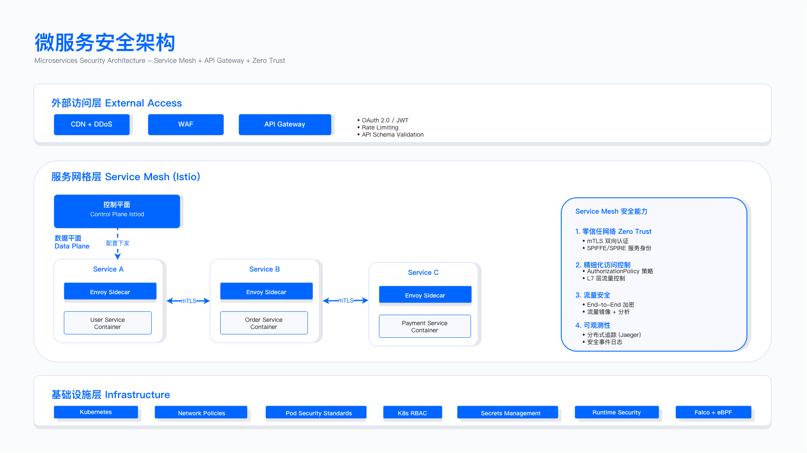
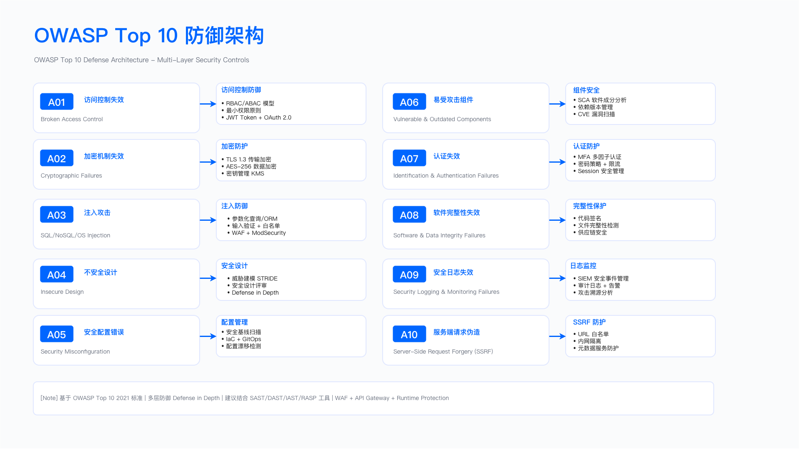
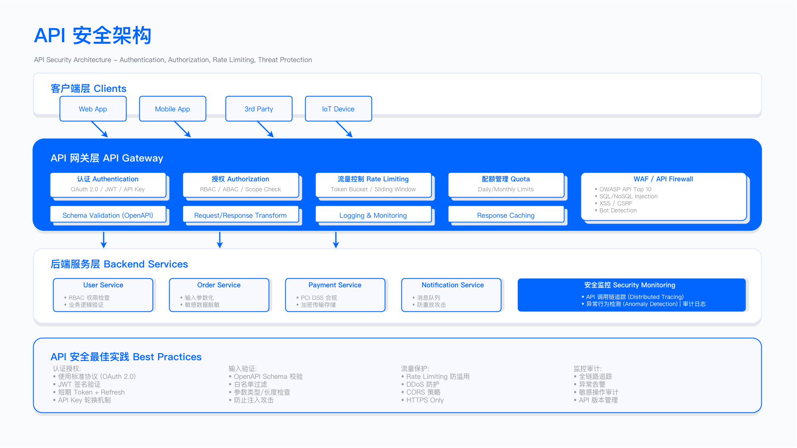

# 6.2 Application Security Architecture Design (应用安全架构设计)

应用安全架构的本质是回答"如何将安全控制系统化地嵌入业务系统中，使之既能保护资产又不阻碍业务交付"。本节从企业架构映射、IT 架构分层、安全域划分、应用安全关键技术栈四个视角，构建从战略到落地的完整架构体系。架构设计需明确每层的控制点与责任边界，确保设计决策可追溯、控制措施可验证、运行效果可量化。

---

## 6.2.1 业务价值链与安全活动映射

应用安全架构首先需明确"为谁服务、解决什么问题"。安全活动必须映射到业务价值链的关键节点，将抽象的"安全保障"转化为可量化的业务价值。

### 业务价值澄清

应用安全支撑业务目标的六类核心价值：

资本与风险控制：将数据泄露、业务中断、合规罚款等不可控风险转化为可量化成本（如保险费用、技术投入），支撑融资、并购、上市尽调中的风险披露要求。安全能力成熟度直接影响风险折扣率。

市场与准入门槛：稳健的安全基线（如 SOC 2 Type II 认证、ISO 27001 认证）成为客户采购决策的前置条件，缩短安全评估周期，加速商务谈判。Trust Center（透明的安全披露站点）降低客户尽调成本，提升转化率。

用户信任与品牌：端到端保护用户隐私与交易安全，降低数据泄露舆情、用户流失风险。用户对"数据安全承诺"的信任度与 NPS（净推荐值）、留存率呈正相关。

技术交付效率：策略即代码、自动化门禁、安全即服务平台减少返工与上线阻塞，保持部署频率、交付周期等工程效能指标稳定。安全左移避免"测试后期发现大量漏洞导致延期"。

合规与生态协同：安全日志、审计中心（证据管理平台）、指标治理支撑全球合规要求（如 GDPR、PIPL），满足合作伙伴安全要求，构建可审计的运营体系。

安全经济性量化：通过 ROI/ROSI（安全投资回报率）、ALE（年度预期损失）、安全债务等模型衡量投入产出，作为预算与项目优先级依据。例如：某项加密改造成本 $50 万，规避的潜在罚款期望值 $200 万，ROSI = 300%。

### 设计原则

业务优先与可度量：安全目标必须映射到业务指标（如客户安全满意度、安全事件导致的业务中断时长），确保投入产出可量化。避免"为了安全而安全"的封闭决策。

策略一致与可追溯：从战略层（如"零信任架构"）到规划层（如网络微隔离方案）再到落地层（如 Kubernetes NetworkPolicy 配置），需建立清晰的控制映射与证据链，确保执行不偏离战略方向。

架构决策纪录化：将关键安全决策以 ADR (Architecture Decision Record) 形式沉淀，记录决策背景 (Context)、考量因素 (Drivers)、备选方案 (Alternatives)、最终选择 (Decision)、权衡代价 (Consequences)。确保决策可追溯，为后续架构演进提供历史依据。

### 价值链安全活动映射

以典型业务价值链"市场洞察→产品规划→需求立项→设计评审→研发测试→发布运营→客户支持"为主线，标注各阶段安全触点，明确安全活动对业务指标的支撑关系。

| 价值链阶段 | 安全活动内容 | 核心产出物 | 安全 KPI 示例 | 责任方 (RACI 参考) |
| ------------------------------ | ------------------------------------------------------------------------------------------------------------ | ---------------------------------------------------------------------------------------------- | ----------------------------------------------------------- | ----------------------------------------- |
| **1. 市场洞察/产品规划** | 1. 安全情报收集与分析<br />2. 行业合规趋势扫描 <br />3. 业务场景风险画像构建 | 1. 安全风险假设报告 2. 合规要求清单 3. 初步风险画像 | 1. 合规趋势扫描覆盖率<br />2. 风险画像完成率 | 业务 Owner(A)、安全团队(C) |
| **2. 需求立项/设计评审** | 1. BISO/安全 BP 参与商业评估<br />2. 业务场景安全评审或威胁建模<br />3. 数据分级分类 <br />4. 安全控制清单输出 | 1. 安全评审/威胁建模报告<br />2. 数据分级文档 <br />3. 安全控制清单 <br />4. 架构决策记录 (ADR) | 1. 需求评审安全参与率<br />2. 威胁建模覆盖率 | 业务 Owner(R)、安全团队(A) |
| **3. 研发测试** | 1. 策略即代码落地<br />2. 自动化质量门禁 (SAST/SCA/DAST/IAST)<br />3. 渗透测试/攻防演练 | 1. 自动化安全测试报告<br />2. 漏洞扫描结果 <br />3. 渗透测试/攻防演练复盘文档 | 1. 质量门禁阻断率<br />2. 漏洞修复率<br />3. 渗透测试覆盖率 | 研发团队(R)、安全团队(C)、平台团队(S) |
| **4. 发布运营** | 1. 灰度发布安全验收<br />2. 运行时安全监控 <br />3. 漏洞与例外治理 <br />4. 安全应急预案演练 | 1. 灰度发布安全验收报告<br />2. 运行时监控日志 <br />3. 漏洞治理台账 <br />4. 应急预案文档 | 1. 上线前漏洞清零率<br />2. 监控告警响应时效 | 运维团队(R)、安全团队(A)、业务 Owner(S) |
| **5. 客户支持与增长** | 1. 客户安全尽调协助<br />2. Trust Center 内容更新 <br />3. 安全事件响应复盘 <br />4. 安全指标反馈至规划阶段 | 1. 客户尽调支持文档<br />2. Trust Center 更新记录 <br />3. 事件复盘报告 <br />4. 指标反馈清单 | 1. 客户安全满意度<br />2. 事件复盘完成率 | 客户支持团队(R)、安全团队(A)、合规法务(C) |

说明：
- 责任方 (RACI)：R = 负责执行、A = 审批/问责、C = 咨询/支持、S = 知情，根据企业实际架构调整。
- 安全 KPI：聚焦过程与结果双维度，与业务指标（如交付效率、客户满意度）形成联动考核。

---

## 6.2.2 IT 架构映射与应用安全控制点

应用安全架构需在 IT 架构的各层中识别安全控制点，将抽象的架构框架转化为具象的防护措施。

### IT 架构分层与 TOGAF BDAT 映射

本书[第 4.1 节](../chapter_04_security_architecture_engineering/4.1_security_architecture_frameworks.md)已详细介绍 TOGAF ADM 架构开发方法与框架选择，本节聚焦 TOGAF BDAT（业务/数据/应用/技术）四层架构在应用安全场景下的控制点映射。

应用安全架构需在 TOGAF BDAT 四层的基础上，识别各层的安全控制点，将抽象的 IT 架构转化为具象的云服务分层安全防护体系：Cloud（云基础层）→IaaS（基础设施即服务）→PaaS（平台即服务）→SaaS（软件即服务）。

BDAT 与实施层映射：

- Business（业务）→ 业务能力图、价值流、服务蓝图、客户旅程（安全触点标注）
- Data（数据）→ 数据域、主数据、血缘关系、驻留与跨境策略、生命周期管理
- Application（应用）→ 应用组件、微服务、集成关系、事件与 API、可观测性
- Technology（技术/基础设施）→ Cloud/IaaS/PaaS/SaaS 资源与平台服务

### 参考模型与控制点

应用层：微服务架构、事件驱动、BFF (Backend For Frontend)、API 管理平台



*图：微服务安全架构 - 展示云原生微服务架构下的安全防护体系，包括服务网格 (Service Mesh) mTLS 双向认证、API 网关统一鉴权、容器运行时防护、服务间细粒度授权等核心安全能力，是现代应用架构设计的安全参考模型。*

微服务架构下的安全控制点包括：服务网格实现服务间 mTLS 双向认证与流量加密；API 网关实现统一鉴权、速率限制、审计日志；容器运行时防护（如 Falco）检测异常行为；服务间授权采用 JWT 令牌 + 细粒度 RBAC 策略。

数据层：数据网格 (Data Mesh)、数据仓库、数据湖、实时流 (Kafka/Pulsar)

数据层安全控制点：数据分级与标签管理、加密（静态 + 传输）、脱敏/代币化、访问审计、血缘追踪、驻留与跨境管控。

集成层：API 网关、服务网格 (Service Mesh)、消息中间件

集成层安全控制点：统一鉴权、契约治理、配额与速率限制、密钥轮换、审计日志、异常流量检测。

基础设施层：多云/混合云、容器编排 (K8s)、基础镜像与运行时

基础设施层安全控制点：CSPM（云安全态势管理）、CIEM（云基础设施权限管理）、网络分段、主机加固、容器镜像扫描、密钥管理 (KMS/HSM)、日志集中化。

### 设计原则

标准化与黄金路径 (Golden Path)：为开发者提供"默认安全"的最佳实践模板与脚手架，降低安全门槛。例如：提供预配置安全基线的微服务模板，开发者 fork 后即符合安全要求。

共享责任清晰：云厂商与企业的责任边界清晰，控制点有明确主责人。例如：IaaS 层网络隔离由云厂商负责基础设施安全，企业负责安全组规则配置；PaaS 层数据库加密由云厂商提供能力，企业负责密钥管理与轮换策略。

可组合与低耦合：安全能力组件化、接口化，便于替换与升级。例如：认证服务通过标准 OIDC 协议提供能力，前端应用无需关心后端实现，可平滑切换认证提供商。

---

## 6.2.3 基础安全架构（三大安全域×四层×三位一体）

基础安全架构通过"三大安全域×四层云服务×三位一体"构建全栈防护矩阵，确保安全能力与 IT 架构深度适配。

### 三大安全域

基础安全 (Infra Security)：

覆盖基础设施层的安全能力：身份与访问管理、网络分段与微隔离、主机与容器安全、终端防护 (EDR)、云安全态势管理 (CSPM/CIEM)、特权访问管理 (PAM/堡垒机)。

应用安全 (AppSec)：

覆盖应用层的安全能力：认证鉴权、输入校验、日志与可观测、WAF/RASP、API 管理、SAST/DAST/IAST、供应链安全 (SCA/SBOM)。



*图：[OWASP Top 10:2025](https://owasp.org/Top10/2025/) 防御架构 - 展示应用安全域中针对 OWASP Top 10 漏洞的分层防护体系，包括认证鉴权、输入校验、WAF/RASP 等核心防护措施，是应用安全架构设计的实践参考模型。*

数据安全 (DataSec)：

覆盖数据全生命周期的安全能力：分类分级、加密与密钥管理、脱敏/代币化、访问审计、驻留与跨境管控、备份恢复、数据防泄漏 (DLP)、隐私工程。

### 四层云服务映射

- Cloud 层：账户/组织/项目级安全（CSPM、CIEM、日志/监控聚合、统一身份管理）
- IaaS 层：网络（VPC、安全组、防火墙）、主机（基线加固、补丁管理）、存储（加密、备份）、镜像（扫描、签名）、密钥与证书管理
- PaaS 层：数据库（加密、审计）、消息队列（鉴权、加密）、缓存（访问控制）、函数（权限最小化）、容器编排（K8s 策略、准入控制）
- SaaS 层：SSO/SCIM（身份联邦）、租户隔离、数据导出/驻留、审计可见性、Trust Center（安全披露）

### 三位一体（管理/技术/运营）

从纵向视角看应用落地全流程，需依托"安全管理、安全技术、安全运营"三位一体的安全体系作为核心支撑：

管理：制度、标准、例外管理、审计；"策略与合规即代码"(Policy as Code) 确保策略版本化、可追溯、可自动化执行。

技术：平台能力与策略执行引擎（OPA/Kyverno/Gatekeeper 等）、自动化工具链、安全即服务平台。

运营：监测与检测工程（SIEM/XDR）、应急响应（SOAR 自动化编排）、红蓝紫队对抗演练、持续改进（PDCA 循环）。

应用安全的业务架构以"安全管理、安全技术、安全运营"三位一体的安全体系为设计核心，其中 SDL（安全开发生命周期）是贯穿始终的关键机制，核心思想是"安全左移"——将安全管控环节从传统的开发后期（如测试、上线阶段）提前至需求、设计等前期阶段，从源头降低安全风险。

### 纵深防御七层模型详解

纵深防御的核心假设是：任何单一防御层都可能被突破，真正的安全来自于多层独立防御体系的协同。即使某一层失效，其他层仍可持续提供保护，最大程度延缓攻击进程并降低损失。

```
┌─────────────────────────────────────────────────────────────────┐
│ 纵深防御的七层防护模型                                            │
├─────────────────────────────────────────────────────────────────┤
│ Layer 7: 业务逻辑层 (Business Logic)                              │
│   ├─ 交易限额、风控规则、反欺诈检测                                │
│   ├─ 业务审批流、双人复核机制                                      │
│   └─ 异常行为检测(UEBA)                                           │
├─────────────────────────────────────────────────────────────────┤
│ Layer 6: 应用层 (Application)                                    │
│   ├─ 输入校验、输出编码、参数化查询                                │
│   ├─ CSRF Token、XSS 防护、SQL 注入防护                           │
│   └─ 会话管理、超时控制、并发控制                                  │
├─────────────────────────────────────────────────────────────────┤
│ Layer 5: 认证授权层 (AuthN/AuthZ)                                │
│   ├─ OAuth 2.0 / OIDC / SAML 认证                                │
│   ├─ RBAC/ABAC 授权模型                                          │
│   ├─ MFA 多因素认证、JIT 及时权限                                 │
│   └─ 会话令牌管理(JWT/Session)                                   │
├─────────────────────────────────────────────────────────────────┤
│ Layer 4: 网络层 (Network)                                        │
│   ├─ WAF (Web Application Firewall)                             │
│   ├─ API Gateway (限流、熔断、鉴权)                               │
│   ├─ DDoS 防护、CDN 缓存                                          │
│   └─ 微隔离、零信任网络                                            │
├─────────────────────────────────────────────────────────────────┤
│ Layer 3: 主机/容器层 (Host/Container)                             │
│   ├─ OS 安全基线、补丁管理                                         │
│   ├─ 容器镜像扫描、运行时保护(Falco)                               │
│   ├─ 最小化镜像、非 Root 运行                                      │
│   └─ EDR (Endpoint Detection & Response)                         │
├─────────────────────────────────────────────────────────────────┤
│ Layer 2: 数据层 (Data)                                           │
│   ├─ 静态加密(AES-256)、传输加密(TLS 1.3)                          │
│   ├─ 数据脱敏、代币化(Tokenization)                                │
│   ├─ 密钥管理(KMS/HSM)、密钥轮换                                   │
│   └─ 备份加密、数据销毁                                            │
├─────────────────────────────────────────────────────────────────┤
│ Layer 1: 审计监控层 (Audit & Monitoring)                          │
│   ├─ 全链路日志(访问日志、操作日志、审计日志)                        │
│   ├─ SIEM/XDR 威胁检测                                            │
│   ├─ 异常告警、自动化响应(SOAR)                                    │
│   └─ 取证留存、不可篡改日志                                         │
└─────────────────────────────────────────────────────────────────┘

关键原则：每一层独立工作，互不依赖；一层失效，其他层继续防护
```

实战映射示例：以电商支付系统为例，七层防护协同工作

| 防护层 | 具体措施 | 攻击阻断能力 |
|--------|----------|--------------|
| **Layer 7: 业务逻辑** | 单笔限额 5 万、单日限额 20 万、风控评分 < 60 阻断 | 阻断欺诈交易 |
| **Layer 6: 应用层** | 支付金额白名单校验、订单号绑定、CSRF Token | 阻断注入攻击 |
| **Layer 5: 认证授权** | 支付前重新认证、Token 5 分钟有效期、MFA | 阻断账号接管 |
| **Layer 4: 网络层** | WAF 阻断攻击、API 限流 (100 req/min)、内网隔离 | 阻断自动化攻击 |
| **Layer 3: 主机/容器** | 容器只读文件系统、Seccomp 限制、非 Root 运行 | 阻断容器逃逸 |
| **Layer 2: 数据层** | 银行卡号代币化、数据库 TDE 加密、KMS 管理 | 数据泄露后不可用 |
| **Layer 1: 审计监控** | 支付操作审计、异常实时告警、180 天留存 | 事后溯源取证 |

常见误区与修正：

误区："我们有 WAF，应用层就不用做防护了"

风险：单点防御失效。攻击者可绕过 WAF（如 Base64 编码绕过规则），若应用层未实现参数化查询，仍可导致 SQL 注入。

正确做法：即使有 WAF，应用层仍需实现参数化查询、输入校验、数据库最小权限、敏感数据脱敏，形成多层独立防护。

---

## 6.2.4 应用安全架构核心技术栈

应用安全架构需围绕 SDL 模型、DevSecOps、API 安全、身份与访问管理、前端与移动端安全、隐私工程六大技术栈构建防护能力。

### 6.2.4.1 SDL 模型（安全开发生命周期）

SDL (Security Development Lifecycle，安全开发生命周期) 是由微软提出的软件开发安全框架，其核心理念是将安全考量与合规要求深度集成到软件开发的全流程中——从需求分析、架构设计，到编码开发、测试验证，再到上线发布与运维迭代，每个阶段均嵌入对应的安全活动（如需求安全评审、设计阶段威胁建模、开发阶段代码安全扫描、上线前渗透测试等），以此帮助研发团队从源头减少安全漏洞、规避隐私合规风险。

作为软件开发安全的核心体系框架，应用安全的能力建设与服务运营需全面围绕 SDL 展开：在 SDL 各阶段配套构建安全工具（如自动化扫描工具、漏洞管理平台）、输出安全规范（如安全编码指南、测试标准）、提供专业服务（如安全咨询、应急响应支持），最终通过 SDL 实现应用从规划到落地的全周期安全保障。

SDL 阶段关键活动：

SDL 按软件开发生命周期各阶段嵌入对应安全活动。

需求与设计阶段：开展安全需求评审、数据分级、误用/滥用案例分析及威胁评审（高价值资产采用完整威胁建模，参见[第 4.3 节威胁建模方法](../chapter_04_security_architecture_engineering/4.3_threat_modeling.md)）。

开发阶段：落实安全编码规范、依赖与许可证治理、Secrets 管理（密钥/证书不入代码库）。

测试阶段：执行 SAST（静态应用安全测试）、SCA（软件成分分析）、DAST（动态应用安全测试）、IAST（交互式应用安全测试）、API 安全测试、移动端安全扫描及 IaC/K8s 策略扫描。

发布阶段：实施镜像与制品签名/验签、基线校验、灰度发布与回滚策略。

运行阶段：构建可观测与检测工程体系，根据场景选配 RASP（运行时应用自我保护），同步建立漏洞响应、演练与复盘机制，形成持续改进闭环。

出口准入 (Exit Criteria)：

每个阶段的出口准入标准：高/严重漏洞清零或已获批例外且有临时缓解措施；门禁通过、证据齐备（可审计）。

例如：测试阶段出口准入要求 SAST/DAST 扫描通过、CVSS ≥ 7.0 漏洞修复完毕或获安全团队批准例外（需提供临时缓解措施与修复计划）、生成 SBOM（软件物料清单）并验证许可证合规。

#### 安全失败原则 (Fail Secure)

SDL 实施中，系统设计必须遵循安全失败原则：当系统发生故障、异常、资源耗尽时，应默认拒绝访问，而非默认允许。

Fail Secure vs. Fail Open 对比：

```
Fail Open (危险做法):
  if (authService.isAuthorized(user, resource)) {
    return resource;
  } else {
    // 认证服务异常时，默认允许访问
    return resource; // 为了"可用性"
  }

  风险：攻击者通过 DDoS 认证服务，导致所有请求被允许

Fail Secure (推荐做法):
  try {
    if (authService.isAuthorized(user, resource)) {
      return resource;
    } else {
      throw new UnauthorizedException();
    }
  } catch (Exception e) {
    // 认证服务异常时，默认拒绝访问
    log.error("Auth service failed", e);
    throw new ServiceUnavailableException("请稍后重试");
  }

  原则：宁可暂时不可用，也不能不安全
```

实施要点：

Fail Secure 原则落地需平衡安全与可用性。通过本地缓存权限结果（TTL 设置为 5-15 分钟）提供短期容错能力，缓存失效时默认拒绝访问而非放行；同步记录详细异常日志并触发告警，确保运维团队可及时发现认证服务故障；对外返回 503 (Service Unavailable) 状态码明确服务不可用，而非返回 200 OK 误导客户端；核心原则是避免为了追求"可用性"而默认允许访问，造成更严重的安全风险。

### 6.2.4.2 SDL 流程视图与质量门禁

SDL 流程需通过质量门禁 (Quality Gate) 实现自动化控制，确保安全标准可执行、可验证。

质量门禁示例：

- PR 级 (Pull Request)：代码规范检查、Secrets 扫描、轻量 SAST、API 契约校验均必须通过
- 构建阶段：SAST/SCA 扫描、SBOM 生成、制品签名
- 入库阶段：CVE（已知漏洞）门禁、许可证合规校验、签名验证
- 部署阶段：IaC/K8s 策略门禁、准入控制 (Admission Controller) 验签
- 发布阶段：双人审批、金丝雀发布、回滚预案验证

### 6.2.4.3 SDL 风险漏斗视图

SDL 模型可类比为"安全漏斗"，其核心逻辑是对漏洞与风险进行"自上而下、由粗到细"的分层筛选与收敛：在 SDL 全流程（需求→设计→开发→测试→上线）中，上层阶段（如需求、设计）聚焦"粗颗粒度"的风险管控（如业务逻辑风险、架构安全缺陷），通过安全评审、威胁建模等活动过滤核心风险；下层阶段（如开发、测试）则针对"细颗粒度"的漏洞治理（如代码漏洞、配置缺陷），借助代码扫描、渗透测试等手段精准排查。

分层工具与作用：

- 顶层（广覆盖）：SAST/SCA/DAST/暴露面扫描/基线检查，快速发现大量潜在风险
- 中层（聚焦真实风险）：IAST/API Fuzzing/带鉴权 DAST/灰盒测试，过滤误报，聚焦可利用漏洞
- 底层（定位根因）：运行时探针/RASP/异常检测与回放，精准定位漏洞利用路径与根因

噪声治理：

通过规则基线、误报抑制、知识库复用、风险优先级排序（结合 CVSS/EPSS/业务暴露度）降低误报率，提升安全团队与研发团队的协作效率。

### 6.2.4.4 DevSecOps

DevSecOps 是将安全深度融入 DevOps 流程的理念与实践，核心是在保持软件开发部署敏捷性的前提下，通过"安全左移"和自动化，实现安全与业务同步迭代——它并非独立于 DevOps，而是对其的补充强化，理念上强调"安全责任人人有责"以打破团队壁垒，实践上靠自动化工具链（如代码扫描、漏洞检测）将安全检查嵌入开发全流程，目标是不拖累发布速度的同时从源头降风险、保合规。

DevSecOps 与 SDL 互补协同：SDL 是定义安全流程与管控节点的顶层治理模型，DevSecOps 则是适配敏捷迭代的工具链落地方法，本质是 SDL 针对快速业务场景的优化，二者核心都是让安全融入开发全流程而非独立存在。

核心价值：

1. 平衡安全与效率，不让安全成业务瓶颈
2. 安全前置以降低漏洞被利用的风险
3. 追溯漏洞根因防重复发生
4. 打破团队摩擦，兼顾前沿技术应用、业务敏捷性与合规性

### 6.2.4.5 API 安全架构

API 作为业务系统间数据交互与功能调用的核心通道，其安全架构需围绕"全生命周期防护"设计，从设计源头、身份验证、数据传输，到网关管控、持续测试监测，形成闭环安全能力，确保 API 在支撑业务敏捷调用的同时，抵御未授权访问、数据泄露、恶意攻击等风险。

设计规范：

以 OpenAPI/JSON Schema 作为 API 定义的单一事实源，统一接口规范并消除信息歧义；通过版本化管理与明确的弃用策略，配合向后兼容设计，既能保障 API 迭代的平滑过渡，又能及时淘汰存在安全隐患的老旧版本，从源头减少因接口定义混乱导致的安全漏洞。

鉴权授权：

采用分层防护策略：面向用户侧基于 OAuth 2.1/OIDC 协议，结合 PKCE (Proof Key for Code Exchange) 和授权码模式强化认证安全性，通过 Audience/Scope 实现权限最小化管控，并定期轮换 JWK (JSON Web Key) 降低密钥泄露风险；服务间通信则采用 mTLS（双向 TLS）实现身份互信，叠加短期 JWT 令牌减少长期凭证被滥用的危害，双重机制全面覆盖"人与服务""服务 ↔ 服务"交互场景。

传输与存储：

强制使用 TLS 1.2 及以上版本加密传输链路，敏感接口额外启用 mTLS 增强身份核验；通过请求签名机制（结合 nonce 随机值、timestamp 时间戳及签名有效窗口），有效抵御重放攻击，确保数据在传输过程中不被篡改、窃取。

网关控制：

作为集中安全入口，实现标准化防护：统一鉴权避免重复开发认证逻辑，通过速率限制、配额管控及突发限流防止 API 滥用与服务雪崩；结合 IP/设备信誉库拦截恶意来源，叠加 WAF 防护与 Schema 校验过滤注入攻击和非法请求格式；同时对请求/响应日志中的敏感数据进行脱敏处理，兼顾安全防护与合规要求。

测试与监测：

测试阶段通过带鉴权的 DAST、API Fuzzing（模糊测试）模拟真实攻击场景，结合 Schema 一致性校验与逻辑滥用用例（如越权访问、参数篡改测试），提前发现设计与实现漏洞；运维阶段监测异常访问率、限流命中率等指标，实时感知潜在攻击行为，实现安全问题的早发现、早处置。



*图：API 安全架构 - 展示 API 全生命周期安全防护体系，包括设计规范 (OpenAPI)、鉴权授权 (OAuth/mTLS)、网关控制（统一鉴权/限流/WAF）、测试与监测等核心能力，是 API 安全架构设计的实践参考模型。*

### 6.2.4.6 身份与访问管理（IAM）

身份与访问管理（IAM）是企业安全架构的核心支柱，核心目标是"确保正确的主体（人/服务）在正确的场景下，仅能访问其权限范围内的资源"，通过覆盖"身份全生命周期、认证安全、授权管控、审计追溯"四大环节，构建从"身份创建"到"权限回收"的闭环安全体系，防范越权访问、身份冒用、权限滥用等风险。

身份与生命周期：

重点解决"身份从哪里来、到哪里去"的问题：通过 SSO（单点登录，基于 OIDC/SAML 协议）实现多系统统一身份入口，提升用户体验的同时减少账号管理复杂度；借助 SCIM 协议实现身份的自动供应（如员工入职时自动创建系统账号）与回收（如离职时自动冻结账号），搭配 JIT (Just-in-time，即时权限) 模式避免"长期闲置权限"存在的风险，再结合 JML（入转离）流程，确保员工岗位变动时身份权限同步调整，从源头杜绝"身份孤儿"与"权限残留"。

认证与会话：

聚焦"确认'你是谁'的真实性"，通过多层防护提升身份验证强度：强制启用 MFA（多因素认证），在密码之外增加生物识别、动态验证码等额外验证维度；针对高风险场景（如异地登录、敏感操作）触发 Step-up（阶梯式认证），要求更高安全级别的验证方式；令牌管理上采用"短期访问令牌 + 绑定设备/地理位置/风险评分的刷新令牌"模式，减少令牌泄露后的危害范围；同时通过会话固定防护（如登录后重置会话 ID）、会话劫持防护（如 HTTPS 加密、会话超时控制），保障会话周期内的身份安全。

授权与特权：

核心是"划定访问边界，尤其管住高权限资源"：通过 RBAC（基于角色的访问控制）按岗位分配基础权限，结合 ABAC（基于属性的访问控制）根据场景属性（如时间、设备、操作类型）动态调整权限，实现细粒度授权；针对特权账号（如管理员账号），通过 PAM（特权访问管理）系统实现权限申请审批、会话全程录屏，确保高权限操作可追溯；同时借助 CIEM（云基础设施权限管理）工具定期开展权限复核，清理冗余、过期权限，避免"权限膨胀"。

审计追溯：

为身份与访问安全提供"事后追责与合规支撑"：将用户登录日志、权限变更日志（如权限新增/删除）、权限使用日志（如敏感资源访问记录）集中存储与分析，确保每一条操作都能回溯到具体主体（人/服务）及对应的工单（如权限申请工单），既满足监管合规对审计日志的留存与可追溯要求，也能在安全事件发生后快速定位责任人、还原事件过程。

### 6.2.4.7 前端与移动端安全基线

Web 前端与移动端作为业务直接触达用户的入口，其安全防护需聚焦"用户侧风险抵御"与"终端数据保护"，针对两类终端的技术特性与攻击场景，构建差异化且精准的安全能力，防范 XSS、数据泄露、终端篡改等风险。

Web 前端：

Web 前端安全核心是抵御浏览器环境下的注入攻击与数据窃取，通过"环境加固+代码管控"形成防护体系。

通用场景：

安全头部配置：通过 CSP（内容安全策略）限制资源加载来源，阻断 XSS 攻击；HSTS（HTTP 严格传输安全）强制浏览器使用 HTTPS，避免降级攻击；X-Frame-Options 防止点击劫持；X-Content-Type-Options 禁止 MIME 类型嗅探；Referrer-Policy 控制 Referrer 信息传递，减少隐私泄露，多头部协同构建浏览器层面的安全基线。

代码与依赖安全：采用 SRI（子资源完整性）校验外部资源（如 JS、CSS）完整性，防止资源被篡改；依赖锁定（如 package-lock.json）固定第三方库版本，规避供应链漏洞；禁止 eval()、new Function() 等动态执行语法，减少代码注入风险；通过模板自动转义（如 Vue/React 的默认转义）与 DOM 操作防护，避免 DOM 型 XSS；同时加强 DOM 污染检测，防止攻击者通过篡改 DOM 属性发起攻击。

支付场景：

在支付场景中，由于需要接入第三方支付渠道以及兼容复杂的第三方组件（如支付网关 SDK、银行插件、数字证书控件等），严格的 CSP 可能会因限制过严导致功能异常。这种情况下，核心原则遵循"最小必要+场景隔离+补偿措施"：不盲目禁用 CSP，而是针对性放宽必要权限，同时通过其他安全机制（输入校验、隔离、监控）填补防护缺口，在功能可用与风险可控之间找到平衡。

移动端（对标 MASVS L1/L2）：

移动端安全需覆盖"通信安全、终端环境、数据存储、应用完整性"四大维度，满足移动应用安全验证标准 (MASVS) L1（基础安全）与 L2（深度安全）要求。

通信与环境安全：

通过证书绑定 (Certificate Pinning) 强制 App 与指定服务器证书匹配，抵御中间人攻击，同时配套证书轮换机制应对证书更新；实现调试模式检测、越狱 (iOS)/Root (Android) 环境检测，发现风险环境时限制功能或告警；针对敏感操作（如密码输入、支付页面）提供键盘记录防护与截屏禁止，防止敏感信息被窃取。

数据与应用完整性：

敏感数据（如 token、密钥）存储于系统安全区域（iOS Keychain/Android Keystore），避免明文存储或保存在易被读取的目录；通过反二次打包技术（如签名校验、加固壳）与应用签名验证，防止 App 被篡改后重新打包分发；遵循权限最小化原则申请系统权限（如仅必要时申请位置、相机权限），并在权限申请时明确用途说明，兼顾安全与用户体验。

### 6.2.4.8 隐私工程与数据生命周期

本书[第 9 章 隐私合规](../../part_03_data_security_privacy/chapter_09_privacy_compliance/)详细介绍 GDPR/PIPL 法规要求、DPO（数据保护官）职责、隐私治理组织架构等企业级隐私治理体系。本节聚焦隐私工程在应用开发中的技术落地，即如何将 Privacy by Design 原则集成到 SDL 流程、DevSecOps 工具链与 CI/CD 管道，为应用安全工程师提供实操指南。

隐私工程的核心目标是"在应用开发场景下，通过工程化手段保障用户数据权益"，将隐私理念嵌入从设计到代码、测试、发布的完整研发流程，并针对性解决跨境场景下的数据安全问题，实现"隐私保护与业务发展"的平衡，规避数据泄露、合规处罚等风险。

隐私设计：

隐私设计聚焦"数据使用前的规则定义"，通过标准化策略确保数据处理合法合规。

以"数据最小化"原则限定采集范围（仅收集业务必需数据），"目的限定"明确数据用途（不用于未告知场景），从源头减少数据暴露风险；搭建用户同意管理与偏好中心，支持用户自主选择数据授权范围（如营销信息推送开关），同时制定 DSR（数据主体请求，如查询、删除个人数据）的 SLA 响应标准，保障用户数据控制权；提供 DPIA（数据保护影响评估）模板，在开展高风险数据处理活动（如大规模用户数据分析）前，提前识别隐私风险并制定缓解措施。（完整 DPIA 触发条件与执行流程详见[第 9.3.2 节](../../part_03_data_security_privacy/chapter_09_privacy_compliance/9.3_personal_data_processing.md)）

生命周期：

数据生命周期管理覆盖"采集→处理→存储→共享→归档→删除"全环节，通过标准化流程与审计机制防止数据失控。

各环节均明确操作规范：采集时需获得用户授权，处理时采用加密等安全手段，存储时匹配数据敏感度分级（如敏感数据加密存储），共享时通过权限管控与脱敏限制数据范围；针对归档与删除环节，明确数据留存策略（如按法规要求设定留存期限，超期后执行删除），并区分"可恢复删除"（如用于应急恢复）与"不可恢复删除"（如敏感数据彻底销毁）场景；全流程同步记录审计日志，确保每一步数据操作（如数据共享对象、删除时间）可追溯，满足合规对数据流转的可审计要求。

跨境与驻留：

针对数据跨境传输的合规与安全风险，通过"评估+协议+技术"三重手段构建防护体系。

开展 TIA（传输影响评估），在数据跨境前评估接收方所在地区的隐私保护水平、数据泄露风险，判断传输行为是否合规。（跨境传输法律机制如 SCC/BCR 详见[第 9 章](../../part_03_data_security_privacy/chapter_09_privacy_compliance/)）签订符合法规要求的跨境合同条款（如加入数据保护责任条款、泄露赔偿约定），明确跨境双方的隐私保护义务；采用技术手段保障数据安全：通过区域化部署（如在特定地区搭建本地化数据中心）减少跨境传输需求，对必须跨境的数据，落实"密钥驻留"（如加密密钥留存于数据来源地区），防止数据在跨境后被未授权访问。

Privacy by Design 落地路径：

Privacy by Design 七大原则详解：

```
┌─────────────────────────────────────────────────────────────────┐
│ Privacy by Design 七大原则                                        │
├─────────────────────────────────────────────────────────────────┤
│ 1. Proactive not Reactive (主动而非被动)                          │
│    在隐私风险发生前预防，而非事后补救                               │
│                                                                   │
│ 2. Privacy as the Default (隐私默认)                              │
│    无需用户配置，系统默认最大隐私保护                               │
│                                                                   │
│ 3. Privacy Embedded into Design (隐私嵌入设计)                    │
│    隐私是架构的核心组成，而非附加功能                               │
│                                                                   │
│ 4. Full Functionality (全功能，非零和)                             │
│    隐私与功能并存，而非二选一                                       │
│                                                                   │
│ 5. End-to-End Security (端到端安全)                               │
│    数据生命周期全程保护                                            │
│                                                                   │
│ 6. Visibility and Transparency (可见与透明)                       │
│    用户可查看、控制其数据                                          │
│                                                                   │
│ 7. Respect for User Privacy (尊重用户隐私)                        │
│    以用户为中心的设计                                              │
└─────────────────────────────────────────────────────────────────┘
```

技术实现：数据最小化案例

电商注册表单优化示例：

```
错误设计（收集过度）：
  ┌─────────────────────────────────┐
  │ 用户注册                        │
  ├─────────────────────────────────┤
  │ 姓名：    [______________] *必填 │
  │ 性别：    [______________] *必填 │ ← 非必需
  │ 生日：    [______________] *必填 │ ← 非必需
  │ 身份证：  [______________] *必填 │ ← 过度收集
  │ 手机号：  [______________] *必填 │
  │ 邮箱：    [______________] *必填 │
  │ 家庭住址：[______________]       │ ← 可后置
  │ 公司名称：[______________]       │ ← 非必需
  └─────────────────────────────────┘

  风险：收集 8 项信息，其中 4 项非必需 → 数据泄露风险增加

正确设计（最小化）：
  ┌─────────────────────────────────┐
  │ 用户注册                        │
  ├─────────────────────────────────┤
  │ 手机号：  [______________] *必填 │ ← 用于登录/找回密码
  │ 密码：    [______________] *必填 │ ← 认证必需
  └─────────────────────────────────┘

  【延迟收集】姓名、地址 → 首次下单时再收集 (Just-in-Time)
  【可选字段】性别、生日 → 可选，用于个性化推荐（需用户同意）
  【场景限定】身份证   → 仅实名认证场景收集（如金融业务）
```

流程嵌入（业务→研发→运营）：

| 阶段 | 业务/产品职责 | 研发/架构职责 | 职能部门职责 |
| -------------------------- | -------------------------------------------- | -------------------------------------- | -------------------------------------------------- |
| 机会评估 (Opportunity) | 明确业务目的、合法性基础、数据类型、目标人群 | 识别系统边界、初步数据流 | 隐私/法务判断合规基础，触发 DPIA 门槛 |
| 方案设计 (Discovery/Design) | 输出需求文档与用户旅程，标注个人数据触点 | 制作数据流图、威胁建模、设计控制方案 | 隐私工程审查默认配置、脱敏与匿名化策略 |
| 构建测试 (Build/Test) | 联动安全 BP 补充滥用/误用案例 | 实施策略即代码、隐私单元测试、日志脱敏 | 合规、数据治理验证证据（审计、留存、访问控制） |
| 发布运营 (Launch/Operate) | 准备客户沟通、更新隐私声明与 FAQ | 灰度发布并监控隐私告警、保留可追溯日志 | 隐私/法务审批上线内容、登记处理活动、配置 DSR 工单流 |
| 持续改进 (Measure/Learn) | 收集客户反馈、监控退订/投诉指标 | 复盘隐私缺陷与事件、优化工具与策略 | 隐私团队年度评估、更新跨境与授权记录 |

触发机制与审批：

统一 PIA/DPIA 门禁，根据数据敏感度、地域范围、自动化决策程度自动触发工单；审批链包含业务 Owner、BISO/安全 BP、隐私官、法务，形成上线前书面决策与责任锚点。

证据与自动化：

数据流图、控制矩阵、审批记录、日志与留存配置、DSR 演练结果等证据自动沉淀到"安全日志与审计中心"，通过策略即代码持续校验加密、留存、访问审计等隐私控制。

用户体验与透明度：

产品内提供权限仪表盘、数据使用说明与 DSR 入口；上线前进行"隐私告知可理解性"测试，确保多语言、多地区用户易懂，收集反馈用于迭代。

### 6.2.4.9 安全能力平台与架构治理

安全能力平台是将分散的安全工具与服务整合为统一、可复用的能力体系，通过标准化接口向业务线提供"安全即服务"。

安全能力网格 (Capability Mesh)：

以身份、数据、API、测试、运行时防护、合规等能力域构建可复用服务，面向业务线通过 Portal/API 自助接入，支撑"安全即服务"。例如：业务线通过 API 调用"数据脱敏服务"，无需关心底层实现，降低安全门槛。

统一策略编排：

策略即代码仓库、中央策略引擎（OPA/Kyverno/自研 DSL）支持灰度、回滚、分环境推广，保证策略一致性与可追溯。策略变更需经过代码审查、测试验证，避免"人工配置错误"导致的安全漏洞。

Security Fabric 集成：

CI/CD、制品库、API 网关、服务网格、观测平台通过事件总线联动，实现告警 → 阻断 → 证据沉淀 → 指标更新的闭环。例如：SAST 扫描发现高危漏洞 → 自动阻断 PR 合并 → 通知开发者修复 → 生成审计日志 → 更新漏洞修复率指标。

架构治理机制：

设立 AppSec Architecture Board，运营 Architecture Decision Record (ADR) 与安全设计模式库 (Secure Design Patterns)，记录重大架构决策、威胁评估、缓解措施与验证计划。ADR 包含：决策背景、考量因素、备选方案、最终选择、权衡代价，确保决策可追溯。

量化数据：

以热力图或雷达图展示能力成熟度（覆盖度、自动化水平、阻断能力），用于季度治理例会与投资优先级排序。例如：身份域成熟度 L3（已实现 SSO/MFA，缺 JIT）、数据域成熟度 L2（已实现分级，缺自动化脱敏）。

---

## 常见误区

**误区一：架构设计只关注功能，安全后期补救**。在架构设计阶段不考虑安全控制点，等到上线前再做安全评审，导致架构级安全缺陷难以修复，需要大规模重构。规避方法：安全架构师参与架构评审，在设计阶段识别安全控制点，使用 ADR 记录安全决策。

**误区二：纵深防御等于堆叠工具**。认为部署了 WAF、RASP、EDR 等多层工具就实现了纵深防御，但工具之间缺乏协同，规则重复或冲突，告警淹没真正威胁。规避方法：明确每层工具的职责边界，建立告警去重与关联分析机制，定期验证各层防护的有效性。

**误区三：零信任等于不信任内部网络**。仅在网络层实施零信任（如微隔离），但应用层仍默认信任内部请求，未实施服务间认证与授权。规避方法：零信任需覆盖网络、身份、应用多层，服务间通信采用 mTLS，每次访问都需验证身份与权限。

**误区四：安全架构文档与实际实现脱节**。架构文档描述了完善的安全设计，但实际代码未按设计实现，控制措施形同虚设。规避方法：通过 Policy as Code 将架构要求转化为自动化检查，CI/CD 门禁验证实现与设计一致性。

---

## 验证方法

架构设计有效性需通过多种方式验证：

**设计阶段验证**：通过威胁建模识别设计中的安全缺陷，检查控制点是否覆盖所有信任边界，评审 ADR 确认安全决策的合理性。

**实现阶段验证**：IaC 扫描验证基础设施配置符合架构要求，SAST/SCA 验证代码实现符合安全编码规范，K8s 准入控制验证部署配置符合策略。

**运行阶段验证**：渗透测试验证纵深防御各层有效性，红队演练验证攻击路径是否被阻断，配置漂移检测验证运行时配置与基线一致。

**度量指标**：架构评审覆盖率（重大项目经过安全架构评审的比例）、设计缺陷修复率（设计阶段发现的安全问题修复比例）、控制措施有效性（各层防护成功阻断攻击的比例）。

---

## 关键要点

本节建立了"三层架构+五大支柱"的应用安全设计体系，实现纵深防御与业务对齐。

三层架构：

1. 业务安全层：反欺诈、风控、反爬虫
2. 应用安全层：认证鉴权、输入校验、WAF/RASP、API 安全
3. 基础安全层：网络隔离、主机加固、容器安全、密钥管理

五大设计支柱：

- 零信任：永不信任、持续验证、最小权限
- 纵深防御：7 层防护、失败安全、冗余设计
- 安全左移：SDL 嵌入 DevOps、自动化门禁
- 最小权限：RBAC/ABAC、JIT 访问、定期审计
- 可观测性：全链路日志、实时告警、审计留痕

架构决策：

使用 ADR 记录 Why（为什么）而非 What（是什么），确保决策可追溯，为后续架构演进提供历史依据。

记忆点：

零信任三原则（永不信任、持续验证、最小权限）、纵深防御 7 层（业务逻辑 → 应用 → 认证授权 → 网络 → 主机/容器 → 数据 → 审计监控）、SDL-DevOps 融合（安全左移 + 自动化）。

---

## 导航

**[← 上一节：6.1 应用安全战略与业务协同](./6.1_appsec_strategy_business_alignment.md)** | **[返回章节目录](./README.md)** | **[下一节：6.3 SDL 落地十项关键措施 →](./6.3_sdl_ten_key_practices.md)**

---

**© 2025 AI-ESA Project. Licensed under CC BY-NC-SA 4.0**

<!--
本节优化记录：
1. 修正代码示例中的标签："不安全的常见误区" → "危险做法"，"安全的常见误区" → "推荐做法"
2. 删除"下一节预告"段落
3. 新增"常见误区"章节（四个误区）
4. 新增"验证方法"章节（设计/实现/运行阶段验证 + 度量指标）
5. 保留图片：02_OWASP_Top10_Defense_v6.png、03_Microservices_Security_Architecture_v6.png、06_API_Security_Architecture_v6.png
6. 未发现需要删除的无法核验数据
-->

