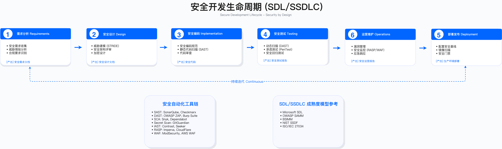
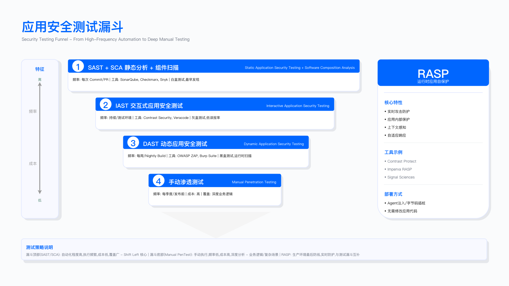

# 6.3 SDL 落地十项关键措施

SDL（Security Development Lifecycle，安全开发生命周期）的核心目标是将安全能力嵌入软件开发全流程，而非作为上线前的独立检查环节。本节围绕标准制定、可信组件、威胁建模、加密工程、供应链安全、CI/CD 防护、安全测试、基础设施加固、监控响应与度量治理十项措施，提供可落地的实施框架。

---

*图：SDL/SSDLC 生命周期各阶段与安全活动映射*

## 核心内容概述

SDL 十项措施构成一个完整的安全闭环体系：

**标准层**：建立覆盖设计、编码、测试、发布、运行各阶段的安全规范，配套考核指标与例外审批流程，将 SDL 嵌入现有业务流程而非另起炉灶。

**组件层**：优先使用内部安全基础设施（统一网关、统一鉴权、标准 SDK），对外部依赖实施准入门禁，覆盖传统应用与数据/AI 场景。

**评审层**：采用清单核查、自动化扫描与威胁建模相结合的方式，在设计阶段系统化识别攻击面。

**加密层**：明确算法选型规则（国际标准与国密算法的适用场景），禁用已知弱算法，实施密钥全生命周期管理。

**供应链层**：通过 SBOM 管理、制品签名、SLSA 认证建立软件物料可追溯性，扩展至数据与模型供应链。

**CI/CD 层**：强化流水线身份认证、代码签名、密钥托管、构建隔离，阻断供应链攻击入口。

**测试层**：覆盖需求→编码→测试→上线→运行全阶段，整合 SAST/DAST/SCA/IAST 及人工渗透测试。

**基础设施层**：实施云账户隔离、零信任网络、容器准入控制与运行时防护。

**监控层**：建立日志全量采集、SIEM 规则、分级响应流程与标准化 Runbook。

**度量层**：通过指标看板、成熟度对标（BSIMM/DSOMM/SLSA/MASVS）与攻防演练输入实现持续优化。

## 关键概念说明

| 概念 | 定义 | 在 SDL 中的作用 |
|------|------|-----------------|
| SDL | 安全开发生命周期，将安全嵌入软件开发全流程的方法论 | 应用安全体系的核心框架 |
| Policy as Code | 将安全策略代码化，通过自动化工具实施强制控制 | 自动化治理的技术基础 |
| SBOM | 软件物料清单，记录软件组件构成 | 供应链可见性的基础 |
| SLSA | 供应链级别安全保障框架，定义供应链安全成熟度等级 | 供应链可信度的行业参考 |
| VEX | 漏洞利用情况声明，说明漏洞是否影响特定产品 | 精准漏洞管理的决策依据 |
| STRIDE | 微软威胁建模方法论，涵盖欺骗、篡改、抵赖、信息泄露、拒绝服务、权限提升六类威胁 | 系统化威胁识别框架 |
| SAST/DAST | 静态/动态应用安全测试，分别在编码阶段与运行阶段检测漏洞 | 左移与运行态防护的核心技术 |
| BSIMM | 软件安全构建成熟度模型，基于行业实践数据的 SDL 参考 | 安全成熟度对标基准 |

---

## 6.3.1 建立安全标准、衡量指标与治理机制

SDL 的有效落地依赖三个支柱：可执行的安全标准、可量化的考核指标、可操作的例外流程。

### 6.3.1.1 制定安全标准

**问题背景**

安全标准的制定需要平衡三方面约束：外部合规要求（如 GDPR、PCI-DSS）、行业最佳实践（如 OWASP Top 10、SANS Top 25）、组织内部历史风险经验。标准过于宽松无法有效防控风险，过于严格则阻碍业务交付。

**制定原则**

安全技术标准应覆盖四个风险维度：安全漏洞风险（通用与业务场景下的漏洞防控）、隐私合规风险（数据保护与用户隐私相关法规）、行业框架对齐（OWASP ASVS、SSDF 等）、历史风险沉淀（组织过往因业务特性产生的特有风险）。

**分角色规范体系**

| 适用对象 | 规范名称 | 核心内容 |
|----------|----------|----------|
| 研发团队 | 《漏洞管理规范》 | 漏洞严重等级判定标准、各等级修复时限、漏洞验证方式 |
| 产品团队 | 《产品安全设计规范》 | 安全设计 Checklist、隐私合规设计要求、风险评估模板 |
| 研发团队 | 《软件应用开发安全规范》 | 开发环境安全配置、第三方组件选型标准、部署前检查项 |
| 研发团队 | 《安全编码规范》 | 分语言编码规则、禁用高危语法清单、检查工具规则映射 |
| 应用安全团队 | 《安全测试规范》 | 测试类型适用场景、测试用例设计要求、报告输出格式 |

**适用边界**：上述规范体系适用于自研应用、定制开发项目；对于采购的商业软件，应通过供应商安全评估流程而非内部编码规范管控。

**常见误区**：
- 规范过于笼统（如仅写"需进行安全测试"），缺乏可执行的检查项和验收标准
- 规范与工具脱节，无法通过自动化手段检测违规

**验证方法**：抽样检查规范中每条要求是否有对应的检测手段（自动化工具或人工 Checklist），无检测手段的条款应补充或删除。

### 6.3.1.2 制定考核指标

**设计原则**

考核指标应基于"平衡风险管控与业务资源"原则设定，既用于开发团队日常自查，也作为安全考核的基础依据。

**过程指标：漏洞修复时效**

漏洞修复时效的核心目标是缩短漏洞暴露窗口期，降低被利用风险。建议按严重等级设定修复时限：

- 危急漏洞（可直接导致核心数据泄露或系统瘫痪）：建议 1 个工作日内修复
- 高危漏洞（可远程利用或批量越权）：建议 3 个工作日内修复
- 中危漏洞（需特定条件利用）：建议 7 个工作日内修复
- 低危漏洞（仅存在潜在风险）：建议 14 个工作日内修复

**结果指标：漏洞漏测率**

漏洞漏测率 = 漏测应用漏洞数 ÷ 总应用漏洞数

- 漏测应用漏洞数：应用上线后通过内部 SRC、红队、外部渠道发现的、上线前未被内部安全测试识别的漏洞数量
- 总应用漏洞数：应用生命周期内发现的所有漏洞总数

**关键约束**：漏洞修复时效需与业务发布周期协调；漏测率阈值需根据组织安全成熟度逐步收紧，初期可设定较宽松的基线。

**运行指标**：监控漏洞修复 SLA 达成率、漏测率趋势、各团队漏洞密度（漏洞数/代码行数）。

### 6.3.1.3 建立例外流程

**适用场景**

例外流程适用于以下情况：监管政策或内部标准迭代导致适配时间不足；业务侧出现影响核心功能的紧急故障需优先处理；即将下线的老旧系统修复投入产出比过低；研发资源短期紧缺无法按时完成修复。

**申请要素（3W2H 框架）**

- What：漏洞等级、涉及系统/功能
- Why：申请原因及证明材料
- Who：例外期间的风险负责人
- How：短期风险缓解措施（如临时关闭高风险接口、增加访问控制、加强日志监控）
- When：例外有效期截止日期

**审批层级**

根据漏洞风险等级确定审批链路，建议参考：发起人 → 部门负责人 → 安全 BP → 中心总经理 → CSO/CISO。所有审批需留存书面记录，例外到期前需启动修复跟进。

**常见误区**：
- 例外流程成为"免死金牌"，缺乏到期跟踪机制导致风险长期悬置
- 缓解措施流于形式，未实际部署或部署后未验证有效性

### 6.3.1.4 跨职能 SDL 流程嵌入

**设计目标**

将 SDL 从单一技术流程扩展为业务、产品、研发、职能部门共同参与的价值链，确保安全活动与交付节奏同步。

**实施策略**

复用现有工具入口：在 Jira/Worktile 现有需求模板中新增"安全+合规"字段组（如数据类别、隐私影响等级），不创建新模板；在审批流中添加"安全 BP"审批节点，复用现有审批链路。

**阶段化嵌入要点**

| 阶段 | 业务/产品职责 | 研发/架构职责 | 安全/法务职责 | 门禁要求 |
|------|---------------|---------------|---------------|----------|
| 需求评估 | 定义业务目标、数据/隐私范围 | 梳理系统边界、初始数据流 | 风险初判、合规评估 | 完成初步风险画像 |
| 方案设计 | 标注数据触点、滥用场景 | 威胁建模、控制矩阵 | 设计评审、PIA/DPIA | 评审通过方可进入开发 |
| 开发测试 | 看板纳入安全任务 | 安全编码、自动化门禁 | 提供修复建议、误报治理 | CI/CD 门禁启用 |
| 发布准备 | 准备隐私声明更新 | 安全回归、灰度策略 | 上线包审批 | 双人审批 |
| 运营改进 | 关注安全相关 KPI | 漏洞响应、策略优化 | 定期复盘 | 季度 SDL Review |

---

## 6.3.2 使用安全可信的开发框架和组件

核心原则是"优先采用内部可信基础设施，严控外部依赖准入"，从源头降低组件漏洞与合规风险。

### 6.3.2.1 通用开发场景要求

**优先使用内部可信基础设施**

统一采用基础平台团队提供的安全工具，覆盖开发全流程基础能力：开发框架、统一网关、统一登录、统一鉴权、日志中心、配置中心、标准 SDK。所有工具需经安全团队预先评估，默认开启基础安全配置（如鉴权加密、日志审计）。

**外部依赖准入门禁**

外部依赖必须通过双重校验：
- 安全校验：通过 SCA 工具扫描，确认无高危漏洞
- 合规校验：审查许可证合规性，评估强 copyleft 协议（如 GPL）对衍生代码的影响

**适用边界**：此要求适用于所有进入代码仓库的外部依赖；对于临时实验或 POC 项目，可在隔离环境中放宽准入，但禁止将未经评估的依赖带入正式代码库。

**关键约束**：内部基础设施需保持及时更新，否则会成为新的单点风险；准入门禁需与开发效率平衡，建议设置白名单机制加速常用组件的审批。

### 6.3.2.2 大数据/算法/AI 开发环境补充要求

针对 AI/算法场景的特殊性，需额外管控以下环节：

**特征/模型资产安全**

基于统一特征管理平台（Feature Store）、模型仓库（Model Registry）实施访问控制：按角色划分操作权限，模型/特征版本需签名确认，更新需走审批流程。

**实验环境安全**

Notebook/算法实验环境需满足：与生产网络物理/逻辑隔离，仅允许使用白名单内的安全镜像，输入数据默认脱敏，输出工件自动扫描敏感信息泄露风险。

**Pipeline 流程安全**

对 Airflow/Kubeflow 等 Pipeline 工具配置策略校验：通过 Policy as Code 管控资源配额、镜像签名、密钥存储（禁止硬编码）；记录训练/推理全链路操作审计日志。

**第三方模型/权重管控**

引入外部模型、预训练权重时需：确认来源可信（官方仓库），执行哈希校验防止篡改；核查许可证类型；纳入 SBOM 与 VEX 管理，跟踪后续漏洞动态。

**常见误区**：
- 实验环境与生产环境共享数据存储，导致敏感数据泄露
- 第三方模型权重未做完整性校验，引入被篡改的恶意模型

**验证方法**：定期审计实验环境网络策略配置，验证是否存在生产网络访问路径；抽检第三方模型的哈希值是否与官方发布一致。

---

## 6.3.3 安全评审与威胁建模

### 6.3.3.1 安全评审

**核心定义**

安全评审是基于现有安全标准、规范、最佳实践及历史经验，对业务需求或应用系统各环节（设计、代码、配置）进行检查评估的轻量敏捷管控手段。

**评审维度**

- 产品设计阶段：评估数据采集是否符合隐私合规、权限设计是否遵循最小权限原则
- 代码开发阶段：检查是否遵循安全编码规范、是否存在禁用语法
- 系统配置阶段：验证是否满足安全基线、是否存在默认配置风险

**执行模式**

应用安全团队制定自查列表并同步给产品、开发、安全 BP。成熟度较高的团队中，主要由安全 BP 执行评审。可通过自动化工具辅助评审，减少人工重复工作。

**安全评审方法**

| 方法 | 说明 | 适用场景 |
|------|------|----------|
| 清单核查法 | 依据安全标准制定结构化自查清单，逐项核验 | 适用于常规需求迭代的快速校验 |
| 自动化扫描+人工复核 | 工具扫描后人工二次确认，排除误报 | 适用于代码审计、配置检查 |
| 阶段嵌入法 | 在各开发阶段设置评审节点 | 适用于全流程常态化管控 |

**关键约束**：安全评审需控制耗时，避免成为交付瓶颈；评审结论应有明确的"通过/不通过/需整改"状态，避免模糊结论。

### 6.3.3.2 威胁建模

**核心定义**

威胁建模从攻击者视角出发，通过假设恶意攻击场景，系统性推测分析系统潜在威胁，侧重预测尚未发生的风险。

**适用场景**

由于威胁建模需投入较多资源，在 DevOps 快速迭代模式下投入产出比远低于安全评审。建议仅在以下场景实施：核心系统重大架构设计、关键功能全新开发、涉及敏感数据处理的系统变更。

**常用方法**

| 方法 | 说明 | 示例 |
|------|------|------|
| STRIDE 模型法 | 从欺骗、篡改、抵赖、信息泄露、拒绝服务、权限提升六维度识别威胁 | 支付接口接入场景：识别数据传输窃听、回调伪造风险 |
| 数据流图分析法 | 绘制系统数据流转图，定位数据风险点 | 用户登录场景：识别凭证明文传输风险 |
| 攻击树建模法 | 以攻击目标为根节点，逐层分解攻击路径 | 账号安全场景：分解暴力破解、会话劫持等攻击路径 |

**常见误区**：
- 对所有需求都要求威胁建模，导致资源浪费和交付延迟
- 威胁建模输出的风险未与后续开发、测试环节对接，流于文档

**验证方法**：威胁建模识别的每项风险应有对应的控制措施，控制措施应有对应的测试用例或检查项。

---

## 6.3.4 使用安全的加密算法

核心原则：优先选用国际标准算法，境内强监管场景适配国密算法，严禁不安全算法与自定义加密。

### 6.3.4.1 核心使用规则

**算法选型地域适配**

- 跨境业务场景：优先使用国际标准算法（如 AES、RSA），避免因标准差异产生兼容问题及技术转换成本
- 境内强监管业务（如金融、政务）：按监管要求使用国密系列算法（SM2/SM3/SM4）

**合规要求**

必须使用经行业验证（如 OWASP 推荐）或政府批准的加密算法、模式及库，禁止使用自定义编码加密方案。

**不安全算法禁用规则**

- 全面禁止：DES、RC2、MD5（无动态加盐场景）、SHA-1、RSA<2048 位
- 限制使用：仅在标准协议无替代算法、需对接第三方旧系统、需向后兼容时，可临时使用不安全块模式（如 ECB）、填充模式（如 PKCS#1 v1.5），且需额外加强防护

### 6.3.4.2 加密算法选型参考

| 分类 | 推荐算法 | 增强算法 | 禁用算法 |
|------|----------|----------|----------|
| 对称算法 | AES-128 | AES-256 | DES、3DES、RC4 |
| 非对称算法 | RSA 2048-3072 | RSA >3072、SM2（境内强监管） | RSA <2048 |
| 哈希算法 | SHA-2（256 位及以上） | SHA-3（256 位及以上） | MD5、SHA-1 |
| 消息认证码 | HMAC-SHA1 | HMAC-SHA2（256 位及以上） | HMAC-MD4/MD5 |

**适用边界**：上表为通用场景建议；特定行业（如金融）需同时满足行业监管对算法的具体要求。

**关键约束**：算法升级需评估对存量数据的影响（如历史数据解密）；密钥长度增加会影响性能，需在安全性与性能间权衡。

**验证方法**：
- 代码扫描工具配置禁用算法检测规则，阻断违规代码提交
- 定期审计生产环境 TLS 配置，确认未启用弱密码套件

**运行指标**：监控 TLS 握手中使用的密码套件分布，确保弱算法使用率为零。

---

## 6.3.5 软件供应链安全

> 本节聚焦 SDL 流程中的供应链安全实践。关于供应链攻击案例深度分析、供应链治理框架、供应商全生命周期管理（TPRM）、硬件供应链安全、合规要求等战略主题，请参阅 **[第 7 章：供应链安全](../../chapter_07_supply_chain_security/)**。

### 6.3.5.1 通用场景

**问题背景**

软件供应链安全风险贯穿软件开发、交付、使用全生命周期。风险来源包括：软件组件（开源/商业）存在漏洞或被恶意篡改、开发工具被植入后门、构建/发布流程被攻击者入侵、第三方供应商安全能力不足。

开发者获取开源软件（OSS）的途径多样（git clone、wget 下载、源代码复制粘贴、二进制文件上传、公共仓库直接下载等），若缺乏统一的 OSS 使用规范，将面临供应链投毒攻击风险：

- **恶意代码植入**：攻击者在公共仓库或下载渠道篡改 OSS 代码/二进制文件，植入后门或勒索程序
- **漏洞传导**：使用未经安全验证的 OSS 组件，其自身漏洞直接传导至业务系统
- **合规风险**：部分 OSS 的许可证（如 GPL）要求衍生软件开源，未经审查直接使用可能导致知识产权风险

**核心管控框架**

**管控输入**：聚焦软件供应链关键环节，明确管控对象——依赖（开源组件、第三方商业组件）、构建链（编译工具、构建脚本、CI/CD 流水线）、制品（二进制文件、镜像、安装包）、第三方供应商。

**核心管控活动**：

| 活动 | 目标 | 关键产出 |
|------|------|----------|
| SBOM 管理 | 明确组件构成与版本 | 软件物料清单（CycloneDX/SPDX 格式） |
| 制品验签 | 确保交付物未被篡改 | cosign 签名文件 |
| SLSA 认证 | 提升供应链可信度 | SLSA 证据链（Provenance） |
| VEX 声明 | 跟踪漏洞影响范围与修复进度 | 漏洞利用情况声明 |
| 供应商评估 | 审核供应商安全能力 | TPRM/SSPM 评估报告 |

**准入与发布门禁**：以下情况一律阻断入库与发布——无 SBOM 的制品、未签名的制品、含高危 CVE 漏洞的组件/制品、检测出恶意代码的第三方包。

**度量指标**：SBOM 覆盖率（生成 SBOM 的制品占比）、签名制品占比、SLSA 达成度（满足特定 SLSA 等级的制品比例）、VEX 回传时效（漏洞发现到生成 VEX 声明的平均时间）。

**适用边界**：上述管控适用于所有进入生产环境的软件制品；内部工具、实验性项目可适度放宽，但需在隔离环境运行。

**常见误区**：
- 仅关注直接依赖，忽视传递依赖（依赖的依赖）中的漏洞
- SBOM 生成后未持续更新，无法反映运行时实际组件状态
- 签名验证仅在入库时执行，部署时未再次验证

**验证方法**：定期抽检生产环境运行的容器镜像，验证其 SBOM 与签名是否完整、是否与制品库记录一致。

### 6.3.5.2 大数据/算法场景（数据/模型供应链安全管控）

**管控目标**

针对大数据/算法场景中"数据来源杂、模型链路长、依赖层级多"的特点，防范四大核心风险：数据投毒、模型后门、依赖漏洞传导、敏感信息泄露。

**管控范围**

将传统软件供应链管控延伸，纳入机器学习场景专属要素，通过"SBOM For ML"统一管理：

| 管控要素 | 纳入 SBOM For ML 的关键信息 |
|----------|----------------------------|
| 第三方依赖库 | 库名称、版本号、许可证类型、SCA 扫描结果、下载源+哈希值 |
| 预训练模型 | 模型名称、版本、权重文件哈希值、训练框架、来源 |
| 数据集 | 数据名称、来源、脱敏等级、标注方、数据哈希校验值 |
| 特征工程组件 | 特征计算脚本路径、依赖数据源表、存储位置、更新频率 |
| 模型部署工具 | 部署框架、容器镜像地址+签名、推理引擎版本 |

### 6.3.5.3 分层管控措施

**数据层：防范数据投毒与合规风险**

数据接入管控：数据传输/存储前生成哈希值，接入时二次校验防止篡改；通过数据分类分级工具识别敏感信息，确保训练数据符合隐私法规要求。

数据存储与使用管控：训练数据集按最小权限原则分配访问权限，禁止下载至本地；记录数据读取、修改、删除操作日志；废弃数据集按流程彻底销毁。

**模型层：防范模型后门与输出风险**

模型训练管控：使用隔离的训练环境（如 K8s 专属命名空间），禁用公网访问，镜像仅从内部白名单仓库拉取；训练完成后通过异常输入测试、模型结构解析排查后门；每版模型记录训练数据版本、超参数、迭代日志。

模型交付管控：上线前对模型文件使用 cosign 签名，部署时验证签名有效性；生成模型 VEX 声明，明确对抗样本攻击、数据偏见、依赖漏洞传导等场景的风险等级；部署后实时监控模型输出与输入数据异常。

**依赖层：防范漏洞传导与恶意组件风险**

第三方依赖管控：对模型依赖的第三方库执行实时 SCA 扫描；使用 requirements.txt/Pipfile.lock 锁定依赖版本，禁止自动升级；审核许可证类型，禁止使用强 copyleft 协议库。

部署工具管控：模型部署容器镜像需经漏洞扫描、恶意代码检测；优先使用经安全评估的官方部署工具。

**准入与闭环管控**

模型/数据上线前需满足"三通过"：SBOM For ML 完整性通过、安全评估通过、模型 VEX 声明通过（风险等级≤中危）。任一环节不通过禁止上线并限期整改。

闭环机制：依赖库出现新漏洞时，24 小时内更新 SBOM For ML 与 VEX 声明；发现风险后指定责任人跟进整改；每季度对数据/模型供应链安全事件进行复盘。

**关键约束**：SBOM For ML 的维护成本较高，需与现有 MLOps 工具链集成实现自动化生成；模型后门检测技术尚不成熟，需结合人工审查。

**运行指标**：SBOM For ML 覆盖率、模型签名验证通过率、模型 VEX 声明更新及时率。

---

## 6.3.6 开发环境与 CI/CD 安全

### 问题背景：CI/CD 为何成为攻击者的"黄金目标"

CI/CD 流水线是软件交付的中枢，攻击者一旦入侵 CI/CD 环境，即可在构建过程中注入恶意代码，污染所有下游制品。此类攻击难以通过传统应用层安全措施检测，因为恶意代码在构建阶段即已植入，绕过了后续的安全测试。

典型攻击路径包括：通过弱密码或钓鱼攻击获取 CI/CD 系统账号、篡改构建脚本注入恶意代码、窃取硬编码在环境变量中的密钥、利用持久化 Agent 植入后门、将污染的制品推送至生产环境。

**核心管控目标**

构建从开发者终端→研发工具链→构建→发布的全链路可信工程环境，参考 SLSA 框架要求，确保代码、构件与发布结果的来源可追、内容可验、流程可控。

### 6.3.6.1 管控措施

**身份与访问控制**

问题：单一密码认证易被暴力破解或密码喷洒攻击突破；过度授权导致单账号被黑后可全局投毒。

管控要求：

1. **强制多因素认证（MFA）**：覆盖开发者个人账号与 CI/CD 流水线服务账号，禁止单一密码登录。实施方式包括集成企业级 SSO（SAML/OIDC）、启用硬件令牌或 TOTP。

2. **最小权限与职责分离**：仓库、流水线、制品库按最小必要授权；严格分离开发、审批、发布角色，禁止单人完成全流程操作。实施方式为基于 RBAC 划分角色（如 Developer 仅能触发自己项目构建，ReleaseManager 仅能发布到生产环境）。

3. **分支保护策略**：默认分支禁止直接 push/force push，需满足强制代码评审+签名提交+审批人审批方可合并。

**代码与分支治理**

问题：无签名验证的提交可能被伪造；从公网随机源拉取依赖可能引入恶意包。

管控要求：

1. **前置自动化检查**：借助 Pre-commit Hook 与 IDE 扩展，强制执行代码 lint 规范、敏感信息扫描、依赖锁定文件校验，未通过则阻断提交。

2. **受控包源管理**：强制使用企业内网 Maven/NPM/PyPI 镜像源，禁止访问公网随机源；内网源同步前需执行 SCA 扫描与恶意包检测。

3. **代码提交防篡改**：开发者需通过 GPG/SSH 密钥对提交签名，仓库验证签名有效性；绑定提交账号与终端特征，异常来源触发二次验证。

**机密与密钥管理**

问题：密钥硬编码在代码仓库或流水线变量中，攻击者获取账号后可直接查看；静态密钥长期有效，泄露后影响窗口无限。

管控要求：

1. **禁止明文存储**：密钥、令牌等敏感信息不得写入代码仓库或流水线变量，统一存入 KMS/HSM/Vault 等专用密钥系统。流水线通过 API 动态获取密钥，不在 CI/CD 界面可见。

2. **周期轮换与应急吊销**：高敏感密钥轮换周期建议不超过 90 天，中低敏感建议不超过 180 天；发现泄露即刻吊销旧密钥并触发事件调查。

3. **动态临时凭据**：流水线作业时由密钥系统生成短期有效令牌（如 1 小时内失效），作业结束自动回收，仅授予最小操作权限。

**构建隔离与制品安全**

问题：构建环境与生产环境在同一网段，攻击者可横向渗透；未签名的制品可能在传输/存储过程中被篡改。

管控要求：

1. **构建环境管控**：采用容器化构建技术，确保环境一致性；构建环境与生产运行时物理/逻辑隔离，网络策略限制构建 Agent 仅能访问制品仓库。

2. **制品溯源与签名**：制品生成时同步输出 CycloneDX/SPDX 格式 SBOM，附加哈希值、cosign 数字签名及溯源元数据（构建者、编译器版本、构建指令）。

3. **制品入库门禁**：需通过漏洞阈值校验、许可证合规审查、恶意包检测、签名验证，任一环节不通过则阻断入库。

**CI/CD 流水线加固**

问题：持久化 Agent 长期运行，攻击者可植入持久化后门；流水线缺乏审计日志，事后无法追溯篡改点。

管控要求：

1. **Runner/Agent 安全**：采用临时拉起（ephemeral runner）模式，每次构建完立即销毁环境；配置最小权限与网络隔离，使用只读令牌。

2. **策略即代码门禁**：SAST/SCA/Secrets 扫描、容器镜像漏洞检测为流水线必经质量门，按风险等级自动阻断流程。

3. **关键阶段管控**：生产发布需双人审批并留存变更记录；引入 SLSA/in-toto 证明链，记录"代码提交→构建→制品生成"全环节证据。

**开发者终端与工具**

问题：开发者终端被钓鱼攻陷后，攻击者可窃取 VPN 凭据、SSH 密钥，进而访问代码仓库和 CI/CD 系统。

管控要求：

1. **终端基础防护**：强制启用 EDR/XDR、磁盘加密、屏保密码，确保系统补丁及时更新，仅允许白名单软件运行。

2. **IDE 安全插件**：统一部署基线插件，实现依赖可视化、API 调用风险提示、敏感信息泄露检测。

3. **远程开发安全**：远程开发/云 IDE 采用零信任访问机制，开启会话审计，使用临时工作空间，结束后自动清理数据。

**审计与取证**

问题：缺乏完整审计日志，安全事件发生后无法定位攻击者篡改了哪些环节，延误应急响应。

管控要求：

1. **日志采集范围**：覆盖仓库提交、流水线执行（含 SLSA/in-toto 证明链）、制品入库、审批操作、发布记录等全链路日志与溯源元数据。

2. **存储与追溯要求**：日志保存期限建议不少于 1 年，需关联"构建者-代码提交-依赖版本-编译器版本-SLSA 证明链 ID"，支持事后审计与问题定位。

### 6.3.6.2 典型风险与防护映射

| 典型风险 | 对应防护措施 | SLSA 关联 |
|----------|--------------|-----------|
| 依赖投毒 | 受控包源管理、SCA 扫描、SBOM 溯源、恶意包检测 | SLSA 1-2 级 |
| Runner 被劫持 | 临时 Runner、最小权限、网络隔离、动态短期凭据 | SLSA 2 级 |
| 流水线密钥外泄 | 密钥托管（KMS/Vault）、短期令牌、泄露后实时吊销 | 基础安全 |
| 代码提交伪造 | GPG/SSH 签名验证、分支保护强制评审 | SLSA 2 级 |
| 制品被篡改 | 制品哈希校验、数字签名、SLSA/in-toto 证明链 | SLSA 2-3 级 |
| 构建流程不可信 | 可复现构建、构建环境隔离、策略即代码门禁 | SLSA 2-3 级 |
| 账号被暴力破解 | 强制 MFA、登录 IP 白名单、失败锁定策略 | 基础安全 |
| 开发者终端被攻陷 | EDR/XDR、磁盘加密、零信任网络访问 | 基础安全 |

**适用边界**：上述管控措施适用于所有面向生产环境的 CI/CD 流水线；内部工具、实验性项目可适度简化，但核心措施（MFA、密钥托管、制品签名）仍需保留。

**关键约束**：
- 临时 Runner 模式会增加构建启动时间，需与构建效率权衡
- 密钥托管系统本身成为关键依赖，需确保其高可用性
- SLSA 证明链的生成与验证需要工具链支持，初期实施成本较高

**常见误区**：
- 仅在生产发布流水线启用安全管控，测试环境流水线成为攻击入口
- 签名验证仅在制品入库时执行，部署时未再次验证
- 审计日志存储在与 CI/CD 系统相同的环境，攻击者可同时篡改日志

**验证方法**：
- 红队测试：模拟攻击者获取普通开发者账号后，验证是否能篡改生产流水线或窃取密钥
- 制品验证：随机抽检生产环境部署的制品，验证签名与 SBOM 是否完整
- 日志审计：验证关键操作是否有完整日志记录，日志是否存储在独立环境

**运行指标**：
- MFA 覆盖率（启用 MFA 的 CI/CD 账号占比）
- 签名制品占比（经过数字签名的生产制品占比）
- SLSA 达成度（满足特定 SLSA 等级的制品比例）
- 构建环境隔离率（与生产网络隔离的构建环境占比）
- 密钥轮换合规率（按期轮换的密钥占比）

---

## 6.3.7 执行安全测试

### 核心策略

安全测试的核心策略是"左移+自动化+治理闭环"：将安全检测从上线前向编码阶段左移，通过自动化工具降低人工成本，建立从发现到修复的闭环治理机制。

**左移的工程价值**

漏洞修复成本随发现阶段呈指数级增长：编码阶段发现漏洞，开发者当场修改代码即可完成；测试阶段发现漏洞，需重新开发、回归测试、重新部署测试环境；生产阶段发现漏洞，需应急响应、回滚、紧急修复、安全验证、重新发布，还可能面临合规处罚和业务损失。

这一成本差异意味着：投入资源在早期阶段发现漏洞，是安全投资回报率最高的策略。

*图：安全测试金字塔——越早发现漏洞，修复成本越低*

### 6.3.7.1 策略与分层测试方案

按软件生命周期阶段划分测试重点，覆盖传统业务与数据/模型专项场景：

**需求与设计阶段：前置安全评审**

设计阶段发现问题的修复成本最低。此阶段聚焦风险预判与合规对齐，提前规避设计层面安全缺陷。

通用测试内容：安全需求评审（匹配行业标准与合规要求）、数据分类分级（明确敏感数据范围）、业务滥用/误用场景梳理、轻量威胁评审。

数据/模型专项内容：数据来源合法性校验、敏感字段脱敏方案评审、模型滥用场景评估、算法公平性与偏差审查。

**适用边界**：此阶段评审适用于新功能开发、涉及敏感数据处理的需求变更；纯 UI 调整、配置变更等低风险需求可简化评审。

**编码与构建阶段：白盒静态扫描**

通过工具自动化扫描，阻断编码与依赖层面风险，无需人工介入即可持续运行。

通用测试内容：SAST（静态应用安全测试，检测代码漏洞如 SQL 注入、XSS）、SCA（软件成分分析，排查依赖漏洞与许可证风险）、Secrets 扫描（检测硬编码密钥/令牌）、IaC 扫描（校验 Terraform/K8s/YAML 配置是否符合安全基线）。

数据/模型专项内容：数据处理代码/Notebook 敏感信息检测、SQL 注入风险扫描（针对数据查询脚本）、ML Pipeline 脚本检查（验证模型签名有效性、防范参数注入）。

**关键约束**：SAST 工具存在误报，需配套误报治理机制避免开发者疲劳；SCA 扫描需覆盖传递依赖，而非仅直接依赖。

**测试阶段：动态测试与专项验证**

DAST 和渗透测试可发现 SAST 无法覆盖的运行时漏洞、业务逻辑漏洞（如越权访问、业务规则绕过）。

通用测试内容：DAST（动态应用安全测试）、IAST（交互式应用安全测试）、API 安全测试（Schema 合法性、认证机制、速率限制）、移动 App 测试（静态审计、动态监测、隐私权限合规）、人工渗透测试作为兜底。

数据/模型专项内容：Cookie 同意与隐私政策一致性检测、SDK 权限滥用扫描、数据最小化验证、AI/ML 模型对抗测试（对抗样本攻击、Prompt 注入风险检测）。

**适用边界**：DAST 适用于有 Web 界面或 API 的应用；人工渗透测试建议用于核心业务系统和高风险功能，而非全量覆盖。

**运行前阶段：上线前安全核验**

针对部署资源与配置，排查上线前遗留风险。

通用测试内容：容器镜像 CVE 扫描、配置基线校验（端口开放策略、账号权限配置）、弱口令与暴露面检查。

数据/模型专项内容：模型推理环境安全评估、模型签名验证、敏感词输出审查。

**运行中阶段：持续监测**

在灰度发布与日常运行中持续监测风险。

通用测试内容：基于 RASP（运行时应用自我保护）的异常行为检测、金丝雀发布规则验证。

数据/模型专项内容：模型推理监测（数据漂移、模型滥用、异常输入）、隐私合规监控（DSR 请求处理时效、Cookie 操作合规性）。

### 6.3.7.2 质量门禁与例外管理

**门控阈值**

按漏洞严重程度定义阻断策略：严重/高危漏洞必须修复后才能进入下一阶段；中危漏洞需在规定 SLA 内修复；低危漏洞可结合业务优先级规划修复。

绑定漏洞修复 SLA：明确不同级别漏洞的修复时限，未达时限则阻断发布流程。

**例外流程**

例外审批：因业务紧急需放行未修复漏洞时，需提交例外申请，经安全团队+业务负责人双审批。

风险临时缓解：例外放行需配套临时防护措施（如配置 WAF 规则拦截攻击、增加速率限制、临时降级高风险功能）。

**复测与回归**

漏洞修复后自动触发回归测试，验证漏洞已彻底修复。生产热修复场景需补充事后验证，并留存验证记录。

**常见误区**：
- 门禁规则过于严格（如"任何漏洞都阻断"），导致频繁例外申请，例外流程形同虚设
- 门禁规则过于宽松（如"仅严重漏洞阻断"），高危漏洞带病上线
- 例外放行后未实际部署缓解措施，或缓解措施未验证有效性

**验证方法**：
- 定期审计例外申请记录，检查缓解措施是否落地
- 红队测试验证门禁规则是否能有效阻断已知漏洞类型
- 统计各等级漏洞的实际修复时效，对比 SLA 达成率

**运行指标**：
- 各阶段漏洞发现占比（目标：编码阶段发现占比逐步提升）
- 各等级漏洞修复 SLA 达成率
- 例外申请数量与趋势
- 漏测率（上线后发现的漏洞占比）

---

## 6.3.8 基础设施安全

应用运行环境需要满足四项基本要求：可验证（环境与配置的真实性可校验）、可配置（安全策略可按需调整）、可观测（安全事件可实时监控）、可恢复（异常发生时可快速恢复）。

### 6.3.8.1 分层安全架构设计

**云与账户层：构建基础安全边界**

账户与环境隔离：实施多账户/项目隔离机制，按业务线或功能模块划分独立账户；严格区分开发（Dev）、测试（Test）、生产（Prod）环境，实现资源与计费完全隔离。

云安全管控：基于 CSPM（云安全配置管理）工具确保基础设施符合 CIS/NIST 安全基线；通过 CIEM（云基础设施权限管理）实施最小权限原则；集中管理云平台密钥与凭证，统一接入 KMS 进行加密存储与生命周期管控。

日志与审计：采集 CloudTrail（AWS）、Activity Logs（Azure）等云服务操作日志；建立跨账户日志聚合平台，实现操作行为集中审计与溯源。

**网络与零信任：实现精细流量管控**

网络隔离与分段：基于 VPC/VNet 实现大网段隔离，通过 Security Group/NSG 设置子网级访问控制；引入 Service Mesh Policy 实现服务间微隔离，控制 Pod/服务级通信。

流量安全防护：
- 南北向流量：部署 API 网关统一入口，结合 WAF 防护 Web 攻击，启用 L7 层限流与 BOT 行为分析
- 东西向流量：实施 mTLS（双向 TLS）加密通信，验证服务身份合法性

远程访问安全：采用零信任接入模式替代传统 VPN；强制多因素认证，对接设备状态校验（终端补丁、EDR 状态）；基于角色的细粒度授权，限制访问范围与操作权限。

### 6.3.8.2 容器与 Kubernetes 安全

围绕容器全生命周期，构建 K8s 环境纵深防御体系：

**准入控制**

部署 Admission Controller 强制实施安全策略：验证镜像数字签名，仅允许可信仓库镜像部署；检查容器配置基线（禁止 root 用户运行、禁用特权容器）；强制使用只读根文件系统。

**运行时保护**

建立容器行为基线，监控异常系统调用、进程创建与文件操作；实施网络访问控制，限制容器间非必要通信；部署运行时安全工具（如 Falco），实时检测并阻断恶意行为。

**密钥与节点安全**

敏感信息通过 KMS 解密后注入 Pod，避免密钥明文存储；基于命名空间与 RBAC 实现资源与权限隔离；定期加固节点操作系统，启用自动补丁更新机制。

### 6.3.8.3 核心能力保障

- **可验证**：通过签名验证、配置基线检查、权限审计确保环境与配置的真实性
- **可配置**：支持安全策略按需调整（流量控制规则、容器准入策略），适配业务变化
- **可观测**：整合云日志、网络流量、容器行为数据，实现安全事件实时监控与告警
- **可恢复**：结合快照备份、集群自愈、故障转移机制，确保异常发生时快速恢复服务

**适用边界**：上述基础设施安全要求适用于承载业务应用的生产环境；开发/测试环境可适度简化，但核心隔离措施（环境隔离、网络分段）仍需保留。

**关键约束**：
- 零信任架构的全面实施需要较长周期和较大投入，建议分阶段推进
- 容器运行时保护工具可能产生性能开销，需与业务 SLA 权衡
- 跨多云环境的统一安全管控复杂度较高，需评估工具兼容性

**常见误区**：
- 仅关注网络边界防护，忽视东西向流量安全（服务间通信）
- 容器准入策略过于宽松，允许特权容器或 root 用户运行
- 安全配置与业务配置分离管理，导致配置漂移无法及时发现

**验证方法**：
- 配置基线扫描：定期扫描云账户、K8s 集群配置，对比 CIS Benchmark
- 网络隔离验证：测试跨环境（Dev/Test/Prod）、跨业务线的网络访问是否被正确隔离
- 容器准入测试：尝试部署违规配置的容器（特权容器、未签名镜像），验证准入控制是否生效

**运行指标**：
- 云配置合规率（符合 CIS/NIST 基线的配置项占比）
- 特权容器占比（目标：趋近于零）
- 未签名镜像部署率（目标：生产环境为零）
- 网络隔离有效率（跨环境非授权访问尝试被阻断的比例）

---

## 6.3.9 安全监控与应急响应

监控响应覆盖五个阶段：可观测→检测→响应→恢复→复盘。检测工程是核心驱动力，目标是快速识别安全事件、高效处置并持续改进，最大限度降低业务损失。

### 问题背景：快速响应的价值

安全事件的损失与响应时间高度相关。攻击者入侵后，每多停留一小时，可窃取的数据量、可植入的后门数量、可横向渗透的范围都在增加。快速遏制攻击是降低损失的关键——遏制时间从数小时缩短到数分钟，损失可能降低一个数量级。

应急响应能力的核心不是"避免事件发生"（这是预防措施的目标），而是"事件发生后将损失控制在最小范围"。

### 6.3.9.1 可观测与检测工程

**日志全量采集（日志四件套）**

日志采集范围决定了检测能力的上限。采集范围不足，攻击行为发生在日志盲区，再好的检测规则也无法发现。

建议采集范围：
- **身份与访问日志**：用户登录/登出、权限变更、API 密钥使用、云账户操作记录
- **应用与 API 日志**：接口调用频次、异常返回码、请求参数异常、业务操作轨迹
- **安全设备日志**：WAF 拦截记录、防火墙流量日志、IDS/IPS 告警、VPN 接入日志
- **系统与网络日志**：服务器进程/文件操作、容器运行态日志、网络连接、流量峰值与异常波动

**SIEM 规则与用例库建设**

检测规则的设计需要平衡检出率与误报率。规则过于宽松会漏报真实攻击，规则过于严格会产生大量误报导致安全团队疲劳，最终忽略所有告警。

规则设计原则：
- 基于业务场景设定阈值，而非套用通用模板
- 规则上线前在历史日志上回测，评估误报率
- 定期复盘告警数据，优化高误报规则

建议覆盖的核心风险场景：
- 鉴权异常：同一账号多地域登录、密码连续错误、会话异常切换
- 敏感功能滥用：高频数据导出、非工作时段操作核心业务
- 速率异常：单 IP 短时间内大量调用 API、单用户高频提交请求
- 疑似数据外泄：大文件传输至非可信地址、敏感字段批量查询

**多源数据关联分析**

单一日志源往往无法还原完整攻击链。APT 攻击通常跨越多个环节（终端→网络→应用→数据），需要关联多源数据才能识别。

建议关联维度：
- 整合 XDR/EDR 终端信号与云原生日志，定位跨环境攻击链路
- 关联应用层日志与业务指标（如欺诈订单占比、退款率异常），识别业务逻辑层安全事件

### 6.3.9.2 应急响应流程

**基础规则**

- **分级与 SLA 对齐**：事件严重度（严重/高危/中危/低危）与处置时限明确关联
- **RACI 责任明确**：提前指定值班响应人（执行）、指挥人（决策）、取证分析师（技术支撑）、沟通接口人（内外部同步）、法务/合规对接人（合规审核）
- **剧本化处置**：通过 SOAR 预设处置流程（如自动封禁 IP、吊销密钥、触发 WAF 规则），减少人工操作耗时

**分阶段处置细则**

| 阶段 | 核心任务 | 责任角色 | 时间要求（参考） |
|------|----------|----------|------------------|
| 监测 | 接收告警并初步筛选、关联日志分析、确认事件真实性 | 安全运营工程师 | 实时响应 |
| 分级 | 依据业务影响定义严重度、触发对应级别指挥链 | 值班指挥官 | 尽快完成初判 |
| 遏制 | 阻断攻击入口、隔离受影响资产、启用应急开关 | SRE、安全运营 | 根据严重度分级设定 |
| 修复 | 定位根因、实施修复、验证修复效果 | 研发团队、安全工程师 | 根据严重度分级设定 |
| 通报 | 内部同步、外部通报（按法规要求）、媒体回应 | 法务、合规、PR | 依法规/合约时限 |
| 恢复 | 分批次恢复服务、持续监控、用户沟通补偿 | 业务 Owner、SRE | 与业务恢复计划一致 |
| 复盘 | 梳理时间线、分析根本原因、制定改进措施 | 安全工程师、涉事团队 | 事后及时完成 |
| 持续改进 | 更新检测规则、优化监控工具、通过演练验证 | 安全平台团队 | 纳入常规治理计划 |

**SLA 管控要点**

SLA 需与实际处置能力匹配，过于激进的 SLA 会导致频繁超时，损害制度公信力。任一阶段超时需立即升级至安全负责人；因特殊原因无法按 SLA 处置时，需记录临时缓解措施与复测时间点。

### 6.3.9.3 典型应用场景 Runbook

标准化 Runbook 可大幅缩短决策时间。以下为常见场景的处置要点：

| 场景类型 | 核心处置步骤 |
|----------|--------------|
| 账户接管/撞库 | 强制重置密码并冻结账号→升级认证等级（启用 MFA）→基于 IP/设备指纹拦截异常登录→排查账号关联数据是否被篡改 |
| 漏洞在野利用 | 快速缓解（WAF 规则、关闭漏洞相关功能）→应急修复（开发补丁并灰度验证）→全量上线补丁后删除临时缓解措施 |
| 密钥泄漏 | 即刻吊销泄露密钥并生成新密钥→扫描代码仓库/制品库/日志确认泄露范围→强制更新所有依赖该密钥的服务配置→排查未授权访问记录 |
| 数据泄露 | 取证（留存样本、访问日志）→界定范围（数据类型、数量、影响用户）→按法规要求通报→修复泄露漏洞并加强访问控制 |

**适用边界**：Runbook 提供处置框架，实际执行需根据事件具体情况调整；Runbook 需定期演练验证有效性，并根据新威胁类型持续更新。

**常见误区**：
- Runbook 停留在文档层面，从未演练验证
- 处置步骤过于笼统（如"隔离受影响系统"），缺乏可执行的具体操作
- 仅覆盖技术处置，缺乏合规通报、用户沟通等非技术环节

**验证方法**：
- 桌面演练：模拟事件场景，验证 Runbook 步骤是否完整、责任分工是否清晰
- 实战复盘：每次真实事件后，对比实际处置与 Runbook 的差异，更新 Runbook

**运行指标**：
- 告警到确认时间（从告警产生到确认为真实事件的平均时间）
- 遏制时间（从确认事件到阻断攻击的平均时间）
- SLA 达成率（各级别事件按时处置的比例）
- 误报率（误报告警占总告警的比例）

---

## 6.3.10 度量、治理与持续改进

度量改进依靠三个机制：指标监控、成熟度校准、组织落地。通过指标驱动和模型评估，定期审视并迭代优化，确保安全体系与业务发展同步。

### 6.3.10.1 指标体系与看板

**指标设计原则**

指标需满足三个条件：可量化（有明确的计算公式）、可采集（数据来源可获取）、可行动（指标异常时有对应的改进措施）。

**核心指标示例**

过程类指标：
- 漏洞修复 SLA 达成率（各等级漏洞在规定时限内修复的比例）
- 安全测试覆盖率（执行安全测试的需求/代码/制品占比）
- 安全评审通过率（一次性通过评审的需求占比）

结果类指标：
- 漏测率（上线后发现的漏洞占总漏洞的比例）
- 攻击阻断率（WAF/IDS 拦截有效攻击的比例）
- SBOM 覆盖率（核心制品生成 SBOM 的比例）
- 签名制品占比（生产环境签名制品的比例）
- SLSA 等级达成度（满足特定 SLSA 等级的制品比例）

### 6.3.10.2 分层看板与闭环管理

按管理维度拆分看板，明确阈值与责任人：

- **团队级看板**：聚焦单个研发团队的漏洞修复进度、代码扫描通过率，由安全 BP 或团队安全联络人负责
- **产品线看板**：汇总产品线内跨团队安全指标（漏洞 MTTR、SBOM 覆盖率、SLSA 达成率），由产品线安全 BP 负责，定期输出风险报告
- **平台级看板**：覆盖企业整体安全态势（阻断率、漏测率、合规达标率），由 BISO 统筹，定期向管理层汇报

**闭环管理要点**：指标异常（如某团队漏洞修复 SLA 连续不达标）需触发根因分析与改进计划，而非仅停留在报表呈现。

### 6.3.10.3 成熟度评估与校准

**多标准对标**

建议定期（每年 1 次）对标行业权威标准，形成差距分析与改进行动：

| 评估维度 | 参考标准 | 关键评估点 |
|----------|----------|------------|
| 软件安全成熟度 | BSIMM | 安全团队配置、安全流程嵌入、工具链覆盖度 |
| DevSecOps 成熟度 | OWASP DSOMM | 安全左移深度、自动化扫描效率 |
| 移动应用安全 | OWASP MASVS | 隐私合规细节、第三方 SDK 安全、构建设置安全 |
| 供应链安全 | SLSA | 可重现构建、完整证据链 |

**评估输出**：识别当前成熟度等级、与目标等级的差距、优先改进项、所需资源投入。

### 6.3.10.4 实战结果常态化输入

将攻防演练与测试结果转化为改进动力：

- **渗透测试/红蓝对抗**：定期开展，重点检测网络边界、应用逻辑漏洞，输出漏洞热力图，推动高风险点优先整改
- **桌面演练**：模拟核心场景（数据泄露、勒索攻击），检验应急响应流程，针对跨部门协同、处置步骤等问题优化 Runbook
- **结果落地**：将演练发现的问题纳入年度改进计划，由安全 BP 跟踪资源匹配和落地进度

**适用边界**：成熟度评估适用于组织级安全能力规划；单个项目或团队的改进可采用更轻量的差距分析方法。

**常见误区**：
- 指标过多导致关注分散，建议核心指标控制在 10 个以内
- 指标仅用于考核，未与改进措施关联
- 成熟度评估流于形式，评估结果未转化为行动计划

**验证方法**：
- 追踪改进项落地情况，验证改进措施是否产生预期效果
- 对比年度成熟度评估结果，验证整体能力是否提升

**运行指标**：
- 改进项落地率（已完成改进项占计划改进项的比例）
- 成熟度提升幅度（年度对比）
- 演练发现问题的闭环率

---

## 本节小结

本节系统阐述了 SDL 落地的十项关键措施，构建从"标准制定→工具使用→流程嵌入→安全验证→运营改进"的完整实践框架：

1. **安全标准与治理**：建立可执行的安全规范、可量化的考核指标、可操作的例外流程
2. **可信组件**：优先使用内部安全基础设施，严控外部依赖准入
3. **安全评审与威胁建模**：在设计阶段前置风险识别，根据场景选择合适的评审深度
4. **加密工程**：明确算法选型规则，禁用弱算法，实施密钥全生命周期管理
5. **供应链安全**：通过 SBOM、制品签名、SLSA 认证建立软件物料可追溯性
6. **CI/CD 安全**：强化流水线身份认证、密钥托管、构建隔离，阻断供应链攻击入口
7. **安全测试**：覆盖全生命周期，整合 SAST/DAST/SCA/人工渗透测试
8. **基础设施安全**：实施云账户隔离、零信任网络、容器准入控制
9. **监控与响应**：建立日志采集、检测规则、分级响应流程与标准化 Runbook
10. **度量与改进**：通过指标看板、成熟度对标、攻防演练输入实现持续优化

**实施要点**：
- 渐进式推广：从试点项目验证效果，再逐步扩展至全面覆盖
- 工具链集成：实现 IDE→CI/CD→Runtime 全链路自动化，降低人工成本
- 与业务节奏协调：安全措施的引入需考虑对交付效率的影响，寻找平衡点

---

**下一节预告**: [6.4 安全工程工具链](./6.4_security_engineering_toolchain.md) - 覆盖培训→评审→编码→测试→构建→发布→运营全生命周期的工具链实施框架。

---

## 导航

**[← 上一节: 6.2 应用安全架构设计](./6.2_appsec_architecture_design.md)** | **[返回章节目录](./README.md)** | **[→ 下一节: 6.4 安全工程工具链](./6.4_security_engineering_toolchain.md)**

---

© 2025 AI-ESA Project. Licensed under CC BY-NC-SA 4.0

