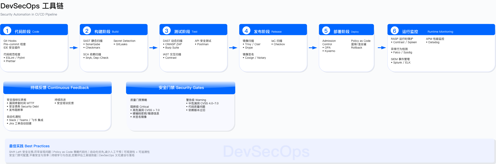
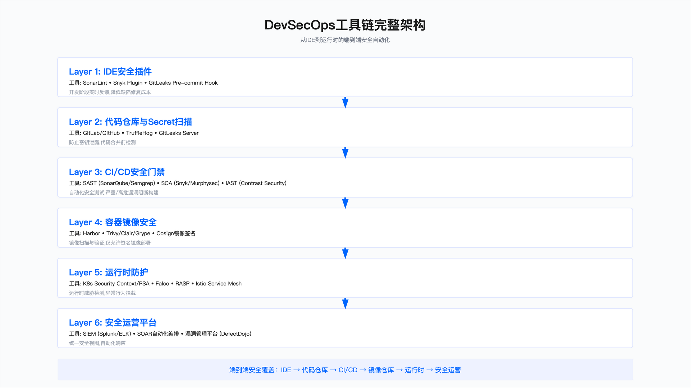
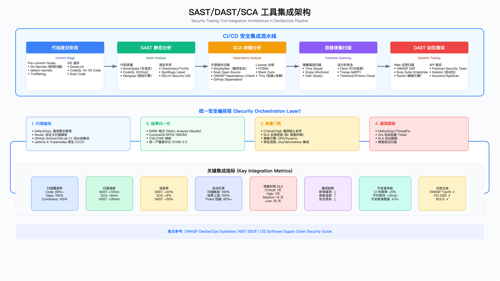

# 6.4 安全工程工具链

安全工程工具链的核心目标是将架构层面的安全控制点工程化落地，通过自动化手段实现从编码到运营各阶段的安全检测与防护。本节按照"输入—活动—产出—门禁—度量"结构组织，覆盖培训、设计评审、编码、测试、构建、发布、运营七个阶段，重点建设应用安全测试 (application security testing, AST) 与策略即代码 (policy as code) 能力。

工具链建设需要正视几个基本约束：工具本身不解决流程问题，误报治理是长期工程，性能开销与安全收益需要显式权衡，以及任何工具都存在适用边界。本节不追求工具全覆盖，而是聚焦于各阶段的核心控制点与验收标准。

---

## 工具链集成架构

安全工程工具链的设计遵循"左移优先、分层防御、自动化门禁"原则。下图展示了从编码到运营各阶段的工具集成架构：



工具链按阶段划分为五层：

编码阶段聚焦代码提交前的风险发现，包括 IDE 实时扫描（如 SonarLint、Semgrep）、SAST 白盒扫描（如 SonarQube、Checkmarx）、SCA 组件扫描（如 Trivy、Snyk、MurphySecurity/墨菲安全）以及密钥泄露检测（如 TruffleHog、GitLeaks）。该阶段的门禁原则是高危阻断合并，中低危纳入技术债跟踪。

测试阶段提供多维度安全验证，包括 DAST 黑盒扫描（如 OWASP ZAP、Burp Suite）、IAST 交互式扫描、API 安全测试以及移动端安全扫描。测试阶段的价值在于发现运行时才暴露的配置与逻辑漏洞。

构建阶段关注制品安全与供应链完整性，主要活动包括容器镜像扫描、镜像签名验证、SBOM 生成以及 IaC 配置扫描。构建阶段的输出——签名制品与 SBOM——是后续发布阶段准入控制的前置条件。

发布阶段通过 admission 控制实现策略强制执行，包括基于 OPA 或 Kyverno 的准入策略、签名验证、配置基线检查以及变更审批流程。

运营阶段提供持续监控与实时防护，包括周期性 DAST 扫描、攻击面管理 (attack surface management, ASM)、XDR 威胁检测、RASP 运行时保护以及容器运行时监控。


上图展示了安全测试的分层结构。底层的静态分析覆盖面广但精度有限，中层的动态测试验证运行时行为，顶层的交互式测试与运行时保护提供精准防护但部署成本较高。工具选型需要在覆盖面、精度与成本之间取得平衡。



*图：DevSecOps 工具链架构 - 展示从开发到运营各阶段的工具集成关系与数据流转*

---

## 6.4.1 应用安全培训

### 输入

安全培训的设计需要基于三类输入：角色画像（后端、前端、移动端、数据、运维、测试、架构、产品等）、历史缺陷画像（常见漏洞类型、易错模块、核心链路）以及年度目标（如漏测率、高危修复时效、SBOM 覆盖率等内部口径指标）。

### 活动

课程体系按层级组织：新员工必修课程涵盖安全意识、密码学基础、数据分级、基线制度与合规要求；年度必修课程聚焦 [OWASP Top 10:2025](https://owasp.org/Top10/2025/)、ASVS 4.0、API 与移动端安全、供应链安全（SCA/SBOM/签名）以及云与 Kubernetes 安全；岗位进阶课程则针对特定语言框架、API 设计安全、IaC 安全、CI/CD 安全与应急响应。

教学形式应兼顾效率与实操：微课控制在 15 分钟以内便于碎片化学习，每周一题保持安全意识，靶场实操提供动手机会，红蓝与桌面演练验证综合能力。

安全联络人（security champion）计划是培训体系落地的关键抓手：每个研发团队指定 1–2 名联络人，参与安全规则共创、设计评审与内部推广，通过季度评优与绩效挂钩建立正向激励。

### 产出

课程大纲与年度日历、题库与实验环境、学员画像与成长路径、security champion 名册与职责说明。

### 门禁

核心系统责任人需通过进阶认证方可担任上线审批人或例外审批人——这一约束将培训与权限直接挂钩，避免培训流于形式。

### 度量

培训效果的度量指标包括覆盖率、平均测评分、岗位进阶通过率、培训后缺陷占比变化、security champion 参与率、规则贡献数以及问题复发率。需要注意的是，这些指标的具体阈值应根据组织实际情况设定，避免为追求数字而牺牲培训质量。

### 适用边界与常见误区

培训体系适用于有一定规模的研发团队，对于外包团队或短期项目团队需要简化培训路径。常见误区包括：一是将培训等同于合规打卡，缺乏实操验证；二是培训内容与实际技术栈脱节，开发者无法直接应用；三是 security champion 机制缺乏激励或沦为额外负担。

验证培训有效性的方法包括：对比培训前后同类缺陷的发现率与复发率，抽样检查 security champion 实际参与评审的比例，以及通过靶场演练评估实操能力。

---

## 6.4.2 应用安全设计评审

### 输入

设计评审的输入包括 PRD/BRD、架构图与数据流图、数据分级与外联依赖清单、OpenAPI 或接口清单以及上线里程碑。

### 活动

轻量评审适用于大多数需求，检查点包括：数据分类与跨境约束、外联依赖（第三方服务与供应商）、认证鉴权与授权设计、日志与审计要求、误用与滥用场景、以及合规要求（如 GDPR、PCI DSS 等）。

威胁建模适用于高价值场景，触发条件包括：新核心业务、重大架构变更、涉及敏感数据的模块、支付与账户相关功能、以及跨境数据处理。方法上可采用 STRIDE、攻防树或用例驱动，输出缓解矩阵（控制措施—责任人—时限）。

安全需求即代码是将关键安全要求转化为可执行策略的实践，包括 Kubernetes admission 策略（Kyverno/OPA Gatekeeper）、IaC 扫描规则（Checkov/Terrascan）、API 网关策略以及 WAF 与限速策略，并将这些策略纳入 CI/CD 门禁。

### 产出

评审结论（通过、限条件通过、需补充材料、拒绝）、风险清单与缓解措施、门禁约束条目、审计证据。

### 门禁

未完成评审或未达成必需控制的需求不得进入开发或上线；涉及敏感数据或接口的需求须额外审批。

### 度量

评审覆盖率、评审 SLA 达成率、上线后返工率、问题复发率。

### 适用边界与常见误区

设计评审的适用边界需要根据变更影响范围动态调整：纯 UI 调整或配置变更可简化评审，而涉及数据流变化或外联依赖的变更必须完整评审。常见误区包括：一是评审沦为流程打卡而非实质性技术讨论；二是威胁建模范围过大导致无法聚焦关键风险；三是安全需求停留在文档层面而未转化为可执行策略。

验证评审有效性的方法包括：跟踪评审发现的风险是否在后续阶段得到缓解，分析上线后发现的漏洞中有多少本应在评审阶段识别。

---

## 6.4.3 编码阶段

编码阶段是安全左移的核心阵地，目标是在代码提交前发现并修复安全缺陷。

### 6.4.3.1 IDE 安全扫描

输入：IDE 插件与企业规则集（弱加密、危险函数、输入校验、敏感 API）。

活动：企业规则集应覆盖常见安全缺陷模式——弱加密算法（MD5、SHA-1、ECB、RC4）、危险函数（命令执行、反序列化）、输入校验缺失、敏感 API 误用。扫描结果应提供即时提示与替换建议（如 MD5 替换为 SHA-256、ECB 替换为 GCM、字符串拼接 SQL 替换为预编译语句），并提供代码片段修复示例。

产出：本地告警清单、修复 diff、提交前零高危确认。

门禁：提交前需确认无高危告警；重复被门禁拒绝的合并请求计入代码质量评分。

度量：IDE 规则命中率、提交前高危清零占比、平均修复时间、重复拒绝次数。

常见误区：IDE 扫描容易被开发者绕过（如禁用插件或忽略告警），需要与 CI 阶段扫描形成双重校验；规则集过于宽泛会导致告警疲劳，应聚焦高置信度规则。

### 6.4.3.2 SAST 白盒代码扫描

输入：代码库与语言配置、增量差异（MR/PR）。

活动：采用全量扫描与差异扫描结合的策略，按语言与框架维护规则集，通过模式白名单与 hash 基线进行误报抑制，支持多分支并行扫描。

产出：扫描报告、误报抑制与基线记录、阻断与工单 SLA。

门禁：高危阻断合并；中危告警并跟踪；达到阈值拒绝合并（例外需审批并附临时缓解措施）。

度量：扫描覆盖率、平均扫描时长、误报率、阻断率、修复时效、重复缺陷率。



#### SAST 调优实践

SAST 工具的误报率是制约其落地效果的关键因素。未经调优的 SAST 工具误报率往往较高，导致开发者疲于处理无效告警，进而降低工具采纳度。本小节提供系统化的调优方法。

建立基线阶段需要量化当前 SAST 工具表现并识别主要噪音来源。通过导出近期扫描结果并按规则分组统计，然后对高频告警进行抽样验证，可以识别出误报率较高的规则。典型的高噪音场景包括：测试代码中的字符串重复检测、非安全场景的伪随机数告警、DTO/Entity 类中的命名检查等。

禁用噪音规则阶段的原则是：对误报率明显偏高的规则进行禁用或设置白名单路径。以 SonarQube 为例，可通过配置文件指定特定规则在特定路径下不生效：

```properties
# SAST 误报抑制配置示例
sonar.issue.ignore.multicriteria=e1,e2,e3

# 禁用测试代码中的字符串重复检测
sonar.issue.ignore.multicriteria.e1.ruleKey=java:S1192
sonar.issue.ignore.multicriteria.e1.resourceKey=**/test/**/*.java

# 禁用非安全场景的伪随机数告警
sonar.issue.ignore.multicriteria.e2.ruleKey=java:S2245
sonar.issue.ignore.multicriteria.e2.resourceKey=**/test/**/*.java,**/simulation/**/*.java

# 排除第三方库代码
sonar.exclusions=**/vendor/**,**/node_modules/**,**/third_party/**
```

自定义规则开发阶段针对企业特定安全需求开发定制检测规则。例如，检测硬编码云服务凭证的规则可以基于凭证格式特征（如 AWS Access Key 的 `AKIA` 前缀）进行模式匹配。自定义规则应明确标注严重等级、CWE 映射以及修复建议。

建立白名单机制用于管理经审批的例外情况。白名单配置应包含必要的元数据：

```yaml
# 白名单条目须包含: 工单号、到期日期、责任人
whitelists:
  - rule_id: "java:S3329"
    file_pattern: "src/main/java/com/company/legacy/CryptoUtil.java"
    line_range: [42, 58]
    justification: "遗留系统使用 ECB 模式，重构计划已排期"
    ticket: "SEC-1247"
    approved_by: "security-lead@company.com"
    expiry_date: "2025-06-30"
```

持续度量与改进是 SAST 调优的长期工作。核心指标包括：误报率（通过抽样验证）、漏报率（通过渗透测试对比）、平均修复时间、规则覆盖 [OWASP Top 10:2025](https://owasp.org/Top10/2025/) 的程度、以及开发者修复率。这些指标应定期采集并通过看板可视化，驱动持续优化。

调优成熟度参考可对照 OWASP SAMM v2.1 的 security testing 实践域：Level 1 为引入工具并定期扫描；Level 2 为基于误报分析的规则调优；Level 3 为自定义规则开发与白名单管理；Level 4 为数据驱动的持续优化。

常见误区：一是期望工具开箱即用而忽视调优投入；二是过度禁用规则导致漏报风险；三是白名单缺乏到期清理机制导致技术债积累。

### 6.4.3.3 SCA 第三方组件风险扫描

输入：依赖清单与锁定文件、许可证策略。

活动：CVE 漏洞与许可证治理并重；维护替代组件清单与准入白名单；生成并归档 SBOM（SPDX 或 CycloneDX 格式）。

产出：SBOM、许可证合规报告、VEX（vulnerability exploitability exchange）、修复记录。

门禁：高危 CVE（如 CVSS 达到组织设定阈值）阻断入库；许可证违规拒绝；无 SBOM 拒绝。

度量：高危 CVE 清零率、许可证违规关闭时效、SBOM 覆盖率、VEX 回传时效。

常见误区：一是仅关注 CVE 评分而忽视实际可利用性；二是许可证合规检查滞后导致法律风险；三是 SBOM 生成后缺乏持续更新与消费。

### 6.4.3.4 敏感密钥扫描

输入：预提交钩子、CI 任务、企业特征字典（token/key/URL 模式）。

活动：预提交钩子与 CI 双重扫描形成纵深防御；维护企业专用的凭证模式字典；命中后触发自动吊销与轮换流程。

产出：命中与吊销/轮换记录、历史扫描与审计日志。

门禁：命中即阻断合并；无法吊销的情况进入应急流程。

度量：命中次数、平均吊销时间、复发率、历史泄漏消项率。

常见误区：一是仅依赖正则匹配而遗漏变体格式；二是吊销流程缺乏自动化导致窗口期过长；三是历史提交中的泄漏未被回溯清理。

---

## 6.4.4 测试阶段

测试阶段通过多维度验证发现编码阶段遗漏的安全缺陷，重点覆盖运行时才暴露的配置与逻辑漏洞。

### 6.4.4.1 DAST Web 黑盒漏洞扫描

输入：目标 URL 与环境、账户与角色、爬虫配置、登录保持策略。

活动：认证爬取确保覆盖登录后页面；差异扫描聚焦新增与变更路径；优先检测高危入侵点（注入、命令执行、认证绕过）。

产出：扫描报告、复测结论、阻断或例外记录、趋势图。

门禁：注入、命令执行、认证绕过类漏洞必须阻断；核心站点发布前需达到零高危。

度量：页面与接口覆盖率、误报率、扫描时长、阻断率、复测通过率。

常见误区：一是爬虫覆盖不足导致盲区；二是扫描账户权限过低遗漏授权相关漏洞；三是扫描频率过高影响测试环境稳定性。

### 6.4.4.2 移动端安全扫描

输入：APK/IPA 与符号表、服务端环境、MASVS 基线。

活动：静态分析检查加固与反调试、证书绑定、明文存储、隐私权限；动态分析验证通信安全、接口鉴权、WebView 与 JS 桥接风险。

产出：MASVS 对齐矩阵、静态与动态报告、加固与 pinning 证据、隐私权限审核结论。

门禁：明文敏感存储、未绑定证书、严重调试绕过必须阻断。

度量：MASVS 达标率、漏洞数量与等级、隐私违规关闭时效。

常见误区：一是仅做静态分析而忽视动态行为；二是测试环境与生产环境配置不一致；三是隐私权限审核流于形式。

### 6.4.4.3 API 接口安全扫描

输入：OpenAPI/GraphQL schema、鉴权配置（OAuth2/JWT/cookie）、速率限制策略。

活动：schema 驱动用例生成；带鉴权的 DAST 与 API fuzz；schema 一致性检查；逻辑滥用用例设计。

产出：OpenAPI/schema 文档、网关策略、鉴权与限速证据。

门禁：敏感接口必须具备鉴权与限速；schema 偏差需修正或走例外流程。

度量：鉴权覆盖率、schema 对齐率、逻辑漏洞比例、限速命中率。

常见误区：一是 schema 与实现不同步导致测试盲区；二是仅测试正向场景而忽视边界与异常；三是限速配置未考虑业务峰值。

### 6.4.4.4 IAST 交互式安全扫描

输入：被测环境、探针/agent 配置、典型业务流脚本。

活动：灰盒检测方式：注入探针，运行典型业务流，跟踪污点数据流，定位到代码行与调用栈。

产出：漏洞与代码关联、调用栈、真实可达性证据。

门禁：高危确认即阻断；性能开销需设预算与阈值（通过灰度评估）。

度量：定位精度、误报率、覆盖业务流数量、性能开销（P95 延迟变化）。

常见误区：一是探针部署覆盖不全导致检测盲区；二是业务流脚本未覆盖关键路径；三是性能预算设置过松影响用户体验。

---

## 6.4.5 构建阶段

构建阶段关注制品安全与供应链完整性，确保进入后续阶段的制品可信可追溯。

### 6.4.5.1 容器镜像扫描

输入：Dockerfile 与基础镜像策略、镜像仓库策略。

活动：维护基础镜像白名单并推行最小化原则；移除编译工具链与 shell 等非必要组件；执行 CVE 扫描；SBOM 随镜像产出并签名。

产出：镜像风险报告、签名与 SBOM 工件、替代基础镜像建议。

门禁：高危 CVE 达到阈值阻断；未签名或无 SBOM 禁止入库；admission 强制验签与基线检查。

度量：白名单采用率、CVE 清零率、签名覆盖率、SBOM 覆盖率。

常见误区：一是基础镜像更新滞后导致已知漏洞残留；二是多阶段构建未正确清理中间层；三是签名密钥管理不当导致信任链断裂。

---

## 6.4.6 发布阶段

发布阶段通过准入控制确保只有满足安全基线的制品才能进入生产环境。

### 6.4.6.1 运行前评估

输入：待发布制品、变更单、风险评估、回滚预案。

活动：发布前评估包括 CVE 状态、配置基线、Kubernetes 策略、签名验签；输出风险评分与放行建议；审批流程要求双人审批；采用金丝雀或蓝绿部署策略。

产出：发布审批记录、评估报告、回滚与复测记录。

门禁：无签名、未通过评估、无回滚预案的制品不得发布；核心业务须遵守变更冻结窗口。

度量：审批时效、发布失败回滚率、发布后高危缺陷数、变更事故率。

常见误区：一是审批流于形式而未实质检查；二是回滚预案未经演练验证；三是变更冻结窗口执行不严格。

---

## 6.4.7 运营阶段

运营阶段提供持续监控与实时防护，应对生产环境的动态风险。

### 6.4.7.1 Web 黑盒漏洞扫描（持续）

输入：全站 URL、登录策略、多角色账户、变更订阅。

活动：周期全量扫描与变更增量扫描结合；多角色登录态覆盖；输出差异报告；对关键路径设置更高扫描频率。

产出：漏洞报告与复测结论、趋势图。

门禁：在逃高危须清零（或记录例外并附缓解措施）；复测通过方可关闭。

度量：覆盖率、在逃高危趋势、复测通过率。

### 6.4.7.2 ASM 攻击面扫描

输入：域名、DNS 记录、证书透明度日志、云资产 API、外部情报。

活动：资产发现（域名、子域名、证书、云资产）、指纹识别、暴露面收敛；错误配置与过期证书闭环处理。

产出：资产台账、暴露面报告、关闭证明。

门禁：未备案资产、过期证书、弱配置必须整改；高危暴露面限时关闭。

度量：影子资产消除率、证书过期提前告警关闭时效、暴露面减少趋势。

### 6.4.7.3 XDR 威胁检测与响应

输入：EDR/XDR 代理、告警规则、白名单与基线。

活动：建立行为基线；检测容器逃逸、加密劫持等威胁；与 SOAR 剧本联动（隔离、封禁、吊销密钥、回滚）。

产出：告警案例、处置记录、根因分析与改进行动。

门禁：关键主机未部署代理或策略仅为"监测"模式的不允许上线。

度量：MTTD（平均检测时间）、MTTR（平均响应时间）、自动化处置覆盖率、误报与漏报率。

### 6.4.7.4 容器运行时扫描

输入：运行时策略、命名空间级别分级（生产、预发、开发）。

活动：阻断高危行为——执行 shell、写敏感目录、高危系统调用、可疑网络连接；按命名空间与工作负载分级策略。

产出：拦截日志、策略命中报告、例外审批记录（短期）。

门禁：生产命名空间强制阻断策略；例外需审批并设置到期自动恢复。

度量：策略命中率、误报率、例外按期消项率。

---

## 6.4.8 IaC 安全

### 输入

Terraform/CloudFormation/ARM 模板、Kubernetes YAML/Helm Chart、基线策略集（CIS Benchmark、Kyverno、OPA）。

### 活动

静态扫描针对基础设施代码执行合规检查，工具包括 Checkov、Terrascan、KubeLinter 等。

admission 强制通过 OPA Gatekeeper 或 Kyverno 实现准入控制，关键策略包括：非特权容器、只读根文件系统、资源限额、网络策略、镜像签名验签。

策略即代码的实践要点：策略存储于版本控制仓库；变更经过评审流程；支持灰度发布与回滚；策略须有单元测试（正向与反向用例）。

### 产出

扫描报告、阻断记录、策略库、合规证明。

### 门禁

不合规策略拒绝合并与部署；关键策略不可绕过。

### 度量

策略覆盖率、阻断率、误报率、策略变更评审通过率。

### 常见误区

一是策略过于严格导致正常业务受阻，需要设置合理的例外机制；二是策略缺乏版本管理导致回滚困难；三是策略单元测试覆盖不足导致误阻断。

---

## 6.4.9 运行时保护（RASP）

### 输入

目标系统与语言栈、性能预算、优先保护清单（高价值业务）。

### 活动

部署策略：高价值系统优先；按语言集成探针（Java、.NET、Node 等）；灰度发布逐步放量。

防护能力：注入、反序列化、命令执行、XXE、路径穿越、越权检测与阻断；采用告警→降级→阻断的阶梯策略。

性能管理：评估 TPS、延迟、CPU、内存影响；优化白名单与规则；遇性能异常自动降级为"告警"模式。

### 产出

实时防护日志、阻断证据、回放数据、性能评估报告。

### 门禁

生产启用仅限优先系统；阻断策略逐步从观测→告警→阻断演进；提供紧急回退机制。

### 度量

拦截次数、误报率、P95 延迟影响、对在野漏洞拦截有效性。

### 适用边界与常见误区

RASP 适用于无法快速修复漏洞但需要即时防护的场景，不适用于性能敏感的高频交易系统（需评估开销后决策）。常见误区包括：一是将 RASP 作为修复漏洞的替代而非补充；二是阻断策略过激导致业务中断；三是探针版本升级滞后导致兼容性问题。

验证 RASP 有效性的方法包括：使用已知漏洞 payload 进行验证测试，对比启用前后的攻击拦截率，监控误阻断导致的业务影响。

---

## 本节小结

本节构建了覆盖 SDL 全生命周期的安全工程工具链体系，从 IDE 到运行时形成自动化安全防护闭环。

工具链按阶段可归纳为：培训与评审提供人员能力与设计保障；编码阶段通过 IDE 扫描、SAST、SCA、密钥扫描实现左移；测试阶段通过 DAST、移动端扫描、API 测试、IAST 提供多维验证；构建与发布阶段通过容器扫描、制品签名、SBOM、admission 控制确保制品可信；运营阶段通过持续扫描、ASM、XDR、RASP、容器运行时监控提供持续防护。

工具链建设的关键约束包括：渐进式部署（观测→告警→阻断）降低业务风险；工具整合避免数据孤岛；性能平衡确保用户体验；误报治理是长期工程而非一次性任务。

运行指标的设定应基于组织实际情况，常见关注点包括：培训覆盖率与评审覆盖率、SBOM 覆盖率与签名覆盖率、提交前高危清零占比、MTTD 与 MTTR、变更事故率与回滚时长。具体阈值应根据基线数据逐步收紧，而非盲目设定。

---

## 导航

**[← 上一节：6.3 SDL 十项关键措施](./6.3_sdl_ten_key_practices.md)** | **[返回章节目录](./README.md)** | **[下一节：6.5 运营服务层 →](./6.5_appsec_operations_services.md)**

---

**© 2025 AI-ESA Project. Licensed under CC BY-NC-SA 4.0**

<!--
本节优化记录：
1. 新增图片：08_DevSecOps_Toolchain_Architecture_v6.png（DevSecOps 工具链架构）
2. 原有图片保留：04_DevSecOps_Toolchain_v6.png、05_Security_Testing_Pyramid_v6.png、11_SAST_DAST_SCA_Tool_Integration_v6.png
3. 文件已包含多处"常见误区"内容（6.4.1、6.4.2、6.4.3.1-6.4.3.4、6.4.4.1-6.4.4.4、6.4.5.1、6.4.6.1、6.4.8、6.4.9）
4. 文件已包含"适用边界与常见误区"章节
5. 未发现需要删除的无法核验数据
6. 无"下一节预告"需要删除
-->

