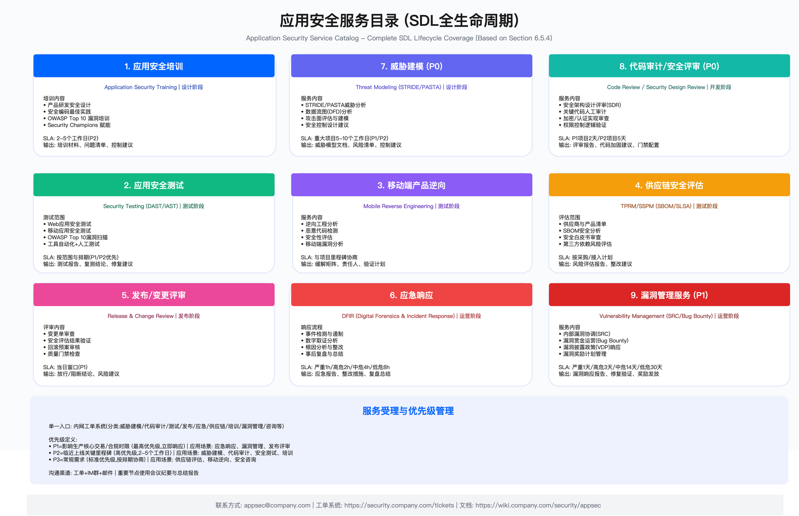

# 6.5 应用安全运营与服务交付

应用安全能力的持续交付需要依托运营体系支撑。本节系统阐述如何将安全能力以服务形式稳定输出，涵盖组织架构设计、资源规划、指标度量、服务目录定义、第三方认证管理、漏洞生命周期治理以及事件响应机制。这些要素共同构成可审计、可迭代的应用安全运营框架。

---

## 6.5.1 团队组织架构

### 组织层级设计

应用安全团队的组织设计通常采用三级结构：

**安全中心（一级）** 作为公司级安全治理主体，统筹安全战略、预算分配、法规响应与跨域协调。安全中心需与业务、技术、法务等职能建立常态化沟通机制。

**应用安全部（二级）** 作为安全中心下设的独立职能部门，承担应用层安全规划、架构设计、工程实施与日常运营。该层级直接向安全中心管理层汇报，并与安全架构、安全工程平台、安全合规等平级部门形成协同关系。

**专业小组（三级）** 根据技术领域与业务需求细分：

- **安全架构组**：负责应用安全顶层设计，包括安全标准制定、DevSecOps 工具与平台设计、威胁建模方法论、软件供应链安全策略等
- **安全测试组**：执行代码审计、渗透测试，运营 SAST / DAST / IAST 等工具
- **移动安全组**：保障 Android、iOS、H5 等端侧安全，涵盖应用加固、防破解、隐私合规
- **漏洞管理组**：负责 Web 与移动端漏洞的全生命周期管理

### 组织设计的关键约束

组织设计需平衡以下约束条件：

**业务节奏适配**：安全团队介入时机需与业务里程碑对齐。过早介入导致需求不稳定带来的返工，过晚介入则面临修复成本高企或被迫放行的困境。通常在需求立项、方案设计、上线前三个关键节点设置安全评审。

**全球化合规差异**：跨国企业需处理不同法域的合规要求差异。常见做法是海外团队聚焦策略制定与合规监督，中国团队聚焦能力建设与日常运营，形成"双轨协同"模式。

**资源约束下的覆盖策略**：安全人员编制有限时，需建立风险分级机制——高风险项目配置专职安全工程师，中风险项目采用工具自动化加抽检，低风险项目仅要求通过质量门禁。

### 全球化团队分工

对于跨国运营的组织，团队分工可参考以下模式：

**海外团队职责**（侧重策略与监督）：
- 与 GRC 协作制定全球适用的应用安全策略与标准
- 定期审查各区域安全实施情况，确保符合全球标准
- 跟踪前沿安全技术，评估其适用性
- 统筹第三方认证管理

**中国团队职责**（侧重建设与运营）：
- 主导 SDL 实施与 DevSecOps 集成
- 执行日常安全测试与漏洞修复管理
- 管理安全工具并提供技术支持与培训
- 负责端侧安全能力建设

### 治理流程与沟通节奏

运营治理需要建立分层的沟通机制：

- **季度**：安全风险治理委员会（由 GRC 牵头），议题包括战略调整、基线更新、资源审批与重大风险评审
- **月度**：安全运营会，进行指标复盘、专项推进状态同步与风险清单更新
- **周度**：项目与发布看板会，跟踪质量门禁状态、例外处理进展、容量与排期
- **日常**：通过工单系统建立单一受理入口，IM / 邮件 / 电话支撑实时沟通

### 常见误区

误区一：安全团队独立于业务流程之外。安全被视为"外部审批者"而非"内嵌参与者"时，容易演变为对立关系，导致业务团队想方设法绕过安全管控。有效做法是将安全目标纳入业务 OKR，使安全成为业务成功的组成部分而非阻碍。

误区二：忽视跨时区协作成本。全球化团队若缺乏明确的值守机制与交接流程，会导致响应延迟与信息丢失。Follow-the-Sun 模式需要配套双语文档、统一术语表以及知识库录播。

验证方法：组织架构有效性可通过以下方式验证——安全服务请求的平均响应时间、跨区域项目按计划完成率、业务团队满意度调研结果。

---

## 6.5.2 预算与资源规划

### 人员编制模型

人员编制需基于业务规模、发布频次与工具自动化水平综合测算。常见做法是建立"基础编制+项目弹性"模式：基础编制覆盖日常运营需求，重大项目或攻防演练期间可引入外部专业力量作为弹性补充。

编制测算的关键输入包括：受管理的应用数量与风险等级分布、CI / CD 流水线数量、年度发布频次、第三方认证与审计需求。

### 工具与平台预算

安全工具采购需评估以下维度：

- **功能覆盖**：能否满足当前及可预见的安全需求
- **集成成本**：与现有 CI / CD、工单系统、SIEM 的对接难度
- **合规适配**：数据驻留、审计日志等合规要求
- **运维负担**：部署模式（SaaS / 自托管）、升级频率、技术支持响应
- **扩展能力**：支撑业务增长的弹性

建立 TCO (Total Cost of Ownership) 模型，涵盖许可费、云资源、运维人力、培训投入，进行三年滚动预算规划。对关键能力（SAST / SCA / DAST、密钥扫描、SBOM 生成、RASP 等）按风险降低效果与效率提升设定投资优先级。

### 服务与外包

外部安全服务的使用场景包括：渗透测试、红队演练、漏洞赏金平台运营、第三方认证审计等。需设定年度基准预算与按需弹性预算，并与供应商签订绩效条款（SLA、交付里程碑），纳入供应商计分卡进行横向对比。

### 投入产出衡量

安全投资回报可通过以下维度量化：

- **风险减损**：基于 ALE (Annual Loss Expectancy) 模型估算安全控制带来的损失降低
- **效率提升**：自动化工具节约的人工工时
- **业务赋能**：获得认证后可进入的受监管市场带来的收入机会
- **审计效率**：内外部审计一次通过率提升带来的整改成本节约

### 适用边界与约束

适用场景：该预算模型适用于具备独立安全团队的中大型组织。初创企业或安全职能嵌入 IT 部门的组织需简化模型。

关键约束：安全预算通常占 IT 总预算的一定比例，但具体比例因行业、监管强度、风险偏好差异较大，不宜套用固定数字。预算制定需与业务增长规划、合规要求变化、安全事件历史记录综合考量。

---

## 6.5.3 OKR / KPI 指标体系

### 指标管理原则

有效的指标体系需遵循以下原则：

口径统一与数据可信：数据源需明确，采集过程尽可能自动化，避免人工统计带来的偏差。每个指标需指定 Owner，设定阈值分级（如红/黄/绿），建立定期复盘机制。

领先指标与滞后指标结合：既关注过程指标（如覆盖率、阻断率），也关注结果指标（如漏测率、事故率）。单纯追求过程指标可能导致"刷数据"而非真正提升安全水平。

分层看板：团队级、产品线级、平台级看板服务于不同决策场景。月度复盘关注趋势，季度校准调整目标。

### 核心指标分类

以下按指标类别说明关键度量项（具体阈值需根据组织实际情况设定，此处提供参考维度）：

**应用安全风险管理指标**

过程指标：
- 培训覆盖率：安全培训覆盖研发团队的比例
- 安全评审覆盖率：重大需求 / 项目纳入安全评审的占比
- 漏洞修复时间 (MTTR)：从发现到修复的平均时间，需按风险等级分层统计
- 质量门禁阻断率：CI / CD 质量门禁对严重 / 高危缺陷的阻断有效性
- 策略即代码覆盖率：核心策略通过 Policy as Code 自动执行的占比

结果指标：
- 漏测率：外部白帽或第三方发现的漏洞占总漏洞比例
- 事故损失率：安全事件造成的直接经济损失占比

**应用安全成熟度指标**

采用业界成熟度模型进行对标：
- SDL 成熟度：可采用 BSIMM 评分
- DevSecOps 成熟度：可采用 OWASP DSOMM
- 移动应用安全成熟度：可采用 OWASP MASVS
- 软件供应链安全成熟度：可采用 SLSA 等级

**风险与协同指标**

- 安全事件应急响应时效：按严重等级设定遏制时限
- 外部漏洞报告响应及时率：VDP / Bug Bounty 渠道的响应时效
- 重大安全违规事件数：作为底线指标监控

**团队与文化指标**

- 关键人才留存率
- 关键岗位满编率
- 业务团队对安全服务的满意度

### 数据源与看板

指标数据来源包括：
- 工具 / 平台 API：SAST / DAST / IAST / SCA / 镜像扫描、CI / CD、制品库、SIEM / XDR
- 工单系统：受理、派单、修复、复测、关闭与例外台账
- 可视化工具：Grafana / Looker / Power BI 等，需设置权限分层与下钻能力

### 常见误区

误区一：指标过多导致失焦。指标数量与可操作性呈反比，建议核心指标控制在 15-20 项以内，其余作为观察指标。

误区二：将指标作为考核唯一依据。纯指标驱动会诱导"应试行为"，如通过调整扫描规则降低告警数而非真正修复问题。指标需与定性评估结合使用。

---

## 6.5.4 应用安全服务

应用安全团队以服务形式向业务交付安全能力。服务目录化有助于明确交付边界、设定可预期的 SLA、建立质量标准。

### 服务受理机制

单一入口：通过内网工单系统统一受理，分类包括评审、测试、发布审核、应急响应、供应链评估、培训、认证支持、咨询等。

优先级定义：
- P1：影响生产核心交易或有合规时限要求
- P2：临近上线的关键里程碑
- P3：常规需求

沟通渠道：工单为主，IM 群辅助实时沟通，重要节点通过会议纪要与总结报告形成记录。

### 核心服务目录

**1. 应用安全培训**

为产品研发团队提供安全设计、安全编码、常见漏洞（如 OWASP Top 10）等培训。培训目标是提升研发人员在设计与编码阶段的安全意识与技能。

输入：培训需求、目标受众、技能差距评估结果
输出：培训材料、考核结果、能力提升跟踪
SLA：根据培训规模与形式协商

**2. 应用安全测试**

涵盖 Web 应用安全测试、移动应用安全测试等，通过工具自动化扫描与人工渗透测试相结合，识别潜在漏洞并提供修复建议。

输入：测试环境、测试账号、数据脱敏策略、测试范围说明
输出：测试报告、复测结论、修复验证记录
SLA：按范围与风险等级确定，P1/P2 需求优先排期

**3. 移动端产品逆向分析**

针对移动应用进行逆向工程分析，评估加固有效性，发现潜在安全风险。

服务内容：
- 逆向工程分析：APK / IPA 反编译、代码结构分析、加固方案评估
- 恶意行为检测：后门检测、隐私窃取行为分析、未授权功能排查
- 安全性评估：反调试机制验证、证书绑定检测、WebView 安全审查
- 基线对齐：MASVS L1 / L2 基线检查、组件漏洞扫描

输入：APK / IPA 安装包、符号表（可选）、重点关注范围
输出：逆向分析报告、风险缓解建议、验证计划
SLA：与项目里程碑协商确定

**4. 供应链安全评估**

针对第三方供应商与 SaaS 产品接入进行全生命周期安全评估。

评估范围：
- 供应商准入：背景调查、安全资质审查、合规证书验证
- SBOM 安全分析：组件漏洞扫描、许可证合规检查、依赖链风险评估
- 安全白皮书审查：架构设计评审、数据流分析、访问控制机制验证
- 持续监控：CVE 跟踪、供应商安全事件监控

输入：供应商清单、SBOM（SPDX / CycloneDX 格式）、安全白皮书、合规证明
输出：风险评估报告、整改建议、准入决策、持续监控计划
SLA：新供应商评估与年度复审周期需明确约定

**5. 发布 / 变更评审**

对生产环境变更进行安全评审，确保变更符合安全基线，具备回滚预案。

评审内容：
- 变更单审查：变更范围、影响分析、风险评估
- 安全评估结果验证：SAST / DAST / SCA 扫描结果、渗透测试结论
- 回滚预案审核：回滚脚本验证、数据备份确认、紧急联系人机制
- 质量门禁检查：制品签名、SBOM 完整性、镜像扫描结果

输入：变更单、评估报告、回滚预案、影响分析
输出：放行 / 阻断结论、风险建议、例外审批记录
SLA：紧急变更当日响应，标准变更按约定周期

**6. 应急响应 (DFIR)**

提供安全事件应急响应服务，覆盖检测、遏制、取证、修复、复盘全流程。

响应流程：
- 事件检测与分级：告警聚合、威胁情报关联、影响范围评估、严重等级判定
- 遏制与隔离：受影响系统隔离、账户冻结、密钥吊销、流量封禁
- 数字取证分析：日志采集与保全、流量分析、攻击路径还原
- 根因分析与整改：5 Whys 分析、漏洞修复、基线加固
- 事后复盘：时间线梳理、影响评估、改进行动项、知识库沉淀

SLA 按严重等级设定遏制与修复时限，需与集团制度对齐。

### 质量控制

- 报告模板统一：包含发现、影响、复现步骤、缓解措施、根因、证据、建议
- 同级审批与抽检机制
- 所有工单与报告归档至审计中心

### 适用边界

服务目录需根据组织规模与业务特点裁剪。小型团队可合并部分服务，大型组织可进一步细分。SLA 设定需平衡服务质量与资源约束，避免承诺无法兑现的时效。

---

## 6.5.5 第三方机构认证

### 认证类型与适用场景

不同认证适用于不同场景，选择时需考虑客户要求、市场准入、合规义务等因素：

治理与通用合规：ISO 27001（信息安全管理体系）、ISO 27701（隐私信息管理）、SOC 2 Type II (Service Organization Control)，常见于客户尽调场景。

应用与开发：ISO 27034（应用安全）、NIST SSDF 对齐声明、OWASP MASVS (Mobile Application Security Verification Standard)。

行业特定：PCI DSS (Payment Card Industry Data Security Standard)、HIPAA (Health Insurance Portability and Accountability Act)。

云与供应链：CSA STAR (Cloud Security Alliance Security, Trust, Assurance, and Risk)、SLSA 等级声明与 SBOM 披露机制。

### 认证实施方法

范围界定：明确认证覆盖的系统、数据、区域、供应商边界，以及证据清单与责任人。范围过大增加实施成本，范围过小则认证价值有限。

差距评估与整改：对照认证要求进行差距分析，形成整改行动项、时间线与负责人。

证据管理：策略与流程文档化，流水线自动产出证据（日志、SBOM、签名、门禁结果、审批记录）。避免手工收集证据带来的效率低下与完整性风险。

审计流程：内审 → 模拟审计 → 正式审计，形成闭环整改与复核机制。

持续维护：年度监督审计，重大变更触发滚动评估，保持证据新鲜度。

### 外部沟通与信任建立

客户尽调包：安全白皮书、控制矩阵映射（对应 ISO / SOC / SSDF 等框架）、第三方渗透报告摘要。

事件披露：对齐法规要求（如 GDPR 72 小时通知义务），建立标准化模板与 FAQ，法务与公关联动。

信任中心 (Trust Center)：对外公开证书、安全政策、可公开的度量指标与承诺。

### 运行指标

- 认证覆盖率：已获认证的系统 / 产品占比
- 不符合项数量与关闭时效
- 证据自动采集率
- 客户尽调通过率

### 常见误区

误区一：将认证等同于安全。认证证明满足特定时点的控制要求，不代表持续安全。认证通过后放松日常运营是常见问题。

误区二：为认证而认证。堆砌证书但缺乏实际能力支撑，在客户深度尽调或真实攻击面前会暴露问题。

---

## 6.5.6 漏洞管理与例外治理

### 漏洞生命周期流程

漏洞管理遵循七阶段闭环流程，确保从发现到修复的全程可追溯：

Discover（发现）：汇聚 AST 工具扫描、渗透测试、红队演练、SRC / 赏金平台、第三方通报、运营监测等渠道的发现，自动去重后进入工单系统。

Validate（验证）：安全工程师与业务 Owner 联调，复现漏洞、确认影响、排除误报。产出 PoC、日志、复现脚本作为证据。

Triage（分级）：综合 CVSS / EPSS 评分与业务暴露面进行风险评估，确定优先级，指定责任团队与 SLA。

Fix（修复）：制定修复方案，开发补丁或实施临时缓解（WAF 规则、Feature Flag 降级等）。

Verify（复核）：通过回归测试、自动化复测、重新扫描验证修复有效性。

Close（关闭）：审核证据、更新知识库、关闭工单。

Learn（复盘）：分析漏洞成因，更新策略 / 培训内容，治理遗留例外。

### 例外治理

无法按期修复的漏洞需进入例外流程：

- 例外申请需包含 5W2H 说明（为何无法修复、临时缓解措施、预计修复时间等）
- 临时缓解措施（WAF / 限速 / 降级）需经审批并记录
- 设定例外到期提醒，定期清理消项
- 例外数据纳入季度复盘，分析根因

### 公开漏洞披露与赏金运营

漏洞披露政策 (VDP)：面向外部研究员发布安全联系方式、PGP 公钥、披露条款与响应 SLA。

Bug Bounty 项目：按资产与风险设定奖励梯度，可通过公开平台（HackerOne、Bugcrowd 等）或自建 SRC 运营。

法律与激励保障：明确 Safe Harbor 条款，为善意报告者提供法律保护；设立感谢 / 证书 / 奖励机制。

流程协同：外部报告纳入统一的漏洞生命周期流程，修复后在 Trust Center 发布公告或申请 CVE。

### 运行指标

- 高危 / 严重漏洞清零率
- MTTR (Mean Time To Repair)（按风险等级分层）
- 漏测率（外部发现占比）
- 复发率
- 例外按期消项率

### 验证方法

- 定期红队演练验证漏洞修复有效性
- 复测脚本自动化执行
- 抽检已关闭漏洞确认未复发

---

## 6.5.7 事件响应与沟通

### 响应流程

事件响应遵循"检测 → 分级 → 遏制 → 根因分析 → 修复 → 恢复 → 复盘"的标准流程。

RACI 职责划分：
- 指挥官：统筹协调，决策升级
- 技术负责人：技术分析与修复
- 证据负责人：取证与保全
- 对外沟通：客户 / 监管 / 媒体沟通
- 法务 / 隐私：合规义务评估
- 客服 / 公关：用户沟通与舆情管理

工具支撑：SIEM / XDR / SOAR 实现检测与编排自动化，取证工具支撑证据采集，工单与通报平台保障流程可追溯。

### SLA 设定

遏制与修复时限需按严重等级分级设定，并与集团制度对齐。示例维度：

- 遏制时限：严重级别要求最短，低危级别允许较长时间
- 修复时限：同样按严重等级递增

具体数值需根据组织实际响应能力与业务容忍度设定。

### 对外沟通

法规要求：部分法域有强制通知时限（如 GDPR 要求 72 小时内向监管机构通报），需提前准备通知模板与流程。

证据保全：可追溯日志、取证链、修复与验证记录需完整保留，支撑后续调查与合规证明。

### 运行指标

- MTTD (Mean Time To Detect)（平均检测时间）
- MTTR (Mean Time To Repair)（平均修复时间）
- 自动化处置率
- 误报率 / 漏报率
- 演练达标率
- 同类事故不重复发生率

---

## 6.5.8 威胁情报与攻防协同

### 情报来源整合

建立多源情报池，整合内部告警、SRC 报告、红蓝演练发现、供应商情报订阅、开源社区（OWASP、CISA KEV、MITRE ATT&CK 等）。情报需经验证后转化为可操作的规则或策略。

### TTP 映射与优先级

将情报映射至 MITRE ATT&CK、OWASP Top 10 / API Top 10 等框架，结合业务暴露度与 EPSS 评分确定优先响应顺序。避免"情报过载"——并非所有情报都需要立即响应，需建立筛选与优先级机制。

### 攻防联动机制

- 红队 / 紫队演练：定期模拟攻击，验证检测与响应能力
- 持续漏洞挖掘：Continuous PenTest 模式
- 蓝队规则调优：基于演练与实战持续优化 SIEM / XDR 检测规则
- 季度复盘：攻防计划执行情况、发现问题、改进措施

### 情报驱动治理

情报落地路径：情报 → 验证 → 规则 / 策略（WAF、RASP、网关、终端）→ CI / CD 质量门禁 → 运行时防护。情报转化为策略的过程需记录在审计中心。

### 运行指标

- 情报转化为规则 / 策略的时效 (TTM)
- 红蓝演练高危场景覆盖率
- 情报命中后恶意事件下降趋势
- 外部情报渠道有效性评估（贡献度、信噪比）

---

## 本节小结

本节构建了应用安全运营与服务交付的系统框架，核心要点包括：

组织架构：三级结构（安全中心 → 应用安全部 → 专业小组）配合分层治理机制，全球化团队采用双轨协同模式。

资源规划：基于业务规模与风险水平的人员编制模型，工具采购需进行 TCO 分析与优先级排序。

指标体系：覆盖风险管理、成熟度、协同、团队四个维度，遵循口径统一、领先滞后结合、分层看板的原则。

服务交付：六大核心服务（培训、测试、逆向、供应链、发布审核、应急响应）目录化，配套优先级分级与 SLA 承诺。

合规认证：差距评估→整改→内审→正式审计的闭环流程，证据自动采集降低维护成本。

漏洞管理：七阶段生命周期流程，配套例外治理与公开披露机制。

事件响应：RACI 职责明确，SLA 分级设定，对外沟通对齐法规要求。

威胁情报：多源整合、TTP 映射、攻防联动、情报驱动策略更新的闭环机制。

运营体系的有效性最终体现在：安全服务可预期交付、漏洞得到及时修复、事件得到有效响应、安全能力持续提升。

---

## 导航

**[← 上一节：6.4 安全工程工具链](./6.4_security_engineering_toolchain.md)** | **[返回章节目录](./README.md)** | **[→ 下一节：6.6 团队建设与能力发展](./6.6_team_capability_development.md)**

---

**© 2025 AI-ESA Project. Licensed under CC BY-NC-SA 4.0**

