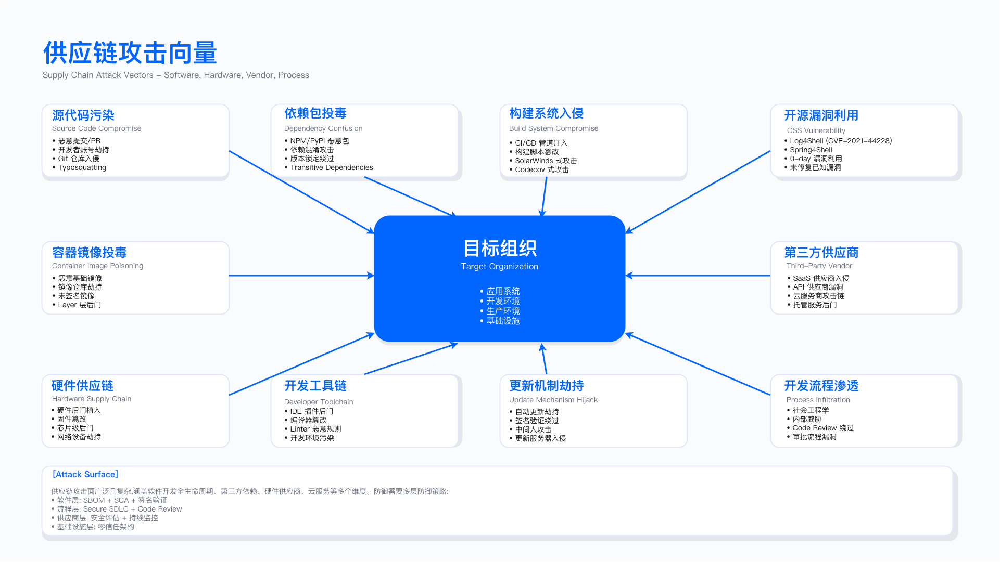
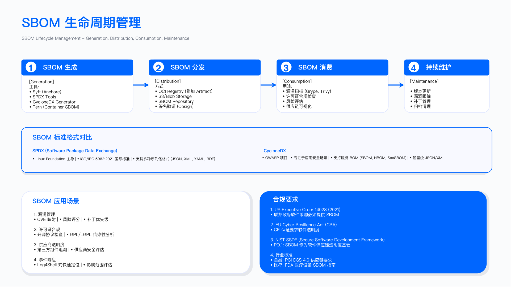
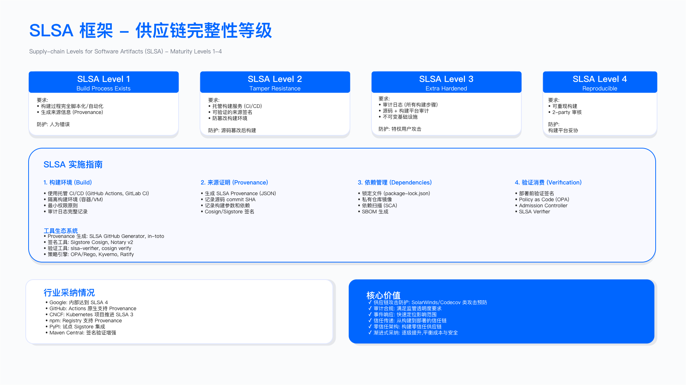
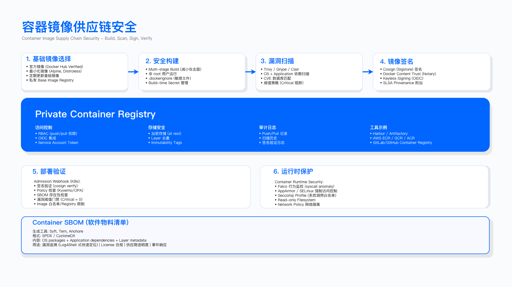

# 第七章 执行摘要

## 供应链安全的战略定位

供应链安全已从边缘议题演变为需要 C 级管理层关注的核心企业风险。现代软件系统的构成方式——开源组件、第三方供应商、CI/CD 流水线、容器镜像仓库、硬件供应商——使得任何一个环节的失陷都可能影响整个系统链条。本章的目标是为安全团队提供一套可操作的供应链安全治理框架，涵盖战略规划、技术控制与运营机制三个层面。

### 供应链风险的结构性成因

当前供应链安全形势严峻的根本原因在于三个结构性变化的叠加效应。

**软件构成方式的根本转变**。现代应用程序的代码库中，开源组件占比已成为主体。这意味着企业对外部代码的依赖程度远超自研代码。然而，多数组织对所依赖组件的可见性严重不足：无法准确回答"系统中有哪些组件"以及"这些组件是否存在已知漏洞"这两个基本问题。云原生架构进一步扩大了这一依赖范围——每个容器镜像都包含数十乃至上百个软件包，基础镜像、Helm Chart、Operator 均构成新的供应链依赖点。

**攻击面的结构性扩张**。攻击者已将目标从网络边界转向供应链上游。攻击供应链的效费比显著优于直接攻击目标系统：入侵一个被广泛使用的组件，即可同时影响数千个下游消费者。这种"攻击一点、渗透全面"的力量倍增效应，使得供应链成为高级威胁行为体的优选路径。Log4Shell 漏洞事件是这一趋势的典型例证——单一组件漏洞波及的应用系统范围之广、修复周期之长，暴露了整个软件生态系统对供应链风险的脆弱性。

**监管环境的快速收紧**。美国行政命令 14028 要求联邦软件采购必须提供软件物料清单（SBOM）。欧盟《网络弹性法案》（Cyber Resilience Act）对在欧盟销售的产品规定了安全设计义务和漏洞披露要求。NIST SSDF（安全软件开发框架）和 SLSA 框架逐渐成为行业基准。这些监管要求正在从"建议遵循"转变为"合同强制"——不满足 SBOM 要求的供应商可能丧失参与采购的资格。

### 供应链入侵的业务后果

供应链安全事件的影响覆盖运营、财务、声誉、合规与战略五个维度。

在**运营层面**，供应链入侵的恢复周期显著长于传统安全事件。以 SolarWinds 事件为例，受影响组织的完整恢复耗时以"月"计而非"周"计，原因在于：必须首先确定哪些系统可能被入侵，然后逐一验证系统完整性，最后重建信任链。这一过程远比修补单个漏洞复杂。

在**财务层面**，供应链泄露的成本结构有别于传统数据泄露：除直接响应成本外，还包括供应商审计、系统重建、以及因运营中断造成的收入损失。大型供应链事件的修复成本可达数千万美元量级。

在**声誉层面**，供应链事件对客户信任的损害往往更深——因为它暴露的是组织的"供应商管理能力"而非"技术防护能力"。客户会质疑：如果连供应商都无法管控，如何能保护我的数据？

在**合规层面**，GDPR、PIPL 等隐私法规对数据控制者施加了供应商管理义务。供应链安全事件可能触发监管调查和处罚。

在**战略层面**，供应链攻击已成为国家级威胁行为体的常用战术。对关键基础设施运营商和涉及敏感数据处理的组织而言，供应链安全已上升为国家安全议题。

---

## 本章目标与范围

本章旨在提供端到端的软件供应链安全框架，使读者能够：

### 建立战略框架

- 理解供应链威胁的攻击分类与演进趋势
- 构建基于成熟度的演进路线图，从被动响应走向主动防御
- 将供应链安全目标与组织风险承受能力对齐

### 掌握技术控制

- 实施 SBOM 生成、存储与漏洞关联分析
- 通过签名验证与 SLSA 合规加固 CI/CD 流水线
- 建立容器镜像供应链的扫描、签名与准入控制
- 将零信任原则应用于供应商和第三方组件管理

### 构建运营能力

- 建立持续监控与供应链威胁情报能力
- 开发供应链入侵场景的事件响应手册
- 与现有 GRC、SOC 和漏洞管理流程集成

### 满足合规要求

- 达成 NIST SSDF、SLSA 和各类监管 SBOM 要求
- 应对美国 EO 14028、欧盟网络弹性法案等法规
- 建立可审计的合规验证证据链

---

## 核心概念与框架

### 供应链攻击分类

供应链攻击可从六个维度进行分类，每个维度对应不同的控制重点。源代码层面的威胁包括恶意提交和内部威胁，典型场景是开发者账户被入侵后向代码库注入后门。构建系统层面的威胁针对 CI/CD 基础设施，SolarWinds 事件即属此类。依赖项层面的威胁包括有漏洞或恶意的第三方包，Log4Shell 和 Codecov 事件属于此类。分发渠道层面的威胁包括注册表投毒和更新劫持，NPM 拼写错误攻击（typosquatting）是典型手法。部署层面的威胁针对容器镜像篡改，包括恶意基础镜像的植入。运行时层面的威胁指在系统部署后通过供应链路径建立持久化后门。

这一分类的实践意义在于：安全团队应针对每个维度建立相应的检测与防护控制，而非仅关注其中一两个环节。

### 供应链安全成熟度模型

供应链安全能力建设可划分为四个阶段。

**被动响应阶段**的特征是临时性扫描、手动生成 SBOM、缺乏系统化流程。处于此阶段的组织应优先建立组件清单基线。

**管理规范阶段**的特征是自动化软件成分分析（SCA）、策略执行机制。此阶段的重点是流程标准化和工具集成。

**主动防御阶段**的特征是持续监控能力、达成 SLSA Level 2 以上认证。此阶段强调安全左移，将控制点嵌入开发流程。

**持续优化阶段**的特征是具备预测分析能力、实现零信任供应链架构。此阶段的组织通常处于行业领先位置。

组织应根据自身风险状况和资源约束确定目标成熟度等级。并非所有组织都需要达到最高等级——成本效益比应纳入决策考量。

### 组织架构设计

供应链安全的有效实施需要明确的职责分工。**GRC 团队**（或供应链安全职能）负责中心化治理和战略协调，统筹安全风险管理委员会的相关议题。**应用安全团队**负责 SBOM 生成、SCA 工具集成、安全 CI/CD 流水线建设。**第三方风险管理职能**负责供应商评估和持续监控。**SOC**负责供应链威胁情报整合和事件响应。

这一分工的关键约束是：供应链安全涉及多个职能领域，缺乏明确的责任边界将导致"三不管地带"——每个团队都认为是其他团队的职责。

---

## 关键技术控制

### SBOM：供应链可见性的基石

软件物料清单（SBOM）是供应链透明性的基础设施。SBOM 的核心价值体现在四个方面：**可见性**——回答"软件中包含什么"这一基本问题；**漏洞管理**——当新 CVE 发布时快速定位受影响系统；**许可证合规**——跟踪开源许可证义务，规避法律风险；**监管合规**——满足 NTIA 最小元素和 EO 14028 等监管要求。

SBOM 的生命周期包括五个阶段：生成（在构建环节自动产出）、存储（纳入制品注册表）、富化（关联 CVE 漏洞库）、分析（威胁评估）、响应（补丁推送）。

**适用边界**：SBOM 对于依赖外部组件的应用系统价值最高；对于纯自研、无外部依赖的系统（如果存在的话），SBOM 的价值有限。

**关键约束**：SBOM 的生成工具和格式选择需考虑与下游消费系统的兼容性。SPDX 是 ISO 标准，适合合规与法务场景；CycloneDX 安全聚焦，支持 VEX（漏洞可利用性交换），适合漏洞管理场景。

**常见误区**：将 SBOM 视为合规勾选项而非运营工具——生成后束之高阁，未与漏洞管理流程集成；仅在发布阶段生成 SBOM，未覆盖开发和测试环境。

**验证方法**：模拟 CVE 发布场景，测量从 CVE 公开到完成受影响系统识别的时间；检验 SBOM 与实际部署组件的一致性（通过容器运行时检测验证）。

**运行指标**：SBOM 覆盖率（具有最新 SBOM 的生产应用占比）；CVE 响应时间（从 CVE 发布到完成影响分析的时长）。

### CI/CD 流水线安全与 SLSA 框架

SLSA（Supply-chain Levels for Software Artifacts）框架提供了构建完整性的分级标准。

SLSA 等级的核心要求如下：**Level 1** 要求存在构建溯源记录，提供基本可追溯性；**Level 2** 要求签名溯源和托管构建环境，实现防篡改；**Level 3** 要求加固构建环境且溯源不可伪造，提供强完整性保证；**Level 4** 要求双方审查和密封构建，提供最高安全保证。

**适用边界**：SLSA 主要适用于有外部分发需求的软件制品（提供给客户或开源社区）；对于纯内部使用的工具脚本，SLSA 认证的投入产出比可能不合理。

**关键约束**：SLSA 等级越高，实施成本和流程复杂度越高。Level 3 和 Level 4 需要对构建基础设施进行重大改造，包括运行器隔离、密钥管理、审计日志等。组织应根据制品的风险暴露程度选择目标等级。

**常见误区**：将 SLSA 等同于"签名即安全"——仅部署签名机制但未加固构建环境；忽视构建依赖的完整性（构建脚本本身也可能被篡改）。

**验证方法**：红队演练模拟构建环境入侵，测试溯源记录的防篡改能力；验证签名验证机制的强制执行（尝试部署未签名制品）。

**运行指标**：签名合规率（具有验证签名的制品占比）；SLSA 采用率（达到目标 SLSA 等级的关键系统占比）。

流水线加固的关键控制点包括：不可变构建环境（使用临时运行器）；所有制品加密签名（推荐 Sigstore/Cosign）；溯源证明生成与验证；依赖项固定和哈希验证；密钥管理规范（禁止硬编码凭证）；全量构建活动审计日志。

### 容器供应链安全

容器环境扩大了供应链攻击面。主要威胁包括：被植入后门的"官方"基础镜像；应用层引入的有漏洞依赖项；镜像仓库入侵导致的镜像替换；缺乏构建溯源跟踪。

**防御策略**需要分层部署。**可信注册表**层面，使用带访问控制的私有镜像仓库，限制可拉取镜像的来源。**镜像扫描**层面，部署多层扫描工具（如 Trivy、Clair、Snyk），覆盖操作系统层和应用层漏洞。**签名验证**层面，实施镜像签名（Cosign、Notary、Docker Content Trust）并在准入环节强制验证。**基础镜像管理**层面，优先使用最小化镜像（Distroless、scratch、加固版 Alpine），减少攻击面。**运行时保护**层面，部署准入控制器（OPA、Kyverno），在部署前执行安全策略检查。

**适用边界**：上述控制适用于生产环境容器工作负载；对于开发环境，可根据风险承受能力适当放宽部分控制。

**关键约束**：镜像扫描的有效性取决于漏洞库的更新频率；签名验证机制需要与镜像仓库和编排平台集成，存在兼容性限制。

**常见误区**：仅在镜像构建时扫描，未实施持续扫描（镜像构建后新发现的漏洞无法被检出）；允许直接从公共仓库拉取镜像，绕过私有仓库的控制。

**验证方法**：尝试部署未签名镜像，验证准入控制的阻断能力；故意引入已知漏洞镜像，验证扫描检出率。

**运行指标**：镜像漏洞密度（每镜像高危漏洞数）；漏洞修复周期（从检出到镜像更新的时长）；准入策略拒绝率。

### 供应商与第三方安全管理

第三方风险管理应基于风险分级实施差异化控制。**关键级供应商**（访问生产数据或核心系统）应要求提供 SOC 2 Type II 报告、年度渗透测试结果和 SBOM 披露。**高风险级供应商**（有限生产访问或处理个人信息）应要求 SOC 2 报告和漏洞披露计划。**中风险级供应商**（非生产访问、低数据敏感性）应完成安全问卷评估。**低风险级供应商**（无系统访问、仅面向公众）可采用供应商自认证方式。

**持续监控机制**应包括：安全评分跟踪（通过 BitSight、SecurityScorecard 等平台）；自动化漏洞通知订阅；合同 SLA 履行监控；事件披露要求执行。

**常见误区**：仅在供应商准入阶段进行评估，缺乏持续监控；忽视"第四方风险"——供应商的供应商。

---

## 纵深防御策略

供应链安全控制应按预防、检测、响应三道防线组织。

**预防性控制**包括：组件白名单和审批工作流；安全编码标准和开发者培训；制品签名和验证强制要求。

**检测性控制**包括：持续漏洞扫描（SCA 工具集成）；构建过程异常检测；供应链威胁情报订阅。

**响应性控制**包括：供应链入侵事件响应手册；快速补丁和回滚程序；与受影响方的沟通协议。

三道防线的设计原则是：假设预防控制可能失效，必须具备检测能力；假设检测可能存在盲区或延迟，必须具备响应能力。

---

## 合规框架映射

供应链安全相关的主要监管要求包括：

**美国 EO 14028**：要求联邦采购提供 SBOM 和安全开发证明，适用于联邦承包商和 SaaS 提供商。

**欧盟网络弹性法案**：规定安全设计义务、漏洞披露要求和产品终身支持责任，适用于在欧盟销售的产品。

**NIST SSDF**：定义安全开发实践的四个组（PW、PS、PO、RV），可作为所有组织的基线参考。

**ISO 27036**：供应商安全评估和合同控制的国际标准，适用于全球化企业。

**SLSA**：构建完整性等级标准，虽为自愿遵循但逐渐成为采购要求。

---

## 实施成功要素

### 高管支持

供应链安全需要董事会级别的风险可见性。这要求：将供应链风险纳入企业风险登记册；争取专项预算和资源；建立与业务成果挂钩的指标体系（如平均补丁时间、SBOM 覆盖率）。

### 跨职能协作

供应链安全的有效实施依赖多团队协作。应用安全与工程团队协作将 SBOM 生成集成到 CI/CD。第三方风险管理与采购团队协作将安全要求嵌入供应商选择流程。SOC 与威胁情报团队协作监控供应链威胁。法务与 GRC 团队协作确保合同义务和合规要求的落实。

### 自动化优先

供应链安全不能依赖大规模手动流程。应投资 SBOM 管理平台（如 Dependency-Track）；将 SCA 工具集成到开发者 IDE（实现安全左移）；自动化漏洞响应工作流。

### 开发者赋能

安全控制的有效性取决于开发者的配合程度。应提供安全默认配置和黄金路径；开展供应链威胁的针对性培训；建立清晰的安全例外升级路径；表彰安全冠军的贡献。

---

## 常见陷阱

供应链安全实施中需规避以下常见陷阱：

**SBOM 作为勾选项**：生成 SBOM 后未与漏洞管理流程集成，无法发挥运营价值。

**工具泛滥**：部署多个功能重叠的 SCA 工具，缺乏统一的结果聚合和优先级排序，导致告警分散和资源浪费。

**供应商盲点**：关注直接供应商，忽视"第四方风险"——供应商的供应商出现安全问题同样会影响组织。

**告警疲劳**：用大量低优先级漏洞告警淹没开发团队，导致真正重要的告警被忽略。

**合规导向**：仅满足最低监管要求，缺乏战略性安全改进，实际风险敞口未得到有效控制。

**孤立所有权**：应用安全、第三方风险管理和 SOC 之间缺乏明确责任分工，导致问题在职能边界"落空"。

---

## 度量体系

### 领先指标（预防性）

- **SBOM 覆盖率**：具有最新 SBOM 的生产应用百分比
- **组件批准率**：来自批准来源的依赖项百分比
- **签名合规率**：具有验证签名的制品百分比
- **SLSA 采用率**：达到目标 SLSA 等级的关键系统百分比

### 滞后指标（检测性）

- **平均补丁时间（MTTP）**：CVE 披露到生产补丁完成的平均天数
- **漏洞密度**：每千个组件的已知漏洞数
- **供应商事件数**：第三方供应链安全事件计数
- **审计发现数**：与供应链相关的合规审计发现

### 业务成果

- **风险降低**：供应链入侵的可能性和影响降低程度
- **运营效率**：通过 SBOM 自动化实现的漏洞响应效率提升
- **监管就绪度**：通过相关合规审计的能力
- **竞争定位**：供应链安全能力在客户采购流程中的差异化价值

---

## 后续章节导引

本章为后续各节提供了战略框架和概念基础。**7.1 节**展开供应链安全战略与成熟度模型。**7.2 节**通过典型攻击案例分析攻击模式与防御策略。**7.3 节**深入 SBOM 实施与开源治理。**7.4 节**聚焦 CI/CD 流水线安全控制。**7.5 节**专门讨论容器镜像供应链。**7.6 节**覆盖供应商与第三方安全管理。**7.7 节**涉及硬件供应链安全。**7.8 节**建立检测与响应机制。**7.9 节**完成合规框架映射。**7.10 节**提供实施案例参考。

---

**下一节**：[7.1 软件供应链安全战略](7.1_software_supply_chain_strategy.md)

---

## 导航

**[← 返回章节目录](./README.md)** | **[返回 Part 2](../)** | **[返回总目录](../../)** | **[→ 下一节：7.1 软件供应链安全战略](./7.1_software_supply_chain_strategy.md)**

---

**© 2025 AI-ESA Project. Licensed under CC BY-NC-SA 4.0**

