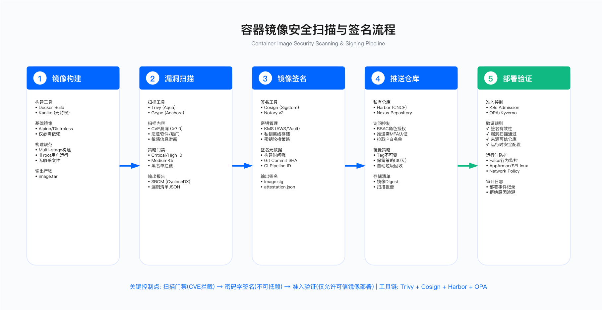

# 7.5 容器镜像供应链安全

## 概述

容器镜像已成为现代应用交付的标准载体，但其分层结构与依赖机制也引入了新的供应链风险。与传统软件包不同，容器镜像的供应链攻击面覆盖四个阶段：基础镜像选择、构建过程、镜像仓库存储、以及运行时部署。每个阶段的控制失效都可能导致恶意代码进入生产环境。

本节聚焦容器供应链的端到端安全实践，从基础镜像选型、安全构建规范、镜像扫描策略，到仓库治理与运行时准入控制。需要说明的是，容器安全是一个涉及面广泛的领域，本节重点讨论供应链视角下的镜像安全，运行时安全的完整内容请参阅第 5 章 云安全架构中的容器安全部分。

---

## 7.5.1 容器供应链威胁态势

### 攻击向量分析

容器供应链的攻击面可分为四个阶段，每个阶段存在不同的威胁类型：

阶段一：上游基础镜像。攻击者通过在公共镜像仓库发布包含恶意代码的基础镜像，或在合法镜像中植入后门。由于开发者常常直接拉取公共镜像而不做验证，这类攻击的影响范围可能极广。另一种常见情况是使用包含已知漏洞的过时依赖，虽非恶意但同样构成风险。

阶段二：构建过程。Dockerfile 注入、构建脚本篡改、镜像层污染是主要威胁。攻击者可能在 CI/CD 流水线中注入恶意指令，或利用构建环境的凭证泄露获取更高权限。密钥意外打包进镜像是另一个常见问题，不属于主动攻击但后果同样严重。

阶段三：镜像仓库。中间人攻击、账户劫持、标签替换是仓库层面的典型威胁。攻击者若获得仓库写入权限，可将恶意镜像推送到可信标签下，下游用户在不知情的情况下拉取并部署。标签的可变性（mutable tag）使这类攻击难以追溯。

阶段四：运行时部署。即使镜像本身安全，运行时的容器逃逸、特权升级、资源滥用仍可能导致安全事件。准入控制缺失意味着不合规镜像可以直接进入生产环境。


### 典型事件参考

以下事件说明了容器供应链攻击的现实威胁，供安全团队在制定策略时参考：

恶意镜像分发：公共镜像仓库曾多次发现包含加密货币挖矿程序的镜像，这些镜像通过与热门项目相似的名称吸引下载。防御要点在于镜像签名验证与来源可信度审查。

镜像劫持尝试：部分流行基础镜像曾遭遇账户接管或供应链入侵尝试。内容信任机制（Content Trust）可在一定程度上缓解此类风险，但需要上游维护者的配合。

仓库数据泄露：镜像仓库的用户凭证泄露可能导致私有镜像被窃取或篡改。多因素认证与访问审计是基本控制措施。

标签可变性风险：使用 `latest` 或其他可变标签意味着同一标签可能在不同时间指向不同内容。攻击者可利用这一特性进行标签替换攻击。使用镜像摘要（digest）替代标签是应对方法。

---

## 7.5.2 基础镜像选择策略

### 选型决策框架

基础镜像的选择直接决定了容器的攻击面大小。选型时需权衡以下因素：镜像体积与攻击面的关系、维护更新的及时性、调试便利性与生产安全性的取舍、以及特定运行时的兼容性要求。

Distroless 镜像（如 Google Distroless、Chainguard Images）仅包含应用运行所需的最小依赖，不含包管理器、Shell 及常用 GNU 工具。这类镜像的攻击面相对较小，适合生产环境部署。但调试困难是其固有限制——没有 Shell 意味着无法直接进入容器排查问题，需要通过日志、监控或 debug sidecar 等方式进行故障诊断。

Alpine 镜像基于 musl libc，体积较小，包管理器 apk 可用于安装调试工具。适合需要在体积与可调试性之间取得平衡的场景。但需注意 musl 与 glibc 的兼容性问题，部分依赖 glibc 特性的应用可能出现异常行为。

标准发行版镜像（如 Ubuntu、Debian）体积较大，包含更多预装组件，相应的漏洞数量也更多。一般不推荐直接用于生产环境，但在开发、测试阶段或需要特定系统工具的场景下仍有其价值。

Scratch 镜像是一个空镜像，适合静态编译的二进制文件（如 Go、Rust 编译产物）。由于不包含任何运行时依赖，需要应用自身完全静态链接，并在必要时手动复制 CA 证书等文件。

### 适用边界与约束

选择 Distroless 或 Scratch 镜像时需考虑以下约束：

- 调试能力：没有 Shell 的镜像无法使用 `kubectl exec` 进入容器，故障排查依赖外部日志与监控体系的完善程度
- 动态依赖：部分语言运行时（如 Python 的某些 C 扩展）需要特定系统库，Distroless 镜像可能无法满足
- 安全更新延迟：依赖上游维护者的更新节奏，若上游响应慢则可能暴露于已知漏洞
- 构建复杂度：多阶段构建增加 Dockerfile 复杂度，团队需要具备相应的容器化经验

### 常见误区

误区一：体积小等于安全。镜像体积与安全性存在相关性但非因果关系。真正影响安全性的是组件数量、已知漏洞数量及是否及时更新。一个体积小但长期未更新的镜像可能比体积大但维护良好的镜像更危险。

误区二：使用官方镜像即可信任。"官方"标签仅表示由项目维护者发布，不代表经过安全审计。官方镜像同样可能包含已知漏洞或配置问题，仍需纳入扫描流程。

### 构建示例

以下展示使用 Distroless 镜像的多阶段构建模式：

```dockerfile
# 构建阶段：使用包含完整工具链的镜像
FROM golang:1.21-alpine AS builder
WORKDIR /build
COPY go.mod go.sum ./
RUN go mod download
COPY . .
RUN CGO_ENABLED=0 GOOS=linux GOARCH=amd64 \
    go build -ldflags="-s -w" -o app .

# 运行时阶段：使用最小化镜像
FROM gcr.io/distroless/static-debian12:nonroot
COPY --from=builder /build/app /app
USER nonroot:nonroot
ENTRYPOINT ["/app"]
```

该模式的关键点：构建阶段使用功能完整的镜像以支持编译，运行时阶段仅包含编译产物；使用非 root 用户运行以限制权限；静态编译避免运行时动态链接依赖。

---

## 7.5.3 安全构建实践

### 多阶段构建

多阶段构建是容器安全构建的核心实践，其目的是将构建环境与运行时环境分离。构建阶段可以包含编译器、测试工具、密钥等敏感内容，而运行时镜像仅包含最终制品。

关键控制点包括：

- 构建阶段的依赖下载与运行时阶段分离，避免构建工具进入生产镜像
- 仅复制必要的制品文件，而非整个目录
- 在运行时阶段重新设置文件权限，避免继承构建阶段的宽松权限
- 使用 `--chown` 参数在 COPY 时直接设置所有者，而非后续 chown 命令

### Dockerfile 安全检查要点

以下是 Dockerfile 编写的安全检查清单，按优先级排列：

强制要求：
1. 使用特定版本标签而非 `latest`，确保构建可重复
2. 使用非 root 用户运行容器进程
3. 不在镜像中硬编码密钥、密码等敏感信息
4. 使用 `.dockerignore` 排除敏感文件（如 `.env`、私钥文件）

推荐实践：
5. 清理包管理器缓存以减小镜像体积
6. 合并 RUN 指令以减少层数
7. 使用 HEALTHCHECK 指令定义健康检查
8. 使用 exec 形式（JSON 数组）的 ENTRYPOINT/CMD 以正确处理信号

运行时加固（需配合 Kubernetes 配置）：
9. 设置只读根文件系统（`readOnlyRootFilesystem: true`）
10. 删除所有 Linux capabilities（`drop: [ALL]`）
11. 禁止特权模式（`privileged: false`）

### .dockerignore 配置

正确配置 `.dockerignore` 可防止敏感文件被意外打包进镜像：

```dockerignore
# 版本控制
.git
.gitignore

# CI/CD 配置
.github
.gitlab-ci.yml

# 环境与密钥文件
.env
.env.*
*.key
*.pem
secrets/

# 开发与测试
node_modules
__pycache__
test/
coverage/

# IDE 配置
.vscode/
.idea/
```

### 验证方法

- 静态分析：使用 hadolint 对 Dockerfile 进行 lint 检查，识别不安全配置
- 构建验证：在 CI 流水线中加入 Dockerfile 安全检查步骤，违规则阻断构建
- 镜像分析：使用 dive 等工具检查镜像各层内容，确认无敏感文件泄露
- 秘密扫描：在镜像构建后运行密钥扫描工具，检测意外打包的凭证

---

## 7.5.4 容器镜像扫描策略

### 扫描工具选型

镜像扫描工具的核心能力包括：操作系统包漏洞检测、应用依赖漏洞检测、配置问题检测、密钥泄露检测。不同工具在这些能力上各有侧重。

选型时需考虑以下维度：

- 漏洞数据库覆盖：是否覆盖目标操作系统与编程语言生态
- 扫描准确性：误报率与漏报率的平衡
- CI/CD 集成：是否支持主流 CI 平台，能否以非交互方式运行
- 输出格式：是否支持 SARIF、JSON 等标准格式以便与其他系统集成
- 更新频率：漏洞数据库的更新及时性



### 扫描集成实践

镜像扫描应在多个阶段执行：

开发阶段：开发者本地运行扫描，在提交前发现问题。此阶段以提醒为主，不强制阻断。

CI 构建阶段：每次构建后自动扫描新镜像。根据漏洞严重程度设置质量门禁——存在 CRITICAL 级别漏洞时阻断推送。

镜像仓库阶段：配置仓库在镜像推送时自动触发扫描，扫描完成前镜像处于隔离状态。

定期扫描：已部署镜像的漏洞状态会随新漏洞披露而变化，需定期重新扫描生产环境运行的镜像。

### 扫描策略示例（CI/CD 集成）

以下是 GitHub Actions 中的镜像扫描配置示例：

```yaml
name: Container Security Scan

on:
  push:
    branches: [main, develop]
  schedule:
    - cron: '0 2 * * *'  # 每日定时扫描

jobs:
  scan:
    runs-on: ubuntu-latest
    steps:
      - uses: actions/checkout@v4

      - name: Build image
        run: docker build -t ${{ env.IMAGE_NAME }}:${{ github.sha }} .

      - name: Vulnerability scan
        uses: aquasecurity/trivy-action@master
        with:
          image-ref: '${{ env.IMAGE_NAME }}:${{ github.sha }}'
          format: 'sarif'
          output: 'trivy-results.sarif'
          severity: 'CRITICAL,HIGH'

      - name: Secret scan
        uses: aquasecurity/trivy-action@master
        with:
          image-ref: '${{ env.IMAGE_NAME }}:${{ github.sha }}'
          scanners: 'secret'
          exit-code: '1'  # 发现密钥则失败

      - name: Generate SBOM
        uses: aquasecurity/trivy-action@master
        with:
          image-ref: '${{ env.IMAGE_NAME }}:${{ github.sha }}'
          format: 'cyclonedx'
          output: 'sbom.json'
```

### 常见误区

误区一：扫描通过即安全。扫描工具只能检测已知漏洞，零日漏洞与逻辑缺陷无法通过扫描发现。扫描是必要但不充分的控制措施。

误区二：仅关注 CRITICAL 漏洞。攻击链常由多个中低危漏洞组合构成。应建立分级处理机制，而非完全忽略低危漏洞。

误区三：扫描一次即可。漏洞数据库持续更新，昨天安全的镜像今天可能被披露存在高危漏洞。持续扫描机制是必要的。

### 运行指标

- 扫描覆盖率：纳入扫描的镜像数量 / 总镜像数量
- 漏洞发现到修复时间：从扫描发现漏洞到修复完成的平均时间
- 阻断率：因安全问题被阻断的构建占比
- 误报率：经人工确认为误报的告警占比

---

## 7.5.5 镜像仓库安全

### 私有仓库治理

企业环境应部署私有镜像仓库，作为镜像分发的可信源。私有仓库的安全配置包括以下方面：

访问控制：基于角色的访问控制，区分推送与拉取权限；生产项目启用更严格的审批流程；服务账号权限最小化。

传输安全：强制 HTTPS，禁用不安全的 HTTP 访问；配置有效的 TLS 证书。

扫描集成：配置推送时自动触发漏洞扫描；可选择阻止包含高危漏洞的镜像被拉取。

不可变标签：对生产镜像启用标签不可变性（immutable tags），防止标签指向被篡改；版本标签（如 `v1.0.0`）一旦推送不可覆盖。

保留策略：配置镜像保留策略，自动清理过期镜像以控制存储成本与攻击面。

审计日志：记录所有推送、拉取、删除操作，支持安全事件追溯。

### 内容信任机制

镜像签名用于验证镜像来源的真实性与完整性。当前主流方案包括：

Docker Content Trust (DCT)：基于 Notary 的签名机制，Docker 原生支持。启用后，Docker 客户端仅拉取已签名镜像。局限在于采用率较低，许多公共镜像未签名。

Cosign/Sigstore：CNCF 项目，支持无密钥签名（keyless signing），与 OIDC 集成。签名存储在 OCI 制品仓库中，可与 SBOM、SLSA 证明等元数据关联。适合与 CI/CD 流水线集成。

签名验证时机：可在镜像仓库层面配置签名验证，也可在 Kubernetes 准入控制阶段验证。后者提供更强的最后防线保障。

### 验证方法

- 渗透测试：对仓库进行安全测试，验证访问控制与传输安全配置
- 配置审计：定期检查仓库安全配置是否符合基线
- 签名验证测试：尝试部署未签名镜像，验证准入控制是否生效

---

## 7.5.6 运行时准入控制

### 准入控制的必要性

即使在构建与仓库阶段实施了安全控制，仍需要在部署阶段设置最后一道防线。准入控制器（Admission Controller）在 Pod 创建时执行策略检查，阻止不合规工作负载进入集群。

准入控制的典型策略包括：

- 镜像来源限制：仅允许来自可信仓库的镜像
- 标签/摘要要求：禁止使用 `latest` 标签，要求使用镜像摘要
- 签名验证：验证镜像已由可信身份签名
- 漏洞状态检查：检查镜像扫描结果，阻止包含高危漏洞的镜像
- 安全上下文要求：强制非 root 运行、只读根文件系统、capabilities 限制等

### 策略引擎选择

Kubernetes 生态中主流的策略引擎包括 Kyverno 与 OPA Gatekeeper：

Kyverno 使用 Kubernetes 原生的 YAML 声明式语法定义策略，学习曲线较平缓。原生支持镜像签名验证（集成 Sigstore），适合已熟悉 Kubernetes 的团队。

OPA Gatekeeper 使用 Rego 语言定义策略，表达能力更强但学习成本更高。适合需要复杂策略逻辑或已在其他场景使用 OPA 的团队。

两者均支持审计模式（仅记录违规）与强制模式（阻断违规），建议在生产环境推广前先在审计模式下运行验证策略效果。

### 策略示例（Kyverno）

以下是常见安全基线策略的 Kyverno 实现：

```yaml
apiVersion: kyverno.io/v1
kind: ClusterPolicy
metadata:
  name: image-security-baseline
spec:
  validationFailureAction: Enforce
  background: true
  rules:
    # 禁止使用 latest 标签
    - name: disallow-latest-tag
      match:
        any:
        - resources:
            kinds: ["Pod"]
      validate:
        message: "禁止使用 latest 标签，请使用特定版本或摘要"
        pattern:
          spec:
            containers:
            - image: "!*:latest"

    # 限制镜像来源
    - name: restrict-registries
      match:
        any:
        - resources:
            kinds: ["Pod"]
      validate:
        message: "镜像必须来自可信仓库"
        pattern:
          spec:
            containers:
            - image: "harbor.example.com/* | gcr.io/distroless/*"

    # 要求非 root 运行
    - name: require-non-root
      match:
        any:
        - resources:
            kinds: ["Pod"]
      validate:
        message: "容器必须以非 root 用户运行"
        pattern:
          spec:
            securityContext:
              runAsNonRoot: true
```

### 镜像签名验证策略

Kyverno 原生支持 Cosign 签名验证：

```yaml
apiVersion: kyverno.io/v1
kind: ClusterPolicy
metadata:
  name: verify-image-signatures
spec:
  validationFailureAction: Enforce
  rules:
    - name: verify-cosign-signature
      match:
        any:
        - resources:
            kinds: ["Pod"]
      verifyImages:
        - imageReferences:
          - "harbor.example.com/production/*"
          attestors:
          - entries:
            - keyless:
                subject: "https://github.com/myorg/*"
                issuer: "https://token.actions.githubusercontent.com"
                rekor:
                  url: https://rekor.sigstore.dev
```

### 验证方法

- 策略测试：使用 `kubectl apply --dry-run` 或策略引擎的测试功能验证策略行为
- 红队测试：尝试部署不合规镜像，验证策略是否正确阻断
- 审计日志分析：分析准入控制器的审计日志，识别潜在的策略绕过尝试

### 常见误区

误区一：准入控制可替代其他控制。准入控制是最后防线，不应作为唯一控制。若仅依赖准入控制，意味着问题到部署阶段才被发现，修复成本更高。

误区二：一刀切的强制模式。直接在生产环境启用强制模式可能导致大规模部署失败。应先在审计模式下运行，分析影响范围后再逐步强制。

---

## 7.5.7 实施检查清单

以下检查清单可用于评估容器供应链安全的实施状态：

### 基础镜像管理

- 建立基础镜像选型标准，明确可接受的镜像类型
- 禁止直接使用 `latest` 标签，要求使用特定版本或摘要
- 定期更新基础镜像以获取安全补丁

### 构建安全

- 采用多阶段构建分离构建与运行时环境
- 使用非 root 用户运行容器进程
- 配置 `.dockerignore` 排除敏感文件
- 在 CI 流水线中集成 Dockerfile lint 检查

### 镜像扫描

- 在 CI 构建阶段执行漏洞扫描
- 根据漏洞严重程度设置质量门禁
- 执行密钥扫描检测意外泄露的凭证
- 为每个镜像生成 SBOM

### 仓库治理

- 部署私有镜像仓库并配置访问控制
- 启用推送时自动扫描
- 对生产镜像启用不可变标签
- 配置镜像保留策略

### 运行时控制

- 部署准入控制器（Kyverno 或 Gatekeeper）
- 配置镜像来源限制策略
- 实施签名验证（如适用）
- 强制安全上下文要求（非 root、只读文件系统、capabilities 限制）

### 持续运营

- 定期扫描已部署镜像以发现新披露的漏洞
- 建立漏洞响应流程与 SLA
- 监控准入控制器的拒绝事件

---

## 小结

容器镜像供应链安全需要在四个阶段建立控制：基础镜像选择决定了初始攻击面；安全构建实践避免在构建过程中引入风险；镜像扫描发现已知漏洞与配置问题；运行时准入控制作为最后防线阻止不合规镜像进入生产环境。

单一阶段的控制失效不应导致全链路失守，这是纵深防御原则在容器供应链中的体现。同时需要认识到，这些控制措施都有其局限性——扫描无法发现未知漏洞，签名无法证明镜像不含恶意代码，准入控制无法阻止已授权镜像中的问题。持续的安全运营与快速响应能力是必要的补充。

---

*相关内容：[7.4 CI/CD 供应链安全](7.4_cicd_supply_chain_security.md) | [7.6 供应商与第三方安全管理](7.6_vendor_third_party_security.md) | [7.8 供应链风险检测与响应](7.8_supply_chain_risk_detection.md)*

---

**© 2025 AI-ESA Project. Licensed under CC BY-NC-SA 4.0**

