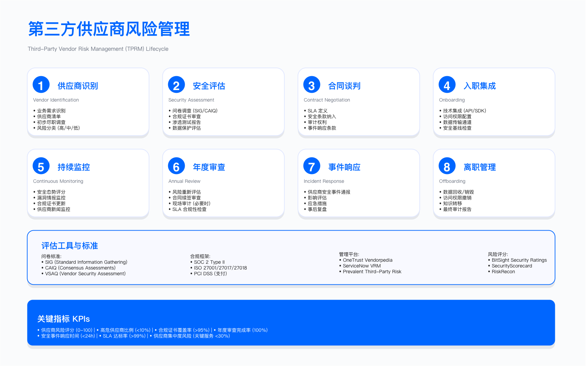
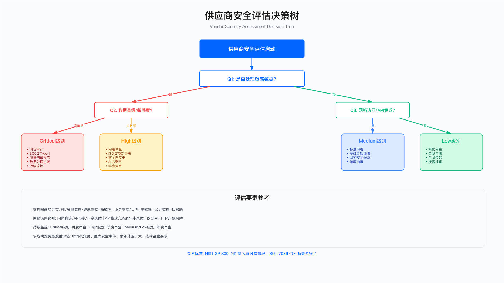

# 7.6 供应商与第三方安全管理

## 概述

第三方供应商访问企业敏感数据、关键系统和业务流程，构成了扩展的攻击面。近年来的重大安全事件表明，攻击者越来越多地将目标转向供应链中的薄弱环节：通过入侵供应商系统获取对目标企业的访问权限，或利用供应商的特权访问实施横向渗透。

第三方风险管理（Third-Party Risk Management，TPRM）的核心挑战在于：企业对外部供应商的安全控制能力有限，但需要为其引入的风险承担责任。本节提供从供应商准入、持续监控到退出的全生命周期管理框架，重点阐述风险分类方法、评估控制设计与合同约束机制。

**适用边界**：本节内容适用于具有第三方业务关系的企业，特别是涉及数据共享、系统集成或外包服务的场景。对于仅有简单采购关系（如办公用品供应商）且无数据 / 系统访问的情形，可适用简化评估流程。

**关键约束**：

- 评估资源有限，需根据风险等级匹配评估深度
- 供应商配合度参差不齐，部分供应商可能拒绝提供详细安全信息
- 合同谈判周期影响安全条款落地

---

## 7.6.1 第三方风险分类与评估

### 风险分类框架

供应商风险评估需从多个维度综合考量。单一维度的评估容易遗漏关键风险因素，而过于复杂的评估体系又会增加运营负担。实践中，以下四个核心维度构成风险分类的基础：

**数据敏感度**：供应商可访问的数据类型决定了泄露后果的严重程度。访问个人身份信息（Personally Identifiable Information，PII）、财务数据或知识产权的供应商，应归入高风险类别。仅处理公开运营数据的供应商，风险等级相对较低。

**系统访问权限**：拥有 VPN 访问、特权账户或直接 API 集成的供应商，其访问路径可被攻击者利用作为进入企业内网的跳板。只读访问与写入权限的风险差异显著。

**业务关键性**：供应商服务中断对业务连续性的影响程度。核心业务流程依赖的供应商需要更严格的安全保障和应急预案。

**地理与合规风险**：供应商所在司法管辖区的数据保护法规、政治稳定性及跨境数据传输限制。



### 风险评分模型

风险评分模型将上述维度量化，产出综合风险等级。以下示例代码展示了一种可参考的评分逻辑，企业应根据自身风险偏好调整权重配置：

```python
#!/usr/bin/env python3
"""
第三方供应商风险评分系统示例
"""

from dataclasses import dataclass
from enum import Enum
from typing import Optional

class RiskLevel(Enum):
    LOW = "Low"
    MEDIUM = "Medium"
    HIGH = "High"
    CRITICAL = "Critical"

class DataSensitivity(Enum):
    PUBLIC = 1
    INTERNAL = 2
    CONFIDENTIAL = 3
    RESTRICTED = 4
    HIGHLY_RESTRICTED = 5

class SystemAccess(Enum):
    NONE = 0
    READ_ONLY = 1
    LIMITED_WRITE = 2
    API_INTEGRATION = 3
    VPN_ACCESS = 4
    PRIVILEGED_ACCESS = 5

class BusinessCriticality(Enum):
    NON_CRITICAL = 1
    MODERATE = 2
    IMPORTANT = 3
    CRITICAL = 4
    MISSION_CRITICAL = 5

@dataclass
class VendorRiskProfile:
    """供应商风险画像"""
    vendor_name: str
    vendor_type: str  # Cloud, SaaS, Outsourcing, Hardware, Services

    # 风险维度评分
    data_sensitivity: DataSensitivity
    system_access: SystemAccess
    business_criticality: BusinessCriticality
    geographic_risk: int  # 1-5
    security_maturity: int  # 1-5，基于认证与评估结果
    external_security_rating: Optional[int] = None  # 外部评分平台评分 (0-100)

    # 权重配置（企业可自定义）
    WEIGHTS = {
        'data_sensitivity': 0.25,
        'system_access': 0.20,
        'business_criticality': 0.20,
        'geographic_risk': 0.10,
        'security_maturity': 0.15,
        'external_rating': 0.10
    }

    def calculate_risk_score(self) -> float:
        """计算综合风险评分 (1-5)"""
        score = (
            self.data_sensitivity.value * self.WEIGHTS['data_sensitivity'] +
            self.system_access.value * self.WEIGHTS['system_access'] +
            self.business_criticality.value * self.WEIGHTS['business_criticality'] +
            self.geographic_risk * self.WEIGHTS['geographic_risk'] +
            (6 - self.security_maturity) * self.WEIGHTS['security_maturity']
        )

        if self.external_security_rating is not None:
            external_score = 5 - (self.external_security_rating / 25)
            score += external_score * self.WEIGHTS['external_rating']

        return round(score, 2)

    def get_risk_level(self) -> RiskLevel:
        """获取风险等级"""
        score = self.calculate_risk_score()

        if score >= 4.0:
            return RiskLevel.CRITICAL
        elif score >= 3.0:
            return RiskLevel.HIGH
        elif score >= 2.0:
            return RiskLevel.MEDIUM
        else:
            return RiskLevel.LOW
```

**常见误区**：

1. 过度依赖单一评分来源：仅依赖外部安全评分平台（如 SecurityScorecard、BitSight）而忽视内部评估。外部评分基于公开可观测指标，无法反映供应商内部控制的实际有效性。
2. 评估时点固化：仅在供应商准入时进行评估，忽视供应商安全态势的动态变化。供应商可能在合作期间发生安全事件、人员变动或架构调整。

**验证方法**：

- 对高风险供应商要求提供第三方审计报告（SOC 2 Type II、ISO 27001 认证）
- 核验认证证书的有效期和审计范围是否覆盖所提供的服务
- 定期复核外部安全评分变化趋势

**运行指标**：

- 供应商风险分布：按风险等级统计供应商数量占比
- 高风险供应商覆盖率：完成深度评估的高风险供应商比例
- 评估逾期率：超出复评周期未完成评估的供应商比例

### 第三方风险评估工具对比

市场上存在多种第三方风险管理工具，各有侧重。选型时需根据企业规模、供应商数量和预算进行评估：

| 工具类型 | 代表产品 | 核心能力 | 适用场景 | 局限性 |
|---------|---------|---------|---------|--------|
| 外部安全评分 | SecurityScorecard、BitSight、RiskRecon | 基于公开数据的持续监控、风险评分趋势、行业对标 | 大规模供应商组合的持续监控 | 仅反映外部可观测指标，无法评估内部控制 |
| 问卷评估平台 | OneTrust、ProcessUnity、Prevalent | 标准化问卷模板、证据收集、工作流自动化 | 结构化的准入评估流程 | 依赖供应商自报告，需配合证据验证 |
| GRC 集成平台 | ServiceNow VRM、Archer | 与企业 GRC 体系集成、统一风险视图 | 已部署 GRC 平台的大型企业 | 实施复杂度高，成本较高 |
| 威胁情报集成 | Recorded Future、Mandiant | 供应商相关的威胁情报、暗网监控 | 补充动态威胁视角 | 需与其他工具配合使用 |

**工具选型建议**：中小企业可从外部安全评分工具起步，成本相对较低且可快速获得供应商安全态势概览；大型企业建议组合使用评分平台与问卷评估平台，实现持续监控与深度评估的互补。

---

## 7.6.2 供应商生命周期管理

供应商安全管理贯穿从选择到退出的完整生命周期。每个阶段都需要明确的安全控制点和验收标准。

### 阶段一：识别与选择

业务需求驱动供应商选择，安全团队需在早期介入评估。识别阶段的核心任务包括：

- 明确业务需求和服务范围，确定数据访问需求
- 评估供应商对业务连续性的影响程度
- 初步调研供应商背景（财务稳定性、行业声誉、历史安全事件）
- 查询外部安全评分，筛除明显高风险供应商
- 根据风险分类模型确定评估深度

**约束条件**：业务紧迫性可能压缩评估时间，安全团队需在评估深度与业务时效性之间权衡。对于紧急业务需求，可采用分阶段评估策略：先完成关键风险点评估以支持决策，后续补充完整评估。

### 阶段二：评估与尽职调查



评估深度应与风险等级匹配。高风险供应商需要综合性评估（问卷 + 证据验证 + 现场审计），低风险供应商可采用轻量化问卷。

**安全评估问卷核心领域**：

| 领域 | 关键问题 | 验证方式 |
|------|---------|---------|
| 信息安全治理 | 安全政策、专职安全团队、安全认证 | 政策文档、组织架构、证书副本 |
| 访问控制 | RBAC / 最小权限、MFA 实施、离职撤权流程 | 访问管理系统截图、流程文档 |
| 数据保护 | 传输 / 静态加密、数据删除流程、数据驻留位置 | 技术架构文档、加密配置证明 |
| 漏洞管理 | 扫描频率、渗透测试周期、修复 SLA | 最近扫描报告、渗透测试摘要 |
| 事件响应 | 事件响应计划、通知时效、演练频率 | 事件响应手册、演练记录 |
| 业务连续性 | RTO / RPO 指标、灾难恢复测试频率 | 灾难恢复测试报告 |
| 供应链安全 | 下游供应商评估、SBOM 提供能力 | 供应商管理政策、SBOM 样例 |

评估结果分为三类：批准、有条件批准（需整改）、拒绝。有条件批准需明确整改项和验收标准，整改完成前不得进入生产环境。

### 阶段三：上线与集成

供应商通过评估后，上线阶段需完成访问配置、监控部署和数据映射。

**访问配置原则**：

- 遵循最小权限原则，仅授予完成工作所需的最低权限
- 高风险供应商强制 MFA，配置较短的会话超时
- 创建专用账户组，便于批量管理和审计

**数据与监控配置**：

- 标记供应商可访问的资源，建立数据访问映射
- 启用详细的访问日志记录
- 配置异常访问告警（非工作时间访问、批量数据导出等）

上线阶段应产出上线报告，记录访问配置、监控设置和待完成事项（安全培训、协议签署等）。

### 阶段四：持续监控

初始评估反映的是供应商在评估时点的安全状态，持续监控才能捕捉动态风险变化。

**监控维度**：

- 外部安全评分变化（设置评分下降阈值告警）
- CVE 数据库中与供应商产品相关的漏洞
- 安全相关新闻与威胁情报（数据泄露、勒索攻击等）
- 合规认证状态（证书过期、审计发现）

**复评周期**：

| 风险等级 | 复评周期 | 持续监控 |
|---------|---------|---------|
| Critical | 每年 | 必需 |
| High | 18 个月 | 推荐 |
| Medium | 2 年 | 可选 |
| Low | 3 年 | 不要求 |

**常见误区**：

1. 监控覆盖不全：仅监控头部供应商，忽视长尾供应商。攻击者可能选择防护较弱的小供应商作为突破口。
2. 告警疲劳：监控阈值设置不当导致大量低价值告警，真正的风险信号被淹没。

### 阶段五：退出与交接

供应商关系终止时，需确保访问完全撤销、数据安全处置。退出不当可能导致残留访问被利用，或企业数据在供应商处长期留存。

**退出检查要点**：

**访问撤销**：撤销所有系统账户（VPN、云平台、SaaS 应用、数据库），收回物理访问权限和硬件设备，吊销 API 密钥和访问令牌。

**数据处置**：要求供应商删除所有企业数据（包括备份），获取数据删除证明，验证数据返还的完整性。

**知识转移**：完成文档交接，归档供应商相关记录，转移运维职责。

**验证方法**：退出后 30 天内监控是否存在来自原供应商 IP 或账户的访问尝试，验证访问日志中无残留集成。

---

## 7.6.3 第三方安全合同条款

合同是约束供应商安全责任的法律工具。安全条款的设计需平衡保护力度与合同可谈判性。

### 核心安全条款

**数据保护条款**：

明确供应商的数据处理义务：仅按客户指示处理数据，实施与数据分类等级相应的保护措施。规定加密要求（传输中 TLS 1.2 以上、静态数据 AES-256），数据驻留限制，以及合同终止后的数据删除时限和证明要求。

**安全控制要求**：

规定访问控制基线（MFA、最小权限、定期访问审查、离职当天撤权），安全监控要求（7x24 监控、日志留存期限、日志访问配合义务）。

**漏洞管理条款**：

明确漏洞修复时限要求。典型 SLA：Critical 漏洞 24 小时内修复，High 漏洞 7 天，Medium 漏洞 30 天，Low 漏洞 90 天。要求供应商定期进行第三方渗透测试并共享报告摘要，允许客户在提前通知后进行渗透测试。

**事件通知条款**：

规定安全事件通知时限。数据泄露和系统入侵通常要求 24 小时内通知，服务中断 4 小时内通知，其他安全事件 72 小时内通知。明确通知内容要求（事件性质、影响范围、已采取措施、联系人、预计恢复时间）。

**审计权利条款**：

保留定期审计权利（高风险供应商每年至少一次），事件驱动审计权利（安全事件后可立即审计），以及合规验证审计权利。明确供应商的配合义务和审计发现整改责任。

**保险与赔偿条款**：

根据风险等级要求相应的网络安全保险覆盖。保单应覆盖数据泄露、勒索软件和业务中断场景。明确因供应商安全控制失败导致损失的赔偿责任和上限。

**合规认证要求**：

根据风险等级要求不同级别的认证。高风险供应商应持有 ISO 27001 和 SOC 2 Type II，中风险供应商至少持有其中之一，低风险供应商可仅要求安全问卷。

**终止条款**：

明确可因安全原因立即终止合同的情形：重大数据泄露、未按时限修复 Critical 漏洞、审计不通过且拒绝整改、违反关键安全条款。

**约束条件**：强势供应商（特别是大型云服务商和 SaaS 提供商）可能不接受定制安全条款，企业需评估是否接受其标准条款或寻找替代供应商。

### 合同安全条款参考模板

以下为关键安全条款的参考表述，企业法务团队应根据具体场景调整措辞：

**事件通知条款示例**：

> 供应商应在发现或合理怀疑发生涉及客户数据的安全事件后 24 小时内书面通知客户，通知内容应包括：事件性质描述、受影响数据范围、已采取的响应措施、事件联系人信息、后续调查计划。供应商应配合客户的事件调查，并在客户要求时提供相关日志和技术信息。

**审计权利条款示例**：

> 客户有权每年对供应商进行一次安全审计，或委托独立第三方进行审计。审计范围包括与客户服务相关的信息系统、安全控制和操作流程。供应商应在收到审计通知后 30 个工作日内配合安排审计。审计发现的高风险问题，供应商应在 90 天内完成整改并提供整改证明。

**数据删除条款示例**：

> 合同终止或到期后，供应商应在 30 天内删除所有客户数据（包括生产数据、备份数据和日志中的客户数据），并向客户提供书面删除证明。删除证明应由供应商授权代表签署，说明删除范围、删除方式和删除完成时间。

**常见误区**：

1. 条款过于笼统：如仅写"供应商应采取适当安全措施"，缺乏可验证的具体要求
2. 忽视可执行性：条款虽严格但缺乏违约后果或救济措施的规定
3. 未考虑云服务特殊性：对 SaaS 供应商套用传统 IT 外包合同条款，忽视共享责任模型

---

## 7.6.4 实践检查清单

### TPRM 成熟度评估

以下检查清单可用于评估企业第三方风险管理的成熟度水平。

**基础级（Level 1）**：

- 书面的第三方安全政策
- 指定 TPRM 负责人
- 高风险供应商安全问卷
- 基础供应商分类
- 基础安全条款
- 数据处理协议（Data Processing Agreement，DPA）
- 年度供应商审查

**管理级（Level 2）**：

- 第三方安全委员会
- 例外管理流程
- 风险评分模型
- 证据验证流程
- 外部评分平台集成
- 标准化安全条款库
- SLA 监控
- 季度供应商复评

**优化级（Level 3）**：

- 跨职能协同机制
- 度量和报告仪表板
- 自动化问卷工作流
- 现场审计能力
- 第四方风险评估
- 自动化合同审查
- 实时威胁监控
- 自动化告警
- SIEM 集成

**验证方法**：

- 抽查高风险供应商评估档案的完整性
- 验证合同中安全条款的覆盖率
- 检验监控告警的响应时效
- 模拟供应商安全事件，测试通知和响应流程

**运行指标**：

- 供应商评估完成率：按计划完成评估的供应商比例
- 高风险供应商整改完成率：有条件批准供应商完成整改的比例
- 安全事件发现时间：从供应商事件发生到企业获知的平均时间
- 访问撤销时效：供应商退出后完成访问撤销的平均时间

---

## 关键要点

第三方风险管理的有效性取决于风险分类的准确性、生命周期管理的完整性和合同约束的可执行性。

**风险驱动的分类**是资源分配的基础。有限的评估资源应优先投入高风险供应商，避免对所有供应商采用相同深度的评估。

**全生命周期管理**确保安全控制覆盖从准入到退出的每个阶段。初始评估仅是起点，持续监控才能捕捉动态风险变化。

**合同是最后防线**。清晰的安全条款、审计权利和事件通知要求为安全管理提供法律保障，但合同执行依赖于日常的关系管理和监控。

**常见误区**：

1. 评估流于形式，问卷回答未经验证
2. 高风险供应商无持续监控机制
3. 合同安全条款笼统，缺乏可执行的具体要求
4. 供应商退出时访问撤销不彻底

---

## 导航

**[← 上一节：7.5 容器镜像供应链安全](./7.5_container_supply_chain_security.md)** | **[返回章节目录](./README.md)** | **[下一节：7.7 硬件供应链安全 →](./7.7_hardware_supply_chain_security.md)**

---

**© 2025 AI-ESA Project. Licensed under CC BY-NC-SA 4.0**

