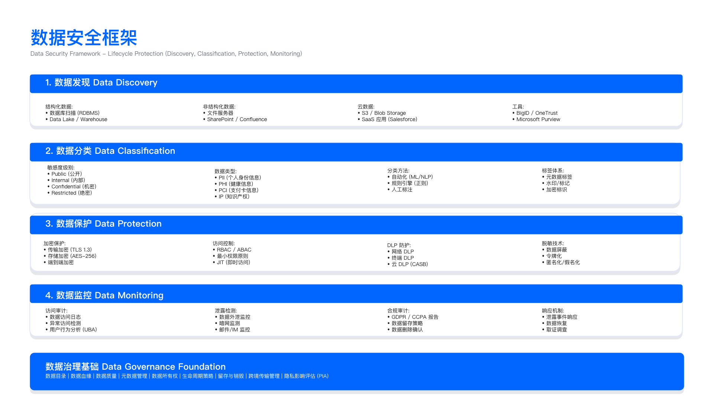

# 8.2 数据分类与标记

## Data Classification and Labeling

数据分类分级是数据安全治理的前提。未经分类的数据无法实施差异化保护，容易陷入"一刀切"误区——要么过度投资导致业务阻塞，要么保护不足埋下合规风险。本节阐述数据分类标准设计、敏感数据发现技术、自动化标记实施与数据资产清单管理。

---

## 8.2.1 数据分类标准设计

### 分类维度选择

企业数据分类需同时考量敏感度、业务影响、合规要求与恢复目标四个维度。单一维度分类容易遗漏约束条件。

| 分类维度 | 评估标准 | 决策输出 |
|----------|----------|----------|
| 敏感度 | 泄露对隐私与安全的影响 | 是否包含 PII、商业机密、知识产权 |
| 业务影响 | 丢失或不可用对运营的影响 | RTO/RPO 要求、业务中断成本 |
| 合规性 | 是否受法规强制约束 | GDPR/PIPL/HIPAA/PCI DSS 适用性 |
| 恢复目标 | 数据恢复的紧急程度 | 备份频率、归档策略 |

### 四级分类标准

基于 [ISO/IEC 27001:2022](https://www.iso.org/standard/27001) Annex A.8.2 与 [NIST SP 800-60 Vol.1 Rev.1](https://csrc.nist.gov/publications/detail/sp/800-60/vol-1-rev-1/final) 框架，推荐采用四级分类体系。超过五级会增加执行复杂度，低于三级则无法覆盖合规差异。

#### Level 4: Restricted（限制级）

定义：最高敏感度，泄露将导致严重法律责任、财务损失或声誉损害。

数据示例：
- 支付卡主账号（PAN）、CVV、PIN 码
- 社保号、护照号、生物特征数据
- 未公开并购信息、董事会机密文件
- 源代码（核心业务逻辑）、密码 hash

强制控制（示例配置，需根据法规与业务调整）：
- 静态加密、传输加密、使用中加密（条件允许）
- MFA + 特权访问管理（PAM）
- DLP 强制阻断外发
- 完整审计日志（保留期限参考：GDPR Art.30 建议记录保留 3 年，PCI DSS Req 10.7 要求日志保留至少 1 年）
- 禁止跨境传输（除非通过审批流程与合规机制）

访问控制：双人审批 + 业务需要原则 + 定期权限复核（建议 ≤ 90 天）

常见误区：
1. 将所有包含个人信息的数据均标为 Restricted，导致业务流程无法正常运行（如客服查询客户姓名被阻断）
2. 未区分"原始数据"与"脱敏数据"，脱敏后仍沿用原分类等级
3. 跨境传输审批流程未明确响应时限，紧急业务需求被阻塞

#### Level 3: Confidential（机密级）

定义：高敏感度，仅限内部授权人员访问，泄露将对企业造成显著负面影响。

数据示例：
- 员工薪资、绩效考核记录
- 客户联系方式（非支付信息）
- 未公开财务报表、产品路线图
- 商业合同、供应商协议

强制控制（示例配置）：
- 静态加密与传输加密
- RBAC 访问控制 + MFA
- DLP 监控与告警（不强制阻断，允许业务审批后放行）
- 审计日志保留（建议 ≥ 1 年，参考 SOX §404 要求）
- 跨境传输需隐私影响评估（DPIA）

访问控制：内部员工 + 业务需要 + 定期权限复核（建议 ≤ 180 天）

常见误区：
1. DLP 策略仅设置"告警"无人处理，等同未部署
2. 加密密钥与加密数据存储在同一系统，未实现物理隔离
3. 跨境传输评估流于形式，未真实评估接收国政府访问风险（Schrems II 判决要求）

#### Level 2: Internal（内部级）

定义：内部使用数据，不对外公开，泄露影响有限。

数据示例：
- 内部流程文档、项目计划
- 非敏感业务数据、培训材料
- 内部邮件通讯（非机密内容）

强制控制（示例配置）：
- 传输加密（TLS 1.2+）
- 基础访问控制（AD/LDAP 认证）
- 定期审计抽查
- DLP 提示（用户教育，不阻断）

访问控制：所有内部员工

常见误区：
1. 忽略"内部数据"的完整性保护，未实现版本控制与变更审计
2. 未限制离职员工访问，权限回收滞后
3. 内部数据在公有云存储时未启用访问日志

#### Level 1: Public（公开级）

定义：可公开发布，无保密要求。

数据示例：
- 营销材料、产品白皮书
- 已发布财报、官网公开信息
- 公开新闻稿

强制控制（示例配置）：
- 完整性保护（防篡改，数字签名）
- 版本控制
- 发布审批流程

访问控制：无限制

常见误区：
1. 公开数据未进行完整性校验，被恶意篡改后未及时发现
2. 公开数据的撤回流程缺失，已发布错误信息无法召回
3. 未区分"计划公开"与"已公开"，导致预发布文件被提前泄露

### 个人数据的叠加分类

针对个人数据，需叠加 GDPR/PIPL 分类规则。单一通用分类无法满足隐私合规要求。详细的隐私合规处理要求参见 [9.3 个人数据处理合规](../../chapter_09_privacy_compliance/9.3_personal_data_processing.md)。

| 类别 | 定义 | 示例 | 对应通用级别 | 隐私分类映射 |
|------|------|------|--------------|-------------|
| 特殊类别个人数据<br>(GDPR Art.9 / PIPL Art.28) | 敏感个人信息 | 种族、政治观点、宗教信仰<br>健康数据、生物特征<br>性取向、基因数据<br>14 岁以下儿童数据 | Restricted | 敏感数据 |
| 一般个人数据（直接标识符） | 单独可识别自然人 | 姓名、身份证号、电话、邮箱<br>护照号、社保号 | Confidential | 直接标识符 |
| 一般个人数据（准标识符） | 组合后可识别 | IP 地址、设备 ID、cookie<br>地理位置、订单记录<br>邮编 + 年龄 + 性别 | Internal - Confidential | 准标识符 |
| 匿名化数据 | 不可逆去标识化 | 聚合统计数据<br>k-匿名化处理后数据集 | Internal 或 Public | 非个人数据 |

验证方法：
- 委托第三方审计机构验证匿名化不可逆性（防止重识别攻击）
- 使用 k-匿名性、l-多样性、t-接近度等指标量化匿名化效果
- 定期测试是否可通过外部数据源关联还原身份

### 行业特定数据分类

| 行业 | 特定数据类型 | 监管要求 | 推荐分类 | 附加控制 |
|------|--------------|----------|----------|----------|
| 金融 | 信用卡号（PAN）、CVV、PIN | PCI DSS | Restricted | 强制分段存储、定期轮换密钥 |
| 医疗 | 电子健康记录、诊疗信息 | HIPAA PHI | Restricted | 最小必要披露、去标识化 |
| 电商 | 支付信息、交易记录、用户画像 | GDPR/CCPA/PIPL | Confidential - Restricted | 数据最小化、目的限制 |
| 制造 | 工业控制数据、CAD 图纸 | CMMC、ISO 27001 | Confidential | 供应链访问控制 |

行业分类的常见问题：
1. 多行业企业采用不同分类标准，导致跨部门数据共享冲突
2. 行业标准更新后未及时同步分类规则（如 PCI DSS 4.0 新增要求）
3. 第三方供应商按自身行业标准分类，与企业标准不一致

---

## 8.2.2 敏感数据自动发现技术

### 数据发现面临的约束

| 约束条件 | 技术影响 | 缓解措施 |
|----------|----------|----------|
| 扫描性能 | 全量扫描影响生产环境 | 非高峰时段扫描、采样扫描、增量扫描 |
| 数据规模 | PB 级数据扫描耗时数周 | 优先扫描高风险数据源、并行扫描 |
| 数据盲区 | 影子 IT、个人设备、第三方系统 | 网络流量分析、CASB 发现云服务 |
| 动态变化 | 每日新增数据未及时分类 | 持续发现模式、数据管道集成 |

### 技术一：基于规则的模式匹配

原理：使用正则表达式与已知模式匹配。

适用场景：结构化数据（数据库表、CSV）、已知格式（信用卡号、身份证号）。

检测模式库示例：

```python
# 示例: 信用卡号检测 (Luhn 算法验证)
import re

def luhn_check(card_number):
    """Luhn 算法校验信用卡号有效性"""
    def digits_of(n):
        return [int(d) for d in str(n)]

    digits = digits_of(card_number.replace('-', '').replace(' ', ''))
    odd_digits = digits[-1::-2]
    even_digits = digits[-2::-2]
    checksum = sum(odd_digits)
    for d in even_digits:
        checksum += sum(digits_of(d*2))
    return checksum % 10 == 0

def detect_credit_card(text):
    """检测文本中的信用卡号"""
    # Visa: 4xxx-xxxx-xxxx-xxxx (16 位)
    # MasterCard: 5xxx-xxxx-xxxx-xxxx
    # Amex: 37xx-xxxxxx-xxxxx (15 位)

    patterns = [
        r'\b4[0-9]{3}[-\s]?[0-9]{4}[-\s]?[0-9]{4}[-\s]?[0-9]{4}\b',  # Visa
        r'\b5[1-5][0-9]{2}[-\s]?[0-9]{4}[-\s]?[0-9]{4}[-\s]?[0-9]{4}\b',  # MC
        r'\b3[47][0-9]{2}[-\s]?[0-9]{6}[-\s]?[0-9]{5}\b'  # Amex
    ]

    for pattern in patterns:
        matches = re.findall(pattern, text)
        for match in matches:
            if luhn_check(match):
                return True, "Credit Card Detected"
    return False, None

# 中国身份证号检测 (18 位，最后一位校验位)
def detect_china_id(text):
    """检测中国居民身份证号"""
    pattern = r'\b[1-9]\d{5}(18|19|20)\d{2}(0[1-9]|1[0-2])(0[1-9]|[12]\d|3[01])\d{3}[\dXx]\b'
    if re.search(pattern, text):
        return True, "China ID Card"
    return False, None
```

常见检测模式库：
- 信用卡号（PAN）：Visa/MasterCard/Amex/UnionPay
- 身份证号：中国居民身份证（18 位）、美国 SSN（9 位）
- 护照号、驾照号、银行账号
- 邮箱地址、电话号码（国际格式）
- API 密钥、JWT Token、密码 hash

验证方法：
- 使用已知敏感数据样本测试检测规则准确率（true positive rate）
- 计算误报率（false positive rate），目标建议 ≤ 10%
- 定期更新规则库（如新增支付渠道的卡号格式）

运行指标：
- 模式匹配命中率（检测到敏感数据的数据源占比）
- 规则更新频率（建议每季度复核）
- 误报率（需人工复核的比例）

局限性：
1. 无法识别上下文语义（如"银行账号示例"与"真实银行账号"）
2. 格式变体难以覆盖（如信用卡号带空格、带短横线、无分隔符）
3. 非结构化数据检测效果差（PDF、图片中的文本）

### 技术二：机器学习数据分类

原理：训练 NLP 模型理解数据语义与上下文。

适用场景：非结构化数据（文档、邮件、日志）、上下文依赖型敏感信息。

示例实现（命名实体识别）：

```python
# 示例: 使用 NLP 模型识别 PII
from transformers import pipeline

# 加载预训练的 NER (命名实体识别) 模型
classifier = pipeline("ner", model="dslim/bert-base-NER")

text = "我的名字是张三，手机号 13800138000，住在北京市朝阳区"

entities = classifier(text)
# 输出示例:
# [
#   {'entity': 'B-PER', 'word': '张三'},
#   {'entity': 'B-LOC', 'word': '北京市'},
#   {'entity': 'B-LOC', 'word': '朝阳区'}
# ]

# 识别到 PII: 姓名、地理位置
```

机器学习技术优势：
- 理解上下文语义（区分"银行账号"和"银行名称"）
- 识别非结构化数据（PDF、Word、邮件正文）
- 自适应学习（随着标注数据增加，准确率提升）

常用机器学习模型：
- BERT/RoBERTa：命名实体识别
- GPT/LLaMA：上下文理解
- computer vision：OCR + 图像文本识别

验证方法：
- 使用标注数据集验证模型准确率（precision）与召回率（recall）
- A/B 测试比较规则引擎与机器学习模型的检测效果
- 人工抽查机器学习分类结果，计算误判率

运行指标：
- 模型准确率（目标建议 ≥ 85%）
- 模型推理延迟（扫描 1GB 数据耗时）
- 模型再训练频率（数据分布变化后）

局限性：
1. 需要大量标注数据训练模型（至少数千样本）
2. 模型推理成本高（GPU 资源消耗）
3. 模型可解释性差，难以向审计人员说明分类依据

### 技术三：指纹匹配

原理：对已知敏感数据生成 hash 指纹，在全域扫描匹配。

适用场景：
- 检测客户数据库导出文件是否流入测试环境
- 追踪敏感文档的非授权分发
- 内部威胁检测（员工下载客户列表）

实施步骤：

```python
import hashlib

# 步骤 1: 对已知敏感数据 (如客户数据库) 生成指纹
sensitive_db = ["张三", "13800138000", "zhangsan@example.com"]
fingerprints = {hashlib.sha256(data.encode()).hexdigest() for data in sensitive_db}

# 步骤 2: 扫描文件系统，计算 hash 并比对
def scan_file(filepath):
    """扫描文件中的敏感数据指纹"""
    with open(filepath, 'r', encoding='utf-8') as f:
        content = f.read()
        tokens = content.split()  # 简化示例，实际需更复杂分词
        for token in tokens:
            token_hash = hashlib.sha256(token.encode()).hexdigest()
            if token_hash in fingerprints:
                return True, f"Sensitive data found: {token}"
    return False, None
```

验证方法：
- 使用脱敏数据测试指纹库匹配效率（检索 1 亿条记录耗时）
- 测试 hash 碰撞率（不同数据生成相同 hash 的概率）
- 验证指纹库更新延迟（生产数据变更后指纹同步时长）

运行指标：
- 指纹库覆盖率（已指纹化的敏感数据源占比）
- 匹配成功率（真实匹配 / 总匹配次数）
- 指纹库更新频率（建议每日增量更新）

局限性：
1. 数据轻微变化（如增加空格、大小写转换）导致 hash 失配
2. 指纹库维护成本高（数据更新需重新生成指纹）
3. 无法检测数据的派生形式（如聚合统计结果）

### 技术四：数据血缘分析

原理：追踪数据从源头到使用的完整链路，自动继承上游分类。

适用场景：
- 数据仓库中派生表的自动分类
- 检测跨境数据流动路径
- 识别未分类的下游数据资产

血缘追踪示例：
```
CRM 生产库 (Confidential)
  ↓ ETL 任务
数据仓库事实表 (继承 Confidential)
  ↓ BI 查询
Excel 报表 (继承 Confidential)
  ↓ 邮件发送
告警: Confidential 数据通过邮件外发
```

验证方法：
- 人工验证血缘关系准确性（抽查 10% 数据流）
- 测试血缘断链检测（ETL 任务变更后血缘更新延迟）
- 验证跨系统血缘追踪能力（数据从数据库 → 对象存储 → SaaS）

运行指标：
- 血缘覆盖率（已建立血缘关系的数据资产占比）
- 血缘断链率（无法追溯上游的数据占比）
- 血缘更新延迟（ETL 变更后血缘刷新时长）

### DSPM 平台选型考量

| 工具/平台 | 核心能力 | 适用场景 | 关键约束 |
|-----------|----------|----------|----------|
| BigID | 多云数据发现、ML 分类、GDPR 合规 | 大型企业、全球合规 | 本地化部署选项有限 |
| Varonis | 非结构化数据保护、权限分析 | 文件服务器密集型企业 | 云原生支持较弱 |
| Microsoft Purview | Azure/M365 原生集成、自动标签 | 微软生态重度用户 | 多云环境需额外连接器 |
| Securiti | 隐私 + 数据安全一体化 | 跨境电商、隐私优先 | 价格较高 |

选型决策点：
1. 是否支持本地化部署（PIPL 关键数据处理要求）
2. 多云支持能力（AWS/Azure/GCP/阿里云）
3. 机器学习模型准确率（要求供应商提供 PoC 测试）
4. 与现有 DLP/SIEM/SOAR 集成能力

验证方法：
- 要求供应商提供 PoC 环境，使用脱敏生产数据测试分类准确率
- 验证 DSPM 平台对本地化部署的支持程度（如数据是否出境）
- 测试与现有安全工具的集成能力（API 调用延迟、数据格式兼容性）

---

## 8.2.3 数据标记与标签管理

### 标签体系设计

| 标签类型 | 用途 | 实施方式 | 验证方法 |
|----------|------|----------|----------|
| 分类标签 | 指示敏感度 | 数据库元数据、文件扩展属性 | 抽查标签与实际数据一致性 |
| 所有者标签 | 标识责任人 | RACI 矩阵、数据目录 | 验证所有者邮箱有效性 |
| 合规标签 | 关联法规 | 自动或手工标注 | 审计标签与法规适用性匹配 |
| 地理标签 | 数据驻留位置 | 基于存储位置自动打标 | 验证实际物理位置与标签一致 |
| 保留标签 | 保留期限 | ILM 策略自动化 | 测试到期自动删除是否触发 |

### 技术实施方案

#### 方案一：数据库元数据标签

PostgreSQL 示例：
```sql
-- 使用 COMMENT 存储分类信息
COMMENT ON COLUMN customers.credit_card IS
  'Classification:Restricted;Compliance:PCI-DSS;Encryption:Required';

-- 或使用专门的标签表
CREATE TABLE data_classification_labels (
  table_name VARCHAR(100),
  column_name VARCHAR(100),
  classification VARCHAR(50),
  compliance_tags TEXT[],
  owner VARCHAR(100),
  last_reviewed DATE
);

INSERT INTO data_classification_labels VALUES
  ('customers', 'credit_card', 'Restricted', ARRAY['PCI-DSS'], 'Finance', '2025-01-01');
```

验证方法：
- 定期扫描数据库 COMMENT 字段，检查标签完整性
- 验证标签格式一致性（如统一使用 `Key:Value` 格式）
- 测试标签是否可被 DLP/加密系统读取

运行指标：
- 标签覆盖率（已标记列 / 总列数）
- 标签准确率（人工抽查验证）
- 标签过期率（超过复核周期未更新的标签占比）

#### 方案二：文件系统扩展属性

Linux xattr 示例：
```bash
# 设置标签
setfattr -n user.classification -v "Confidential" /path/to/file.xlsx
setfattr -n user.owner -v "HR-Department" /path/to/file.xlsx

# 读取标签
getfattr -d /path/to/file.xlsx
```

验证方法：
- 测试文件复制后标签是否保留
- 验证跨文件系统移动时标签是否丢失
- 检查不同操作系统对扩展属性的支持程度

运行指标：
- 标签持久性（文件操作后标签保留率）
- 标签同步延迟（设置标签到 DLP 系统读取的时长）

#### 方案三：云存储对象标签

AWS S3 示例：
```python
import boto3

s3 = boto3.client('s3')

# 上传文件并打标签
s3.put_object(
    Bucket='my-bucket',
    Key='financial-report-2025.pdf',
    Body=file_content,
    Tagging='Classification=Confidential&Owner=Finance&Compliance=SOX'
)

# 批量扫描并打标签（示例：集成 DSPM 分类结果）
def auto_label_s3_objects(bucket, dspm_client):
    """自动为 S3 对象打标签"""
    objects = s3.list_objects_v2(Bucket=bucket)
    for obj in objects.get('Contents', []):
        # 调用 DSPM 分类接口 (需实际实现)
        classification = dspm_client.classify(
            bucket=bucket,
            key=obj['Key']
        )

        s3.put_object_tagging(
            Bucket=bucket,
            Key=obj['Key'],
            Tagging={'TagSet': [
                {'Key': 'Classification', 'Value': classification},
                {'Key': 'AutoLabeled', 'Value': 'true'},
                {'Key': 'LabeledDate', 'Value': '2025-10-21'}
            ]}
        )
```

验证方法：
- 测试标签是否可用于生命周期策略（如自动归档）
- 验证标签变更是否触发 CloudTrail 审计日志
- 检查跨区域复制时标签是否同步

运行指标：
- 标签一致性（S3 标签与数据目录记录一致性）
- 标签查询性能（根据标签筛选对象的响应时间）

### 自动化标签流程

标签引擎设计：
```python
class AutoLabelEngine:
    """自动化数据标签引擎"""

    def __init__(self, dspm_client, policy_rules):
        self.dspm = dspm_client
        self.rules = policy_rules

    def apply_rules(self, features):
        """应用分类规则"""
        # 规则 1: 检测到信用卡号 → Restricted
        if 'credit_card' in features.get('detected_patterns', []):
            return 'Restricted'

        # 规则 2: PII + 健康数据 → Restricted
        if 'pii' in features and 'health_data' in features:
            return 'Restricted'

        # 规则 3: PII 但无特殊类别 → Confidential
        if 'pii' in features:
            return 'Confidential'

        # 规则 4: 内部使用无敏感信息 → Internal
        if features.get('access_scope') == 'internal':
            return 'Internal'

        return 'Public'

    def trigger_controls(self, asset, classification):
        """触发下游安全控制"""
        if classification == 'Restricted':
            self.kms.encrypt(asset)
            self.dlp.block_external_share(asset)
            self.audit.enable_full_logging(asset)
        elif classification == 'Confidential':
            self.kms.encrypt(asset)
            self.dlp.monitor(asset)
```

验证方法：
- 使用测试数据集验证规则引擎准确率
- 模拟边界情况（如同时包含 PII 与公开数据的文件）
- 测试控制触发是否及时（标签变更到加密生效的延迟）

常见误区：
1. 自动标签未建立人工复核机制，误标数据直接触发错误控制
2. 标签规则与 DLP 策略不一致，导致控制失效
3. 标签变更未记录审计日志，无法追溯分类决策依据

---

## 8.2.4 数据资产清单管理

### 数据资产清单要素

| 要素 | 说明 | 验证方法 |
|------|------|----------|
| 资产标识 | 全局唯一 ID | 检查 ID 冲突与命名规范 |
| 资产类型 | 数据库/文件/API/流数据 | 验证类型与实际技术栈一致 |
| 位置 | 物理/逻辑位置 | 核对实际部署位置 |
| 所有者 | 数据所有者 | 确认所有者邮箱有效 |
| 保管人 | 技术负责人 | 验证保管人职责认知 |
| 分类 | 敏感度分类 | 抽查分类与数据内容一致性 |
| 合规标签 | 关联法规 | 审计法规适用性 |
| 敏感列/字段 | 包含敏感信息的字段 | 扫描验证敏感字段完整性 |
| 访问模式 | 访问频率/用户数 | 与实际日志比对 |
| 保留期限 | 数据保留策略 | 测试到期自动删除 |
| 风险评分 | DSPM 计算的风险分数 | 验证评分算法合理性 |

### 数据资产清单示例

```yaml
# data_inventory.yaml
assets:
  - id: asset-db-crm-prod-001
    name: "CRM Production Database - Customers Table"
    type: PostgreSQL
    location:
      cloud: AWS
      region: us-east-1
      vpc: vpc-prod-001
      endpoint: crm-db.abc123.us-east-1.rds.amazonaws.com

    owner:
      name: "Sales VP"
      email: "sales-vp@company.com"
      department: "Sales"

    custodian:
      team: "Database Administration"
      email: "dba-team@company.com"

    classification: Confidential
    compliance_tags:
      - GDPR
      - PIPL
      - CCPA

    sensitive_columns:
      - column: email
        type: Email Address
        classification: Confidential
        masked: true
      - column: phone
        type: Phone Number
        classification: Confidential
        masked: true
      - column: credit_card
        type: Payment Card
        classification: Restricted
        encrypted: true
        pci_dss: true

    access_control:
      authentication: MFA
      authorization: RBAC
      privileged_access: PAM

    data_volume:
      rows: 5000000
      size_gb: 50
      growth_rate: "10% per month"

    retention_policy:
      duration: "7 years"
      regulation: "SOX, GLBA"
      delete_date: "2032-12-31"

    last_reviewed: "2025-09-01"
    next_review: "2026-03-01"

    risk_score:
      overall: 85
      sensitivity: 90
      exposure: 75
      compliance_gap: 20

    remediation:
      - action: "Enable column-level encryption for credit_card"
        priority: High
        due_date: "2025-11-30"
        assigned_to: "Security Engineering"
```

### 数据资产清单维护流程

| 维护活动 | 频率 | 负责方 | 验收标准 |
|----------|------|--------|----------|
| 全量扫描 | 季度 | DSPM 平台 | 新增资产检出率 ≥ 95% |
| 增量发现 | 每日 | DSPM 平台 | 发现延迟 ≤ 24 小时 |
| 分类审查 | 半年度 | 数据所有者 | 审查完成率 ≥ 95% |
| 权限审计 | 季度 | IAM/Security | 过期权限清理率 100% |
| 合规对账 | 年度 | GRC/Privacy | 合规缺口整改完成率 ≥ 90% |

常见失败原因：
1. 数据所有者未真实参与审查，仅形式化签字
2. 增量发现延迟过高，新增敏感数据未及时纳入保护
3. 权限审计发现问题但未跟进整改

---

## 8.2.5 数据分类治理与合规

### 分类治理架构

决策层：安全风险管理委员会（GRC 主导）
- 审批分类标准变更
- 裁决分类争议
- 监督分类 KPI

执行层：数据分类工作组
- 制定分类规则
- 运营 DSPM 平台
- 培训数据所有者
- 处理分类申诉

落地层：数据所有者
- 确认数据分类
- 审批访问申请
- 定期分类审查

### 分类争议处理

| 争议场景 | 处理路径 | 验收标准 |
|----------|----------|----------|
| 业务认为分类过高 | 风险量化评估 → GRC 决策 → 补偿控制 + 时限 | 决策周期 ≤ 10 工作日 |
| 技术实施困难 | 技术优化方案 → 分阶段实施 → 临时例外（≤ 6 个月） | 例外到期自动复审 |
| 跨境场景冲突 | 跨境影响评估 → 脱敏传输 → 合规机制（SCC/BCR） | 合规机制签署完成 |

例外申请流程：
```
业务提出例外申请
  ↓
数据分类工作组初审
  ↓
风险量化评估（FAIR）
  ↓
GRC 审批（补偿控制 + 时限）
  ↓
记录例外
  ↓
到期自动触发复审
```

验证方法：
- 审计例外申请是否包含风险评估报告
- 检查例外到期是否自动触发复审
- 验证补偿控制是否实际部署

### 数据分类合规映射

| 法规 | 数据分类要求 | 对应控制 | 验证方法 |
|------|--------------|----------|----------|
| GDPR Art.32 | 数据按风险分类保护 | Restricted/Confidential 需加密 + 访问控制 | 审计加密覆盖率 |
| PIPL Art.51 | 个人信息分类分级保护 | 敏感个人信息 → Restricted | 验证儿童数据单独同意 |
| PCI DSS Req 3 | 持卡人数据保护 | PAN/CVV → Restricted，强制加密 | 委托 QSA 审计 |
| HIPAA | PHI 保护 | 电子健康记录 → Restricted | 验证访问日志保留 3 年 |

---

## 8.2.6 数据分类运行指标

| 指标 | 计算方法 | 目标值（示例） | 触发条件 |
|------|----------|----------------|----------|
| 数据资产覆盖率 | 已分类资产 ÷ 总资产 | ≥ 95% | < 90% 触发告警 |
| 自动分类准确率 | 机器学习正确分类 ÷ 人工验证样本 | ≥ 90% | < 85% 需重新训练模型 |
| 分类审查及时率 | 按期完成审查 ÷ 计划审查 | ≥ 95% | < 90% 上报管理层 |
| 高风险资产数 | risk score ≥ 80 的资产数 | 环比下降 | 环比上升触发复盘 |
| 分类争议解决时长 | 争议提出到 GRC 决策的平均时长 | ≤ 10 工作日 | > 15 工作日升级 |
| 数据盲区发现率 | 新发现未分类资产 ÷ 总资产 | ≤ 5%（每季度） | > 10% 需扩大扫描范围 |

指标采集来源：
- DSPM 平台：覆盖率、准确率、风险评分
- data governance 系统：审查及时率
- GRC 系统：争议解决时长

常见误区：
1. 仅关注覆盖率指标，忽略准确率导致误分类
2. 指标未与绩效挂钩，数据所有者缺乏审查动力
3. 指标阈值设置过宽松，失去预警作用

---



*图：数据安全框架概览，展示分类分级在数据安全体系中的基础地位*

---

## 导航

**[← 上一节：8.1 数据安全战略](./8.1_data_security_strategy.md)** | **[返回章节目录](./README.md)** | **[下一节：8.3 数据生命周期安全 →](./8.3_data_lifecycle_security.md)**

---

**© 2025 AI-ESA Project. Licensed under CC BY-NC-SA 4.0**

