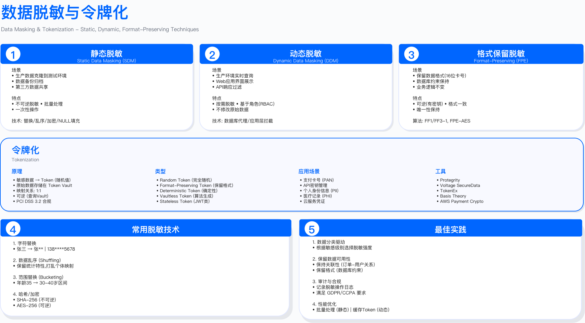

# 8.5 数据访问控制

## Data Access Control

访问控制是数据安全的核心防线。数据加密解决存储安全，访问控制解决使用安全——谁能读写数据、在什么条件下访问、如何验证其权限。即使数据库启用全盘加密，若访问控制策略配置不当，授权用户仍可能过度访问、越权读取敏感数据或滥用特权账号。本节从访问控制模型的演进出发，阐述 RBAC、ABAC、ReBAC 等策略引擎设计，零信任数据访问架构，特权访问管理（PAM）与 JIT（Just-in-Time）临时授权机制，以及数据脱敏与动态授权技术的工程实践。

---

## 8.5.1 访问控制模型演进

### 四代模型的决策边界

访问控制模型的演进反映了企业对授权粒度、动态性与可审计性的需求变化。选择何种模型取决于组织结构稳定性、数据敏感度分布、合规审计要求与系统复杂度容忍度。

```
┌──────────────────────────────────────────────────────────────┐
│           访问控制模型演进史                                  │
│     (Evolution of Access Control Models)                    │
├──────────────────────────────────────────────────────────────┤
│                                                              │
│  第一代：DAC (Discretionary Access Control)                 │
│  自主访问控制（1970s）                                       │
│  ├─ 特点：数据所有者自主决定谁可以访问                       │
│  ├─ 示例：Unix 文件权限 (rwx)、Windows ACL                  │
│  ├─ 适用边界：小型团队、数据所有权明确、信任边界内           │
│  └─ 失效场景：权限扩散、难以集中撤销、误配置后无法追溯       │
│                                                              │
│  第二代：MAC (Mandatory Access Control)                     │
│  强制访问控制（1980s）                                       │
│  ├─ 特点：系统强制执行安全策略，用户无法修改                 │
│  ├─ 示例：SELinux、军事分级系统 (Top Secret/Secret/Confidential)│
│  ├─ 适用边界：强制合规要求、固定安全等级、政府/军事环境     │
│  └─ 失效场景：商业环境灵活性不足、管理成本高、用户体验差   │
│                                                              │
│  第三代：RBAC (Role-Based Access Control)                   │
│  基于角色的访问控制（1990s）- 当前主流                      │
│  ├─ 特点：权限分配给角色，用户获得角色                       │
│  ├─ 示例：数据库角色、应用权限组                             │
│  ├─ 适用边界：组织结构清晰、人员流动频繁、审计需求强         │
│  └─ 失效场景：角色爆炸、静态授权无法适应动态业务             │
│                                                              │
│  第四代：ABAC (Attribute-Based Access Control)              │
│  基于属性的访问控制（2000s）- 下一代标准                    │
│  ├─ 特点：基于主体/资源/环境属性的动态决策                   │
│  ├─ 示例：XACML、云 IAM 策略、零信任架构                     │
│  ├─ 适用边界：细粒度控制、动态业务场景、多租户环境           │
│  └─ 失效场景：策略复杂度高、性能开销大、调试困难             │
│                                                              │
│  新兴：ReBAC (Relationship-Based Access Control)            │
│  基于关系的访问控制（2010s）                                 │
│  ├─ 特点：基于实体间关系图（如社交网络）                     │
│  ├─ 示例：Google Zanzibar、SpiceDB                          │
│  ├─ 适用边界：复杂关系依赖、实时权限计算、协作平台           │
│  └─ 应用：Google Drive 共享、GitHub 组织权限                │
│                                                              │
└──────────────────────────────────────────────────────────────┘
```

### 模型选择决策树

选择访问控制模型需要从业务场景反推技术约束。以下决策树基于组织结构稳定性与动态授权需求：

```
需要细粒度动态控制？
  ├─ 是 → ABAC（首选）
  │       └─ 若存在复杂关系依赖 → 结合 ReBAC
  │
  └─ 否
      ├─ 组织结构清晰且稳定？
      │   ├─ 是 → RBAC（主流选择）
      │   │       └─ 关键数据 → 结合 ABAC 动态条件
      │   │
      │   └─ 否 → 简化场景 → DAC（小型系统）
      │           └─ 若有强制合规 → MAC（政府/军事）
```

关键约束：

- RBAC 角色爆炸阈值：当角色数量超过用户数量一定比例（内部经验值 50%）时，需考虑拆分或转向 ABAC
- ABAC 性能开销：属性评估增加授权延迟（典型场景 10-50ms），需在低延迟场景缓存决策
- ReBAC 计算复杂度：关系图深度查询可能导致数据库压力，需设置最大递归深度（内部实践 3-5 层）

验证方法：

- 使用历史权限变更日志模拟 RBAC/ABAC 策略，测算角色数量与策略复杂度
- 在测试环境压测 ABAC 决策引擎，测量 P99 延迟是否满足业务 SLA
- 红队测试权限提升路径，如通过角色继承链获取非预期权限

---

## 8.5.2 RBAC 基于角色的访问控制

### RBAC 核心设计原则

RBAC 将用户与权限解耦，通过角色作为中间层简化权限管理。其核心是职责分离（Separation of Duty, SoD）——防止单一用户拥有冲突权限（如同时拥有创建订单与审批订单权限）。

```
用户 (User) ─ 分配 → 角色 (Role) ─ 授予 → 权限 (Permission) ─ 作用于 → 资源 (Resource)

示例:
  Alice ───→ "财务经理" ───→ "查看财报" ───→ financial_reports 表
  Bob   ───→ "数据分析师" ───→ "读取客户数据" ───→ customers 表 (仅脱敏列)
```

适用边界：

- 组织结构稳定：角色与部门/职能对应关系在半年周期内变更频率较低（内部阈值 <20%）
- 权限粒度可接受：能用有限数量角色（内部经验 10-50 个）覆盖绝大部分用户（内部目标 >80%）
- 审计友好：需要清晰回答"谁有权限"与"权限来自哪个角色"

常见失败原因：

1. 角色设计过细导致角色爆炸（如为每个部门每个职级单独建角色），管理成本超过 DAC
2. 缺少角色继承机制，导致权限重复配置与同步困难
3. 静态角色无法适应临时授权需求（如项目临时成员），引入大量"特殊角色"

### 层级 RBAC 实现

以下实现展示角色继承、职责分离检查与审计日志生成。

```python
# RBAC 系统实现

from typing import Set, Dict, List
from dataclasses import dataclass
from enum import Enum

class Permission(Enum):
    """权限枚举"""
    READ = "read"
    WRITE = "write"
    DELETE = "delete"
    ADMIN = "admin"

@dataclass
class Role:
    """角色定义"""
    name: str
    permissions: Set[Permission]
    parent_role: 'Role' = None  # 支持角色继承
    description: str = ""

class RBACEngine:
    """RBAC引擎"""

    def __init__(self):
        self.roles: Dict[str, Role] = {}
        self.user_roles: Dict[str, Set[str]] = {}  # user_id -> role_names
        self.resource_permissions: Dict[str, Set[Permission]] = {}

    def create_role(self, name: str, permissions: Set[Permission],
                   parent_role: str = None, description: str = ""):
        """创建角色"""
        parent = self.roles.get(parent_role) if parent_role else None

        # 继承父角色权限
        if parent:
            permissions = permissions.union(parent.permissions)

        role = Role(name, permissions, parent, description)
        self.roles[name] = role
        return role

    def assign_role(self, user_id: str, role_name: str):
        """分配角色给用户"""
        if role_name not in self.roles:
            raise ValueError(f"角色不存在: {role_name}")

        if user_id not in self.user_roles:
            self.user_roles[user_id] = set()

        self.user_roles[user_id].add(role_name)
        # 审计日志: 记录谁在何时分配了角色
        self._audit_log("ROLE_ASSIGNED", {
            'user_id': user_id,
            'role': role_name,
            'granted_by': 'admin'  # 实际需从上下文获取
        })

    def revoke_role(self, user_id: str, role_name: str):
        """撤销用户角色"""
        if user_id in self.user_roles:
            self.user_roles[user_id].discard(role_name)
            self._audit_log("ROLE_REVOKED", {
                'user_id': user_id,
                'role': role_name
            })

    def check_permission(self, user_id: str, resource: str,
                        required_permission: Permission) -> bool:
        """检查用户是否有权限访问资源"""

        # 获取用户所有角色
        user_role_names = self.user_roles.get(user_id, set())
        if not user_role_names:
            return False

        # 聚合所有角色的权限
        user_permissions = set()
        for role_name in user_role_names:
            role = self.roles[role_name]
            user_permissions.update(role.permissions)

        # 检查是否有 ADMIN 权限 (超级权限)
        if Permission.ADMIN in user_permissions:
            return True

        # 检查是否有所需权限
        return required_permission in user_permissions

    def get_user_permissions(self, user_id: str) -> Set[Permission]:
        """获取用户所有权限"""
        user_role_names = self.user_roles.get(user_id, set())
        permissions = set()
        for role_name in user_role_names:
            permissions.update(self.roles[role_name].permissions)
        return permissions

    def _audit_log(self, event_type: str, details: Dict):
        """审计日志占位符"""
        # 实际实现需发送到SIEM或审计日志系统
        pass

# 使用示例
rbac = RBACEngine()

# 创建角色层级
rbac.create_role("员工", {Permission.READ}, description="基础员工")
rbac.create_role("经理", {Permission.READ, Permission.WRITE},
                parent_role="员工", description="部门经理")
rbac.create_role("管理员", {Permission.ADMIN}, description="系统管理员")

# 分配角色
rbac.assign_role("alice", "经理")
rbac.assign_role("bob", "员工")
rbac.assign_role("charlie", "管理员")

# 权限检查
print(rbac.check_permission("alice", "customer_data", Permission.WRITE))  # True
print(rbac.check_permission("bob", "customer_data", Permission.WRITE))    # False
print(rbac.check_permission("charlie", "customer_data", Permission.DELETE)) # True (ADMIN)
```

验证方法：

- 角色继承链测试：验证子角色继承父角色所有权限，且权限变更能正确传播
- 职责分离检查：测试互斥角色（如「审批员」与「申请员」）不能同时分配给同一用户
- 权限回收验证：撤销角色后，用户立即失去相关权限（需在 1 分钟内生效）

运行指标：

- 角色使用率：每个角色的用户数量，识别僵尸角色（无用户或仅少量用户的角色）
- 权限变更频率：角色权限调整次数，过高表明角色设计不稳定
- 审计日志完整性：角色分配/撤销操作的日志覆盖率（合规要求 100%）

### 数据库 RBAC 实施

数据库层 RBAC 与应用层 RBAC 需协同设计，避免双重授权管理。优先在数据库层实施粗粒度控制（如表级读写权限），在应用层实施细粒度控制（如行级/字段级权限）。

```sql
-- PostgreSQL RBAC 配置

-- 1. 创建角色
CREATE ROLE data_analyst;
CREATE ROLE data_engineer;
CREATE ROLE finance_manager;
CREATE ROLE dba_admin;

-- 2. 授予权限
-- 数据分析师: 只读访问
GRANT CONNECT ON DATABASE company_db TO data_analyst;
GRANT USAGE ON SCHEMA public TO data_analyst;
GRANT SELECT ON ALL TABLES IN SCHEMA public TO data_analyst;
-- 未来新表自动授权
ALTER DEFAULT PRIVILEGES IN SCHEMA public
GRANT SELECT ON TABLES TO data_analyst;

-- 数据工程师: 读写访问（除敏感表）
GRANT SELECT, INSERT, UPDATE ON ALL TABLES IN SCHEMA public TO data_engineer;
-- 撤销敏感表权限
REVOKE ALL ON TABLE salary, credit_cards FROM data_engineer;

-- 财务经理: 仅访问财务表
GRANT SELECT, INSERT, UPDATE ON TABLE financial_reports, invoices TO finance_manager;

-- DBA 管理员: 所有权限
GRANT ALL PRIVILEGES ON DATABASE company_db TO dba_admin;

-- 3. 创建用户并分配角色
CREATE USER alice WITH PASSWORD 'secure_password';
GRANT data_analyst TO alice;

CREATE USER bob WITH PASSWORD 'secure_password';
GRANT data_engineer TO bob;

-- 4. 查看用户权限
SELECT
    grantee,
    table_schema,
    table_name,
    privilege_type
FROM information_schema.role_table_grants
WHERE grantee = 'data_analyst';

-- 5. 行级安全策略（RLS）配合 RBAC
ALTER TABLE sales_data ENABLE ROW LEVEL SECURITY;

-- 策略: 分析师只能看到本部门数据
CREATE POLICY analyst_department_isolation ON sales_data
    FOR SELECT
    TO data_analyst
    USING (department = current_setting('app.user_department'));

-- 设置会话变量（需在应用层连接时设置）
SET app.user_department = 'Marketing';

-- 策略: 经理可以看到所有数据
CREATE POLICY manager_full_access ON sales_data
    FOR ALL
    TO finance_manager
    USING (true);
```

关键约束：

- 行级安全（RLS）性能开销：每个 SELECT 查询增加 WHERE 条件，需在查询计划中验证索引命中率
- 会话变量可靠性：需在连接池层强制设置 `app.user_department`，避免应用层遗漏导致权限绕过
- 默认权限机制：新表创建后需自动继承角色权限，避免遗漏授权导致访问被拒

验证方法：

- 使用不同角色连接数据库，验证 SELECT/INSERT/UPDATE/DELETE 操作的预期拒绝
- 测试 RLS 策略：修改会话变量，验证返回数据集的正确隔离
- 审计权限漂移：定期导出角色权限快照，对比基线检测未授权变更

---

## 8.5.3 ABAC 基于属性的访问控制

### ABAC 决策引擎架构

ABAC 通过评估主体属性、资源属性与环境属性的组合条件决策授权。相比 RBAC 的静态角色，ABAC 支持「工作时间内访问」「MFA 验证后访问」等动态条件，但策略复杂度与调试难度显著增加。



*图 8.4: 数据脱敏与令牌化技术 - ABAC 决策中动态脱敏的应用场景*

```
┌────────────────────────────────────────────────────┐
│              ABAC 决策引擎架构                      │
├────────────────────────────────────────────────────┤
│                                                    │
│  主体属性（Subject Attributes）                    │
│  ├─ 身份：user_id, role, department               │
│  ├─ 安全等级：clearance_level, employment_type    │
│  └─ 状态：mfa_verified, device_trusted            │
│                    ↓                               │
│  资源属性（Resource Attributes）                   │
│  ├─ 分类：classification, sensitivity_score       │
│  ├─ 所有权：owner, department, compliance_tags    │
│  └─ 状态：encryption_enabled, backup_status       │
│                    ↓                               │
│  环境属性（Environment Attributes）                │
│  ├─ 时间：current_time, business_hours            │
│  ├─ 位置：ip_address, geo_location, network_zone  │
│  └─ 设备：device_type, os_version, security_posture│
│                    ↓                               │
│  策略引擎（Policy Decision Point - PDP）           │
│  ├─ 加载策略规则（XACML/JSON）                     │
│  ├─ 评估属性匹配度                                 │
│  ├─ 计算最终决策（Allow/Deny）                     │
│  └─ 生成审计日志                                   │
│                    ↓                               │
│  策略执行点（Policy Enforcement Point - PEP）      │
│  └─ 执行 Allow/Deny 决策                           │
│                                                    │
└────────────────────────────────────────────────────┘
```

适用边界：

- 动态业务场景：授权条件频繁变化（如「项目成员仅在项目活跃期有权限」）
- 细粒度控制需求：需要基于数据敏感度、用户安全等级等多维度决策
- 零信任架构：每次访问都需重新评估上下文（如设备信任度、地理位置）

常见失败原因：

1. 策略冲突未定义优先级（如 Allow 策略与 Deny 策略同时匹配），导致授权不确定
2. 属性数据源不可靠（如用户部门字段未及时同步），导致错误拒绝或授权
3. 性能优化不足（如每次访问查询 LDAP 获取用户属性），导致延迟超标

### ABAC 策略引擎实现

以下实现展示策略条件组合、Deny 优先原则与审计日志生成。

```python
# ABAC 策略引擎

from typing import Dict, Any, List, Callable
from dataclasses import dataclass
from datetime import datetime, time
import ipaddress

@dataclass
class AccessRequest:
    """访问请求"""
    subject: Dict[str, Any]      # 主体属性
    resource: Dict[str, Any]     # 资源属性
    action: str                  # 操作 (read/write/delete)
    environment: Dict[str, Any]  # 环境属性

class ABACPolicy:
    """ABAC 策略定义"""

    def __init__(self, name: str, conditions: List[Callable], effect: str = "Allow"):
        self.name = name
        self.conditions = conditions
        self.effect = effect  # Allow 或 Deny

    def evaluate(self, request: AccessRequest) -> bool:
        """评估策略是否匹配"""
        return all(condition(request) for condition in self.conditions)

class ABACEngine:
    """ABAC 引擎"""

    def __init__(self):
        self.policies: List[ABACPolicy] = []
        self.default_decision = "Deny"  # 默认拒绝

    def add_policy(self, policy: ABACPolicy):
        """添加策略"""
        self.policies.append(policy)

    def evaluate(self, request: AccessRequest) -> Dict[str, Any]:
        """评估访问请求"""

        matched_policies = []

        # 评估所有策略
        for policy in self.policies:
            if policy.evaluate(request):
                matched_policies.append(policy)

                # 遇到 Deny 策略立即拒绝（Deny 优先原则）
                if policy.effect == "Deny":
                    return {
                        'decision': 'Deny',
                        'reason': f'Matched deny policy: {policy.name}',
                        'matched_policies': [policy.name]
                    }

        # 至少匹配一个 Allow 策略才允许
        if matched_policies:
            return {
                'decision': 'Allow',
                'matched_policies': [p.name for p in matched_policies]
            }

        # 默认拒绝
        return {
            'decision': 'Deny',
            'reason': 'No matching allow policy',
            'matched_policies': []
        }

# 定义策略条件函数
def clearance_level_sufficient(request: AccessRequest) -> bool:
    """条件：用户安全等级 >= 数据分类等级"""
    clearance_map = {'Public': 0, 'Internal': 1, 'Confidential': 2, 'Restricted': 3}
    user_clearance = clearance_map.get(request.subject.get('clearance_level'), 0)
    data_classification = clearance_map.get(request.resource.get('classification'), 0)
    return user_clearance >= data_classification

def mfa_required_for_confidential(request: AccessRequest) -> bool:
    """条件：访问 Confidential 数据需 MFA"""
    if request.resource.get('classification') in ['Confidential', 'Restricted']:
        return request.subject.get('mfa_verified', False)
    return True

def business_hours_only(request: AccessRequest) -> bool:
    """条件：仅工作时间访问"""
    current_time = request.environment.get('current_time')
    if isinstance(current_time, datetime):
        hour = current_time.hour
        return 9 <= hour <= 18
    return True

def internal_network_only(request: AccessRequest) -> bool:
    """条件：仅内网 IP 访问"""
    ip = request.environment.get('ip_address')
    if ip:
        ip_obj = ipaddress.ip_address(ip)
        # 检查是否为内网 IP
        return ip_obj.is_private
    return False

def department_match(request: AccessRequest) -> bool:
    """条件：用户部门与数据所属部门匹配"""
    return request.subject.get('department') == request.resource.get('owner_department')

def contractor_restriction(request: AccessRequest) -> bool:
    """条件：外包人员禁止访问 Restricted 数据"""
    if request.subject.get('employment_type') == 'Contractor':
        return request.resource.get('classification') != 'Restricted'
    return True

def read_only_for_analysts(request: AccessRequest) -> bool:
    """条件：分析师只能读取"""
    if request.subject.get('role') == 'Analyst':
        return request.action == 'read'
    return True

# 使用示例
abac = ABACEngine()

# 策略 1: 基础访问控制
policy_basic = ABACPolicy(
    name="Basic Access Control",
    conditions=[
        clearance_level_sufficient,
        mfa_required_for_confidential,
        contractor_restriction
    ],
    effect="Allow"
)
abac.add_policy(policy_basic)

# 策略 2: 工作时间限制 (Restricted 数据)
def restricted_business_hours(request: AccessRequest) -> bool:
    if request.resource.get('classification') == 'Restricted':
        return business_hours_only(request)
    return True

policy_time_restricted = ABACPolicy(
    name="Restricted Data - Business Hours Only",
    conditions=[restricted_business_hours],
    effect="Allow"
)
abac.add_policy(policy_time_restricted)

# 策略 3: 部门隔离 (Confidential 数据)
def confidential_department_match(request: AccessRequest) -> bool:
    if request.resource.get('classification') == 'Confidential':
        return department_match(request)
    return True

policy_department = ABACPolicy(
    name="Confidential Data - Department Isolation",
    conditions=[confidential_department_match],
    effect="Allow"
)
abac.add_policy(policy_department)

# 测试访问请求
request1 = AccessRequest(
    subject={
        'user_id': 'alice',
        'role': 'Manager',
        'department': 'Finance',
        'clearance_level': 'Confidential',
        'mfa_verified': True,
        'employment_type': 'Full-time'
    },
    resource={
        'data_id': 'financial_report_2025',
        'classification': 'Confidential',
        'owner_department': 'Finance'
    },
    action='read',
    environment={
        'current_time': datetime.now(),
        'ip_address': '192.168.1.100',
        'device_trusted': True
    }
)

result = abac.evaluate(request1)
print(f"决策：{result['decision']}")
print(f"匹配策略：{result.get('matched_policies', [])}")

# 测试 2：外包人员尝试访问 Restricted 数据
request2 = AccessRequest(
    subject={
        'user_id': 'contractor_bob',
        'role': 'Developer',
        'clearance_level': 'Restricted',
        'employment_type': 'Contractor',
        'mfa_verified': True
    },
    resource={
        'classification': 'Restricted'
    },
    action='read',
    environment={'current_time': datetime.now()}
)

result2 = abac.evaluate(request2)
print(f"\n外包人员访问 Restricted：{result2['decision']}")  # Deny
print(f"原因：{result2.get('reason')}")
```

关键约束：

- 属性数据源延迟：ABAC 依赖实时属性（如用户部门、设备信任度），需在 100ms 内完成查询
- 策略复杂度上限：单条策略条件数建议 ≤5 个，避免调试困难与性能衰减
- 决策缓存时效：低风险场景可缓存决策结果（如 5-15 分钟），高风险场景需实时计算

验证方法：

- 策略冲突测试：创建 Allow 与 Deny 策略都匹配的请求，验证 Deny 优先生效
- 属性缺失测试：提交缺少关键属性（如 `clearance_level`）的请求，验证默认拒绝
- 性能基准测试：模拟高频授权请求（如 1000 次/秒），测量 P99 延迟是否满足业务 SLA（参考阈值 50ms）

运行指标：

- 策略匹配分布：各策略的触发频率，识别冗余或未使用策略
- 默认拒绝率：无策略匹配导致拒绝的比例，过高表明策略覆盖度不足
- 属性查询延迟：从 LDAP/数据库获取属性的 P99 延迟

### XACML 策略示例

XACML（eXtensible Access Control Markup Language）是 ABAC 的标准化策略语言。以下示例展示 Confidential 数据的 MFA 与部门隔离策略。

```xml
<!-- XACML (eXtensible Access Control Markup Language) 策略 -->

<Policy PolicyId="ConfidentialDataAccessPolicy"
        RuleCombiningAlgId="urn:oasis:names:tc:xacml:3.0:rule-combining-algorithm:deny-overrides">

    <Description>访问Confidential数据的策略</Description>

    <Target>
        <AnyOf>
            <AllOf>
                <Match MatchId="urn:oasis:names:tc:xacml:1.0:function:string-equal">
                    <AttributeValue DataType="http://www.w3.org/2001/XMLSchema#string">
                        Confidential
                    </AttributeValue>
                    <AttributeDesignator
                        AttributeId="resource:classification"
                        Category="urn:oasis:names:tc:xacml:3.0:attribute-category:resource"
                        DataType="http://www.w3.org/2001/XMLSchema#string"
                        MustBePresent="true"/>
                </Match>
            </AllOf>
        </AnyOf>
    </Target>

    <Rule RuleId="MFARequired" Effect="Deny">
        <Description>Confidential 数据需要 MFA</Description>
        <Condition>
            <Apply FunctionId="urn:oasis:names:tc:xacml:1.0:function:not">
                <Apply FunctionId="urn:oasis:names:tc:xacml:1.0:function:boolean-equal">
                    <AttributeDesignator
                        AttributeId="subject:mfa_verified"
                        Category="urn:oasis:names:tc:xacml:1.0:subject-category:access-subject"
                        DataType="http://www.w3.org/2001/XMLSchema#boolean"
                        MustBePresent="true"/>
                    <AttributeValue DataType="http://www.w3.org/2001/XMLSchema#boolean">
                        true
                    </AttributeValue>
                </Apply>
            </Apply>
        </Condition>
    </Rule>

    <Rule RuleId="DepartmentMatch" Effect="Permit">
        <Description>用户部门与数据所属部门匹配</Description>
        <Condition>
            <Apply FunctionId="urn:oasis:names:tc:xacml:1.0:function:string-equal">
                <AttributeDesignator
                    AttributeId="subject:department"
                    Category="urn:oasis:names:tc:xacml:1.0:subject-category:access-subject"
                    DataType="http://www.w3.org/2001/XMLSchema#string"
                    MustBePresent="true"/>
                <AttributeDesignator
                    AttributeId="resource:owner_department"
                    Category="urn:oasis:names:tc:xacml:3.0:attribute-category:resource"
                    DataType="http://www.w3.org/2001/XMLSchema#string"
                    MustBePresent="true"/>
            </Apply>
        </Condition>
    </Rule>

</Policy>
```

关键约束：

- XACML 策略调试复杂：XML 嵌套结构难以阅读，建议使用策略管理工具可视化编辑
- 策略版本管理：需维护策略变更历史，支持回滚与差异对比
- 性能开销：XACML 解析与评估引入额外延迟，需在负载测试中验证

---

## 8.5.4 零信任数据访问 (ZTDA)

### 零信任架构原则

零信任架构（Zero Trust Architecture, ZTA）假设网络边界已失效，每次访问都需验证身份、设备、上下文。数据访问层的零信任包含持续验证、最小权限、微隔离与行为分析。

```
传统边界安全：
  内网（信任区）←防火墙→ 外网（不信任区）
  问题：内网横向移动、内部威胁

零信任架构：
  永不信任，持续验证
  ├─ 原则 1：假设突破（Assume Breach）
  ├─ 原则 2：最小权限（Least Privilege）
  ├─ 原则 3：显式验证（Verify Explicitly）
  ├─ 原则 4：微隔离（Micro-Segmentation）
  └─ 原则 5：持续监控（Continuous Monitoring）
```

适用边界：

- 高价值数据保护：财务/客户/知识产权等核心资产
- 远程办公场景：员工设备不在企业网络内，需持续验证设备信任度
- 合规强制要求：如 PCI DSS 要求对持卡人数据的每次访问都需验证

常见失败原因：

1. 设备信任评分不准确（如仅检查操作系统版本，未检测越狱/root），导致信任决策错误
2. 短期令牌过期后业务中断（如 15 分钟令牌在长时间报表查询中过期），需设计令牌续期机制
3. 行为分析误报导致正常用户被频繁要求重新 MFA，用户体验下降

### 零信任数据访问架构

以下实现展示多因素认证、设备信任评估、行为分析与实时风险评分的组合验证。

```python
# 零信任数据访问网关

import jwt
from datetime import datetime, timedelta
from typing import Dict, Any

class ZeroTrustDataGateway:
    """零信任数据访问网关"""

    def __init__(self, abac_engine, mfa_service, device_trust_service):
        self.abac = abac_engine
        self.mfa = mfa_service
        self.device_trust = device_trust_service
        self.session_store = {}

    def authenticate_user(self, username: str, password: str,
                         mfa_code: str, device_id: str) -> Dict[str, Any]:
        """多因素认证"""

        # 步骤 1：验证用户名密码
        if not self.verify_credentials(username, password):
            return {'success': False, 'error': 'Invalid credentials'}

        # 步骤 2：验证 MFA
        if not self.mfa.verify(username, mfa_code):
            return {'success': False, 'error': 'Invalid MFA code'}

        # 步骤 3：验证设备信任度
        device_trust_score = self.device_trust.evaluate(device_id)
        if device_trust_score < 70:
            return {'success': False, 'error': 'Untrusted device'}

        # 步骤 4：生成短期访问令牌（15 分钟）
        token = self.generate_access_token(username, device_id, expires_in=900)

        return {
            'success': True,
            'access_token': token,
            'expires_in': 900,
            'device_trust_score': device_trust_score
        }

    def access_data(self, access_token: str, resource_id: str,
                   action: str, context: Dict[str, Any]) -> Dict[str, Any]:
        """访问数据（零信任检查）"""

        # 检查 1：验证令牌
        try:
            claims = jwt.decode(access_token, 'secret_key', algorithms=['HS256'])
        except jwt.ExpiredSignatureError:
            return {'decision': 'Deny', 'reason': 'Token expired'}
        except jwt.InvalidTokenError:
            return {'decision': 'Deny', 'reason': 'Invalid token'}

        # 检查 2：设备持续验证
        device_id = claims['device_id']
        current_trust = self.device_trust.evaluate(device_id)
        if current_trust < 70:
            return {'decision': 'Deny', 'reason': 'Device trust degraded'}

        # 检查 3：行为分析（UEBA）
        behavior_score = self.analyze_user_behavior(
            claims['sub'], resource_id, action, context
        )
        if behavior_score < 50:
            # 异常行为，要求重新 MFA
            return {
                'decision': 'Deny',
                'reason': 'Anomalous behavior detected',
                'required_action': 'Re-authenticate with MFA'
            }

        # 检查 4：ABAC 策略评估
        request = AccessRequest(
            subject={
                'user_id': claims['sub'],
                'role': self.get_user_role(claims['sub']),
                'department': self.get_user_department(claims['sub']),
                'clearance_level': self.get_user_clearance(claims['sub']),
                'mfa_verified': True,
                'device_trusted': current_trust >= 70
            },
            resource=self.get_resource_attributes(resource_id),
            action=action,
            environment={
                'current_time': datetime.now(),
                'ip_address': context.get('ip_address'),
                'geo_location': context.get('geo_location')
            }
        )

        abac_result = self.abac.evaluate(request)

        if abac_result['decision'] == 'Deny':
            return abac_result

        # 检查 5：实时风险评分
        risk_score = self.calculate_access_risk(claims, resource_id, context)
        if risk_score > 80:
            # 高风险访问，记录并发送告警
            self.log_high_risk_access(claims['sub'], resource_id, risk_score)
            self.send_alert_to_soc(claims['sub'], resource_id, risk_score)

            # 可选：要求额外验证或仅允许受限访问
            return {
                'decision': 'Allow',
                'restrictions': 'Read-only, masked data',
                'risk_score': risk_score,
                'audit_enhanced': True
            }

        # 检查 6：数据脱敏决策
        masking_level = self.determine_masking_level(
            claims['sub'], resource_id, risk_score
        )

        return {
            'decision': 'Allow',
            'masking_level': masking_level,
            'risk_score': risk_score,
            'session_id': self.create_session(claims['sub'], resource_id)
        }

    def calculate_access_risk(self, claims: Dict, resource_id: str,
                             context: Dict) -> int:
        """计算访问风险分数（0-100）"""
        risk = 0

        # 因素 1：资源敏感度
        resource = self.get_resource_attributes(resource_id)
        classification_risk = {
            'Public': 0, 'Internal': 20, 'Confidential': 50, 'Restricted': 80
        }
        risk += classification_risk.get(resource.get('classification'), 0)

        # 因素 2：非工作时间访问
        if not (9 <= datetime.now().hour <= 18):
            risk += 20

        # 因素 3：异常地理位置
        if context.get('geo_location') != claims.get('usual_location'):
            risk += 30

        # 因素 4：大量数据访问
        recent_access_count = self.get_recent_access_count(claims['sub'])
        if recent_access_count > 100:  # 1 小时内访问超过 100 次
            risk += 25

        return min(risk, 100)

    def analyze_user_behavior(self, user_id: str, resource_id: str,
                             action: str, context: Dict) -> int:
        """用户行为分析（UEBA）"""
        # 简化示例，实际需使用 ML 模型

        # 获取用户历史行为基线
        baseline = self.get_user_baseline(user_id)

        score = 100  # 初始正常分数

        # 检测 1：访问频率异常
        current_rate = self.get_access_rate(user_id)
        if current_rate > baseline['avg_access_rate'] * 3:
            score -= 30

        # 检测 2：访问时间异常
        if not baseline['usual_hours'].get(datetime.now().hour):
            score -= 20

        # 检测 3：访问资源异常（从未访问过此类资源）
        resource_type = self.get_resource_type(resource_id)
        if resource_type not in baseline['usual_resources']:
            score -= 25

        # 检测 4：批量下载行为
        if action == 'bulk_export':
            score -= 35

        return max(score, 0)

    def generate_access_token(self, username: str, device_id: str,
                             expires_in: int = 900) -> str:
        """生成短期访问令牌"""
        payload = {
            'sub': username,
            'device_id': device_id,
            'iat': datetime.utcnow(),
            'exp': datetime.utcnow() + timedelta(seconds=expires_in)
        }
        return jwt.encode(payload, 'secret_key', algorithm='HS256')

    # 占位符方法(实际需实现)
    def verify_credentials(self, username: str, password: str) -> bool:
        pass

    def get_user_role(self, user_id: str) -> str:
        pass

    def get_user_department(self, user_id: str) -> str:
        pass

    def get_user_clearance(self, user_id: str) -> str:
        pass

    def get_resource_attributes(self, resource_id: str) -> Dict:
        pass

    def log_high_risk_access(self, user_id: str, resource_id: str, risk_score: int):
        pass

    def send_alert_to_soc(self, user_id: str, resource_id: str, risk_score: int):
        pass

    def determine_masking_level(self, user_id: str, resource_id: str, risk_score: int) -> str:
        pass

    def create_session(self, user_id: str, resource_id: str) -> str:
        pass

    def get_recent_access_count(self, user_id: str) -> int:
        pass

    def get_user_baseline(self, user_id: str) -> Dict:
        pass

    def get_access_rate(self, user_id: str) -> float:
        pass

    def get_resource_type(self, resource_id: str) -> str:
        pass
```

关键约束：

- 令牌生命周期权衡：短期令牌（典型值 15 分钟）提高安全性，但增加重新认证频率，需设计无感续期机制
- 行为基线冷启动：新员工无历史行为数据，需在前期（如 30 天）使用宽松阈值避免误拦截
- 实时风险评分延迟：需在较短时间（参考值 50ms）内完成计算，避免影响数据访问性能

验证方法：

- 设备信任降级测试：模拟设备越狱/root，验证信任度下降至阈值以下时拒绝访问
- 异常行为触发测试：在非工作时间批量下载数据，验证行为分析触发重新 MFA
- 令牌过期处理：验证令牌过期后立即拒绝访问，且提示用户重新认证

运行指标：

- 设备信任度分布：各信任度区间的设备数量，识别高风险设备
- 行为异常检测率：每日触发异常行为告警的访问次数
- 高风险访问占比：风险分数 >80 的访问占总访问量的比例

---

## 8.5.5 特权访问管理 (PAM)

### PAM 核心功能

特权账号（如 root、sa、admin）拥有系统最高权限，一旦泄露或滥用将导致灾难性后果。PAM 通过密码保险库、即时提升（JIT）、会话录屏与自动轮换密码控制特权账号使用。


*图 8.5: 数据库安全架构 - PAM 在数据库访问控制中的应用*

```
┌────────────────────────────────────────────────────┐
│          特权访问管理 (PAM) 架构                    │
├────────────────────────────────────────────────────┤
│                                                    │
│  [1] 特权账号发现与管理                            │
│  ├─ 自动发现：扫描系统识别特权账号                 │
│  ├─ 账号清单：数据库 admin、root、域管理员         │
│  └─ 去个人化：取消个人特权账号，使用共享特权账号   │
│                                                    │
│  [2] 密码保险库（Vault）                           │
│  ├─ 集中存储：所有特权凭证加密存储                 │
│  ├─ 自动轮换：定期自动更换密码                     │
│  └─ Check-out/Check-in：临时提取凭证              │
│                                                    │
│  [3] 即时特权提升（JIT）                           │
│  ├─ 默认无特权：用户正常权限运行                   │
│  ├─ 按需申请：需要时申请临时特权                   │
│  ├─ 时限控制：特权在 N 小时后自动撤销              │
│  └─ 审批流程：高风险操作需双重审批                 │
│                                                    │
│  [4] 会话管理与录屏                                │
│  ├─ 会话代理：通过 PAM 连接目标系统                │
│  ├─ 全程录屏：记录所有操作（命令/截屏）            │
│  ├─ 实时监控：SOC 实时查看特权会话                 │
│  └─ 异常阻断：检测到危险命令立即断开               │
│                                                    │
│  [5] 审计与合规                                    │
│  ├─ 完整日志：谁/何时/访问了什么/做了什么          │
│  ├─ 合规报告：SOX/PCI DSS/HIPAA 审计               │
│  └─ 取证支持：事件调查证据链                       │
│                                                    │
└────────────────────────────────────────────────────┘
```

适用边界：

- 强合规要求：SOX 法案、PCI DSS 要求特权账号的严格审计
- 高价值系统：生产数据库、核心服务器、云管理控制台
- 外包场景：需临时授权外部供应商访问系统，且访问结束后立即撤销

常见失败原因：

1. 特权账号未完全纳管（如开发环境的 admin 账号被遗漏），导致绕过 PAM 的访问路径
2. 密码轮换未与应用集成，导致轮换后应用连接数据库失败
3. 会话录屏仅记录命令行，未记录 GUI 操作（如数据库管理工具的点击操作）

### PAM 实施示例

以下实现展示特权账号注册、临时访问申请、危险命令检测与自动密码轮换。

```python
# 特权访问管理系统

from datetime import datetime, timedelta
from typing import Dict, Optional
import secrets
import string

class PrivilegedAccount:
    """特权账号"""
    def __init__(self, account_id: str, system: str, username: str,
                 account_type: str):
        self.account_id = account_id
        self.system = system  # 目标系统 (数据库/服务器)
        self.username = username
        self.account_type = account_type  # root/admin/dba
        self.password_last_rotated = None
        self.checked_out_by = None
        self.checked_out_at = None

class PAMSystem:
    """PAM 系统"""

    def __init__(self):
        self.accounts: Dict[str, PrivilegedAccount] = {}
        self.password_vault = {}  # 加密存储
        self.access_sessions = {}
        self.audit_log = []

    def register_privileged_account(self, system: str, username: str,
                                    account_type: str, initial_password: str):
        """注册特权账号"""
        account_id = f"{system}_{username}"

        account = PrivilegedAccount(account_id, system, username, account_type)
        self.accounts[account_id] = account

        # 加密存储密码
        self.password_vault[account_id] = self.encrypt_password(initial_password)

        self.audit("ACCOUNT_REGISTERED", {
            'account_id': account_id,
            'system': system,
            'username': username
        })

    def request_access(self, requester_id: str, account_id: str,
                      justification: str, duration_hours: int = 1) -> Dict:
        """申请特权访问"""

        if account_id not in self.accounts:
            return {'approved': False, 'reason': '账号不存在'}

        account = self.accounts[account_id]

        # 检查是否已被其他人使用
        if account.checked_out_by:
            return {
                'approved': False,
                'reason': f'账号正在被使用: {account.checked_out_by}'
            }

        # 风险评估
        risk_score = self.assess_access_risk(requester_id, account, justification)

        # 高风险需要审批
        if risk_score > 70:
            approval_required = True
            approver = self.get_approver(requester_id)
            # 实际需发送审批通知
        else:
            approval_required = False

        # 创建访问会话
        session_id = secrets.token_urlsafe(16)
        expires_at = datetime.now() + timedelta(hours=duration_hours)

        self.access_sessions[session_id] = {
            'session_id': session_id,
            'requester_id': requester_id,
            'account_id': account_id,
            'started_at': datetime.now(),
            'expires_at': expires_at,
            'justification': justification,
            'risk_score': risk_score,
            'approval_required': approval_required,
            'approved': not approval_required,
            'commands': [],
            'recording_path': f'/recordings/{session_id}.rec'
        }

        # Check-out账号
        account.checked_out_by = requester_id
        account.checked_out_at = datetime.now()

        # 审计日志
        self.audit("ACCESS_GRANTED", {
            'session_id': session_id,
            'requester': requester_id,
            'account': account_id,
            'duration': duration_hours,
            'risk_score': risk_score
        })

        # 返回临时凭证
        temp_password = self.get_password(account_id)

        return {
            'approved': True,
            'session_id': session_id,
            'credentials': {
                'system': account.system,
                'username': account.username,
                'password': temp_password  # 实际应通过安全通道传输
            },
            'expires_at': expires_at,
            'instructions': '所有操作将被录屏与审计'
        }

    def execute_privileged_command(self, session_id: str, command: str) -> Dict:
        """执行特权命令（通过 PAM 代理）"""

        if session_id not in self.access_sessions:
            return {'success': False, 'error': '会话不存在'}

        session = self.access_sessions[session_id]

        # 检查会话是否过期
        if datetime.now() > session['expires_at']:
            return {'success': False, 'error': '会话已过期'}

        # 危险命令检测
        dangerous_patterns = ['DROP DATABASE', 'DELETE FROM', 'TRUNCATE', 'rm -rf']
        if any(pattern in command.upper() for pattern in dangerous_patterns):
            # 记录告警
            self.audit("DANGEROUS_COMMAND_ATTEMPTED", {
                'session_id': session_id,
                'command': command,
                'blocked': True
            })

            # 发送实时告警给SOC
            self.send_alert_to_soc({
                'severity': 'HIGH',
                'type': 'Dangerous Privileged Command',
                'user': session['requester_id'],
                'command': command
            })

            return {
                'success': False,
                'error': '危险命令已被阻止',
                'security_alert': True
            }

        # 记录命令
        session['commands'].append({
            'timestamp': datetime.now(),
            'command': command
        })

        # 审计
        self.audit("PRIVILEGED_COMMAND_EXECUTED", {
            'session_id': session_id,
            'command': command
        })

        # 实际执行命令（这里简化）
        result = self.execute_on_target_system(session['account_id'], command)

        return {'success': True, 'output': result}

    def end_session(self, session_id: str):
        """结束特权会话（Check-in）"""

        if session_id not in self.access_sessions:
            return

        session = self.access_sessions[session_id]
        account_id = session['account_id']
        account = self.accounts[account_id]

        # 释放账号
        account.checked_out_by = None
        account.checked_out_at = None

        # 自动轮换密码（高安全等级）
        if account.account_type in ['root', 'sa']:
            new_password = self.rotate_password(account_id)

        # 审计
        self.audit("SESSION_ENDED", {
            'session_id': session_id,
            'duration': (datetime.now() - session['started_at']).seconds,
            'commands_executed': len(session['commands'])
        })

        # 保存会话录像
        self.finalize_session_recording(session_id)

        del self.access_sessions[session_id]

    def rotate_password(self, account_id: str) -> str:
        """自动轮换密码"""

        # 生成强随机密码
        new_password = self.generate_strong_password()

        # 更新目标系统密码
        self.update_system_password(account_id, new_password)

        # 更新 vault
        self.password_vault[account_id] = self.encrypt_password(new_password)

        # 更新轮换时间
        self.accounts[account_id].password_last_rotated = datetime.now()

        # 审计
        self.audit("PASSWORD_ROTATED", {'account_id': account_id})

        return new_password

    def generate_strong_password(self, length: int = 32) -> str:
        """生成强密码"""
        alphabet = string.ascii_letters + string.digits + string.punctuation
        password = ''.join(secrets.choice(alphabet) for _ in range(length))
        return password

    def audit(self, event_type: str, details: Dict):
        """审计日志"""
        log_entry = {
            'timestamp': datetime.now().isoformat(),
            'event_type': event_type,
            'details': details
        }
        self.audit_log.append(log_entry)
        # 实际应发送到SIEM

    def get_audit_report(self, start_date: datetime, end_date: datetime) -> list:
        """生成审计报告"""
        return [
            log for log in self.audit_log
            if start_date <= datetime.fromisoformat(log['timestamp']) <= end_date
        ]

    # 占位符方法（实际需实现）
    def encrypt_password(self, password: str) -> str:
        pass

    def get_password(self, account_id: str) -> str:
        pass

    def assess_access_risk(self, requester_id: str, account: PrivilegedAccount, justification: str) -> int:
        pass

    def get_approver(self, requester_id: str) -> str:
        pass

    def send_alert_to_soc(self, alert: Dict):
        pass

    def execute_on_target_system(self, account_id: str, command: str) -> str:
        pass

    def finalize_session_recording(self, session_id: str):
        pass

    def update_system_password(self, account_id: str, new_password: str):
        pass
```

关键约束：

- 密码轮换窗口：轮换期间可能导致应用连接失败，需设计双密码并行期（如轮换后旧密码保留一定时长）
- 会话录屏存储：高分辨率录屏占用存储较大（如 4K 录屏每小时约 10GB），需设定保留期限（合规参考值 90 天）
- 危险命令检测局限：基于关键词匹配易绕过（如用 base64 编码），需结合行为分析

验证方法：

- 并发访问测试：多个用户同时申请同一特权账号，验证仅首个用户获取且其他用户收到「账号占用」提示
- 密码轮换回归测试：轮换后验证应用仍能正常连接数据库，且旧密码失效
- 危险命令阻断测试：尝试执行 `DROP DATABASE` 等命令，验证被拒绝且 SOC 收到告警

运行指标：

- 特权账号使用频率：各特权账号的 check-out 次数，识别高频使用账号
- 会话时长分布：大部分会话应在短时间（如 1-2 小时）内结束，超长会话需人工审查
- 密码轮换合规性：应在每次会话结束或定期（如 30 天）轮换，监控未轮换账号

---

## 8.5.6 JIT 访问与数据脱敏

### JIT 访问架构

Just-in-Time（JIT）访问要求用户在需要时临时申请权限，访问结束后自动撤销。相比长期授权，JIT 降低权限滥用窗口，符合最小权限原则。

```python
# JIT 访问管理

class JITAccessManager:
    """Just-in-Time 访问管理"""

    def __init__(self):
        self.temporary_grants = {}

    def request_jit_access(self, user_id: str, resource_id: str,
                          reason: str, duration_minutes: int = 30):
        """申请 JIT 访问"""

        # 1. 验证请求合理性
        if duration_minutes > 240:  # 最长时限（内部策略 4 小时）
            return {'approved': False, 'reason': '请求时长超过上限'}

        # 2. 风险评估
        risk_score = self.evaluate_jit_risk(user_id, resource_id, reason)

        # 3. 自动审批逻辑
        if risk_score < 50:
            # 低风险自动批准
            approval = {'approved': True, 'auto_approved': True}
        elif risk_score < 80:
            # 中风险需要上级审批
            approval = self.request_manager_approval(user_id, resource_id, reason)
        else:
            # 高风险需要双重审批
            approval = self.request_dual_approval(user_id, resource_id, reason)

        if not approval['approved']:
            return approval

        # 4. 授予临时权限
        grant_id = self.grant_temporary_access(
            user_id, resource_id, duration_minutes
        )

        # 5. 设置自动撤销
        self.schedule_auto_revocation(grant_id, duration_minutes)

        return {
            'approved': True,
            'grant_id': grant_id,
            'expires_at': datetime.now() + timedelta(minutes=duration_minutes),
            'risk_score': risk_score
        }

    def grant_temporary_access(self, user_id: str, resource_id: str,
                              duration_minutes: int) -> str:
        """授予临时访问权限"""

        grant_id = secrets.token_urlsafe(16)
        expires_at = datetime.now() + timedelta(minutes=duration_minutes)

        self.temporary_grants[grant_id] = {
            'user_id': user_id,
            'resource_id': resource_id,
            'granted_at': datetime.now(),
            'expires_at': expires_at,
            'revoked': False
        }

        # 在IAM系统中创建临时角色
        self.create_temporary_iam_role(user_id, resource_id, expires_at)

        # 审计
        self.log_jit_grant(user_id, resource_id, duration_minutes)

        return grant_id

    def schedule_auto_revocation(self, grant_id: str, duration_minutes: int):
        """调度自动撤销"""
        # 实际应使用异步任务队列 (Celery/RQ)
        import threading

        def revoke_after_delay():
            import time
            time.sleep(duration_minutes * 60)
            self.revoke_jit_access(grant_id, auto_revoked=True)

        thread = threading.Thread(target=revoke_after_delay, daemon=True)
        thread.start()

    def revoke_jit_access(self, grant_id: str, auto_revoked: bool = False):
        """撤销 JIT 访问"""

        if grant_id not in self.temporary_grants:
            return

        grant = self.temporary_grants[grant_id]

        if grant['revoked']:
            return

        # 从IAM系统移除临时角色
        self.remove_temporary_iam_role(grant['user_id'], grant['resource_id'])

        # 标记为已撤销
        grant['revoked'] = True
        grant['revoked_at'] = datetime.now()
        grant['auto_revoked'] = auto_revoked

        # 审计
        self.log_jit_revocation(grant_id, auto_revoked)

    # 占位符方法
    def evaluate_jit_risk(self, user_id: str, resource_id: str, reason: str) -> int:
        pass

    def request_manager_approval(self, user_id: str, resource_id: str, reason: str) -> Dict:
        pass

    def request_dual_approval(self, user_id: str, resource_id: str, reason: str) -> Dict:
        pass

    def create_temporary_iam_role(self, user_id: str, resource_id: str, expires_at: datetime):
        pass

    def log_jit_grant(self, user_id: str, resource_id: str, duration_minutes: int):
        pass

    def remove_temporary_iam_role(self, user_id: str, resource_id: str):
        pass

    def log_jit_revocation(self, grant_id: str, auto_revoked: bool):
        pass

# AWS 示例：JIT 访问 IAM 角色
import boto3
import json

def grant_jit_s3_access(user_arn: str, bucket_name: str, duration_hours: int = 1):
    """授予 JIT S3 访问权限"""

    sts = boto3.client('sts')

    # 生成临时凭证
    response = sts.assume_role(
        RoleArn='arn:aws:iam::123456789:role/JIT-S3-Access-Role',
        RoleSessionName=f'jit-session-{secrets.token_hex(8)}',
        DurationSeconds=duration_hours * 3600,
        Policy=json.dumps({
            "Version": "2012-10-17",
            "Statement": [{
                "Effect": "Allow",
                "Action": ["s3:GetObject", "s3:ListBucket"],
                "Resource": [
                    f"arn:aws:s3:::{bucket_name}",
                    f"arn:aws:s3:::{bucket_name}/*"
                ]
            }]
        })
    )

    credentials = response['Credentials']

    return {
        'access_key_id': credentials['AccessKeyId'],
        'secret_access_key': credentials['SecretAccessKey'],
        'session_token': credentials['SessionToken'],
        'expiration': credentials['Expiration']
    }
```

适用边界：

- 临时项目团队：项目成员仅在项目周期内需要访问数据
- 故障排查场景：运维人员临时需要访问生产环境日志
- 合规要求：需证明「用户仅在必要时拥有最小权限」

常见失败原因：

1. 自动撤销依赖定时任务，任务队列故障导致权限未撤销
2. 临时角色创建延迟，用户在权限生效前尝试访问导致拒绝
3. 审批流程设计不合理，中风险请求需要审批但审批人响应慢导致业务阻塞

验证方法：

- 时效性测试：申请 1 分钟临时权限，验证 1 分钟后访问被拒绝
- 审批流程测试：提交需审批的请求，验证审批前无权限、审批后立即生效
- 并发撤销测试：同时撤销 100 个临时权限，验证 IAM 系统无性能瓶颈

运行指标：

- JIT 请求量：每日/每周的临时权限申请次数
- 自动审批率：无需人工审批的请求占比，过低表明风险评估过严格
- 平均权限时长：大部分应在较短时间（如 30-120 分钟），超长时长需审查

---

---

## 导航

**[← 上一节：8.4 数据加密体系](./8.4_data_encryption_system.md)** | **[返回章节目录](./README.md)** | **[下一节：8.6 数据丢失防护（DLP） →](./8.6_data_loss_prevention.md)**

---

**© 2025 AI-ESA Project. Licensed under CC BY-NC-SA 4.0**
