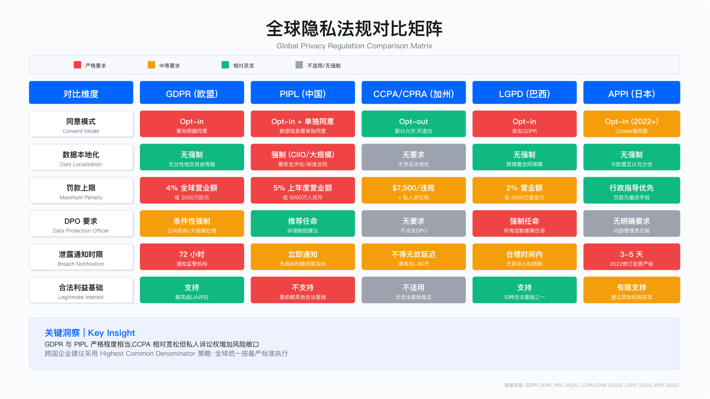
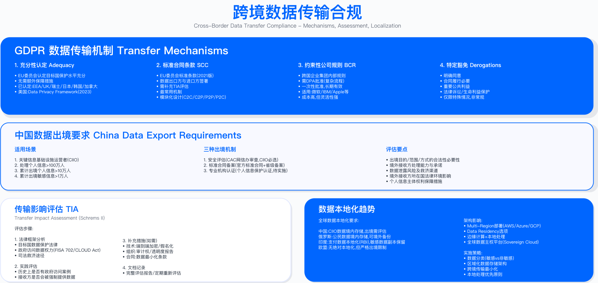

# 9.1 全球隐私法规体系

## 概述

全球隐私法规的核心理念趋于一致：赋予个人对其数据的控制权、要求企业透明处理、强化监管执法力度。从欧盟 GDPR 到中国 PIPL，从美国加州 CCPA/CPRA 到巴西 LGPD，各法规在具体条款上存在差异，但均围绕数据主体权利保护、处理合法基础、跨境传输机制三大支柱展开。

本节梳理主流隐私法规的核心要求与执法特点，构建跨国企业隐私合规的决策框架。理解法规差异是制定统一合规策略的前提，但更关键的是识别各法规的强制要求与选择空间，在合规成本与业务灵活性之间做出权衡。

适用边界：本节内容适用于需要处理欧盟、中国、美国加州用户数据的企业，以及在全球多个司法辖区开展业务的跨国组织。对于仅在单一司法辖区运营且不涉及跨境数据传输的企业，可重点关注所在地法规章节。

关键约束：隐私合规涉及法律、技术、组织三个维度。法律层面需持续跟踪法规变化（各法规平均每 1-2 年有重大修订或执法解释更新）；技术层面需投入系统改造以支持数据主体权利响应；组织层面需建立跨部门协作机制（法务、IT、业务）。合规成本与企业规模、数据处理复杂度、业务地理分布密切相关。



---

## 9.1.1 欧盟 GDPR：全球隐私立法的参照标准

### 法规框架

法规全称：General Data Protection Regulation（通用数据保护条例）

管辖范围：欧盟 27 国与欧洲经济区（EEA）

生效日期：2018 年 5 月 25 日

替代法规：Data Protection Directive 95/46/EC

域外效力（Article 3）：

GDPR 的域外管辖权是其核心特征之一。根据 Article 3，以下情形均受 GDPR 约束：在欧盟境内设立的控制者或处理者的数据处理活动；向欧盟境内数据主体提供商品或服务的境外企业；监控欧盟境内数据主体行为的境外企业。这意味着全球企业若服务欧盟用户，无论是否在欧盟设有实体，均需评估 GDPR 合规义务。

处罚机制：

GDPR 采用两级处罚体系。较轻违规（如未任命 DPO、未进行 DPIA）最高可处 1000 万欧元或全球年营业额 2% 的罚款。核心条款违规（如违反处理原则、侵犯数据主体权利、非法跨境传输）最高可处 2000 万欧元或全球年营业额 4% 的罚款。执法机构为各成员国的数据保护机构（DPA）。

### GDPR 七大原则

GDPR Article 5 确立了个人数据处理的七项基本原则，这些原则是所有合规工作的出发点：

1. 合法、公平、透明 (lawfulness, fairness, transparency)：处理必须具备合法基础，对数据主体公平，且充分告知处理信息。
2. 目的限制 (purpose limitation)：收集数据时必须明确具体目的，后续处理不得超出原始目的范围。
3. 数据最小化 (data minimisation)：仅收集实现目的所必需的数据，避免过度收集。
4. 准确性 (accuracy)：确保数据准确且及时更新，不准确数据应及时更正或删除。
5. 存储期限限制 (storage limitation)：数据保留期不得超过实现目的所需时间。
6. 完整性和保密性 (integrity and confidentiality)：采取适当技术和组织措施保护数据安全。
7. 问责制 (accountability)：控制者需能够证明其合规，而非仅声称合规。

常见误区：

- 将"目的限制"理解为数据仅能用于单一目的。实际上，GDPR 允许"兼容目的"(compatible purposes) 的后续处理，但需评估原始目的与新目的的关联性、数据收集场景、数据敏感程度等因素。
- 将"问责制"等同于文档合规。问责制要求的是"可证明的合规"，即企业需建立持续运行的合规机制，而非仅在检查时准备文档。

---

### 处理的合法基础

GDPR Article 6 规定个人数据处理必须满足至少一项合法基础。以下表格列出六种合法基础及其适用场景，帮助企业在实际业务中做出选择。

选择这些维度进行对比的原因在于：合法基础的选择直接影响数据主体权利的适用范围、企业的证明责任、以及数据主体撤回同意时的业务影响。

| 合法基础 | 适用场景 | 实施要求 | 风险等级 |
|---------|---------|---------|---------|
| 同意 (consent) | 营销邮件、非必要 cookie、第三方数据分享 | 自由给予、具体、知情、明确表示、可撤回 | 高 - 需证明有效同意，可随时撤回 |
| 合同履行 (contract performance) | 电商订单处理、SaaS 账户管理、物流配送 | 处理对合同履行必要，或签约前准备 | 中 - 需证明必要性 |
| 法律义务 (legal obligation) | 税务申报、反洗钱检查、法院命令执行 | 欧盟或成员国法律规定的义务 | 低 - 有明确法律依据 |
| 生命利益 (vital interests) | 医疗急救、灾难响应 | 保护数据主体或他人生命 | 低 - 限于紧急情况 |
| 公共任务 (public task) | 政府公共服务、公共研究 | 执行公共利益任务或行使官方权力 | 低 - 限于公共机构 |
| 合法利益 (legitimate interests) | 欺诈检测、网络安全、直接营销 | 需进行 LIA 评估，不得损害数据主体权利 | 中高 - 需平衡测试 |

合法基础选择的核心权衡：

"同意"作为合法基础的优势在于适用范围广，但劣势是数据主体可随时撤回，导致业务中断风险。"合同履行"相对稳定，但适用范围受限于合同履行所必需的处理。"合法利益"灵活性较高，但需完成合法利益评估（LIA），且不适用于儿童数据处理。

同意的严格标准：

GDPR 对同意的要求远高于传统的"点击同意"。有效同意必须是主动选择行为，不能预勾选；撤回同意必须与给予同意一样简单；需记录谁、何时、对何内容、如何给予同意；不能将同意捆绑在服务条款中（如"不同意则无法使用"）。

合法利益评估（LIA）流程：

1. 识别合法利益：明确控制者或第三方的利益是什么
2. 必要性测试：是否有其他侵入性更小的方式实现同一目的
3. 平衡测试：控制者利益是否被数据主体的权利和自由所覆盖
4. 记录结果：形成书面 LIA 报告并保存

验证方法：审计同意记录的完整性（是否包含时间戳、同意内容、收集方式）；测试同意撤回流程的便捷性（是否与给予同意同样简单）；评估 LIA 文档的充分性（是否涵盖必要性测试和平衡测试）。

---

### 数据主体权利

GDPR Chapter III 赋予数据主体八项核心权利。这些权利的实现需要企业建立相应的技术能力和运营流程。

| 权利 | 条款 | 核心要求 | 响应时限 | 关键例外 |
|------|------|----------|----------|----------|
| 访问权 | Art. 15 | 提供数据副本（免费） | 1 个月 | 明显无理或过度请求可收费或拒绝 |
| 更正权 | Art. 16 | 更正不准确数据 | 1 个月 | 需验证正确性 |
| 删除权（被遗忘权） | Art. 17 | 删除数据 | 1 个月 | 法律义务、公共利益等 6 种例外 |
| 限制处理权 | Art. 18 | 暂停处理（标记为"限制"） | 1 个月 | 准确性争议或合法性争议期间 |
| 数据可移植权 | Art. 20 | 结构化、机器可读格式 | 1 个月 | 仅限"同意"或"合同"基础的数据 |
| 反对权 | Art. 21 | 停止处理（如直接营销） | 立即停止直接营销 | 基于"合法利益"的处理需被覆盖 |
| 自动化决策权 | Art. 22 | 不受纯自动化决策约束 | N/A | 需人工干预或解释权 |
| 知情权 | Art. 13-14 | 透明告知处理信息 | 数据收集时 | 已知情况 |

企业实施的关键挑战：

1. 访问权范围界定：系统日志中的 IP 地址是否属于"个人数据"？业务备注是否需要提供？子处理者持有的数据是否需要汇总？建议制定明确的"个人数据"清单，区分个人数据与匿名化数据，并在隐私政策中说明。

2. 删除权与保留期冲突：税务法要求保留 7 年，用户要求删除如何处理？Article 17(3)(b)"法律义务"是合法拒绝理由，需在隐私政策中明确说明保留期及法律依据。

3. 可移植性格式：JSON、XML、CSV 均为 EDPB 建议的"机器可读"格式，PDF 因难以解析不建议使用。

4. 身份验证：通过邮件收到删除请求时，如何防止恶意攻击？建议实施多因素验证，或要求提供账户创建时的信息。

验证方法：模拟各类数据主体请求（DSR），验证响应流程是否在规定时限内完成；测试数据定位能力，确认能够从所有相关系统中提取或删除数据；审计身份验证流程的有效性。

运行指标：DSR 响应时效达标率（1 个月内完成占比）；DSR 类型分布（访问/删除/更正等）；DSR 拒绝率及拒绝原因分布。

---

### 执法趋势与案例

以下罚款案例来自各国数据保护机构官方决定书，用于说明执法重点，帮助企业识别高风险领域。

| 公司 | 国家 | 罚款金额 | 违规原因 | 日期 | 核心教训 |
|------|------|---------|---------|------|---------|
| Meta (Facebook) | 爱尔兰 | €12 亿 | 欧美数据传输违反 Schrems II 判决 | 2023.5 | 跨境传输需 SCC 与补充技术措施 |
| Amazon | 卢森堡 | €7.46 亿 | 行为广告未获有效同意 | 2021.7 | 同意必须"自由给予"，不能捆绑服务 |
| TikTok | 爱尔兰 | €3.45 亿 | 儿童数据保护不足，默认公开设置 | 2023.9 | 年龄验证与儿童账户默认私密 |
| Google | 法国 | €9000 万 | cookie 横幅设计误导，拒绝按钮难以发现 | 2023.12 | "拒绝"必须与"接受"同样简单 |
| H&M | 德国 | €3530 万 | 过度收集员工家庭及健康信息用于绩效评估 | 2020.10 | 员工隐私需额外保护，数据最小化 |

**案例来源（官方决定书）**：
- **Meta €12 亿**：爱尔兰 DPC，Decision IN-18-5-5（2023-05-22），[DPC 官方公告](https://www.dataprotection.ie/en/news-media/press-releases/data-protection-commission-announces-conclusion-inquiry-meta-ireland)
- **Amazon €7.46 亿**：卢森堡 CNPD，Decision 16FR/2021（2021-07-16），为 GDPR 实施以来最高罚款之一
- **TikTok €3.45 亿**：爱尔兰 DPC，Decision IN-21-2-1（2023-09-15），[DPC 官方公告](https://www.dataprotection.ie/en/news-media/press-releases/dpc-concludes-two-inquiries-tiktok)
- **Google €9000 万**：法国 CNIL，Decision SAN-2021-023（2021-12-31），2023 年延续执法，[CNIL 官方公告](https://www.cnil.fr/en/cookies-cnil-fines-google-90-million-euros)
- **H&M €3530 万**：德国汉堡 DPA，Decision 2020-10-01，[HmbBfDI 官方公告](https://datenschutz-hamburg.de/pressemitteilungen/2020/10/2020-10-01-h-m-verfahren)

各国 DPA 执法风格差异：

| DPA | 特点 | 企业应对 |
|-----|------|---------|
| 爱尔兰 DPC | 大型科技公司欧洲总部所在地，案件复杂，审理周期长 | 提前沟通，准备充分的合规证据 |
| 法国 CNIL | 技术细节要求高，重视 cookie 合规 | cookie 横幅需"拒绝"按钮与"接受"同样显眼 |
| 德国各州 DPA | 执法严格，对员工数据保护敏感 | 员工监控需明确法律依据与工会协商 |
| 西班牙 AEPD | 重视数据泄露通知，响应迅速 | 72 小时通知要求严格执行 |

执法趋势（基于公开案例归纳）：

1. AI 与算法决策：自动化决策透明度不足成为执法新热点
2. dark patterns：误导性 UI 设计（如隐藏拒绝按钮）被重点打击
3. 跨境 DPA 协作："一站式机制"下跨国执法增加
4. 数据泄露连坐：服务商泄露导致控制者被罚

---

## 9.1.2 中国 PIPL：本地化特色与执法特点

### 法规框架

法规全称：个人信息保护法（Personal Information Protection Law）

管辖范围：中华人民共和国

生效日期：2021 年 11 月 1 日

配套法律：网络安全法（2017）、数据安全法（2021）、民法典第四编"人格权"第六章

域外效力（第 3 条）：

境外处理中国境内自然人个人信息，且符合以下之一的，适用 PIPL：向境内自然人提供产品或服务为目的；分析、评估境内自然人的行为；法律法规规定的其他情形。

### PIPL 与 GDPR 的关键差异

理解 PIPL 与 GDPR 的差异是跨国企业制定统一合规策略的基础。以下从五个维度进行对比：

| 维度 | GDPR | PIPL | 跨境企业应对策略 |
|------|------|------|---------------|
| **数据本地化** | 无强制，可自由传输至充分性地区 | CIIO 与大规模处理者需境内存储 | 中国用户数据需在境内存储副本 |
| **合法基础** | 6 种（含合法利益） | 无"合法利益"，主要依赖同意 | 中国业务更依赖明确同意 |
| **同意标准** | 自由、具体、知情、明确 | 自愿、明确、充分知情，单独同意场景更多 | 统一采用更严格的同意机制 |
| **儿童保护** | 13-16 岁（各国自定） | 14 岁以下需父母同意 | 统一按 14 岁标准 |
| **罚款上限** | €2000 万或 4% 全球营业额 | ¥5000 万或 5% 上年度营业额 | PIPL 罚款上限实际更高 |

核心差异解读：

PIPL 无"合法利益"作为合法基础，这意味着在中国开展业务时，企业更多需要依赖"同意"或"合同履行"作为处理基础。对于欺诈检测、网络安全等场景，在 GDPR 下可使用"合法利益"，但在 PIPL 下可能需要获取同意或依据其他法定基础。

---

### 单独同意制度

PIPL 要求在四类场景必须取得"单独同意"（不能与其他同意捆绑）：

场景 1：敏感个人信息处理（第 29 条）

敏感个人信息包括：生物识别（人脸、指纹、虹膜、声纹）、宗教信仰、特定身份（工会、政党）、医疗健康、金融账户、行踪轨迹、不满 14 周岁未成年人信息。

UI 实现要求：单独的同意勾选框，不能与其他同意捆绑。

错误示范：
```
[ ] 我已阅读并同意《用户协议》《隐私政策》，并同意提供人脸识别信息用于身份验证
```

正确示范：
```
[ ] 我已阅读并同意《用户协议》和《隐私政策》
[ ] 我单独同意提供人脸识别信息用于实名认证
    （敏感个人信息，您可拒绝但将无法使用需要实名认证的功能）
```

场景 2：向境外提供个人信息（第 39 条）

告知要求：明确说明接收方名称、联系方式、处理目的、方式、类型、境外接收方所在国家或地区。

场景 3：公开个人信息（第 26 条）

示例：排行榜公开用户昵称和照片、论坛展示用户真实姓名。

场景 4：处理目的变更（第 14 条）

示例：原本收集用于物流配送，现变更为精准营销推荐。

常见误区：

- 认为在隐私政策中概括性地说明了敏感信息处理即满足"单独同意"要求。实际上，单独同意需要在具体处理环节通过独立的交互动作获取。
- 将"单独同意"等同于"弹窗确认"。单独同意的核心是"不能捆绑"，即用户拒绝敏感信息处理不应影响其使用不需要该信息的功能。

---

### 数据出境安全评估

评估触发条件：

1. 关键信息基础设施运营者（CIIO）：电信、互联网、金融、交通、能源等关键领域
2. 大规模数据：处理个人信息达到国家网信部门规定数量
3. 敏感数据规模：敏感个人信息达到一定规模

三种合规机制对比：

| 机制 | 适用场景 | 流程 | 时间成本 | 状态 |
|------|---------|------|---------|------|
| 安全评估 | CIIO、大规模数据 | 省级网信办初审 → 国家网信办评估 | 45-60 工作日 | 强制 |
| 专业机构认证 | 中小规模非敏感数据 | 第三方认证机构评估 | 30-60 天 | 细则待完善 |
| 标准合同 | 中小规模非敏感数据 | 签订标准合同 → 省级网信办备案 | 备案 60 天自动通过 | 已发布模板 |

标准合同备案流程（推荐中小企业使用）：

1. 下载《个人信息出境标准合同》模板
2. 完成风险自评估（识别风险与技术措施）
3. 与境外接收方签订合同
4. 向省级网信部门备案
5. 备案后 60 日内未反馈视为通过
6. 每年进行风险复评估

验证方法：评估企业数据处理规模是否触发强制安全评估条件；审计标准合同签订的完整性；验证年度风险复评估是否按期执行。

运行指标：数据出境备案完成率；标准合同覆盖率（已签订占需签订总数）；年度复评估及时完成率。

---

### PIPL 与 GDPR 敏感数据定义差异

敏感数据定义的差异直接影响合规策略，以下对比帮助企业识别需要额外关注的数据类型。


| 类别 | GDPR (Article 9) | PIPL（第 28 条） | 实践差异 |
|------|------------------|-----------------|---------|
| 生物识别 | 唯一识别目的时适用 | 所有生物识别均适用 | PIPL 范围更广 |
| 健康数据 | 适用 | 适用 | 基本一致 |
| 种族/民族 | 适用 | 不明确（但宗教信仰适用） | PIPL 更关注宗教与政治身份 |
| 行踪轨迹 | 不明确（可能属一般数据） | 明确适用 | PIPL 特有 |
| 金融账户 | 不适用 | 明确适用 | PIPL 特有 |
| 14 岁以下儿童 | 需特殊保护但非敏感类别 | 直接列为敏感 | PIPL 保护更强 |

跨境企业策略：对于同时服务欧盟和中国用户的企业，建议采用敏感数据定义的并集，即同时满足 GDPR 和 PIPL 的要求。

---

## 9.1.3 美国 CCPA/CPRA：州级隐私法的特点

### 法规框架

法规全称：California Consumer Privacy Act（CCPA，2020 生效）、California Privacy Rights Act（CPRA，2023 生效）

管辖范围：加州

监管机构：California Privacy Protection Agency（CPPA，2023 年成立）

适用门槛（满足任一即可）：

1. 年营收超过 2500 万美元
2. 年处理 50,000 以上消费者、家庭或设备的个人信息
3. 收入中相当比例来自出售或分享消费者个人信息

### 与 GDPR 的核心差异

| 维度 | GDPR | CCPA/CPRA | 影响 |
|------|------|-----------|------|
| 同意模式 | opt-in（事先同意） | opt-out（默认允许，可退出） | 美国更宽松，但"出售"需明确 opt-out |
| 私人诉讼权 | 仅集体诉讼 | 数据泄露可私人诉讼 | CCPA 诉讼风险更高 |
| 焦点 | 全面数据保护 | "出售"(sale) 和"分享"(share) | CCPA 对广告生态影响大 |
| 敏感信息 | 特殊类别需明确同意 | SPI 可限制使用（opt-out） | CPRA 新增 SPI 类别 |

### 消费者权利

CCPA/CPRA 赋予消费者五项核心权利：

1. 知情权 (right to know)：了解收集、使用、披露、出售的个人信息类别和具体内容。响应时限 45 天（可延长 45 天）。
2. 删除权 (right to delete)：要求企业删除个人信息。例外包括完成交易、检测安全事件、调试、遵守法律、内部合法使用。
3. 更正权 (right to correct，CPRA 新增)：更正不准确的个人信息。
4. 选择退出权 (right to opt-out)：退出"出售"和"分享"（用于跨情境行为广告）。UI 要求在主页显著位置提供相关链接。
5. 非歧视权 (right to non-discrimination)：行使权利不得遭受价格或服务质量差别对待。

### "出售"定义的扩大解释

CCPA/CPRA 对"出售"的定义极其广泛，导致许多企业意外成为"出售者"。

法律定义："为金钱或其他有价值对价，向第三方披露、泄露、转移、传输、提供、许可或以其他方式传播消费者的个人信息。"

常见"意外出售"场景：

| 场景 | 是否构成"出售" | 原因 | 合规方案 |
|------|---------------|------|---------|
| 嵌入 Facebook Pixel 或 Google Analytics | 是 | 向第三方披露用户浏览行为，换取广告服务 | 提供 opt-out 按钮，用户拒绝时禁用追踪像素 |
| 联盟营销 | 是 | 向联盟伙伴提供转化数据，换取佣金 | 明确告知并提供 opt-out 选项 |
| 向云服务商传输数据 | 否 | service provider 例外（需签订限制性合同） | 签订 CCPA service provider 合同 |
| 向数据中介出售客户名单 | 是 | 典型的数据出售 | 提供 opt-out 并注册为 data broker |

Service Provider 例外的三大要求：

1. 签订明确的 service provider 合同
2. 禁止服务商保留、使用、披露数据（提供服务除外）
3. 禁止服务商再出售数据

常见误区：

- 认为使用第三方分析工具不构成"出售"。实际上，如果分析工具提供方可以将数据用于其他目的（如广告定向），则可能构成"出售"或"分享"。
- 将"service provider 例外"的适用视为理所当然。该例外需要签订符合 CCPA 要求的合同，并确保服务商不会将数据用于约定目的之外。

### CPRA 敏感个人信息 (SPI)

CPRA 新增敏感个人信息类别，企业仅可将 SPI 用于提供商品或服务所必需的目的，或法律允许的特定目的。

SPI 包括：SSN、驾照、护照号、州身份证号；账号登录信息与密码或安全问题答案；精确地理位置；种族、宗教、性取向；邮件、短信、私信内容（非企业发送）；基因数据；生物识别（唯一识别目的）；健康或性生活信息。

UI 实施要求：

主页底部需显著展示以下链接：
- "Do Not Sell or Share My Personal Information"
- "Limit the Use of My Sensitive Personal Information"

验证方法：测试 opt-out 链接的可访问性和功能有效性；审计第三方追踪工具的部署情况；验证 service provider 合同是否包含所有必要条款。

运行指标：opt-out 请求数量与处理时效；第三方追踪工具覆盖率（已评估与已签约占比）；SPI 处理活动清单完整性。

---

## 9.1.4 其他主要隐私法规

### 巴西 LGPD

法规全称：Lei Geral de Proteção de Dados

生效日期：2020 年 9 月（执法从 2021 年 8 月开始）

监管机构：ANPD（Autoridade Nacional de Proteção de Dados）

核心特点：

LGPD 高度参考 GDPR，数据主体权利、DPO 要求、DPIA 评估等几乎一致。但有以下差异：合法基础增至 10 项，新增"信用保护"和"研究"；罚款上限为 5000 万雷亚尔或 2% 营业额（以较低者为准）；研究例外更广泛；数据本地化要求较轻。

### 日本 APPI

法规全称：Act on the Protection of Personal Information

最新修订：2022 年 4 月（第三次重大修订）

监管机构：个人信息保护委员会（PPC）

核心特点：

欧盟与日本互认充分性（2019），日本企业向欧盟传输数据无需额外机制。2022 年修正案引入类似 GDPR 的 cookie 同意机制。独特的"匿名加工信息"制度允许在特定条件下将数据用于商业目的且无需同意。执法风格倾向行政指导而非罚款。

### 全球新兴隐私法规概览

| 国家/地区 | 法规 | 状态 | 关键特点 |
|----------|------|------|---------|
| 印度 | Digital Personal Data Protection Act (DPDPA) | 2023 年通过，细则待发布 | 强制数据本地化（特定类别），高额罚款 |
| 加拿大 | PIPEDA + Bill C-27 | C-27 修正案审议中 | 新设隐私专员强制令权 |
| 澳大利亚 | Privacy Act 改革 | 2024 年改革进行中 | 增加严重违规罚款 |
| 韩国 | PIPA | 已生效（2020 修订） | 与 GDPR 类似，7 天泄露通知 |
| 新加坡 | PDPA | 已生效（2022 修正） | 强制泄露通知（3 天），数据可移植权 |

---

## 9.1.5 法规冲突与全球协调策略

### 跨境数据传输合规框架



跨国企业面临的核心挑战是不同法规对跨境数据传输的要求存在冲突。以下分析四类典型冲突及应对策略。

### 典型法规冲突与应对

冲突 1：数据本地化与自由流动

| 法规 | 立场 |
|------|------|
| GDPR | 允许在充分性地区自由传输 |
| PIPL | CIIO 与大规模强制本地化 |

解决方案：多区域数据驻留架构——欧盟用户数据存储在欧盟数据中心，中国用户数据存储在中国数据中心，各自独立管理。

代价：架构复杂度增加，运维成本上升。

冲突 2：opt-in 与 opt-out

| 法规 | 同意模式 |
|------|---------|
| GDPR | opt-in（事先同意） |
| CCPA | opt-out（默认允许，可退出） |

解决方案：全球统一采用 opt-in 同意模型。虽然 CCPA 允许 opt-out，但采用 opt-in 可同时满足两者要求，简化合规实施。

优势：用户体验一致，技术实现简单。

冲突 3：合法利益与明确同意

| 法规 | 合法基础 |
|------|---------|
| GDPR | 6 种（含"合法利益"） |
| PIPL | 无"合法利益"，主要依赖"同意" |

解决方案：分地区策略——欧盟业务可使用合法利益（需完成 LIA），中国业务统一获取同意。

复杂度：需维护两套合规文档和同意流程。

冲突 4：US CLOUD Act 与 GDPR Schrems II

| 法规 | 立场 |
|------|------|
| US CLOUD Act | 美国执法可访问美企全球数据 |
| GDPR Schrems II | 禁止非法政府访问 |

解决方案：增强 SCC 补充措施（TIA - Transfer Impact Assessment）：
1. 选择签署 EU-US DPF (Data Privacy Framework) 的云服务商
2. 实施端到端加密（服务商无密钥）
3. 定期复审 TIA（每年或重大变化时）

---

### 全球统一合规框架设计

核心原则：highest common denominator（最严标准统一）

统一框架六大支柱：

1. 同意标准

采用 GDPR opt-in 模型，全球统一同意横幅，分地区适配语言和告知内容。

2. 数据主体权利

支持所有法规共有的权利：访问、删除、更正、可移植。同时支持 CCPA 特有的 opt-out of sale。建立全球统一的 DSR Portal。

3. 数据本地化架构

multi-region 部署：
- 欧盟：欧盟数据中心（爱尔兰/法兰克福）
- 中国：中国数据中心（北京/上海）
- 美国：US 数据中心

跨区域数据流仅限聚合或匿名化数据，原始个人数据不跨境。

4. DPO 与治理

全球 DPO 满足 GDPR 和 LGPD 要求；中国任命当地 DPO（PIPL 推荐）；日本/韩国任命本地代表。建立季度隐私专题会议（GRC 主导），维护全球统一的处理活动记录（ROPA）。

5. 供应商管理

统一 DPA 模板，满足 GDPR Article 28、PIPL 数据处理委托、CCPA service provider 要求。关键条款包括：处理指令约束、子处理者管理与通知、数据主体权利协助、审计权、数据泄露通知时限。

6. 分层隐私政策

- Layer 1：简短摘要（满足透明度）
- Layer 2：完整政策（满足所有法规告知要求）
- Layer 3：cookie 政策（单独页面）

多语言支持至少覆盖主要业务地区。

---

### 验证方法

1. **法规覆盖度审计**：评估当前合规措施是否覆盖所有适用法规的强制要求
2. **跨境数据流映射**：绘制数据流向图，验证每条跨境传输路径的合规机制
3. **DSR 响应测试**：模拟各类数据主体请求，验证响应流程的时效性和完整性
4. **同意机制测试**：验证同意横幅是否满足各法规要求（如 GDPR 的"拒绝同样简单"）
5. **供应商合同审计**：审查 DPA 条款是否满足各法规要求

### 运行指标

| 指标 | 触发条件 | 建议阈值 |
|------|---------|---------|
| DSR 响应时效达标率 | 超过法定时限 | > 95% 在法定时限内完成 |
| 数据泄露通知时效 | 72 小时内未通知监管机构 | 100% 符合通知时限 |
| DPA 覆盖率 | 存在未签约的数据处理者 | 100% 数据处理者已签订 DPA |
| 同意记录完整性 | 无法证明有效同意 | 100% 同意可追溯 |
| ROPA 更新频率 | 处理活动变更未更新记录 | 季度更新或重大变更时更新 |

---

## 本节小结

全球隐私法规呈现"严格化、趋同化、本地化"三大演进趋势。

严格化：罚款额度提高，执法力度增强，个人诉讼权扩大，监管机构独立性增强。

趋同化：核心权利趋同（访问、删除、更正、可移植）；透明度要求成为国际惯例；DPO 制度从欧洲扩散至巴西、土耳其、日本；数据泄露通知时限要求趋于一致。

本地化：数据驻留要求增加（中国、俄罗斯、印度）；监管风格差异（欧洲重罚款，亚洲重行政指导，美国重私人诉讼）。

企业应对策略：

1. 最高标准统一：全球采用 GDPR 级别合规（opt-in 同意，完整 DSR 支持）
2. 多区域架构：敏感数据本地化存储，满足驻留要求
3. 统一治理：全球 DPO + ROPA + 隐私专题会议，区域化执行
4. 技术赋能：自动化 DSR 处理、CMP、DPIA 工具、数据地图
5. 持续监控：法规变化跟踪（季度）、定期审计（年度）、风险评估（重大变更时）

关键洞察：与其为每个法规单独合规，不如构建"最严标准统一"的全球框架。虽然初期投入较高，但长期运营效率和风险管理效果优于"打补丁"式合规。

---

## 参考来源

### 法规文本（可核验来源）

- GDPR：Regulation (EU) 2016/679，EUR-Lex 官方版本
- PIPL：《中华人民共和国个人信息保护法》，全国人大官网
- CCPA/CPRA：California Civil Code §§ 1798.100-1798.199
- LGPD：Lei Geral de Proteção de Dados (Lei nº 13.709/2018)
- APPI：個人情報の保護に関する法律 (2022 年 4 月修正版)

### 监管机构资源

- EDPB：European Data Protection Board Guidelines & Recommendations
- 国家网信办：个人信息保护法实施指南与执法通报
- CPPA：California Privacy Protection Agency Regulations
- ICO：UK Information Commissioner's Office Guidance Library

### 罚款案例来源

本节引用的罚款案例均来自各国数据保护机构官方决定书（详见各案例后附的来源链接）。部分案例可能因上诉或和解而有所调整，建议查阅相应 DPA 官网获取最新判决状态：

- **爱尔兰 DPC**：https://www.dataprotection.ie/en/news-media/latest-news
- **法国 CNIL**：https://www.cnil.fr/en/sanctions
- **德国各州 DPA**：https://www.datenschutzkonferenz-online.de/
- **卢森堡 CNPD**：https://cnpd.public.lu/en/decisions-sanctions.html
- **GDPR 罚款追踪数据库**：https://www.enforcementtracker.com/（CMS Law 维护，仅供参考，以官方来源为准）

---

## 导航

**[← 上一节：执行摘要](./9.0_executive_summary.md)** | **[返回章节目录](./README.md)** | **[下一节：9.2 隐私治理框架 →](./9.2_privacy_governance_framework.md)**

---

**© 2025 AI-ESA Project. Licensed under CC BY-NC-SA 4.0**

