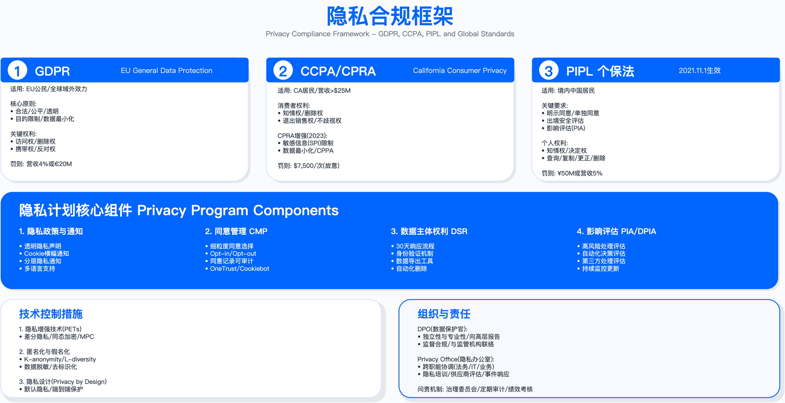

# 9.2 隐私治理框架

## 概述

隐私治理是确保企业持续合规的组织保障与流程体系。与"项目式合规"不同，隐私治理强调将隐私保护融入企业文化、组织架构、决策流程和日常运营，实现隐私管理常态化 (privacy as business as usual)。

本节系统阐述隐私治理的组织架构设计、关键角色职责划分、核心流程 (ROPA 与培训体系) 及实践中的常见挑战，为企业构建可持续隐私管理体系提供方法论指引。

适用边界：本节内容适用于需满足 GDPR、PIPL、CCPA 等法规要求的企业，尤其是跨国运营、处理大规模个人数据或涉及特殊类别数据的组织。对于仅在单一司法辖区运营且数据处理规模较小的企业，可根据实际情况简化组织架构，但核心流程 (ROPA、培训) 仍需建立。

---

## 9.2.1 隐私治理组织架构

### 三层治理模型

隐私治理组织架构通常采用"战略层 - 管理层 - 执行层"三级结构，实现决策权与执行责任的分层授权。

战略层由安全风险管理委员会（隐私专题，GRC 主导）承担，主席通常为 CISO 或 GRC 负责人，成员包括 CPO/DPO、法务、HR、CMO 等关键职能负责人。该层级职责为设定隐私战略方向、批准重大投资、审批高风险项目 DPIA，会议频率通常为季度。

管理层由数据保护官 (DPO) 或首席隐私官 (CPO) 领导，下设隐私运营、隐私法务、隐私工程、区域隐私官等职能团队。该层级负责隐私计划的日常执行、监督合规状态、与监管机构沟通，工作节奏通常为月度。

执行层由隐私拥护者网络 (privacy champions network) 构成，即各业务单元、产品线、地区指定的隐私联络人。该网络负责嵌入式隐私咨询、DPIA 执行协助、DSR 处理、培训传播等日常工作。

三层协同的关键在于：战略层提供资源与决策授权，管理层制定标准与监督执行，执行层将隐私要求嵌入业务流程。若三层之间沟通不畅或职责边界模糊，将导致隐私治理流于形式。

关键约束：
- 组织架构设计需与企业现有治理结构匹配，避免为隐私单独设立与现有 GRC 体系割裂的委员会
- 隐私拥护者网络规模需与业务单元数量、数据处理复杂度匹配，过小则覆盖不足，过大则协调成本过高

常见误区：
1. 将隐私治理完全委托给法务部门，忽视技术实现与业务流程的参与，导致合规要求无法落地
2. 隐私拥护者仅作为"兼职角色"挂名，未分配实际工作时间，导致执行层形同虚设

---

### 数据保护官 (DPO) 角色详解

#### 强制任命情形

GDPR Article 37 规定了以下强制任命 DPO 的情形：公共机构（政府部门、公立医院、公立大学，除法院行使司法职能外）；核心活动涉及大规模系统监控（如行为追踪广告平台、智能安防监控）；核心活动涉及大规模处理特殊类别数据（如医疗保健、基因检测、生物识别）。

对于一般 SaaS、电商、制造业等企业，GDPR 未强制要求任命 DPO，但实践中多数受 GDPR 约束的企业仍选择任命，作为监管沟通窗口和内部合规保障。

验证方法：判断是否需强制任命 DPO，需评估以下条件——是否属于公共机构；核心业务活动是否涉及对数据主体的定期、系统监控；是否大规模处理 Article 9 定义的特殊类别数据或 Article 10 定义的犯罪数据。若任一条件满足，则强制任命。

#### DPO 资质要求

DPO 需具备数据保护法律和实践的专业知识，理解企业业务模式和技术架构，具备风险评估与隐私影响分析能力。专业认证方面，IAPP 提供 CIPP/E（欧洲隐私法）、CIPM（隐私项目管理）、CIPT（隐私技术）三项认证，可作为能力验证参考。经验要求通常为隐私、法律、安全或合规领域的从业经验。

#### DPO 独立性要求 (Article 38)

GDPR 对 DPO 独立性有明确要求，体现在四个方面：

汇报线：DPO 应直接向最高管理层 (CEO、CISO 或总法律顾问) 汇报，避免中间层级对其工作的干预。

决策独立：DPO 不接受关于其职责执行的指示，管理层不能强制要求其改变专业意见。

职位保护：DPO 不因履行职责被解雇或处罚。

利益冲突规避：DPO 不能兼任决定数据处理目的和方式的角色。

利益冲突的典型场景包括：DPO 兼任 CMO/市场 VP（营销目标与隐私保护冲突）、兼任 CTO/产品 VP（产品创新速度与隐私审查冲突）、兼任 IT 安全主管（安全监控与数据最小化原则冲突）。对于法务总监兼任 DPO，EDPB Guidelines 认为原则上可行，但需证明其能独立行使 DPO 职责。

实践解决方案：对于无法保障内部 DPO 独立性的企业，可采用"DPO 功能外包"模式，委托外部律所或咨询公司担任 DPO；或设立独立的 CPO 岗位直接向 CEO 汇报。

#### DPO 核心职责

DPO 的工作可分为四个主要领域：

监督合规：监督 GDPR/PIPL/CCPA 等法规的合规状态，审查 ROPA 完整性，监督 DPIA 执行质量，定期向管理层和安全风险管理委员会报告，准备监管审计材料。

咨询与建议：参与新产品/服务设计审查 (privacy by design)，就隐私影响向业务团队提供建议，指导隐私政策与 cookie 政策更新，评估第三方供应商隐私风险。

监管机构联络：担任监管机构 (DPA) 的联系点，代表企业与 DPA 沟通，协助监管调查和信息请求响应，提交强制通知（数据泄露通知、DPIA 咨询）。

内部培训与意识提升：制定年度隐私培训计划，组织全员基础培训和隐私拥护者深度培训，开展隐私意识活动。

运行指标：
- ROPA 覆盖率（已记录处理活动数 / 实际处理活动数）
- DPIA 完成率（高风险项目 DPIA 完成数 / 高风险项目总数）
- DSR 响应时效达标率（法定期限内响应数 / DSR 总数）
- 隐私培训完成率（已完成培训员工数 / 应培训员工数）

---

### 安全风险管理委员会（隐私专题）运作

隐私治理统一由 GRC 主导的安全风险管理委员会处理，不单独设立隐私委员会，以避免组织碎片化和决策分散。

#### 委员会构成与会议机制

主席：CISO 或 GRC 负责人

投票成员：CEO、CFO、CTO、首席法务官、CPO/DPO、CHRO、CMO

顾问成员：外部隐私律师、区域隐私负责人、安全架构师

会议频率：定期会议每季度召开一次；特别会议在以下情形触发——重大隐私事件、新法规生效、高风险产品上线、监管机构正式调查通知、并购活动涉及大规模数据传输。

#### 季度会议标准议程

常设议题包括：隐私合规仪表板回顾 (DPO 主持，涵盖 ROPA 完成度、DPIA 完成率、DSR 响应时效、培训完成率、隐私事件趋势)；监管变化与影响评估（法务主持，涵盖最新法规更新、对业务的影响评估、需采取的行动项）；高风险项目审批（产品 / 工程主持，涵盖 DPIA 报告审查、风险缓解计划评估、批准决策）。

季度轮换议题按年度周期设置：Q1 进行年度隐私战略与预算审批、年度培训计划审批；Q2 审查供应商隐私审计结果、cookie 合规状态；Q3 进行年中合规自评估、隐私工程能力建设评估；Q4 进行年度回顾与下年度规划、第三方审计准备。

#### 问题升级标准

以下情形需强制升级至委员会决策：

- 高风险 DPIA：DPIA 风险评分超过预设阈值（如新增大规模生物识别功能）
- 跨境传输新国家：首次向新国家传输个人数据
- 重大隐私事件：达到需向监管机构报告级别的事件
- 监管机构正式调查：收到 DPA 调查通知
- 预算大幅超支：隐私项目预算超支超过预设比例
- 政策例外请求：业务请求偏离隐私政策

DPO 可自行决策的事项包括：常规 DSR 处理、隐私政策文字修订（非实质变更）、低风险供应商 DPA 签署、员工隐私咨询答复。

验证方法：定期审计委员会决策记录，验证高风险事项是否按标准升级；抽查 DPO 自行决策事项，确认未越权处理应升级事项。

---

## 9.2.2 处理活动记录 (ROPA)

### ROPA 法规要求与豁免

GDPR Article 30 要求控制者和处理者维护处理活动记录。强制适用对象包括：员工 250 人以上的企业；或处理活动非偶然且可能导致数据主体风险；或包含特殊类别数据 (Article 9) 或犯罪数据 (Article 10)。

豁免仅适用于员工少于 250 人且仅进行偶发低风险处理的企业，实际场景中很少适用。几乎所有企业都应维护 ROPA，作为合规基石和监管审计的首要文档。

#### 控制者 ROPA 必须包含的内容

GDPR 要求控制者 ROPA 包含以下七项内容：控制者及 DPO 联系方式（公司名称、地址、DPO 邮箱）；处理目的（为什么收集和使用数据）；数据主体和数据类别（谁的数据、什么数据）；接收方类别（谁能访问数据，含第三国接收方）；第三国传输（目的地国家及保障措施，如 SCC/BCR/充分性认定）；删除时限（数据保留期）；技术和组织措施（安全措施概述）。

#### 处理者 ROPA 必须包含的内容

处理者 ROPA 需包含五项内容：处理者及 DPO 联系方式；代表哪些控制者处理（客户列表）；处理活动类别（提供的服务类型）；第三国传输（目的地国家及保障措施）；技术和组织措施（安全措施概述）。

---

### ROPA 条目结构化模板

以客户关系管理 (CRM) 系统为例，展示 ROPA 条目的完整结构。

基础信息：ROPA 编号、处理活动名称、最后更新日期、审查者。

控制者信息：公司名称、地址、欧盟代表（如适用）、DPO 联系方式。

处理目的与合法基础：需列明每项处理目的、描述、对应的合法基础 (Article 6 的六项基础之一) 及说明。例如，客户关系管理的目的基于"合同履行"，营销通信的目的基于"同意"。

数据主体与数据类别：列明涉及的数据主体类别（如现有客户、潜在客户、前客户）；列明个人数据类别（身份识别数据、商业数据、技术数据等）并标注是否属于特殊类别数据。

接收方：分内部接收方（如销售团队、市场团队、客户成功团队）和外部处理者，外部处理者需记录供应商名称、服务类型、位置、DPA 签署状态、SCC 版本（如适用）。

第三国传输：记录目的地国家、接收方、保障措施、传输影响评估 (TIA) 完成状态、补充措施。

保留期限：需具体化，不能使用"根据业务需要"等模糊表述。例如：活跃客户数据保留至合同期间加法定保留期；非活跃客户数据在最后互动后特定期限删除或匿名化；营销同意在同意后特定期限或撤回后删除；日志保留特定天数。

技术和组织措施：技术措施包括加密（传输中、静态）、访问控制 (RBAC、最小权限)、认证 (SSO、MFA)、日志、备份；组织措施包括员工培训、保密协议、供应商管理、事件响应流程。

DPIA 评估：记录是否需要 DPIA 及理由。

数据主体权利程序：记录访问权、更正权、删除权、可移植权、反对权的实现方式和响应渠道。

批准与审查：记录批准人、批准日期、下次审查日期、审查触发条件。

---

### ROPA 维护流程

#### 创建新 ROPA 条目流程

流程分为四个阶段：

业务发起：产品或工程团队提交"处理活动申报表"，说明新增或变更的数据处理活动。

信息收集：通过标准化问卷收集信息，问题涵盖：为什么需要这些数据、收集哪些个人数据、从哪里收集、涉及哪类人群、合法基础是什么、数据会分享给谁、是否跨境传输、保留多久。

DPO 审查：完整性检查（七项必填是否齐全）、合法基础验证、跨境传输保障措施确认、DPIA 需求判断。

批准与记录：DPO 签署后录入 ROPA 系统，通知业务团队。

#### ROPA 完整性检查清单

必填项检查（七项）：控制者及 DPO 联系方式已填写；处理目的明确且具体；数据主体和数据类别已列明；接收方完整（内部和外部）；保留期限具体化；安全措施已概述；跨境传输保障措施已记录（如适用）。

深度检查（五项）：跨境传输是否有 SCC/BCR/充分性认定；是否需要 DPIA（大规模处理、特殊类别数据、系统监控）；保留期限是否符合"存储期限限制"原则；合法基础是否有文档支持；子处理者是否签署 DPA。

#### 季度 ROPA 审查机制

审查目标：覆盖率目标为所有处理活动均有 ROPA 记录；时效性目标为无超过审查周期未更新的记录；准确性目标为记录信息与实际处理一致（通过抽样验证）。

审查输出：过期记录需由业务负责人在规定期限内更新；不完整记录由 DPO 跟进补齐；高风险活动 (DPIA 评分超阈值) 提交委员会审批。

常见误区：
1. 保留期限使用模糊表述（如"根据业务需要"、"合理期限"），无法满足 GDPR 存储期限限制原则
2. 跨境传输仅依赖 SCC 签署，未完成传输影响评估 (TIA)，不符合 Schrems II 判决后的要求
3. ROPA 仅在系统上线时创建，后续处理活动变更未触发更新

验证方法：季度抽取一定比例的 ROPA 条目，与实际系统配置和数据流进行比对，验证记录准确性；检查子处理者 DPA 有效期，识别过期未续签的情况。

---

## 9.2.3 隐私培训与意识提升

### 分层培训矩阵

隐私培训应根据受众角色和职责深度分层设计，形成覆盖全员的培训体系。

#### Tier 1：全员基础培训

目标受众：所有员工

频率：年度必修，新员工入职时完成

形式：在线课程配合测验

核心主题：隐私基础（什么是个人数据）、主流法规核心原则 (GDPR/PIPL/CCPA)、员工的隐私责任、如何识别隐私风险、数据泄露报告流程、真实案例分析。

评估：测验需达到设定的正确率阈值方可通过。

运行指标：新员工培训完成率、年度复训完成率。

#### Tier 2：隐私拥护者深度培训

目标受众：各业务单元、产品线、地区的隐私联络人

频率：季度培训配合按需专题

形式：现场研讨会或虚拟培训

核心主题：ROPA 编制实操、DPIA 执行步骤、DSR 处理流程、供应商隐私审查、privacy by design 原则、案例分析与小组讨论。

实操练习：模拟 DPIA 评估（小组完成真实场景）。

#### Tier 3：高风险角色专项培训

针对特定角色设计专项培训内容：

产品经理：privacy by design 实践、功能设计中的隐私考虑、DPIA 触发条件、用户同意收集方式、暗黑模式 (dark patterns) 规避。

工程师：安全编码与数据泄露防护、最小权限原则实施、数据匿名化技术、日志记录的隐私风险、第三方 SDK 隐私评估。

数据科学家：differential privacy、federated learning、模型解释性与 GDPR Article 22 自动化决策要求、训练数据中的 PII 检测、合成数据生成。

市场团队：营销同意管理、CCPA opt-out 要求、第三方营销工具隐私审查、cookie 合规、客户数据分段的隐私边界。

HR 团队：员工数据特殊保护、招聘中的隐私合规、绩效数据保留、员工监控的合法性、离职员工数据处理。

#### Tier 4：高管简报

目标受众：CEO、CFO、CTO、董事会

频率：年度常规简报，重大事件时专题简报

形式：仪表板配合执行摘要

核心主题：全球隐私监管趋势、重大处罚案例与启示、公司隐私合规状态（关键指标）、隐私投资价值、隐私作为竞争优势的案例。

---

### 培训效果度量体系

培训效果度量应覆盖从参与到行为改变的完整链条。

#### 参与度指标（领先指标）

跟踪培训完成率、平均完成时间、中途退出率。完成率未达标时，可通过自动提醒、经理问责等方式改进；退出率过高时，需优化课程设计、增加互动性。

#### 知识保留指标（中间指标）

通过即时后测、培训后一定周期的保留测试（如三个月、六个月）评估知识掌握与遗忘曲线。若保留测试得分下降明显，可引入间隔重复 (spaced repetition) 机制强化记忆。

#### 行为改变指标（滞后指标）

核心改进证据包括：DSR 响应时间变化（培训前后对比）、privacy by design 采纳率（新产品 DPIA 覆盖率变化）、员工主动风险报告数量变化（正向指标，数量增加表示意识提升）。

#### 合规成果指标（业务成果）

包括内部审计隐私问题发现数量变化、重复违规率变化。这些指标反映培训对实际合规状态的影响。

验证方法：通过对照组设计评估培训效果——对部分员工提前培训，比较其与未培训员工在知识测试和行为指标上的差异。

---

### 培训创新实践

#### 游戏化机制

可引入积分系统激励参与，如完成模块、测验满分、帮助同事、实际识别隐私风险等行为获得积分。设置徽章体系标识不同能力等级，如基础培训完成徽章、累计积分与帮助行为达标徽章、获得专业认证与识别真实风险徽章。可设置部门内竞争排行榜，定期表彰表现优异者。

挑战活动示例：隐私侦探活动（识别日常工作中的隐私风险并报告）、DPIA 马拉松（限时完成模拟 DPIA）。

#### 微学习 (microlearning)

形式为每周短时长视频配合情景题，时长控制在便于碎片化学习。主题选取真实案例，如 cookie 横幅设计错误案例、营销邮件退订要求、员工数据最小化实例。微学习的优势在于持续强化，符合成人学习规律中的间隔重复效应。

关键约束：
- 游戏化机制的激励设计需与企业文化匹配，避免过度竞争导致负面效果
- 微学习内容需保持更新频率，使用过时案例将降低培训可信度

---

## 9.2.4 隐私治理成熟度模型

### 五级成熟度框架

隐私治理成熟度可分为五个等级：

Level 1 被动合规 (reactive)：特征为无专职 DPO，仅在监管压力下响应，无 ROPA。典型于初创企业或非欧盟市场企业。

Level 2 项目式合规 (compliance project)：特征为任命兼职 DPO，建立基础 ROPA，为法规生效进行突击准备。典型于首次进入欧盟市场的中小企业。

Level 3 持续合规 (ongoing compliance)：特征为专职 DPO 团队，完整 ROPA 与 DPIA 流程，季度审查机制。典型于成熟的欧美市场主体企业。多数企业应以此为初期目标。

Level 4 主动管理 (proactive management)：特征为建立隐私拥护者网络，privacy by design 嵌入产品开发流程，部署自动化工具。典型于大型科技公司。

Level 5 隐私领先 (privacy leadership)：特征为将隐私作为竞争优势，投入前沿隐私增强技术 (PETs) 研发，参与行业标准制定。典型企业如 Apple、Signal、DuckDuckGo。

### 成熟度自评问卷

通过以下问题进行自评：

1. 是否任命独立 DPO 并提供充足资源
2. 是否维护完整的 ROPA（覆盖绝大多数处理活动）
3. 高风险项目是否强制执行 DPIA
4. 是否有正式的安全风险管理委员会（隐私专题）
5. 全员隐私培训完成率是否达到目标水平
6. DSR 平均响应时间是否在法定期限内
7. 是否部署自动化隐私工具 (CMP/DSR/DPIA)
8. 隐私政策是否定期审查更新
9. 是否进行定期第三方隐私审计
10. privacy by design 是否嵌入产品开发流程

根据"是"的数量判断成熟度等级：较少肯定回答对应 Level 1-2，中等数量对应 Level 3，较多数量对应 Level 4，绝大多数或全部肯定回答对应 Level 5。

---

## 本节小结

隐私治理是持续的组织能力建设，而非一次性合规项目。

组织维度：三层治理架构 (GRC 主导的安全风险管理委员会 - DPO 管理层 - 隐私拥护者网络) 实现决策与执行分层；DPO 独立性是制度保障的核心，需通过汇报线设计、职位保护、利益冲突规避来实现；隐私治理需要法务、IT、产品、市场等职能的跨部门协作，不能仅依赖 DPO 一人之责。

流程维度：ROPA 是合规基石，需覆盖所有处理活动并保持更新；完整性检查（七项必填加五项深度检查）避免形式主义；问题升级机制确保高风险事项得到委员会层面的决策。

文化维度：分层培训体系覆盖全员基础、拥护者深度、高风险角色专项、高管简报四个层次；效果度量从参与度、知识保留、行为改变到合规成果形成完整链条；游戏化和微学习等创新实践可提升培训效果。

成熟度演进路径：从被动合规逐步演进至项目式合规、持续合规、主动管理，最终达到隐私领先。多数企业应以 Level 3 持续合规为初期目标，在此基础上向 Level 4 和 Level 5 演进。

常见误区（需规避）：
1. 形式主义：ROPA 记录不完整或过期，DPIA 走过场不深入评估风险
2. 孤岛作战：DPO 与业务团队脱节，成为"合规警察"而非业务顾问
3. 工具迷信：购买 GRC 平台但无流程支撑，工具利用率低
4. 培训无效：仅进行形式化培训，无效果度量，员工行为无实质改变

---

## 延伸阅读

监管指南：
- EDPB: Guidelines on Data Protection Officers (DPOs) - WP243 rev.01
- EDPB: Guidelines on Records of Processing Activities - Article 30
- ICO: Accountability and governance toolkit

行业框架：
- ISO/IEC 27701:2019 - Privacy Information Management System
- NIST Privacy Framework: Core Functions (Identify-Govern-Control-Communicate-Protect)
- AICPA SOC 2: Privacy criteria

专业认证：
- IAPP CIPM: Certified Information Privacy Manager
- IAPP CIPP/E: Certified Information Privacy Professional/Europe
- ISACA CDPSE: Certified Data Privacy Solutions Engineer

---

## 导航

**[← 上一节：9.1 全球隐私法规体系](./9.1_global_privacy_regulations.md)** | **[返回章节目录](./README.md)** | **[下一节：9.3 个人数据处理合规 →](./9.3_personal_data_processing.md)**

---

**© 2025 AI-ESA Project. Licensed under CC BY-NC-SA 4.0**

