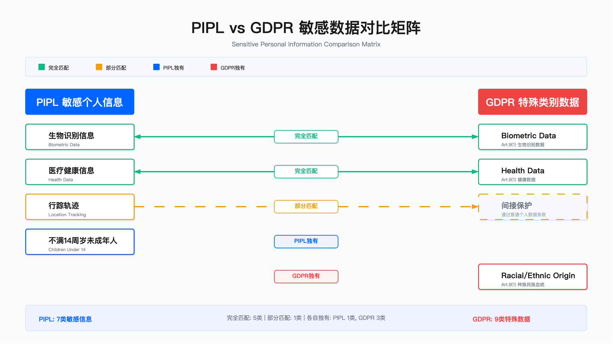

# 9.3 个人数据处理合规

## 概述

个人数据处理合规构成隐私法规的核心要求。企业需完成四项关键工作：准确识别个人数据并建立分类体系、为每类处理活动选择合法基础、对高风险处理活动执行数据保护影响评估（DPIA）、对特殊类别数据和儿童数据采取增强保护措施。本节从工程落地视角，阐述各环节的决策要点、约束条件与验证方法。

---

## 9.3.1 个人数据的识别与分类

### 全球法规对"个人数据"的定义差异

不同法规对"个人数据"的边界界定存在差异，这直接影响数据发现工具的配置范围与合规判断逻辑。下表列出三大主流法规的定义要点：

| 法规 | 核心定义 | 关键范围扩展 | 独特要求 |
|------|---------|-------------|---------|
| GDPR | 已识别或可识别自然人相关的任何信息 | 在线标识符纳入保护范围（IP 地址、Cookie、设备 ID、RFID 标签） | 可识别性判断需考虑"合理可能使用的手段" |
| PIPL | 以电子或其他方式记录的与已识别或可识别自然人有关的各种信息 | 明确排除匿名化数据 | 敏感信息范围更广，含行踪轨迹、未满 14 周岁信息 |
| CCPA/CPRA | 直接或间接识别、关联、描述、能够与特定消费者或家庭关联的信息 | 家庭级数据（household data）受保护 | 包含推断数据（性格、倾向、行为） |

上表反映的核心权衡在于：GDPR 采用最宽泛的定义（含在线标识符），对技术团队的数据发现覆盖度要求最高；CCPA 将保护范围扩展至家庭级别与推断数据，增加了数据分类的复杂度；PIPL 则将未满 14 周岁信息直接归入敏感类别，触发更严格的处理要求。

### 个人数据分类框架

企业通常采用三层分类体系，将识别难度与风险等级对应起来。该分类与 [8.2 数据分类与标记](../../chapter_08_data_security/8.2_data_classification_labeling.md) 中的四级通用分类体系对齐，确保隐私合规要求与数据安全保护措施一致：

| 分类层级 | 定义 | 典型示例 | 风险等级 | 保护要求 | 对应通用分级 |
|---------|------|---------|---------|---------|-------------|
| 直接标识符 | 单独即可识别个人 | 姓名、邮箱、电话、身份证号、护照号、社保号 | 高 | 加密存储、严格访问控制、审计日志 | Confidential |
| 准标识符 | 组合后可识别 | 邮编 + 年龄 + 性别、IP 地址 + 时间戳、设备 ID + 位置 | 中 | 假名化/匿名化处理、限制组合查询 | Internal - Confidential |
| 敏感数据（特殊类别个人数据）<br>GDPR Art.9 / PIPL Art.28 | 可能造成歧视或重大伤害 | 健康信息、生物识别、种族、宗教、性取向、工会、基因、14 岁以下儿童数据 | 极高 | 单独同意、最小化处理、DPIA、加密、访问限制 | Restricted |



适用边界：该三层分类适用于结构化数据库与半结构化文档的初始分类；对于非结构化数据（如邮件正文、即时通讯记录），需结合内容识别技术进行动态分类。

关键约束：
- 准标识符的"可识别性"判断依赖上下文——同一字段组合在不同数据集中的可识别性不同
- 分类标准需与数据发现工具的检测规则对齐，否则产生系统性漏报或误报

常见误区：
1. 将分类视为一次性工作，忽略数据生命周期中的动态再分类（如用户画像数据随时间积累可能升级为敏感数据）
2. 仅依赖列名启发式分类，忽略字段内容的实际语义（如"备注"字段可能存储身份证号）

### 自动化 PII 识别技术实践

PII 自动发现通常采用多种技术组合，各技术在准确率、性能与成本间存在权衡：

| 技术方法 | 实现方式 | 优势 | 局限性 | 成本 |
|---------|---------|------|--------|------|
| 正则表达式匹配 | 模式库匹配（邮箱、电话、身份证） | 速度快、准确率高、无需训练 | 仅限格式化数据、易产生误报 | 低 |
| NER 命名实体识别 | 机器学习模型识别人名、地点 | 可识别自然语言中的 PII | 需要训练数据、中文支持待优化 | 中 |
| 数据库扫描 | 基于列名/数据特征启发式 | 覆盖结构化数据 | 依赖命名规范、假阳性率高 | 低 |
| 内容指纹 | 数据指纹 + 敏感词库 | 可发现重复敏感文档 | 无法识别未见过的模式 | 低 |
| 上下文分析 | AI 理解语义上下文 | 准确率较高、语言无关 | 计算成本高、延迟大 | 高 |

验证方法：
- 使用已标注的测试数据集评估各技术的准确率与召回率
- 对误报案例进行分类分析，识别规则调优方向
- 定期抽样人工复审，验证自动化分类结果的可靠性

运行指标：
- PII 发现覆盖率：已扫描数据源占生产数据源总数的比例
- 分类准确率：人工复审样本中分类正确的比例
- 误报率：标记为敏感但实际非敏感的记录占比

### 个人数据识别决策树

识别流程可结构化为以下决策路径：

```
┌─ 数据元素 ────────────────────────────────────────┐
│                                                   │
├─ 问题 1: 是否与自然人相关？                       │
│   ├─ 否 → 非个人数据（如公司名称）                 │
│   └─ 是 → 继续                                    │
│                                                   │
├─ 问题 2: 是否单独可识别个人？                     │
│   ├─ 是 → 直接标识符（高风险）                     │
│   └─ 否 → 继续                                    │
│                                                   │
├─ 问题 3: 是否与其他数据组合后可识别？              │
│   ├─ 是 → 准标识符（中风险）                       │
│   └─ 否 → 继续                                    │
│                                                   │
├─ 问题 4: 是否已不可逆匿名化？                     │
│   ├─ 是 → 非个人数据（GDPR Recital 26）            │
│   │       注意：PIPL 要求"无法识别且不能复原"       │
│   └─ 否 → 个人数据                                │
│                                                   │
└─ 问题 5（若为个人数据）: 是否属于特殊类别？        │
    ├─ 健康 / 生物识别 / 种族 / 宗教 / 性取向等      │
    │   → 敏感数据（极高风险，GDPR Art.9 禁止原则）   │
    └─ 否 → 普通个人数据                            │
```

---

## 9.3.2 合法基础的选择

### GDPR 六项合法基础对比

GDPR Article 6 规定六项合法基础，每项基础有其适用场景与实施要求：

| 合法基础 | 适用场景 | 实施要求 | 风险等级 |
|---------|---------|---------|---------|
| (a) 同意 | 营销邮件、非必要 Cookie、第三方分享 | 自由给予、具体、知情、明确表示、可撤回 | 高 |
| (b) 合同履行 | 电商订单、SaaS 账户、物流配送 | 处理对合同履行必要，或签约前准备 | 中 |
| (c) 法律义务 | 税务申报、反洗钱、劳动法合规 | 需 EU/成员国法律明确要求 | 低 |
| (d) 生命利益 | 医疗急救、灾难救援 | 仅当无法通过其他方式保护生命 | 低 |
| (e) 公共任务 | 政府服务、公共卫生 | 需法律授权公共职能 | 低 |
| (f) 合法利益 | 网络安全、欺诈检测、直接营销（现有客户） | 三步测试：目的正当 + 必要 + 平衡测试（LIA） | 中-高 |

选择原则：同意基础提供最高灵活性但管理成本高（需证明有效同意、处理撤回）；合同履行基础最稳定但适用范围狭窄；合法利益基础最灵活但易被挑战，需准备完整的 LIA 文档。

### 合法基础选择常见错误

以下错误模式可从监管执法案例中归纳：

| 错误行为 | 监管机构观点 | 正确做法 |
|---------|-------------|---------|
| "同意墙" | 将同意作为访问服务的条件 → 同意非"自由给予" | 提供"拒绝后仍可使用"选项，或切换到合法利益 |
| 超范围同意 | 一次同意覆盖多个目的 → 违反"具体性"要求 | 按目的分开请求同意（如：营销邮件/数据分析/第三方分享） |
| 合同履行滥用 | 将非必要处理伪装成"合同履行" | 仅用于订单处理/交付等核心合同功能 |
| 合法利益未做 LIA | 声称合法利益但无法提供平衡测试文档 | 为每个合法利益用例准备 LIA 文档 |

关键约束：
- 合法基础一旦选定，后续变更需重新告知数据主体
- 敏感数据处理不能仅依赖 Article 6 合法基础，还需满足 Article 9(2) 例外条件

### 合法利益评估（LIA）框架

合法利益是最灵活但最易被挑战的合法基础，需通过三步测试：

LIA 三步测试流程：

```
┌─ Step 1: 目的测试 ──────────────────────────────┐
│ 问题：处理目的是否合法且足够明确？               │
│ 合法示例：网络安全监控/欺诈检测/直接营销         │
│ 不合法示例：非法活动/误导性营销                  │
└─────────────────────────────────────────────────┘
                        ↓
┌─ Step 2: 必要性测试 ────────────────────────────┐
│ 问题：处理是否是实现目的的必要手段？             │
│ 检查要点：                                       │
│   • 是否有侵入性更小的替代方案？                 │
│   • 数据是否最小化？                             │
│   • 保留期限是否合理？                           │
└─────────────────────────────────────────────────┘
                        ↓
┌─ Step 3: 平衡测试 ──────────────────────────────┐
│ 问题：企业利益是否超过个人权利/自由？            │
│ 考虑因素：                                       │
│   • 数据主体的合理期望                           │
│   • 数据的性质和敏感性                           │
│   • 处理的方式和影响                             │
│   • 数据主体与控制者的关系                       │
│   • 是否提供了 opt-out 机制                      │
└─────────────────────────────────────────────────┘
```

LIA 文档必填要素：

| 必填要素 | 说明 | 示例 |
|---------|------|------|
| 处理目的 | 企业寻求实现的具体利益 | "检测和预防信用卡欺诈" |
| 处理方式 | 收集哪些数据、如何使用、保留多久 | "分析近 90 天交易模式、设备指纹、IP 地理位置" |
| 合理期望 | 数据主体是否预期此用途 | "用户注册时告知反欺诈措施，符合合理期望" |
| 替代方案 | 是否考虑了其他实现方式 | "评估了基于同意的方案，但欺诈分子会拒绝同意" |
| 数据主体影响 | 对个人权利的潜在影响 | "误报可能导致交易被拒，已设人工复审" |
| 保障措施 | 减轻影响的技术/组织措施 | "假名化处理 + 访问限制 + 人工复审权" |
| opt-out 机制 | 是否提供反对权 | "用户可反对，但账户可能被限制（告知后果）" |
| 平衡结论 | 为何企业利益超过个人权利 | "保护所有用户免受欺诈的公共利益 > 个人便利性影响" |

适用边界：合法利益适用于网络安全日志分析、现有客户直接营销；不适用于儿童数据的任何营销、敏感数据处理、从购买名单获取的新客户营销。

验证方法：
- 法务审查 LIA 文档的完整性与逻辑自洽性
- 模拟监管质询场景，测试 LIA 文档能否回答典型问题
- 定期复审 LIA 结论是否因业务变化而失效

---

## 9.3.3 数据保护影响评估（DPIA）

### DPIA 触发条件

根据 GDPR Article 35，以下情况强制要求执行 DPIA：

三类强制情形：

| 触发情形 | GDPR 原文要点 | 典型场景 |
|---------|---------------|---------|
| 系统性大规模评估 | 基于自动化处理（含 profiling）的系统性和广泛评估，并作为对个人产生法律效力或类似重大影响的决策依据 | 信用评分系统、保险自动定价、招聘算法筛选、贷款审批 AI |
| 大规模特殊类别数据 | 大规模处理 Article 9 特殊类别或 Article 10 犯罪数据 | 医疗健康平台、基因检测服务、员工健康监测、背景调查系统 |
| 大规模系统监控 | 大规模系统性监控公共可访问区域 | 城市级视频监控 + 人脸识别、商场客流追踪、智能楼宇全方位监控 |

EDPB 额外触发标准（9 项）——符合 2 项或更多强烈建议执行 DPIA：

| 标准 | 说明 |
|------|------|
| 评估 / 评分 | profiling 和预测 |
| 自动化决策 + 法律 / 重大影响 | 无人工干预的决策 |
| 系统性监控 | 持续 / 定期监控 |
| 敏感数据 | Article 9 或 10 数据 |
| 大规模处理 | 大量数据主体 |
| 数据集匹配 / 组合 | 来自不同来源 |
| 弱势群体数据 | 儿童、员工、精神病患者、难民 |
| 创新技术 | AI、区块链、IoT、人脸识别 |
| 阻止权利行使 | 阻止访问服务 / 合同 |

常见误区：
1. 推荐系统（如内容推荐）通常不触发 DPIA（无法律效力），但若用于儿童仍建议执行
2. 单个摄像头通常不触发 DPIA，需满足"系统性 + 大规模 + 公共区域"才触发
3. "大规模"无具体数字定义，需综合考虑数据主体数量、数据量、持续时间、地理范围

### DPIA 执行流程

标准执行流程包括八个阶段：

```
┌─ 阶段 1: 启动 ─────────────────────────────────┐
│ 1.1 判断是否需要 DPIA（触发条件检查）             │
│ 1.2 任命 DPIA 团队（项目负责人 + DPO + 技术专家） │
│ 1.3 确定处理活动范围                             │
└────────────────────┬────────────────────────────┘
                     ↓
┌─ 阶段 2: 描述 ─────────────────────────────────┐
│ 2.1 详细描述处理活动                             │
│     • 性质（what）：收集哪些数据                  │
│     • 范围（scope）：多少人、哪些类别             │
│     • 背景（context）：与数据主体关系、合理期望   │
│     • 目的（purpose）：为什么需要                 │
│     • 方式（how）：技术架构、自动化程度           │
│ 2.2 绘制数据流图（收集 → 存储 → 使用 → 共享 → 删除）│
│ 2.3 识别涉及的处理者和第三方                     │
└────────────────────┬────────────────────────────┘
                     ↓
┌─ 阶段 3: 合规性评估 ───────────────────────────┐
│ 3.1 合法基础确认（Article 6 或 9）               │
│ 3.2 数据最小化检查                               │
│ 3.3 目的限制检查                                 │
│ 3.4 保留期限明确                                 │
│ 3.5 准确性保障                                   │
│ 3.6 咨询数据主体或其代表（如适用）               │
└────────────────────┬────────────────────────────┘
                     ↓
┌─ 阶段 4: 风险识别与评估 ───────────────────────┐
│ 4.1 识别对个人的风险                             │
│     风险类型：未授权访问/数据泄露、算法偏见/歧视、│
│     功能蠕变（目的外使用）、身份盗窃、声誉损害、 │
│     经济损失、物理伤害                           │
│ 4.2 评估可能性（likelihood）                     │
│ 4.3 评估严重性（severity）                       │
│ 4.4 计算总风险（likelihood × severity）          │
└────────────────────┬────────────────────────────┘
                     ↓
┌─ 阶段 5: 缓解措施 ─────────────────────────────┐
│ 5.1 技术措施                                     │
│     • 加密（传输/静态）                          │
│     • 访问控制：RBAC、MFA、最小权限              │
│     • 匿名化/假名化                              │
│     • 审计日志（不可篡改）                       │
│     • 定期渗透测试、漏洞扫描                     │
│ 5.2 组织措施                                     │
│     • 员工培训（年度隐私培训）                   │
│     • DPA 与供应商签署                           │
│     • 事件响应计划                               │
│     • 定期合规审计                               │
│     • 透明隐私政策                               │
│ 5.3 privacy by design                            │
│     • 默认最严隐私设置                           │
│     • 数据最小化                                 │
│     • 用户控制（隐私仪表板）                     │
│     • 可撤销同意机制                             │
└────────────────────┬────────────────────────────┘
                     ↓
┌─ 阶段 6: 剩余风险评估 ─────────────────────────┐
│ 6.1 重新评估实施缓解措施后的剩余风险             │
│ 6.2 风险接受决策                                 │
│     • low：可接受，DPO 批准即可                  │
│     • medium：需 DPO 审批 + 条件监控             │
│     • high/critical：需安全风险管理委员会批准，  │
│       考虑是否继续                               │
└────────────────────┬────────────────────────────┘
                     ↓
┌─ 阶段 7: DPO 咨询与批准 ────────────────────────┐
│ 7.1 DPO 提供建议（GDPR Art.35(2) 强制要求）      │
│ 7.2 决策：approved/approved with conditions/     │
│     rejected                                     │
│ 7.3 记录批准人和日期                             │
└────────────────────┬────────────────────────────┘
                     ↓
┌─ 阶段 8: 定期审查 ─────────────────────────────┐
│ 8.1 设定下次审查日期                             │
│ 8.2 审查触发条件                                 │
│     • 技术变更                                   │
│     • 处理目的变更                               │
│     • 新的数据源                                 │
│     • 数据泄露事件                               │
│     • 法规更新                                   │
└─────────────────────────────────────────────────┘
```

### DPIA 风险矩阵

标准 DPIA 风险评估采用可能性与严重性的矩阵：

```
严重性（severity） →
          │  低   │  中   │  高   │ 极高  │
──────────┼───────┼───────┼───────┼───────┤
 极高     │  中   │  高   │ 极高  │不可接受│
──────────┼───────┼───────┼───────┼───────┤
 高       │  中   │  高   │ 极高  │ 极高  │
──────────┼───────┼───────┼───────┼───────┤
 中       │  低   │  中   │  高   │ 极高  │
──────────┼───────┼───────┼───────┼───────┤
 低       │  低   │  低   │  中   │  高   │
    ↑
可能性（likelihood）

风险处理决策：
- 低：接受，常规监控
- 中：DPO 批准，季度审查
- 高：安全风险管理委员会批准，实施额外缓解措施，月度监控
- 极高/不可接受：项目重新设计或终止
```

验证方法：
- 对已完成的 DPIA 进行第三方审计，验证风险识别的完整性
- 在项目上线后跟踪实际风险事件，与 DPIA 预测进行对比
- 定期复审 DPIA 结论，评估缓解措施的持续有效性

运行指标：
- DPIA 完成时效：从触发到批准的平均时长
- DPIA 审查触发率：因变更触发增量审查的 DPIA 占比
- 剩余风险接受率：按风险等级统计的接受决策分布

---

## 9.3.4 特殊类别数据的处理

### GDPR Article 9 特殊类别数据

GDPR Article 9 对以下八类数据原则上禁止处理：

| 特殊类别 | 定义要点 | 典型场景 | 监管关注点 |
|---------|---------|---------|-----------|
| 种族或民族出身 | 直接声明或推断 | 人口统计、多元化报告 | 禁止用于歧视性定价/招聘 |
| 政治观点 | 政党成员、政治捐款、投票倾向 | 政治竞选、社交媒体分析 | 防范政治操纵风险 |
| 宗教或哲学信仰 | 宗教身份、无神论 | 宗教组织会员管理 | 需明确同意，严格限制范围 |
| 工会成员身份 | 工会注册、劳工组织 | 工会活动 | 雇主不得用于就业歧视 |
| 基因数据 | DNA 测序、基因检测 | 亲子鉴定、疾病风险评估 | 保险/就业歧视风险极高 |
| 生物识别数据（用于唯一识别） | 指纹、虹膜、人脸、声纹 | 生物识别门禁、设备解锁 | 仅"用于唯一识别"时才属特殊类别 |
| 健康数据 | 疾病史、处方、心理健康、残疾 | 医疗服务、健康保险、可穿戴设备 | 范围最广，包括推断的健康信息 |
| 性生活或性取向 | 性偏好、性活动 | 约会 app、LGBTQ+ 社区 | 高度敏感，易被用于歧视 |

### Article 9(2) 十项例外条件

尽管原则禁止，GDPR Article 9(2) 提供十项例外：

| 例外条件 | 适用门槛 | 典型应用 |
|---------|---------|---------|
| (a) 明确同意 | 比一般同意更高标准 | 基因检测服务、健康 app |
| (b) 就业/社会保障法律义务 | 需成员国劳动法/社保法要求 | 职业健康检查、残疾就业配额 |
| (c) 保护生命利益 | 数据主体无法给予同意 | 医疗急救（昏迷患者） |
| (d) 非营利机构合法活动 | 宗教/工会/政党/基金会 | 成员数据管理 |
| (e) 数据主体明显公开 | 数据主体主动公开 | 政客公开政治观点 |
| (f) 法律诉讼/司法职能 | 法院/仲裁程序 | 健康记录作诉讼证据 |
| (g) 重大公共利益 | 需 EU/成员国法律授权 | 传染病追踪 |
| (h) 医疗保健/社会照料 | 专业人员或法律保密义务 | 医院治疗、健康保险理赔 |
| (i) 公共卫生 | 疫情防控、药品监测 | 疫苗接种记录、传染病监测 |
| (j) 公共利益存档/研究/统计 | 历史研究、科学研究 | 医学研究（需伦理审批） |

实务注意事项：
- "明确同意"需满足：不能 pre-ticked、需明确提及特殊类别、需独立于其他同意
- "就业法"需具体法律依据，不能仅"一般劳动法"
- "数据主体明显公开"需真正"明显公开"（如社交媒体公开帖），谨慎使用

### 生物识别数据合规实践

生物识别数据是 GDPR Article 9 中最易误解的类别，关键判断标准：是否用于唯一识别自然人。

生物识别数据判断决策树：

```
┌─ 生物识别技术 ───────────────────────────────────┐
│                                                  │
├─ 问题 1: 是否用于"唯一识别"自然人？              │
│                                                  │
│   属 Article 9（用于唯一识别）：                 │
│   • 人脸识别门禁（识别具体员工）                 │
│   • 指纹解锁手机（识别设备主人）                 │
│   • 虹膜扫描支付（识别账户持有人）               │
│                                                  │
│   不属 Article 9（非唯一识别）：                 │
│   • 人脸检测统计客流量（不识别个人）             │
│   • 年龄估算（18+ 验证，无身份关联）             │
│   • 情绪识别（分析表情，不识别身份）             │
│                                                  │
├─ 若"是" → 继续评估合规要求                      │
│                                                  │
├─ 问题 2: 选择哪种 Article 9(2) 例外？           │
│   常见选择：                                     │
│   • (a) 明确同意：用户主动注册                   │
│   • (b) 就业法：员工考勤（需本地劳动法支持）     │
│   • (c) 生命利益：医院紧急识别昏迷患者           │
│                                                  │
├─ 问题 3: DPIA 是否已执行？                      │
│   必须执行（Article 35 强制）                    │
│                                                  │
├─ 问题 4: 安全措施是否充分？                     │
│   必需措施：                                     │
│   • 模板保护（不存储原始生物特征）               │
│   • 加密存储                                     │
│   • 活体检测（防照片欺骗）                       │
│   • 数据分离（生物特征与身份信息分库）           │
│                                                  │
├─ 问题 5: 是否符合地方额外法规？                 │
│   特殊地区：                                     │
│   • 美国伊利诺伊州 BIPA：需书面同意 + 保留限制   │
│   • 欧盟 AI Act：实时远程生物识别 = 高风险 AI 系统│
│   • 中国 PIPL：生物识别需单独同意                │
│                                                  │
└─ 问题 6: 公共场所使用需特别授权                 │
   欧洲多国 DPA 高度限制公共场所实时人脸识别       │
   需法律明确授权（如执法 / 国家安全）             │
```

生物识别合规要点：
- 合规示范模式：本地处理（不上传云端）+ 用户主动设置 + 透明告知 + 用户可随时关闭
- 高风险模式：大规模抓取公开照片建人脸数据库，未获明确同意
- 公共场所生物识别需明显标识；情绪识别也可能违反 GDPR（profiling）

---

## 9.3.5 儿童数据保护

### 全球儿童数据保护年龄门槛

| 法规 | 年龄门槛 | 特殊要求 |
|------|---------|---------|
| GDPR | 16 岁（成员国可降至 13 岁） | 信息社会服务（ISS，如社交媒体）需父母同意；各国实际年龄差异大 |
| PIPL | 14 岁 | 未满 14 周岁信息属敏感个人信息；需父母/监护人同意；需制定专门儿童个人信息保护规则 |
| CCPA/CPRA | 13 岁（+ 16 岁分段） | 13 岁以下需父母同意；13-16 岁需儿童自己 opt-in 同意 |
| COPPA（美国） | 13 岁 | 针对 13 岁以下儿童的服务；需"可验证的父母同意"（VPC） |

GDPR 各成员国实际年龄门槛差异：
- 13 岁：比利时、丹麦、爱沙尼亚、芬兰、拉脱维亚、马耳他、葡萄牙、瑞典
- 14 岁：奥地利、保加利亚、塞浦路斯、意大利、立陶宛、西班牙
- 15 岁：捷克、法国、希腊、斯洛文尼亚
- 16 岁：克罗地亚、德国、匈牙利、爱尔兰、卢森堡、荷兰、波兰、罗马尼亚、斯洛伐克

实务挑战：面向欧洲的社交 app 需在注册流程中适配多个不同年龄标准，或采用保守策略（统一按 16 岁）。

### 年龄验证技术选择

企业面临"儿童保护"与"用户隐私"的两难：严格年龄验证（如上传 ID）侵犯隐私，宽松验证（如自报年龄）易被绕过。

| 方法 | 实现方式 | 准确性 | 用户体验 | 隐私风险 | 适用场景 |
|------|---------|-------|---------|---------|---------|
| 中性年龄门 | 注册时要求出生日期 | 低（易虚报） | 好 | 低 | 低风险服务 |
| AI 年龄估算 | 面部分析估算年龄 | 中 | 差（需拍照） | 高（面部数据） | 存在合法性质疑，慎用 |
| 第三方验证 | 身份证/驾照扫描 + AI 验证 | 高 | 差 | 高（政府 ID） | 高风险服务（约会 app/在线赌博） |
| 信用卡验证 | 输入信用卡（18+ 假设） | 中 | 中 | 中 | 付费服务 |
| 行为信号推断 | 设备型号/使用时间/内容偏好 | 低（不精确） | 好（无感） | 中 | 辅助手段，不可单独依赖 |

关键约束：
- AI 年龄估算存在误差，且面部数据本身构成敏感信息，多国 DPA 质疑其合法性
- 第三方 ID 验证用户体验差，显著影响转化率
- 行为信号推断准确度不足以作为合规依据

### 父母同意机制

美国 COPPA 是全球儿童数据保护要求较严格的法规之一，FTC 批准的"可验证父母同意"（VPC）方法：

| VPC 方法 | 流程 | 优点 | 缺点 |
|---------|------|------|------|
| 签署同意书 | 父母打印/签名/扫描或邮寄 | FTC 明确认可 | 用户体验差，需人工审核 |
| 信用卡验证 | 收取小额验证费后退款 | 自动化，成本低 | 部分父母无信用卡 |
| 视频通话 | 工作人员视频验证身份 + 口头同意 | 可信度高 | 排期困难，成本高 |
| 政府 ID 验证 | 上传驾照/护照 + 自拍，AI 验证 | 高准确性，自动化 | 隐私顾虑（存储敏感 ID） |
| 知识问答 | 回答信用记录问题 | 无需上传文件 | 仅限美国，排除无信用记录者 |

梯度策略建议：
- 免费服务：信用卡验证（主）+ 邮寄同意书（备选）
- 付费服务：政府 ID 验证（用户已支付，接受度相对较高）
- 高风险服务：视频通话 + 政府 ID（双重验证）

### 英国适龄设计规范（UK Age Appropriate Design Code）

英国 AADC 是专门针对儿童在线服务的系统性法规，其核心原则包括：

| 核心原则 | 要求 | 实施示例 |
|---------|------|---------|
| 儿童最佳利益 | 设计时优先考虑儿童福祉 > 商业利益 | 为低龄用户默认私密账号 |
| DPIA 强制 | 针对儿童用户必须执行 DPIA | 儿童类产品执行专项 DPIA |
| 适龄设计 | 根据年龄段差异化设计 | 分级内容过滤 |
| 透明度 | 使用儿童能理解的简明语言 | 隐私政策视频版（低龄） |
| 禁止利用儿童数据 | 禁止个性化广告/nudging 分享更多数据 | 禁止儿童内容个性化广告 |
| 默认高隐私 | 默认：最严隐私 + 地理位置关闭 + 仅好友可见 | 青少年用户默认仅好友可见 |
| profiling 禁止 | 默认关闭，除非符合儿童最佳利益 | 低龄用户关闭个性化推荐 |
| nudging 禁止 | 不得诱导延长使用/提供更多数据 | 移除"你朋友都分享了位置"提示 |

### 儿童数据保护实施检查清单

| 检查项 | 证据/措施 |
|--------|----------|
| 是否明确定义目标用户年龄 | 服务条款/营销材料/实际用户画像 |
| 是否实施了年龄门（age gate） | 技术实现方式 + 绕过防护 |
| 是否获得父母同意（低于门槛） | VPC 方法选择 + 同意记录留存 |
| 是否执行儿童专项 DPIA | DPIA 报告 + DPO 签字 |
| 是否默认高隐私设置 | 地理位置/账号可见性/数据收集 |
| 是否禁止个性化广告 | 广告投放策略 + 年龄判断逻辑 |
| 是否提供父母控制工具 | 家长 dashboard/内容过滤/使用时长限制 |
| 是否使用儿童友好语言 | 隐私政策/同意表单可读性测试 |
| 是否禁止 nudging 技术 | UI 设计审查 + 暗模式检测 |
| 数据保留期限是否最短 | 儿童数据保留政策 |
| 是否提供一键删除所有数据 | DSR 自动化实现 |
| 是否制定儿童数据泄露响应计划 | 通知父母的流程 |

---

## 本节小结

个人数据处理合规涉及识别、合法基础、影响评估与特殊保护四个核心环节。

数据识别方面，GDPR 采用最宽泛的定义（含在线标识符），PIPL 排除匿名化数据但将行踪轨迹纳入敏感类别，CCPA 将保护范围扩展至家庭级别。自动化识别通常组合使用正则表达式（格式化数据）、NER 模型（非结构化）与上下文分析（AI），各技术在准确率与性能间存在权衡。

合法基础方面，六项基础中同意基础灵活但管理成本高，合同履行基础稳定但范围狭窄，合法利益基础最灵活但需准备完整 LIA 文档。常见错误包括同意墙、超范围同意、合同履行滥用、合法利益未做 LIA。

DPIA 执行方面，触发条件包括 AI 评分 + 法律效力、大规模特殊类别数据、公共场所系统监控。八步流程从启动到定期审查，风险矩阵指导接受决策。

特殊类别数据方面，八类数据原则禁止处理，十项例外提供合规路径。生物识别数据的关键判断标准是"是否用于唯一识别"——人脸检测 ≠ 人脸识别。

儿童保护方面，年龄门槛因法规而异（GDPR 13-16 岁、PIPL 14 岁、COPPA 13 岁）。年龄验证需平衡准确性与隐私风险，父母同意机制需选择适当的 VPC 方法。UK AADC 的核心原则为默认高隐私、禁止 nudging、禁止个性化广告。

---

## 导航

**[← 上一节：9.2 隐私治理框架](./9.2_privacy_governance_framework.md)** | **[返回章节目录](./README.md)** | **[下一节：9.4 数据主体权利管理 →](./9.4_data_subject_rights.md)**

---

**© 2025 AI-ESA Project. Licensed under CC BY-NC-SA 4.0**

