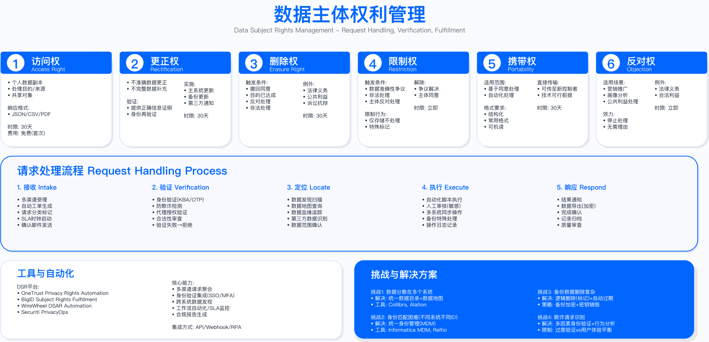

# 9.4 数据主体权利管理

## 概述

数据主体权利（Data Subject Rights, DSR）是现代隐私法规赋予个人对其个人数据行使控制的核心权利集合。GDPR 规定了 8 项数据主体权利，企业必须在规定时限（通常为 1 个月，可延长至 2 个月）内响应数据主体的请求。随着隐私意识的提升与监管执法力度加强，DSR 请求处理已成为隐私合规运营的核心工作之一，对企业的数据治理能力、系统集成度与响应效率提出了较高要求。

本节聚焦 GDPR 框架下的数据主体权利体系，阐述各项权利的法律要求、技术实现方案、运营流程设计，并讨论 DSR 自动化处理系统的架构与成熟度演进路径。

---

## 9.4.1 GDPR 八项数据主体权利详解

### 权利体系概览

GDPR 赋予数据主体的 8 项权利分布在条例第 13 至 22 条，涵盖从数据收集前的知情权到数据处理后的删除权、可移植权等完整生命周期。各项权利的技术实现难度差异较大：知情权与更正权可通过标准化的隐私政策与自助服务实现；访问权与可移植权需要跨系统的数据聚合与格式化导出能力；删除权涉及复杂的例外评估与跨系统协调；自动化决策权则对算法可解释性提出要求。

以下表格汇总各项权利的法律依据、响应时限与实施要点。选择这些维度的原因在于：法律依据明确责任边界，响应时限决定 SLA 设计，实施要点影响技术选型与资源投入。

| 权利 | GDPR 条款 | 响应时限 | 实施要点 |
|------|-----------|----------|----------|
| 知情权 | Art.13-14 | 收集时 | 隐私政策需易于访问，间接获取数据需在 1 个月内告知来源 |
| 访问权 | Art.15 | 1 个月 | 需跨系统聚合数据，提供机器可读格式，包含处理目的与接收方信息 |
| 更正权 | Art.16 | 1 个月 | 可通过自助服务实现，需同步更新下游系统 |
| 删除权 | Art.17 | 1 个月 | 需评估 6 项例外情形，涉及备份系统与第三方通知 |
| 限制处理权 | Art.18 | 1 个月 | 需支持数据状态标记，限制期间仅允许存储 |
| 可移植权 | Art.20 | 1 个月 | 仅适用于用户提供的数据，需结构化机器可读格式 |
| 反对权 | Art.21 | 立即（直接营销） | 直接营销场景无例外，必须立即停止 |
| 自动化决策权 | Art.22 | 不适用 | 需提供人工干预机制与算法逻辑说明 |

上表总结了 GDPR 数据主体权利的核心要素。需注意：响应时限的 1 个月可在请求复杂或数量过多时延长至 2 个月，但须在首月内通知数据主体延期原因；直接营销反对权是绝对权利，不存在例外情形。

### 1. 知情权（Right to be Informed）

**法律要求**（GDPR Art.13-14）

知情权要求数据控制者在收集个人数据时，向数据主体提供关于数据处理活动的透明信息。告知内容包括：数据控制者身份与联系方式、处理目的与合法基础、数据接收方类别、数据保留期限、数据主体享有的权利等。当数据并非直接从数据主体处收集（如从第三方购买）时，需在合理期限内（最迟 1 个月）告知数据来源。

**适用边界**：知情权适用于所有涉及个人数据收集的场景，包括网站注册、App 使用、线下活动报名、第三方数据采购等。对于完全匿名化的数据处理，由于不涉及个人数据，知情权不适用。

**实施要点**

不同场景下的告知方式存在差异：网站注册场景应在表单上方或旁边提供隐私政策链接，确保用户在提交数据前可便捷访问；App 首次打开时应通过引导页或弹窗告知，并确保用户后续可在设置中随时查看；Cookie 收集需通过同意横幅告知，禁止使用预勾选框。

**常见误区**

第一，将隐私政策链接隐藏在页面底部小字中，不符合"易于访问"的要求。第二，仅在用户注册时展示一次隐私政策，后续无法再次查看，未能满足"随时可访问"的透明度要求。第三，从第三方获取数据后未主动通知数据主体数据来源，违反 Art.14 的间接收集告知义务。

**验证方法**：可通过用户体验测试验证隐私政策的可访问性，从用户视角出发，测试能否在 3 次点击内找到完整的隐私政策；检查隐私政策是否包含 Art.13/14 要求的全部信息要素；使用浏览器开发者工具检查 Cookie 同意横幅是否存在预勾选。

---

### 2. 访问权（Right of Access）

**法律要求**（GDPR Art.15）

数据主体有权确认其个人数据是否正在被处理，如果是，有权获取以下信息的副本：处理目的、数据类别、数据接收方或接收方类别、数据保留期限、数据主体享有的其他权利、数据来源（非直接收集时）、自动化决策的逻辑与后果。

**适用边界**：访问权适用于数据控制者持有的所有个人数据，包括结构化数据（如 CRM 记录）、非结构化数据（如客服通话记录）以及日志数据中的个人标识符。但访问权不得损害他人的权利和自由，例如访问请求中涉及的第三方个人数据应进行脱敏处理。

**关键约束**

访问权的实施面临多项技术与运营约束。数据分散是首要挑战：用户数据通常分布在 CRM、订单系统、日志平台、分析工具、第三方供应商等多个系统中，需要建立完整的数据清单（Data Inventory）并实现自动化数据聚合。格式统一是第二项约束：不同系统的数据格式差异较大，需定义统一的导出格式（如 JSON 或 CSV）并附加元数据说明。安全风险需重点关注：批量访问请求可能被用于数据收集攻击或社会工程攻击，需实施身份验证、速率限制与风险评分机制。

**常见误区**

第一，仅提供部分系统的数据，遗漏日志系统、备份系统或第三方供应商持有的数据。第二，以"技术复杂"为由拒绝提供算法 profiling 的逻辑说明，违反 Art.15(1)(h) 的要求。第三，未对导出数据进行第三方个人数据脱敏，可能侵犯他人隐私。

**验证方法**：定期执行内部访问权请求测试（可由 DPO 或隐私团队模拟），验证数据聚合的完整性与响应时效；审计数据导出日志，确认是否覆盖所有已知数据源；通过红队测试验证身份验证机制的有效性。

**运行指标**：访问请求响应时间（目标：在法定 1 个月内完成）、数据源覆盖率（已纳入自动化导出的数据系统占比）、自动化处理率（无需人工介入的请求占比）。

---

### 3. 删除权（Right to Erasure/被遗忘权）

**法律要求**（GDPR Art.17）

数据主体有权要求删除其个人数据，当满足以下情形之一时：数据不再为收集目的所必需；数据主体撤回同意且无其他合法基础；数据主体行使反对权且无优先的合法理由；数据被非法处理；为履行法律义务需要删除；数据涉及信息社会服务中的儿童。

**六项例外情形**（Art.17(3)）

GDPR 明确规定了可拒绝删除请求的 6 项例外情形，企业在处理删除请求时必须逐项评估：

1. **言论和信息自由**：新闻报道、学术研究、艺术或文学创作中必需的数据。评估时需平衡公共知情权与个人隐私权。
2. **法律义务**：税务、审计、反洗钱等法规要求保留的数据。这是最常见的拒绝理由，需明确具体的法律依据与保留期限。
3. **公共卫生**：传染病追踪、疫苗接种记录等公共卫生必需的数据，需有政府授权。
4. **存档/研究/统计**：科学研究或历史档案必需的数据，需已进行假名化处理并获得伦理委员会批准。
5. **法律诉求**：建立、行使或辩护法律诉求所必需的数据。需有合理依据证明诉讼的可能性，不能泛泛主张。

**适用边界**：删除权适用于所有个人数据的处理场景，但受上述例外情形限制。对于已完全匿名化的数据（无法重新识别到个人），删除权不适用。需注意：假名化数据仍属于个人数据，删除权仍然适用。

**关键约束**

删除权的实施是所有数据主体权利中技术复杂度最高的。主系统数据的删除相对直接，但备份系统的删除需考虑备份周期与恢复策略——通常做法是在下次备份覆盖时自然删除，但需记录删除请求以防止从旧备份恢复时重新引入已删除数据。日志数据的删除需评估是否影响安全审计与故障排查能力。第三方数据的删除需根据数据处理协议（DPA）向供应商发起子请求，并跟踪执行状态。已公开披露的数据需通知接收方执行删除（Art.17(2)）。

**常见误区**

第一，对所有删除请求一律执行，未评估例外情形，导致删除了法律要求保留的数据（如税务记录）。第二，仅执行"软删除"（标记删除状态）而非物理删除，数据仍可被恢复或访问。第三，未通知第三方接收方执行删除，导致数据在供应商系统中继续存在。第四，以"备份系统无法删除"为由完全拒绝删除请求，而非采用备份周期自然覆盖的合规做法。

**删除权决策流程**

删除权请求的处理需遵循结构化的评估流程：首先验证请求者身份；其次逐项检查 6 项例外情形，确定可删除与暂不可删除的数据范围；然后评估删除范围（主系统/备份/日志/第三方）；执行删除或匿名化操作；通知相关第三方；最后向数据主体确认处理结果并记录审计日志。

对于因例外情形暂不可删除的数据，应向数据主体说明具体的法律依据、保留期限以及期满后可再次申请删除的权利。

**验证方法**：通过内部测试验证删除流程的完整性，提交测试删除请求，验证主系统数据是否被物理删除、备份系统是否记录删除请求、第三方是否收到删除通知。审计例外情形评估记录，确认拒绝理由是否有具体法律依据支撑。

**运行指标**：删除请求响应时间、例外情形适用率（应保持稳定，异常波动需调查原因）、第三方删除确认率、删除后数据残留检测（定期检查已删除用户数据是否从任何系统中彻底清除）。

---

### 4. 数据可移植权（Right to Portability）

**法律要求**（GDPR Art.20）

数据主体有权以"结构化、常用、机器可读"的格式接收其提供给控制者的个人数据，并有权将数据传输给另一控制者。

**适用条件**

可移植权的适用范围受到三项条件限制：第一，仅适用于"数据主体提供的数据"，包括用户主动输入的数据（如姓名、地址、帖子内容）以及系统观察到的用户行为数据（如浏览历史、购买记录）；推断数据（如信用评分、兴趣标签）与衍生数据（如市场细分结果）不在可移植范围内。第二，仅适用于基于同意（Art.6(1)(a)）或合同（Art.6(1)(b)）的处理，不适用于基于合法利益的处理。第三，仅适用于自动化方式的处理。

**适用边界**：可移植权的目的是促进数据主体在不同服务提供商之间的自由流动，降低用户锁定效应。因此，该权利主要适用于具有竞争关系的服务场景（如社交网络、云存储、金融服务）。对于不存在替代服务的场景，可移植权的实际价值有限。

**关键约束**

格式选择需平衡通用性与完整性：JSON 格式具有良好的可读性与跨平台兼容性，但对于复杂数据结构可能丢失语义信息；行业特定格式（如金融领域的 ISO 20022）可保留完整语义，但需要接收方具备相应解析能力。直接传输功能（数据主体要求将数据直接传输至另一控制者）在技术上可行时应予支持，但不得因此影响原控制者的数据安全。

**常见误区**

第一，将推断数据（如信用评分、健康风险评估）纳入可移植范围，超出了法律要求。第二，以 PDF 或图片格式提供数据，不符合"机器可读"要求。第三，在执行可移植请求时自动删除用户数据，混淆了可移植权与删除权，可移植请求不等同于删除请求,用户数据应继续保留除非另行请求删除。

**验证方法**：验证导出数据格式是否符合结构化、机器可读要求；测试导出数据是否可被目标系统成功导入（需与行业常见服务进行互操作性测试）；确认推断数据与衍生数据未被错误纳入导出范围。

---

### 5. 反对权（Right to Object）

**法律要求**（GDPR Art.21）

数据主体有权随时反对基于合法利益（Art.6(1)(f)）或公共任务（Art.6(1)(e)）的数据处理。收到反对请求后，除非控制者能证明存在优先于数据主体利益的合法理由，否则必须停止处理。

对于直接营销目的的处理，数据主体的反对权是绝对的，不存在任何例外，收到反对请求后必须立即停止，不得以任何理由拒绝或延迟。

**适用边界**：反对权仅适用于基于合法利益或公共任务的处理，不适用于基于同意或合同履行的处理（这些场景下数据主体可通过撤回同意或终止合同实现类似效果）。直接营销反对权适用于所有营销渠道，包括电子邮件、短信、电话、定向广告等。

**关键约束**

直接营销反对的"立即生效"要求对系统实时性提出挑战。理想状态下，从用户点击退订到所有营销系统停止发送应在数分钟内完成。需建立跨系统的同步机制，确保反对状态实时传播至邮件营销平台、短信网关、电话呼叫中心、广告投放平台等。此外，需维护"营销黑名单"（Suppression List），即使用户后续重新注册，也需尊重其之前的反对意愿，除非用户明确撤销反对。

**常见误区**

第一，告知用户"您的退订请求将在 X 个工作日内处理"，违反"立即生效"要求。第二，仅在邮件渠道执行退订，未同步至短信、电话、定向广告等其他营销渠道。第三，未通知第三方营销服务提供商或数据经纪商停止营销，导致用户继续收到第三方营销内容。第四，用户重新注册后自动恢复营销订阅，未检查营销黑名单记录。

**验证方法**：执行端到端测试，从用户界面提交营销反对请求，测量所有营销渠道停止发送的实际时间；验证营销黑名单机制是否正常工作（模拟用户重新注册后检查是否仍受退订保护）；审计第三方营销供应商的同步机制。

**运行指标**：营销反对请求的端到端处理时间（从提交到所有渠道停止）、营销黑名单命中率、第三方同步成功率。

---

### 6. 自动化决策权（Rights re Automated Decision-Making）

**法律要求**（GDPR Art.22）

数据主体有权不受仅基于自动化处理（包括 profiling）的决策约束，当该决策对其产生法律效力或类似重大影响时。

**触发条件**

Art.22 的适用需同时满足三个要素：第一，决策仅基于自动化处理，无有意义的人工干预；第二，涉及 profiling（自动评估个人特征，如行为偏好、信用状况、工作表现等）；第三，决策对数据主体产生法律效力（如影响合同权利）或类似重大影响（如信贷审批、招聘录用、保险承保等）。

三个要素缺一则不触发 Art.22。例如：算法推荐商品通常不构成"重大影响"，因此不触发该条款；有人工审核的信贷决策（即使人工仅在极少数情况下推翻算法结果）通常不构成"仅基于自动化处理"。

**三项例外**

即使满足上述触发条件，以下情形可继续进行自动化决策：签订或履行合同所必需（如在线即时信贷审批）；欧盟或成员国法律明确授权；数据主体明确同意。即使适用例外，控制者仍须实施适当保障措施，包括：确保数据主体获得人工干预的权利、表达观点的权利、质疑决策的权利，以及关于算法逻辑与决策后果的有意义信息。

**适用边界**：Art.22 不禁止所有自动化决策，仅禁止对数据主体产生重大影响且无人工干预的纯自动化决策。内容推荐算法、价格个性化、精准广告等通常不触发该条款，但若用于儿童用户或产生歧视性影响，仍需审慎评估。

**关键约束**

"有意义的人工干预"是争议焦点。根据 EDPB《自动化个人决策与用户画像指南》（Guidelines on Automated individual decision-making and Profiling，2018 年 5 月 25 日通过），"仅基于自动化处理的决策"是指"通过技术手段做出决策而无人工参与"，且组织不得通过"虚构人工参与"来规避 Art.22 的义务。EDPB 明确指出："为满足人工参与的要求，控制者必须确保对决策的监督是有意义的，而非仅仅是象征性的姿态。"具体而言,人工审核者必须具有推翻算法决策的权限,且在实践中确实存在推翻案例；若人工仅是"橡皮图章"式的形式审批，则不构成有意义的干预。

2025 年 3 月，荷兰数据保护局（Autoriteit Persoonsgegevens）发布了《有意义的人工干预》咨询文件，进一步细化了人工干预的评估框架，将有意义性分解为四个维度：人员、技术与设计、流程、治理。

算法逻辑的"有意义信息"需要平衡商业秘密保护与数据主体知情权,通常需要说明影响决策的主要因素，而非披露完整的算法代码或模型权重。

**常见误区**

第一，在招聘筛选中使用算法自动拒绝候选人简历，无人工复审，违反 Art.22。第二，声称存在人工复审，但人工审核者实际上无权限或无能力推翻算法决策，不构成有意义的干预。第三，以"算法是商业秘密"为由完全拒绝提供决策逻辑信息，违反透明度要求。

**验证方法**：审计自动化决策系统的流程设计，确认是否存在人工干预节点及其权限配置；统计人工推翻算法决策的实际比例（若长期为零，需评估人工干预是否形同虚设）；测试算法解释功能是否能向数据主体提供可理解的决策因素说明。

**运行指标**：人工干预率（人工审核并实际做出决策的案例占比）、人工推翻率（人工决策与算法建议不一致的比例）、算法解释请求量与响应时效。

---

## 9.4.2 DSR 自动化处理系统

### 处理流程架构

企业级 DSR 处理通常分为六个阶段：请求接收、身份验证、请求分类与路由、数据处理、响应用户、审计与改进。

**阶段一：请求接收**

DSR 请求可通过多种渠道提交：专用的 web 门户（推荐的首选渠道，便于结构化收集请求信息）、电子邮件（如 privacy@company.com）、客服电话、线下渠道等。无论通过何种渠道提交，系统应立即生成工单号，并向请求者发送确认回执，告知预计响应时间。

**阶段二：身份验证**

身份验证是 DSR 处理的关键控制点，需在用户体验与安全风险之间取得平衡。验证过严会导致合法请求被拒绝，验证过松则可能被利用于身份盗用或数据收集攻击。建议采用风险自适应验证策略：根据请求类型、账户活跃度、设备特征、地理位置等因素评估风险等级，对低风险请求采用简化验证（如邮件 OTP），对高风险请求要求追加验证（如身份证件上传、知识问答、视频通话）。

删除请求的风险等级通常高于访问请求，因其不可逆性，错误删除的数据难以恢复。休眠账户、异常地理位置、新设备等特征会提升风险评分。

**阶段三：请求分类与路由**

根据请求类型与复杂度，将请求路由至不同的处理路径。访问权、更正权、可移植权等请求可通过自动化系统处理，仅在异常情况下升级至人工。删除权请求需人工评估例外情形后方可执行。涉及自动化决策权、复杂例外情形或大批量数据的请求应由隐私专家或 DPO 介入评估。

**阶段四：数据处理**

数据处理是执行阶段，涉及数据发现（扫描所有相关系统定位用户数据）、合规评估（检查例外情形与业务限制）、执行操作（导出/删除/更正/限制）以及第三方协调（通知供应商执行子请求）。

数据发现依赖完整的数据清单（Data Inventory）与数据映射（Data Mapping）。若企业缺乏这些基础设施，DSR 处理将严重依赖人工，难以在时限内完成。

**阶段五：响应用户**

响应内容应包括：请求处理结果（批准/部分批准/拒绝）、具体操作说明（已导出/已删除/已更正的数据范围）、拒绝原因与法律依据（如适用）、后续权利说明（如申诉渠道、监管机构投诉途径）。响应应使用清晰、易理解的语言，避免过度使用法律术语。

**阶段六：审计与改进**

所有 DSR 请求及其处理过程需完整记录，以备监管机构审查。记录内容包括：请求详情、身份验证结果、处理决策及依据、执行操作、响应内容、时间戳等。建议保留记录至少 6 年（参考一般诉讼时效）。定期分析 DSR 数据，识别流程瓶颈与自动化机会。

### 身份验证风险决策

DSR 身份验证面临两难困境：验证要求过低可能导致身份盗用者获取或删除他人数据；验证要求过高则增加合法请求者的负担，甚至构成变相拒绝。

**风险评估因素**

风险评分应综合考虑以下因素：请求类型（删除请求风险高于访问请求）、账户状态（休眠账户风险高于活跃账户）、设备特征（新设备或已知恶意设备风险较高）、地理位置（异常国家或与账户注册地不符风险较高）、行为模式（批量请求或异常时间请求风险较高）。

**验证策略分级**

根据风险评分采用不同验证策略：低风险请求可通过邮件 OTP 或已登录会话验证；中风险请求需追加知识问答（如注册日期、最近订单号等仅账户持有人知晓的信息）；高风险请求需要求上传政府颁发的身份证件，并可能需要人工复核；极高风险请求可要求视频通话验证。

**常见攻击场景与防护**

DSR 流程可能被恶意利用的场景包括：竞争对手通过批量访问请求获取业务情报（防护：速率限制、请求原因记录）、攻击者冒充用户提交删除请求破坏其账户（防护：多因素验证、延迟执行期）、钓鱼攻击者伪造 DSR 相关邮件诱导用户泄露凭证（防护：官方域名验证、用户安全意识培训）。

### DSR 自动化成熟度模型

企业的 DSR 处理能力通常经历以下演进阶段：

**Level 1 - 人工处理**：通过邮件接收请求，人工查询各系统收集数据，人工编写响应邮件。响应时间长，容易遗漏数据源，难以扩展。

**Level 2 - 工单系统**：建立专用 DSR 工单系统追踪请求状态，但数据收集与处理仍依赖人工操作各业务系统。

**Level 3 - 部分自动化**：访问权与可移植权请求通过自动化工具聚合数据并生成导出包，删除权与复杂请求仍需人工评估与执行。

**Level 4 - 高度自动化**：大多数请求类型实现端到端自动化处理，仅复杂案例或高风险请求需人工介入。具备实时数据发现能力与跨系统协调能力。

**Level 5 - 智能自动化**：引入机器学习辅助请求分类、例外情形判断、风险评估等决策环节。具备预测性能力，可主动识别潜在合规问题。

**适用边界**：并非所有企业都需要达到 Level 5。成熟度目标应与 DSR 请求量、数据系统复杂度、合规风险等级相匹配。请求量较小的企业可在 Level 2-3 满足合规要求；处理大量消费者数据的企业应以 Level 4 为目标。

**关键约束**：成熟度提升需要显著的技术投资与组织变革。Level 4 以上需要完整的数据清单与数据映射作为基础，需要与各业务系统建立 API 集成，需要建立专职的 DSR 运营团队。

---

## 9.4.3 DSR 运营指标与 SLA 管理

### 关键绩效指标

DSR 运营需建立量化的绩效指标体系，用于监控合规状态、识别改进机会、向管理层报告运营绩效。

**响应时间指标**

核心指标是 SLA 合规率，在法定时限（GDPR 要求 1 个月，可延长至 2 个月）内完成响应的请求占比。目标值应设定为接近 100%，任何超期都可能构成违规。此外应分请求类型追踪平均响应时间：访问请求通常可在较短时间内完成（如数据聚合自动化程度高的企业可在数日内完成），删除请求因需评估例外情形通常耗时较长。

**处理效率指标**

自动化处理率反映系统成熟度,无需人工介入即可完成的请求占比。人均处理量反映团队效率，DSR 团队每人每月处理的请求数量。单请求成本反映运营效率，处理每个请求的平均人工与系统成本。一次性解决率反映服务质量，无需与请求者二次沟通即可完成的请求占比。

**质量指标**

数据完整性反映访问权响应质量，导出数据包是否包含所有系统中的用户数据。准确性反映处理质量，无处理错误（如错误删除、遗漏数据源）的请求占比。用户满意度可通过请求完成后的简短调查收集。申诉率反映争议水平，请求者对处理结果不满并提出申诉的比例。

### DSR 工单系统功能要求

基于 GDPR Art.30 的记录保存要求与运营最佳实践，DSR 工单系统应具备以下核心功能模块：

**请求管理模块**：记录工单号、请求者身份、请求类型、提交渠道、提交时间、请求内容描述。支持多渠道请求统一入口，自动生成确认回执。

**身份验证模块**：记录验证方法、验证结果、验证时间、风险评分、验证尝试次数。支持多级验证策略配置。

**处理跟踪模块**：记录处理人员、处理开始时间、处理结束时间、处理结果、涉及的数据系统清单、第三方通知记录。支持工作流自动化与任务分配。

**决策记录模块**：记录批准/拒绝决策、决策依据、适用的法律条款、例外情形评估记录、DPO 意见（如适用）。这是监管审查的核心内容。

**沟通记录模块**：记录与请求者的所有通信，包括确认回执、补充信息请求、最终响应等。

**SLA 监控模块**：自动计算响应截止时间，对即将超期的工单发出预警，记录延期原因与延期通知。

### 响应模板标准化

标准化的响应模板可提升响应一致性与效率。以下是两类典型场景的模板要素：

**访问权批准响应**应包含：确认已完成处理、数据包内容清单（按数据类别列明）、数据格式说明、安全下载链接（设置有效期）、各类数据的保留期限说明、后续权利告知、联系方式。

**删除权部分拒绝响应**应包含：确认已处理部分请求、已删除的数据范围、暂不可删除的数据范围及具体法律依据、预计可删除的时间（如法定保留期满后）、请求者享有的后续权利（如向监管机构投诉）、联系方式。

响应语言应清晰易懂，避免过度使用法律术语；涉及法律依据时应引用具体条款编号；应告知请求者享有的后续权利。

---

## 9.4.4 DSR 合规挑战与最佳实践

### 常见合规陷阱

**过度收费**：GDPR 原则上要求免费响应 DSR 请求。仅当请求"明显无理由或过分"（如反复提交相同请求）时，方可收取合理费用或拒绝处理。对首次访问请求收费构成违规。

**要求提供理由**：数据主体无义务解释其请求原因。控制者可询问原因以便更好地理解请求范围（如"您希望访问哪些类型的数据"），但不得以未提供理由为由拒绝处理。

**滥用延期**：延长响应期限（从 1 个月延至 2 个月）需有充分理由，如请求复杂或请求数量过多。延期决定必须在首月内通知请求者，并说明延期原因。不得将延期作为常规做法。

**数据不完整**：访问权响应需覆盖控制者持有的所有个人数据，包括主业务系统、日志系统、备份系统、分析系统以及供应商系统中的数据。遗漏数据源构成不完整响应。

**格式不可读**：可移植权响应需采用"结构化、常用、机器可读"格式。提供 PDF 扫描件或非结构化文本不符合要求。推荐使用 JSON、CSV 或 XML 格式，并附加数据结构说明。

**变相拒绝**：设置过高的身份验证门槛（如要求公证身份证件）可能构成变相拒绝。验证要求应与请求风险相称，不得故意设置障碍。

### 最佳实践

**建立自助服务门户**

自助服务门户可显著提升用户体验与处理效率。推荐功能包括：实时数据查看（允许用户在线查看其账户信息与活动历史）、一键数据导出（简化访问权与可移植权请求）、在线信息更正（自助实现更正权）、营销偏好管理（简化反对权行使）、请求状态跟踪（提高透明度）。

自助服务可处理大部分标准化请求，使 DSR 团队专注于复杂案例。

**建立清晰的组织分工**

DSR 处理涉及多个职能部门的协作。建议的组织模式：DPO 负责监督与质量保证，对复杂案例提供决策指导；DSR 团队负责日常运营，包括请求处理、用户沟通、工单管理；IT 团队负责数据发现工具维护、系统集成、自动化开发；法务团队负责例外情形评估、拒绝理由审核、监管沟通支持；业务部门配合提供特定系统的数据导出与删除操作支持。

**建立持续改进机制**

建议按季度开展 DSR 运营审查，审查内容包括：请求量趋势分析（识别异常波动）、SLA 合规率回顾、自动化率变化、用户投诉与申诉案例复盘、新系统或新数据源的 DSR 覆盖评估、DPO 工单抽样审查、响应模板更新需求、团队培训需求。

---

## 本节小结

数据主体权利管理是隐私合规运营的核心工作，涉及法律解读、流程设计、技术实现与运营管理的综合能力。

**GDPR 八项权利的实施要点**：知情权强调透明度与易访问性；访问权需要跨系统数据聚合能力；删除权是技术复杂度最高的权利，需严格评估例外情形；可移植权仅适用于用户提供的数据；直接营销反对权是绝对权利，必须立即执行；自动化决策权要求提供有意义的人工干预与算法解释。

**DSR 自动化系统**：成熟的 DSR 处理需要端到端的自动化支持，包括请求接收、身份验证、数据发现、执行操作、用户响应等环节。身份验证应采用风险自适应策略，在安全与体验之间取得平衡。

**运营管理**：需建立量化的绩效指标体系监控合规状态；响应模板标准化可提升效率与一致性；持续改进机制确保能力持续演进。

**下一节预告**：[9.5 隐私工程实践](./9.5_privacy_engineering.md)将探讨 Privacy by Design 原则、匿名化与假名化技术、差分隐私、联邦学习等隐私增强技术的工程实现。

---

## 导航

**[← 上一节：9.3 个人数据处理合规](./9.3_personal_data_processing.md)** | **[返回章节目录](./README.md)** | **[下一节：9.5 隐私工程实践 →](./9.5_privacy_engineering.md)**

---

**© 2025 AI-ESA Project. Licensed under CC BY-NC-SA 4.0**

