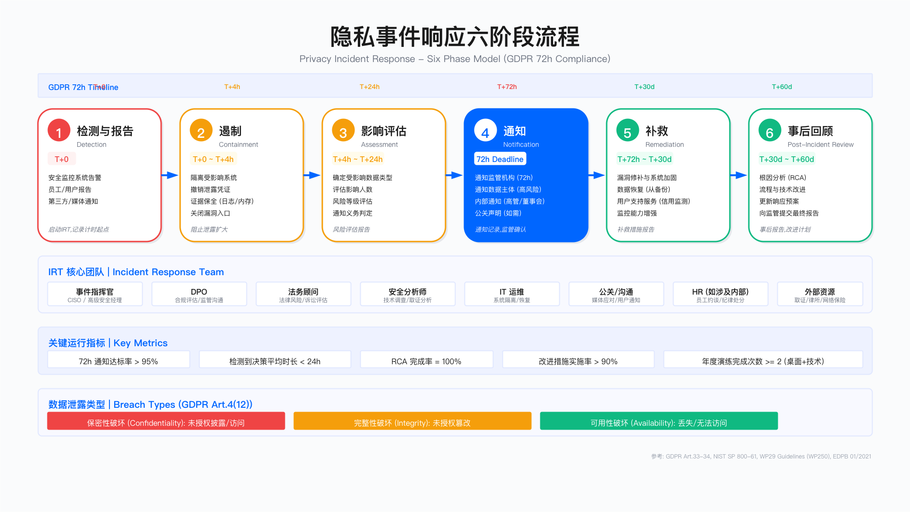

# 9.8 隐私事件响应

## 概述

GDPR 第 33 条要求数据控制者在意识到数据泄露后的 72 小时内通知监管机构，若泄露可能对数据主体权利和自由构成高风险，还需通知数据主体本人。隐私事件响应能力直接影响企业的合规风险敞口与声誉损失程度。本节聚焦隐私事件的识别分类、通知决策机制、响应流程设计、取证保全、补救措施与事后改进的工程实践。

适用边界：本节内容适用于受 GDPR、PIPL、CCPA 等隐私法规约束的数据控制者与处理者；对于仅处理匿名化数据或不涉及个人数据的组织，部分流程可简化。

关键约束：隐私事件响应涉及法务、技术、公关、人力等多部门协作，决策时效性要求高（72 小时硬性约束）；响应成本与数据量、敏感度、受影响人数正相关；取证保全需平衡调查需求与业务连续性。

---

## 9.8.1 隐私事件定义与分类

### 数据泄露的三种类型

根据 GDPR 第 4(12) 条及 WP29 指南（WP250），个人数据泄露（Personal Data Breach）分为三类。理解这一分类有助于在事件发生时快速判断性质与通知义务。

保密性破坏（Confidentiality Breach）指未授权或意外披露、访问个人数据。典型场景包括：外部攻击者入侵数据库并导出数据、员工误将包含客户信息的邮件发送至错误收件人、未加密的移动设备丢失、Web 应用漏洞导致数据暴露。保密性破坏通常被视为最高风险类型，因为数据可能已被攻击者获取并可能被滥用。

完整性破坏（Integrity Breach）指未授权或意外更改个人数据。典型场景包括：勒索软件加密数据库、员工误操作修改关键记录、系统故障导致数据损坏。完整性破坏的风险取决于数据篡改是否可被检测与恢复。

可用性破坏（Availability Breach）指意外或未授权丢失、销毁个人数据或无法访问。典型场景包括：勒索软件阻止访问、硬件故障且无备份、误删数据库、DDoS 攻击导致服务中断。若存在完整备份且可快速恢复，可用性破坏的风险等级可降低。

### 事件来源分类

隐私事件的来源可归纳为四类：外部恶意攻击（包括黑客入侵、钓鱼攻击、勒索软件、供应链攻击）、内部意外错误（包括邮件发错、配置错误、误删除、权限设置失误）、内部恶意行为（包括离职员工窃取数据、权限滥用）、系统与流程故障（包括硬件故障、软件缺陷、云服务中断）。

不同来源的事件在检测难度、响应策略、修复成本上存在差异：外部恶意攻击通常检测周期长、修复成本高且可能涉及执法配合；内部意外错误发现较快但需评估是否存在系统性流程缺陷；内部恶意行为需协调 HR 与法务介入，可能涉及纪律处分或诉讼；系统故障的响应侧重业务连续性恢复。

常见误区：

1. 将所有安全事件等同于隐私事件——仅涉及个人数据的安全事件才触发 GDPR 通知义务，系统入侵但未访问个人数据的情况不构成隐私事件（但仍需内部记录）。
2. 仅关注保密性破坏——勒索软件导致的可用性破坏同样属于 GDPR 定义的数据泄露，若无法及时恢复数据可能触发通知义务。

---

## 9.8.2 72 小时通知要求与决策框架

### 通知义务判定逻辑

GDPR 第 33 条与第 34 条规定了两层通知义务。判定是否需要通知的核心问题是：该泄露是否对数据主体的权利和自由构成风险？

第一层：是否通知监管机构

若泄露对数据主体权利和自由构成风险（除非风险可忽略不计），数据控制者须在意识到泄露后 72 小时内通知主管监管机构。若超过 72 小时，须附上延迟原因说明。

存在例外情形：若数据已采用加密等技术措施保护，且密钥未泄露，使数据对未授权方不可读，可能豁免通知义务。但该豁免需经过审慎评估。

第二层：是否通知数据主体

若泄露可能对数据主体权利和自由构成高风险，控制者须不得无故延迟地通知受影响的数据主体。通知须使用清晰明了的语言，说明泄露性质、可能后果、已采取措施及数据主体可采取的自我保护措施。

存在例外情形：若事后采取的补救措施已消除高风险，或直接通知需付出不成比例的努力（可改用公开声明），可豁免直接通知。

### 风险评估方法

EDPB 指南（01/2021）建议从以下维度评估泄露风险：

数据敏感度：一般联系信息（低）、财务或位置数据（中）、GDPR 第 9 条特殊类别数据如健康信息、种族、宗教、性取向（高）。

数据量与受影响人数：少量数据（低）、中等规模（中）、大规模（高）。具体阈值需结合业务场景设定，不存在通用标准。

泄露性质：可用性破坏且有备份（低）、完整性破坏（中）、保密性破坏且数据已外泄（高）。

受影响群体的脆弱性：一般成年人（低）、老年人或员工（中）、儿童、难民、患者等弱势群体（高）。

可能后果：骚扰电话（低）、财务损失或信用风险（中）、身份盗用、歧视、人身安全威胁（高）。

风险评估应形成书面记录，作为通知决策的依据。即使最终判定无需通知，GDPR 第 33(5) 条仍要求控制者记录所有数据泄露事件及其评估过程。

### 计时起点的认定

"意识到"（awareness）的认定是 72 小时计时的关键。根据 WP29 指南及相关判例，计时起点包括：

- 内部发现：安全团队或任何员工意识到泄露发生的时刻
- 第三方通知：收到供应商、客户或安全研究人员通知的时刻
- 媒体曝光：即使企业尚未察觉，媒体报道可作为"应当意识到"的依据

企业不得以"调查尚未完成"为由延迟通知。GDPR 第 33(4) 条允许分阶段通知：可先提交初步通知（泄露性质与初步评估），后续补充详细信息。

验证方法：

1. 模拟事件测试：从检测告警到完成风险评估并作出通知决策的端到端时间是否可在 24 小时内完成
2. 检查事件日志：是否记录了"意识到"时刻的明确时间戳
3. 审计历史事件：过往事件的通知时效是否符合 72 小时要求

运行指标：

- 从事件检测到通知决策的平均时长
- 72 小时通知达标率
- 分阶段通知的使用频率（反映复杂事件占比）

---

## 9.8.3 事件响应流程设计

### 六阶段响应模型

基于 NIST SP 800-61 框架并结合 GDPR 通知要求，隐私事件响应可分为六个阶段。

阶段一：检测与报告（T+0）

触发来源包括：安全监控系统告警、员工或用户报告、第三方通知、媒体曝光。此阶段的关键动作是初步判定是否涉及个人数据：若涉及，立即启动隐私事件响应流程并记录 GDPR 计时起点；激活事件响应团队（IRT）。

阶段二：遏制（T+0 至 T+4h）

目标是阻止泄露扩大。典型措施包括：隔离受影响系统、撤销泄露的凭证、关闭漏洞入口、在采取遏制措施前完成必要的证据保全（日志快照、内存转储）。此阶段需平衡快速遏制与证据保全的需求。

阶段三：影响评估（T+4h 至 T+24h）

确定泄露范围与风险等级。需回答的核心问题：哪些数据字段受影响、涉及多少数据主体、泄露性质（保密性/完整性/可用性）、攻击载体与根因初判、数据主体可能遭受的后果。

此阶段产出：风险评估报告、通知义务判定文档。

阶段四：通知（T+24h 至 T+72h）

根据评估结果执行通知义务。监管机构通知须在 72 小时内完成，使用监管机构提供的标准模板（如 ICO 在线表单）。通知内容包括：泄露性质、数据类别、受影响人数、DPO 联系方式、可能后果、已采取措施。

数据主体通知（若适用）应使用清晰语言，说明事件性质、个人可采取的保护措施、企业提供的支持服务（如信用监测）。同时需完成内部通知（管理层、董事会、法务、公关）。

阶段五：补救（T+72h 至 T+30d）

实施技术与流程修复。包括：漏洞修补与系统加固、从备份恢复数据、为受影响用户提供支持服务、增强监控能力。

此阶段产出：补救措施报告（需向监管机构更新）。

阶段六：事后回顾（T+30d 至 T+60d）

完成根因分析（RCA），识别流程与技术改进点。产出包括：事后报告、改进措施清单、预算申请（若需）、向监管机构提交最终报告。

适用边界：上述时间节点为参考值，实际节奏需根据事件复杂度调整。小规模事件可压缩流程，大规模事件可能需延长评估与补救周期。

### 事件响应团队组成

有效的隐私事件响应需要跨职能团队协作。核心角色包括：

事件指挥官（通常由 CISO 或高级安全经理担任）：整体协调、决策升级、向高管汇报。

数据保护官（DPO）：合规评估、起草监管机构通知、与监管机构沟通。DPO 在事件响应中的独立性应得到保障，其判断不应受业务压力影响。

法务顾问：法律风险评估、审核对外通信、保全律师-客户特权、评估诉讼风险。

安全分析师：技术调查、取证分析、实施遏制措施。

IT 运维：系统隔离、备份恢复、业务连续性保障。

公关/沟通：媒体应对、用户通知内容起草、社交媒体监控。

人力资源（涉及内部人员时）：员工约谈、纪律措施、离职流程。

根据事件规模，可能需引入外部资源：取证公司（独立调查与证据保全）、专业律所（重大合规风险）、危机公关公司（品牌声誉管理）、网络保险公司（理赔协调）。

常见误区：

1. DPO 未参与事件响应团队，导致合规判断滞后或缺失
2. 事件指挥官职责不清，多部门同时决策导致响应混乱
3. 未预先建立外部资源联系清单，事件发生时临时寻找供应商延误响应

验证方法：

1. 桌面演练：模拟事件场景，验证 IRT 成员是否了解各自职责与协作流程
2. 联系清单测试：定期确认外部供应商联系方式有效性
3. 升级路径测试：验证高风险事件能否在设定时间内升级至高管层

---

## 9.8.4 事件取证与根因分析

### 证据收集与保全

数字取证是事件响应的关键环节，既服务于根因分析，也为可能的法律程序提供支撑。证据收集应遵循 NIST SP 800-86 及 ISO 27037 标准。

系统日志：包括应用访问日志、Web 服务器日志、数据库审计日志、防火墙与 IDS/IPS 日志、云平台日志（如 AWS CloudTrail、Azure Activity Log）。保存要求：至少覆盖事件前后 30 天，保持原始格式，使用哈希值（SHA256）验证完整性。

网络流量：若攻击仍在进行或刚结束，应捕获相关网络流量（PCAP 包、NetFlow 记录）。需注意：在欧盟地区，捕获网络流量可能涉及员工隐私，需 DPO 评估合规性。

内存转储：受影响系统的 RAM 镜像可能包含攻击者未写入磁盘的恶意代码或凭证。关机后内存数据丢失，需在遏制前优先采集。

磁盘镜像：完整磁盘镜像用于深度取证分析。原始磁盘应隔离封存，分析在镜像副本上进行。

证据链（Chain of Custody）是证据在法律程序中可采信的前提。记录内容包括：采集时间、采集人员、哈希值、存储位置、所有访问记录。证据链断裂可能导致证据在诉讼中不被采纳。

关键约束：

- 取证活动可能影响业务连续性（如隔离服务器）
- 取证范围需在调查需求与成本之间权衡
- 跨境取证可能涉及数据出境合规问题

### 根因分析方法

根因分析（RCA）旨在识别事件发生的深层原因，而非仅停留在表面症状。常用方法包括：

5 Whys 方法：通过连续追问"为什么"，逐层深入到根本原因。典型分析路径：为什么发生泄露 → 为什么漏洞未修补 → 为什么补丁通知未收到 → 为什么通知机制失效 → 为什么缺乏自动化监控。

鱼骨图（Fishbone/Ishikawa）分析：从人员、技术、流程、监控四个维度系统分析原因，适用于复杂事件。

根因分析的产出应包括：技术层面原因（如漏洞、配置错误）、流程层面原因（如补丁管理流程缺失）、组织层面原因（如安全投入不足、职责不清）。

常见误区：

1. RCA 仅停留在技术层面，未追溯到流程与组织问题
2. RCA 沦为追责工具而非改进工具，导致团队隐瞒信息
3. 改进措施缺乏跟踪机制，同类事件重复发生

验证方法：审计历史事件的 RCA 报告，检查改进措施是否实施、是否有效防止同类事件再次发生。

---

## 9.8.5 用户支持与补救措施

### 分级支持方案

根据泄露数据的敏感度与可能后果，为受影响数据主体提供分级支持。支持措施的设计需平衡用户保护需求与成本约束。

高风险泄露（如身份证号、护照号、支付卡信息含 CVV）：建议提供信用监测服务、身份盗窃保险、身份恢复专家支持、信用冻结指导、专属支持热线。服务期限通常为 12-24 个月。

中等风险泄露（如财务数据但不含 CVV、健康数据）：建议提供信用监测服务、强制密码重置、多因素认证启用指导、工作时间支持热线。服务期限通常为 6-12 个月。

较低风险泄露（如姓名、邮箱、电话号码）：建议提供透明通知、安全建议指南、密码重置建议、邮件或在线支持。

支持方案的具体内容需根据当地法规要求、行业惯例、保险覆盖情况确定。网络保险通常可覆盖部分用户支持成本。

### 用户通知内容要素

GDPR 第 34 条规定的通知应包含：数据保护官联系方式、泄露可能后果的描述、控制者已采取或拟采取的补救措施、数据主体可采取的自我保护建议。

有效的用户通知应具备以下特征：

- 清晰明确：使用非技术语言说明发生了什么
- 具体可行：提供数据主体可立即采取的保护步骤
- 支持渠道：提供专属联系方式而非通用客服
- 投诉权利：告知数据主体向监管机构投诉的权利

适用边界：通知方式需根据受影响人数选择。小规模泄露可采用个人化邮件；大规模泄露可能需结合邮件通知与网站公告。

验证方法：

1. 用户调研：通知发出后收集用户反馈，评估通知是否清晰易懂
2. 支持热线指标：监测热线等待时间、问题解决率
3. 服务注册率：跟踪提供的支持服务（如信用监测）的实际使用率

---

## 9.8.6 监管机构沟通

### 沟通原则与策略

与监管机构的沟通应遵循以下原则：

透明主动：诚实披露已知信息，承认不足之处，不最小化事件影响。监管机构通常对坦诚合作的企业给予更宽容的处理。

及时更新：发现新信息后主动补充通知，而非被动等待监管机构询问。建议建立定期更新机制（如每两周），即使无重大进展也简要汇报。

证据支撑：通知与汇报应附有支撑文档（风险评估记录、遏制措施清单、改进计划）。

### GDPR 第 33(3) 条通知要素

监管机构通知须包含以下内容（可分阶段补充）：

1. **泄露性质**：保密性/完整性/可用性破坏的类型、涉及的数据类别、受影响数据主体的大致数量、受影响记录的大致数量

2. **DPO 联系方式**：姓名、邮箱、电话

3. **可能后果**：描述泄露对数据主体权利和自由的可能影响（如身份盗用风险、财务损失风险）

4. **已采取及拟采取的措施**：遏制措施、补救措施、用户保护措施

多数监管机构提供在线提交表单（如 ICO、CNIL）。建议预先熟悉相关监管机构的通知渠道与模板要求。

### 监管调查应对

若监管机构启动调查，需准备以下文档：

政策文件：数据保护政策、事件响应计划、访问控制政策（应在调查前已完备）

技术证据：系统日志、漏洞扫描报告、渗透测试报告（调查启动后 14 天内提供）

流程记录：事件响应时间线、决策会议纪要、通知记录（调查启动后 7 天内提供）

改进计划：根因分析报告、补救措施清单、预算投入承诺

外部报告：取证公司报告、外部审计报告（如有）

关键约束：监管调查可能持续数月至数年，需保持持续的沟通与文档更新能力。调查期间的额外信息请求可能打断正常业务节奏。

---

## 9.8.7 事件响应演练

### 演练类型与频率

定期演练是验证响应能力的关键手段。

桌面演练（Tabletop Exercise）：建议每半年一次。参与者围绕虚构场景讨论响应流程与决策，不实际操作系统。目标是测试流程理解、决策能力、团队协作。参与人员通常包括 IRT 核心成员。

技术演练（Technical Exercise）：建议每年一次。实际执行部分响应步骤（如证据采集、系统隔离），测试技术能力与工具有效性。

全面演练（Full-Scale Exercise）：建议每 2-3 年一次。模拟真实事件，涉及全流程执行，可能包括模拟监管机构通知、媒体应对。

### 桌面演练场景示例

场景一：勒索软件攻击

场景注入：周一上午，IT 运维发现服务器文件被加密，勒索信要求支付比特币。初步评估显示客户数据库服务器受影响，最新备份为 48 小时前。

讨论要点包括：是否构成 GDPR 数据泄露（可用性破坏是，保密性需评估攻击者是否窃取数据）、是否支付赎金（需权衡业务影响与执法机构建议）、如何确定通知义务（需评估攻击者是否已窃取数据）、恢复策略选择（备份恢复 vs 等待解密工具）。

场景二：内部人员数据窃取

场景注入：DLP 系统告警显示，即将离职的销售经理批量导出客户数据并上传至个人云存储。

讨论要点包括：立即措施（撤销访问权限、保全证据、HR 约谈）、是否构成 GDPR 数据泄露（未授权访问与窃取，是）、是否通知客户（取决于数据是否已被进一步传播）、法律行动选择（民事诉讼、刑事报案）。

### 演练产出与改进

每次演练后应产出：

- 演练记录（场景、讨论内容、决策）
- 识别的流程差距清单
- 改进措施与责任人
- 下次演练计划

验证方法：跟踪演练识别的改进措施的实施情况，评估改进是否有效（如在后续演练中验证）。

运行指标：

- 年度演练完成次数
- 演练识别的差距数量
- 差距修复完成率
- 演练后改进措施的平均实施周期

---

## 本节小结

隐私事件响应是数据保护能力的关键检验。本节核心要点如下：

通知义务判定：72 小时计时从"意识到"泄露开始，通知决策基于风险评估。GDPR 允许分阶段通知。即使无需通知，仍须内部记录所有泄露事件。

六阶段响应流程：检测 → 遏制 → 评估 → 通知 → 补救 → 回顾。各阶段有明确产出与时间节点要求。

团队与协作：跨职能 IRT 是有效响应的基础，DPO 在合规判断中发挥关键作用，事件指挥官负责整体协调。

取证与根因分析：证据链完整性是法律程序的前提，根因分析应追溯至流程与组织层面。

用户支持分级：根据数据敏感度与风险等级提供差异化支持，通知内容须清晰可行。

监管沟通：透明主动是核心原则，改进措施的承诺与执行可影响处罚结果。

演练验证：定期桌面演练是发现流程差距的有效手段，演练产出需跟踪闭环。

---

## 导航

**[← 上一节：9.7 供应商与第三方管理](./9.7_vendor_third_party_management.md)** | **[返回章节目录](./README.md)** | **[下一节：9.9 隐私合规实战案例 →](./9.9_case_studies.md)**

---

**© 2025 AI-ESA Project. Licensed under CC BY-NC-SA 4.0**

