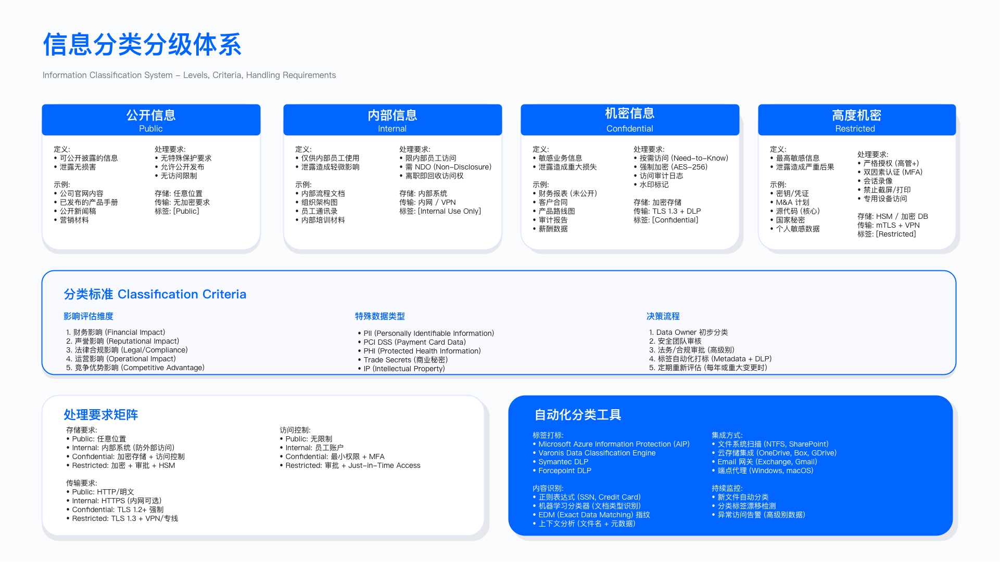

# 10.1 信息保护战略

## 概述

信息保护战略是企业安全体系的顶层设计，其核心任务是系统性识别信息资产、评估风险、制定分类分级框架、确定保护优先级。战略制定需结合零信任理念与技术控制，构建符合业务需求且可持续运营的信息保护体系。本节从资产识别、战略框架、投资分析与实施路线图四个维度展开，为后续各节的技术实现提供决策依据。

---

## 10.1.1 信息资产识别与盘点

### 问题背景

信息保护的前提是“知道要保护什么”。资产识别不完整是信息泄露的主要根因之一。多数组织存在以下盲区：结构化数据集中于已知数据库，但非结构化数据散落于文件共享、协作平台、员工端点；云端数据因 SaaS 快速采购而缺乏统一视图；知识产权（源代码、设计文档、算法模型）往往游离于传统数据治理体系之外。

### 资产发现的维度与方法

资产发现应覆盖四类数据源。结构化数据包括关系型与非关系型数据库、数据仓库、CRM/ERP/HR 等业务系统，可通过数据库扫描器、API 连接器、ETL 工具元数据获取。非结构化数据涵盖文件共享平台、邮件系统、协作工具、本地文件服务器与员工端点，需借助内容发现工具、文件爬虫与 eDiscovery 工具。云端数据包括对象存储、SaaS 应用、云数据库与云原生服务，依赖 CASB (Cloud Access Security Broker) 与 CSPM (Cloud Security Posture Management) 工具。知识产权资产则涉及源代码仓库、设计文件、专利文档、研发笔记与算法模型，需结合 Git 扫描器、专利管理系统与模型注册表。

### 资产记录的关键字段

资产清单应包含以下信息：资产标识与名称、资产类型（结构化/非结构化/代码/知识产权）、位置信息（系统、路径、所有者团队、IT 管理者）、数据属性（分类等级、敏感度、数据量、格式）、业务影响评估（保密性/完整性/可用性丧失影响、业务关键性）、合规属性（适用法规、保留期限、地域限制）、访问统计（授权用户数、访问频率、最后访问时间）、保护状态（静态加密、传输加密、访问控制强度、DLP 覆盖、备份状态）。

### 资产风险优先级排序

资产优先级应基于风险评分确定。评分因素包括：敏感度（公开/内部/机密/高度机密对应不同分值）、业务影响（低/中/高/关键）、已有保护措施（加密、DLP、访问控制可降低风险分）、合规要求（涉及 GDPR/PIPL/PCI-DSS 等法规的资产增加分值）、访问范围（授权用户数超过阈值增加风险）。根据综合评分将资产划分为 P0（关键）、P1（高）、P2（中）、P3（低）四个优先级，指导保护措施的实施顺序。

### 适用边界与关键约束

资产发现适用于已建立基础 IT 资产管理的组织。对于大规模分布式环境（跨多地域、多云、多业务单元），需分阶段推进，首轮聚焦前 100 个高价值资产。约束条件包括：数据发现工具的扫描性能对生产环境的影响（需设计非高峰时段扫描策略）；非结构化数据的分类准确率受训练数据质量影响；云端影子 IT（员工私自采购的 SaaS）难以通过传统方式发现。

### 常见误区

一次性盘点思维是常见问题：将资产发现视为一次性项目而非持续运营活动，忽略数据生命周期中的动态变化（如新系统上线、数据迁移、用户行为变化）。技术工具依赖同样值得警惕，过度依赖自动化工具而忽视业务部门访谈，导致工具扫描覆盖但业务语义缺失，无法准确判断资产的业务关键性。此外，资产清单往往集中于服务端，忽视端点数据，遗漏员工笔记本、移动设备上的敏感数据副本。

### 验证方法

资产清单完整性验证可通过以下方式进行：抽样验证（随机抽取业务流程，追溯涉及的数据存储位置，检验是否均已纳入清单）；渗透测试发现（红队在测试中发现的敏感数据位置与清单比对）；审计日志交叉验证（将数据访问日志中的数据源与清单比对，识别未登记资产）。

### 运行指标

核心运行指标包括资产发现覆盖率（已扫描数据源数量与已知数据源总数之比，阶段目标可设为高于某阈值）、资产分类完成率（已完成分类的资产数与清单资产总数之比）、清单更新频率（资产清单的最后更新时间，建议至少每季度更新）、以及高风险资产识别数（P0/P1 级资产的绝对数量与占比）。

---

## 10.1.2 信息保护战略框架

### CIA-A 模型扩展

信息保护战略框架基于经典的 CIA 三要素（保密性、完整性、可用性）扩展为 CIA-A 模型，增加可审计性 (Accountability) 作为第四支柱。

**保密性 (Confidentiality)** 的目标是防止信息未授权披露。实现路径包括：数据分类分级体系、最小权限访问控制、敏感数据加密（静态与传输）、DLP 防泄漏、第三方访问风险管理。关键技术涵盖加密算法 (AES-256/TLS)、访问控制模型 (RBAC/ABAC)、DLP、IRM/DRM、CASB。运行关注指标包括数据泄漏事件数、加密覆盖率、DLP 阻止事件数。

**完整性 (Integrity)** 的目标是确保信息准确性与未被篡改。实现路径包括：变更审计与版本控制、文件完整性监控 (FIM)、数字签名、未授权修改防护、勒索软件防范。关键技术包括版本控制系统、PKI 数字签名、FIM 工具、数据库审计、备份与恢复机制。运行关注指标包括未授权修改事件数、完整性验证覆盖率、恢复时间目标 (RTO)。

**可用性 (Availability)** 的目标是确保授权用户可及时访问信息。实现路径包括：高可用架构、定期备份与恢复测试、DDoS/勒索软件防范、容量规划、灾难恢复计划。关键技术包括负载均衡与自动扩展、备份解决方案、DDoS 防护、CDN、灾备站点。运行关注指标包括系统可用性 (SLA 达标率)、平均恢复时间 (MTTR)、恢复点目标 (RPO)。

**可审计性 (Accountability)** 的目标是确保操作可追溯与审计。实现路径包括：全面审计日志记录、用户行为分析 (UEBA)、特权访问监控、合规报告自动化、取证能力建设。关键技术包括 SIEM、UEBA、PAM (特权访问管理)、日志管理平台、取证工具。运行关注指标包括关键系统日志覆盖率、审计响应时间、合规审计通过率。

### 基于风险的优先级策略

战略实施应遵循分阶段推进原则。第一阶段（基础建设）聚焦高风险资产基础防护，核心任务包括：识别高风险资产子集、部署基础加密、实施基本访问控制、建立数据分类框架、启动员工培训。第二阶段（扩展部署）聚焦扩展保护覆盖与 DLP，核心任务包括：企业级 DLP 部署（网络与端点）、IRM/DRM 实施、CASB 覆盖云应用、UEBA 行为基线建立、供应商风险管理。第三阶段（优化成熟）聚焦自动化与智能化，核心任务包括：基于机器学习的 DLP 策略优化、自动化分类与标记、零信任架构落地、持续合规监控。持续运营阶段的任务包括：7×24 小时监控与响应、定期风险评估、年度策略审查、持续员工培训、技术栈更新。

### 零信任信息保护模型

零信任理念应用于信息保护领域，核心原则是“对数据的每次访问都验证”。三项核心信条包括：

**显式验证 (Verify Explicitly)**：基于所有可用数据点进行验证，包括多因素认证、设备合规性检查、位置与时间上下文、行为分析、风险评分。

**最小权限访问 (Least Privilege Access)**：实施即时访问 (JIT) 与适度访问 (JEA)，采用动态权限（基于风险调整）、定期权限审查、自动权限回收机制。

**假设入侵 (Assume Breach)**：以最小化影响为目标设计控制，包括微隔离、端到端加密、异常检测与响应、最小数据暴露、快速遏制能力。

零信任信息保护的实施分为五层：身份层（SSO/MFA/条件访问）、设备层（MDM/端点 DLP/设备信任评估）、应用层（CASB/SWG/应用隔离）、数据层（分类/IRM/DLP/加密）、网络层（ZTNA/SDP/微隔离）。数据中心化控制流程为：分类 → 保护 → 监控 → 响应。

### 业务对齐策略

信息保护战略的落地需与业务目标对齐。核心原则是“安全是业务推动者，而非阻碍者”。常见业务场景的安全解决方案包括：

销售赋能场景：销售团队需快速分享客户资料。解决方案包括 IRM 保护下的外部共享、临时访问链接（设置过期时间）、水印追踪、移动端安全查看。

远程办公场景：混合办公模式下的数据保护。解决方案包括 ZTNA 替代传统 VPN、云 DLP（通过 CASB）、高敏感场景使用 VDI、设备自动加密。

研发创新场景：DevOps 快速迭代与安全审查的平衡。解决方案包括 DevSecOps 集成、自动化策略检查、安全左移、基础设施即代码扫描。

并购整合场景：并购过程中的数据风险管理。解决方案包括快速数据发现、临时网络隔离、渐进式 DLP 整合、尽职调查扫描。

### 适用边界与关键约束

CIA-A 框架适用于所有需要系统化信息保护的组织。零信任模型更适用于已具备身份管理基础设施（如 SSO/MFA）的组织。关键约束包括：零信任架构的全面落地需要较长周期与持续投入；业务部门对安全控制的接受度直接影响策略执行效果；跨部门协调成本在大型组织中不可忽视。

### 常见误区

技术堆砌而非体系设计是常见问题，采购多种安全工具但缺乏统一框架整合，导致策略冲突与运营碎片化。忽视“假设入侵”思维同样危险，将资源集中于边界防护，内部横向移动检测与响应能力不足。此外，业务对齐往往流于形式，安全团队自行制定策略后要求业务遵从，而非深入理解业务痛点后共同设计解决方案。

### 验证方法

战略框架有效性验证包括：年度安全评估（对照 CIA-A 四个维度评估当前能力与差距）；红队演练（验证零信任控制在实际攻击路径中的有效性）；业务满意度调研（收集业务部门对安全控制可用性与效率的反馈）；合规审计（第三方审计验证框架实施的合规性）。

### 运行指标

核心运行指标包括 CIA-A 成熟度评分（按四个维度分别评估，可采用 1-5 级成熟度模型）、安全控制覆盖率（已部署控制的资产占比，按 P0/P1/P2/P3 分层统计）、策略例外数量（业务申请的安全策略例外数量与趋势）、以及安全事件趋势（按 CIA-A 维度分类的安全事件数量变化）。

---

## 10.1.3 投资分析与价值论证

### 成本效益评估框架

信息保护项目的投资决策需基于成本效益分析。成本构成包括四个方面：技术成本（DLP/IRM/CASB/UEBA/分类工具的许可、实施与运维费用）、人员成本（信息保护经理、DLP 分析师、培训协调员等岗位薪酬）、服务成本（咨询服务、员工培训、年度审计费用）、基础设施成本（日志存储、网络带宽等）。

效益评估应量化两类价值：风险降低价值（通过信息保护措施降低数据泄露预期损失）与生产力提升价值（自动化流程节省的人工成本、安全共享能力带来的业务效率提升）。

### 风险降低价值的估算方法

风险降低价值的估算需明确几个要素：组织的敏感数据记录数量、所属行业的数据泄露单位成本（可参考公开行业报告，但需注明口径）、年度泄露概率基准、信息保护措施对风险的预期降低幅度。由于行业报告数据的口径与适用性存在差异，建议将此类估算作为内部决策参考，而非对外承诺。估算公式为：预期风险降低价值 = 敏感记录数 × 单位泄露成本 × 泄露概率 × 措施降低幅度。实际使用时，各参数应根据组织实际情况设定，并标注为内部口径。

### 生产力提升价值的估算方法

生产力提升价值来源于多个场景：DLP 自动阻止减少事件响应工时（估算 IT 团队因自动化节省的小时数）；IRM 安全共享减少审批等待（估算受影响员工数与每人节省的等待时间）；自动化分类替代手工分类（估算分类工作节省的工时）。各场景的估算应基于组织实际数据，避免使用外部基准数据。

### 适用边界与关键约束

投资分析框架适用于需向管理层论证信息保护预算的场景。关键约束包括：风险降低价值的估算高度依赖假设参数，不同参数选择可导致数倍差异；行业数据的适用性需审慎评估（不同地域、组织规模、数据类型的实际成本差异显著）；无形价值（品牌声誉、客户信任）难以量化但同样重要。

### 常见误区

过度依赖外部基准是常见问题，直接套用行业报告数据作为投资回报预测，忽视组织特殊性。只算“硬”成本同样值得警惕，技术与人员成本计入但变更管理、用户培训、生产力损失等“软”成本遗漏。此外，静态一次性计算也需避免，投资分析仅在项目立项时进行，未建立持续跟踪实际效益的机制。

### 验证方法

投资效益验证应在项目实施后持续进行：泄露事件对比（实施前后的数据泄露事件数量与影响对比）；运营效率对比（事件响应工时、审批流程耗时的实施前后对比）；用户反馈收集（业务部门对安全控制影响生产力的主观评价）。

### 运行指标

核心运行指标包括实际投入与预算对比（各成本项的实际支出与预算偏差）、风险事件减少趋势（数据泄露事件数量的同比/环比变化）、以及效率提升量化（可量化的工时节省或流程提速）。

---

## 10.1.4 战略实施路线图

### 分阶段实施原则

信息保护战略的落地应遵循分阶段渐进实施原则，避免“大爆炸”式一次性上线导致业务冲击与运营过载。阶段划分应基于组织规模、数据复杂度与现有能力基础调整。以下阶段划分供参考，具体时间跨度需根据组织实际情况确定。

### 第一阶段：基础建设

核心目标：建立资产清单与分类框架，完成治理架构与技术选型。

关键任务：完成关键信息资产清单（首轮聚焦高价值资产）；制定数据分类框架并获得管理层批准；建立信息保护治理机制（如安全委员会下设信息保护专题）；完成 DLP/CASB 等核心技术的选型评估；启动全员安全意识培训。

交付物：资产清单数据库、分类标准文档、治理章程、技术选型报告、培训计划。

验收标准：关键资产已识别并登记入库；分类框架获得相关方签字批准；基础培训完成率达到预设目标。

### 第二阶段：核心部署

核心目标：完成核心技术部署并建立运营能力。

关键任务：DLP 系统部署（网络与端点，建议从试点用户群开始）；IRM 保护高敏感文档；CASB 覆盖核心 SaaS 应用；建立 DLP 运营流程（与 SOC 集成）；完成高优先级资产的分类工作。

交付物：DLP 生产环境、IRM 策略配置、CASB 集成、运营手册、高优先级资产分类报告。

验收标准：DLP 误报率控制在可接受范围；高敏感文档 IRM 保护覆盖率达标；未发生重大数据泄漏事件。

### 第三阶段：扩展与优化

核心目标：扩大覆盖范围并优化运营效率。

关键任务：DLP 覆盖扩展至全员；引入机器学习辅助的自动化分类；UEBA 行为基线建立与调优；移动设备管理 (MDM/MAM) 部署；供应商数据保护审计。

交付物：企业级 DLP、自动分类系统、UEBA 平台、MDM 策略、供应商审计报告。

验收标准：DLP 误报率持续下降；自动分类覆盖率达到预设目标；UEBA 产出可操作的异常检测案例。

### 第四阶段：成熟与持续改进

核心目标：达到成熟运营状态并获得外部认证。

关键任务：零信任架构全面落地；引入高级威胁检测能力；全生命周期信息治理自动化；获得相关认证（如 ISO 27701）；建立持续改进机制。

交付物：零信任实施报告、高级检测能力、治理自动化平台、认证证书。

验收标准：资产分类覆盖率接近全覆盖；DLP 误报率降至较低水平；未发生监管处罚事件。

### 适用边界与关键约束

路线图适用于计划系统性建设信息保护能力的组织。关键约束包括：各阶段时间跨度需根据组织规模与资源投入调整；阶段目标可能因业务优先级变化而调整；跨部门协调与变更管理是影响进度的主要因素。

### 常见误区

计划过于激进是常见问题，将多个阶段压缩至过短周期，导致技术部署完成但运营能力未建立。忽视变更管理同样危险，聚焦技术实施而忽视用户培训与沟通，导致策略上线后业务投诉激增。此外，验收标准模糊也需避免，阶段验收标准缺乏量化指标，导致“完成”的定义不清。

### 验证方法

路线图执行验证包括：阶段性评审（每阶段结束时对照验收标准进行评审）；里程碑跟踪（关键交付物的按时完成率）；风险与问题跟踪（记录实施过程中的风险与问题及其解决状态）。

### 运行指标

核心运行指标包括阶段完成率（已完成的阶段目标数与计划目标数之比）、交付物按时完成率（按期交付的交付物数与计划交付物数之比）、以及问题解决周期（从问题识别到解决的平均时长）。

---

## 本节小结

信息保护战略的核心要点包括：

资产先行：全面资产清单是一切保护措施的基础。资产发现应覆盖结构化、非结构化、云端与知识产权四类数据源，基于风险评分确定优先级。

CIA-A 框架：在经典 CIA 三要素基础上增加可审计性，形成完整的战略支柱。各支柱需配备对应的技术控制与运行指标。

分阶段实施：避免一次性大规模部署，遵循基础建设、核心部署、扩展优化、成熟改进的渐进路径。

零信任理念：将“显式验证、最小权限、假设入侵”原则贯穿信息保护各层，构建以数据为中心的保护体系。

业务对齐：安全控制的设计应从业务场景出发，确保安全是业务推动者而非阻碍者。

投资论证：基于成本效益分析向管理层论证预算，但需明确估算参数的假设与局限。

---

## 导航

**[← 上一节：10.0 执行摘要](./10.0_executive_summary.md)** | **[返回章节目录](./README.md)** | **[下一节：10.2 信息分类与标记 →](./10.2_information_classification_labeling.md)**

---

**© 2025 AI-ESA Project. Licensed under CC BY-NC-SA 4.0**

