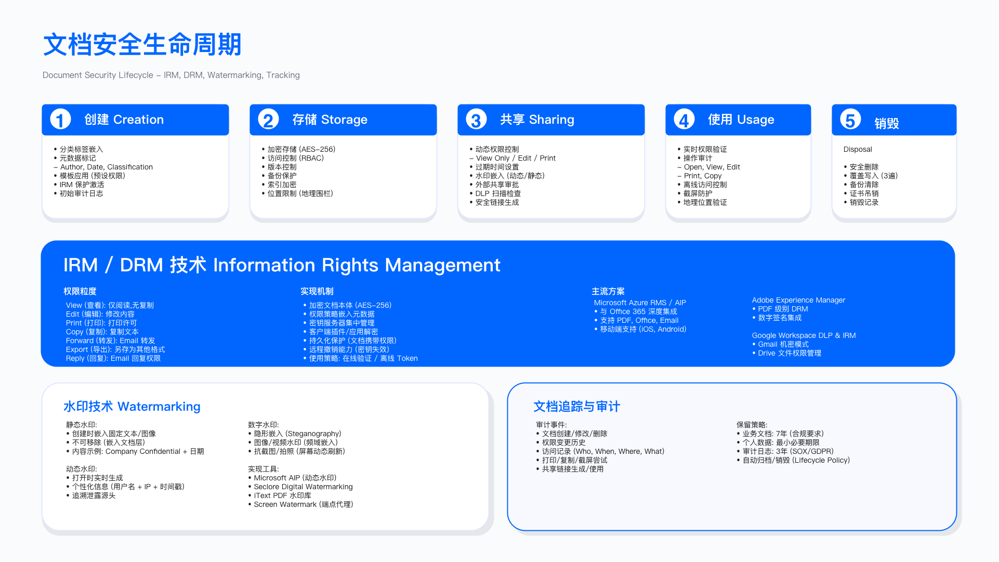

# 10.2 信息分类与标记

## 概述

信息分类构成信息保护的基础性控制措施。分类框架的核心目标在于：根据信息的业务价值与敏感程度，匹配相应的保护等级与处理要求，从而在资源有限的条件下实现风险与成本的平衡。

本节从分类框架设计出发，讨论自动化分类技术的实现路径、标签技术的工程部署，以及用户培训与合规审计的运营保障机制。

---

## 10.2.1 分类框架设计

### 问题背景

信息分类的核心挑战在于：如何建立一套既能覆盖组织内多样化信息类型，又不至于复杂到员工无法执行的分类体系。过于简单的分类（如仅区分“公开/机密”两级）无法精确匹配差异化的保护需求；过于复杂的分类（如超过五级）则导致员工判断困难、分类准确率下降。

### 四级分类模型

多数企业采用四级分类模型作为基础框架。该模型在粒度与可操作性之间取得平衡，且与多数行业监管要求兼容。

*图 10.1: 信息分类框架 - Public/Internal/Confidential/Restricted 四级分类体系与处理要求*

四级分类的典型定义如下：

**公开级（Public）**：可向公众发布的信息，披露不会对组织造成损失。典型示例包括公司官网内容、已发布的营销材料、公开招聘信息、已公告的财务报告等。技术控制要求最低：加密可选、访问无限制、DLP 不监控。

**内部级（Internal Use Only）**：仅限组织内部使用的信息，未授权披露可能造成轻微损失。典型示例包括内部流程文档、一般业务邮件、非敏感项目计划、内部通讯录等。技术控制要求：传输加密（TLS）、需认证访问（SSO）、基础 DLP 监控（外发告警）。

**机密级（Confidential）**：敏感业务信息，未授权披露可能造成重大损失。典型示例包括未公开财务数据、客户个人信息（PII）、商业合同、未发布产品路线图、员工薪资数据等。技术控制要求：静态与传输加密强制、RBAC 访问控制配合 MFA、DLP 严格监控（自动阻止外发）、推荐 IRM 保护。

**高度机密级（Highly Confidential）**：最高敏感度信息，披露将造成严重损害（法律诉讼、重大财务损失或声誉危机）。典型示例包括核心源代码、未申请专利的关键算法、高管薪酬、重大诉讼资料、并购尽职调查数据等。技术控制要求：AES-256 加密配合密钥分离管理、命名授权配合 MFA 与生物识别、DLP 禁止所有外发、IRM 强制、动态水印追踪。

### 文档安全生命周期

分类框架需要与文档生命周期管理结合。从创建、存储、共享、归档到销毁，每个阶段需明确对应的安全控制要求。

*图 10.2: 文档安全生命周期 - 创建、存储、共享、归档、销毁全流程安全控制*

关键控制点覆盖文档全生命周期：**创建阶段**强制要求作者在创建时选择分类级别，对于特定敏感目录（如 `/legal/`、`/finance/`）系统可预设默认分类；**存储阶段**机密及以上级别信息必须存储于加密系统，存储位置需与分类级别匹配（高度机密信息可考虑物理隔离存储）；**共享阶段**机密级信息外发需经业务审批并签署 NDA，高度机密信息原则上禁止邮件传输，需使用 IRM 保护或面对面交接；**归档阶段**根据记录保留政策设定保留期限，定期审查归档信息是否仍需保留；**销毁阶段**内部级信息安全删除即可，机密及以上级别需安全擦除或物理粉碎，高度机密信息需认证销毁服务并保留销毁证明。

### 分类决策辅助

为降低员工分类判断的认知负担，可设计决策树辅助用户判断。典型决策逻辑：

1. 此信息是否已公开发布或可公开？若是，则为公开级。
2. 未授权披露是否会违反法律（如 GDPR、HIPAA）或造成诉讼风险？若是，则为高度机密级。
3. 是否包含客户 PII、财务数据、商业秘密或未发布产品信息？若是，则为机密级。
4. 以上均不符合，则默认为内部级。

决策树的价值在于将复杂的分类判断转化为有限的二元选择，使非安全专业人员也能在可接受的时间内完成分类。

### 适用边界

四级分类模型适用于大多数商业企业，但以下场景可能需要调整。**金融机构**可能需要增加与监管相关的分类级别（如"监管敏感"），以区分受特定金融法规保护的信息。**国防与政府承包商**通常需要遵循政府规定的分类体系（如中国的涉密等级、美国的 Confidential/Secret/Top Secret），企业分类需与政府分类对接。**医疗机构**则需要考虑 PHI（受保护健康信息）的特殊保护要求。

### 关键约束

员工认知负担是首要约束：分类级别超过五级时，员工准确分类的能力显著下降。分类一致性同样是挑战，不同部门、不同员工对同一信息的分类可能不一致，需要通过培训与抽样审计控制分类偏差。业务效率影响亦需考量，过度分类（将内部级信息标为机密级）会增加不必要的审批流程与访问限制，影响业务效率。

### 常见误区

**"分类即安全"**是常见误解，误以为完成分类即完成保护。分类仅是保护的前提，后续的访问控制、加密、DLP 策略才是实际的保护措施，若分类后未配置相应的技术控制，分类本身不产生保护效果。**静态分类思维**同样需要警惕，在数据创建时分类后不再复审，实际上信息的敏感度会随时间变化——例如产品路线图在发布前为机密级、发布后可能降为内部级或公开级，用户行为数据随积累可能从内部级升级为机密级，需要建立定期复审机制。此外，**忽视衍生文档**也是常见问题，未建立标签传播规则，从机密文档复制内容到新文档时新文档应自动继承源文档的分类级别，多源聚合文档应取最高分类级别。

### 验证方法

验证方法包括三个层面：**抽样复核**定期抽取样本文档，由信息安全专家复核用户分类是否准确；**分类偏差分析**对比自动分类与人工分类的结果，识别系统性偏差；**业务部门反馈**收集因分类不当导致的访问受阻或泄露事件，反向验证分类框架的合理性。

### 运行指标

核心运行指标包括**分类覆盖率**（已分类文档占活跃文档总数的比例，覆盖率低于阈值时需排查未分类文档来源）、**分类准确率**（专家复核样本中分类正确的比例，准确率低于阈值时需加强培训或优化决策工具）、以及**过度分类率**（经复核判定为过度分类的比例，过度分类率高于阈值时需优化分类指南）。

---

## 10.2.2 自动化分类技术

### 问题背景

人工分类面临效率与一致性的双重挑战：员工每日产生的文档数量庞大，逐一人工分类既不现实也不经济；且不同员工对同一信息的分类判断可能不一致。自动化分类技术旨在通过规则引擎与机器学习模型，辅助或替代人工分类，提升分类效率与一致性。

### 技术路径对比

自动化分类存在两种主要技术路径：

**基于规则的分类**：使用预定义的正则表达式、关键词列表、文件元数据规则进行匹配。优点是确定性强、可解释、无需训练数据；缺点是规则维护成本高、难以应对语义变化与新模式。

**基于机器学习的分类**：使用文本分类模型（如朴素贝叶斯、支持向量机、Transformer 等）从训练数据中学习分类规律。优点是能够捕捉语义特征、适应性强；缺点是需要标注数据、模型行为可解释性较差、存在误分类风险。

工程实践中，多数企业采用混合策略：规则引擎处理高置信度的确定性场景（如信用卡号、身份证号的正则匹配），机器学习模型处理需要语义理解的模糊场景。

### 规则引擎设计

规则引擎的核心是定义匹配规则与分类映射。典型规则类型包括：

正则表达式规则：匹配特定格式的敏感数据。例如：
- 信用卡号模式：`\b\d{4}[-\s]?\d{4}[-\s]?\d{4}[-\s]?\d{4}\b`，匹配则分类为机密级
- 身份证号模式（中国）：`\b\d{17}[\dXx]\b`，匹配则分类为机密级

关键词规则：检测特定关键词触发分类。例如：
- 高度机密关键词：top secret、merger、acquisition、patent pending、trade secret
- 机密关键词：confidential、proprietary、customer data、financial statement、salary

元数据规则：基于文件位置、作者部门等元数据判断。例如：
- 存储于 `/legal/litigation/` 目录的文档默认为高度机密级
- 法务部门创建的文档默认为机密级

规则应用的优先级通常为：正则匹配（高置信度）> 关键词匹配（中置信度）> 元数据规则（基线置信度）。

### 机器学习分类器

机器学习分类器需要解决以下工程问题：

**特征工程**从文档中提取可用于分类的特征，包括文本特征（词频、TF-IDF、词嵌入）、结构特征（文档类型、是否包含表格/图片、文档长度）、元数据特征（作者部门、创建时间、文件路径）、以及命名实体识别（NER）结果（是否包含人名、组织名、地址、金额）。

**模型选择**：根据数据规模与准确率要求选择模型。小规模数据可使用朴素贝叶斯或支持向量机；大规模数据可使用预训练语言模型（如 BERT 变体）进行微调。

**置信度阈值**：设定模型预测结果的置信度阈值。低于阈值的预测应交由人工复核，而非直接应用。

### 混合分类策略

混合分类策略的典型流程：

1. 首先应用规则引擎。若规则命中且置信度高于阈值，直接采用规则分类结果。
2. 若规则未命中或置信度不足，调用机器学习模型。
3. 对比规则与模型的置信度，取较高者作为最终分类结果。
4. 若最终置信度仍低于阈值，标记为“待人工复核”。

### 用户反馈循环

自动化分类的持续改进依赖用户反馈。当用户认为自动分类结果不正确并手动修正时，系统应记录该反馈用于**规则优化**（识别规则遗漏的模式或误报的场景）、**模型再训练**（将修正后的样本加入训练集）、以及**异常检测**（若连续多个分类被修正，可能表明分类规则或模型存在系统性问题）。

### 适用边界

自动化分类适用于文档格式相对标准化的场景（如 Office 文档、PDF、纯文本）、存在可识别的敏感数据模式（如 PII、金融数据）、以及组织已积累一定规模的已分类样本用于模型训练的环境。

自动化分类不适用于高度非结构化内容（如手写扫描件、复杂图表中的嵌入文字）、敏感性主要来自上下文而非内容本身的信息（如特定商务谈判的时间敏感性）、以及无法积累训练数据的新兴业务场景。

### 关键约束

**准确率与召回率权衡**是首要约束：高召回率意味着更多潜在敏感文档被标记，但可能增加误报；高准确率意味着减少误报，但可能遗漏真正敏感的文档，需要根据业务风险容忍度设定平衡点。**处理性能**同样是挑战，大规模文档扫描对计算资源要求较高，需设计分批处理或增量扫描策略。**新模式识别延迟**亦需考量，机器学习模型对未见过的敏感数据模式（如新型 PII）存在识别延迟，需要持续更新训练数据。

### 常见误区

**过度依赖自动化**是常见误区，认为自动化分类可完全替代人工判断，实际上自动化分类应定位为辅助工具，高敏感场景仍需人工复核。**忽视模型漂移**同样危险，模型上线后不再更新，随着业务变化文档内容分布可能发生变化导致模型准确率下降，需要建立定期模型评估与再训练机制。

### 验证方法

验证方法包括三个层面：**测试集评估**使用保留的测试集评估模型的准确率、召回率、F1 值；**生产环境抽样**定期从生产环境抽取样本，人工复核自动分类结果；**误报/漏报分析**统计用户手动修正的比例与类型，识别分类规则或模型的薄弱环节。

### 运行指标

核心运行指标包括**自动分类覆盖率**（自动完成分类且无需人工干预的文档占比）、**自动分类准确率**（自动分类结果经人工复核确认正确的比例）、以及**人工修正率**（用户手动修改自动分类结果的比例，修正率高于阈值时需排查分类规则或模型问题）。

---

## 10.2.3 标签技术实现

### 问题背景

分类框架确定了信息的敏感等级，但需要通过标签技术将分类结果“具体化”为用户可见的标识、系统可读的元数据、以及可追踪的水印。标签是分类策略执行的技术载体。

### 标签类型

标签技术可分为三类：

**视觉标签**在文档页眉、页脚或正文中显示分类级别，使人类读者一目了然。视觉标签的设计需考虑颜色编码（公开级绿色、内部级蓝色、机密级橙色、高度机密级红色）、文字内容（中英文双语显示分类级别与处理提示）、以及位置与字体（确保不影响文档正常阅读）。

**元数据标签**将分类信息写入文件的元数据字段，供 DLP、IRM 等系统读取与执行策略。元数据标签的技术实现包括 Windows 文件系统的 NTFS 扩展属性（Alternate Data Streams）、Linux/macOS 的扩展属性（xattr）、以及云存储的对象标签（如 S3 Object Tags、Azure Blob Metadata）。

**动态水印**：在高敏感文档中嵌入包含访问者身份、访问时间、文档标识的水印，用于泄露追踪。水印可为可见或不可见，位置可为对角线居中、页角或随机分布。

### 标签应用流程

标签应用应与文档创建、分类流程集成：

1. 用户创建文档并选择分类级别（或系统自动分类）
2. 系统根据分类级别自动应用对应的视觉标签模板
3. 系统将分类元数据写入文件属性
4. 若为高度机密级，系统生成动态水印嵌入文档

标签应用的技术集成点包括：Office 插件（Word/Excel/PowerPoint）、邮件客户端插件（Outlook）、文档管理系统（SharePoint）、云存储服务。

### 标签传播规则

文档衍生场景需要建立标签传播规则，确保衍生文档继承适当的分类级别。**复制操作**时衍生文档继承源文档的分类级别；**摘录或引用**时即使仅引用部分内容，衍生文档仍继承源文档分类；**多源聚合**时从多个源文档聚合内容，衍生文档应取最高分类级别；**降级操作**若对机密文档进行脱敏处理后希望降低分类级别，需经人工审批。

### 适用边界

标签技术适用于结构化的办公文档（Word、Excel、PowerPoint、PDF）、支持元数据写入的文件系统与存储服务、以及具备文档处理插件集成能力的办公环境。

标签技术受限于无法嵌入元数据的文件格式（如纯图片、部分压缩格式）、用户可绕过标签（如截图、手动删除元数据）、以及跨组织协作时标签可能不被对方系统识别。

### 关键约束

**用户体验**是首要约束：标签应用流程若过于繁琐，员工可能绕过或随意选择分类，需要将分类选择集成到正常工作流程中，尽量减少额外操作步骤。**跨平台兼容性**同样是挑战，元数据标签在不同操作系统、不同应用间的兼容性需要验证。**标签防篡改**亦需考量，普通用户不应能够修改高敏感文档的分类标签，需要通过权限控制或数字签名防止标签被篡改。

### 常见误区

**仅依赖视觉标签**是常见误区，视觉标签仅供人类识别，无法被自动化系统执行策略，若仅有视觉标签而无元数据标签，DLP 系统无法基于分类级别执行拦截策略。**忽视标签生命周期**同样危险，未建立标签复审与更新机制，文档分类可能随时间变化（如项目完结后敏感度降低），标签应与分类同步更新。

### 验证方法

验证方法包括三个层面：**标签完整性检查**扫描文档库，验证机密及以上级别文档是否同时具备视觉标签与元数据标签；**标签一致性验证**对比文档的视觉标签与元数据标签，检测不一致情况；**标签传播测试**验证从机密文档复制内容到新文档时，标签传播规则是否生效。

### 运行指标

核心运行指标包括**标签覆盖率**（已应用标签的文档占已分类文档的比例）、**标签一致性率**（视觉标签与元数据标签一致的文档比例）、以及**标签传播有效率**（衍生文档正确继承源文档分类的比例）。

---

## 10.2.4 用户培训与合规审计

### 问题背景

信息分类体系的有效性最终取决于用户的执行。无论自动化技术多么成熟，仍有大量场景需要用户主动判断与选择分类级别。培训确保用户理解分类框架与操作方法；审计验证分类体系的实际执行效果。

### 培训体系设计

培训体系应分层设计，覆盖不同角色的差异化需求：

**全员基础培训**为所有员工入职及年度必修，内容包括信息分类的必要性（结合真实泄露案例说明后果）、四级分类框架的定义与示例、分类决策树的使用方法、标签工具的实际操作（邮件客户端、Office 插件）、以及外部分享的审批流程。

**角色专项培训**针对特定角色进行深化，高管层聚焦高度机密信息处理规范、并购信息保护、媒体询问应对；人力资源与财务部门聚焦 PII 与财务数据保护、薪资信息保密；法务部门聚焦诉讼材料保护、律师-客户特权、取证链保全；销售与市场部门聚焦客户数据外部分享规范、演示材料分类。

**持续强化机制**确保培训不是一次性活动，包括定期分享分类最佳实践与常见错误、结合钓鱼演练测试员工分类意识、以及建立分类正确率激励机制。

### 合规审计框架

审计框架应覆盖分类体系的各关键环节：

**分类覆盖率审计**：验证活跃文档中已分类的比例。审计方法为定期抽样文档库，统计未分类文档数量与来源。

**分类准确率审计**：验证分类结果的正确性。审计方法为抽取样本文档，由专家复核分类是否准确。

**标签一致性审计**：验证标签是否正确应用。审计方法为扫描文档属性，检查标签是否存在、格式是否正确、与分类级别是否匹配。

**过度分类/分类不足审计**：识别分类偏差模式：
- 过度分类：将低敏感信息标为高敏感级别，影响业务效率
- 分类不足：将高敏感信息标为低敏感级别，产生安全风险

审计发现应分级处理：
- 关键发现（如高度机密文档未加密）：限期整改并验证
- 高级发现（如机密文档无标签）：30 日内整改
- 中级发现（如分类不准确）：纳入培训改进
- 低级发现（如标签格式不符）：列入优化清单

### 适用边界

培训与审计适用于所有实施信息分类的组织，但培训方式应根据组织规模与员工分布调整。小型组织可采用现场培训；大型或分布式组织需依赖在线学习平台（LMS）；高流动性行业需增加入职培训频次。

### 关键约束

**培训资源**是首要约束，培训设计、课件制作、考核系统均需资源投入。**员工时间**同样是挑战，培训占用员工工作时间，需控制培训时长（建议单次不超过 30 分钟）。**审计人力**亦需考量，人工复核需要信息安全专家参与，大规模审计需要抽样策略。

### 常见误区

**"培训即合规"**是常见误区，认为完成培训即意味着员工会正确执行，培训是必要条件但非充分条件，需要配合审计验证实际效果。**审计形式化**同样危险，审计仅走流程、不追踪整改，审计的价值在于发现问题并推动改进，若发现问题后不追踪整改，审计沦为形式。

### 验证方法

验证方法包括三个层面：**培训有效性验证**对比培训前后的分类准确率，评估培训效果；**审计流程验证**验证审计发现是否得到跟踪与闭环；**用户满意度调研**收集用户对分类工具与流程的反馈，识别体验痛点。

### 运行指标

核心运行指标包括**培训完成率**（完成必修培训的员工比例，完成率低于阈值时 HR 跟踪未完成者）、**培训测验通过率**（首次测验通过的比例，通过率低于阈值时重新评估课程设计）、**分类准确率趋势**（逐期审计的分类准确率变化，准确率持续下降时需排查原因）、以及**审计发现闭环率**（审计发现得到整改并验证的比例）。

---

## 本节小结

信息分类与标记构成信息保护体系的基础控制层。四级分类框架在多数商业企业场景中可提供合理的粒度与可操作性平衡。自动化分类技术（规则引擎与机器学习的混合策略）可提升分类效率与一致性，但需要持续维护与优化。标签技术将分类结果具体化为可执行的控制载体，包括视觉标签、元数据标签与动态水印。培训与审计确保分类体系的实际执行效果。

在工程实施中，建议从高价值资产开始渐进推进，优先覆盖明确敏感的数据类型（如 PII、财务数据），再逐步扩展至一般业务信息。分类工具应深度集成到员工日常工作流程中，将分类操作时间控制在可接受范围内。

---

## 导航

**[← 上一节：10.1 信息保护战略](./10.1_information_protection_strategy.md)** | **[返回章节目录](./README.md)** | **[下一节：10.3 信息权限管理（IRM/DRM） →](./10.3_information_rights_management.md)**

---

**© 2025 AI-ESA Project. Licensed under CC BY-NC-SA 4.0**

