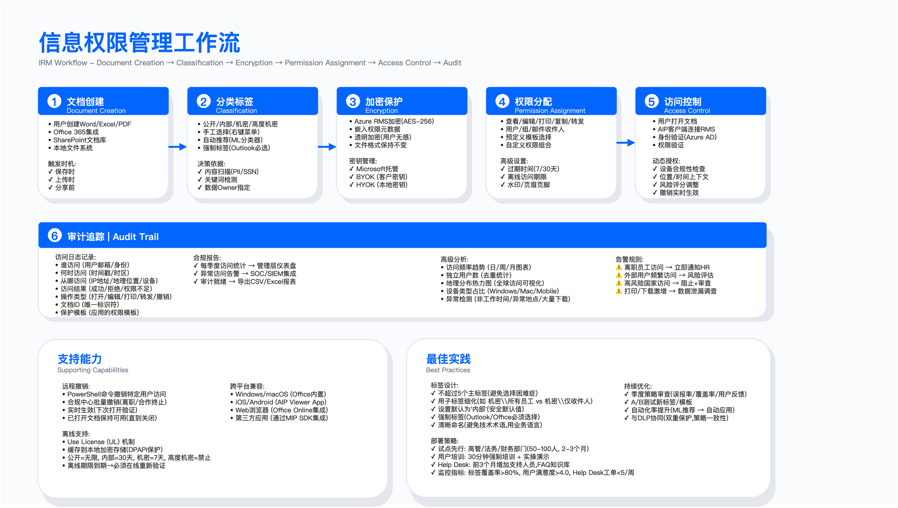

# 10.3 信息权限管理（IRM/DRM）

## 概述

信息权限管理（Information Rights Management，IRM）与数字版权管理（Digital Rights Management，DRM）通过文档级加密与嵌入式访问策略，实现对已分发文档的持续控制。其核心设计目标是：即使文档离开企业网络边界（通过邮件、USB、云存储等途径外发），仍可限制查看、编辑、打印、转发等操作，并支持远程撤销已授予的访问权限。

本节从技术原理与工程落地两个维度展开：首先厘清 IRM 与 DRM 的适用场景差异，然后以 Azure Information Protection（AIP）为例说明企业级部署架构，最后讨论动态授权、离线保护、密钥管理等关键设计决策点。

适用边界：IRM 适用于需要对外分享但仍需保持控制权的场景（如合同、尽调资料、董事会材料）；对于纯内部协作且已有网络边界控制的场景，IRM 的额外复杂度可能不具成本效益。

---

## 10.3.1 IRM 与 DRM 技术对比

### IRM 工作流程



*图：IRM 工作流程——文档加密、权限策略嵌入、密钥服务验证、审计日志记录*

### 技术定位与差异

IRM 与 DRM 在技术实现上有相似之处（均采用加密 + 许可证服务器架构），但其设计目标与适用场景存在显著差异。

IRM（信息权限管理）面向企业文档保护场景，典型保护对象包括 Office 文档、PDF、邮件附件。其技术特征包括：细粒度权限控制（查看 / 编辑 / 打印 / 复制 / 转发可独立配置）、与企业身份系统集成（Active Directory、Azure AD）、支持远程撤销与访问审计。主流方案包括 Microsoft Azure Information Protection、Adobe Experience Manager、Seclore 等。

DRM（数字版权管理）面向消费者内容保护场景，典型保护对象包括流媒体视频、电子书、音乐。其技术特征包括：设备绑定（限制播放设备数量）、许可证管理（购买 / 租赁 / 订阅模式）、平台封闭性（需专用播放器）。主流方案包括 Google Widevine、Apple FairPlay、Microsoft PlayReady 等。

两者的核心差异可归纳为：

| 维度 | IRM | DRM |
|------|-----|-----|
| 目标用户 | 企业员工与合作伙伴 | 消费者 |
| 内容类型 | 文档（Office / PDF / 邮件） | 媒体（视频 / 音频 / 电子书） |
| 权限粒度 | 细粒度（多项权限独立控制） | 粗粒度（可访问 / 不可访问） |
| 身份集成 | 企业 IAM（AD / SAML / OAuth） | 账户绑定 |
| 用户体验 | Office 内置（相对透明） | 需专用播放器 |

上表总结了 IRM 与 DRM 在企业场景下的关键区分维度。对于企业信息保护需求，后续章节聚焦于 IRM 技术体系。

### IRM 典型使用场景

IRM 的价值在于解决“文档外发后失控”的问题。以下场景可作为部署优先级评估的参考：

并购尽职调查：尽调数据室中的财务、法律文档需向潜在买方开放，但交易失败后必须收回访问权。IRM 可实现：水印追踪查看者身份、禁止下载 / 打印、交易终止后远程撤销所有访问。

董事会材料分发：高管薪酬、战略规划等敏感材料通过邮件发送给董事会成员，存在转发泄露风险。IRM 可实现：仅限指定收件人查看、禁止转发、会议结束后自动过期。

外部合作文档：向客户或合作伙伴分享机密方案，担心被进一步传播。IRM 可实现：限制仅查看、禁止打印 / 转发、设置访问有效期。

离职员工设备：员工在个人设备上访问过的公司文档，离职后仍可能留存本地副本。IRM 可实现：远程撤销所有历史访问权限，使本地副本无法解密。

常见误区：将 IRM 视为“万能”防泄露方案是典型误解，IRM 无法阻止用户对屏幕拍照或通过其他物理手段复制内容。忽略离线访问场景同样危险，用户在离线状态下可在许可证有效期内继续访问，撤销操作需等待用户重新联网。

---

## 10.3.2 Azure Information Protection 实战

### AIP 架构组件

Azure Information Protection（AIP）是 Microsoft 提供的企业级 IRM 解决方案，与 Microsoft 365 深度集成。其架构包含以下核心组件：

云端服务层：Azure Rights Management Service（Azure RMS）负责密钥管理与权限策略执行；Azure Information Protection 服务负责标签定义与策略分发；Azure Key Vault（可选）支持 BYOK（自带密钥）场景。

客户端组件：AIP 统一标签客户端（支持 Windows / macOS / iOS / Android）；Office 内置敏感度标签（Microsoft 365 E3 及以上版本原生支持）；AIP 本地扫描器（用于自动发现和分类本地文件共享中的敏感文档）。

保护工作流程：用户对文档应用敏感度标签（手工或自动触发）→ 标签关联保护模板 → 文档使用 AES-256 加密并嵌入权限元数据 → 加密文档可通过任意途径分发（邮件 / Teams / USB）→ 接收者打开时客户端连接 Azure RMS 验证身份与权限 → 验证通过后解密文档并执行权限限制（如禁止打印）→ 所有访问记录写入审计日志。

### 敏感度标签体系设计

敏感度标签（Sensitivity Label）是 AIP 的核心配置单元，决定了文档的保护策略。标签设计应遵循“简洁可执行”原则——标签数量过多会导致用户选择困难，过少则无法覆盖差异化场景。

以下是一个典型的四级标签体系示例：

公开（Public）：无保护要求，可自由分发。应用场景：市场宣传材料、公开产品文档。无加密、无访问限制。

内部（General）：面向公司内部员工，不适合外部分享。应用场景：内部会议纪要、一般性工作文档。可选加密，添加"内部使用"页眉 / 页脚标记。

机密（Confidential）：包含商业敏感信息，需限制访问范围。建议设置子标签以区分不同受众：
- "机密 - 所有员工"：允许全体员工查看 / 编辑，禁止打印 / 转发 / 复制，离线访问限制为 7 天
- "机密 - 仅收件人"：仅邮件收件人可查看，禁止所有其他操作，30 天后自动过期

高度机密（Highly Confidential）：最高敏感级别，访问范围严格受限。建议设置子标签以区分受众：
- "高度机密 - 高管专用"：仅限高管组成员访问，禁止离线访问，每次打开需 MFA 验证

标签应配置自动标记规则（Auto-labeling），基于内容特征（如检测到信用卡号、身份证号、特定关键词）自动推荐或强制应用标签。自动标记可设置为“推荐”（用户确认后应用）或“自动”（无需用户干预）两种模式，前者适用于低置信度检测场景，后者适用于高置信度规则（如明确的正则匹配）。

关键约束：标签命名应清晰明确，避免模糊术语（如“重要”）。子标签层级建议不超过两层，避免用户导航困难。强制标签策略（Mandatory Labeling）可确保所有文档都被分类，但会增加用户操作负担。

### 程序化标签应用

批量标签应用可通过 PowerShell 或 Microsoft Information Protection SDK 实现自动化：

```powershell
# Azure Information Protection PowerShell 自动化示例

# 安装模块
Install-Module -Name AzureInformationProtection

# 连接到 AIP 服务
Connect-AIPService

# 获取保护模板
$template = Get-AipServiceTemplate | Where-Object {$_.Name -eq "Confidential - All Employees"}

# 对指定文件应用标签
Set-AIPFileLabel -Path "C:\Documents\Contract.docx" -LabelId $template.TemplateId -Owner "admin@company.com"

# 验证标签应用结果
Get-AIPFileStatus -Path "C:\Documents\Contract.docx"
```

### 访问撤销机制

远程撤销是 IRM 区别于传统加密的核心能力之一。撤销操作通过 Azure RMS 实现：管理员在合规中心定位目标文档，执行撤销（可针对特定用户或所有用户），用户下次尝试打开文档时，客户端连接 Azure RMS 进行权限验证，收到拒绝响应（HTTP 403），文档保持加密状态但无法解密。

典型撤销场景包括：员工离职后撤销其访问过的所有受保护文档、合作终止后撤销外部合作伙伴的访问、文档误发后紧急撤回、M&A 交易失败后撤销尽调资料访问。

撤销的局限性包括：离线访问期间用户仍可访问（直到本地许可证过期）、已打印的物理副本无法撤销、用户在撤销前可能已截屏或拍照、撤销传播依赖用户下次联网打开文档。

### 文档使用追踪

AIP 提供完整的访问审计能力，可记录的数据包括：访问者身份（用户邮箱）、访问时间（时间戳）、访问来源（IP 地址 / 地理位置）、访问结果（成功 / 拒绝）、操作类型（打开 / 编辑 / 打印）。

审计数据可通过以下途径访问：Microsoft 365 合规中心的内容资源管理器、PowerShell 命令查询（Get-AipServiceDocumentLog）、导出至 SIEM 系统（Microsoft Sentinel、Splunk）进行关联分析。

基于审计数据可配置告警规则，检测异常访问模式：大量文档在短时间内被下载（数据泄露指标）、离职员工尝试访问受保护文档、外部用户从高风险地区访问、非工作时间的异常访问行为。

验证方法：创建测试文档并应用保护，验证不同用户的访问权限是否符合预期；执行撤销操作后验证用户是否无法再打开文档；检查审计日志是否完整记录访问事件。

运行指标：标签覆盖率衡量已应用敏感度标签的文档占比（目标值需根据组织情况设定）；撤销响应时间衡量从发起撤销到生效的时间（取决于用户联网时间）；异常访问告警数按严重等级分层统计。

---

## 10.3.3 动态授权与权限撤销

### 上下文感知权限

静态权限模板在某些场景下过于僵化——同一用户在不同设备、位置、时间访问同一文档时，风险程度可能差异显著。上下文感知权限（Context-aware Permissions）基于访问时的环境因素动态调整授权决策。

典型的上下文因素包括：设备状态（是否企业托管、是否加密、是否越狱）、地理位置（是否在高风险国家 / 地区）、网络环境（企业网络 / 公共 WiFi / VPN）、访问时间（工作时间 / 非工作时间）、用户风险评分（是否处于离职通知期、是否有历史违规记录）。

权限调整逻辑示例：高风险评分（如非托管设备 + 异常位置）应降级权限（禁止打印、禁止离线访问）；非公司设备应禁止下载和打印；异常位置应强制 MFA 验证；非工作时间应限制为只读模式；离职通知期内应禁止转发、打印、下载。

动态授权需要与 Conditional Access（条件访问）策略协同工作，在 Azure AD 层面评估风险信号，在 AIP 层面执行权限调整。

常见误区：规则过于复杂会导致用户体验严重下降，应优先保障核心业务场景的可用性。另一个误区是风险评分模型未经验证直接上线，建议先以审计模式运行，验证评分准确性后再正式启用。

### 基于时间的权限过期

时间过期策略是管理外部分享风险的有效手段。典型策略配置包括：

| 场景 | 默认过期时间 | 延期规则 |
|------|-------------|---------|
| 外部分享 | 7 天 | 最多延长至 30 天，超过需审批 |
| 外包人员 | 合同期结束 | 需项目负责人审批 |
| 顾问访问 | 项目结束 + 30 天 | 不可延期 |
| 高度机密文档 | 不适用时间过期 | 需显式撤销 |

权限应定期审查：每季度审查所有长期访问（超过 90 天）、年度全面权限审计、组织变更（离职 / 转岗）触发即时审查。

验证方法：配置测试文档的过期时间，验证过期后用户是否无法访问；模拟离职场景，验证撤销流程是否有效执行；审计长期访问权限列表，识别异常授权。

---

## 10.3.4 离线保护与密钥管理

### 离线访问策略

IRM 需要在安全性与可用性之间取得平衡——完全禁止离线访问会严重影响移动办公场景（如出差、航班）的用户体验，而无限制的离线访问则削弱了撤销能力的有效性。

离线访问策略应根据文档敏感度分级配置：

| 敏感度级别 | 允许离线 | 离线时长 | 离线限制 |
|-----------|---------|---------|---------|
| 公开 | 是 | 无限制 | 无 |
| 内部 | 是 | 30 天 | 在线时自动续期 |
| 机密 | 是 | 7 天 | 禁止打印 / 转发 |
| 高度机密 | 否 | 不适用 | 每次打开需在线验证 |

离线访问通过“使用许可证”（Use License）机制实现：用户首次在线打开文档时，客户端从 Azure RMS 获取使用许可证，许可证包含解密密钥（加密存储）、权限列表、过期时间，许可证缓存到本地（Windows 系统存储在 %LOCALAPPDATA%\Microsoft\MSIPC，受 DPAPI 保护）。离线状态下客户端读取本地许可证解密文档；许可证过期后必须重新联网验证。

安全考量：使用许可证绑定设备与用户，无法在其他设备上使用；客户端检测系统时间篡改（防止通过调整系统时间延长许可证有效期）；许可证加密存储，无法直接提取解密密钥；用户重新联网时客户端检查撤销列表。

### 密钥管理策略

AIP 支持三种密钥管理模式，组织应根据合规要求与运维能力选择：

Microsoft 托管密钥（默认）：密钥由 Microsoft 在 Azure 中生成并管理。优点是配置简单、无需额外硬件、自动密钥轮换；局限是 Microsoft 理论上可访问密钥（虽有合同与审计保障），部分强合规行业可能不接受。适用于大多数企业场景。

BYOK（Bring Your Own Key）：客户在本地 HSM（硬件安全模块）生成密钥，通过安全传输机制上传至 Azure Key Vault HSM。密钥在传输过程中始终加密，在 Azure 中仅在 HSM 内解密使用。优点是客户完全控制密钥生命周期，满足 PCI-DSS、HIPAA 等合规要求；局限是实施复杂度高，需采购 HSM 硬件并具备相应运维能力。适用于金融、医疗、政府等强合规行业。

HYOK（Hold Your Own Key）：密钥完全保留在客户本地环境，永不上传至 Azure。需要部署本地 AD RMS 服务器，与 Azure AD 混合集成。优点是最高控制权，密钥永不离开本地；局限是失去云便利性（离线 / 移动访问受限）、需维护本地基础设施、部分 Microsoft 365 功能不可用。适用于国防、情报等极端合规要求场景。

决策建议：对于大多数企业，BYOK 提供了安全性与可用性的合理平衡；HYOK 的复杂度与功能限制通常不具成本效益，仅在监管明确要求的场景下考虑。

密钥轮换：建议年度轮换或在安全事件后触发轮换。轮换过程对用户透明，新文档使用新密钥加密，旧文档保持旧密钥（或按策略重新加密），旧密钥保留用于解密历史文档。

关键约束：BYOK 需要采购 HSM 设备（成本区间因厂商与型号而异）；密钥管理需要专业技能，建议在实施前评估团队能力；密钥丢失将导致受保护文档永久无法解密，这是不可逆的灾难性后果。

---

## 10.3.5 IRM 实施要点与局限性

### 部署策略

IRM 部署应采用渐进式推广策略，避免一次性全员上线导致的支持压力：

试点阶段：选择高价值文档场景与早期采用者（建议从高管助理、法务、财务等处理敏感文档频繁的岗位开始），明确试点周期与成功标准（如用户满意度、技术问题数量、业务流程影响）。

分阶段推广：第一阶段覆盖高敏感部门（HR / Finance / Legal），第二阶段覆盖外部分享频繁的部门（销售 / 市场 / BD），第三阶段全员推广。

用户培训：培训内容应聚焦于实际操作（如何在 Outlook / Word 中应用标签），而非技术原理；建立常见问题库（如何撤销、如何设置过期、外部用户如何访问）；试点期间增加 Help Desk 支持人员。

### 标签设计原则

标签设计应遵循简洁可用原则：主标签数量控制在 5 个以内以避免用户选择困难，通过子标签细化受众范围而非增加主标签数量。默认标签建议设置为"内部"，确保安全默认。对 Outlook / Office 应启用强制标签（Mandatory Labeling），确保所有发送的文档和邮件都被分类。预定义常用权限模板可避免用户每次自定义权限带来的操作负担与配置错误风险。

### 技术局限性

截屏与拍照：IRM 无法从技术上完全阻止用户截屏或用手机拍照。端点 DLP 可部分阻止截屏工具，动态水印可追踪泄露源头，但最终仍依赖用户意识与政策约束。

移动设备支持：iOS / Android 上的 AIP 支持依赖专用应用（Azure Information Protection Viewer），用户体验不如桌面端 Office 原生集成流畅。

第三方应用支持：非 Office 应用（如 AutoCAD、Photoshop）的 IRM 支持依赖 SDK 集成，部分应用可能不支持或支持不完整。变通方案是将文件转为 PDF 后再应用 IRM 保护。

老旧系统：缺少 IRM 客户端的老旧系统无法打开受保护文档，可考虑通过 VDI（虚拟桌面）提供访问途径。

### 用户体验权衡

在线验证延迟：首次打开受保护文档需联网验证，在网络条件差的环境下可能影响体验。合理设置离线访问期限可缓解此问题。

外部分享摩擦：外部用户需要 Microsoft 账户或一次性密码才能访问受保护文档，增加了分享的摩擦。对于大规模外部分享场景（如投资人路演），可考虑虚拟数据室（如 Intralinks、Datasite）作为替代方案。

打印限制与业务需求：某些场景（如合同签署）确实需要打印，完全禁止打印可能阻碍业务。建议允许打印但强制添加水印，在保护与可用性之间取得平衡。

验证方法：通过用户满意度调查（试点期间与推广后）评估接受度；分析 Help Desk 工单数量与类型以识别常见问题；监控标签应用耗时以确保平均标签时间在可接受范围内。

运行指标：标签采用率衡量已启用标签的用户占比与已标签文档占比；保护文档数量按敏感度级别统计；用户自助率衡量无需 Help Desk 介入的操作占比；撤销事件数按触发原因分类统计；异常访问告警追踪未授权访问尝试次数。

---

## 本节小结

IRM 技术的核心价值在于实现文档离开企业边界后的持续控制能力，包括精细化权限管理、远程撤销、访问审计。Azure Information Protection 是当前企业级 IRM 的主流方案，与 Microsoft 365 生态深度集成。

实施要点包括：采用渐进式部署策略（试点 → 分阶段 → 全员）、标签体系保持简洁（不超过 5 个主标签）、合理配置离线访问策略、根据合规要求选择密钥管理模式。

需正视的局限性：IRM 无法完全阻止截屏 / 拍照等物理手段的信息复制、移动端与第三方应用支持存在差距、用户正确分类仍是关键依赖。IRM 应作为信息保护体系的一环，与 DLP、端点保护、用户培训等控制措施协同工作。

---

## 导航

**[← 上一节：10.2 信息分类与标记](./10.2_information_classification_labeling.md)** | **[返回章节目录](./README.md)** | **[下一节：10.4 数据丢失防护运营 →](./10.4_data_loss_prevention.md)**

---

**© 2025 AI-ESA Project. Licensed under CC BY-NC-SA 4.0**

