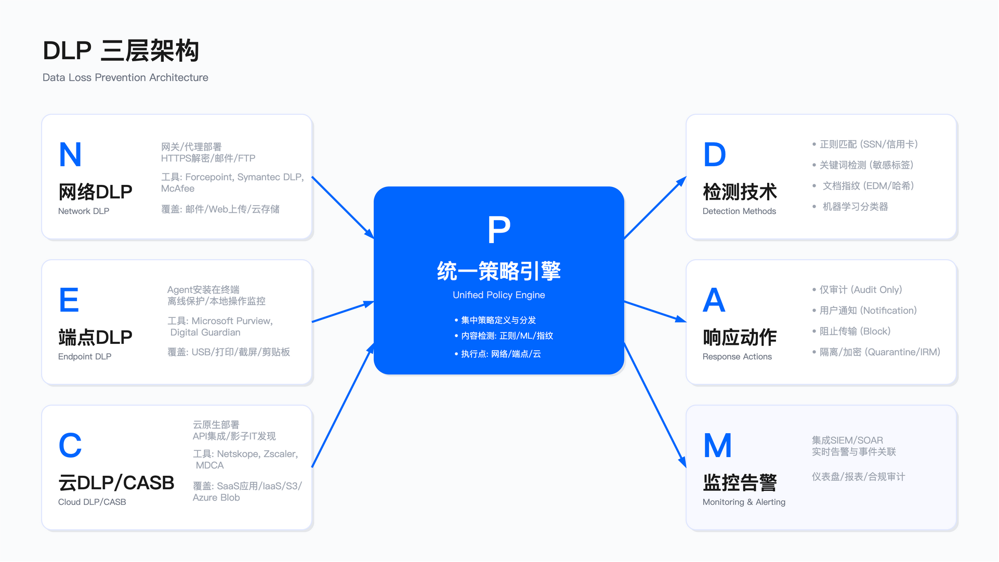

# 10.4 数据丢失防护运营

## 概述

数据丢失防护（Data Loss Prevention，DLP）是信息保护体系中部署难度与运营复杂度均较高的技术领域。DLP 项目的失败率较高，主要原因并非技术本身不成熟，而是误报率失控导致用户和业务部门强烈抵制，最终项目被迫降级或废弃。

DLP 的核心价值在于提供数据流动的可见性与防护能力。本节从工程实践角度探讨如何避开常见陷阱，建立可持续的 DLP 运营体系。

---

## 10.4.1 DLP 架构与部署

### 三层 DLP 架构

DLP 系统通常采用网络、端点、云三层架构协同工作。三层架构的设计考量源于数据泄漏渠道的多样性：网络层覆盖邮件与 Web 上传，端点层覆盖 USB 拷贝与本地操作，云层覆盖 SaaS 应用与云存储。



网络 DLP 部署于网关或代理层，覆盖邮件（SMTP）、Web 上传（HTTP/HTTPS）、FTP 及云存储流量。其优势在于集中管理、无需端点部署；局限在于无法监控端点本地操作，且 HTTPS 解密涉及隐私与合规考量。SSL 解密在技术上需要证书信任链与解密硬件支持，在合规层面受部分国家法律限制，在组织层面可能遭遇员工委员会或工会的反对。多数企业采用选择性解密策略，仅对特定域（如公司邮件域）进行解密检测。

端点 DLP 通过 Agent 安装在终端设备，覆盖 USB 拷贝、打印、截屏、本地文件操作及剪贴板。其优势在于提供离线保护与本地操作可见性；局限在于 Agent 可能影响终端性能，部署复杂度较高。端点 DLP 部署失败的常见原因包括：Agent 性能问题导致用户投诉、Mac 用户（通常包含高管群体）拒绝安装“监控软件”、Linux Agent 功能覆盖不足导致开发者不满。建议采用分阶段部署策略：先覆盖高风险岗位（财务、HR），再逐步扩展至全员。

云 DLP（CASB）通过 API 集成或代理方式覆盖 SaaS 应用（Box、Salesforce、Slack 等）与 IaaS 存储（S3、Azure Blob）。其优势在于云原生集成与影子 IT 发现能力；局限在于依赖 API 可用性，实时性受限于 API 调用频率限制与扫描延迟。部分 SaaS 应用的私聊消息 API 出于隐私保护无法访问，因此 CASB DLP 主要用于审计场景，而非实时阻止。

### 架构选择的适用边界

三层架构并非必须同时部署，应根据组织数据泄漏风险的主要渠道确定优先级。端点是数据泄漏的主要渠道（USB、打印、截屏），因此从风险覆盖角度，端点 DLP 的优先级通常高于网络 DLP。但端点 DLP 部署难度更大，因此多数组织从网络 DLP 起步。这一决策需要权衡风险覆盖与部署可行性。

### 统一 DLP 平台

越来越多企业选择生态系统内的统一 DLP 平台（如 Microsoft Purview），而非“最佳品种”（best-of-breed）方案。统一平台的优势在于集成成本较低，策略可跨多个执行点（邮件、文件、端点）统一管理；局限在于功能深度可能弱于专业厂商。

统一 DLP 平台的典型组件包括：集中策略引擎、内容检测引擎（正则、机器学习、文档指纹）、多执行点覆盖、统一告警控制台。策略执行动作通常支持审计、用户通知、阻止、隔离、加密（IRM）等多种模式。

### 部署节奏：分阶段实施

DLP 部署应遵循渐进式节奏，避免急于启用阻止模式导致业务中断。建议的部署阶段如下：

POC 阶段面向小范围用户（数十至百人），聚焦单一部门，验证技术可行性与误报率。试点阶段扩展至数百至千人，覆盖多个部门，建立运营流程。全面推广阶段基于试点经验调优策略后逐步推广至全员。

每个阶段的执行模式也应渐进：第一阶段采用纯审计模式（不阻止），观察误报情况；第二阶段启用用户通知（允许用户覆盖），收集用户反馈；第三阶段逐步启用阻止模式（先外部通道，后内部通道）。过快启用阻止模式是 DLP 项目失败的常见原因。

### 常见误区

常见误区包括：从网络 DLP 起步却忽视端点覆盖，网络 DLP 无法监控端点本地操作，而端点渠道（USB、打印、截屏）是主要泄漏路径；急于启用阻止模式，未经充分审计期验证即启用阻止，导致误报引发业务中断与用户抵制；忽视 SSL 解密的合规约束，未评估 SSL 解密在不同司法辖区的法律限制与员工隐私权衡。

### 验证方法

验证方法包括：覆盖率验证需统计已部署 DLP Agent 的终端占比与已纳入网络 DLP 监控的出口流量占比；检测有效性验证需使用包含已知敏感数据的测试文件验证检测规则是否触发；性能影响评估需监控端点 DLP Agent 的 CPU 与内存占用，评估对用户体验的影响。

### 运行指标

运行指标包括：部署覆盖率衡量端点 DLP Agent 在线率与网络 DLP 流量覆盖率；策略命中率统计各策略的日均触发次数（用于识别过于宽松或过于严格的策略）；性能指标追踪 Agent CPU 占用均值与峰值、网络 DLP 延迟增量。

---

## 10.4.2 策略设计与内容检测

### 内容检测技术

DLP 内容检测的核心挑战在于精准率与召回率的平衡。不同检测技术的误报率差异显著，策略设计需根据数据类型选择合适的检测方法组合。

正则表达式检测适用于结构化数据（信用卡号、身份证号、电话号码等）。其优势在于规则确定性高；局限在于单独使用时误报率较高（测试数据、订单号、设备序列号等可能触发误报）。以信用卡号检测为例，单纯的 16 位数字匹配会产生大量误报，需结合 Luhn 校验算法（验证真实卡号的校验位）与上下文关键词（“卡号”“支付”等）降低误报。

关键词匹配简单快速，但误报率较高，不建议单独使用。关键词匹配失败的原因包括：关键词出现在邮件签名、模板或否定句中（“非机密”“不包含密码”）；中文语境下需处理分词与多义词问题。关键词应作为辅助因素参与置信度评分，而非单一触发条件。

文档指纹（document fingerprinting）通过哈希与局部敏感哈希（LSH）技术识别特定文档及其衍生版本。适用于保护特定高价值文档（如未公开财报、专利申请）。即使文档内容有一定修改仍可识别，但无法防护截图或打印。文档指纹的局限在于需要维护指纹库，不适合对大量文档（数千份以上）建指纹。

精确数据匹配（exact data matching，EDM）通过数据库哈希匹配保护结构化数据（客户清单、员工名册）。其优势在于精确匹配，误报率低；局限在于需要维护敏感数据库副本（哈希形式），且数据库变更需同步更新。EDM 的隐藏成本包括：数据库需定期更新以反映业务变化，大数据量（百万行以上）扫描性能下降，敏感数据“上传”到 DLP 系统需通过合规审查。EDM 适合保护核心资产（客户清单、员工数据），不适合泛化到所有数据。

机器学习分类器通过监督学习对非结构化文档进行分类（合同、简历、源代码等）。其优势在于可处理语义层面的敏感信息；局限在于需要标注数据训练、多语言效果参差、业务变化后模型需重训练、误报难以向用户解释。机器学习分类器建议用于审计与优先级排序，不建议用于自动阻止。

### 策略设计原则

DLP 策略设计应遵循以下原则：

多条件组合降低误报：单一检测方法的误报率难以控制，应组合多种检测方法并设置合理阈值。例如，信用卡号检测需满足：正则匹配 + Luhn 校验通过 + 数量阈值（≥3 张）+ 上下文关键词。

上下文感知：考虑发送者部门、收件人域、文件大小等上下文因素。例如，财务部门向外部发送包含财务数据的邮件可能是合法业务需求，而销售部门发送同类数据则需审查。

渐进式执行：新策略先审计后通知再阻止，每阶段至少观察 30 天。

业务豁免机制：建立例外审批流程，避免策略僵化阻塞合法业务。

### 策略配置示例

以下为保护客户 PII 外发的策略配置示例（伪代码形式）：

```python
policy = {
    "name": "Protect Customer PII - Email",
    "description": "阻止通过邮件外发客户 PII",

    "conditions": {
        "content_contains": [
            # 需满足数量阈值以降低误报
            {"type": "credit_card", "confidence": "high", "count": ">=3"},
            {"type": "ssn", "confidence": "high", "count": ">=5"},
            {"type": "custom_keyword", "words": ["customer database"], "proximity": 200}
        ],
        "logical_operator": "OR",

        "contextual_conditions": {
            "recipient_domain": "NOT @company.com",  # 外部邮件
            "sender_department": "NOT Finance",       # 非财务部
            "file_size": ">1MB"                       # 小附件通常是示例数据
        }
    },

    "actions": {
        "primary": "block_and_notify",
        "notification": {
            "user": "您尝试发送包含客户 PII 的邮件到外部，已被阻止。如有业务需求，请联系合规团队审批。",
            "security_team": "DLP 事件：{incident_id}，严重性：High"
        },
        "quarantine": True,
        "audit_log": True
    },

    "exceptions": {
        "allowed_domains": ["trustedpartner.com"],     # 已签 NDA 的合作伙伴
        "approved_users": ["compliance-officer@company.com"],
        "override": "Manager approval workflow"        # 经理审批覆盖
    },

    "lifecycle": {
        "阶段_1": "Audit only - 收集基线数据",
        "阶段_2": "Notify user (允许覆盖) - 观察用户反应",
        "阶段_3": "Block (除非例外) - 正式执行",
        "review_frequency": "季度回顾误报率，调优阈值"
    }
}
```

### 适用边界

内容检测技术的选择取决于数据类型与保护目标：结构化数据（卡号、身份证号）适合正则表达式配合校验算法与 EDM；特定高价值文档适合文档指纹技术；非结构化文档分类适合机器学习分类器（用于审计场景）；关键词仅作为辅助因素，不单独使用。

### 关键约束

关键约束包括：误报率阈值方面，策略误报率应控制在可接受范围内，否则用户将寻找绕过方法，具体阈值应根据业务容忍度设定，并在策略上线前通过审计模式验证；检测性能方面，内容检测（尤其是机器学习分类）对邮件发送延迟与网络吞吐量有影响；多语言支持方面，机器学习分类器在非英语语言（中文、日文等）上的效果通常弱于英语。

### 常见误区

常见误区包括：信用卡检测未加 Luhn 校验，导致测试卡号、订单号大量误报；关键词单独作为触发条件，"confidential" 出现在邮件签名中导致误报；机器学习分类器用于自动阻止，误报难以解释，用户投诉"模型说的"无法接受。

### 验证方法

验证方法包括：准备包含真实敏感数据与干扰数据（测试卡号、示例文档）的测试集，验证检测准确率与误报率；验证部门、收件人、文件大小等上下文条件是否正确生效；验证数量阈值（如"≥3 张信用卡"）的触发边界。

### 运行指标

运行指标包括：策略精准率为真阳性除以（真阳性加假阳性）；策略召回率为真阳性除以（真阳性加假阴性）；各检测方法贡献度统计各检测方法触发告警的占比（用于识别低效规则）。

---

## 10.4.3 误报优化

### 误报率与用户接受度

DLP 运营的核心挑战是误报率控制。误报率过高将导致：用户投诉业务受阻、用户寻找绕过方法（使用个人邮箱、手机拍照）、安全团队分析师疲劳、项目政治性失败。

误报率与用户接受度呈非线性关系：误报率在可接受范围内时用户配合度较高，一旦超过阈值则迅速下降。因此，DLP 策略设计应优先控制误报率（精准率），而非追求零漏报（召回率）。宁可漏掉部分真威胁，也不要误拦大量合法业务——误报导致用户绕过 DLP，反而降低总体安全性。

### 误报优化策略

审计模式基线：新策略先以审计模式运行，收集误报数据后调优阈值。审计期时长应根据策略风险等级设定：低风险策略（如阻止可执行附件）可缩短，高风险策略（如源代码检测）需延长观察期。

置信度评分：采用多因素置信度评分而非单一条件触发。评分因素包括：模式匹配得分、上下文关键词得分、文件类型得分、用户历史行为得分。设定阈值区间：高分阻止、中分告警、低分仅审计。置信度阈值需根据业务部门容忍度调整，如财务部门可接受更严格阈值，销售部门需放松。

白名单管理：为常见误报场景（测试数据、示例邮箱、模板文本）建立白名单。白名单的风险在于无限增长，需定期审查（建议每季度）清理过时条目。替代方案是用例外审批流程代替永久白名单。

上下文分析：增加上下文分析可显著降低误报。常见上下文因素包括：文件名包含"draft""sample"则降低严重性、发件人即文档创建者则属合法分享、非工作时间发送则提高风险等级。

用户反馈循环：建立用户标记误报的机制，用于规则调优。用户反馈的局限在于：用户可能为绕过检测而滥用误报标记，需结合人工审核。

### 常见误报场景与解决方案

测试信用卡号：开发/测试环境使用测试卡号（如 4111-1111-1111-1111）触发告警。解决方案：加入 Luhn 校验（真实卡号最后一位是校验位），结合上下文（来自 QA/开发部门则审计而非阻止）。

```python
def luhn_check(card_number):
    """
    Luhn 算法：验证信用卡号有效性
    真实卡号最后一位是校验位，符合特定算法
    测试卡号通常不符合 Luhn 校验
    """
    digits = [int(d) for d in card_number if d.isdigit()]
    checksum = sum(digits[-1::-2]) + sum(sum(divmod(2*d, 10)) for d in digits[-2::-2])
    return checksum % 10 == 0
```

内部员工名单分享：HR 分享员工名单被标记为 PII 泄漏。解决方案：EDM + 上下文（HR 部门 + 内部收件人 + 主题包含“部署”“系统”则审计而非阻止）。

加密文件：加密附件无法检测内容，但可能是数据窃取。解决方案：区分公司 IRM 加密（可追踪，允许）与未知密码 ZIP（要求审批），监控大量加密文件外发行为。

大规模数据集：BI 报告包含数千行数据触发阈值。解决方案：提高计数阈值，或根据用户角色 / 部门动态调整阈值（如 BI 团队阈值乘以系数）。

### 适用边界

误报优化策略的选择取决于组织 DLP 运营成熟度：初期部署阶段重点依赖审计模式基线与白名单；中期运营阶段引入置信度评分与上下文分析；成熟运营阶段可考虑用户反馈循环与机器学习调优（仅适合大规模用户组织）。

### 关键约束

关键约束包括：白名单膨胀问题，白名单无限增长将削弱 DLP 有效性，需建立审查与清理机制；置信度调优复杂度，不同策略需不同权重配置，调优工作量大；用户反馈质量，用户可能滥用误报标记，需人工复核。

### 常见误区

常见误区包括：追求零漏报，过度追求召回率导致误报率失控；白名单无限扩展，每个误报都加白名单，最终白名单条目过多失去意义；忽视审计期，未经充分审计期验证即推广策略。

### 验证方法

验证方法包括：通过 A/B 测试对比不同阈值配置的误报率与检出率；按误报原因分类统计（测试数据、模板文本、合法业务）以识别主要优化方向；通过用户满意度调查定期收集用户对 DLP 影响的反馈。

### 运行指标

运行指标包括：误报率趋势按周或月统计误报率变化；白名单条目数监控白名单膨胀速度（需控制在可管理范围）；用户投诉数追踪 DLP 相关投诉量（阈值可按用户规模设定）。

---

## 10.4.4 DLP 运营流程

### 事件分级

DLP 事件响应需要业务判断与技术判断结合，多数事件涉及用户意图判断（恶意 / 疏忽 / 合法需求），需 HR/法务参与高风险事件。事件分级不宜超过 4 个级别，过多级别导致分析师困惑，过少级别无法区分优先级。

Critical（紧急）：高度机密数据、大量记录（千条以上）、外部目的地、恶意意图指标。SLA：1 小时响应。升级至 CISO、法务、HR。恶意意图指标包括：非工作时间大量下载、使用个人云盘、访问与岗位无关的数据、已提交辞职（离职前高风险期）、绕过安全控制。

High（高）：机密数据、中量记录（百至千条）、外部目的地、可能意外。SLA：4 小时响应。升级至安全经理。典型场景包括：员工错发客户名单、未走审批流程分享数据、离职员工下载过往工作成果。处理方式：联系用户确认意图，合法则通过，违规则警告。

Medium（中）：内部数据、小量记录（百条以下）、内部目的地、明显意外。SLA：24 小时响应。分析师处理。处理哲学：教育优先，惩罚最后。发送提醒邮件并记录，不上报管理层（除非重复违规）。

Low（低）：审计模式捕获、测试数据、已批准例外。SLA：每周审查。无需升级。价值在于趋势分析，识别新兴风险模式。

### 响应工作流

检测：DLP 引擎检测并生成告警。

分级：初步分级应在数分钟内完成。多数事件可通过规则自动分级，部分复杂事件（涉及上下文判断）需人工复核。High 及以上级别必须人工确认。

调查：核心问题包括——谁发送 / 上传了数据？数据类型和数量？目的地（内部 / 外部 / 云）？意图（恶意 / 疏忽 / 合法）？是否实际传输成功（已阻止 vs 已外发）？数据来源包括 DLP 日志、邮件日志、端点日志、必要时的用户访谈。

用户访谈应遵循以下原则：假设善意（“我们需要了解业务需求”）、询问业务背景（“客户要求提供这些数据？”）、提供解决方案（“下次请通过安全共享平台”）。避免指责、威胁或使用技术术语。目标是教育与合规，而非惩罚（除非明显恶意）。

遏制：已阻止的事件无需额外操作。审计模式捕获的事件需手动删除已外发的邮件/文件，通知收件人。持续事件需撤销 IRM 权限、隔离端点。

遏制的挑战在于：若数据已通过加密通道（如个人 Webmail）外发，DLP 仅能检测无法阻止，后续响应选项有限（联系服务提供商成功率低、可能需数据泄漏通知与监管报告）。因此 DLP 阻止模式（SSL 解密 + 端点控制）比“检测后响应”模式可靠。

补救：首次违规通常采用一对一培训；重复违规需 HR 介入；技术层面根据误报反馈调优策略。纪律处分的执行需通过 HR 流程，安全团队无权直接处罚员工。典型结果分布：首次疏忽为警告 + 培训（绝大多数），重复疏忽为书面警告，明显恶意为终止雇佣 + 法律诉讼（极少数）。

文档记录：在工单系统记录完整调查过程，保全日志与截图（法律诉讼可能需要）。证据链要求包括：时间戳精确、操作人员身份、数据哈希（证明未修改）、存储安全（加密 + 访问控制）。证据链不完整可能导致法律诉讼中证据被排除。

### 适用边界

DLP 事件响应流程适用于所有 DLP 告警的处理。对于高频低风险事件（如 Low 级别），可简化流程以避免分析师疲劳；对于低频高风险事件（如 Critical 级别），需确保流程严格执行。

### 关键约束

关键约束包括：人力配比方面，DLP 运营需要持续的分析师投入，人力不足将导致事件积压；跨部门协作方面，高风险事件需 HR / 法务参与，协调机制需提前建立；响应时效方面，Critical 事件的 1 小时 SLA 要求快速响应能力。

### 常见误区

常见误区包括：仅依赖技术判断，忽视业务上下文，将合法业务需求误判为违规；过度执法，对疏忽行为采用惩罚性措施，导致用户抵制；证据保全不完整，事件发生后未及时保全日志，影响后续调查与诉讼。

### 验证方法

验证方法包括：定期进行 DLP 事件响应桌面演练，验证跨部门协调机制；统计各级别事件的实际响应时间是否达标以评估 SLA 达成率；定期审查未关闭事件，识别流程瓶颈。

### 运行指标

运行指标包括：事件量统计每日或每周 DLP 事件数（可按用户规模标准化）；响应时效衡量各级别事件的平均响应时间与 SLA 达成率；事件积压监控未关闭事件数量（阈值可根据分析师人力设定）；处置分布统计各类处置结果（误报、警告、升级、纪律处分）的占比。

---

## 10.4.5 DLP 与 IRM 协同

### 边界防护与文档保护的互补

DLP 与 IRM（信息权限管理）是互补关系：DLP 负责检测与阻止（边界防护），IRM 负责授权与追踪（文档级保护）。单独使用任一技术存在盲区：DLP 阻止未授权传输，但无法保护已授权分享的数据；IRM 保护文档，但无法阻止未授权的批量外传。两者协同可实现全覆盖：DLP 拦截恶意泄漏，IRM 保护合法共享。

### 集成场景

自动保护：DLP 检测到机密文档外发时，自动应用 IRM 保护（如仅查看、限时过期）。实施挑战包括：用户感知“被监控”、大文件加密延迟、IRM 保护文档在移动设备的兼容性。建议仅对高度机密数据启用自动 IRM，其他级别提示用户手动选择。

条件发送：若检测到机密数据且收件人为外部，要求用户应用 IRM 保护或阻止发送。用户体验权衡：增加操作步骤可能导致用户抵制，可通过默认模板、AI 推荐模板、用户教育缓解。

审计关联：关联 DLP 事件与 IRM 访问日志，实现完整数据流动路径可见（从创建到外发到查看）。审计关联的价值包括：事后调查"谁查看了泄漏的数据"、满足 GDPR 等法规对数据处理活动记录的要求。实现需 SIEM / SOAR 整合 DLP 与 IRM 日志。

### 成熟度演进

DLP 与 IRM 集成是渐进过程，不应试图一步到位。典型演进路径为：初级阶段仅部署邮件 DLP，无 IRM，无集成；中级阶段部署网络与端点 DLP，手动 IRM，部分策略联动；高级阶段实现全覆盖 DLP（云与端点），自动 IRM，深度集成（SIEM 关联）；领先阶段实现智能 DLP（AI 分类），动态 IRM（上下文策略），统一平台。从初级迭代至中级通常需要较长时间（数年），再达到高级需要额外投入。

### 适用边界

DLP 与 IRM 集成适用于对数据保护有较高要求的组织。对于仅需基本 DLP 审计能力的场景，可暂不考虑 IRM 集成。

### 关键约束

关键约束包括：用户体验影响方面，自动 IRM 增加用户操作复杂度；兼容性问题方面，IRM 保护文档在非原生应用中可能无法正常打开；集成复杂度方面，DLP 与 IRM 来自不同厂商时集成难度较大。

### 常见误区

常见误区包括：对所有数据启用自动 IRM，导致用户体验下降，应仅对高度机密数据启用；忽视离线场景，IRM 权限验证依赖网络，离线场景需特殊处理；日志未关联，DLP 与 IRM 日志独立存储，无法关联分析。

### 验证方法

验证方法包括：端到端测试验证 DLP 检测触发 IRM 自动保护的完整流程；兼容性测试验证 IRM 保护文档在主要客户端（桌面、移动、Web）的打开体验；审计关联测试验证 SIEM 中 DLP 事件与 IRM 访问日志的关联查询。

### 运行指标

运行指标包括：自动 IRM 应用率衡量 DLP 触发自动 IRM 保护的事件占比；IRM 权限撤销响应时间衡量从申请到撤销生效的时长；审计日志关联完整率衡量 DLP 事件成功关联 IRM 日志的占比。

---

## 本节小结

### DLP 成功的关键因素

技术层面：分阶段部署（审计、通知、阻止），每阶段充分验证；采用多检测方法组合，控制误报率在可接受范围；实现网络、端点、云全覆盖，端点渠道通常是主要泄漏路径。

运营层面：确保充足人力，DLP 运营需要持续的分析师投入；建立分级响应 SLA 并确保达成以实现快速响应；季度审查策略有效性，根据误报反馈持续调优。

组织层面：DLP 项目需要高管背书以应对用户抵制；高风险事件需 HR / 法务参与，需建立跨部门协作机制；培训投入是 DLP 成功的重要组成部分。

### 给 CISO 的建议

DLP 项目成功的核心认知：DLP 不是“部署即生效”的技术，需要持续的调优与运营投入；误报率比召回率更重要，宁可漏掉部分真威胁，不要误拦大量业务操作；用户接受度决定项目成败，技术完美但用户抵制等于失败。

---

下一节 [10.5 内部威胁防护](./10.5_insider_threat_protection.md) 将探讨 UEBA 行为分析、特权用户监控及预测性威胁评分，这些技术与 DLP 协同构建完整的数据泄漏防护体系。

---

## 导航

**[← 上一节：10.3 信息权限管理（IRM/DRM）](./10.3_information_rights_management.md)** | **[返回章节目录](./README.md)** | **[下一节：10.5 内部威胁防护 →](./10.5_insider_threat_protection.md)**

---

**© 2025 AI-ESA Project. Licensed under CC BY-NC-SA 4.0**

