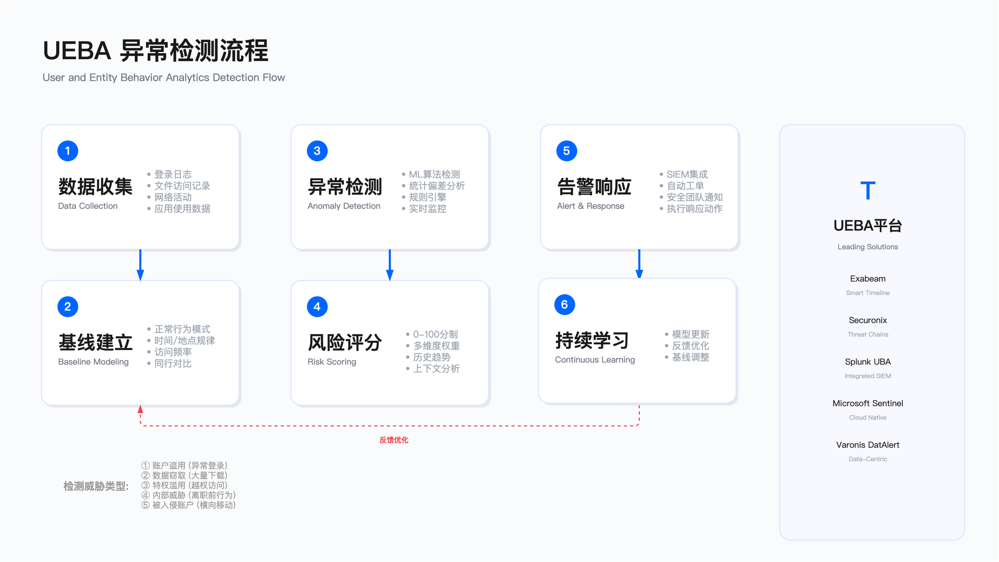

# 10.5 内部威胁防护

## 概述

内部威胁指组织内部人员（包括在职员工、离职员工、承包商、合作伙伴）因恶意、疏忽或账户被入侵而导致的数据泄露或系统破坏。与外部攻击不同，内部人员拥有合法的系统访问权限，其行为更难检测和防范。

内部威胁防护的核心挑战在于：合法用户的正常工作行为与恶意数据外带行为在技术特征上存在大量重叠。销售人员批量下载客户资料可能是正常工作需要，也可能是离职前的数据窃取。这种模糊性使得内部威胁检测的误报率始终难以降低，而过于激进的检测策略又会干扰正常业务并损害员工信任。

本节从内部威胁类型学、UEBA 行为分析、特权用户监控、跨职能协作四个维度，阐述如何在安全防护、员工隐私、业务效率之间取得平衡。

---

## 10.5.1 内部威胁类型学

内部威胁可分为三类：恶意内部人员、疏忽内部人员、被入侵内部人员。三类威胁的动机、行为特征、检测难度差异显著，需要采用不同的防护策略。

### 恶意内部人员

恶意内部人员指有意窃取数据或破坏系统的员工。其动机包括：经济利益（如出售商业机密）、职业报复（如被解雇后的破坏行为）、竞争对手招揽、意识形态驱动等。

典型行为指标：

恶意行为通常具有以下特征：非工作时间的大量数据访问、访问与本职工作无关的系统或数据、尝试绕过安全控制（如使用个人 VPN、禁用端点安全软件）、删除或修改审计日志、将数据上传至个人云存储或外部邮箱。

公开案例分析：

多个公开案例表明，恶意数据窃取通常发生在离职前的关键时期。窃取方式多为利用合法权限批量下载文件，然后通过个人云存储、外部邮件或物理介质外带。检测的关键在于识别“异常大量”的数据访问行为，并结合 HR 系统的离职/绩效数据进行风险关联。

恶意内部威胁的检测难度最高。行业观察表明，恶意行为从发生到被发现的平均时间通常以月计算，原因包括：行为人刻意隐藏痕迹、利用合法权限规避检测、分批次小量外带数据以避免触发阈值告警。

### 疏忽内部人员

疏忽内部人员指因操作失误或安全意识不足而导致数据泄露的员工。典型场景包括：邮件错发（将敏感文件发送给错误收件人）、在公共 WiFi 传输未加密数据、使用弱密码或共享账户、点击钓鱼邮件、遗失包含敏感数据的移动设备或 USB。

行业经验表明，疏忽型事件的发生频率远高于恶意型，但单次事件的平均损失通常低于恶意型。疏忽型事件的检测相对容易（DLP 系统可即时拦截），但预防需要持续的用户培训和流程优化。

常见误区：将疏忽等同于低风险是典型误解，单次疏忽事件损失可能有限，但高频次的疏忽事件累计影响可能超过单次恶意事件。另一个误区是过度依赖技术手段替代培训，DLP 可以拦截已知模式的数据外传，但无法防止员工通过拍照、口述等非数字渠道泄露信息。

### 被入侵内部人员

被入侵内部人员指账户被外部攻击者控制的员工。攻击链通常为：钓鱼邮件/社工攻击 → 凭证窃取 → 利用合法账户登录 → 横向移动 → 数据外带。

典型检测信号：

异常登录行为（地理位置不可能旅行、非常规设备、异常时间）、MFA 疲劳攻击（多次推送通知直到用户批准）、登录后的异常操作（大量敏感数据访问、权限提升尝试）、与已知 C2 基础设施的网络通信。

被入侵账户使用的是合法凭证，传统的边界防护无法检测。防护重点在于：部署 UEBA 检测异常行为模式、强化 MFA 防护（如抗钓鱼 MFA）、结合威胁情报识别已知攻击基础设施。

### 灰色地带场景

实际运营中存在大量难以定性的灰色场景：个人项目复用方面，员工在工作中开发的通用代码库是否可在个人项目中使用，取决于雇佣合同中的 IP 条款；作品集构建方面，设计师或开发者离职时带走自己创作的作品集，版权归属取决于合同约定；知识转移方面，员工跳槽到竞争对手时，其“头脑中的知识”（行业经验、方法论、人脉关系）无法通过技术手段阻止。

灰色场景的处理原则：在入职时通过清晰的合同条款明确 IP 归属，在离职时通过访谈和法律协议进行约束，但需接受部分知识转移无法防止的现实。

---

## 10.5.2 UEBA 行为分析

用户与实体行为分析（UEBA，User and Entity Behavior Analytics）通过建立用户行为基线，检测偏离基线的异常行为。UEBA 是内部威胁检测的核心技术，但其有效性高度依赖基线质量、检测规则设计和误报管理。

*图 10.4：UEBA 异常检测流程——从数据采集、行为基线建立、异常检测到风险评分与响应决策*

### 行为基线建立

UEBA 系统需要采集多维度数据建立行为基线：数据访问模式维度包括平均每日访问文件数量、常访问的文件类型、常访问的部门或项目数据、访问时间分布；网络活动维度包括平均上传/下载流量、常用目标地址（云服务、外部网站）、VPN 使用频率；认证行为维度包括典型登录时间、常用设备、地理位置、MFA 成功率；应用使用维度包括常用应用列表与异常应用访问。

基线建立的关键约束包括：冷启动问题——新员工无历史数据，基线建立期（通常需要数十天以上）内检测能力受限；行为漂移——员工角色变更（晋升、换岗、项目调整）会导致行为模式变化，基线需要及时更新；季节性波动——财务部门在月末/季末访问量激增属于正常业务模式，不应触发告警；基线污染风险——如果异常行为被纳入基线更新，后续相同行为将被视为“正常”。

基线更新策略：

采用滑动窗口定期重新计算基线；角色变更时立即重建基线；异常行为不自动纳入基线更新，需人工审核确认后才可更新。

### 异常检测逻辑

UEBA 通过多维度信号检测异常，常见检测场景包括：

数据量异常：

单日访问文件数量显著超过历史平均值。此类检测需结合上下文判断：BI 分析师访问大量文件属于工作需要，销售人员在离职通知后访问大量客户数据则为高风险。

时间异常：

非工作时间的大量数据访问。行业观察表明，恶意数据外带更倾向于发生在非工作时间以避免被发现。但 IT 运维人员、全球化团队成员也可能在非常规时间工作，需要根据角色设置差异化阈值。

地理异常 (impossible travel)：

短时间内从相距遥远的两个地点登录，物理上不可能到达。此类检测误报率较高，常见误报原因包括：VPN 出口变化、移动设备 GPS 漂移、云服务地理定位错误。建议仅在结合其他风险信号（如凭证泄露告警）时提升权重。

权限滥用：

访问与本职工作无关的敏感数据。此类检测的前提是权限管理规范，企业普遍存在"权限膨胀"(privilege creep) 问题——员工换岗后旧权限未撤销，导致正常权限访问与越权访问难以区分。

数据外带：

大量数据上传至外部地址（个人云存储、外部邮箱、代码仓库）。数据外带检测的难点在于：员工使用的云存储、即时通讯工具本身是合法业务工具，难以全面阻止。检测策略应结合多维信号：大量上传 + 离职通知 + 非工作时间 = 高风险；大量上传 + 正常工作时间 + 常规角色 = 中风险。

### 风险评分与响应

UEBA 系统将多维异常信号汇总为风险评分，指导响应优先级。评分设计需平衡精准率与召回率：

评分设计需权衡两种策略：精准率优先（宁可漏报，不要高误报）可减少分析师工作量和用户抵触，但可能漏掉真实威胁；召回率优先（宁可误报，不漏真威胁）可提高检测覆盖，但告警疲劳可能导致真威胁被忽略。

行业实践表明，内部威胁检测更适合精准率优先策略。原因：内部威胁调查涉及员工关系，误报导致的员工被调查可能引发劳动纠纷和信任危机。

响应分级建议：低风险事件仅记录审计日志，不告警，定期汇总报告；中风险事件需告警 SOC，增加监控频率，通知用户的直属管理者；高风险事件需人工审查加增强监控，不建议自动暂停账户（可能是正常业务高峰）；确凿恶意事件需账户暂停、法务介入、证据保全。

适用边界：UEBA 适用于拥有数百名以上员工、数据资产价值较高的组织；小型组织可能难以积累足够的行为数据建立有效基线；UEBA 对新员工、临时人员、高管（行为模式不规律）的检测效果有限。

验证方法：红队模拟测试通过模拟内部威胁场景（如离职前批量下载）验证检测规则是否触发；历史事件回溯使用已知内部威胁事件数据验证 UEBA 是否能检测出异常；误报审计定期审计误报案例以识别规则调优需求。

运行指标：

| 指标 | 说明 | 阈值设定 |
|-----|------|---------|
| 误报率 | 告警中的假阳性占比 | 内部口径，建议逐步降至 15% 以下 |
| 检测到的威胁数 | 年度确认的内部威胁事件数 | 基于组织规模和历史数据设定基线 |
| 平均检测时间 | 从异常行为发生到被检测的平均时长 | 内部口径，逐步优化 |
| 平均响应时间 | 从告警到完成初步调查的平均时长 | 建议高风险告警在 24 小时内响应 |

---

## 10.5.3 特权用户监控

特权用户（域管理员、数据库管理员、云管理员、安全管理员）拥有对关键系统和数据的最高访问权限。特权用户在企业中占比较小，但其潜在破坏能力远超普通用户——单个数据库管理员可导出整个生产数据库，单个云管理员可复制全部云资源。

### 特权访问管理 (PAM) 控制

即时访问 (JIT，just-in-time access)：

传统模式下，特权账户持续保持活跃状态。JIT 模式要求特权按需临时授予：管理员申请 → 审批（自动或人工）→ 临时授予（数小时）→ 自动撤销。JIT 将特权账户的“攻击面暴露时间”从 7×24 小时降低到实际需要的时长。

JIT 实施的常见阻力：管理员抱怨操作繁琐、紧急故障时审批流程太慢。应对策略包括：紧急 "break glass" 账户（事后审计）、预审批计划内维护窗口、低风险操作自动批准。

会话录制：

所有特权会话（SSH/RDP/数据库连接）应进行录制，存储于不可篡改的日志系统，满足审计和合规要求（如金融行业要求保留数年）。录制内容包括：按键记录、屏幕视频、命令及其输出。

会话录制的主要价值是“事后追溯”——当怀疑数据泄露时，可回放历史会话确认操作内容。此外，录制本身对潜在恶意行为也有威慑作用。

会话录制的约束：存储成本（视频录制占用空间较大）、隐私考量（需在员工手册中明确告知监控范围）。

命令审计与阻断：

记录特权用户执行的每条命令及其参数和输出。对高风险命令（如 `DROP TABLE`、`chmod 777`、`aws s3 sync` 到外部账户）配置二次确认或阻断。

命令审计的局限：熟练攻击者可通过命令混淆（编码、别名）绕过简单的关键词匹配。应结合行为分析检测异常命令序列。

双人控制 (four-eyes principle)：

关键操作（生产数据库删除、防火墙规则修改、密钥导出、高权限账户创建）要求两人同时批准。

实施约束：小型 IT 团队可能难以找到“第二个人”。可采用异步审批（操作记录后定期审查）作为折中方案。

### 离职风险管理

离职前的时间窗口是内部威胁的高发期。员工提交辞职或收到终止通知后，应触发以下控制：

离职前监控增强：将离职员工标记为 UEBA 高风险用户以提升监控敏感度；将 DLP 策略调整为实时告警模式（而非每日汇总）；视情况限制权限，包括禁止 USB 使用、禁止打印、限制大量下载、禁止外部共享。

离职当日操作：与终止通知同步撤销所有系统访问（AD/SSO/VPN/物理门禁）；远程擦除企业移动设备数据；撤销 IRM 保护文档的访问权限。

离职后监控：审计离职前数十天的活动记录；回收设备并进行取证镜像（存档备查）；对高风险离职（如加入竞争对手）持续关注，IRM 审计日志可显示前员工尝试访问文档的记录。

常见误区：政治保护高价值员工是常见问题，明星员工（核心技术/销售冠军）辞职时，业务部门可能要求放宽监控，这需要 CISO 层级的支持才能确保安全控制不被绕过。另一个问题是离职后账户残留，HR 系统与 IT 系统未集成，手工离职流程遗漏，导致前员工账户在离职后仍然活跃，建议实施自动化离职流程。

适用边界：特权用户监控和 PAM 控制适用于所有拥有生产环境管理权限的组织；中小型组织可优先覆盖数据库管理员和云管理员账户；成本约束方面，企业级 PAM 平台投资较大，小型组织可先使用云原生 PAM 功能（如 AWS IAM 临时凭证、Azure PIM）。

---

## 10.5.4 内部威胁计划——跨职能协作

内部威胁防护不是单纯的技术问题，需要安全、HR、法务、IT 多部门协作。技术部署只占工作量的一小部分，流程建设、文化塑造、政治协调占据更大比重。

### 组织结构

指导委员会：

由 CISO、CHRO（首席人力资源官）、法务总监、CIO、业务代表组成，负责审批内部威胁政策、审查高风险事件、决策敏感案例。

工作小组：

由安全分析师、HR 业务伙伴、法务顾问、IT 审计、隐私官组成，负责日常监控、调查执行、流程优化。

协作价值：

行业经验表明，有正式跨职能内部威胁计划的组织，事件响应更快、决策链更短、法律风险更低。

### 技术栈整合

内部威胁检测需要整合多个数据源：UEBA 平台提供用户行为分析与异常检测能力；DLP 系统提供数据外传检测与阻断能力；PAM 系统提供特权会话监控能力；SIEM 平台提供日志聚合与关联分析能力；HR 系统集成提供离职、绩效、组织变更数据。

技术整合的常见挑战：各系统来自不同厂商，数据格式不统一；HR 部门出于隐私担忧不愿共享员工数据；整体成本较高。

### 响应手册

根据风险等级制定响应流程：

| 风险等级 | 场景示例 | 响应措施 | 时效要求 |
|---------|---------|---------|---------|
| 低风险 | 偶发非工作时间访问 | 记录审计，季度报告 | 无 |
| 中风险 | 离职员工下载大量文件 | 深入调查，通知 HR（不通知员工） | 7 天内完成调查 |
| 高风险 | 证据显示向竞争对手传输数据 | 账户暂停，法务介入，可能报警 | 24 小时内决策 |
| 关键 | 检测到数据库正在被大规模导出 | 立即阻断网络，保全证据，通知高管 | 15 分钟内响应 |

调查原则：HR 主导员工调查，安全团队提供技术证据；安全团队不能单独约谈员工，HR 必须在场；调查过程保密，避免过早告知当事人；证据链完整性要求记录谁收集、何时收集、如何存储，确保未经篡改。

### 法律与隐私合规

员工监控需要法律基础：员工手册应明确告知“工作设备和工作时间的活动可能被监控”；GDPR 要求欧盟范围内基于“合法利益”实施监控，且监控范围需与风险相称；PIPL（中国《个人信息保护法》）要求处理员工个人信息需告知并可能需要单独同意；美国各州法律差异较大，加州限制更严。

常见误区：未告知即监控是严重问题，在员工不知情的情况下实施监控可能违反劳动法，导致收集的证据在诉讼中无效。监控范围过度也是常见问题，监控员工个人设备或非工作时间行为可能引发隐私诉讼。

### 文化与信任平衡

内部威胁监控不可避免地与员工信任产生张力。过度监控可能导致：员工士气下降、离职率上升、“监控文化”损害创新氛围。

平衡策略：透明沟通方面，向员工解释为什么需要监控（合规要求、保护公司资产）、监控什么（工作设备、工作时间）、不监控什么（个人设备、私人通信）；公平执行方面，监控规则对所有人平等适用，不豁免高管；错误处理方面，如因误报导致员工被错误调查，应道歉并说明情况。

验证方法：年度员工满意度调查中包含安全政策相关问题，监控政策变更前后对比；通过内部威胁计划的有效性演练模拟高风险场景，验证响应流程和决策链；委托第三方进行外部审计，评估内部威胁计划的合规性和有效性。

运行指标：

| 指标 | 说明 |
|-----|------|
| 检测到的事件数 | 按严重等级分类统计 |
| 平均响应时间 | 从检测到完成调查的时长 |
| 误报处理时长 | 误报事件从告警到关闭的时长 |
| 计划成熟度 | 基于成熟度模型的自评分数 |

---

## 10.5.5 实施路径

内部威胁防护是长期工程，不宜追求一步到位。建议分阶段推进：

第一阶段（基础防护）：部署 DLP（邮件与端点）覆盖最常见的数据外传渠道；建立离职风险流程（HR-IT 协同），确保离职当日账户撤销；梳理特权账户清单，至少对生产环境管理员启用会话录制。

第二阶段（检测能力建设）：部署 UEBA 平台，与 HR 系统集成（离职、绩效数据）；建立跨职能内部威胁工作小组（安全、HR、法务）；持续调优 UEBA 规则，降低误报率。

第三阶段（高级能力）：建立预测性风险评分（基于机器学习模型）；实现低风险事件自动化响应；推进文化建设，透明沟通监控政策，建立员工信任。

### 关键约束

关键约束包括：组织能力方面，内部威胁计划需要 CISO 层级的支持和跨部门协调权限；成本投入方面，企业级 UEBA/PAM 平台投资较大，需要与数据资产价值对比评估 ROI；法律风险方面，不同司法辖区对员工监控的法律要求差异较大，需要法务参与；文化阻力方面，员工和管理层对“被监控”的抵触需要通过沟通和透明度化解。

### 常见误区

常见误区包括：技术优先而流程缺失，部署了 UEBA/DLP 工具，但无跨部门协作流程，告警无人处理；监控范围过窄，仅监控普通员工，豁免高管和技术骨干——恰恰是这些高价值角色风险更高；响应流程不清，检测到高风险事件后，不知道该通知谁、由谁决策、如何保全证据；忽视离职风险，离职流程未与安全系统联动，前员工账户长期活跃。

---

## 导航

**[← 上一节：10.4 数据丢失防护运营](./10.4_data_loss_prevention.md)** | **[返回章节目录](./README.md)** | **[下一节：10.6 移动与远程办公安全 →](./10.6_mobile_remote_work_security.md)**

---

**© 2025 AI-ESA Project. Licensed under CC BY-NC-SA 4.0**

