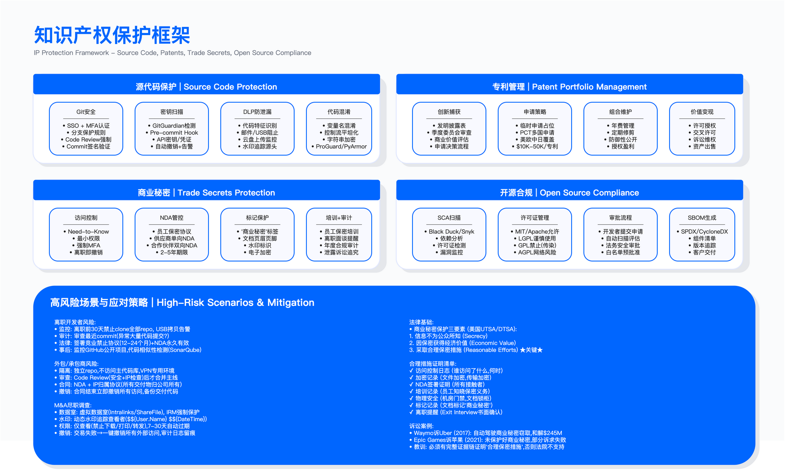

# 10.7 知识产权保护

## 概述

知识产权（Intellectual Property，IP）构成企业核心竞争力的重要组成部分，涵盖源代码、算法、专利、商业秘密等关键资产。本节围绕四类 IP 资产——源代码、专利、商业秘密与开源合规——阐述技术控制与管理流程的设计要点。知识产权保护的核心挑战在于：技术措施需与法律框架配合，且保护强度需在安全性与开发效率之间取得平衡。

*图 10.8：知识产权保护框架——源代码、专利、商业秘密、品牌四维度综合防护体系*

---

## 10.7.1 源代码保护

源代码是软件企业最核心的 IP 资产。源代码保护涉及访问控制、泄露检测、完整性保护与备份恢复四个层面。

### Git 安全控制

Git 仓库的安全控制是源代码保护的基础，应从身份认证、授权粒度、分支保护与审计日志四方面构建。

身份认证要求强制启用 SSO（单点登录）与 MFA（多因素认证），禁止使用本地账号直接访问代码仓库。授权粒度遵循最小权限原则：开发者仅访问其负责的仓库，跨团队访问需审批。分支保护要求主分支（main/master）的合并必须经过代码审查（Code Review）且 CI 流水线通过。审计日志需记录所有 git 操作（clone、push、pull、fork），保留期限应满足合规与取证需求。

适用边界：上述控制适用于所有包含生产代码的仓库；对于公开的开源项目仓库，可放宽授权粒度但仍需保留审计日志。

关键约束：分支保护规则会增加代码合并的等待时间；全量审计日志会产生存储成本，需根据仓库规模评估日志保留策略。

验证方法：定期执行权限审计，确认无过度授权账号；抽查审计日志，验证关键操作（如 force push）是否有记录。

### 密钥泄露检测

API 密钥、云服务凭证、数据库密码等敏感信息意外提交至代码仓库是常见的安全事故来源。密钥泄露检测应部署在 pre-commit hook（本地检查）和 CI 流水线（服务端检查）两个阶段。

检测工具可选用 GitGuardian、TruffleHog 或 GitHub Secret Scanning 等。检测到敏感信息后的响应流程包括：阻止 push 操作、自动撤销已泄露的凭证、通知开发者修复。

常见误区：仅在服务端部署检测而未启用 pre-commit hook，会导致敏感信息已进入 git 历史后才被发现，清理成本高。另一个误区是检测规则配置过于宽泛，将测试环境的模拟凭证（如 `test_api_key`）标记为泄露，产生大量误报。

验证方法：使用包含已知模式的测试凭证（如 AWS 格式的测试 key）验证检测规则是否生效；审计过去一段时间内的泄露事件数量与处置时效。

运行指标：密钥泄露事件数（按严重等级分层）、平均修复时间（从检测到凭证撤销的时长）。

### 代码签名

代码签名用于验证提交的完整性与来源，防止供应链攻击中的恶意代码注入。开发者使用私钥对 commit 进行签名，CI 系统在构建前验证签名有效性。

适用边界：代码签名适用于发布分支与核心库；对于频繁提交的开发分支，可仅要求合并至主分支时签名。

关键约束：私钥管理增加开发者的操作复杂度；若私钥丢失或泄露，需建立密钥轮换与吊销流程。

### 仓库备份与灾难恢复

代码仓库备份应采用增量备份（如每日）与全量备份（如每周）结合的策略。备份存储应选择异地加密存储（如 S3 Glacier 或等效服务），并定期验证恢复能力。

运行指标：备份成功率、恢复测试频率、RTO（恢复时间目标，即从灾难发生到服务恢复的时长）。

### 代码泄露防护

代码泄露防护需覆盖多种外发渠道：邮件、USB 设备、云盘、即时通讯工具等。DLP 系统可通过识别代码特征（如函数签名、专有库引用、特定注释格式）检测代码外发行为。

常见误区：DLP 规则未考虑开发者的合法需求（如在技术社区分享代码片段解决问题），会导致业务阻塞或绕过行为。另一个误区是将代码水印（在注释或字符串中嵌入开发者标识）视为完整解决方案，但水印易被删除，仅适用于泄露后追溯而非预防。

离职开发者风险管理：离职前应限制高风险操作（如 clone 全部仓库、大量数据下载），审查离职前的异常 commit 行为，签署竞业禁止协议（需符合当地劳动法规），离职后可监控公开代码平台（如 GitHub）是否出现相似代码。

第三方开发者管理：外包或承包商开发应使用独立仓库（不访问主代码库），代码合并前需经过安全与 IP 审查，签署 NDA 与 IP 归属协议，离职或合同终止后立即撤销访问权限。

### 代码混淆与加固

代码混淆通过增加逆向工程难度来保护核心算法 IP。常见混淆技术包括：名称混淆（变量 / 函数名替换为无意义字符）、控制流混淆（插入无用分支干扰逻辑分析）、字符串加密（加密字符串常量）、反调试检测（检测调试器并阻止运行）。

适用边界：代码混淆主要适用于客户端代码（Web 前端、移动 App）、核心算法（如 AI 模型推理逻辑）、软件授权检查模块。服务端代码通常无需混淆，因其不直接暴露给外部。

关键约束：所有混淆技术均可被逆向（只是增加时间成本）；混淆可能影响运行性能；混淆后的代码难以调试，生产环境问题排查成本增加。

常见误区：将代码混淆视为完整的 IP 保护方案会忽略逆向工程的可行性。另一个误区是对所有代码一律混淆，增加了维护复杂度，正确做法是仅对核心算法混淆、非核心代码保持可读性。

---

## 10.7.2 专利与商业秘密管理

专利与商业秘密是保护技术创新的两种法律途径，选择取决于技术特性与商业策略。

### 专利与商业秘密的决策框架

专利通过公开技术细节换取法定独占权（通常为申请日起计算若干年，具体年限因司法辖区而异）。专利的优势在于法律保护力度强、可通过授权获得收益、构成竞争壁垒；劣势在于技术细节公开后竞争对手可学习、申请成本较高、保护范围受地域限制。专利适用于可被逆向工程的发明（如硬件设计、化学配方）。

商业秘密通过保密获取竞争优势，无需公开、无期限限制（只要保密成功）、无地域限制。劣势在于一旦泄露即失去保护、侵权举证困难、竞争对手独立开发相同技术合法。商业秘密适用于难以逆向工程的软件算法、客户清单、制造工艺等。

决策要点：技术是否容易被逆向工程？若容易则倾向专利；技术生命周期是否超过专利保护期限？若超过则倾向商业秘密；是否计划通过授权获得收益？若是则需专利。

### 商业秘密保护的法律要求

商业秘密获得法律保护需满足三项要件：信息不为公众所知（秘密性）、因保密而具有经济价值（价值性）、权利人采取了合理保密措施（合理努力）。

“合理保密措施”是诉讼中的关键举证点，通常包括：限制访问（仅 need-to-know 人员可访问）、签署保密协议（所有接触者签署 NDA）、物理安全（锁定服务器机房与文档柜）、数字安全（加密、DLP、审计）、文档标记（标注“商业秘密——禁止披露”）、员工培训（告知商业秘密政策）、离职面谈（提醒持续保密义务）。

常见误区：仅依赖技术措施（如加密）而未建立配套的管理流程（如 NDA 签署、访问审批），在法律诉讼时难以证明“合理努力”。另一个误区是将所有内部信息笼统标记为“商业秘密”，这会稀释真正核心秘密的保护力度，且增加员工合规负担。

### 专利组合管理

专利组合管理包括创新识别、申请策略、维护与变现四个环节。

创新识别：建立发明披露流程，鼓励工程师提交发明披露表（Invention Disclosure Form），由专利委员会评估商业价值，决定申请专利、作为商业秘密保护或防御性公开（公开发表以阻止他人申请）。

申请策略：可先提交临时申请（Provisional Application）快速占位，后续在规定期限内提交正式申请；对于国际市场，可通过专利合作条约（PCT）一次申请，在规定期限内选择进入具体国家。

维护与修剪：专利维持需支付年费，应定期审查专利组合，放弃非核心专利以节省成本。

变现路径：专利可通过授权（收取专利费）、交叉许可（与其他专利持有人互换权利以避免诉讼）、侵权主张（对侵权者提起诉讼）或出售（转让专利所有权）实现价值。

---

## 10.7.3 保密协议（NDA）管理

保密协议（Non-Disclosure Agreement，NDA）是知识产权保护的法律基础。NDA 的有效管理需覆盖协议类型选择、关键条款设计与生命周期管理。

### NDA 类型

双向 NDA（Mutual NDA）：双方互相交换机密信息，双方均承担保密义务，适用于商业合作谈判。

单向 NDA（One-Way NDA）：仅一方披露信息，接收方承担保密义务，适用于供应商、外包开发商、顾问等场景。

员工保密协议：入职时签署，覆盖员工接触的所有公司信息，保密义务通常延续至离职后若干年（对商业秘密可约定永久）。

### NDA 关键条款

机密信息定义：宜采用宽泛定义配合具体示例，既覆盖未来可能的信息类型，又提供明确的判断指引。

排除条款：通常排除已公开信息、接收方先前已知信息、独立开发信息、法律强制披露（但需提前通知）。

保密义务：不得向第三方披露、仅用于约定目的、采取合理保密措施、禁止逆向工程（适用于软件）。

期限与终止：合作期间保密义务有效；合同终止后，保密义务通常延续若干年（商业秘密可约定永久）；终止时需返还或销毁所有机密材料。

救济条款：约定违约救济（禁令、损害赔偿），因机密信息泄露的损失难以量化，通常不设违约金上限。

管辖条款：约定适用法律与争议管辖法院。

### NDA 生命周期管理

签署阶段：使用法务批准的标准模板，减少逐案谈判；非标准条款需法务审查；采用电子签名加速流程。

跟踪管理：集中存储（合同生命周期管理系统或文档库），维护元数据（对方公司、签署日期、到期日、续约提醒），支持按公司名 / 项目快速检索。

到期管理：到期前提前提醒（如 90 天），决策续约、终止或依合同自动续约；到期后确认机密信息已返还或销毁。

审计：定期检查所有外部合作方是否已签署 NDA，员工是否了解 NDA 义务，发现泄露时的诉讼启动流程是否就绪。

运行指标：NDA 覆盖率（已签署 NDA 的外部合作方占比）、到期前续约率、到期后材料返还确认率。

---

## 10.7.4 开源软件合规

开源软件（Open Source Software，OSS）的使用涉及许可证合规、安全漏洞与供应链风险，需建立系统化的管理流程。

### 开源许可证分类

宽松许可证（MIT、Apache 2.0、BSD）：义务仅限于保留版权声明与免责声明，几乎无使用限制，适用于商业产品。

弱 Copyleft 许可证（LGPL、MPL）：修改开源库本身需开源，但应用层代码可闭源；动态链接 LGPL 库通常不触发开源义务。使用时需谨慎评估链接方式。

强 Copyleft 许可证（GPL v2 / v3、AGPL）：整个项目（包括衍生作品）必须开源（传染性）；AGPL 进一步要求网络服务（SaaS）也需提供源代码。商业产品应避免使用，或仅在独立进程中使用并确保隔离。

### 开源软件风险

许可证合规风险：违反 GPL 等 Copyleft 许可证可能导致被迫开源商业代码。缓解措施：使用 SCA（软件成分分析）工具扫描所有依赖，建立开源组件使用审批流程。

安全漏洞风险：开源组件可能包含已知漏洞（如 Log4Shell 类事件）。缓解措施：SCA 工具持续监控，及时更新修补。

维护风险：开源项目可能停止维护，导致无法获得安全更新。缓解措施：评估社区活跃度，对关键依赖维护内部 fork。

知识产权侵权风险：开源库可能包含侵权代码。缓解措施：尽职调查，合同中要求供应商提供侵权赔偿条款（indemnification）。

### 开源管理流程

组件清单（SBOM）：使用 SCA 工具（如 Black Duck、Snyk、FOSSA 等）扫描代码库与依赖文件，生成软件物料清单（SBOM），格式可采用 SPDX 或 CycloneDX。

审批工作流：开发者提交开源组件使用申请，SCA 工具自动扫描许可证与漏洞，高风险许可证（如 GPL、AGPL）需法务 / 安全审批，批准后加入白名单；MIT、Apache 等宽松许可证可预批准。

持续监控：定期（如每日）扫描依赖更新，新发现的 CVE 漏洞自动创建修复工单，跟踪修复进度（升级版本或替换组件）。

常见误区：仅在项目初期扫描开源组件而未建立持续监控，会导致后续引入的组件或新发现的漏洞被遗漏。另一个误区是预批准白名单过于宽泛（如包含 LGPL），未评估具体使用场景（静态链接 vs 动态链接）的合规影响。

验证方法：定期审计 SBOM 的完整性（是否覆盖所有生产依赖）；抽查高风险组件的审批记录；模拟 GPL 合规审计场景，验证组织是否能提供合规证据。

运行指标：SBOM 覆盖率（已扫描项目占比）、高危漏洞平均修复时间、许可证合规违规事件数。

---

## 本节小结

知识产权保护需要技术措施与法律框架的协同配合。源代码保护的核心是访问控制、泄露检测与混淆加固的分层防御；专利与商业秘密的选择取决于技术可逆向性与商业策略；NDA 是外部合作中保护机密信息的法律基础，需建立完整的生命周期管理；开源合规的关键在于 SBOM 管理、许可证审批与持续漏洞监控。

关键决策点：源代码保护强度需在安全性与开发效率间取得平衡；专利与商业秘密的选择需评估技术可逆向性与生命周期；开源组件使用需评估许可证类型与使用场景的合规影响。

验证要点：定期开展权限审计与密钥泄露检测演练；确保商业秘密保护的“合理努力”证据链完整性；持续跟踪 SBOM 覆盖率与许可证合规审计。

---

## 导航

**[← 上一节：10.6 移动与远程办公安全](./10.6_mobile_remote_work_security.md)** | **[返回章节目录](./README.md)** | **[下一节：10.8 信息保护运营 →](./10.8_information_protection_operations.md)**

---

**© 2025 AI-ESA Project. Licensed under CC BY-NC-SA 4.0**

